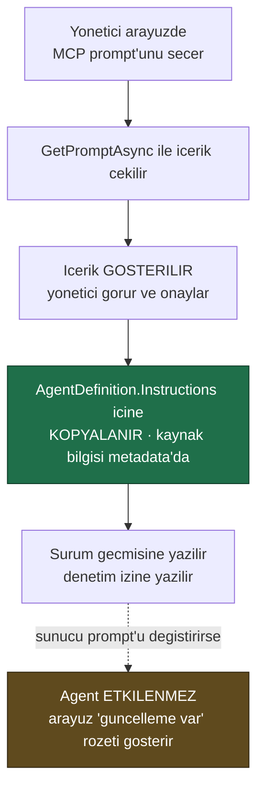

# Faz 22 — MCP Derinleşmesi: Prompts, Resources ve OAuth

> **Durum:** 📋 Planlandı
> **Kaynak:** [BEYIN-FIRTINASI.md](BEYIN-FIRTINASI.md) · **F-28**, **F-29**
> **Önkoşul:** Yok (Faz 9 önerilir — uzak içerik almak Admin yetkisidir)
> **Paketler:** `AgentPrism.Mcp`, `.Abstractions`, `.PostgreSql`, `.AspNetCore`, `.UI`
> **Yeni paket:** Yok · **Migration:** 0013 (planlanan sırada)

---

## Bu Faza Başlarken

1. [`06-GOZLEMLENEBILIRLIK.md`](06-GOZLEMLENEBILIRLIK.md) — MCP bölümü, `AgentPrism.Mcp` yapısı
2. [`KARARLAR.md`](KARARLAR.md) — **K-057** (`.Core` paketi), **K-058** (stdio yok), **K-059** (sır anahtar adıyla), **K-060** (ad öneki)
3. [`MIMARI.md`](MIMARI.md) — bölüm 7, MCP sınırı tablosu
4. Bu doküman

---

## Amaç

Faz 6 MCP'nin yalnız **tool'larını** kullanıyor. Protokolün diğer yarısı —
prompts ve resources — kullanılmıyor. Kimlik doğrulama da tek bir statik
`Authorization` başlığıyla sınırlı.

---

## Doğrulanmış API (`ModelContextProtocol.Core` 2.0.0)

```csharp
// Prompts
ValueTask<IList<McpClientPrompt>> McpClient.ListPromptsAsync(RequestOptions?, CancellationToken);
ValueTask<GetPromptResult> McpClient.GetPromptAsync(string name, IReadOnlyDictionary<string, object?>? args, ...);
sealed class McpClientPrompt {
    string Name { get; }  string? Description { get; }  string? Title { get; }
    Prompt ProtocolPrompt { get; }
    ValueTask<GetPromptResult> GetAsync(IEnumerable<KeyValuePair<string, object?>>? arguments, ...);
}
sealed class GetPromptResult { /* PromptMessage listesi */ }
sealed class PromptArgument { /* ad, aciklama, zorunlu mu */ }

// Resources
ValueTask<IList<McpClientResource>> McpClient.ListResourcesAsync(RequestOptions?, CancellationToken);
ValueTask<IList<McpClientResourceTemplate>> McpClient.ListResourceTemplatesAsync(...);
ValueTask<ReadResourceResult> McpClient.ReadResourceAsync(string uri, ...);
sealed class McpClientResource {
    string Uri { get; }  string Name { get; }  string? MimeType { get; }  string? Description { get; }
    ValueTask<ReadResourceResult> ReadAsync(RequestOptions?, CancellationToken);
}
sealed class ReadResourceResult { /* TextResourceContents | BlobResourceContents */ }

Task<IAsyncDisposable> McpClient.SubscribeToResourceAsync(string uri,
    Func<ResourceUpdatedNotificationParams, CancellationToken, ValueTask> handler, ...);
Task McpClient.UnsubscribeFromResourceAsync(string uri, ...);

ServerCapabilities McpClient.ServerCapabilities { get; }   // PromptsCapability · ResourcesCapability

// OAuth
sealed class ClientOAuthOptions {
    string? ClientId { get; set; }  string? ClientSecret { get; set; }
    IEnumerable<string>? Scopes { get; set; }  Uri? RedirectUri { get; set; }
    AuthorizationRedirectDelegate? AuthorizationRedirectDelegate { get; set; }
    Func<AuthorizationCallbackContext, CancellationToken, Task<AuthorizationResult>>? AuthorizationCallbackHandler { get; set; }
    DynamicClientRegistrationOptions? DynamicClientRegistration { get; set; }
    ITokenCache? TokenCache { get; set; }
    Uri? ClientMetadataDocumentUri { get; set; }
}
HttpClientTransportOptions.OAuth = new ClientOAuthOptions { ... };
```

**Yetenek denetimi zorunludur:** `ServerCapabilities.Prompts` / `.Resources`
`null` ise o sunucuya prompt/resource isteği **gönderilmez**. Faz 6'nın tool
keşfi de benzer biçimde davranmalıdır.

---

## 22.1 — Prompts: 🚨 Uzak Sunucu Agent'ın Talimatını Yazamaz

Bir MCP prompt'unu agent talimatı olarak kullanmak cazip görünür. Ama sonucu
şudur: **uzak bir sunucu, sizin agent'ınızın davranışını çalışma anında
değiştirebilir.** Bu bir prompt injection yüzeyidir ve K2'nin koruduğu şeyin
başka bir yoldan delinmesidir.

**Karar: prompt içeriği kayıt anında anlık görüntü olarak alınır (snapshot),
çalışma anında çekilmez.**



- Prompt argümanları (`PromptArgument`) varsa arayüzde doldurulur
- Kaynak bilgisi `AgentDefinition.Metadata` içinde saklanır:
  `mcp.prompt.server`, `mcp.prompt.name`, `mcp.prompt.hash`
- Sunucudaki içerik değişince arayüz **rozet** gösterir; güncelleme yöneticinin
  açık eylemidir
- Denetim izine `mcp.prompt.import` olarak yazılır

---

## 22.2 — Resources: İki Mod

### Mod A — Tanımda listelenen kaynaklar (öngörülebilir)

```csharp
public sealed record AgentDefinition
{
    // ...mevcut uyeler
    public IReadOnlyList<string> McpResourceUris { get; init; } = [];   // "{sunucu}:{uri}"
}
```

Çalıştırma başında okunur ve bağlama eklenir. Öngörülebilirdir; her çalıştırmada
aynı kaynaklar girer. Boyut sınırı uygulanır (kaynak başına 64 KB, toplam
256 KB); aşan **kırpılır** ve kırpıldığı bağlamda belirtilir.

### Mod B — Tool olarak okuma (esnek)

Her MCP sunucusu için `{sunucu}_read_resource` adında bir tool üretilir
(K-060 ad kuralı). Model hangi kaynağı okuyacağına kendisi karar verir.

- Tool `RequiresApproval = true` ile kaydedilir — MCP tool'larının varsayılanı
  zaten budur
- Yalnız sunucunun `ListResourcesAsync` ile bildirdiği URI'ler okunabilir;
  serbest URI **reddedilir** (aksi hâlde bu bir SSRF aracıdır)
- `ResourceTemplate` desteklenirse şablon argümanları doğrulanır

### Abonelik

`SubscribeToResourceAsync` yalnız **Mod A'daki** kaynaklar için kurulur ve tek
işi önbelleği geçersiz kılmaktır. Bildirim geldiğinde içerik yeniden okunmaz;
bir sonraki çalıştırmada taze okunur. Böylece boşta duran bir kurulum, uzak
sunucu her değiştiğinde trafik üretmez.

---

## 22.3 — OAuth

### Sır kuralı değişmez

```sql
ALTER TABLE {schema}.mcp_servers ADD COLUMN oauth_enabled                    boolean NOT NULL DEFAULT false;
ALTER TABLE {schema}.mcp_servers ADD COLUMN oauth_client_id                  text;
ALTER TABLE {schema}.mcp_servers ADD COLUMN oauth_client_secret_configuration_key text;  -- ANAHTAR ADI
ALTER TABLE {schema}.mcp_servers ADD COLUMN oauth_scopes                     text;
ALTER TABLE {schema}.mcp_servers ADD COLUMN oauth_authorization_mode         smallint NOT NULL DEFAULT 0;
```

`client_id` bir sır değildir ve saklanır. `client_secret` **saklanmaz**;
yapılandırma anahtarının adı saklanır (K-059).

**Token'lar hiçbir zaman veritabanına yazılmaz.** `ITokenCache` uygulaması
bellek içidir ve süreç ömrüyle sınırlıdır. Süreç yeniden başlarsa yeniden
yetkilendirme gerekir. Bu bilinçli bir kısıttır: erişim ve yenileme
token'larını kalıcılaştırmak, veritabanı yedeğini bir sır deposuna çevirir.

### İki mod

| Mod | Nasıl | Kullanım |
|-----|-------|----------|
| **0 — İstemci kimlik bilgileri** | `ClientId` + yapılandırmadaki secret; kullanıcı etkileşimi yok | Sunucu-sunucu; **öncelikli hedef** |
| **1 — Yetkilendirme kodu** | Yönetici arayüzden başlatır, sağlayıcıya yönlendirilir, geri döner | Kullanıcı adına erişim |

Mod 1 için yeni uçlar:

```
POST {prefix}/api/mcp-servers/{name}/oauth/start      → yonlendirme adresi doner (Admin)
GET  {prefix}/api/mcp-servers/{name}/oauth/callback   → saglayici buraya doner
```

Geri dönüş ucu **CSRF'ye karşı `state` parametresi** kullanır ve `state`
bellekte kısa ömürlü tutulur. Callback ucu erişim katmanlarının dışındadır
(sağlayıcı token taşımaz) ama yalnız geçerli bir `state` ile iş yapar.

> Mod 1 karmaşıktır ve barındırma modeline (dış erişilebilir bir geri dönüş
> adresi) bağlıdır. Kullanıcı yalnız Mod 0 isterse faz kapsamı küçülür ve
> callback ucu **hiç eklenmez**.

---

## 22.4 — Uçlar ve Arayüz

| Uç | Rol | Ne yapar |
|----|-----|----------|
| `GET {prefix}/api/mcp-servers/{name}/prompts` | Admin | Prompt listesi |
| `POST {prefix}/api/mcp-servers/{name}/prompts/{prompt}` | Admin | İçeriği çeker (argümanlarla) |
| `GET {prefix}/api/mcp-servers/{name}/resources` | Reader | Kaynak listesi |
| `GET {prefix}/api/mcp-servers/{name}/resources/read?uri=…` | Operator | Kaynağı okur |
| `POST {prefix}/api/mcp-servers/{name}/oauth/start` | Admin | Mod 1 |

Arayüz: **MCP** ekranı (Faz 6) genişler — sunucu detayında üç sekme: Tools,
Prompts, Resources. Prompt'tan agent'a aktarma düğmesi; kaynak önizleme;
OAuth durumu ve "yetkilendir" düğmesi.

Bütçe hedefi: **+5 KB gzip'ten az**.

---

## Testler

| Proje | Yeni test |
|-------|-----------|
| `AgentPrism.Core.UnitTests` / `Mcp` | Yetenek yoksa istek gönderilmez; kaynak boyut kırpma; serbest URI reddi; prompt anlık görüntüsü ve hash |
| `AgentPrism.PostgreSql.IntegrationTests` | Yeni `mcp_servers` sütunları; **secret sızmaması** |
| `AgentPrism.AspNetCore.FunctionalTests` | Uçlar, roller, `state` doğrulaması, yanıtlarda sır yok |
| `AgentPrism.Ui.E2ETests` | Prompt aktarma; kaynak önizleme |

**Gerçek kanıt:** gerçek bir MCP sunucusuna (ör. herkese açık bir referans
sunucu) bağlanılır; prompt ve kaynak listesi ile bir okuma sonucu dokümana
yazılır.

---

## Bu Fazda Verilecek Kararlar

1. **Prompt içeriği anlık görüntü olarak alınır, çalışma anında çekilmez** —
   uzak sunucu agent davranışını değiştiremez.
2. **Kaynak okuma yalnız bildirilen URI'lerle** — serbest URI SSRF'dir.
3. **OAuth token'ları kalıcılaştırılmaz** — veritabanı sır deposu değildir.
4. **`client_secret` yapılandırma anahtarı adıyla saklanır** (K-059).
5. **Abonelik yalnız önbellek geçersizleştirir**, içerik çekmez.

---

## Açık Sorular

1. **Mod 1 (yetkilendirme kodu) bu fazda mı?** Barındırma modeline bağımlılık
   getirir. Öneri: **Mod 0 ile başla**; Mod 1 kullanıcı isterse.
2. **Kaynaklar `attachments` tablosuna kopyalansın mı?** Denetim izi için
   değerli, hacim için maliyetli. Öneri: **hayır** — okunan içerik yalnız
   çalıştırma olaylarına özet olarak yazılır.
3. **Prompt güncellemesi otomatik uygulanabilsin mi (opt-in)?** Öneri:
   **hayır** — anlık görüntü kararının anlamı budur.

---

## Bitiş Ölçütleri (DoD)

- [ ] Prompt listelenip agent talimatına aktarılıyor; kaynak bilgisi metadata'da
- [ ] Sunucudaki prompt değişince arayüz rozet gösteriyor, agent değişmiyor
- [ ] Mod A kaynakları çalıştırma bağlamına giriyor; boyut sınırı çalışıyor
- [ ] `{sunucu}_read_resource` tool'u onay isteyerek çalışıyor
- [ ] Yetenek bildirmeyen sunucuya istek gönderilmiyor
- [ ] OAuth Mod 0 ile korumalı bir sunucuya bağlanılıyor
- [ ] Hiçbir uçta ve kayıtta sır yok; token veritabanında yok
- [ ] Dört doğrulama kapısı sıfır uyarı; sır taraması boş

---

## Riskler

| Risk | Önlem |
|------|-------|
| **Prompt injection** (uzak sunucu talimatı ele geçirir) | Anlık görüntü + yönetici onayı + denetim izi |
| Kaynak okuma SSRF aracı olur | Yalnız bildirilen URI'ler; şema denetimi |
| Token sızması | Bellek içi önbellek; veritabanına yazılmaz; loglanmaz |
| Kaynak içeriği bağlamı şişirir | Boyut sınırı + kırpma bildirimi + Faz 13 sıkıştırma |
| OAuth akışı barındırmaya bağımlı | Mod 0 önce; Mod 1 isteğe bağlı |

---

## Sonraki Faza Devir Notu

- Faz 13'ün `TextSearchProvider`'ı MCP kaynaklarını arama kaynağı olarak
  kullanabilir; bu, ayrı bir değerlendirme ister.
- Faz 25 (saklama) MCP kaynak önbelleklerini etkilemez — önbellek bellektedir.
