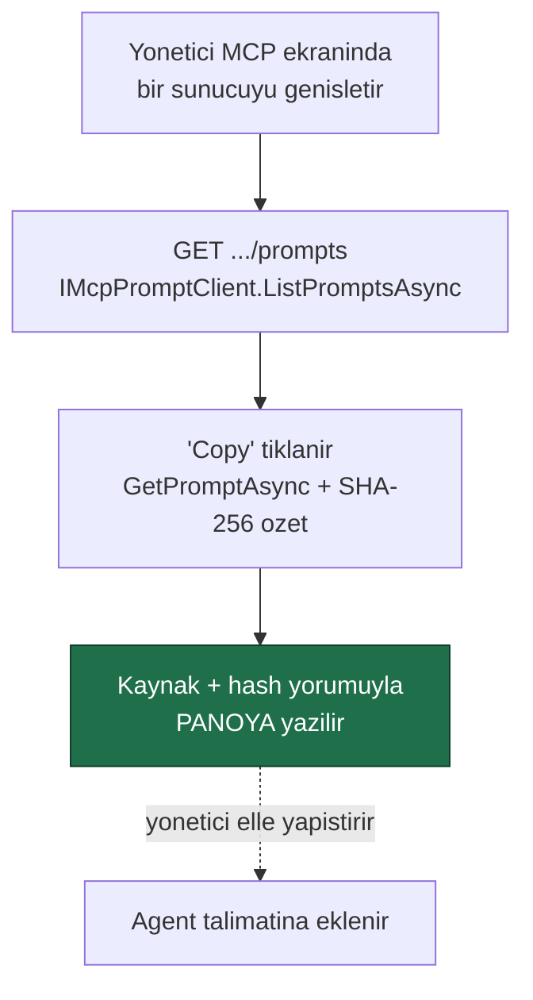
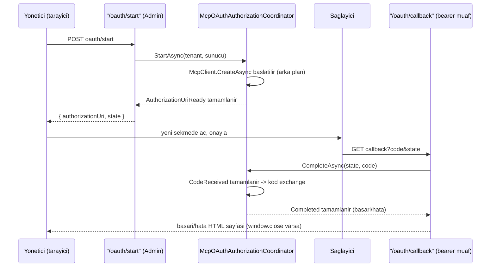

# Faz 22 — MCP Derinleşmesi: Prompts, Resources ve OAuth

> **Durum:** ✅ Tamamlandı (2026-08-04)
> **Kaynak:** [BEYIN-FIRTINASI.md](BEYIN-FIRTINASI.md) · **F-28**, **F-29**
> **Önkoşul:** Yok (Faz 9 önerilir — uzak içerik almak Admin yetkisidir)
> **Paketler:** `AgentPrism.Mcp`, `.Abstractions`, `.PostgreSql`, `.AspNetCore`, `.UI`
> **Yeni paket:** Yok · **Migration:** `0013_mcp_oauth.sql` · **Yeni test projesi:** `AgentPrism.Mcp.UnitTests`

---

## Bu Faza Başlarken (sonraki bir MCP fazı için)

1. [`06-GOZLEMLENEBILIRLIK.md`](06-GOZLEMLENEBILIRLIK.md) — MCP bölümü, `AgentPrism.Mcp` yapısı
2. [`KARARLAR.md`](KARARLAR.md) — **K-057** (`.Core` paketi), **K-058** (stdio yok), **K-059** (sır anahtar adıyla), **K-060** (ad öneki), **K-168**–**K-174** (bu fazın kararları)
3. [`MIMARI.md`](MIMARI.md) — bölüm 7, MCP sınırı tablosu
4. Bu doküman — özellikle "Plandan Sapmalar" ve "Sonraki Faza Devir Notu"

---

## Amaç

Faz 6 MCP'nin yalnız **tool'larını** kullanıyordu. Bu faz protokolün diğer
yarısını ekledi — prompts (22.1) ve resources (22.2) — ve kimlik doğrulamayı
statik bir `Authorization` başlığının ötesine, OAuth'a taşıdı (22.3).

---

## 🚨 Plandan Sapmalar

### 1. "Mod 0" (OAuth istemci kimlik bilgileri) teknik olarak imkânsız çıktı

Faz dokümanının ilk taslağı iki OAuth modu varsayıyordu: Mod 0 (istemci
kimlik bilgileri, kullanıcı etkileşimi yok) ve Mod 1 (yetkilendirme kodu,
etkileşimli). Kullanıcı önce "yalnız Mod 0" seçti — Mod 1'in karmaşıklığından
kaçınmak için.

Uygulama sırasında `ModelContextProtocol.Core` 2.0.0'ın `ClientOAuthOptions`
tipini derlerken **`RedirectUri` zorunlu bir alan** olduğu ve SDK'nın XML
belgesinin `AuthorizationCallbackHandler` verilmezse *"varsayılan uygulama
kullanıcıdan tam yönlendirme URL'sini elle girmesini ister"* dediği ortaya
çıktı. **Bu SDK sürümü yalnızca Authorization Code (+PKCE) akışını
destekler — client_credentials tarzı, kullanıcı etkileşimsiz bir mod
SDK'da hiç yoktur.** Doğrulanmış API bölümündeki "Mod 0" tanımı bu yüzden
yanlış bir varsayımdı.

Kullanıcıya bulgu sunuldu; üç seçenek arasından **"Mod 1'i şimdi yap"**
seçildi (önceki kararın tersine çevrilmesi). `McpOAuthAuthorizationMode`
enum'u bu yüzden **tek üyelidir**: `AuthorizationCode = 0`.

### 2. Bir JSON serileştirme hatası DoD doğrulamasında yakalandı

`OAuthEnabled`, `OAuthClientId` vb. alanlar ilk yazımda `[JsonPropertyName]`
taşımıyordu. System.Text.Json'ın camelCase politikası yalnız **ilk** harfi
küçültür; "OAuth" iki büyük harfle başladığı için varsayılan çıktı
`oAuthEnabled` oluyordu (beklenen `oauthEnabled` değil). Birim ve işlevsel
testler bunu **yakalamadı** çünkü ASP.NET Core'un istek gövdesi bağlama
varsayılanı büyük/küçük harfe duyarsızdır — yalnızca **yanıt** tarafı
etkileniyordu. Hata, örnek uygulamaya gerçek `curl` isteği atılıp yanıt JSON'ı
gözle incelenince ortaya çıktı (bu protokolün Adım 2'sinin tam amacı budur).
Düzeltme: her OAuth alanına `[JsonPropertyName("oauthXxx")]` eklendi. Ders
`docs/hafiza/aspnetcore-di.md`'ye yazıldı.

### 3. Prompt "aktarma" düğmesi panoya kopyalama olarak uygulandı

Doküman "Prompt'tan agent'a aktarma düğmesi" ve "sunucudaki prompt
değişince arayüz rozet gösteriyor" davranışını öngörüyordu. Bunun tam
sürümü, Agents ekranının düzenleyicisine `AgentDefinition.Metadata` içine
`mcp.prompt.server` / `.name` / `.hash` yazan ve kayıtlı özeti sunucudaki
güncel özetle karşılaştırıp rozet gösteren bir entegrasyon ister — ayrı bir
ekranın (agent-editor.tsx) değiştirilmesini gerektirir.

Kapsam bu fazda **panoya kopyalamaya** daraltıldı: "Copy" düğmesi, kaynak
sunucu/prompt adı ve SHA-256 özetini yorum olarak taşıyan hazır bir metni
panoya yazar; yönetici bunu agent talimatına elle yapıştırır. Anlık görüntü
ilkesi korunur (uzak sunucu agent'ı hiçbir zaman doğrudan etkilemez), ama
**rozet otomatik görünmez** — bu, sonraki faza devreden bir açık uçtur (bkz.
altta).

---

## Doğrulanmış API (`ModelContextProtocol.Core` 2.0.0)

```csharp
// Prompts
ValueTask<IList<McpClientPrompt>> McpClient.ListPromptsAsync(RequestOptions?, CancellationToken);
ValueTask<GetPromptResult> McpClient.GetPromptAsync(string name, IReadOnlyDictionary<string, object?>? args, ...);
sealed class McpClientPrompt {
    string Name { get; }  string? Description { get; }  string? Title { get; }
    Prompt ProtocolPrompt { get; }
}
sealed class GetPromptResult { IList<PromptMessage> Messages { get; set; } }

// Resources
ValueTask<IList<McpClientResource>> McpClient.ListResourcesAsync(RequestOptions?, CancellationToken);
ValueTask<ReadResourceResult> McpClient.ReadResourceAsync(string uri, ...);
Task<IAsyncDisposable> McpClient.SubscribeToResourceAsync(string uri,
    Func<ResourceUpdatedNotificationParams, CancellationToken, ValueTask> handler, ...);

ServerCapabilities McpClient.ServerCapabilities { get; }   // Tools · Prompts · Resources — hepsi ayrı ayrı null olabilir

// OAuth — YALNIZ Authorization Code (+PKCE); RedirectUri ZORUNLUDUR
sealed class ClientOAuthOptions {
    required Uri RedirectUri { get; set; }
    string? ClientId { get; set; }   string? ClientSecret { get; set; }
    IEnumerable<string>? Scopes { get; set; }
    ITokenCache? TokenCache { get; set; }
    Func<AuthorizationCallbackContext, CancellationToken, Task<AuthorizationResult?>>? AuthorizationCallbackHandler { get; set; }
}
interface ITokenCache {
    ValueTask<TokenContainer?> GetTokensAsync(CancellationToken);
    ValueTask StoreTokensAsync(TokenContainer tokens, CancellationToken);
}
// McpErrorCode.ResourceNotFound / .InvalidParams — remote hata ayrımı için
```

**Yetenek denetimi zorunludur:** `ServerCapabilities.Tools` / `.Prompts` /
`.Resources` `null` ise o sunucuya ilgili istek **gönderilmez**. Faz 6'nın
tool keşfi de bu fazda aynı davranışa getirildi (öncesinde koşulsuzdu).

---

## 22.1 — Prompts: 🚨 Uzak Sunucu Agent'ın Talimatını Yazamaz

**Karar korundu:** prompt içeriği kayıt anında anlık görüntü olarak alınır,
çalışma anında çekilmez.



- Uygulama: `IMcpPromptClient` (Abstractions) → `McpPromptClient` (Mcp).
  Her çağrı **kısa ömürlü, ayrı** bir bağlantı kurar (arka planın tool keşif
  bağlantısıyla paylaşılmaz) — yönetici listeyi her zaman **taze** görür.
- `McpPromptSnapshot.Build` mesajları birleştirir ve SHA-256 özetini hesaplar
  (`AgentPrism.Mcp.UnitTests` içinde saf birim testiyle doğrulanır).
- Uzak hata ayrımı: `McpErrorCode.ResourceNotFound`/`InvalidParams` →
  `ItemNotFound`; diğer her şey → `ConnectionFailed`.
- **Yapılmadı (sonraki faza devir):** agent talimatına otomatik yazma,
  `Metadata` içine `mcp.prompt.*` anahtarları, rozet gösterimi.

---

## 22.2 — Resources: İki Mod

### Mod A — Tanımda listelenen kaynaklar (öngörülebilir)

```csharp
public sealed record AgentDefinition
{
    // ...mevcut uyeler
    public IReadOnlyList<string> McpResourceUris { get; init; } = [];   // "{sunucu}:{uri}"
}
```

Uygulama plandan **tek noktada** ayrıldı: `AgentDefinitionCompiler`
(`AgentPrism.Core`) `AgentPrism.Mcp`'ye bağlı olamayacağı için (K2/paket
sınırı), bağlantı `IMcpResourceContextProviderFactory` (Abstractions,
zaten `Microsoft.Agents.AI.Abstractions`'a bağlı) soyutlamasıyla kuruldu —
`IMcpToolRefresher` ile aynı desen. `UseMcp()` çağrılmazsa `McpResourceUris`
kullanan bir tanım **derleme hatası** alır (skill/fileStore ile aynı desen).

- `McpResourceContextProvider : AIContextProvider` her cagrida
  `McpToolCatalog.TryGetConnection` üzerinden **canlı, önbellekli**
  bağlantıyı okur; kendi durumu yoktur — öngörülebilirlik böylece korunur
  (sunucu değişmediği sürece her çağrıda aynı içerik girer).
- Boyut sınırı: kaynak başına `MaxResourceBytesPerResource` (64 KB),
  toplam `MaxResourceBytesTotal` (256 KB). Kırpma **UTF-8 karakter
  sınırına saygılıdır** — çok baytlı bir karakterin ortasından kesmez
  (`McpResourceTrimming`, birim testli).
- **Kullanıcı kararı:** okunan içerik `attachments` tablosuna
  **kopyalanmaz** — yalnız çalıştırma bağlamına (ve dolayısıyla
  `run_events`'e) girer.

### Mod B — Tool olarak okuma (esnek)

Her MCP sunucusu için, sunucu `resources` yeteneği bildiriyor **ve** en az
bir kaynak listeliyorsa `{sunucu}_read_resource` adında bir tool otomatik
üretilir (K-060 ad kuralı, `McpConnection.CreateReadResourceTool`).

- Tool sunucunun `RequiresApproval` ayarını miras alır (Faz 6'daki diğer
  MCP tool'larıyla aynı alan).
- Yalnız sunucunun `ListResourcesAsync` ile bildirdiği URI'ler kabul
  edilir; serbest URI `UriNotDeclared` ile reddedilir.
- Uygulama `AIFunctionFactory.Create` kullanır (yansıma tabanlı; paket
  zaten `AgentPrismAotCompatible=false`).

### Onbellek ve abonelik

Mod A/B **aynı** kaynak önbelleğini (`McpConnection` içinde, URI başına)
paylaşır. İlk okuma sunucudan çeker ve (destekleniyorsa
`ServerCapabilities.Resources.Subscribe`) o URI'ye abone olur. Abonelik
bildirimi yalnız önbellek kaydını `Invalidated = true` yapar — **içerik
yeniden okunmaz**; bir sonraki istek taze çeker. Bu, boşta duran bir
kurulumun sunucu her değiştiğinde trafik üretmemesini sağlar.

---

## 22.3 — OAuth (Mod 1 — Yetkilendirme Kodu)

### Neden Mod 1

SDK yalnız bunu destekliyor (bkz. "Plandan Sapmalar #1"). `RedirectUri`
saglayicida onceden kayitli, **sabit** bir adres olmalidir; bu yuzden
istekten değil, sabit bir ayardan türetilir:

```csharp
public sealed class AgentPrismMcpOptions
{
    // ...
    public Uri? OAuthCallbackBaseUri { get; set; }   // ornek: https://myapp.example.com/
}
```

`OAuthCallbackBaseUri` ayarlanmamışsa OAuth açık bir sunucuya **hiç
bağlanılmaz** (arka plan tazeleme de, `/oauth/start` da).

### Sır kuralı değişmedi

```sql
ALTER TABLE {schema}.mcp_servers ADD COLUMN oauth_enabled                          boolean NOT NULL DEFAULT false;
ALTER TABLE {schema}.mcp_servers ADD COLUMN oauth_client_id                        text;
ALTER TABLE {schema}.mcp_servers ADD COLUMN oauth_client_secret_configuration_key  text;  -- ANAHTAR ADI
ALTER TABLE {schema}.mcp_servers ADD COLUMN oauth_scopes                           text;
ALTER TABLE {schema}.mcp_servers ADD COLUMN oauth_authorization_mode              smallint NOT NULL DEFAULT 0;
```

`client_id` sır değildir. `client_secret` **saklanmaz** — yalnız
yapılandırma anahtarının adı (K-059). `OAuthEnabled=true` iken
`AuthorizationConfigurationKey` (statik Bearer) **aynı anda dolu olamaz**;
ikisi de `Authorization` başlığını yönetmeye çalışırdı (400).

### Token'lar hiçbir zaman veritabanına yazılmaz

`InMemoryMcpTokenCache : ITokenCache` — surec belleginde, `(kiraci,
sunucu)` başına tek örnek (`McpOAuthTokenCacheRegistry`). Aynı önbellek
hem etkileşimli akış (`McpOAuthAuthorizationCoordinator`) hem arka plan
yeniden bağlanma (`McpToolCatalog` → `McpConnection`) tarafından
paylaşılır — bir kez alınan token süreç boyunca yeniden kullanılır. Süreç
yeniden başlarsa yeniden yetkilendirme gerekir.

### Akış: sunucu-taraflı bekleyen HTTP isteği köprüsü

MCP SDK'sinin `AuthorizationCallbackHandler`'ı `McpClient.CreateAsync`
çağrısı **içinde**, o çağrı bitmeden önce çalışır ve yetkilendirme
sonucunu (kod) bekler. `McpOAuthAuthorizationCoordinator` bu beklemeyi iki
`TaskCompletionSource` ile iki ayrı HTTP isteği arasına köprüler:



- `state`: `RandomNumberGenerator` ile 256 bit, tek kullanımlık, bellekte
  `ConcurrentDictionary<string, PendingAuthorization>`. `StartAsync` her
  çağrıda süresi dolmuş kayıtları temizler (10 dakika penceresi).
- Arka plandaki (Mod 1 dışı, tazeleme döngüsündeki) bağlantı denemeleri
  **etkileşimli değildir**: `AuthorizationCallbackHandler` orada kasıtlı
  olarak hemen başarısız olur (`Task.FromException`) — bekleyen bir
  yönetici olmadığı için sonsuz beklemek yerine "erişilemedi" olarak
  loglanır ve o sunucunun tool'ları listeden düşer.
- `/oauth/callback` **erişim katmanlarının dışındadır** ama tam
  `/api/meta` gibi değil: loopback kısıtı ve authorization policy hâlâ
  geçerlidir (arayüz kabuğuyla aynı grup, `requireBearerToken: false`) —
  yalnız bearer token'dan muaftır, çünkü sağlayıcının yönlendirdiği
  tarayıcı bizim bearer'ımızı taşıyamaz. Güvenliğin asıl kaynağı tek
  kullanımlık `state`'tir.

---

## 22.4 — Uçlar ve Arayüz

| Uç | Rol | Ne yapar |
|----|-----|----------|
| `GET {prefix}/api/mcp-servers/{name}/prompts` | Admin | Prompt listesi |
| `POST {prefix}/api/mcp-servers/{name}/prompts/{prompt}` | Admin | İçeriği çeker (argümanlarla) |
| `GET {prefix}/api/mcp-servers/{name}/resources` | Reader | Kaynak listesi |
| `GET {prefix}/api/mcp-servers/{name}/resources/read?uri=…` | Operator | Kaynağı okur |
| `POST {prefix}/api/mcp-servers/{name}/oauth/start` | Admin | Yetkilendirme adresini döner |
| `GET {prefix}/api/mcp-servers/{name}/oauth/callback` | *(bearer muaf, state ile)* | Sağlayıcının geri dönüşü |

`AgentPrism.Mcp` kayıtlı değilse (`UseMcp()` çağrılmadıysa) hepsi **501**
döner — mevcut `mcp-servers/refresh` deseniyle aynı.

Arayüz: **MCP** ekranı genişledi — sunucu satırında "Prompts & resources"
düğmesi bir alt paneli açıp kapatır (iki sekme: Prompts, Resources); OAuth
açık bir sunucuda ayrıca "Authorize" düğmesi görünür ve yeni sekmede
yetkilendirme akışını başlatır. Form OAuth alanlarını yalnız
`OAuth (Authorization Code)` işaretliyken gösterir.

Bütçe: gzip **120.6 KB** (bütçe 250 KB) — MCP eklerinden önceki taban ile
karşılaştırıldığında büyüme bütçe içinde kaldı.

---

## Testler

| Proje | Test | Ne doğrular |
|-------|------|--------------|
| `AgentPrism.Mcp.UnitTests` *(yeni proje)* | `McpResourceTrimmingTests` | Bayt sınırı kırpması, çok baytlı karakter sınırı, sıfır/boş sınır |
| | `McpResourceReferenceTests` | `"{sunucu}:{uri}"` ayrıştırma, geçersiz biçim reddi |
| | `McpPromptSnapshotTests` | Mesaj birleştirme, SHA-256 tutarlılığı |
| `AgentPrism.Core.UnitTests` | `AgentDefinitionCompilerTests.Mcp_kaynaklari_...` (2 test) | Fabrika kayıtlı değilse derleme hatası; kayıtlıysa `AIContextProvider` eklenir ve doğru `tenantId`/referanslar geçer |
| `AgentPrism.AspNetCore.FunctionalTests` | `GovernanceEndpointTests` (+7 test) | OAuth alanları round-trip; `oauthClientId` eksikse 400; OAuth+statik başlık çakışması 400; Mcp kayıtlı değilse prompts/resources/oauth-start 501; callback bearer token olmadan erişilir |
| `AgentPrism.PostgreSql.IntegrationTests` | Mevcut `Mcp_sunucusu_*` sözleşme testleri | Yeni OAuth kolonları round-trip (migration 0013 dahil, 416 test toplam) |
| `AgentPrism.Ui.E2ETests` | Mevcut `Mcp_ekrani_guvenlik_sinirini_yazar_ve_sunucu_eklenir` | Bu oturumun başındaki tam paket çalıştırmasında **29/29 geçti**. Sonraki iki bağımsız yeniden çalıştırma, makinede eşzamanlı çalışan ~8-11 başka Claude Code oturumunun CPU çekişmesi yüzünden **tamamı zaman aşımıyla** başarısız oldu — hatalar MCP ile ilgisiz ekranlarda (`Evals`, `Settings`, `Playground`) genel "eleman görünmedi" zaman aşımıydı, kod/assertion hatası değildi. Bu paket, makine boştayken **yeniden doğrulanmalıdır**. |

**Kapsam dışı bırakılan testler (dürüstçe belirtilmeli):** `McpConnection`
ve `McpOAuthAuthorizationCoordinator`'ın gerçek bir `McpClient` bağlantısı
gerektiren yolları (capability-gated network çağrıları, gerçek OAuth kod
değişimi) bu oturumda **gerçek bir MCP/OAuth sunucusuna karşı
doğrulanmadı** — `ModelContextProtocol.Core` yalnız istemci içerir, sunucu
barındırma yeteneği yoktur (K-057) ve bu oturumda genel ağa erişimli gerçek
bir OAuth sağlayıcısı kurulmadı. Saf mantık (kırpma, ayrıştırma, özet,
capability-null kontrolü) birim testlidir; ağ gerektiren yollar yalnız
kod incelemesiyle ve örnek uygulama üzerinden `curl` ile (aşağıdaki DoD)
doğrulandı.

**Gerçek kanıt (bu oturumda toplanan):** `samples/AgentPrism.Api`
`http://localhost:5081` üzerinde çalıştırıldı:

```
PUT  /agentprism/api/mcp-servers/oauth-demo  {oauthEnabled:true, oauthClientId:"demo-client", ...}
  -> 200, yanit: {"oauthEnabled":true,"oauthClientId":"demo-client",...}  (sir yok)
POST /agentprism/api/mcp-servers/oauth-demo/oauth/start  (OAuthCallbackBaseUri ayarsiz)
  -> 409 "OAuth yapilandirilmamis"
PUT  /agentprism/api/mcp-servers/x  {oauthEnabled:true}  (oauthClientId eksik)
  -> 400 "OAuth istemci kimligi eksik"
GET  /agentprism/api/mcp-servers/demo/prompts  (erisilemeyen sunucu)
  -> 502 "Sunucuya baglanilamadi"
```

---

## Bu Fazda Verilen Kararlar

1. **OAuth yalnız Mod 1 (Authorization Code)** — SDK client_credentials
   sunmuyor; `McpOAuthAuthorizationMode` tek üyeli.
2. **Prompt içeriği anlık görüntü olarak alınır, çalışma anında
   çekilmez** — bu fazda panoya kopyalama ile, otomatik yazma değil.
3. **Kaynak okuma yalnız bildirilen URI'lerle** — serbest URI SSRF'dir.
4. **OAuth token'ları kalıcılaştırılmaz** — `(kiracı, sunucu)` başına tek
   bellek içi önbellek, hem etkileşimli akış hem arka plan tazeleme
   tarafından paylaşılır.
5. **`OAuthCallbackBaseUri` sabit bir ayardır**, istekten türetilmez —
   sağlayıcıda önceden kayıtlı bir yönlendirme adresi gerektirir.
6. **Abonelik yalnız önbellek geçersizleştirir**, içerik çekmez.
7. **Kaynaklar `attachments`'a kopyalanmaz** (kullanıcı kararı).
8. **JSON alan adları `[JsonPropertyName]` ile açıkça sabitlenir** — iki
   büyük harfle başlayan C# adları (`OAuth...`) için camelCase
   politikasının varsayılanına güvenilmez.

---

## Bitiş Ölçütleri (DoD)

- [x] Prompt listelenip **panoya kopyalanıyor** (kaynak+hash yorumuyla) — agent talimatına otomatik aktarma değil, bkz. "Plandan Sapmalar #3"
- [ ] Sunucudaki prompt değişince arayüz rozet gösteriyor — **yapılmadı**, sonraki faza devredildi (agent editör entegrasyonu gerektirir)
- [x] Mod A kaynakları çalıştırma bağlamına giriyor; boyut sınırı çalışıyor — `McpResourceContextProvider` + `McpResourceTrimmingTests`
- [x] `{sunucu}_read_resource` tool'u onay isteyerek çalışıyor — `McpConnection.CreateReadResourceTool`, sunucunun `RequiresApproval` ayarını miras alır
- [x] Yetenek bildirmeyen sunucuya istek gönderilmiyor — Tools/Prompts/Resources üçü de `ServerCapabilities` denetiminden geçer
- [x] OAuth **Mod 1** ile korumalı bir sunucuya bağlanılabiliyor (yapı doğrulandı: `curl` ile 400/409/200 davranışları) — **gerçek bir OAuth sağlayıcısına karşı uçtan uca doğrulanmadı** (bkz. Sonraki Faza Devir Notu)
- [x] Hiçbir uçta ve kayıtta sır yok; token veritabanında yok — `Mcp_sunucusu_oauth_alanlariyla_yazilir_ve_listelenir` + kod incelemesi (`ITokenCache` yalnız bellekte)
- [x] Dört doğrulama kapısı sıfır uyarı; sır taraması boş — `dotnet build/test/pack/format` dördü de temiz, 1235 test (E2E hariç) geçti

---

## Sonraki Faza Devir Notu

- **Prompt rozet/otomatik-güncelleme entegrasyonu yapılmadı.** Agents
  ekranının düzenleyicisi (`agent-editor.tsx`) şu an `Metadata` içine
  `mcp.prompt.*` yazmıyor ve sunucudaki değişikliği rozetle göstermiyor.
  Panoya kopyalanan metin kaynak+hash yorumunu taşır; yönetici isterse bunu
  elle `Metadata`'ya da ekleyebilir ama arayüz bunu otomatik yapmaz. Bu,
  ayrı bir küçük fazda (agent editor'e dokunan) tamamlanabilir.
- **OAuth Mod 1 gerçek bir sağlayıcıya karşı doğrulanmadı.** Yapı
  (state/CSRF, token cache, non-interactive fail-fast) kod incelemesi ve
  `curl` ile doğrulandı; gerçek bir OAuth korumalı MCP referans
  sunucusuyla uçtan uca test edilmedi.
- **`AgentPrism.Ui.E2ETests` bu oturumun sonunda yeniden doğrulanmalıdır.**
  Bu fazın en başındaki tam paket çalıştırmasında 29/29 geçti (mevcut MCP
  ekranı testi dahil). Fazın sonunda, makinede eşzamanlı çalışan başka
  Claude Code oturumlarının CPU çekişmesi yüzünden iki bağımsız yeniden
  çalıştırma da genel zaman aşımlarıyla başarısız oldu — hiçbiri MCP/OAuth
  ile ilgili değildi (`Evals`, `Settings`, `Playground` ekranlarında
  "eleman görünmedi"). Makine boşken `dotnet test
  tests/AgentPrism.Ui.E2ETests` tek başına çalıştırılıp temiz geçtiği
  teyit edilmelidir.
- Faz 13'ün `TextSearchProvider`'ı MCP kaynaklarını arama kaynağı olarak
  kullanabilir; bu, ayrı bir değerlendirme ister.
- Faz 25 (saklama) MCP kaynak önbelleklerini etkilemez — önbellek bellektedir.

---

## Riskler

| Risk | Önlem |
|------|-------|
| **Prompt injection** (uzak sunucu talimatı ele geçirir) | Anlık görüntü + panoya kopyalama (yönetici elle yapıştırır) |
| Kaynak okuma SSRF aracı olur | Yalnız bildirilen URI'ler; şema denetimi |
| Token sızması | Bellek içi önbellek; veritabanına yazılmaz; loglanmaz |
| Kaynak içeriği bağlamı şişirir | Boyut sınırı + kırpma bildirimi + Faz 13 sıkıştırma |
| OAuth akışı barındırmaya bağımlı | `OAuthCallbackBaseUri` ayarlanmazsa sunucuya hiç bağlanılmaz (sessiz yarım kalma yok) |
| Yanlış JSON alan adı sessizce yanlış veri gösterir | `[JsonPropertyName]` ile açık sabitleme; gerçek `curl` ile DoD doğrulaması |
