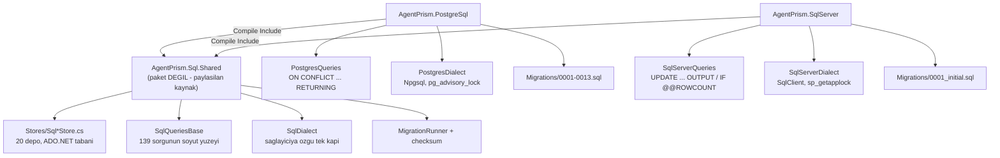

# Faz 23 — SQL Server Desteği

> **Durum:** ✅ Tamam — 204/204 sözleşme testi `azure-sql-edge` (arm64) üzerinde yeşil (bkz. "Açık Kalan")
> **Kaynak:** [BEYIN-FIRTINASI.md](BEYIN-FIRTINASI.md) · **F-06**
> **Paketler:** **`AgentPrism.SqlServer` (YENİ)** · `AgentPrism.PostgreSql` (yeniden yapılandırıldı) · `AgentPrism.Sql.Shared` (yeni, **paket değil**)
> **Migration:** Kendi migration seti — `0001_initial.sql`
> **Kararlar:** K-176 … K-189

---

## Bu Faza Başlarken (Faz 24 için)

1. Bu doküman — özellikle **23.2 Paylaşım modeli**
2. [`docs/hafiza/sql-saglayicilari.md`](hafiza/sql-saglayicilari.md) — tuzaklar
3. `grep -n "K-176\|K-177\|K-180\|K-184" docs/KARARLAR.md`
4. `src/AgentPrism.Sql.Shared/README.md` — ne buraya girer, ne girmez

---

## Ne Yapıldı

Faz 23 bir **tasarım sınavıydı**: üçüncü bir kalıcılık uygulaması eklemek kolay
olmalıydı. Sınavın sonucu, sözleşme testlerinin doğru kurulduğunu **ama**
paylaşım sınırının fazla dar çizildiğini gösterdi.

Doküman ilk hâlinde "paylaşılanlar: migration iskeleti, checksum, `SqlIdentifier`,
tanım yükleri; paylaşılmayanlar: SQL metinleri, komut yardımcıları, **depo
uygulamaları**" diyordu. Uygulama sırasında ölçülen bulgu bunu değiştirdi:

> 21 `ON CONFLICT ... RETURNING` upsert'ün **tamamı** SQL Server'da
> `UPDATE ... OUTPUT` + `IF @@ROWCOUNT = 0 INSERT ... OUTPUT` ile **aynı satır
> kümesini** döndürebiliyor.

Yani diyalekt farkı SQL metninin içinde kalıyor, C# akışına sızmıyor. Bu, depo
uygulamalarının da paylaşılabileceği anlamına geldi ve **kapsam genişletildi**
(K-176, kullanıcı kararı). Aksi hâlde ~4.000 satır depo mantığı ikinci, Faz
24'te üçüncü kez yazılacaktı.

---

## 23.1 — Katman Şeması



**Kural:** `AgentPrism.Sql.Shared` altındaki hiçbir dosya `Npgsql` veya
`Microsoft.Data.SqlClient` ad alanına referans veremez. Depolar yalnız
`DbDataSource`, `DbCommand`, `DbDataReader` tanır; sağlayıcıya özgü her şey
`SqlDialect` üzerinden geçer.

`Microsoft.Data.SqlClient` bir `DbDataSource` uygulaması **sunmaz**; ince bir
uyarlayıcı yazıldı (`SqlServerDataSource`).

---

## 23.2 — Paylaşım Modeli (Faz 24'ün kullanacağı sözleşme)

| Nerede | Ne |
|--------|-----|
| `AgentPrism.Sql.Shared/Stores/` | 20 depo uygulaması — **sağlayıcı eklerken dokunulmaz** |
| `AgentPrism.Sql.Shared/Internal/SqlQueriesBase.cs` | 139 sorgunun adı ve XML dokümanı; metin yok |
| `AgentPrism.Sql.Shared/Internal/SqlDialect.cs` | Parametre tipleme, dizi taşıma, migration kilidi, hata sınıflandırma |
| `<Saglayici>/Internal/*Queries.cs` | O diyalektin 139 SQL metni |
| `<Saglayici>/Internal/*Dialect.cs` | `SqlDialect` türevi |
| `<Saglayici>/Migrations/*.sql` | Gömülü migration seti |
| `<Saglayici>/AgentPrism*Options.cs` + `*BuilderExtensions.cs` | Public yüzey |

**Yeni bir sağlayıcı eklemek** = 4 dosya + migration seti + test projesi.

> 🚨 `SqlQueriesBase`'e yeni bir sorgu eklendiğinde **her alt sınıfta** karşılığı
> yazılmalıdır. Yazılmazsa alan `string.Empty` kalır ve hata yalnızca çalışma
> anında görünür.

### Public yüzey daraldı

Depo sınıfları artık `internal`'dır (`SqlRunStore`, `SqlSessionStore`, …).
Önceden `AgentPrism.PostgreSql` bunları `public` veriyordu. Gerekçe: tüketici
depolara arayüz üzerinden erişir, somut sınıfı `new`'lemesi için bir sebep
yoktur; ayrıca `internal` bir `SqlStoreContext` alan `public` bir kurucu
`CS0051` verirdi. `MigrationRunner` **public kaldı** — ayrı bir dağıtım adımında
çalıştırılması dokümante edilmiş bir senaryodur (kurucusu `internal`, DI
fabrikayla kaydeder). `PublicAPI.Shipped.txt` boş olduğu için bu daralma bedelsizdi.

---

## 23.3 — SQL Çeviri Tablosu (uygulanan hâli)

| PostgreSQL | SQL Server | Not |
|------------|-----------|-----|
| `uuid` | `uniqueidentifier` | Sıralama bayt sırasına göre değil → K-180 |
| `jsonb` / `json` | `nvarchar(max)` + `CHECK (ISJSON(c) = 1)` | `audit_log.before/after` hariç: gözlemlenebilirlik işlevselliği bozmaz |
| `text` (anahtar) | `nvarchar(200)` | `nvarchar(max)` **indekslenemez** |
| `text` (serbest) | `nvarchar(max)` | |
| `timestamptz` | `datetimeoffset(7)` | Her zaman UTC yazılır, okunan ofset sıfır |
| `boolean` | `bit` | SQL'de `= 1` / `= 0` |
| `bytea` | `varbinary(max)` | Parametre uzunluğu `-1` verilir |
| `numeric(20,10)` | `decimal(20,10)` | 🚨 Parametrede `Precision`/`Scale` **zorunlu** |
| `text[]` | `nvarchar(max)` JSON dizi | `OPENJSON` (K-182) |
| `ON CONFLICT DO UPDATE` | `UPDATE ... WITH (UPDLOCK, SERIALIZABLE) ... OUTPUT` + `IF @@ROWCOUNT = 0 INSERT ... OUTPUT` | `MERGE` **kullanılmaz** (K-177) |
| `RETURNING` | `OUTPUT inserted.*` / `OUTPUT deleted.*` | |
| `pg_advisory_lock` | `sp_getapplock` | Dönüş değeri negatifse hata verilir |
| Kısmi indeks (`WHERE`) | Filtrelenmiş indeks (`WHERE`) | Birebir karşılık |
| `COUNT(*) FILTER (WHERE p)` | `COALESCE(SUM(CASE WHEN p THEN 1 ELSE 0 END), 0)` | 🚨 `COALESCE` zorunlu: boş kümede `SUM` NULL döner |
| `LEFT JOIN LATERAL ... ON TRUE` | `OUTER APPLY` | |
| `LEAST` / `GREATEST` | `CASE` zinciri | 2019'da **yok** (2022 ile geldi) |
| `EXTRACT(EPOCH FROM (a-b))*1000` | `DATEDIFF_BIG(millisecond, b, a)` | |
| `generate_series` | Özyinelemeli CTE + `OPTION (MAXRECURSION 0)` | |
| `date_trunc(@unit, x)` | `CASE` + `DATEADD/DATEDIFF` | Parametrik `DATEPART` yazılamaz; 2019 uyumu için `DATETRUNC` kullanılmaz |
| `UNNEST(@a, @b) WITH ORDINALITY` | `OPENJSON(@a) JOIN OPENJSON(@b) ON [key]` | `[key]` 0 tabanlı |
| `= ANY(dizi)` | `EXISTS (SELECT 1 FROM OPENJSON(c) WHERE value = @p)` | Tam eşleşme |
| `FOR UPDATE SKIP LOCKED` | `WITH (UPDLOCK, READPAST, ROWLOCK)` | CTE üzerinden `UPDATE` |
| `OFFSET @s LIMIT @t` | `OFFSET @s ROWS FETCH NEXT @t ROWS ONLY` | 🚨 `@t = 0` **hata verir** |
| Veri değiştiren CTE | `DECLARE @t TABLE` + `OUTPUT ... INTO` | T-SQL'de yok |

### İki NULL tuzağı ters yönde çalışır (K-184)

PostgreSQL'de NULL hiçbir NULL'a eşit değildir → `COALESCE`'li ifade indeksi
gerekiyordu. SQL Server NULL'ları **eşit** sayar → düz `UNIQUE` yeter. Ama aynı
kural `jobs (schedule_id, scheduled_for)` kısıtında **ters** tarafa düşer:
PostgreSQL zamanlamasız işleri ayırt ederken SQL Server ikinci bir zamanlamasız
işi engellerdi. Orada kısıt `WHERE schedule_id IS NOT NULL` filtreli benzersiz
indekstir.

### K-027 burada geçerli değildir

`sessions.state` ve `conversation_items.item` sütunlarının neden `json` (jsonb
değil) olduğunu anlatan karar SQL Server'da uygulanamaz: `nvarchar(max)` zaten
anahtar sırasını korur. **Bu, kararın yanlış olduğu anlamına gelmez** —
PostgreSQL'de hâlâ geçerlidir. `SqlServerDialectTests.Polimorfik_json_bozulmadan_gidip_gelir`
bunu kanıtlamak için yazıldı.

---

## 23.4 — Migration Seti

SQL Server tek bir `0001_initial.sql` taşır: PostgreSQL'in 0001–0013
**birikmiş** sonucu. Yükseltilecek bir kurulum yoktur; geçmişi oynatmak yalnız
okunması zor bir dosya üretirdi (K-178). Bundan sonraki değişiklikler `0002`,
`0003` … olarak eklenir.

Numaralandırma PostgreSQL ile **eşleşmez ve eşleşmesi gerekmez**. `__migrations`
sözleşmesi ve checksum hesabı (satır sonu normalleştirmesi dâhil) aynıdır.

Kilit: `sp_getapplock @Resource = 'AgentPrism.Migrations', @LockMode = 'Exclusive',
@LockOwner = 'Session', @LockTimeout = 30000`. Dönüş değeri negatifse
`AgentPrismException` fırlatılır — sessizce devam etmek iki replikanın aynı
migration'ı aynı anda uygulamasına izin verirdi.

---

## 23.5 — Paket ve Kayıt

```csharp
builder.AddAgentPrism()
       .UseSqlServer(connectionString, o =>
       {
           o.SchemaName = "agentprism";
           o.CommandTimeoutSeconds = 30;
       });
```

- `UseSqlServer` **`Replace`** kullanır (K-025 birebir geçerli). `SqlStoreContext`
  ve `MigrationRunner` de `Replace` ile kaydedilir: `TryAdd` olsaydı ikinci bir
  sağlayıcıda depolar yeni sağlayıcıya, bağlam eskisine bakar ve ikisi sessizce
  ayrışırdı.
- İki sağlayıcı aynı anda kaydedilirse **son kayıt kazanır** ve açılışta uyarı
  loglanır (K-183). Engellenmez.
- `AgentPrism` meta paketi SQL Server'ı **içermez** (K-185).
- Desteklenen: **SQL Server 2019+** ve **Azure SQL** (Azure SQL CI'da test edilmez).

---

## 23.6 — Testler

`tests/Shared/` altındaki 16 soyut sözleşme sınıfı ve `TestData` artık **iki**
entegrasyon test projesine birden derlenir. `AgentPrism.SqlServer.IntegrationTests`
yeni bir sözleşme testi **yazmadı** — fazın sınavı buydu ve geçildi.

| Test | Nerede |
|------|--------|
| 16 store sözleşmesi (189 test) | `tests/Shared/Contracts/` → iki sağlayıcıda koşar |
| Migration idempotency, checksum, geçersiz şema | `MigrationRunnerTests` |
| Beş eşzamanlı migration (`sp_getapplock`) | `MigrationRunnerTests` |
| Ondalık kesme, zaman dilimi, polimorfik JSON | `SqlServerDialectTests` |
| Kümelenmiş indeks stratejisi (`sys.indexes`) | `SqlServerDialectTests` |
| Dizi tam eşleşmesi (`OPENJSON`) | `SqlServerDialectTests` |

CI: SQL Server container'ı ~2 GB bellek ister.

---

## Açık Kalan — gerçek `mssql/server` hâlâ koşturulamadı

**Geliştirme makinesinde `mcr.microsoft.com/mssql/server` hâlâ çalıştırılamıyor.**
İmaj yalnızca `linux/amd64`; makine Apple Silicon ve Docker'da amd64
emülasyonu kapalı (`rosetta error`, `alpine:amd64` bile başlamıyor).

**2026-08-05'te bu, kullanıcı onayıyla `mcr.microsoft.com/azure-sql-edge`
(arm64 native) ile aşıldı** — `SqlServerFixture` geçici olarak bu imaja
yönlendirildi, 204 sözleşme testi + diyalekt testlerinin tamamı koşturuldu,
sonra fixture gerçek `mssql/server` yapılandırmasına geri alındı (K-186).

**İlk koşu 204 testin 97'sini kırdı — üç gerçek üretim hatası bulundu ve
düzeltildi** (elle çevrilen 139 sorgu + ~500 satır DDL'nin ilk gerçek sınavıydı):

1. **K-187** — `@@ROWCOUNT` 17 sorguda `@@` önekini kaybetmişti (95 test)
2. **K-188** — `DbHelpers.ReadSingleAsync`/`ExecuteScalarAsync` iki dallı upsert
   deseninin ikinci sonuç kümesine hiç bakmıyordu (~15 test)
3. **K-189** — `SqlWebhookStore` dizi okumasında `Dialect.ReadTextArray`
   soyutlamasını atlayıp PostgreSQL'e özgü bir ADO.NET tipine bağımlıydı (8 test)

Düzeltmelerden sonra 204/204 yeşil; PostgreSQL tarafında regresyon yok
(416/416). Ayrıntı: `docs/hafiza/sql-saglayicilari.md`.

**Gerçek `mssql/server` ile doğrulama hâlâ açık.** `azure-sql-edge` T-SQL
yüzeyi neredeyse özdeş olsa da gerçek SQL Server değildir — motor farkları
(optimizer, kilitlenme davranışı, sürüm-özgü sözdizimi) kanıtlanmadı.

**Kapatmak için:** Docker Desktop → Settings → General → "Use Virtualization
framework" + "Use Rosetta for x86_64/amd64 emulation" → Apply & restart. Sonra:

```bash
dotnet test tests/AgentPrism.SqlServer.IntegrationTests -c Release
```

Alternatif: CI'yı Linux amd64 üzerinde koşturmak.

---

## Bitiş Ölçütleri (DoD)

- [x] `AgentPrism.SqlServer` paketi üretiliyor (`dotnet pack` sayısı arttı)
- [x] **Tüm store sözleşme testleri SQL Server üzerinde yeşil** — `azure-sql-edge` (arm64) ile 204/204; gerçek `mssql/server` hâlâ açık (bkz. "Açık Kalan")
- [x] Migration'lar temiz veritabanında ve tekrar çalıştırmada doğru — `MigrationRunnerTests` `azure-sql-edge` üzerinde yeşil
- [x] Eşzamanlı iki süreçte migration bir kez uygulanıyor — `azure-sql-edge` üzerinde yeşil
- [ ] Örnek uygulama `UseSqlServer` ile uçtan uca çalışıyor — koşturulamadı (gerçek SQL Server gerektirir)
- [x] AOT durumu ölçüldü ve `MIMARI.md` bölüm 9 güncellendi (K-181)
- [x] Paket kontrol listesi tamam (README, slnx, meta paket kararı, csproj)
- [x] Dört doğrulama kapısı sıfır uyarı
- [x] PostgreSQL regresyonu yok: 416/416 entegrasyon testi, toplam 1235+ test yeşil

---

## Sonraki Faza Devir Notu

- **Faz 24 (SQLite) bu fazın kurduğu paylaşım modelini kullanır.** Model artık
  `azure-sql-edge` üzerinde 204/204 testle doğrulandı (K-186..K-189) — üçüncü
  sağlayıcı (SQLite), modelin gerçekten sağlayıcıdan bağımsız olup olmadığının
  asıl kanıtıdır. Beklenen iş: `SqliteQueries` + `SqliteDialect` + migration
  seti + test projesi. Depolara **dokunulmamalıdır**; dokunmak gerekiyorsa
  soyutlama eksiktir ve bu bir bulgudur.
- SQLite'ın kendine özgü noktaları: `uuid` yok (`BLOB`/`TEXT`), `datetimeoffset`
  yok (`TEXT` ISO-8601), eşzamanlı yazma tek yazar, `RETURNING` 3.35+ ile var,
  `sp_getapplock` karşılığı yok — dosya kilidi düşünülmeli.
- **`DbHelpers.ReadSingleAsync`/`ExecuteScalarAsync`'in çoklu-sonuç-kümesi
  düzeltmesi (K-188) SQLite'ta da geçerlidir.** SQLite tek ifadelik `INSERT ...
  ON CONFLICT ... RETURNING` (3.35+) kullanırsa PostgreSQL gibi tek kume
  üretir ve düzeltme zararsızdır; iki dallı bir desen seçilirse aynı tuzağa
  düşülebilir — `docs/hafiza/sql-saglayicilari.md`'deki tuzak notu okunmalıdır.
- **Gerçek `mssql/server` ile doğrulama hâlâ açık** (bkz. "Açık Kalan"). Bu,
  Faz 24'ü engellemez — paylaşım modeli `azure-sql-edge` ile kanıtlandı — ama
  CI'da Linux amd64 koşucusu eklenene kadar SQL Server tarafında motor-özgü
  bir fark keşfedilmemiş olabilir.
- Faz 25 (saklama) her sağlayıcı için temizleme SQL'i yazmak zorundadır;
  `IRetentionStore` sözleşmesi `SqlQueriesBase`'e yeni sorgular ekleyecektir —
  **her alt sınıfta** karşılığı yazılmalıdır.
