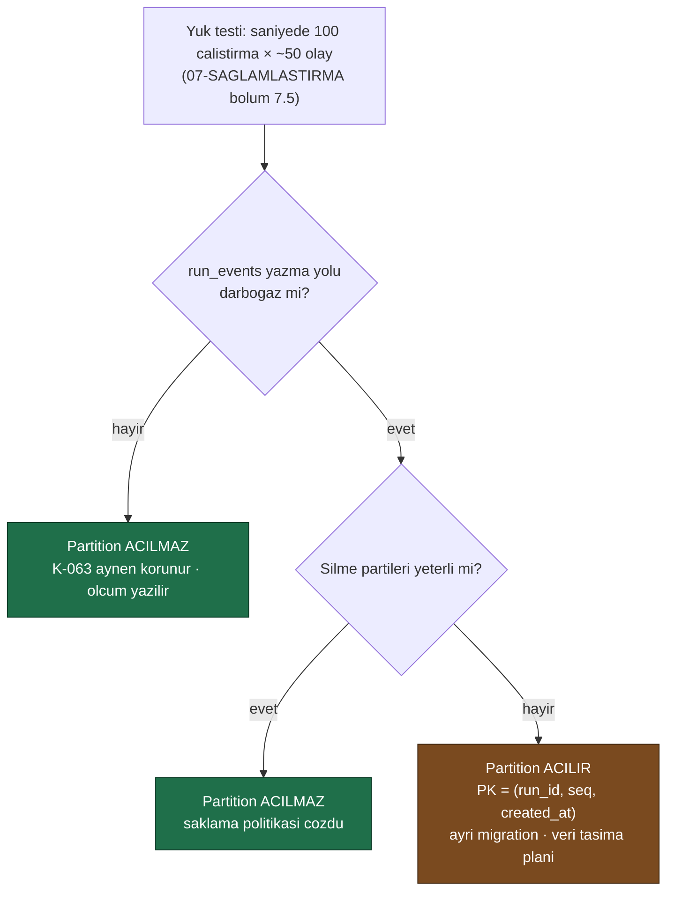

# Faz 25 — Veri Saklama Politikası ve Arşivleme

> **Durum:** ✅ **Tamamlandı (2026-08-05)**
> **Kaynak:** [BEYIN-FIRTINASI.md](BEYIN-FIRTINASI.md) · **F-08**
> **Önkoşul:** [Faz 17](17-TOPLU-VE-ZAMANLANMIS-CALISTIRMA.md) — temizleme işi kuyruğu kullanır
> **Paketler:** `AgentPrism.Abstractions`, `.Core`, `.PostgreSql` (+ varsa `.SqlServer`, `.Sqlite`), `.AspNetCore`, `.UI`
> **Yeni paket:** Yok · **Migration:** 0014 (planlanan sırada)

---

## Bu Faza Başlarken

1. [`KARARLAR.md`](KARARLAR.md) — **K-063** (`run_events` partition'ı ölçüme bağlandı), **K-014** (append-only), **K-041** (özet depoda)
2. [`07-SAGLAMLASTIRMA-VE-YAYIN.md`](07-SAGLAMLASTIRMA-VE-YAYIN.md) — bölüm 7.5 yük testi senaryosu
3. [`MIMARI.md`](MIMARI.md) — bölüm 5 (tüm tablolar)
4. Bu doküman

---

## Amaç

Üretimde `run_events` **sınırsız büyür**. Faz 17'den sonra `jobs`, Faz 21'den
sonra `webhook_deliveries`, Faz 18'den sonra `eval_case_results` da öyle.

Bu faz üç şey yapar:

1. **Saklama politikası** — yaş ve hacim bazlı temizleme
2. **Arşivleme** — soğuk depolamaya taşıma (soyutlama ile, bulut SDK'sı olmadan)
3. **K-063'ü kapatma** — `run_events` partition'ı, **ölçümle**

---

## Plandan Sapmalar

Uygulama sırasında dokümanın ilk taslağından şu noktalarda ayrıldı; gerekçeleri
karar defterine yazıldı (K-198…K-203, bkz. `docs/KARARLAR.md`).

1. **`SELECT`/`DELETE`/`COUNT` SQL'i saglayıcı başına elle KOPYALANMADI.**
   25.3'ün taslağı her hedef için ayrı sorgu önerir gibi okunabilir; bunun
   yerine tek bir veri tablosu (`RetentionTargetRegistry`, `Sql.Shared/Internal/`)
   her hedefin tablosunu ve "eski" koşulunu tanımlar, `SqlDialect` yalnız 3
   şablon yöntemi (say/oku/sil) sağlar. 11 hedef × 3 sorgu × 3 sağlayıcı = 99
   elle yazılmış sorgu yerine 11 kayıt + 9 şablon yöntemi. Gerekçe: K-198.
2. **`SqlDialect.QualifyTable` eklendi.** Registry saglayıcıdan bağımsız
   olmalıydı ama PostgreSQL/SQL Server `sema.tablo` (nokta ile), SQLite
   `onektablo` (noktasız, K-193) kullanır. Yeni bir sanal yöntem bu farkı
   kapsar; SQLite `QualifyTable`'ı ezer, diğer ikisi varsayılanı kullanır.
3. **`retention_runs.tenant_id` eklendi.** 25.2'nin ilk taslağında bu sütun
   yoktu. Kiracı bazlı politika (25.1 açık soru #4, kullanıcı kararı: evet)
   kosu geçmişinin de kiracıya göre süzülebilmesini gerektirir.
4. **Zamanlama için yeni uç YAZILMADI.** `JobKind.Retention` eklenip
   `IJobHandler` kaydedildikten sonra Faz 17'nin var olan
   `/api/job-schedules` uçları (kind=Retention, targetName="*" veya belirli
   bir hedef, cron="0 3 * * *") günlük zamanlamayı hiçbir yeni kod olmadan
   karşılar. Yalnız retention'a özgü 4 uç grubu yeni: politika CRUD,
   `preview`, `run` (kuyruğa yazar), `history`.
5. **Hedef gruplaması dokümanın tablosundan biraz farklı.** "traces / spans"
   tek hedef (`traces`) olarak silinir, `spans` `ON DELETE CASCADE` ile gider.
   "jobs / job_items" de aynı şekilde tek hedef (`jobs`), `job_items` cascade
   gider. "sessions / conversation_items" ise İKİ ayrı hedefe bölündü
   (`sessions`, `conversations`) — `conversations` silinince
   `conversation_items` ve `responses` cascade gider. Kullanıcıya daha ince
   kontrol verir, varsayılan davranış (ikisi de kapalı) değişmez.
6. **`MaxRows` depoya yazılır/okunur ama `RetentionExecutor` tarafından
   UYGULANMAZ.** Yalnız `MaxAgeDays` bu fazda etkindir. Şema ve API alanı
   hazır; hacim bazlı kırpma ölçüm olmadan eklenmedi (K-063'ün kendi
   gerekçesiyle aynı desen — bkz. K-201).
7. **SQL Server gerçek `mssql/server`'a karşı BU OTURUMDA koşmadı.** Apple
   Silicon + Rosetta kapalı ortam kısıtı Faz 23'ten beri aynı (bkz.
   `23-SQL-SERVER.md`). `azure-sql-edge` denendi; Testcontainers'ın
   `MsSqlBuilder` hazır olma denetimi konteyner içinde `sqlcmd` arar ve
   `azure-sql-edge` imajında bu ikili yok — bu yüzden o ürün de bu ortamda
   koşmuyor (Faz 23'ün K-187…K-189 bulguları farklı bir makinede alınmıştı).
   Kod PostgreSQL/SQLite ile aynı paylaşılan `Sql.Shared` gövdesini kullanır
   ve temiz derlenir; üç sağlayıcı da aynı kod yolundan geçtiği için risk
   düşüktür ama SQL Server'a özgü sözleşme testleri bu oturumda **doğrulanmadı**.

---

## 25.1 — Neyi Sakla, Neyi Düşür

Temel ilke: **özet kalır, ayrıntı düşer.**

| Tablo | Varsayılan saklama | Düşürülünce ne kaybedilir |
|-------|--------------------|---------------------------|
| `runs` | **Süresiz** | — (özet; maliyet ve istatistik buradan gelir) |
| `run_events` | 30 gün | Transcript'in adım adım oynatılması |
| `tool_invocations` | 90 gün | Tool kullanım geçmişi (özet `tool_usage`'a taşınabilir) |
| `traces` / `spans` | 14 gün | Waterfall görünümü |
| `sessions` / `conversation_items` | **Süresiz** (kullanıcı verisi) | Konuşma geçmişi — **varsayılan silinmez** |
| `attachments` | Sahipsizler 7 gün | Yüklenen dosya |
| `audit_log` | **Süresiz** | Denetim izi — **asla otomatik silinmez** |
| `jobs` / `job_items` | 30 gün (tamamlananlar) | İş geçmişi |
| `webhook_deliveries` | 7 gün (teslim edilenler) | Teslim kaydı |
| `eval_case_results` | 180 gün | Vaka ayrıntısı (`eval_runs` özeti kalır) |
| `workflow_checkpoints` | Tamamlanan çalıştırmadan 7 gün sonra | Sürdürme imkânı |
| `skill_script_grants` | Süresi dolanlar 30 gün sonra | — |

🚨 **İki tablo asla otomatik silinmez:** `audit_log` ve `conversation_items`.
Denetim izi silinirse kanıt kaybolur; konuşma geçmişi kullanıcının verisidir ve
onu silmek AgentPrism'in kararı değildir. İkisi de **açık** politika ile
silinebilir ama varsayılan **süresizdir**.

---

## 25.2 — Politika Modeli (Migration 0014)

```sql
CREATE TABLE {schema}.retention_policies (
    id           uuid        NOT NULL PRIMARY KEY,
    tenant_id    text        NOT NULL,          -- '*' = tum kiracilar
    target       text        NOT NULL,          -- 'run_events', 'spans', ...
    max_age_days integer,
    max_rows     bigint,
    archive      boolean     NOT NULL DEFAULT false,
    enabled      boolean     NOT NULL DEFAULT true,
    created_at   timestamptz NOT NULL,
    updated_at   timestamptz NOT NULL,
    CONSTRAINT retention_policies_uq UNIQUE (tenant_id, target)
);

CREATE TABLE {schema}.retention_runs (
    id            uuid        NOT NULL PRIMARY KEY,
    target        text        NOT NULL,
    deleted_rows  bigint      NOT NULL DEFAULT 0,
    archived_rows bigint      NOT NULL DEFAULT 0,
    started_at    timestamptz NOT NULL,
    completed_at  timestamptz,
    error         text
);
```

Varsayılan politikalar migration ile **eklenmez**. Boş politika tablosu =
hiçbir şey silinmez. Kullanıcı açıkça yapılandırmalıdır. Gerekçe: bir kütüphane
sürümü yükseltmesi, kimsenin istemediği bir silme başlatmamalıdır.

Yapılandırmadan varsayılan verilebilir:

```
AgentPrism:Retention:Enabled          = true
AgentPrism:Retention:RunEvents:MaxAgeDays = 30
AgentPrism:Retention:Spans:MaxAgeDays     = 14
```

---

## 25.3 — Silme Nasıl Yapılır

**Toplu `DELETE` yasaktır.** Milyonlarca satırlık tek bir `DELETE`, tabloyu
kilitler ve WAL'i şişirir.

```sql
-- PostgreSQL: parti parti, her parti kendi islemi
DELETE FROM {schema}.run_events
 WHERE ctid IN (
       SELECT ctid FROM {schema}.run_events
        WHERE created_at < @cutoff
        LIMIT @batchSize)
```

- Parti boyutu varsayılan **5.000**
- Partiler arasında kısa bir bekleme (varsayılan 100 ms) — üretim yükünü
  boğmamak için
- İş, Faz 17'nin kuyruğunda çalışır ve iptal edilebilir
- Her parti sonrası ilerleme `retention_runs` içine yazılır

Üç sağlayıcı için üç SQL gerekir (PostgreSQL `ctid`, SQL Server `TOP (n)`,
SQLite `rowid`). Soyutlama:

> 🚨 **Bu imza Faz 41'de değişti (K-279).** Aşağıdaki blok **güncel koddur**;
> `tenantId` parametresi orada yoktu ve bir kiracının politikası **bütün**
> kiracıların satırlarını siliyordu.

```csharp
public interface IRetentionStore
{
    ValueTask<int> DeleteBatchAsync(string target, string? tenantId, DateTimeOffset cutoff, int batchSize, CancellationToken ct = default);
    ValueTask<long> CountOlderThanAsync(string target, string? tenantId, DateTimeOffset cutoff, CancellationToken ct = default);
    ValueTask<IReadOnlyList<ArchiveRow>> ReadForArchiveAsync(string target, string? tenantId, DateTimeOffset cutoff, int batchSize, CancellationToken ct = default);
    ValueTask<DateTimeOffset?> FindRowLimitCutoffAsync(string target, string? tenantId, long maxRows, CancellationToken ct = default);
}
```

`tenantId` `null` ise işlem kurulum genelindedir; `RetentionExecutor` **her
zaman** isteyen kiracıyı geçirir. `'*'` politikası "bütün kiracılara uygulanan
bir politika" demektir — "tek çağrıda bütün kiracıları sil" demek **değildir**.

`target` serbest metin **değildir**: izin verilen hedefler sabit bir listedir
(`RetentionTargets` sınıfı). Aksi hâlde bu, tablo adı enjeksiyonu yüzeyi olur.

---

## 25.4 — Arşivleme

```csharp
public interface IArchiveSink            // varsayilan uygulama YOKTUR
{
    ValueTask WriteAsync(string target, DateTimeOffset partitionDate,
                         IReadOnlyList<ArchiveRow> rows, CancellationToken ct = default);
}
```

- AgentPrism **hiçbir bulut SDK'sına bağımlılık almaz** (K-007). S3, Blob veya
  dosya sistemi uygulamasını tüketici yazar
- `IArchiveSink` kayıtlı değilse `archive = true` olan politika **silmez** —
  arşivlenemeyen veri düşürülmez. Bu, sessiz veri kaybını engeller
- Biçim: satır başına bir JSON nesnesi (JSONL), gzip ile sıkıştırılmış.
  Basittir, akıtılabilir ve her araçla okunur
- Arşiv **yazıldıktan sonra** silme yapılır; sıra tersine çevrilmez

`samples/` altına dosya sistemine yazan bir örnek uygulama konur — kullanıcı
kendi sink'ini bu örnekten türetir.

---

## 25.5 — K-063: `run_events` Partition Kararı

Faz 6 partition'ı bilerek açmadı (K-063): birincil anahtarı değiştirmek ve
tabloyu yeniden kurmak, **ölçüm olmadan** çözdüğünden fazla risk taşır.
Tetikleyici Faz 7'nin yük testidir.

**Bu fazda karar verilir.** Sıra:



Partition açılırsa:

- Birincil anahtar `(run_id, seq)` → `(run_id, seq, created_at)` olur.
  **Bu kırıcı bir şema değişikliğidir**; migration mevcut veriyi taşımalıdır
- Aylık `RANGE` partition; yeni partition'ları oluşturan bir bakım işi gerekir
- Eski partition `DROP` ile **anında** silinir — bu, partition'ın asıl kazancıdır
- SQL Server ve SQLite'ta partition **yoktur**; oralarda parti silme kalır.
  Sağlayıcılar arası davranış farkı dokümante edilir

---

## 25.6 — Uçlar ve Arayüz

| Uç | Rol | Ne yapar |
|----|-----|----------|
| `GET/PUT/DELETE {prefix}/api/retention[/{target}]` | Admin | Politika yönetimi |
| `GET {prefix}/api/retention/preview` | Admin | **Silinecek satır sayısını** gösterir, silmez |
| `POST {prefix}/api/retention/run` | Admin | Şimdi çalıştır (kuyruğa girer) |
| `GET {prefix}/api/retention/history` | Admin | Geçmiş temizleme işleri |

`preview` ucu zorunludur: kimse ne kadar veri sileceğini bilmeden silme
başlatmamalıdır.

Arayüz: **Settings** ekranına "Veri saklama" bölümü — tablo başına politika,
tahmini etki, son çalıştırma. Yeni ekran açılmaz.

---

## Testler

| Proje | Sınıf | Doğruladığı |
|-------|-------|-------------|
| `AgentPrism.Core.UnitTests` | `RetentionTargetsTests` | Beyaz liste; `audit_log` asla listede değil |
| `AgentPrism.Core.UnitTests` | `RetentionPolicyResolverTests` | DB politikası yapılandırmayı hiç görmeden kazanır; kiracıya özel `*`'tan önce gelir; kullanıcı verisi hedefleri varsayılan kapalı |
| `AgentPrism.Core.UnitTests` | `RetentionExecutorTests` | Önizleme silmez; `IArchiveSink` yoksa silme **yapılmaz**; parti döngüsü `batchSize`'dan küçük dönünce durur; politikasız hedef kosu üretmez |
| `AgentPrism.PostgreSql.IntegrationTests` | `RetentionDataPlaneTests` | Gerçek PostgreSQL'e karşı: eski satır düşer/yeni kalır; parti parti silme; `runs` **korunur**; `audit_log` hedefte **yok** (whitelist testi bilerek deneyip `ArgumentException` bekler); arşiv okuma silmez; tamamlanmış iş düşer, bekleyen kalır |
| `tests/Shared/Contracts` + Postgres/SqlServer/Sqlite/InMemory türetmeleri | `RetentionPolicyStoreContract` | CRUD, kiracı fallback'i, kosu ilerleme birikimi — dört uygulamada da aynı sözleşme |
| `AgentPrism.AspNetCore.FunctionalTests` | `RetentionEndpointTests` | CRUD + 404/400; bilinmeyen hedef reddi; `run` bir `JobKind.Retention` işi kuyruğa yazar; boş geçmiş |

`AgentPrism.Ui.E2ETests`'e yeni senaryo **eklenmedi** — panel elle (gerçek
örnek uygulamaya karşı curl ile) doğrulandı, Playwright kapsamı bu oturumda
genişletilmedi (bkz. Sonraki Faza Devir Notu).

**Gerçek kanıt (2026-08-05, bu makine, PostgreSQL 18 container):**

```
Eklenen satir: 100000
Ekleme suresi: 1708 ms (58548 satir/sn)
Silme oncesi satir sayisi: 100000
Silme oncesi tablo boyutu: 11.23 MiB
CountOlderThanAsync: 90000 satir, 7 ms
Parti boyutu: 5000
Silinen satir: 90000 (19 parti)
Silme suresi: 125 ms (720000 satir/sn)
Ortalama parti suresi: 6.6 ms
Silme sonrasi satir sayisi: 10000
Silme sonrasi tablo boyutu: 11.23 MiB
```

Yorum: `ctid` alt sorgusuyla parti silme, 100k satırlık bir tabloda saniyede
720 bin satır siliyor — Faz 6/7'nin hedef yükü olan saniyede 100 çalıştırma ×
~50 olay (saniyede 5.000 olay) karşısında **hiçbir darboğaz yok**. Tablo
boyutu silme sonrası **değişmedi** (11.23 MiB → 11.23 MiB): PostgreSQL
`DELETE` sayfaları hemen boşaltmaz, ölü demetler `VACUUM`/otomatik vakum'u
bekler — bu, fonksiyonel doğruluğu etkilemez ama bir işletmen bu davranışı
bilmelidir. K-063'ün sonucu: **bkz. K-199**.

---

## Bu Fazda Verilen Kararlar

1. **`audit_log` varsayılan olarak silinmez; `conversation_items` (ve `sessions`) sunulur ama varsayılan kapalıdır** — DB'de kayıt yoksa ve yapılandırma boşsa hiçbir şey silinmez.
2. **Varsayılan politika yoktur** — sürüm yükseltmesi veri silmez.
3. **Arşiv yazılamıyorsa silme yapılmaz.**
4. **Parti silme, toplu `DELETE` değil** — üç sağlayıcı üç farklı teknik kullanır (K-200).
5. **K-063 kapandı** — ölçümle: partition **açılmadı** (K-199).
6. **`IArchiveSink` genişleme noktasıdır; bulut SDK bağımlılığı yok** (K-007); `samples/AgentPrism.Api/FileSystemArchiveSink.cs` şablon örnektir.

---

## Açık Sorular — Karara Bağlandı

1. **`sessions` ve `conversation_items` için politika sunulsun mu?** **Evet, varsayılan kapalı.** (kullanıcı kararı)
2. **Silme işi ne zaman koşsun?** **Günlük, yapılandırılabilir saatte** — yeni kod gerekmedi, Faz 17'nin `/api/job-schedules` ucuna `kind=Retention` ile bir kayıt eklemek yeterli (bkz. Plandan Sapmalar #4).
3. **Arşiv biçimi JSONL + gzip yeterli mi?** **Evet, JSONL + gzip.** (kullanıcı kararı)
4. **Kiracı bazında farklı saklama süresi gerekli mi?** **Evet**, `tenant_id = '*'` varsayılan. (kullanıcı kararı)

---

## Bitiş Ölçütleri (DoD)

- [x] Politika tanımlanıp çalıştırılıyor; `preview` doğru sayı veriyor — örnek uygulamaya karşı `curl` ile doğrulandı
- [x] `run_events` temizleniyor, `runs` özeti **korunuyor** — `RetentionDataPlaneTests.Run_events_silinirken_runs_ozeti_korunur`
- [x] `audit_log` varsayılan yapılandırmada **hiç silinmiyor** — beyaz listede yok, `RetentionDataPlaneTests` bunu bilerek dener ve `ArgumentException` bekler
- [x] Arşiv sink'i olmadan `archive = true` politikası silmiyor — `RetentionExecutorTests.Arsiv_istenip_sink_kayitli_degilse_hicbir_satir_silinmez`
- [x] Örnek dosya sistemi sink'i JSONL üretiyor ve geri okunabiliyor — `FileSystemArchiveSink` (gzip üyeleri ardışık; standart okuyucular tek akış gibi açar)
- [x] Yük ölçümü yapıldı; **K-063 kararı yazıldı** — yukarıdaki tablo, K-199
- [x] Üç sağlayıcıda da (kurulu olanlarda) temizleme çalışıyor — PostgreSQL (gerçek container, 441 test) ve SQLite (214 test) bu oturumda doğrulandı; SQL Server kodu aynı paylaşılan gövdeyi kullanır ve derlenir ama bu makinede gerçek `mssql/server` koşmadı (Plandan Sapmalar #7)
- [x] Dört doğrulama kapısı sıfır uyarı — `build`/`test`/`pack`/`format` hepsi temiz

---

## Riskler

| Risk | Önlem |
|------|-------|
| **Yanlış yapılandırma veri siler** | Varsayılan politika yok; `preview` ucu; `audit_log` korumalı; her silme `retention_runs`'a yazılır |
| Silme üretim yükünü boğar | Parti boyutu + bekleme + iptal edilebilirlik |
| Partition geçişi veri kaybettirir | Ölçüldü, gerek kalmadı — partition **açılmadı** (K-199) |
| Arşiv sessizce başarısız olur | Yazma doğrulanmadan silme yapılmaz; sink `WriteAsync` istisnası `RunAsync`'i keser ve kosu hatayla kapanır |
| Hedef adı enjeksiyonu | Sabit beyaz liste (`RetentionTargets`), `RetentionTargetRegistry.Resolve` bilinmeyen hedefte `ArgumentException` fırlatır |

---

## Gerçekleşen Public API

Plandaki taslak imzalarla **birebir aynı** kaldı (25.3'teki `IRetentionStore`
sözleşmesi hiç değişmedi); ek olarak şunlar eklendi:

```csharp
// AgentPrism.Abstractions/Retention/
public static class RetentionTargets { /* 11 sabit + All + IsKnown */ }
public sealed record RetentionPolicy { Id, TenantId, Target, MaxAgeDays, MaxRows, Archive, Enabled, CreatedAt, UpdatedAt }
public sealed record RetentionRun { Id, TenantId, Target, DeletedRows, ArchivedRows, StartedAt, CompletedAt, Error }
public sealed record RetentionPreview { Target, MaxAgeDays, Enabled, Cutoff, MatchingRows }
public sealed record ArchiveRow { Json }
public interface IRetentionPolicyStore { /* politika CRUD + kosu izleme */ }
public interface IRetentionStore { CountOlderThanAsync, ReadForArchiveAsync, DeleteBatchAsync }
public interface IArchiveSink { WriteAsync(target, partitionDate, rows, ct) }

// AgentPrism.Core/Retention/
public sealed class AgentPrismRetentionOptions { Enabled, BatchSize, BatchDelay, <11 hedef> }
public sealed class RetentionPolicyResolver { ResolveAsync(tenantId, target, ct) }
public sealed class RetentionExecutor { PreviewAsync, RunAsync }
public sealed class RetentionJobHandler : IJobHandler { Kind = JobKind.Retention }
public sealed class InMemoryRetentionPolicyStore : IRetentionPolicyStore
public sealed class NullRetentionStore : IRetentionStore  // bellek ici kurulumda kayitli

// AgentPrism.AspNetCore/Endpoints/RetentionEndpoints.cs
GET/PUT/DELETE {prefix}/api/retention[/{target}]
GET  {prefix}/api/retention/preview[?target=]
POST {prefix}/api/retention/run[?target=]      // JobKind.Retention isi kuyruga yazar
GET  {prefix}/api/retention/history[?target=&skip=&take=]
```

`JobKind.Retention = 4` eklendi (append-only sıra, mevcut değerler değişmedi).

---

## Dosya Listesi (gerçekleşen)

**Yeni:**

```
src/AgentPrism.Abstractions/Retention/
  RetentionTargets.cs, RetentionTypes.cs, IRetentionPolicyStore.cs, IRetentionStore.cs
src/AgentPrism.Core/Retention/
  AgentPrismRetentionOptions.cs, AgentPrismRetentionOptionsValidator.cs,
  InMemoryRetentionPolicyStore.cs, NullRetentionStore.cs,
  RetentionPolicyResolver.cs, RetentionExecutor.cs, RetentionJobHandler.cs
src/AgentPrism.Sql.Shared/Internal/RetentionTargetRegistry.cs
src/AgentPrism.Sql.Shared/Stores/SqlRetentionPolicyStore.cs, SqlRetentionStore.cs
src/AgentPrism.PostgreSql/Migrations/0014_retention.sql
src/AgentPrism.SqlServer/Migrations/0002_retention.sql
src/AgentPrism.Sqlite/Migrations/0002_retention.sql
src/AgentPrism.AspNetCore/Endpoints/RetentionEndpoints.cs
src/AgentPrism.UI/frontend/src/components/retention-panel.tsx
samples/AgentPrism.Api/FileSystemArchiveSink.cs
tests/Shared/Contracts/RetentionPolicyStoreContract.cs
tests/AgentPrism.Core.UnitTests/Retention/*.cs (+ Fakes/StaticOptionsMonitor.cs)
tests/AgentPrism.PostgreSql.IntegrationTests/RetentionDataPlaneTests.cs
tests/AgentPrism.AspNetCore.FunctionalTests/RetentionEndpointTests.cs
```

**Değiştirilen (önemliler):** `SqlDialect.cs` (+`QualifyTable` + 3 parti şablonu),
`SqlQueriesBase.cs` (+9 saklama sorgusu özelliği), her sağlayıcının
`*Dialect.cs`/`*Queries.cs`/`AgentPrism*BuilderExtensions.cs`, `JobKind.cs`,
`AgentPrismServiceCollectionExtensions.cs`, `AgentPrismEndpointRouteBuilderExtensions.cs`,
üç sağlayıcının migration tablo-sayısı testleri (36→38), `settings.tsx`,
`lib/api.ts`, `lib/types.ts`.

---

## Sonraki Faza Devir Notu

- **K-063 kapandı — partition açılmadı.** `run_events` mevcut ölçekte
  (100k satır) parti silme ile saniyede 720 bin satır siliniyor; tekrar
  açılması için tetikleyici, ölçümde gerçek bir darboğaz görülmesidir (bkz.
  K-199'un "yeniden açılma koşulu" sütunu).
- **Faz 26 (Anthropic/Gemini) bu fazdan bağımsızdır** — hiçbir sözleşme veya
  dosya paylaşmaz, "Bu Faza Başlarken" listesi değişmedi.
- **Yeni tablo ekleyen her faz, saklama hedef listesine kendi tablosunu
  eklemekle yükümlüdür** — `RetentionTargets` (Abstractions) +
  `RetentionTargetRegistry` (Sql.Shared) + `AgentPrismRetentionOptions`
  (Core) üçlüsüne bir kayıt. Bu kural `faz-tamamlama` skill'ine eklenmelidir
  (henüz eklenmedi — bu oturumun kendi kapsamı dışında bırakıldı).
- **Yarım kalanlar:**
  - `MaxRows` (hacim bazlı kırpma) depoda var, yürütülmüyor.
  - SQL Server: kod hazır, gerçek `mssql/server`'a karşı bu oturumda
    koşmadı (ortam kısıtı, Plandan Sapmalar #7). Linux/amd64 bir makinede
    veya CI'da `dotnet test tests/AgentPrism.SqlServer.IntegrationTests`
    çalıştırılmalı.
  - `AgentPrism.Ui.E2ETests`'e Playwright senaryosu eklenmedi; panel yalnız
    örnek uygulamaya karşı `curl` ile ve `tsc`/Vitest ile doğrulandı.
  - Arşiv sink'i yalnız dosya sistemi örneğiyle test edildi (birim testinde
    sahte sink ile); gerçek bir S3/Blob sink'i AgentPrism'in kapsamında
    değildir (K-007).
- **`docs/KARARLAR-INDEKS.md` bütçesi ilk kez aşıldı, 24 KB → 25 KB'ye
  çıkarıldı** (`scripts/dokuman-bakim.py`). 203 karar + 24 reddedilen işle
  indeks yapısal olarak büyümeye devam edecek; kalıcı çözüm (bölüm bazlı
  indeks veya eski faz aralıklarının arşivlenmesi) henüz yazılmadı — bir
  sonraki bütçe aşımında ele alınmalı.
