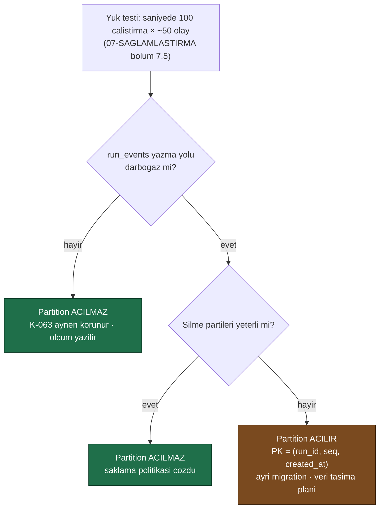

# Faz 25 — Veri Saklama Politikası ve Arşivleme

> **Durum:** 📋 Planlandı
> **Kaynak:** [BEYIN-FIRTINASI.md](BEYIN-FIRTINASI.md) · **F-08**
> **Önkoşul:** [Faz 17](17-TOPLU-VE-ZAMANLANMIS-CALISTIRMA.md) — temizleme işi kuyruğu kullanır
> **Paketler:** `AgentPrism.Abstractions`, `.Core`, `.PostgreSql` (+ varsa `.SqlServer`, `.Sqlite`), `.AspNetCore`, `.UI`
> **Yeni paket:** Yok · **Migration:** 0014 (planlanan sırada)

---

## Bu Faza Başlarken

1. [`KARARLAR.md`](KARARLAR.md) — **K-063** (`run_events` partition'ı ölçüme bağlandı), **K-014** (append-only), **K-041** (özet depoda)
2. [`07-SAGLAMLASTIRMA-VE-YAYIN.md`](07-SAGLAMLASTIRMA-VE-YAYIN.md) — bölüm 7.5 yük testi senaryosu
3. [`MIMARI.md`](MIMARI.md) — bölüm 5 (tüm tablolar)
4. Bu doküman

---

## Amaç

Üretimde `run_events` **sınırsız büyür**. Faz 17'den sonra `jobs`, Faz 21'den
sonra `webhook_deliveries`, Faz 18'den sonra `eval_case_results` da öyle.

Bu faz üç şey yapar:

1. **Saklama politikası** — yaş ve hacim bazlı temizleme
2. **Arşivleme** — soğuk depolamaya taşıma (soyutlama ile, bulut SDK'sı olmadan)
3. **K-063'ü kapatma** — `run_events` partition'ı, **ölçümle**

---

## 25.1 — Neyi Sakla, Neyi Düşür

Temel ilke: **özet kalır, ayrıntı düşer.**

| Tablo | Varsayılan saklama | Düşürülünce ne kaybedilir |
|-------|--------------------|---------------------------|
| `runs` | **Süresiz** | — (özet; maliyet ve istatistik buradan gelir) |
| `run_events` | 30 gün | Transcript'in adım adım oynatılması |
| `tool_invocations` | 90 gün | Tool kullanım geçmişi (özet `tool_usage`'a taşınabilir) |
| `traces` / `spans` | 14 gün | Waterfall görünümü |
| `sessions` / `conversation_items` | **Süresiz** (kullanıcı verisi) | Konuşma geçmişi — **varsayılan silinmez** |
| `attachments` | Sahipsizler 7 gün | Yüklenen dosya |
| `audit_log` | **Süresiz** | Denetim izi — **asla otomatik silinmez** |
| `jobs` / `job_items` | 30 gün (tamamlananlar) | İş geçmişi |
| `webhook_deliveries` | 7 gün (teslim edilenler) | Teslim kaydı |
| `eval_case_results` | 180 gün | Vaka ayrıntısı (`eval_runs` özeti kalır) |
| `workflow_checkpoints` | Tamamlanan çalıştırmadan 7 gün sonra | Sürdürme imkânı |
| `skill_script_grants` | Süresi dolanlar 30 gün sonra | — |

🚨 **İki tablo asla otomatik silinmez:** `audit_log` ve `conversation_items`.
Denetim izi silinirse kanıt kaybolur; konuşma geçmişi kullanıcının verisidir ve
onu silmek AgentPrism'in kararı değildir. İkisi de **açık** politika ile
silinebilir ama varsayılan **süresizdir**.

---

## 25.2 — Politika Modeli (Migration 0014)

```sql
CREATE TABLE {schema}.retention_policies (
    id           uuid        NOT NULL PRIMARY KEY,
    tenant_id    text        NOT NULL,          -- '*' = tum kiracilar
    target       text        NOT NULL,          -- 'run_events', 'spans', ...
    max_age_days integer,
    max_rows     bigint,
    archive      boolean     NOT NULL DEFAULT false,
    enabled      boolean     NOT NULL DEFAULT true,
    created_at   timestamptz NOT NULL,
    updated_at   timestamptz NOT NULL,
    CONSTRAINT retention_policies_uq UNIQUE (tenant_id, target)
);

CREATE TABLE {schema}.retention_runs (
    id            uuid        NOT NULL PRIMARY KEY,
    target        text        NOT NULL,
    deleted_rows  bigint      NOT NULL DEFAULT 0,
    archived_rows bigint      NOT NULL DEFAULT 0,
    started_at    timestamptz NOT NULL,
    completed_at  timestamptz,
    error         text
);
```

Varsayılan politikalar migration ile **eklenmez**. Boş politika tablosu =
hiçbir şey silinmez. Kullanıcı açıkça yapılandırmalıdır. Gerekçe: bir kütüphane
sürümü yükseltmesi, kimsenin istemediği bir silme başlatmamalıdır.

Yapılandırmadan varsayılan verilebilir:

```
AgentPrism:Retention:Enabled          = true
AgentPrism:Retention:RunEvents:MaxAgeDays = 30
AgentPrism:Retention:Spans:MaxAgeDays     = 14
```

---

## 25.3 — Silme Nasıl Yapılır

**Toplu `DELETE` yasaktır.** Milyonlarca satırlık tek bir `DELETE`, tabloyu
kilitler ve WAL'i şişirir.

```sql
-- PostgreSQL: parti parti, her parti kendi islemi
DELETE FROM {schema}.run_events
 WHERE ctid IN (
       SELECT ctid FROM {schema}.run_events
        WHERE created_at < @cutoff
        LIMIT @batchSize)
```

- Parti boyutu varsayılan **5.000**
- Partiler arasında kısa bir bekleme (varsayılan 100 ms) — üretim yükünü
  boğmamak için
- İş, Faz 17'nin kuyruğunda çalışır ve iptal edilebilir
- Her parti sonrası ilerleme `retention_runs` içine yazılır

Üç sağlayıcı için üç SQL gerekir (PostgreSQL `ctid`, SQL Server `TOP (n)`,
SQLite `rowid`). Soyutlama:

```csharp
public interface IRetentionStore
{
    ValueTask<int> DeleteBatchAsync(string target, DateTimeOffset cutoff, int batchSize, CancellationToken ct = default);
    ValueTask<long> CountOlderThanAsync(string target, DateTimeOffset cutoff, CancellationToken ct = default);
    ValueTask<IReadOnlyList<ArchiveRow>> ReadForArchiveAsync(string target, DateTimeOffset cutoff, int batchSize, CancellationToken ct = default);
}
```

`target` serbest metin **değildir**: izin verilen hedefler sabit bir listedir
(`RetentionTargets` sınıfı). Aksi hâlde bu, tablo adı enjeksiyonu yüzeyi olur.

---

## 25.4 — Arşivleme

```csharp
public interface IArchiveSink            // varsayilan uygulama YOKTUR
{
    ValueTask WriteAsync(string target, DateTimeOffset partitionDate,
                         IReadOnlyList<ArchiveRow> rows, CancellationToken ct = default);
}
```

- AgentPrism **hiçbir bulut SDK'sına bağımlılık almaz** (K-007). S3, Blob veya
  dosya sistemi uygulamasını tüketici yazar
- `IArchiveSink` kayıtlı değilse `archive = true` olan politika **silmez** —
  arşivlenemeyen veri düşürülmez. Bu, sessiz veri kaybını engeller
- Biçim: satır başına bir JSON nesnesi (JSONL), gzip ile sıkıştırılmış.
  Basittir, akıtılabilir ve her araçla okunur
- Arşiv **yazıldıktan sonra** silme yapılır; sıra tersine çevrilmez

`samples/` altına dosya sistemine yazan bir örnek uygulama konur — kullanıcı
kendi sink'ini bu örnekten türetir.

---

## 25.5 — K-063: `run_events` Partition Kararı

Faz 6 partition'ı bilerek açmadı (K-063): birincil anahtarı değiştirmek ve
tabloyu yeniden kurmak, **ölçüm olmadan** çözdüğünden fazla risk taşır.
Tetikleyici Faz 7'nin yük testidir.

**Bu fazda karar verilir.** Sıra:



Partition açılırsa:

- Birincil anahtar `(run_id, seq)` → `(run_id, seq, created_at)` olur.
  **Bu kırıcı bir şema değişikliğidir**; migration mevcut veriyi taşımalıdır
- Aylık `RANGE` partition; yeni partition'ları oluşturan bir bakım işi gerekir
- Eski partition `DROP` ile **anında** silinir — bu, partition'ın asıl kazancıdır
- SQL Server ve SQLite'ta partition **yoktur**; oralarda parti silme kalır.
  Sağlayıcılar arası davranış farkı dokümante edilir

---

## 25.6 — Uçlar ve Arayüz

| Uç | Rol | Ne yapar |
|----|-----|----------|
| `GET/PUT/DELETE {prefix}/api/retention[/{target}]` | Admin | Politika yönetimi |
| `GET {prefix}/api/retention/preview` | Admin | **Silinecek satır sayısını** gösterir, silmez |
| `POST {prefix}/api/retention/run` | Admin | Şimdi çalıştır (kuyruğa girer) |
| `GET {prefix}/api/retention/history` | Admin | Geçmiş temizleme işleri |

`preview` ucu zorunludur: kimse ne kadar veri sileceğini bilmeden silme
başlatmamalıdır.

Arayüz: **Settings** ekranına "Veri saklama" bölümü — tablo başına politika,
tahmini etki, son çalıştırma. Yeni ekran açılmaz.

---

## Testler

| Proje | Yeni test |
|-------|-----------|
| `AgentPrism.Core.UnitTests` | Politika çözümleme (kiracı `*` ve özel); hedef beyaz listesi; `IArchiveSink` yoksa silme **yapılmaması** |
| `AgentPrism.PostgreSql.IntegrationTests` | Parti silme; sayım; `runs` **korunurken** `run_events` düşmesi; `audit_log`'un varsayılan olarak silinmemesi; arşiv okuma sırası |
| `AgentPrism.AspNetCore.FunctionalTests` | `preview` gerçekten silmiyor; roller; hedef doğrulaması |
| `AgentPrism.Ui.E2ETests` | Politika tanımlama ve önizleme |

**Gerçek kanıt:** 100.000 satırlık bir `run_events` kümesi üretilir; temizleme
işi çalıştırılır; süre, parti sayısı, silinen satır ve tablo boyutu öncesi/sonrası
dokümana yazılır.

---

## Bu Fazda Verilecek Kararlar

1. **`audit_log` ve `conversation_items` varsayılan olarak silinmez.**
2. **Varsayılan politika yoktur** — sürüm yükseltmesi veri silmez.
3. **Arşiv yazılamıyorsa silme yapılmaz.**
4. **Parti silme, toplu `DELETE` değil.**
5. **K-063 kapanır** — ölçümle, hangi yönde olursa olsun.
6. **`IArchiveSink` genişleme noktasıdır; bulut SDK bağımlılığı yok** (K-007).

---

## Açık Sorular

1. **`sessions` ve `conversation_items` için politika sunulsun mu?** Sunulur ama
   varsayılan **kapalı**. KVKK/GDPR bağlamında kullanıcı isteyebilir. Öneri:
   **sunulsun, kapalı olsun**.
2. **Silme işi ne zaman koşsun?** Öneri: günlük, yapılandırılabilir saatte,
   Faz 17'nin cron'u ile.
3. **Arşiv biçimi JSONL + gzip yeterli mi?** Parquet daha verimlidir ama
   bağımlılık ister. Öneri: **JSONL**.
4. **Kiracı bazında farklı saklama süresi gerekli mi?** Şema destekliyor.
   Öneri: **evet**, `tenant_id = '*'` varsayılan olarak.

---

## Bitiş Ölçütleri (DoD)

- [ ] Politika tanımlanıp çalıştırılıyor; `preview` doğru sayı veriyor
- [ ] `run_events` temizleniyor, `runs` özeti **korunuyor**
- [ ] `audit_log` varsayılan yapılandırmada **hiç silinmiyor**
- [ ] Arşiv sink'i olmadan `archive = true` politikası silmiyor
- [ ] Örnek dosya sistemi sink'i JSONL üretiyor ve geri okunabiliyor
- [ ] Yük ölçümü yapıldı; **K-063 kararı yazıldı**
- [ ] Üç sağlayıcıda da (kurulu olanlarda) temizleme çalışıyor
- [ ] Dört doğrulama kapısı sıfır uyarı

---

## Riskler

| Risk | Önlem |
|------|-------|
| **Yanlış yapılandırma veri siler** | Varsayılan politika yok; `preview` ucu; `audit_log` korumalı; her silme `retention_runs`'a yazılır |
| Silme üretim yükünü boğar | Parti boyutu + bekleme + iptal edilebilirlik |
| Partition geçişi veri kaybettirir | Ölçüm olmadan yapılmaz; migration veri taşır; geri alma planı yazılır |
| Arşiv sessizce başarısız olur | Yazma doğrulanmadan silme yapılmaz |
| Hedef adı enjeksiyonu | Sabit beyaz liste |

---

## Sonraki Faza Devir Notu

- Faz 7 (yayın) yapılırken bu fazın yük ölçümü **hazır** olacaktır; 7.5
  bölümündeki yük testi burada zaten koşulmuş olur.
- Yeni tablo ekleyen her faz, saklama hedef listesine kendi tablosunu eklemekle
  yükümlüdür. Bu kural `faz-tamamlama` skill'ine eklenmelidir.
