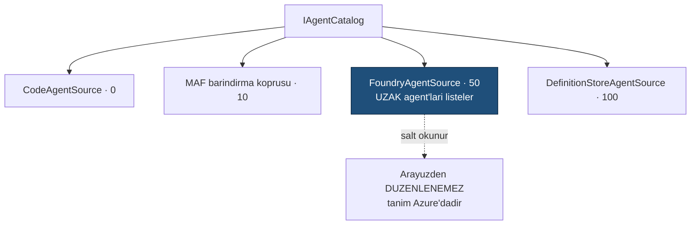

# Faz 27 — Azure OpenAI ve Azure AI Foundry

> **Durum:** 📋 Planlandı
> **Kaynak:** [BEYIN-FIRTINASI.md](BEYIN-FIRTINASI.md) · **F-04**
> **Önkoşul:** [Faz 8](08-SAGLAYICI-GENISLEMESI.md) · [Faz 26](26-ANTHROPIC-VE-GEMINI.md) önerilir (`ProviderSettings` mekanizması)
> **Paketler:** **`AgentPrism.Azure` (YENİ)**
> **Migration:** Yok

---

## Bu Faza Başlarken

1. [`03-SAGLAYICI-VE-DERLEYICI.md`](03-SAGLAYICI-VE-DERLEYICI.md) — sağlayıcı şablonu
2. [`KARARLAR.md`](KARARLAR.md) — **K-008** (ön sürüm bağımlılığı izole), **K-009** (sırlar user-secrets), **K-019** (`IAgentSource`), **K-030** (sunucu tarafı durum sorunu)
3. [`26-ANTHROPIC-VE-GEMINI.md`](26-ANTHROPIC-VE-GEMINI.md) — `ProviderSettings`
4. Bu doküman

---

## Amaç

Kurumsal .NET dünyasının varsayılan yolu Azure'dur. İki **ayrı** yetenek vardır
ve karıştırılmamalıdır:

| Yetenek | Ne | AgentPrism'deki yeri |
|---------|-----|----------------------|
| **Azure OpenAI** | Aynı modeller, Azure uç noktası ve kimliği | Bir `IModelProvider` — kolay |
| **Azure AI Foundry Agents** | Azure'da **barındırılan** agent'lar | Bir `IAgentSource` — farklı ve zor |

---

## 27.1 — Azure OpenAI (kolay yarı)

`Azure.AI.OpenAI` 2.1.0 `AzureOpenAIClient` sunar ve `Microsoft.Extensions.AI.OpenAI`
ile `IChatClient`'e dönüşür. Şekil `AgentPrism.OpenAI` ile neredeyse aynıdır.

```csharp
builder.AddAgentPrism()
       .UseAzureOpenAI(o =>
       {
           o.Endpoint   = new Uri("https://….openai.azure.com/");
           o.Deployment = "gpt-…";              // Azure'da model degil DEPLOYMENT adi
           o.Credential = AzureCredentialKind.ManagedIdentity;   // veya ApiKey
       });
```

### 🚨 Deployment ≠ model

Azure'da çağrılan şey **deployment adıdır**; aynı model farklı adlarla
konuşlandırılabilir. `ModelBinding.Model` alanı Azure sağlayıcısında deployment
adını taşır. Bu, model kataloğunda (K-032) **açıkça** belirtilir; kullanıcı
"gpt-5.4-mini yazdım ama bulunamadı" hatasını anlamalıdır.

### Managed identity

AgentPrism'in "sır saklamama" duruşuyla en iyi örtüşen kimlik yoludur: API
anahtarı hiç yoktur.

```csharp
new AzureOpenAIClient(endpoint, new DefaultAzureCredential())
```

**Bedeli bir bağımlılıktır:** `Azure.Identity`. Bu paket küçük değildir ve
geçişli bağımlılık taşır. K-007 gereği bu **bilinçli bir karardır** ve yalnız
`AgentPrism.Azure` paketine girer — diğer paketler etkilenmez.

Ölçülmesi gerekenler ve karara yazılacaklar:

```bash
dotnet list src/AgentPrism.Azure/AgentPrism.Azure.csproj package --include-transitive
```

- Kaç doğrudan/geçişli bağımlılık geldi?
- AOT uyumu var mı? (`Azure.Identity` yansıma kullanır — büyük olasılıkla
  `AgentPrismAotCompatible = false`)

Alternatif: kimlik bilgisini **tüketici** verir.

```csharp
o.CredentialFactory = () => new DefaultAzureCredential();   // Azure.Identity TUKETICIDE
```

Bu yolla `AgentPrism.Azure` yalnız `Azure.Core` soyutlamasına bağlanır ve
`Azure.Identity` tüketicinin tercihi olur. **Öneri budur.**

---

## 27.2 — Azure AI Foundry Agents (zor yarı)

### ⚠️ Sürüm uyarısı

`Microsoft.Agents.AI.Foundry` paketinin bilinen sürümü **1.5.0**'dır; MAF
çekirdeği **1.16.0**. Uygulamadan önce doğrulanmalıdır:

```bash
dotnet package search "Microsoft.Agents.AI.Foundry" --exact-match --format json
```

1.16.0 ile uyumlu bir sürüm yoksa bu bölüm **yapılmaz**. İki farklı sürümlü MAF
paketini bir arada kullanmak, K-008'in izole etmeye çalıştığı sorunun aynısıdır
ve çalışma anında tip yükleme hatalarına yol açar.

### Mimari karar: Foundry agent'ları bir `IAgentSource`'tur

Foundry agent'ı **uzakta yaşar**. Talimatı, tool'ları ve konuşma durumu Azure
tarafındadır. AgentPrism onu derlemez, **keşfeder**.



Sonuçları açıkça yazmak gerekir:

| Konu | Durum |
|------|-------|
| Agent tanımı | **Salt okunur** — arayüzden düzenlenemez, sürümlenemez |
| Tool'lar | Azure tarafında tanımlıdır; AgentPrism'in tool defteri geçerli değildir |
| Konuşma durumu | Azure'da tutulur — K-030'un aynı gerilimi: kalıcılık, kiracı yalıtımı ve replay vaatleri **zayıflar** |
| Çalıştırma kaydı | `runs` satırı yazılır; olaylar akıştan alınır. Span'ler eksik olabilir |
| Onay akışı | AgentPrism'in tool onayı **uygulanamaz** — tool'lar uzakta çalışır |

🚨 **Bu, bir yetenek değil, bir ödünleşmedir.** Kullanıcı Foundry agent'ı
kullanırken AgentPrism'in sağladığı garantilerin bir kısmını kaybeder. Arayüz
bu agent'ları **ayrı bir rozetle** gösterir ve detay ekranında hangi
özelliklerin geçerli olmadığını **listeler**. Sessizce yarım çalışan bir
özellik, hiç olmayan özellikten kötüdür.

---

## 27.3 — Paket Yapısı

```
src/AgentPrism.Azure/
├── AzureOpenAIProviderOptions.cs         // class (K-035)
├── AzureOpenAIProviderOptionsValidator.cs
├── AzureOpenAIChatClientFactory.cs
├── AzureOpenAIModelProvider.cs           // IModelProvider + IModelProviderHealthCheck
├── AzureProviderExtensions.cs            // UseAzureOpenAI(...) · UseFoundryAgents(...)
├── Foundry/FoundryAgentSource.cs         // IAgentSource · KOSULLU
└── README.md
```

`UseFoundryAgents` ayrı bir çağrıdır. Kullanıcı yalnız Azure OpenAI istiyorsa
Foundry bağımlılığı **hiç yüklenmez** — koşullu `PackageReference` ile değil,
kod yolunun hiç çağrılmamasıyla; paket referansı yine de gelir, bu yüzden
Foundry desteği ayrı bir pakete alınması da düşünülebilir (açık soru 2).

---

## Testler

| Proje | Yeni test |
|-------|-----------|
| `AgentPrism.Azure.UnitTests` (**yeni**) | Kayıt; deployment adı eşlemesi; kimlik fabrikası; katalog yapılandırmadan; sır sızmayan `ToString` |
| `AgentPrism.AspNetCore.FunctionalTests` | Foundry agent'ının katalogda salt okunur görünmesi; düzenleme denemesinin `400`/`409` vermesi |

Gerçek Azure kaynağı olmadan test edilemeyen kısımlar **açıkça** işaretlenir;
sahte (fake) `IChatClient` ile eşleme testleri yazılır. Gerçek doğrulama
kullanıcının Azure aboneliğiyle yapılır ve çıktısı dokümana eklenir.

---

## Bu Fazda Verilecek Kararlar

1. **`Azure.Identity` bağımlılığı alınmadı; kimlik fabrikası tüketiciden gelir.**
2. **`ModelBinding.Model` Azure'da deployment adıdır** — dokümante edilir.
3. **Foundry agent'ları salt okunur bir `IAgentSource`'tur**; kaybedilen
   garantiler listelenir.
4. **Foundry sürüm uyumu sağlanmazsa bu bölüm yapılmaz.**
5. **AOT durumu ölçümle.**

---

## Açık Sorular

1. **Foundry bu fazda mı, ertelensin mi?** Sürüm uyumsuzluğu ihtimali yüksek.
   Öneri: **Azure OpenAI yapılır**, Foundry sürüm doğrulamasına bağlanır.
2. **Foundry ayrı bir paket mi olsun (`AgentPrism.Azure.Foundry`)?** Bağımlılığı
   izole eder. Öneri: **evet**, eğer Foundry yapılacaksa.
3. **Azure OpenAI'ın Responses yüzeyi destekleniyor mu?** Ölçülmeli; K-030
   gereği sunucu tarafı depolama **kapalı** olmalıdır.
4. **AAD/Entra rolleri AgentPrism rolleriyle (Faz 9) eşleşsin mi?** Öneri:
   **hayır** — eşleme tüketicinin policy tanımıdır, AgentPrism varsayım yapmaz.

---

## Bitiş Ölçütleri (DoD)

- [ ] `AgentPrism.Azure` paketi üretiliyor
- [ ] Azure OpenAI deployment'ı ile gerçek çalıştırma ve tool çağrısı çalışıyor
- [ ] Managed identity yolu belgelendi ve örnekle gösterildi
- [ ] Deployment/model ayrımı README'de açık
- [ ] (Foundry yapıldıysa) uzak agent katalogda salt okunur görünüyor ve
      kaybedilen garantiler arayüzde listeleniyor
- [ ] Bağımlılık sayısı ölçüldü ve karar defterine yazıldı
- [ ] Dört doğrulama kapısı sıfır uyarı

---

## Riskler

| Risk | Önlem |
|------|-------|
| `Microsoft.Agents.AI.Foundry` sürüm uyumsuzluğu | Önce doğrulanır; uymazsa yapılmaz |
| `Azure.Identity` bağımlılık şişmesi | Kimlik fabrikası tüketiciden |
| Foundry ile garantiler sessizce kaybolur | Arayüzde açık liste; dokümanda ödünleşme tablosu |
| Gerçek Azure olmadan test edilemez | Sahte istemci ile eşleme testleri; gerçek doğrulama kullanıcı aboneliğiyle |
| Deployment adı karışıklığı | README + hata mesajı ("deployment bulunamadı, model adı değil deployment adı bekleniyor") |

---

## Sonraki Faza Devir Notu

- Bu faz sonunda sağlayıcı ailesi tamamlanır: OpenAI, uyumlu uçlar, yerel,
  Anthropic, Google, Azure. `MIMARI.md` bölüm 2'deki paket grafiği güncellenir.
- Faz 20'nin fiyat çözümlemesi Azure'da farklıdır (kurumsal anlaşma fiyatı);
  `AgentPrism:Pricing` bölümü bunu zaten karşılar.
