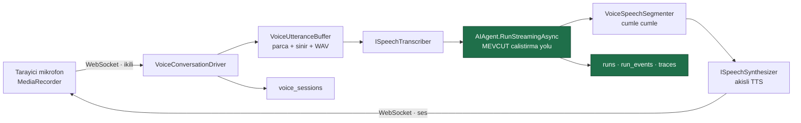
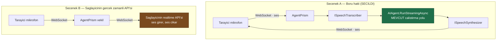
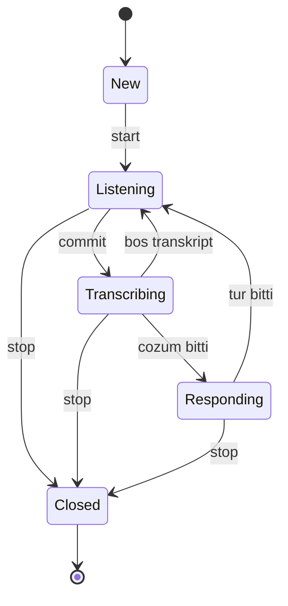

# Faz 29 — Konuşma Katmanı (Gerçek Zamanlı Ses)

> **Durum:** ✅ Tamamlandı (2026-08-05)
> **Kaynak:** [BEYIN-FIRTINASI.md](BEYIN-FIRTINASI.md) · **F-13** (2/2) · Kullanıcı kararı **K-065**
> **Önkoşul:** [Faz 28](28-SES-TOOLLARI.md) — sağlayıcı soyutlamaları oradan gelir
> **Sonraki:** [Faz 30](30-ARAYUZ-CILASI.md) — arayüz cilası ve i18n
> **Paketler:** `.Abstractions`, `.Core`, `.AspNetCore`, `.Sql.Shared` + üç SQL sağlayıcısı, `.UI`
> **Migration:** 0016 (Postgres) / 0004 (SqlServer, Sqlite)

---

## Amaç ve Sonuç

Kullanıcı **konuşsun ve konuşulan cevabı duysun** — ama AgentPrism'in kontrol
düzlemi vaatleri (çalıştırma kaydı, span, maliyet, onay, kiracı, kota) askıya
alınmadan.

**Sonuç:** Tarayıcıdan konuşulup sesli yanıt alınıyor. Her konuşma turu **normal
bir `runs` satırı** üretiyor; token sayımı, span'ler ve tool onayı aynen
çalışıyor. Kesinti (barge-in) çalıştırmayı `Canceled` olarak kapatıyor ve yarım
kalan yanıt oturum geçmişine kesildiği belirtilerek yazılıyor.



---

## ⚠️ Bu Faz Barındırma Modelini Değiştirir

Bugüne kadar AgentPrism **istek/yanıt** çalıştı: HTTP gelir, SSE ile akar, biter.
Gerçek zamanlı ses bunu değiştirir:

| Konu | Faz 28'e kadar | Bu fazdan sonra |
|------|-------|-----------------|
| Bağlantı | Kısa ömürlü HTTP | Dakikalarca açık WebSocket |
| Durum | İstek başına | Bağlantı boyunca sunucuda |
| Ölçekleme | Herhangi bir örnek | Bağlantı **bir örneğe bağlı** (yapışkan oturum) |
| Ters vekil | Standart | WebSocket geçişi ve zaman aşımı ayarı gerekir |

Bu yüzden yetenek **isteğe bağlıdır**: `UseVoiceConversation()` çağrılmazsa
`VoiceConversationDriver` kaydedilmez, WebSocket ucu **hiç bağlanmaz** ve
`UseWebSockets()` ara yazılımı da kurulmaz.

> 🚨 Uç, "var ama kapalı" anlamına gelen **501 dönmez**; adres gerçekten
> yoktur ve istek **404** alır. Faz 28'in `/api/voice/*` uçları 501 döner çünkü
> onlar her zaman bağlanır — buradaki uç bağlanmaz. Ayrımı test koruyor:
> `UseVoiceConversation_cagrilmadiysa_HICBIR_uc_acilmaz`.

---

## 29.0 — Plandan Sapmalar

Beş sapma var; hepsi ölçümle veya kuralla gerekçelendirildi.

### S1 — 🚨 Konuşma katmanı `AgentPrism.Voice`'ta **değil**, `Core`'da

Plan "Paketler: `AgentPrism.Voice` (genişler)" diyordu. **Yanlış.** Boru hattı
(Seçenek A) yalnızca `ISpeechTranscriber` ve `ISpeechSynthesizer`
soyutlamalarını kullanır; ElevenLabs'e hiç dokunmaz. Katman `AgentPrism.Voice`'a
konsaydı iki şey olurdu:

1. `AgentPrism.AspNetCore` konuşma ucunu sunmak için `AgentPrism.Voice`'a
   referans vermek zorunda kalırdı — **paket yönü kuralı** bunu yasaklar.
2. Kendi cözüm/sentez uygulamasını kaydeden bir tüketici, kullanmadığı ElevenLabs
   paketini kurmak zorunda kalırdı.

**Yapıldı.** Sürücü `AgentPrism.Core/Voice/`, sözleşmeler
`AgentPrism.Abstractions/Voice/`, uç `AgentPrism.AspNetCore/Voice/`.
`AgentPrism.Voice` bu fazda **hiç değişmedi**. Karar K-222.

### S2 — Artımlı transkript **yok**; `IStreamingSpeechTranscriber` yazılmadı

Faz 28'in devir notu artımlı çözümü ayrı bir arayüz olarak öneriyordu. Kullanıcı
kararıyla **tek atımlı** yol seçildi: istemci `commit` gönderir, sunucu biriken
sesi tek bir `TranscribeAsync` çağrısıyla çözer ve `transcript{final:true}`
yollar.

Gerekçe: artımlı çözüm sağlayıcının realtime STT WebSocket'ini gerektirir ve o
sözleşme **gerçek abonelik olmadan doğrulanamaz** (Faz 28'de taklit uçla iki
belirsizlik zaten açık kaldı). Uygulaması olmayan bir arayüz yazmak da ölü
soyutlama üretirdi.

Sonuç: geçici (interim) transkript yoktur ve bu [29.7](#297--sağlanamayan-şeyler-dürüstlük-bölümü)'ye yazıldı.
Protokoldeki `final` alanı yerinde durur; hep `true` gelir.

### S3 — `PersistAudio` yalnız **agent'ın ürettiği sesi** saklar

Plan "ses `attachments`'a yazılır" diyordu, yönü söylemiyordu. Kullanıcının sesi
**hiçbir zaman** saklanmaz:

- Ses **biyometrik veridir**; söylenenin kaydı zaten oturum geçmişindeki
  transkripttir. İkinci bir kopya risk ekler, bilgi eklemez.
- Tarayıcı WebM/Opus üretir ve `AttachmentTypeGuard` EBML imzasını tanımaz.
  Tanıması için sihirli bayt listesine EBML eklemek gerekirdi; bu, `audio/*`
  beyaz listesi üzerinden **video WebM**'i de ek yüklemesine açardı. Denetleyici
  bu fazda hiç değişmedi.

Denetim izi açısından değerli olan taraf zaten agent'ın söyledikleridir.
Karar K-225.

### S4 — Sunucu `UseWebSockets()`'i **kendisi** kurar

Kestrel `IHttpWebSocketFeature` sağlamaz; onu `WebSocketMiddleware` kurar.
Tüketiciden ayrıca `app.UseWebSockets()` istemek `MapAgentPrism`'in **tek giriş
noktası** olma kuralını (K1) bozardı ve hata yalnızca ilk konuşma denemesinde
görünürdü.

`MapAgentPrism` ara yazılımı **yalnızca** sürücü kayıtlıyken ve `endpoints` bir
`IApplicationBuilder` iken kurar. Zaten kuruluysa ikinci örnek
`IHttpWebSocketFeature`'ı dolu bulur ve dokunmadan geçer. Karar K-223.

### S5 — Elle kapatma düğmesi eklendi (`Send now`)

Plan yalnız istemci VAD'i öngörüyordu. Sessizlik tespiti gürültülü bir ortamda
**hiç tetiklenmez**; ayrıca bas-konuş isteyen kullanıcı duraklama beklemek
zorunda kalır. Arayüz dinlerken bir "Send now" düğmesi gösterir; düğme kaydediciyi
durdurur ve `commit` aynı yoldan gider.

Yan fayda: E2E testi bunu kullanır — Chromium'un sahte ses cihazı **sürekli ton**
üretir ve hiç susmaz, dolayısıyla VAD ile test edilemez.

---

## 29.1 — Neden Seçenek A



| | Seçenek A | Seçenek B |
|---|-----------|-----------|
| Çalıştırma kaydı, span, maliyet | **Tam** — ölçüldü, aşağıdaki çıktı 2 | Eksik — model çağrısı vekilin dışında |
| Tool onayı, kiracı, kota | **Çalışır** | Uygulanamaz veya yeniden yazılır |
| Gecikme | Daha yüksek (üç adım) | Daha düşük |
| Sağlayıcı bağımsızlığı | **Var** | Yok — sağlayıcıya özgü protokol |
| Kesinti noktası (barge-in) | Bizim işimiz | Sağlayıcı çözer |

**Seçenek A seçildi** (K-222). AgentPrism bir kontrol düzlemidir; gözlemlenebilirlik,
onay ve kota vaatlerini ses için askıya alamaz. Seçenek B açık soru olarak durur.

---

## 29.2 — Gerçekleşen Public API

```csharp
// AgentPrism.Abstractions/Voice/ConversationContracts.cs — HTTP katmani bu tipleri gorur (K-174)
public sealed record VoiceSessionRecord
{ Id · TenantId · SessionId · AgentName · StartedAt · EndedAt ·
  Turns · InputSeconds · OutputChars · EndReason · CreatedBy }

public enum VoiceSessionEndReason { Client = 0, IdleTimeout = 1, DurationLimit = 2, Error = 3, ServerShutdown = 4 }

public sealed record VoiceSessionQuery { AgentName · SessionId · Skip · Take }

public interface IVoiceSessionStore
{
    ValueTask SaveAsync(VoiceSessionRecord record, CancellationToken ct = default);
    ValueTask<IReadOnlyList<VoiceSessionRecord>> QueryAsync(string tenantId, VoiceSessionQuery query, CancellationToken ct = default);
}

// AgentPrism.Core/Voice/
public sealed class VoiceConversationOptions          // class (K-035)
{
    public const string SectionName = "AgentPrism:Voice:Conversation";
    MaxConcurrentConnectionsPerTenant = 5 · MaxConnectionDuration = 30dk · IdleTimeout = 2dk ·
    MaxUtteranceDuration = 60sn · MaxUtteranceBytes = 8 MB · PersistAudio = false ·
    VoiceId · OutputMediaType = "audio/mpeg" · InputSampleRate = 16000 ·
    MaxSpokenCharactersPerTurn = 5000
}

public static class VoiceConversationProtocol         // cerceve adlari + alt protokol
{ SubProtocol · TokenSubProtocolPrefix · ClientStart/Commit/Cancel/Stop ·
  ServerReady/Transcript/RunStarted/Text/AudioStart/AudioEnd/Error/Done }

public static class VoiceAudioFormats { WebmOpus · Pcm16 · IsKnown(...) }

public sealed record VoiceConversationRequest { TenantId · SessionId · CreatedBy }

public sealed class VoiceConversationDriver
{
    public VoiceConnectionLimiter Limiter { get; }
    public bool IsReady { get; }         // cozum VE sentez kayitli mi
    public bool PersistAudio { get; }
    public Task RunAsync(WebSocket socket, VoiceConversationRequest request, CancellationToken ct = default);
}

public sealed class VoiceConnectionLimiter { int Limit · VoiceConnectionLease? TryAcquire(string tenantId) · int CountFor(string) }
public sealed class VoiceConnectionLease : IDisposable;
public sealed class InMemoryVoiceSessionStore : IVoiceSessionStore;

public static class VoiceConversationBuilderExtensions
{
    public static IAgentPrismBuilder UseVoiceConversation(this IAgentPrismBuilder b, IConfiguration section, Action<VoiceConversationOptions>? configure = null);
    public static IAgentPrismBuilder UseVoiceConversation(this IAgentPrismBuilder b, Action<VoiceConversationOptions>? configure = null);
}
```

`RetentionTargets` **değişti**: `VoiceSessions` eklendi.
`BearerTokenValidator` **değişti**: `IsValidToken(ReadOnlySpan<char>, string)` eklendi (internal).

> ⚠️ **`VoiceConversationDriver.RunAsync` bir `System.Net.WebSockets.WebSocket`
> alır.** Bir soyutlama katmanı eklenmedi: `WebSocket` temel sınıf
> kütüphanesindedir, `AgentPrism.Core` zaten onu görür ve ara bir arayüz yalnızca
> `AgentPrism.AspNetCore`'un uygulaması gereken ikinci bir public tip üretirdi.

---

## 29.3 — Protokol

Tek bir WebSocket ucu:

```
GET {prefix}/api/voice/sessions/{sessionId}/stream   (Upgrade: websocket)
```

İstemci → sunucu ikili çerçeveler: ses. Metin çerçeveleri: denetim mesajları (JSON).
Sunucu → istemci: ses çerçeveleri + JSON olay çerçeveleri.

```jsonc
// istemci → sunucu
{ "type": "start",  "agent": "destek", "voiceId": "…", "inputFormat": "webm-opus" }
{ "type": "commit" }                       // konusma bitti, simdi cevapla
{ "type": "cancel" }                       // barge-in: uretimi kes
{ "type": "stop"  }

// sunucu → istemci
{ "type": "ready",       "agent": "destek", "sessionId": "…", "persistAudio": false }
{ "type": "transcript",  "text": "…", "final": true }
{ "type": "runStarted",  "runId": "019fd3…" }
{ "type": "text",        "delta": "…" }    // metin yaniti (altyazi)
{ "type": "audioStart",  "mediaType": "audio/mpeg" }
// ...ikili ses cerceveleri...
{ "type": "audioEnd" }
{ "type": "error",       "message": "…" }
{ "type": "done",        "cancelled": false, "turn": 1, "attachmentId": "…" }
```

Plandaki listeye iki ekleme yapıldı: **`ready`** (el sıkışmanın kabul edildiğini
söyler; sessizlik "başarılı" anlamına gelmemelidir) ve `done` üzerindeki
`cancelled`/`turn`/`attachmentId` alanları.

### Durum makinesi



Üç kural saf mantıkta yaşar (`VoiceConversationStateMachine`) ve birim testlidir:

| Olay | Kural |
|---|---|
| İkinci `start` | **Reddedilir** — agent, oturum ve kiracı bağlantı boyunca sabittir |
| Agent konuşurken gelen ses | **Yok sayılır** — hoparlörden gelen kendi sesi kesinti sanılmamalıdır |
| `cancel` | Durumu **değiştirmez**; dinlemeye dönüşü yalnız tur görevi yapar. Değiştirseydi istemci hemen yeni bir `commit` gönderir ve iki tur aynı anda çalışırdı |

### Konuşma sonu tespiti (VAD)

- **İstemci tarafında.** Tarayıcı `AnalyserNode` ile RMS ölçer; konuşmadan sonra
  900 ms sessizlik `commit` gönderir. Cümle içi kısa duraklama kesmez
  (`minSpeechMs` + `hangoverMs`, `voice.test.ts` ile korunuyor)
- **Elle kapatma** düğmesi de vardır (S5)
- Sunucu bir **güvenlik ağı** taşır: `MaxUtteranceDuration` (60 sn) veya
  `MaxUtteranceBytes` (8 MB) dolduğunda parça kendiliğinden kapatılır.
  🚨 İki sınır da gerekir: süre sınırı yalnız ham PCM'de bayt sayısından
  hesaplanabilir, sıkıştırılmış kapta süre bilinmez

### Ses biçimleri

| Biçim | Nereden | Sunucuda ne olur |
|---|---|---|
| `webm-opus` (varsayılan) | `MediaRecorder` | Parçalar birleştirilir; kap zaten geçerlidir |
| `pcm16` | `AudioWorklet` | 🚨 Başlıksızdır — sunucu **44 baytlık WAV başlığı** yazar |

Ham PCM tek başına bir dosya değildir; çözüm ucu onu `multipart/form-data`
içinde bir dosya olarak alır ve türünü başlıktan tanır. Başlık yazılmazsa
sağlayıcı sesi ya reddeder ya da yanlış hızda çözer. Bir ses kütüphanesi
**alınmadı**: 44 bayt sabittir.

🚨 **Kaydedici her konuşma parçası için yeniden başlatılır.** Zaman dilimli bir
`MediaRecorder` kap başlığını **yalnız ilk parçaya** yazar; aynı kayıttan alınan
ikinci parça başlıksız gelir ve çözülemez.

### Kesinti (barge-in)

İstemci `cancel` gönderir. Sunucu: TTS akışını durdurur, tur `CancellationToken`'ını
tetikler, çalıştırma `Canceled` olarak kapanır. Yarım kalan yanıt
`ChatHistoryProvider.InvokedAsync` ile geçmişe **yazılır**:

```
Sipariş

[Yanit kullanici tarafindan kesildi.]
```

🚨 Bu adım atlanamaz. Akışlı çalıştırma iptal edildiğinde MAF geçmişi yazmaz;
model bir sonraki turda kendi yarım cümlesini **görmez** ve kullanıcı "az önce
söylediğin" dediği anda konuşma kopar.

---

## 29.4 — Güvenlik ve Erişim

WebSocket ucu, mevcut üç katmanın **tamamına** tabidir (K-010).

| Konu | Uygulama |
|------|----------|
| Loopback | `AgentPrismEndpointFilter` — dördüncü uç grubu |
| Bearer token | 🚨 **Alt protokolde**: `Sec-WebSocket-Protocol: agentprism.voice.v1, agentprism.token.<token>`. Sorgu dizesinde **kabul edilmez** |
| Authorization policy | Grup üzerinde `RequireAuthorization` |
| Rol | `Operator` — konuşmak ücret üretir |
| Kiracı | Bağlantı kurulurken çözülür, bağlantı boyunca **sabit** |
| Oturum sahipliği | `sessionId` güvenilmez girdidir; başka kiracının oturumu **404** ("yok" gibi yanıtlanır, varlığı bildirilmez) |
| Bağlantı sınırı | Kiracı başına 5; **soket yükseltilmeden önce** ayrılır → `429` |
| Süre sınırı | 30 dakika; boşta 2 dakika. Kapanış nedeni kayda yazılır |
| Ses saklama | Varsayılan **kapalı** |

**Token neden alt protokolde:** tarayıcı bir WebSocket el sıkışmasına
`Authorization` başlığı **ekleyemez**. Sorgu dizesi ise sunucu günlüklerine, ters
vekil günlüklerine ve tarayıcı geçmişine yazılır. Alt protokol standart kaçış
yoludur. Uç bu yüzden **dördüncü** bir `MapGroup`'tadır
(`requireBearerToken: false`) ve token'ı kendisi sabit zamanda doğrular — arayüz
kabuğu (K-046) ve MCP OAuth geri dönüşünde kullanılan aynı desen.

🚨 **Ses kişisel veridir.** `PersistAudio` varsayılan kapalıdır ve açıldığında
yalnız **agent'ın ürettiği ses** saklanır (S3). Arayüz kayıt yapıldığını
`ready` çerçevesindeki `persistAudio` alanından okuyup **görünür biçimde**
gösterir.

---

## 29.5 — Veri Modeli (Migration 0016 / 0004 / 0004)

```sql
CREATE TABLE IF NOT EXISTS {schema}.voice_sessions (
    id            uuid        NOT NULL PRIMARY KEY,
    tenant_id     text        NOT NULL,
    session_id    text        NOT NULL,
    agent_name    text        NOT NULL,
    started_at    timestamptz NOT NULL,
    ended_at      timestamptz,
    turns         integer     NOT NULL DEFAULT 0,
    input_seconds numeric(12,3),
    output_chars  bigint,
    end_reason    smallint,
    created_by    text
);

CREATE INDEX IF NOT EXISTS voice_sessions_tenant_started_idx
    ON {schema}.voice_sessions (tenant_id, started_at DESC);
```

- Ses **içeriği** bu tabloda durmaz; saklanıyorsa `attachments`'tadır (Faz 14)
- `input_seconds` sağlayıcının bildirdiği süredir; bildirmezse ham PCM'de bayt
  sayısından hesaplanır, sıkıştırılmış kapta **`NULL` kalır** — sıfır değil (K-032)
- `session_id` yabancı anahtar **değildir**: oturum silinse bile konuşmanın
  yapıldığı gerçeği kalır
- Saklama hedefi olarak eklendi (`RetentionTargets.VoiceSessions`); yalnız
  **kapanmış** bağlantılar silinir (`ended_at IS NOT NULL`) — `NULL`, sunucunun
  çöktüğü bir bağlantının izidir
- `GET /api/voice/sessions` (Reader) kayıtları listeler; konuşma katmanı kapalıysa
  **boş liste** döner, 501 değil

---

## 29.6 — Arayüz

Playground'un besteci satırında bir **mikrofon düğmesi**; basıldığında altta
konuşma paneli açılır.

- Ses seviyesi göstergesi (12 çubuk), canlı transkript, altyazı olarak akan metin
- Dinlerken **"Send now"**, agent konuşurken **"Interrupt"** düğmesi
- `persistAudio` açıksa görünür bir rozet: *"Audio of the reply is being stored"*
- Güvenli bağlam yoksa panel açılmaz; yerine açık bir mesaj çıkar

Teknik notlar:

- Yakalama **`MediaRecorder`** ile (`audio/webm;codecs=opus`, 250 ms dilim).
  `AudioWorklet` yolu protokolde açıktır (`pcm16`) ama arayüz onu kullanmaz:
  ölçülen bundle farkı ayrı bir worklet girişini haklı çıkarmadı
- Oynatma `AudioContext.decodeAudioData` ile; bir **parça tam bir dosyadır**,
  bu yüzden her tarayıcıda çözülür. Kısmi akışı beslemek Media Source
  Extensions gerektirirdi ve ham ses kaplarında desteği eşit değildir
- Ses kütüphanesi **alınmadı**
- Bundle: **122,5 KB → 124,9 KB gzip** (+2,4 KB; hedef +10 KB, bütçe 250 KB)

> Tarayıcı mikrofon erişimi **güvenli bağlam** (HTTPS veya localhost) ister.
> Uzak bir kurulumda HTTP üzerinden konuşma modu **çalışmaz**; arayüz bunu
> açıkça söyler, sessizce başarısız olmaz.

---

## 29.7 — Sağlanamayan Şeyler (dürüstlük bölümü)

- **Artımlı (geçici) transkript yoktur.** Transkript konuşma bitince, tek
  parça hâlinde gelir (S2)
- **Telefon (SIP/PSTN) entegrasyonu yoktur**
- **Ses klonlama ve ses ile kimlik doğrulama yoktur**
- **Gürültü bastırma ve yankı giderme tarayıcıya bırakılmıştır**
  (`echoCancellation`, `noiseSuppression` kısıtları)
- **Çok konuşmacılı ayrıştırma yoktur**
- **Kullanıcının sesi hiçbir zaman saklanmaz** (S3)
- **Ses dakikası bir kota birimi değildir.** Koruma bağlantı sayısı, bağlantı
  süresi ve parça süresi sınırlarından gelir; `QuotaEnforcer` token ve çalıştırma
  saymaya devam eder. Her tur bir `runs` satırı ürettiği için token kotası zaten
  işler (kullanıcı kararı)
- **Yapışkan oturum gerekir.** Bağlantı bir sunucu örneğine bağlıdır; dağıtık
  durum kapsam dışıdır
- **Gecikme sağlayıcıya bağlıdır** — aşağıdaki ölçüm sağlayıcı gecikmesini
  **içermez**

---

## Testler

**1838 test geçiyor** (+72). SQL Server'ın 223 testi bu makinede koşmuyor ve bu
sayıya **dâhil değildir**.

> ⚠️ Faz 28'in dokümanındaki 1866 sayısı, o dokümandaki proje kırılımlarının
> toplamıyla (1766) tutmuyor. Sayı bu fazda yeniden ölçüldü.

| Proje | Sayı | Eklenen |
|-------|------|---------|
| `AgentPrism.Core.UnitTests` | 511 | +30 |
| `AgentPrism.AspNetCore.FunctionalTests` | 285 | +17 |
| `AgentPrism.PostgreSql.IntegrationTests` | 460 | +16 (8 sözleşme × 2) |
| `AgentPrism.Sqlite.IntegrationTests` | 224 | +8 (sözleşme) |
| `AgentPrism.Ui.E2ETests` | 31 | +1 |
| Vitest (arayüz) | 93 | +13 |

| Test sınıfı | Neyi doğrular |
|---|---|
| `VoiceConversationStateMachineTests` | İkinci `start` reddi; konuşurken gelen sesin yok sayılması; kesintinin durumu değiştirmemesi; boş turun sayılmaması |
| `VoiceSpeechSegmenterTests` | Cümle sınırı; metnin sonundaki noktanın beklenmesi; kısa parçanın birleştirilmesi; noktalama yoksa uzunluk sınırı |
| `VoiceUtteranceBufferTests` | **WAV başlığı** (RIFF/WAVE/data, 16 kHz, mono, 16-bit); PCM süresinin bayttan hesaplanması; iki sınır |
| `VoiceConnectionLimiterTests` | Kiracı başına sınır; **64 paralel istekte sınırın aşılmaması**; çift bertarafın sayacı bozmaması |
| `VoiceConversationTests` (fonksiyonel) | Uçtan uca tur; her turun bir `runs` satırı üretmesi; kesintinin geçmişe yazılması; kayıt; token'ın alt protokolde **kabul**, sorgu dizesinde **ret**; kiracı sahipliği; bağlantı sınırı; `PersistAudio` açık/kapalı; `UseVoiceConversation()` yoksa **404** |
| `VoiceSessionStoreContract` | Dört uygulamada aynı davranış; ondalık **kesilmez**; aynı kimlikle ikinci yazma **günceller** |
| `UiTests` | Sahte medya cihazıyla mikrofonun açılması, transkriptin görünmesi, kayıt rozetinin **görünmemesi** |
| `voice.test.ts` | VAD: cümle içi duraklamanın kesmemesi, kısa tıkırtının konuşma sayılmaması; token'ın alt protokole yazılması |

**Gerçek ses sağlayıcısı çağrısı yapan test yoktur** (Faz 3'ten beri geçerli karar).

---

## Bitiş Ölçütleri (DoD)

Elle doğrulama: `samples/AgentPrism.Api`, 2026-08-05. Model çağrıları **gerçek
OpenAI**'a gitti; ses sağlayıcısı ElevenLabs'in veri düzlemi sözleşmesini birebir
taklit eden yerel bir uçtu (Faz 27/28'in deseni).

| Ölçüt | Durum | Kanıt |
|---|---|---|
| Tarayıcıdan konuşulup sesli yanıt alınıyor | ✅ | E2E `…konusma_modu_mikrofonu_acar…` + aşağıdaki çıktı 1 |
| Her tur normal bir `runs` satırı üretiyor; span ve maliyet görünüyor | ✅ | çıktı 2 — `Completed`, 413 token |
| Kesinti çalışıyor; kesilen yanıt geçmişe yazılıyor | ✅ | çıktı 3 — `Canceled` + `[Yanit … kesildi.]` |
| Kimlik doğrulama katmanları WebSocket'te de geçerli | ✅ | `Token_alt_protokolde_kabul_edilir`, `Token_SORGU_DIZESINDE_kabul_EDILMEZ` |
| Bağlantı ve süre sınırları uygulanıyor | ✅ | `Es_zamanli_baglanti_siniri_uygulanir`; süre sınırı `end_reason` ile kayda yazılır |
| Ses varsayılan saklanmıyor; açıldığında `attachments`'a yazılıyor | ✅ | `Ses_varsayilan_olarak_SAKLANMAZ`, `PersistAudio_acikken_…` |
| Gecikme ölçüldü ve dokümana yazıldı | ✅ | çıktı 1 |
| `UseVoiceConversation()` çağrılmadığında hiçbir uç açılmıyor | ✅ | `…HICBIR_uc_acilmaz` → **404** |
| Bundle ölçüldü; dört doğrulama kapısı sıfır uyarı | ✅ | +2,4 KB gzip; build/test/pack/format → 0 uyarı, 15 paket |

> ⚠️ **Gerçek ElevenLabs aboneliğiyle doğrulama yapılmadı.** Faz 28'in iki
> belirsizliği açık kalmaya devam ediyor.
>
> ⚠️ **Ölçülen gecikme sağlayıcı gecikmesini İÇERMEZ.** Çözüm ve sentez yerel bir
> taklit uca gitti (~0 ms); ölçülen süre gerçek modelin süresidir. Gerçek bir
> sağlayıcıda çözüm ve sentez için birkaç yüz milisaniye daha eklenir.
>
> ⚠️ **SQL Server sözleşme testleri bu makinede koşmadı.** `mssql/server`
> konteyneri Apple Silicon üzerinde hazır olmuyor (`TimeoutException`) — Faz
> 23'ten beri bilinen ortam sınırı. Migration `0004_voice_sessions.sql` yazıldı
> ama **çalıştırılmadı**.

### Gerçek çıktı (2026-08-05)

```
# 1) UCTAN UCA BIR TUR — gercek OpenAI modeli
baglandi: ws://127.0.0.1:5080/agentprism/api/voice/sessions/conv_76e1…/stream
kabul edilen alt protokol: agentprism.voice.v1
ready         agent=sesli-asistan persistAudio=False
transcript    "siparisim nerede" (3 ms)
runStarted    019fd302-3a65-76bb-9537-62b27d328f8b (10 ms)
audioStart    audio/mpeg (1008 ms)
done          tur=1 kesildi=False (1034 ms)
yanit         : Sipariş durumunu kontrol edebilmem için sipariş numaranı yaz.
ses           : 414 bayt

GECIKME (commit anindan itibaren, saglayici gecikmesi HARIC)
  transkript          :       3 ms
  calistirma basladi  :      10 ms
  ilk metin (altyazi) :     934 ms
  ILK SES             :    1008 ms
  tur bitti           :    1034 ms

# 2) CALISTIRMA KAYDI — ses calistirma yolunu DEGISTIRMEDI
  status      : Completed        isStreaming : true
  agentName   : sesli-asistan    modelId     : gpt-5.4-mini
  sessionId   : conv_defd2758…   eventCount  : 18
  usage       : {input: 394, output: 19, total: 413}

# 3) KESINTI (barge-in)
  cancel        gonderildi (893 ms)
  done          tur=1 kesildi=True (910 ms)
  calistirma    status = Canceled
  oturum gecmisi:
    role=assistant  text="Sipariş\n\n[Yanit kullanici tarafindan kesildi.]"

# 4) KONUSMA KAYDI — ses ICERMEZ
  turns=1  inputSeconds=1.6  outputChars=61  endReason=Client
  # 1.6 = SAGLAYICININ bildirdigi sure. Saglayici bildirmediginde ham PCM'de
  # bayt sayisindan hesaplanan 1.0 kullanildi (olculdu, iki kosu).

# 5) SAGLAYICI UCUNA ULASAN istekler
  POST /v1/speech-to-text                       xi-api-key=…  multipart=32.379 bayt
  POST /v1/text-to-speech/ses-tr-1/stream?output_format=mp3_44100_128
       govde={"text":"Sipariş durumunu kontrol edebilmem için sipariş numaranı yaz.",
              "model_id":"eleven_multilingual_v2"}

# 6) SIR TARAMASI
  8 API ucu + uygulama gunlugu  -> anahtar 0 kez
```

---

## Kullanım

```csharp
builder.AddAgentPrism()
       .UseVoice(configuration.GetSection(VoiceOptions.SectionName))

       // ⚠️ BARINDIRMA MODELINI DEGISTIRIR: WebSocket dakikalarca acik kalir ve
       // BIR sunucu ornegine baglanir. Cagrilmazsa hicbir WebSocket ucu acilmaz.
       .UseVoiceConversation(configuration.GetSection(VoiceConversationOptions.SectionName));
```

```
GET {prefix}/api/voice/sessions/{sessionId}/stream
    Sec-WebSocket-Protocol: agentprism.voice.v1, agentprism.token.<token>
```

Ters vekil arkasında: WebSocket geçişine izin verin ve boşta zaman aşımını
`MaxConnectionDuration` üzerinde tutun. Çok örnekli dağıtımda **yapışkan oturum**
gerekir.

---

## Dosya Listesi (gerçekleşen)

```
src/AgentPrism.Abstractions/
└── Voice/ConversationContracts.cs             YENI — IVoiceSessionStore + kayit (K-174)
    Retention/RetentionTargets.cs              + VoiceSessions

src/AgentPrism.Core/Voice/                     YENI KLASOR — saglayicidan BAGIMSIZ
├── VoiceConversationOptions.cs                sinirlar + PersistAudio (K-035)
├── VoiceConversationProtocol.cs               cerceve adlari + DTO + JsonSerializerContext (AOT)
├── VoiceConversationStateMachine.cs           SAF durum makinesi
├── VoiceUtteranceBuffer.cs                    parca + iki sinir + 🚨 WAV basligi
├── VoiceSpeechSegmenter.cs                    SAF cumle bolucu — gecikmenin kaynagi
├── VoiceConnectionLimiter.cs                  kiraci basina CAS tabanli sayac
├── VoiceConversationDriver.cs                 boru hatti; tek alma dongusu + tek gonderme kilidi
├── InMemoryVoiceSessionStore.cs               ust sinirli
└── VoiceConversationBuilderExtensions.cs      UseVoiceConversation(...)

src/AgentPrism.AspNetCore/
├── Voice/VoiceConversationEndpoint.cs         YENI — 🚨 DORDUNCU uc grubu, token alt protokolde
├── AgentPrismEndpointRouteBuilderExtensions.cs 🚨 UseWebSockets() KOSULLU olarak burada
├── Endpoints/VoiceEndpoints.cs                + GET /api/voice/sessions
└── Security/BearerTokenValidator.cs           + IsValidToken(span, string)

src/AgentPrism.Sql.Shared/
├── Stores/SqlVoiceSessionStore.cs             YENI
├── Internal/SqlQueriesBase.cs                 + 2 sorgu
└── Internal/RetentionTargetRegistry.cs        + voice_sessions (yalniz KAPANMIS)

src/AgentPrism.{PostgreSql,SqlServer,Sqlite}/  migration + sorgu + Replace kaydi

src/AgentPrism.UI/frontend/src/
├── lib/voice.ts                               SAF: VAD, alt protokol, adres, cozumleme
├── lib/voice.test.ts                          13 Vitest
├── components/voice-panel.tsx                 mikrofon, olcer, altyazi, kes, kayit rozeti
├── components/icons.tsx                       + MicIcon, StopIcon
└── screens/playground.tsx                     + konusma modu dugmesi

samples/AgentPrism.Api/                        UseVoiceConversation + appsettings semasi
tests/AgentPrism.Core.UnitTests/Voice/         4 sinif, 30 test
tests/AgentPrism.AspNetCore.FunctionalTests/   VoiceConversationTests + 2 altyapi dosyasi
tests/Shared/Contracts/VoiceSessionStoreContract.cs
```

> 🧹 **Temizlik:** `git` içinde izlenen dört senkronizasyon kopyası silindi
> (`icons 2.tsx`, `api 2.ts`, `types 2.ts`, `playground 2.tsx`). Faz 28
> commit'ine kazayla girmişler; hiçbir yerden import edilmiyorlardı ve bayat
> (Faz 28 öncesi) içerik taşıyorlardı.

---

## Bu Fazda Verilen Kararlar

Karar defterine yazıldı (`docs/KARARLAR.md`, **K-222 – K-227**):

1. **K-222** — Seçenek A (boru hattı) + konuşma katmanı `Core`'da, `Voice`'ta değil.
2. **K-223** — `MapAgentPrism` `UseWebSockets()`'i koşullu olarak kendisi kurar.
3. **K-224** — WebSocket token'ı **alt protokolde** taşınır; sorgu dizesinde kabul edilmez.
4. **K-225** — `PersistAudio` yalnız **agent'ın ürettiği sesi** saklar.
5. **K-226** — Artımlı transkript yok; tek atımlı çözüm (kullanıcı kararı).
6. **K-227** — Ses dakikası bir kota birimi değildir (kullanıcı kararı).

---

## Riskler — kapanış durumu

| Risk | Sonuç |
|---|---|
| Barındırma modeli değişir | **Yönetildi.** Yetenek isteğe bağlı; çağrılmazsa uç yok (404) |
| Uzun bağlantılar kaynak tutar | **Kapandı.** Bağlantı/süre/boşta sınırları + kapanış nedeni kayda yazılıyor |
| Gecikme kabul edilemez | **Kısmen açık.** Model dışı adımlar ~10 ms ölçüldü; sağlayıcı gecikmesi ölçülmedi |
| Ses kişisel veri sızdırır | **Kapandı.** Varsayılan saklamama + kullanıcının sesi hiç saklanmaz + görünür bildirim |
| Tarayıcı uyumsuzluğu | **Kapandı.** Güvenli bağlam ve API desteği denetleniyor; desteklenmiyorsa açık mesaj |
| Test edilmesi zor | **Kapandı.** Saf mantık birim testli; WebSocket `TestServer` ile; tarayıcı sahte medya cihazıyla |
| 🆕 Sahte medya cihazı hiç susmaz | **Gerçekleşti.** VAD ile E2E imkânsızdı; elle kapatma düğmesi hem ürünü hem testi çözdü (S5) |

---

## Sonraki Faza Devir Notu

- 🚨 **`UseWebSockets()` artık `MapAgentPrism` içinde koşullu olarak çağrılıyor**
  (K-223). WebSocket kullanan başka bir yetenek eklenirse aynı koşula bağlanmalı;
  ara yazılımı koşulsuz kurmak, yeteneği kullanmayan tüketicinin boru hattına
  dokunmak olur.
- 🚨 **Konuşma modunun metinleri Faz 30'da çevrilmelidir** ve ses seçimi dile
  bağlıdır: Türkçe ses ≠ İngilizce ses. `VoiceConversationOptions.VoiceId` tek
  bir sestir; dil başına ses eşlemesi Faz 30'un işidir.
- **`ISpeechTranscriber` hâlâ tek atımlıdır.** Artımlı transkript isteniyorsa
  ayrı bir arayüz (`IStreamingSpeechTranscriber`) gerekir; mevcut arayüze üye
  eklemek tüketici uygulamalarını kırar (K-226).
- **`AttachmentTypeGuard` EBML (WebM) imzasını tanımaz.** Kullanıcının sesini
  saklamak isteyen bir gelecek faz önce bunu eklemeli ve `audio/*` beyaz
  listesinin video WebM'i de kabul edeceğini kabul etmelidir (S3).
- **`VoiceConnectionLimiter` süreç içidir.** Çok örnekli dağıtımda toplam sınır
  örnek sayısıyla çarpılır — hız sınırıyla (K-158) aynı ödünleşme.
- **`voice_sessions` saklama hedefine eklendi** ama örnek uygulamada bir politika
  tanımlı değil; Faz 25'in varsayılan yapılandırması bu hedefi kapsamıyor.
- **`DependencyDirectionTests.AllowedReferences` hâlâ `AgentPrism.SqlServer`,
  `AgentPrism.Sqlite` ve `AgentPrism.Sql.Shared` paketlerini içermiyor**
  (Faz 23/24'ten kalan boşluk; Faz 26, 27 ve 28'de de açıktı).
