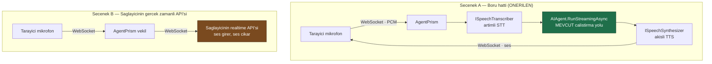

# Faz 29 — Konuşma Katmanı (Gerçek Zamanlı Ses)

> **Durum:** 📋 Planlandı
> **Kaynak:** [BEYIN-FIRTINASI.md](BEYIN-FIRTINASI.md) · **F-13** (2/2) · Kullanıcı kararı **K-065**
> **Önkoşul:** [Faz 28](28-SES-TOOLLARI.md) — zorunlu
> **Paketler:** `AgentPrism.Voice` (genişler), `.AspNetCore`, `.UI`
> **Migration:** 0015 (planlanan sırada)

---

## ⚠️ Bu Faz Barındırma Modelini Değiştirir

Bugüne kadar AgentPrism **istek/yanıt** çalıştı: HTTP gelir, SSE ile akar, biter.
Gerçek zamanlı ses bunu değiştirir:

| Konu | Bugün | Bu fazdan sonra |
|------|-------|-----------------|
| Bağlantı | Kısa ömürlü HTTP | Dakikalarca açık WebSocket |
| Durum | İstek başına | Bağlantı boyunca sunucuda |
| Ölçekleme | Herhangi bir örnek | Bağlantı **bir örneğe bağlı** (yapışkan oturum) |
| Ters vekil | Standart | WebSocket geçişi ve zaman aşımı ayarı gerekir |

Bu, bir NuGet paketi için ciddi bir taahhüttür. Bu yüzden yetenek **isteğe
bağlıdır**: `UseVoiceConversation()` çağrılmazsa hiçbir WebSocket ucu açılmaz ve
davranış değişmez.

---

## Bu Faza Başlarken

1. [`28-SES-TOOLLARI.md`](28-SES-TOOLLARI.md) — sözleşmeler, sağlayıcı, depolama
2. [`04-HTTP-API.md`](04-HTTP-API.md) — SSE yazıcısı, uç grupları, güvenlik filtresi
3. [`KARARLAR.md`](KARARLAR.md) — **K-010** (erişim katmanları), **K-046** (arayüz kabuğu muafiyeti), **K-002** (bundle bütçesi)
4. Bu doküman

---

## 29.1 — İki Mimari Seçenek



| | Seçenek A | Seçenek B |
|---|-----------|-----------|
| Çalıştırma kaydı, span, maliyet | **Tam** — mevcut yol kullanılır | Eksik — model çağrısı vekilin dışında |
| Tool onayı, kiracı, kota | **Çalışır** | Uygulanamaz veya yeniden yazılır |
| Gecikme | Daha yüksek (üç adım) | Daha düşük |
| Sağlayıcı bağımsızlığı | **Var** | Yok — sağlayıcıya özgü protokol |
| Kesinti noktası (barge-in) | Bizim işimiz | Sağlayıcı çözer |

**Öneri: Seçenek A.** AgentPrism bir kontrol düzlemidir; gözlemlenebilirlik,
onay ve kota vaatlerini ses için askıya alamaz. Seçenek B ileride ek bir mod
olarak eklenebilir ama kaybedilenler açıkça yazılmalıdır.

---

## 29.2 — Protokol

Tek bir WebSocket ucu:

```
GET {prefix}/api/voice/sessions/{sessionId}/stream   (Upgrade: websocket)
```

İstemci → sunucu ikili çerçeveler: ham PCM (16 kHz, mono, 16-bit) veya Opus.
İstemci → sunucu metin çerçeveleri: denetim mesajları (JSON).
Sunucu → istemci: ses çerçeveleri + JSON olay çerçeveleri.

```jsonc
// istemci → sunucu
{ "type": "start",  "agent": "destek", "voiceId": "…", "inputFormat": "pcm16" }
{ "type": "commit" }                       // konusma bitti, simdi cevapla
{ "type": "cancel" }                       // barge-in: uretimi kes
{ "type": "stop"  }

// sunucu → istemci
{ "type": "transcript", "text": "…", "final": false }
{ "type": "runStarted",  "runId": "019fc1…" }
{ "type": "text", "delta": "…" }           // metin yaniti (altyazi)
{ "type": "audioStart", "mediaType": "audio/mpeg" }
// ...ikili ses cerceveleri...
{ "type": "audioEnd" }
{ "type": "error", "message": "…" }
{ "type": "done" }
```

Olay adları mevcut SSE sözleşmesiyle **uyumlu** tutulur; arayüz iki farklı
zihinsel model taşımaz.

### Konuşma sonu tespiti (VAD)

- **v1: istemci tarafı.** Tarayıcı sessizliği ölçer ve `commit` gönderir.
  Sunucu tarafı VAD, sunucuda sinyal işleme demektir ve kapsamı büyütür
- Sunucu yine de bir **güvenlik ağı** taşır: `MaxUtteranceDuration` (varsayılan
  60 sn) aşılırsa parça kendiliğinden kapatılır

### Kesinti (barge-in)

Kullanıcı, agent konuşurken konuşmaya başlarsa istemci `cancel` gönderir.
Sunucu: TTS akışını durdurur, `CancellationToken`'ı tetikler, çalıştırmayı
`Cancelled` olarak kapatır. Yarım kalan yanıt `conversation_items`'a
**yazılır** ve kesildiği belirtilir — model bir sonraki turda ne söylediğini
bilmelidir.

---

## 29.3 — Güvenlik ve Erişim

WebSocket ucu, mevcut üç katmanın **tamamına** tabidir (K-010): loopback,
bearer token, authorization policy. Ek kurallar:

| Konu | Kural |
|------|-------|
| Kimlik | Token **alt protokol** başlığıyla gönderilir; sorgu dizesine **konmaz** (URL loglara yazılır) |
| Kiracı | Bağlantı kurulurken çözülür ve bağlantı boyunca **sabittir** |
| Oturum sahipliği | `sessionId` güvenilmez girdidir; kiracı sahipliği doğrulanır |
| Bağlantı sınırı | Kiracı başına eşzamanlı bağlantı sınırı (varsayılan 5) |
| Süre sınırı | Bağlantı en çok 30 dakika; sonra kapatılır ve istemci yeniden bağlanır |
| Ses saklama | Varsayılan **saklanmaz**. `PersistAudio = true` ile `attachments`'a yazılır |

🚨 **Ses kişisel veridir.** Varsayılan olarak saklanmaması bilinçlidir.
Saklandığında Faz 25'in saklama politikası uygulanır ve arayüz kullanıcıya
kaydın yapıldığını **gösterir**.

---

## 29.4 — Veri Modeli (Migration 0015)

```sql
CREATE TABLE {schema}.voice_sessions (
    id            uuid        NOT NULL PRIMARY KEY,
    tenant_id     text        NOT NULL,
    session_id    text        NOT NULL,
    agent_name    text        NOT NULL,
    started_at    timestamptz NOT NULL,
    ended_at      timestamptz,
    turns         integer     NOT NULL DEFAULT 0,
    input_seconds numeric(12,3),
    output_chars  bigint,
    end_reason    smallint,
    created_by    text
);

CREATE INDEX IF NOT EXISTS voice_sessions_tenant_started_idx
    ON {schema}.voice_sessions (tenant_id, started_at DESC);
```

Ses **içeriği** bu tabloda durmaz; saklanıyorsa `attachments`'tadır (Faz 14).
`input_seconds` ve `output_chars` maliyet içindir (Faz 20/28).

Her konuşma turu normal bir `runs` satırı üretir — ses, çalıştırma yolunu
değiştirmez, yalnız girdi ve çıktı biçimini değiştirir.

---

## 29.5 — Arayüz

Playground'a **konuşma modu**:

- Mikrofon düğmesi; tarayıcı izni; ses seviyesi göstergesi
- Canlı transkript (geçici → kesin)
- Agent konuşurken dalga göstergesi ve **"kes"** düğmesi
- Altyazı: sesli yanıtın metni de akar (erişilebilirlik)

Teknik notlar:

- Yakalama `MediaRecorder` veya `AudioWorklet` ile. `AudioWorklet` ham PCM verir
  ve gecikmeyi düşürür; `MediaRecorder` daha basittir ama parça bazlıdır.
  **Ölçülüp seçilir**
- Ses kütüphanesi **alınmaz**; tarayıcının Web Audio API'si yeterlidir
- Bundle hedefi: **+10 KB gzip'ten az**

> Tarayıcı mikrofon erişimi **güvenli bağlam** (HTTPS veya localhost) ister.
> Uzak bir kurulumda HTTP üzerinden konuşma modu **çalışmaz**; arayüz bunu
> açıkça söyler, sessizce başarısız olmaz.

---

## 29.6 — Sağlanamayan Şeyler (dürüstlük bölümü)

Bunlar README ve `MIMARI.md`'ye yazılır:

- **Telefon (SIP/PSTN) entegrasyonu yoktur.** Ayrı bir alandır
- **Ses klonlama ve kimlik doğrulama yoktur**
- **Gürültü bastırma ve yankı giderme tarayıcıya bırakılmıştır**
  (`echoCancellation`, `noiseSuppression` kısıtları)
- **Gecikme sağlayıcıya bağlıdır.** Seçenek A üç adımlıdır; sağlayıcının
  gerçek zamanlı API'si kadar hızlı olmayacaktır. Ölçülen değer DoD'ye yazılır
- **Çok konuşmacılı ayrıştırma yoktur**

---

## Testler

| Proje | Yeni test |
|-------|-----------|
| `AgentPrism.Voice.UnitTests` | Protokol durum makinesi (start → commit → cancel → stop); süre sınırı; kesinti sonrası geçmişe yazma |
| `AgentPrism.AspNetCore.FunctionalTests` | WebSocket el sıkışması; kimlik doğrulama katmanları; kiracı sahipliği; bağlantı sınırı; token'ın sorgu dizesinde **kabul edilmemesi** |
| `AgentPrism.Ui.E2ETests` | Playwright ile sahte medya akışı (`--use-fake-device-for-media-stream`); mikrofon düğmesi; transkript görünümü |
| `AgentPrism.PostgreSql.IntegrationTests` | `voice_sessions` yazımı; ses saklama açıkken ekin oluşması |

**Gerçek kanıt:** uçtan uca bir konuşma yapılır; ilk sese kadar geçen süre,
tur sayısı ve maliyet dokümana yazılır.

---

## Bu Fazda Verilecek Kararlar

1. **Seçenek A (boru hattı) seçildi** — gözlemlenebilirlik ve onay vaatleri
   korunur.
2. **Yetenek isteğe bağlıdır**; çağrılmazsa WebSocket ucu açılmaz.
3. **Ses varsayılan olarak saklanmaz.**
4. **VAD istemcide**; sunucuda yalnız süre güvenlik ağı.
5. **Token alt protokolde taşınır, sorgu dizesinde değil.**
6. **Kesilen yanıt geçmişe yazılır** — model ne söylediğini bilmelidir.

---

## Açık Sorular

1. **Yapışkan oturum gereksinimi kabul edilebilir mi?** Çok örnekli bir
   dağıtımda WebSocket bir örneğe bağlanır. Öneri: **evet**, README'de belirtilir;
   alternatif (dağıtık durum) kapsam dışıdır.
2. **Ses biçimi PCM mi Opus mu?** PCM basit ama bant genişliği yüksek. Öneri:
   **ikisi de**, varsayılan Opus (tarayıcı desteği iyi).
3. **Seçenek B (sağlayıcı realtime API'si) ileride eklensin mi?** Öneri:
   **açık soru olarak kalsın**; kullanıcı gecikmeden şikâyet ederse ele alınır.
4. **Ses saklama varsayılanı gerçekten kapalı mı olsun?** Denetim izi açısından
   kayıt değerlidir. Öneri: **kapalı** — kişisel veri; açan bilinçli açar.

---

## Bitiş Ölçütleri (DoD)

- [ ] Tarayıcıdan konuşulup sesli yanıt alınıyor (uçtan uca)
- [ ] Her tur normal bir `runs` satırı üretiyor; span ve maliyet görünüyor
- [ ] Kesinti (barge-in) çalışıyor; kesilen yanıt geçmişe yazılıyor
- [ ] Kimlik doğrulama katmanları WebSocket'te de geçerli
- [ ] Bağlantı ve süre sınırları uygulanıyor
- [ ] Ses varsayılan olarak saklanmıyor; açıldığında `attachments`'a yazılıyor
- [ ] Gecikme ölçüldü ve dokümana yazıldı
- [ ] `UseVoiceConversation()` çağrılmadığında hiçbir uç açılmıyor (test)
- [ ] Bundle ölçüldü; dört doğrulama kapısı sıfır uyarı

---

## Riskler

| Risk | Önlem |
|------|-------|
| **Barındırma modeli değişir** | Yetenek isteğe bağlı; yapışkan oturum gereksinimi belgelenir |
| Uzun bağlantılar kaynak tutar | Bağlantı ve süre sınırları; boşta zaman aşımı |
| Gecikme kabul edilemez | Ölçülür ve yazılır; Seçenek B kaçış yolu olarak durur |
| Ses kişisel veri sızdırır | Varsayılan saklamama; saklandığında görünür bildirim ve saklama politikası |
| Tarayıcı uyumsuzluğu | Güvenli bağlam ve API desteği kontrol edilir; desteklenmiyorsa açık mesaj |
| Test edilmesi zor | Playwright sahte medya cihazı; protokol durum makinesi birim testli |

---

## Sonraki Faza Devir Notu

- Faz 30 (i18n) konuşma modunun metinlerini de çevirmelidir; ayrıca ses
  seçiminin dile bağlı olması gerekir (Türkçe ses ≠ İngilizce ses).
- Faz 25 (saklama) `voice_sessions` ve ses eklerini temizleme hedeflerine
  eklemelidir.
