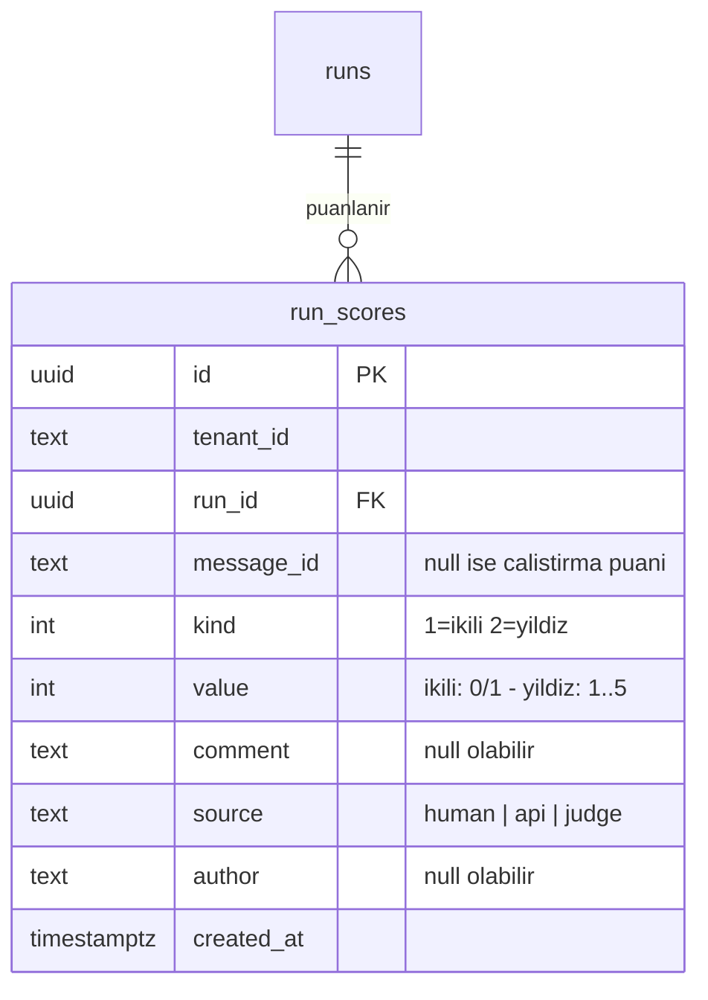
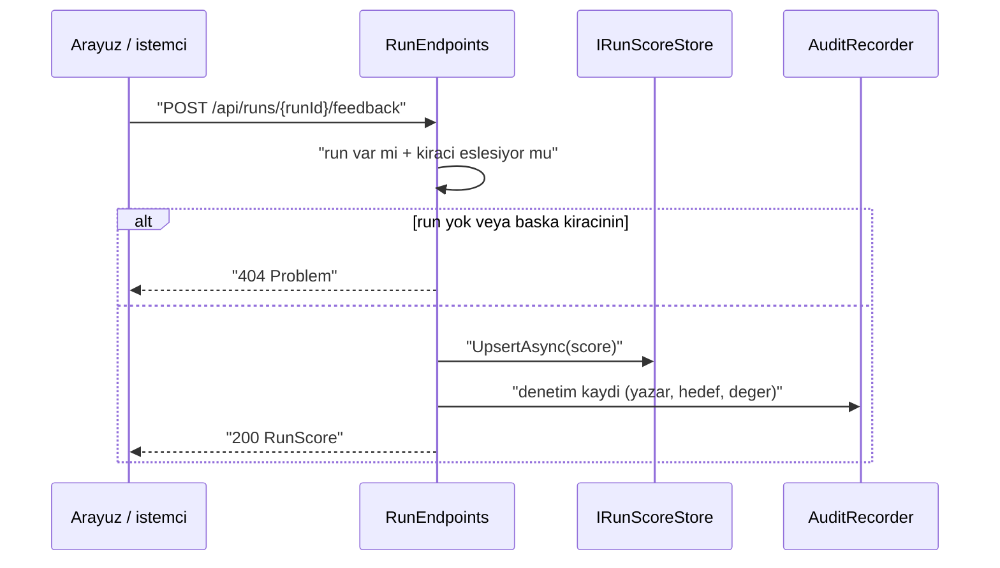

# Faz 31 — Geri Bildirim ve Puanlama

> **Durum:** 📋 Planlandı (2026-08-06)
> **Kaynak:** [UCUNCU-FAZ-ADAYLARI.md](UCUNCU-FAZ-ADAYLARI.md) · **F-52**
> **Önkoşul:** Yok. Kalem önkoşulsuzdur ve bugün yapılabilir
> **Paketler:** `AgentPrism.Abstractions`, `.Core`, `.Sql.Shared`, `.PostgreSql`, `.SqlServer`, `.Sqlite`, `.AspNetCore`, `.UI`
> **Yeni paket:** Yok · **Migration:** gerekli — üç set, numara uygulama anında alınır
> **Public API:** büyüyor — Faz 7'den önce ucuz

---

## Bu Faza Başlarken

> `faz-baslangic` skill'ini uygula. Aşağıdaki liste o skill'in 2. adımıdır —
> **tamamını değil, yalnız işaret edilen bölümleri oku.**

1. Bu doküman
2. Kararlar — dosyanın tamamını **okuma**, yalnız bu kalemleri grep'le:
   ```bash
   grep -n "K-141\|K-152\|K-178\|K-198\|K-228\|K-232" docs/KARARLAR.md
   ```
   **K-141** (eval çalıştırmaları `runs` istatistiklerinden hariç tutulur — puan
   ortalaması aynı ayrımı yapmalıdır), **K-152** (`/api/stats/timeseries`
   bilerek hariç tutmaz — yeni gösterge hangi tarafta?), **K-178** (migration
   numaraları sağlayıcı başına bağımsızdır), **K-198** (saklama SQL'i tek
   tabloyla üretilir — yeni tablo saklama hedefi olmalıdır), **K-228** (eksik
   çeviri anahtarı derleme hatasıdır), **K-232** (sunucu yanıtı çevrilmez).
3. [`30-ARAYUZ-CILASI.md`](30-ARAYUZ-CILASI.md) — yalnız devir notu:
   ```bash
   awk '/## Sonraki Faza Devir Notu/,0' docs/30-ARAYUZ-CILASI.md
   ```
   Arayüzün iki dilli sözlük düzenini ve bundle payını devralıyorsun.
4. Alan hafızası (bu faz dört alana dokunuyor):
   [`hafiza/sql-saglayicilari.md`](hafiza/sql-saglayicilari.md) (üç migration seti,
   paylaşılan depo), [`hafiza/postgresql.md`](hafiza/postgresql.md) (DDL),
   [`hafiza/aspnetcore-di.md`](hafiza/aspnetcore-di.md) (uç kaydı),
   [`hafiza/frontend.md`](hafiza/frontend.md) (sözlük, bundle)
5. Gerektiğinde, tamamı değil ilgili bölümü:
   [`MIMARI.md`](MIMARI.md) — veri modeli bölümü (`runs` ile ilişki)

---

## Amaç

Bugün bir çalıştırmanın **teknik olarak bitip bitmediği** biliniyor; **iyi olup
olmadığı** bilinmiyor. Modelin ürettiği yanlış cevap `Completed` olarak
kaydedilir ve hiçbir yerde ayırt edilmez. Bu faz, bir çalıştırmaya ve tek tek
mesajlara insan puanı iliştirir.

- **F-52** — çalıştırma ve mesaj başına puan (olumlu/olumsuz, 1–5 yıldız,
  serbest yorum), yazma/okuma uçları, `runs` listesinde ve gösterge panelinde
  bir gösterge.

Bu, ölçme–iyileştirme döngüsünün **ilk halkasıdır**. Aday listesindeki F-53
(üretimden eval kümesi), F-55 (hata sınıflandırma), F-71 (çevrimiçi
değerlendirme) ve F-74 (kanarya yayını) kalemlerinin dördü de bu tablonun
üstüne kurulur. Puan olmadan hiçbiri kurulamaz.

### Bugün ne çalışmıyor — doğrulanmış kanıt

| Kanıt | Gözlem |
|---|---|
| `grep -rni "feedback" src/ --include="*.cs"` | Hiç sonuç yok. Depoda geri bildirim kavramı yoktur |
| `grep -rni "run_score\|rating\|thumbs" src/ --include="*.cs" --include="*.sql"` | Hiç sonuç yok |
| [`IRunStore.cs`](../src/AgentPrism.Abstractions/Runs/IRunStore.cs) | On iki metot taşır; hiçbiri puan yazmaz veya okumaz |
| [`RunEndpoints.cs:31-114`](../src/AgentPrism.AspNetCore/Endpoints/RunEndpoints.cs) | Dört uç, dördü de `GET`. Bir çalıştırmaya bir şey **yazmanın** yolu yoktur |

> Kanıtlar 2026-08-06 tarihinde doğrulandı.

> 🚨 **Aday listesinin ölçümü düzeltildi.** Aday listesi `grep -rni "feedback"
> src/` komutunun boş döndüğünü yazıyordu. Komut **boş dönmez** —
> `src/AgentPrism.UI/frontend/node_modules/` altında yüzlerce eşleşme vardır.
> İddia yalnız `--include="*.cs"` ile veya `node_modules` dışlanarak doğrudur.
> Sonuç değişmez, ölçüm komutu değişir.

---

## 31.1 — Veri modeli

Puan `runs` tablosuna sütun olarak **eklenmez**. Üç sebep:

1. Bir çalıştırma **birden çok** puan alabilir (farklı kullanıcı, farklı zaman).
2. Puan **mesaj** düzeyinde de verilebilir; `runs` satırı bunu taşıyamaz.
3. `runs` sıcak yoldadır ve her çalıştırmada yazılır. Puan seyrek gelir ve
   ayrı bir yaşam döngüsü izler.



**`source` sütunu bugünden konur.** F-71 (çevrimiçi değerlendirme) yargıç
puanını aynı tabloya yazacaktır ve insan puanıyla karıştırılmamalıdır. Sütunu
sonradan eklemek üç migration daha demektir; bugün koymak bedavadır.

**`message_id` boş bırakılabilir.** Boşsa puan tüm çalıştırmaya aittir.

### Benzersizlik

Bir yazar bir hedefi bir kez puanlar. `UNIQUE (tenant_id, run_id, message_id,
author)` kısıtı ikinci yazımı **günceller**, yeni satır açmaz. `author` boş
olduğunda (kimliksiz kurulum) kısıt çalışmaz; bu durumda her çağrı yeni satır
yazar ve bu kabul edilen davranıştır.

### Saklama hedefi

`run_scores` büyüyen bir tablodur. Faz 25'in
[`RetentionTargetRegistry`](../src/AgentPrism.Sql.Shared/Internal/RetentionTargetRegistry.cs)
beyaz listesine bir hedef olarak eklenir (`created_at < @cutoff`). K-198 gereği
SQL üç sağlayıcıya kopyalanmaz, tek tabloyla üretilir.

## 31.2 — İstatistik ve hariç tutma

`RunStatistics`'e iki alan eklenir: puanlanmış çalıştırma sayısı ve olumlu
oran. Burada K-141'in ayrımı **korunmalıdır**: eval çalıştırmaları (`RunKind.Eval`)
istatistiğe girmez. Bir eval koşusunun kendi puanı, üretim kalitesini ölçen
oranı kirletmemelidir.

`/api/stats/timeseries` K-152 gereği hiçbir şeyi hariç tutmaz. Yeni puan
göstergesi **hangi tarafta olacak** — bu bir karardır ve Açık Sorular'dadır.

## 31.3 — Yazma yolu



Kiracı denetimi atlanamaz: bir kiracı diğerinin çalıştırmasını puanlayamaz.
Çalıştırma bulunamadığında ve başka kiracıya ait olduğunda **aynı** `404`
döner; ayrı hata mesajı varlık sızdırır.

---

## Planlanan Public API

> Taslak imzalardır. Gerçekleşen imzalar kapanışta ayrı bir bölüme yazılır.

```csharp
// AgentPrism.Abstractions/Runs
public enum RunScoreKind
{
    Binary = 1,
    Stars = 2,
}

public sealed record RunScore
{
    public Guid Id { get; init; }
    public required string TenantId { get; init; }
    public required Guid RunId { get; init; }
    public string? MessageId { get; init; }
    public required RunScoreKind Kind { get; init; }
    public required int Value { get; init; }
    public string? Comment { get; init; }
    public required string Source { get; init; }
    public string? Author { get; init; }
    public DateTimeOffset CreatedAt { get; init; }
}

public interface IRunScoreStore
{
    ValueTask<RunScore> UpsertAsync(RunScore score, CancellationToken cancellationToken = default);

    ValueTask<IReadOnlyList<RunScore>> ListAsync(
        string tenantId,
        Guid runId,
        CancellationToken cancellationToken = default);

    ValueTask<bool> DeleteAsync(
        string tenantId,
        Guid scoreId,
        CancellationToken cancellationToken = default);
}
```

`RunStatistics`'e eklenecek alanlar:

```csharp
public sealed record RunStatistics
{
    // ... mevcut alanlar
    public long ScoredRuns { get; init; }
    public double? PositiveRate { get; init; }   // puan yoksa null
}
```

> 🚨 `RunStatistics` public bir `sealed record`'tur. Alan eklemek **bugün
> bedavadır**; Faz 7'den (yayın) sonra bir sürüm kararıdır.

### HTTP `endpoint`'leri

| Metot | Yol | Rol | Ne yapar |
|---|---|---|---|
| `POST` | `/api/runs/{runId:guid}/feedback` | Operator | Puan yazar veya günceller |
| `GET` | `/api/runs/{runId:guid}/feedback` | Reader | Çalıştırmanın puanlarını listeler |
| `DELETE` | `/api/runs/{runId:guid}/feedback/{scoreId:guid}` | Operator | Puanı siler |

Rol seçimi gerekçesi: `AgentPrismPolicies.Reader` salt okumadır
([`AgentPrismPolicies.cs:34`](../src/AgentPrism.AspNetCore/Security/AgentPrismPolicies.cs));
puan yazmak bir yazma işlemidir ve `Operator` "Reader + çalıştırma başlatma,
onay verme" tanımına oturur.

### Arayüz payı

İki ekrana dokunulur: çalıştırma ayrıntısı (puan düğmeleri + yorum kutusu) ve
gösterge paneli (bir gösterge). Yeni bağımlılık **yok**.

Bugünkü kullanım ölçüldü (2026-08-06):

| Ölçüm | Değer |
|---|---|
| JavaScript, gzip | **151,3 KB** / 250 KB bütçe |
| Kalan pay | **98,7 KB** |

Bu fazın payı **tahminî 1–2 KB gzip**'tir ve bu bir **tahmindir**. Gerçek değer
uygulama anında `npm run build` çıktısındaki `postbuild.mjs` satırından
okunur ve bu belgeye yazılır.

Yeni sözlük anahtarları `locales/en.ts` **ve** `locales/tr.ts` dosyalarına
girer. Eksik anahtar derleme hatasıdır (K-228). Sunucudan gelen hata metni
çevrilmez (K-232).

---

## Planlanan Dosya Listesi

```
src/AgentPrism.Abstractions/Runs/
├── RunScore.cs
├── RunScoreKind.cs
└── IRunScoreStore.cs

src/AgentPrism.Core/Storage/
└── InMemoryRunScoreStore.cs

src/AgentPrism.Sql.Shared/Stores/
└── SqlRunScoreStore.cs

src/AgentPrism.PostgreSql/Migrations/
└── NNNN_run_scores.sql
src/AgentPrism.SqlServer/Migrations/
└── NNNN_run_scores.sql
src/AgentPrism.Sqlite/Migrations/
└── NNNN_run_scores.sql

src/AgentPrism.AspNetCore/Endpoints/
└── RunEndpoints.cs            (uc eklenir)

src/AgentPrism.UI/frontend/src/
├── components/FeedbackControl.tsx
└── locales/{en,tr}.ts         (anahtar eklenir)
```

> Migration numaraları **rezerve edilmez**. Uygulama anında her sağlayıcının
> kendi dizinindeki bir sonraki boş numara alınır (K-178).

---

## Testler

| Test sınıfı | Neyi doğrular |
|---|---|
| `RunScoreStoreContractTests` | `tests/Shared/Contracts/` altında; bellek içi + üç SQL sağlayıcısında aynı davranış |
| `RunScoreTenantIsolationTests` | Bir kiracı diğerinin çalıştırmasını puanlayamaz; `404` döner |
| `RunScoreUpsertTests` | Aynı yazar ikinci kez puanladığında satır **güncellenir**, ikinci satır açılmaz |
| `RunStatisticsScoreTests` | `RunKind.Eval` çalıştırmaları orana girmez (K-141) |
| `RunFeedbackEndpointTests` | Üç uç; rol denetimi, `404` davranışı, doğrulama sınırları (yıldız 1–5 dışı `400`) |
| `FeedbackControl.test.tsx` | Vitest: düğme durumu, iyimser güncelleme, hata geri alması |

Sözleşme testi `tests/Shared/Contracts/` altına yazılır — hem bellek içi hem üç
SQL sağlayıcısı üzerinde koşar.

---

## Açık Sorular

> Planı bloklamayan, faz uygulanırken karara bağlanacak sorular. Bloklayan
> sorular plan yazılmadan **önce** sorulur.

| # | Soru | Seçenekler | Öneri |
|---|---|---|---|
| 1 | Puan deposu ayrı arayüz mü, `IRunStore`'a ek metot mu? | A: yeni `IRunScoreStore` · B: `IRunStore`'a üç metot ekle | **A.** `IRunStore` bugün on iki metot taşıyor; büyütmek onu uygulayan herkesi zorlar. Ayrı arayüz K4'e (her nokta değiştirilebilir) daha iyi oturur |
| 2 | Puan göstergesi `/api/stats`'ta mı `/api/stats/timeseries`'te mi? | A: ikisinde de · B: yalnız `/api/stats` | **B.** K-152 timeseries'in hariç tutmadığını söylüyor; puan oranını oraya koymak eval koşularını karıştırır. Önce `/api/stats` |
| 3 | OpenAI uyumlu uçtan puan yazılabilmeli mi? | A: evet, `/v1/responses` yanıtındaki `id` ile · B: hayır, yalnız yönetim API'si | **B.** OpenAI sözleşmesinde geri bildirim alanı yoktur; uydurmak uyumluluğu bozar. Yönetim API'si `runId` ile yeterlidir |
| 4 | Anonim (kimliksiz) kurulumda `author` ne olur? | A: `null` ve her çağrı yeni satır · B: istemci üretimli bir çerez kimliği | **A.** K1 gereği yeni bir kimlik mekanizması sessizce gelmemelidir |

---

## Bitiş Ölçütleri (DoD)

- [ ] `POST /api/runs/{id}/feedback` `{"kind":"binary","value":1}` gövdesiyle
      `200` ve yazılan `RunScore` döner
- [ ] Aynı yazar ikinci kez yazdığında satır sayısı **artmaz**; değer güncellenir
- [ ] Başka kiracının çalıştırması puanlanmaya çalışıldığında `404` döner
- [ ] `GET /api/stats` yanıtı `scoredRuns` ve `positiveRate` taşır; eval
      çalıştırmaları orana girmez
- [ ] `run_scores` saklama hedefi olarak tanınır; `GET /api/retention/run_scores`
      önizleme döndürür
- [ ] Dört doğrulama kapısı sıfır uyarı verir
- [ ] `samples/AgentPrism.Api` ile gerçek `run` yapıldı, puanlandı, çıktı bu
      belgeye yazıldı
- [ ] `secret` taraması boş döndü
- [ ] `en.ts` ve `tr.ts` eksiksiz; bundle payı **ölçüldü** ve bu belgeye yazıldı

### Doğrulama komutları

```bash
# Calistirma baslat, kimligini al
RUN=$(curl -s -X POST http://localhost:5081/agentprism/api/agents/echo/run \
  -H 'content-type: application/json' \
  -d '{"messages":[{"role":"user","content":"merhaba"}]}' | jq -r '.runId')

# Olumlu puan yaz
curl -s -X POST http://localhost:5081/agentprism/api/runs/$RUN/feedback \
  -H 'content-type: application/json' \
  -d '{"kind":"binary","value":1,"comment":"dogru cevap"}'

# Ikinci kez yaz — satir sayisi artmamali
curl -s -X POST http://localhost:5081/agentprism/api/runs/$RUN/feedback \
  -H 'content-type: application/json' \
  -d '{"kind":"binary","value":0}'
curl -s http://localhost:5081/agentprism/api/runs/$RUN/feedback | jq 'length'
# beklenen: 1

# Istatistik
curl -s http://localhost:5081/agentprism/api/stats | jq '{scoredRuns, positiveRate}'
```

---

## Riskler

| Risk | Önlem |
|------|-------|
| Puan tablosu sınırsız büyür | Faz 25'in saklama hedefi listesine bugünden eklenir |
| `source` sütunu unutulursa F-71 üç migration daha ister | Sütun bu fazda konur, tek değeri `human`'dır |
| Yıldız ve ikili puanın ortalaması karışır | `kind` ayrı tutulur; oran yalnız `Binary` üzerinden hesaplanır |
| Eval koşuları oranı kirletir | K-141'in `RunKind.Eval` ayrımı istatistik sorgusunda tekrarlanır; test bunu doğrular |
| Arayüz payı bütçeyi zorlar | Bugün 98,7 KB pay var; iki düğme için risk düşüktür ama ölçüm DoD'dedir |

---

<!-- ============================================================
     AŞAĞISI KAPANIŞTA DOLDURULUR — `faz-tamamlama` skill'i.
     Plan anında boş kalır. Başlıkları SİLME.
     ============================================================ -->

## Plandan Sapmalar

> Kapanışta doldurulur. Plan ile gerçek arasındaki fark **gizlenmez** — sonraki
> oturumun en değerli bilgisidir.

## Bu Fazda Verilen Kararlar

> Kapanışta doldurulur. K-NNN numaraları burada alınır; plan numara rezerve etmez.

## Gerçekleşen Public API

> Kapanışta doldurulur. Koddaki **gerçek** imzalar.

## Dosya Listesi (gerçekleşen)

> Kapanışta doldurulur.

## Sonraki Faza Devir Notu

> Kapanışta doldurulur: devralınan sözleşmeler, bilinen tuzaklar (🚨), yarım
> kalan işler, sıradaki faz.
