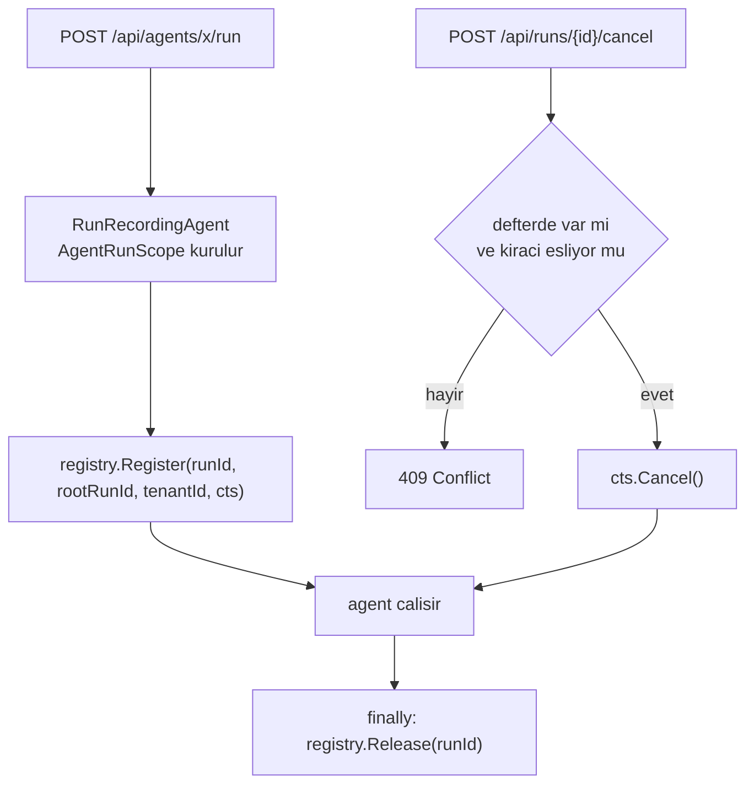

# Faz 32 — Çalıştırma İptali

> **Durum:** 📋 Planlandı (2026-08-06)
> **Kaynak:** [UCUNCU-FAZ-ADAYLARI.md](UCUNCU-FAZ-ADAYLARI.md) · **F-35**
> **Önkoşul:** Yok. **Kapsam bilerek tek örnekle sınırlıdır** — gerekçe aşağıda
> **Paketler:** `AgentPrism.Abstractions`, `.Core`, `.AspNetCore`, `.UI`
> **Yeni paket:** Yok · **Migration:** Yok
> **Public API:** büyüyor — Faz 7'den önce ucuz

---

## Bu Faza Başlarken

> `faz-baslangic` skill'ini uygula. Aşağıdaki liste o skill'in 2. adımıdır —
> **tamamını değil, yalnız işaret edilen bölümleri oku.**

1. Bu doküman
2. Kararlar — dosyanın tamamını **okuma**, yalnız bu kalemleri grep'le:
   ```bash
   grep -n "K-103\|K-158\|K-165\|K-228\|K-232" docs/KARARLAR.md
   ```
   **K-103** (alt agent onay isteyemez — ağaç sınırlarının nasıl uygulandığını
   gösterir), **K-158** (hız sınırı bellekte, kota veritabanında — bu fazın
   defteri de bellektedir ve aynı sınırı taşır), **K-165** (yeni davranış
   varsayılan kapalı gelir), **K-228**/**K-232** (arayüz sözlüğü).
3. [`12-AGENT-CAGRI-GRAFIGI.md`](12-AGENT-CAGRI-GRAFIGI.md) — yalnız devir notu:
   ```bash
   awk '/## Sonraki Faza Devir Notu/,0' docs/12-AGENT-CAGRI-GRAFIGI.md
   ```
   Çalıştırma ağacını, `RootRunId` ve `Depth` sözleşmesini devralıyorsun. Kök
   iptali alt çalıştırmaları da durdurmalıdır.
4. Alan hafızası (bu faz iki alana dokunuyor):
   [`hafiza/cekirdek-calistirma.md`](hafiza/cekirdek-calistirma.md)
   (🚨 `AsyncLocal` tuzağı — bu fazda **doğrudan** geçerlidir),
   [`hafiza/aspnetcore-di.md`](hafiza/aspnetcore-di.md) (uç kaydı, DI ömrü)
5. Gerektiğinde, tamamı değil ilgili bölümü:
   [`MIMARI.md`](MIMARI.md) — çalıştırma yolu bölümü

---

## Amaç

Bir çalıştırmayı **dışarıdan** durdurmanın yolu yoktur. Kaçak bir agent'ı
durdurmanın tek yolu bugün süreci öldürmektir. Bu faz bir iptal ucu ve süren
çalıştırmaların bellek içi defterini ekler.

- **F-35** — `POST /api/runs/{runId}/cancel`, süren `CancellationTokenSource`
  defteri, kök iptalinin alt çalıştırmaları da durdurması.

### 🚨 Kapsam sınırı — bu faz tek örnek içindir

Çok örnekli bir kurulumda iptal isteği **yanlış örneğe** düşebilir. Doğru çözüm
aday listesindeki **F-57** (kira tabanlı tek yürütücü seçimi) kalemidir ve bu
dalgada **yoktur**.

Bu faz sınırı gizlemez, **görünür kılar**: çalıştırma bu örnekte yürütülmüyorsa
uç `409 Conflict` ve açık bir mesaj döner. Sessizce `202` dönmek operatöre iptal
ettiğini düşündürür; bu, hiç uç olmamasından kötüdür.

### Bugün ne çalışmıyor — doğrulanmış kanıt

| Kanıt | Gözlem |
|---|---|
| [`SchedulingEndpoints.cs:65`](../src/AgentPrism.AspNetCore/Endpoints/SchedulingEndpoints.cs) | `POST /api/jobs/{id:guid}/cancel` **vardır** — iş iptali çözülmüştür |
| [`RunEndpoints.cs:31-114`](../src/AgentPrism.AspNetCore/Endpoints/RunEndpoints.cs) | Dört uç, dördü de `GET`. `/api/runs/{id}/cancel` **yoktur** |
| [`RunRecordingAgent.cs:185-189`](../src/AgentPrism.Core/Recording/RunRecordingAgent.cs) | `catch (OperationCanceledException)` → `RunStatus.Canceled`. İptal yalnız **çağıranın kendi belirteci** düştüğünde yazılır |
| [`RunRecordingAgent.cs:251`](../src/AgentPrism.Core/Recording/RunRecordingAgent.cs) | Akışlı yolda aynı davranış |
| [`WorkflowRunner.cs:463`](../src/AgentPrism.Workflows/Internal/WorkflowRunner.cs) | Workflow tarafında üçüncü yazım noktası |
| [`AgentPrismRunContext.cs:52-70`](../src/AgentPrism.Core/Recording/AgentPrismRunContext.cs) | `AgentRunScope` `RunId`, `RootRunId`, `Depth`, `TenantId` taşır — defterin ihtiyacı olan her şey burada |

> Kanıtlar 2026-08-06 tarihinde doğrulandı.

> **Aday listesinin düzeltmesi korunur.** Eski liste "`RunStatus.Canceled`'ı
> hiçbir kod yazmıyor" diyordu; bu **yanlıştı**. Üç yer yazıyor. Gerçek delik
> `Canceled`'ın yazılmaması değil, **dışarıdan tetiklenememesidir**.

---

## 32.1 — Defter

Süren her çalıştırma, kimliğiyle bir `CancellationTokenSource`'a eşlenir.
Defter süreç içidir ve bir `ConcurrentDictionary` taşır.



### 🚨 `AsyncLocal` tuzağı burada geçerlidir

`MEMORY.md`'nin en pahalı dersi bu fazda doğrudan uygulanır: **defter kaydı
`AsyncLocal` ile taşınmaz.** Kayıt ve bırakma, `RunRecordingAgent`'ın kendi
gövdesinde açık `try`/`finally` ile yapılır. Akışlı yolda
(`RunCoreStreamingAsync`) bırakma **her çıkış yolunda** çalışmalıdır — normal
bitiş, istisna ve tüketicinin numaralandırmayı yarıda bırakması.

Bırakma unutulursa `CancellationTokenSource` sızar. Bu bir bellek sızıntısıdır
ve testle kapatılmalıdır.

### Kök iptali alt çalıştırmaları durdurur

Defter `RunId` **ve** `RootRunId` ile indekslenir. Kök iptal edildiğinde aynı
`RootRunId` altındaki tüm kayıtlar iptal edilir. Faz 12'nin ağacı bu yüzden
gereklidir: alt çalıştırma ayrı bir `runs` satırıdır ve kendi kaydını taşır.

Alt bir çalıştırmanın **tek başına** iptali kökü durdurmaz — yalnız o dal düşer
ve kök `Failed` görür. Bu bilinçli bir seçimdir.

## 32.2 — Uç davranışı

| Durum | Yanıt |
|---|---|
| Çalıştırma defterde, kiracı eşleşiyor | `202 Accepted` — iptal **istendi**; nihai durum `runs` satırından okunur |
| Çalıştırma yok | `404 Not Found` |
| Çalıştırma başka kiracının | `404 Not Found` (varlık sızdırmamak için) |
| Çalıştırma `runs`'ta `Running` ama defterde yok | `409 Conflict` — "başka bir örnekte yürütülüyor veya süreç yeniden başladı" |
| Çalıştırma zaten bitmiş | `409 Conflict` — mevcut durum yanıtta yazılır |

`202` seçilmesinin gerekçesi: `cts.Cancel()` iptali **ister**, garanti etmez.
Agent iptal belirtecini bir sonraki denetim noktasında görür. `200` dönmek
"durdu" demektir ve yanlıştır.

---

## Planlanan Public API

> Taslak imzalardır. Gerçekleşen imzalar kapanışta ayrı bir bölüme yazılır.

```csharp
// AgentPrism.Abstractions/Runs
public interface IRunCancellationRegistry
{
    /// <summary>Suren bir calistirmayi deftere yazar. Donen deger birakma icin kullanilir.</summary>
    IDisposable Register(Guid runId, Guid rootRunId, string? tenantId, CancellationTokenSource source);

    /// <summary>Bir calistirmanin iptalini ister. Agac koku ise alt calistirmalar da iptal edilir.</summary>
    /// <returns>Iptal istegi bir kayda ulastiysa <see langword="true"/>.</returns>
    bool TryCancel(Guid runId, string? tenantId);

    /// <summary>Bu ornekte suren calistirma sayisi. Teshis ve test icindir.</summary>
    int ActiveCount { get; }
}
```

Uygulama `AgentPrism.Core` içindedir ve `TryAddSingleton` ile kaydedilir (K4).
Tüketici kendi uygulamasını kaydederse onunki kazanır — çok örnekli bir kurulum
kendi dağıtık defterini bugünden takabilir.

> 🚨 Yeni bir public arayüzdür. Faz 7'den (yayın) önce eklemek bedavadır.

### HTTP `endpoint`'leri

| Metot | Yol | Rol | Ne yapar |
|---|---|---|---|
| `POST` | `/api/runs/{runId:guid}/cancel` | Operator | Süren çalıştırmanın iptalini ister |

### Arayüz payı

Çalıştırma ayrıntı ekranına bir "İptal et" düğmesi girer; yalnız durum
`Running` iken görünür. Yeni bağımlılık **yok**.

Bugünkü kullanım ölçüldü (2026-08-06): **151,3 KB gzip / 250 KB**, kalan pay
**98,7 KB**. Bu fazın payı **tahminî 1 KB gzip altındadır**; gerçek değer
uygulama anında `postbuild.mjs` çıktısından okunur ve buraya yazılır.

Sözlük anahtarları `en.ts` **ve** `tr.ts` (K-228). Sunucunun `409` mesajı
çevrilmez (K-232) — arayüz kendi metnini durum koduna göre gösterir.

---

## Planlanan Dosya Listesi

```
src/AgentPrism.Abstractions/Runs/
└── IRunCancellationRegistry.cs

src/AgentPrism.Core/Recording/
├── RunCancellationRegistry.cs
└── RunRecordingAgent.cs          (kayit + birakma eklenir)

src/AgentPrism.AspNetCore/Endpoints/
└── RunEndpoints.cs               (uc eklenir)

src/AgentPrism.UI/frontend/src/
├── components/CancelRunButton.tsx
└── locales/{en,tr}.ts            (anahtar eklenir)
```

---

## Testler

| Test sınıfı | Neyi doğrular |
|---|---|
| `RunCancellationRegistryTests` | Kayıt, bırakma, çift bırakma, `ActiveCount` sıfıra döner |
| `RunCancellationLeakTests` | 🚨 Normal bitiş, istisna **ve yarıda bırakılan akış** sonrası defter boştur |
| `RunCancellationTreeTests` | Kök iptali alt çalıştırmaları durdurur; alt iptal kökü durdurmaz |
| `RunCancellationTenantTests` | Başka kiracının çalıştırması iptal edilemez; `404` döner |
| `CancelRunEndpointTests` | Beş durum tablosunun beşi de doğru kod döner |
| `RunCancellationStatusTests` | İptal sonrası `runs` satırı `Canceled` olur (`RunRecordingAgent.cs:186` yolu) |

---

## Açık Sorular

> Planı bloklamayan, faz uygulanırken karara bağlanacak sorular. Bloklayan
> sorular plan yazılmadan **önce** sorulur.

| # | Soru | Seçenekler | Öneri |
|---|---|---|---|
| 1 | Defterde olmayan `Running` çalıştırma için `409` mu `404` mü? | A: `409` + açık mesaj · B: `404` | **A.** Sınırı görünür kılar. `404` "böyle bir çalıştırma yok" der ve yanlıştır |
| 2 | İptal denetim izine (`audit_log`) yazılmalı mı? | A: evet, Faz 9'un kaydına · B: yalnız `run_events` | **A.** İptal bir operatör eylemidir; kim durdurdu sorusu denetlenebilir olmalıdır |
| 3 | Workflow çalıştırması aynı uçtan iptal edilebilmeli mi? | A: evet, `WorkflowRunner` de deftere yazar · B: hayır, ayrı uç | **A.** `WorkflowRunner.cs:463` zaten `Canceled` yazıyor; aynı deftere girmesi tutarlıdır |
| 4 | Defter varsayılan açık mı? | A: açık — yeni bir yan etki üretmez · B: ayarla açılır | **A.** Defter yalnız bellek tutar ve davranış değiştirmez; K1 ihlali değildir. Uç zaten rol ister |

---

## Bitiş Ölçütleri (DoD)

- [ ] Uzun süren bir çalıştırma başlatılır; `POST /api/runs/{id}/cancel` `202`
      döner ve çalıştırma birkaç saniye içinde `Canceled` durumuna geçer
- [ ] Kök çalıştırma iptal edilince alt çalıştırmalar da `Canceled` olur
- [ ] Bitmiş bir çalıştırma iptal edilmeye çalışıldığında `409` döner
- [ ] Başka kiracının çalıştırması iptal edilmeye çalışıldığında `404` döner
- [ ] 🚨 100 çalıştırma (normal + hatalı + yarıda bırakılan akış) sonrası
      `ActiveCount == 0`
- [ ] Dört doğrulama kapısı sıfır uyarı verir
- [ ] `samples/AgentPrism.Api` ile gerçek `run` iptal edildi, çıktı bu belgeye
      yazıldı
- [ ] `secret` taraması boş döndü
- [ ] `en.ts` ve `tr.ts` eksiksiz; bundle payı ölçüldü ve yazıldı

### Doğrulama komutları

```bash
# Uzun surecek bir calistirma baslat (arka planda)
curl -s -X POST http://localhost:5081/agentprism/api/agents/slow/run \
  -H 'content-type: application/json' \
  -d '{"messages":[{"role":"user","content":"uzun bir metin yaz"}]}' &

# Suren calistirmayi bul
RUN=$(curl -s 'http://localhost:5081/agentprism/api/runs?status=Running' | jq -r '.[0].id')

# Iptal et — 202 beklenir
curl -s -i -X POST http://localhost:5081/agentprism/api/runs/$RUN/cancel | head -1

# Durum Canceled olmali
curl -s http://localhost:5081/agentprism/api/runs/$RUN | jq -r '.status'

# Ayni cagriyi tekrarla — 409 beklenir
curl -s -i -X POST http://localhost:5081/agentprism/api/runs/$RUN/cancel | head -1
```

---

## Riskler

| Risk | Önlem |
|------|-------|
| 🚨 `CancellationTokenSource` sızıntısı | Bırakma `finally` içinde; akışlı yolun **her** çıkışı test edilir (`RunCancellationLeakTests`) |
| 🚨 `AsyncLocal` ile taşınma denemesi | Defter açık parametre alır; `AsyncLocal` kullanılmaz. `MEMORY.md`'nin dört vakası bu tuzağı anlatır |
| Çok örnekli kurulumda iptal yanlış örneğe düşer | `409` ile görünür kılınır; tam çözüm aday listesindeki F-57'dir ve bu fazın kapsamı dışındadır |
| İptal edilen çalıştırma kota/maliyet hesabını bozar | `Canceled` durumu Faz 20'nin hesabında zaten var; testle doğrulanır |
| İptal isteği agent bir tool içindeyken gelir | `cts.Cancel()` belirteci düşürür; tool `CancellationToken` almıyorsa bir sonraki tur denetlenir. Bu bir sınırdır ve belgeye yazılır |

---

<!-- ============================================================
     AŞAĞISI KAPANIŞTA DOLDURULUR — `faz-tamamlama` skill'i.
     Plan anında boş kalır. Başlıkları SİLME.
     ============================================================ -->

## Plandan Sapmalar

> Kapanışta doldurulur. Plan ile gerçek arasındaki fark **gizlenmez** — sonraki
> oturumun en değerli bilgisidir.

## Bu Fazda Verilen Kararlar

> Kapanışta doldurulur. K-NNN numaraları burada alınır; plan numara rezerve etmez.

## Gerçekleşen Public API

> Kapanışta doldurulur. Koddaki **gerçek** imzalar.

## Dosya Listesi (gerçekleşen)

> Kapanışta doldurulur.

## Sonraki Faza Devir Notu

> Kapanışta doldurulur: devralınan sözleşmeler, bilinen tuzaklar (🚨), yarım
> kalan işler, sıradaki faz.
