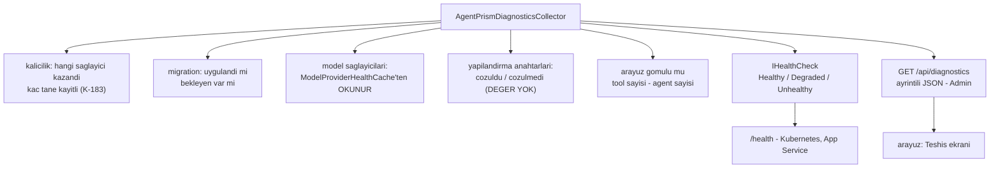

# Faz 33 — Sağlık Denetimi ve Yapılandırma Teşhisi

> **Durum:** 📋 Planlandı (2026-08-06)
> **Kaynak:** [UCUNCU-FAZ-ADAYLARI.md](UCUNCU-FAZ-ADAYLARI.md) · **F-38** · **F-62**
> **Önkoşul:** Yok
> **Paketler:** `AgentPrism.Abstractions`, `.Core`, `.AspNetCore`, `.UI`
> **Yeni paket:** Yok — `Microsoft.Extensions.Diagnostics.HealthChecks` paylaşılan çerçevededir · **Migration:** Yok
> **Public API:** büyüyor — Faz 7'den önce ucuz

---

## Bu Faza Başlarken

> `faz-baslangic` skill'ini uygula. Aşağıdaki liste o skill'in 2. adımıdır —
> **tamamını değil, yalnız işaret edilen bölümleri oku.**

1. Bu doküman
2. Kararlar — dosyanın tamamını **okuma**, yalnız bu kalemleri grep'le:
   ```bash
   grep -n "K-025\|K-059\|K-183\|K-228\|K-232" docs/KARARLAR.md
   ```
   **K-025** (`Use*` uzantıları `Replace` kullanır — son kayıt kazanır),
   **K-059** (`secret` veritabanına yazılmaz; kayıtta yalnız yapılandırma
   anahtarının **adı** durur — teşhis ucu bu kuralı **birebir** izler),
   **K-183** (iki kalıcılık sağlayıcısı kaydedilirse yalnız uyarı loglanır —
   bu fazın var oluş sebebi), **K-228**/**K-232** (arayüz sözlüğü).
3. [`08-SAGLAYICI-GENISLEMESI.md`](08-SAGLAYICI-GENISLEMESI.md) — yalnız devir notu:
   ```bash
   awk '/## Sonraki Faza Devir Notu/,0' docs/08-SAGLAYICI-GENISLEMESI.md
   ```
   `ModelProviderHealthCache` ve devre kesici sözleşmesini devralıyorsun.
   Sağlık denetimi bu önbellekten okur; **yeni istek atmaz**.
4. Alan hafızası (bu faz iki alana dokunuyor):
   [`hafiza/aspnetcore-di.md`](hafiza/aspnetcore-di.md) (DI kaydı, `TryAdd` sırası),
   [`hafiza/build-ve-analyzer.md`](hafiza/build-ve-analyzer.md) (paylaşılan çerçeve
   referansı — yeni NuGet paketi **gerekmediğinin** gerekçesi)
5. Gerektiğinde, tamamı değil ilgili bölümü:
   [`MIMARI.md`](MIMARI.md) — DI ve kurulum bölümü

---

## Amaç

`MEMORY.md`'deki tuzakların çoğu **sessiz yanlış yapılandırmadır**. `TryAdd`
sırası bozulursa kalıcılık sessizce devre dışı kalır. İki kalıcılık sağlayıcısı
birlikte kaydedilirse yalnız bir uyarı loglanır (K-183) ve kullanıcı onu
görmez. Bugün "kurulumum doğru mu?" sorusunun cevaplanacağı **tek bir yer**
yoktur.

Bu faz aynı bilgiyi **iki yüzeyden** verir:

- **F-38** — `AddAgentPrismHealthChecks()`: standart .NET sağlık sistemine
  bağlanır. Kubernetes, App Service ve yük dengeleyici bunu yoklar.
- **F-62** — `GET /api/diagnostics`: insan okuyacak ayrıntılı öz denetim.
  Hangi depo gerçekten kayıtlı, migration durumu, sağlayıcı anahtarı çözüldü
  mü, arayüz gömülü mü, kaç tool tanınıyor.

### Neden tek faz

İki kalem **aynı veriyi** okur: DI'daki kayıtlar, migration durumu, Faz 8'in
sağlık önbelleği. Ayrı fazlarda yapılırsa aynı toplayıcı iki kez yazılır.
Birleşme `faz-planlama`'nın "aynı altyapıyı paylaşıyorsa birleşir" ölçütünü
karşılar: tek toplayıcı, iki sunum.

### Bugün ne çalışmıyor — doğrulanmış kanıt

| Kanıt | Gözlem |
|---|---|
| `grep -rn "IHealthCheck\|AddHealthChecks" src/` | **Hiç sonuç yok.** Depoda ASP.NET Core sağlık denetimi yoktur |
| `grep -rn "diagnostics" src/AgentPrism.AspNetCore/Endpoints/` | **Hiç sonuç yok.** `/api/diagnostics` ucu yoktur |
| [`ModelHealthEndpoints.cs:23`](../src/AgentPrism.AspNetCore/Endpoints/ModelHealthEndpoints.cs) | `GET /api/models/health` **vardır** ama AgentPrism'e özgüdür; standart `/health` yolunu yoklayan altyapı onu bilmez |
| [`CatalogEndpoints.cs:53`](../src/AgentPrism.AspNetCore/Endpoints/CatalogEndpoints.cs) | Katalog ucu kullanıcıyı `/api/models/health`'e yönlendiriyor — bilgi var, standart yüzey yok |
| [`AgentPrism.AspNetCore.csproj:11`](../src/AgentPrism.AspNetCore/AgentPrism.AspNetCore.csproj) | `<FrameworkReference Include="Microsoft.AspNetCore.App" />` — sağlık denetimi API'si **zaten erişilebilir**, yeni NuGet paketi gerekmez |

> Kanıtlar 2026-08-06 tarihinde doğrulandı.

---

## 33.1 — Tek toplayıcı, iki yüzey



Toplayıcı `AgentPrism.Core` içindedir ve **yan etkisizdir**: hiçbir model
çağrısı yapmaz, hiçbir tabloyu değiştirmez. Model sağlığı Faz 8'in
önbelleğinden **okunur**; sağlık yoklaması için ek istek atmak, sağlık ucunu
maliyet üreten bir yüzeye çevirirdi.

## 33.2 — 🚨 Teşhis ucu `secret` sızdırmaz

Bu, fazın en önemli tasarım kuralıdır ve K-059'un doğrudan uygulanmasıdır.

| Yazılır | Yazılmaz |
|---|---|
| `"OpenAI:ApiKey"` anahtarı **çözüldü** | Anahtarın değeri |
| Bağlantı dizesi **var** | Bağlantı dizesinin kendisi |
| Bağlantı dizesinin `Host` ve `Database` alanları | `Password`, `User Id` |
| Kayıtlı sağlayıcı adı | Kimlik bilgisi |

Uç **Admin** rolü ister. Rol politikası kayıtlı değilse uç yine üç katmanlı
korumadan geçer (loopback + bearer token), ama bir kurulum bunu üretime açacaksa
`AgentPrismPolicies.Admin` kaydı zorunludur ve belgeye bu cümle yazılır.

## 33.3 — Sağlık durumları

| Durum | Ne zaman |
|---|---|
| `Healthy` | Veritabanına erişiliyor, bekleyen migration yok, en az bir model sağlayıcısı sağlıklı |
| `Degraded` | Veritabanı erişilebilir ama bir model sağlayıcısının devresi açık; veya birden çok kalıcılık sağlayıcısı kayıtlı (K-183 durumu) |
| `Unhealthy` | Veritabanına erişilemiyor veya bekleyen migration var |

**`Degraded` seçimi bilinçlidir.** Bir sağlayıcının devresi açıkken uygulama
hâlâ hizmet verebilir — yük dengeleyici örneği havuzdan çıkarmamalıdır. K-183
durumu da `Unhealthy` değildir: kurulum çalışır, ama yanlış veritabanına
yazıyor olabilir ve operatör bunu **görmelidir**.

Bellek içi kalıcılık (veritabanı yok) `Healthy`'dir — veritabanı zorunlu
değildir ve olmaması bir arıza değildir.

---

## Planlanan Public API

> Taslak imzalardır. Gerçekleşen imzalar kapanışta ayrı bir bölüme yazılır.

```csharp
// AgentPrism.Abstractions/Diagnostics
public sealed record AgentPrismDiagnosticsReport
{
    public required string PersistenceProvider { get; init; }      // "PostgreSql" | "InMemory" | ...
    public required int RegisteredPersistenceProviders { get; init; } // >1 ise K-183 durumu
    public required bool MigrationsUpToDate { get; init; }
    public required IReadOnlyList<string> PendingMigrations { get; init; }
    public required IReadOnlyList<ProviderDiagnostic> ModelProviders { get; init; }
    public required IReadOnlyList<ConfigurationDiagnostic> Configuration { get; init; }
    public required bool UiEmbedded { get; init; }
    public required int ToolCount { get; init; }
    public required int AgentCount { get; init; }
}

/// <summary>Bir yapilandirma anahtarinin cozulup cozulmedigi. DEGER TASIMAZ (K-059).</summary>
public sealed record ConfigurationDiagnostic
{
    public required string Key { get; init; }
    public required bool Resolved { get; init; }
    public string? Hint { get; init; }   // "dotnet user-secrets set ..." gibi
}

public sealed record ProviderDiagnostic
{
    public required string Name { get; init; }
    public required string Status { get; init; }        // Faz 8'in onbellegindeki durum
    public required bool CircuitOpen { get; init; }
}
```

```csharp
// AgentPrism.AspNetCore
public static class AgentPrismHealthCheckExtensions
{
    /// <summary>AgentPrism saglik denetimlerini standart .NET saglik sistemine kaydeder.</summary>
    public static IHealthChecksBuilder AddAgentPrismHealthChecks(
        this IHealthChecksBuilder builder,
        string name = "agentprism",
        IEnumerable<string>? tags = null);
}
```

Kullanım tüketicinin kendi `/health` yolunu kurmasına bırakılır. AgentPrism
`MapHealthChecks` **çağırmaz** — tüketicinin yol seçimini gasp etmek K1'i
zorlar:

```csharp
builder.Services.AddHealthChecks().AddAgentPrismHealthChecks();
app.MapHealthChecks("/health");
```

### HTTP `endpoint`'leri

| Metot | Yol | Rol | Ne yapar |
|---|---|---|---|
| `GET` | `/api/diagnostics` | Admin | Ayrıntılı öz denetim raporu döner |

### Arayüz payı

Bir "Teşhis" ekranı eklenir; mevcut ayarlar bölümünün altına girer. Yeni
bağımlılık **yok**.

Bugünkü kullanım ölçüldü (2026-08-06): **151,3 KB gzip / 250 KB**, kalan pay
**98,7 KB**. Bu fazın payı **tahminî 2–4 KB gzip**'tir; gerçek değer uygulama
anında `postbuild.mjs` çıktısından okunur ve buraya yazılır.

Sözlük anahtarları `en.ts` **ve** `tr.ts` (K-228). Sunucudan gelen ipucu metni
(`Hint`) çevrilmez (K-232).

---

## Planlanan Dosya Listesi

```
src/AgentPrism.Abstractions/Diagnostics/
├── AgentPrismDiagnosticsReport.cs
├── ConfigurationDiagnostic.cs
└── ProviderDiagnostic.cs

src/AgentPrism.Core/Diagnostics/
└── AgentPrismDiagnosticsCollector.cs

src/AgentPrism.AspNetCore/
├── Health/
│   ├── AgentPrismHealthCheck.cs
│   └── AgentPrismHealthCheckExtensions.cs
└── Endpoints/
    └── DiagnosticsEndpoints.cs

src/AgentPrism.UI/frontend/src/
├── screens/Diagnostics.tsx
└── locales/{en,tr}.ts        (anahtar eklenir)
```

---

## Testler

| Test sınıfı | Neyi doğrular |
|---|---|
| `DiagnosticsCollectorTests` | Bellek içi, PostgreSQL ve çift kayıt durumlarında doğru rapor |
| `DiagnosticsSecretLeakTests` | 🚨 Rapor JSON'unda hiçbir `secret` değeri geçmez; bilinen bir anahtar değeri enjekte edilip yanıtta **aranır** |
| `HealthCheckStateTests` | Üç durumun (`Healthy`/`Degraded`/`Unhealthy`) her biri kurulabilir ve doğru döner |
| `HealthCheckNoSideEffectTests` | Sağlık denetimi hiçbir model çağrısı yapmaz; sahte sağlayıcının çağrı sayacı sıfır kalır |
| `DiagnosticsEndpointRoleTests` | Admin dışı rol `403` alır |
| `MigrationStateDiagnosticTests` | Bekleyen migration varken `Unhealthy` ve liste dolu döner |

---

## Açık Sorular

> Planı bloklamayan, faz uygulanırken karara bağlanacak sorular. Bloklayan
> sorular plan yazılmadan **önce** sorulur.

| # | Soru | Seçenekler | Öneri |
|---|---|---|---|
| 1 | Sağlık denetimi veritabanına gerçekten sorgu atsın mı? | A: hafif bir `SELECT 1` · B: yalnız bağlantı havuzu durumu | **A.** Bağlantı kurulamadığını yalnız gerçek bir sorgu gösterir. Sorgu ucuzdur ve yoklama sıklığı tüketicinin ayarıdır |
| 2 | K-183 durumu `Degraded` mi `Unhealthy` mi? | A: `Degraded` · B: `Unhealthy` | **A.** Kurulum çalışıyor; örneği havuzdan çıkarmak hizmeti durdurur. Ama teşhis ucunda **açık bir uyarı** olarak görünür |
| 3 | Hangi yapılandırma anahtarları raporlanır? | A: yalnız kayıtlı sağlayıcıların beklediği anahtarlar · B: `AgentPrism:*` ağacının tamamı | **A.** Tamamını listelemek gürültü üretir ve gereksiz yüzey açar |
| 4 | Teşhis ucu varsayılan açık mı? | A: açık, Admin korumalı · B: ayarla açılır | **B.** Bir teşhis yüzeyi bilgi verir; K1 gereği açıkça açılmalıdır. `AgentPrismEndpointOptions`'a bir bayrak girer, varsayılan **kapalı** |

---

## Bitiş Ölçütleri (DoD)

- [ ] `AddAgentPrismHealthChecks()` + `MapHealthChecks("/health")` kurulumunda
      `GET /health` `200 Healthy` döner
- [ ] Veritabanı durdurulduğunda `GET /health` `503 Unhealthy` döner
- [ ] `UsePostgreSql()` ve `UseSqlite()` birlikte kaydedildiğinde `/health`
      `Degraded` ve `/api/diagnostics` çift kaydı **açıkça** bildirir (K-183)
- [ ] `GET /api/diagnostics` Admin ile `200`, Reader ile `403` döner
- [ ] 🚨 `secret` sızıntı testi: bilinen bir API anahtarı yapılandırmaya konur;
      teşhis yanıtının tamamında **hiçbir yerde** geçmez
- [ ] Sağlık denetimi çağrısı hiçbir model isteği üretmez (sahte sağlayıcı
      sayacı sıfır)
- [ ] Dört doğrulama kapısı sıfır uyarı verir
- [ ] `samples/AgentPrism.Api` ile gerçek `run` yapıldı, `/health` ve
      `/api/diagnostics` çıktısı bu belgeye yazıldı
- [ ] `secret` taraması boş döndü
- [ ] `en.ts` ve `tr.ts` eksiksiz; bundle payı ölçüldü ve yazıldı

### Doğrulama komutları

```bash
# Standart saglik yolu
curl -s -i http://localhost:5081/health | head -1

# Teshis raporu
curl -s http://localhost:5081/agentprism/api/diagnostics | jq

# 🚨 Sizinti denetimi: yapilandirmadaki anahtar yanitin hicbir yerinde olmamali
KEY=$(dotnet user-secrets list --project samples/AgentPrism.Api \
      | grep -i 'OpenAI:ApiKey' | cut -d= -f2- | tr -d ' ')
curl -s http://localhost:5081/agentprism/api/diagnostics | grep -F "$KEY" && echo "SIZINTI VAR" || echo "temiz"

# Veritabani durdurulunca
docker stop agentprism-postgres
curl -s -i http://localhost:5081/health | head -1   # 503 beklenir
```

---

## Riskler

| Risk | Önlem |
|------|-------|
| 🚨 Teşhis ucu `secret` sızdırır | Rapor tipi **değer alanı taşımaz**; sızıntı testi DoD'dedir |
| Sağlık denetimi model sağlayıcısına istek atar ve para harcar | Faz 8'in önbelleğinden **okunur**; yan etkisizlik testi DoD'dedir |
| Yoklama sıklığı yüksek olan bir altyapı veritabanını yorar | `SELECT 1` ucuzdur; sonuç kısa süreli önbelleğe alınabilir — süre bir karardır |
| Teşhis ucu üretimde açık unutulur | Varsayılan **kapalı** (Açık Soru 4) + Admin rolü |
| `Degraded` yük dengeleyicide örneği düşürür | Etiketleme (`tags`) tüketiciye bırakılır; belgede `Degraded`'in anlamı yazılır |

---

<!-- ============================================================
     AŞAĞISI KAPANIŞTA DOLDURULUR — `faz-tamamlama` skill'i.
     Plan anında boş kalır. Başlıkları SİLME.
     ============================================================ -->

## Plandan Sapmalar

> Kapanışta doldurulur. Plan ile gerçek arasındaki fark **gizlenmez** — sonraki
> oturumun en değerli bilgisidir.

## Bu Fazda Verilen Kararlar

> Kapanışta doldurulur. K-NNN numaraları burada alınır; plan numara rezerve etmez.

## Gerçekleşen Public API

> Kapanışta doldurulur. Koddaki **gerçek** imzalar.

## Dosya Listesi (gerçekleşen)

> Kapanışta doldurulur.

## Sonraki Faza Devir Notu

> Kapanışta doldurulur: devralınan sözleşmeler, bilinen tuzaklar (🚨), yarım
> kalan işler, sıradaki faz.
