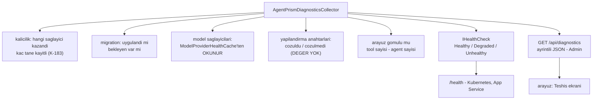

# Faz 33 — Sağlık Denetimi ve Yapılandırma Teşhisi

> **Durum:** ✅ Tamamlandı (2026-08-06)
> **Kaynak:** [ADAYLAR.md](ADAYLAR.md) · **F-38** · **F-62**
> **Önkoşul:** Yok
> **Paketler:** `AgentPrism.Abstractions`, `.Core`, `.AspNetCore`, `.UI`
> **Yeni paket:** Yok — `Microsoft.Extensions.Diagnostics.HealthChecks` paylaşılan çerçevededir · **Migration:** Yok
> **Public API:** büyüyor — Faz 7'den önce ucuz

---

## Bu Faza Başlarken

> `faz-baslangic` skill'ini uygula. Aşağıdaki liste o skill'in 2. adımıdır —
> **tamamını değil, yalnız işaret edilen bölümleri oku.**

1. Bu doküman
2. Kararlar — dosyanın tamamını **okuma**, yalnız bu kalemleri grep'le:
   ```bash
   grep -n "K-025\|K-059\|K-183\|K-228\|K-232" docs/KARARLAR.md
   ```
   **K-025** (`Use*` uzantıları `Replace` kullanır — son kayıt kazanır),
   **K-059** (`secret` veritabanına yazılmaz; kayıtta yalnız yapılandırma
   anahtarının **adı** durur — teşhis ucu bu kuralı **birebir** izler),
   **K-183** (iki kalıcılık sağlayıcısı kaydedilirse yalnız uyarı loglanır —
   bu fazın var oluş sebebi), **K-228**/**K-232** (arayüz sözlüğü).
3. [`08-SAGLAYICI-GENISLEMESI.md`](08-SAGLAYICI-GENISLEMESI.md) — yalnız devir notu:
   ```bash
   awk '/## Sonraki Faza Devir Notu/,0' docs/08-SAGLAYICI-GENISLEMESI.md
   ```
   `ModelProviderHealthCache` ve devre kesici sözleşmesini devralıyorsun.
   Sağlık denetimi bu önbellekten okur; **yeni istek atmaz**.
4. Alan hafızası (bu faz iki alana dokunuyor):
   [`hafiza/aspnetcore-di.md`](hafiza/aspnetcore-di.md) (DI kaydı, `TryAdd` sırası),
   [`hafiza/build-ve-analyzer.md`](hafiza/build-ve-analyzer.md) (paylaşılan çerçeve
   referansı — yeni NuGet paketi **gerekmediğinin** gerekçesi)
5. Gerektiğinde, tamamı değil ilgili bölümü:
   [`MIMARI.md`](MIMARI.md) — DI ve kurulum bölümü

---

## Amaç

`MEMORY.md`'deki tuzakların çoğu **sessiz yanlış yapılandırmadır**. `TryAdd`
sırası bozulursa kalıcılık sessizce devre dışı kalır. İki kalıcılık sağlayıcısı
birlikte kaydedilirse yalnız bir uyarı loglanır (K-183) ve kullanıcı onu
görmez. Bugün "kurulumum doğru mu?" sorusunun cevaplanacağı **tek bir yer**
yoktur.

Bu faz aynı bilgiyi **iki yüzeyden** verir:

- **F-38** — `AddAgentPrismHealthChecks()`: standart .NET sağlık sistemine
  bağlanır. Kubernetes, App Service ve yük dengeleyici bunu yoklar.
- **F-62** — `GET /api/diagnostics`: insan okuyacak ayrıntılı öz denetim.
  Hangi depo gerçekten kayıtlı, migration durumu, sağlayıcı anahtarı çözüldü
  mü, arayüz gömülü mü, kaç tool tanınıyor.

### Neden tek faz

İki kalem **aynı veriyi** okur: DI'daki kayıtlar, migration durumu, Faz 8'in
sağlık önbelleği. Ayrı fazlarda yapılırsa aynı toplayıcı iki kez yazılır.
Birleşme `faz-planlama`'nın "aynı altyapıyı paylaşıyorsa birleşir" ölçütünü
karşılar: tek toplayıcı, iki sunum.

### Bugün ne çalışmıyor — doğrulanmış kanıt

| Kanıt | Gözlem |
|---|---|
| `grep -rn "IHealthCheck\|AddHealthChecks" src/` | **Hiç sonuç yok.** Depoda ASP.NET Core sağlık denetimi yoktur |
| `grep -rn "diagnostics" src/AgentPrism.AspNetCore/Endpoints/` | **Hiç sonuç yok.** `/api/diagnostics` ucu yoktur |
| [`ModelHealthEndpoints.cs:23`](../src/AgentPrism.AspNetCore/Endpoints/ModelHealthEndpoints.cs) | `GET /api/models/health` **vardır** ama AgentPrism'e özgüdür; standart `/health` yolunu yoklayan altyapı onu bilmez |
| [`CatalogEndpoints.cs:53`](../src/AgentPrism.AspNetCore/Endpoints/CatalogEndpoints.cs) | Katalog ucu kullanıcıyı `/api/models/health`'e yönlendiriyor — bilgi var, standart yüzey yok |
| [`AgentPrism.AspNetCore.csproj:11`](../src/AgentPrism.AspNetCore/AgentPrism.AspNetCore.csproj) | `<FrameworkReference Include="Microsoft.AspNetCore.App" />` — sağlık denetimi API'si **zaten erişilebilir**, yeni NuGet paketi gerekmez |

> Kanıtlar 2026-08-06 tarihinde doğrulandı.

---

## 33.1 — Tek toplayıcı, iki yüzey



Toplayıcı `AgentPrism.Core` içindedir ve **yan etkisizdir**: hiçbir model
çağrısı yapmaz, hiçbir tabloyu değiştirmez. Model sağlığı Faz 8'in
önbelleğinden **okunur**; sağlık yoklaması için ek istek atmak, sağlık ucunu
maliyet üreten bir yüzeye çevirirdi.

## 33.2 — 🚨 Teşhis ucu `secret` sızdırmaz

Bu, fazın en önemli tasarım kuralıdır ve K-059'un doğrudan uygulanmasıdır.

| Yazılır | Yazılmaz |
|---|---|
| `"OpenAI:ApiKey"` anahtarı **çözüldü** | Anahtarın değeri |
| Bağlantı dizesi **var** | Bağlantı dizesinin kendisi |
| Bağlantı dizesinin `Host` ve `Database` alanları | `Password`, `User Id` |
| Kayıtlı sağlayıcı adı | Kimlik bilgisi |

Uç **Admin** rolü ister. Rol politikası kayıtlı değilse uç yine üç katmanlı
korumadan geçer (loopback + bearer token), ama bir kurulum bunu üretime açacaksa
`AgentPrismPolicies.Admin` kaydı zorunludur ve belgeye bu cümle yazılır.

## 33.3 — Sağlık durumları

| Durum | Ne zaman |
|---|---|
| `Healthy` | Veritabanına erişiliyor, bekleyen migration yok, en az bir model sağlayıcısı sağlıklı |
| `Degraded` | Veritabanı erişilebilir ama bir model sağlayıcısının devresi açık; veya birden çok kalıcılık sağlayıcısı kayıtlı (K-183 durumu) |
| `Unhealthy` | Veritabanına erişilemiyor veya bekleyen migration var |

**`Degraded` seçimi bilinçlidir.** Bir sağlayıcının devresi açıkken uygulama
hâlâ hizmet verebilir — yük dengeleyici örneği havuzdan çıkarmamalıdır. K-183
durumu da `Unhealthy` değildir: kurulum çalışır, ama yanlış veritabanına
yazıyor olabilir ve operatör bunu **görmelidir**.

Bellek içi kalıcılık (veritabanı yok) `Healthy`'dir — veritabanı zorunlu
değildir ve olmaması bir arıza değildir.

---

## Planlanan Public API

> Taslak imzalardır. Gerçekleşen imzalar kapanışta ayrı bir bölüme yazılır.

```csharp
// AgentPrism.Abstractions/Diagnostics
public sealed record AgentPrismDiagnosticsReport
{
    public required string PersistenceProvider { get; init; }      // "PostgreSql" | "InMemory" | ...
    public required int RegisteredPersistenceProviders { get; init; } // >1 ise K-183 durumu
    public required bool MigrationsUpToDate { get; init; }
    public required IReadOnlyList<string> PendingMigrations { get; init; }
    public required IReadOnlyList<ProviderDiagnostic> ModelProviders { get; init; }
    public required IReadOnlyList<ConfigurationDiagnostic> Configuration { get; init; }
    public required bool UiEmbedded { get; init; }
    public required int ToolCount { get; init; }
    public required int AgentCount { get; init; }
}

/// <summary>Bir yapilandirma anahtarinin cozulup cozulmedigi. DEGER TASIMAZ (K-059).</summary>
public sealed record ConfigurationDiagnostic
{
    public required string Key { get; init; }
    public required bool Resolved { get; init; }
    public string? Hint { get; init; }   // "dotnet user-secrets set ..." gibi
}

public sealed record ProviderDiagnostic
{
    public required string Name { get; init; }
    public required string Status { get; init; }        // Faz 8'in onbellegindeki durum
    public required bool CircuitOpen { get; init; }
}
```

```csharp
// AgentPrism.AspNetCore
public static class AgentPrismHealthCheckExtensions
{
    /// <summary>AgentPrism saglik denetimlerini standart .NET saglik sistemine kaydeder.</summary>
    public static IHealthChecksBuilder AddAgentPrismHealthChecks(
        this IHealthChecksBuilder builder,
        string name = "agentprism",
        IEnumerable<string>? tags = null);
}
```

Kullanım tüketicinin kendi `/health` yolunu kurmasına bırakılır. AgentPrism
`MapHealthChecks` **çağırmaz** — tüketicinin yol seçimini gasp etmek K1'i
zorlar:

```csharp
builder.Services.AddHealthChecks().AddAgentPrismHealthChecks();
app.MapHealthChecks("/health");
```

### HTTP `endpoint`'leri

| Metot | Yol | Rol | Ne yapar |
|---|---|---|---|
| `GET` | `/api/diagnostics` | Admin | Ayrıntılı öz denetim raporu döner |

### Arayüz payı

Bir "Teşhis" ekranı eklenir; mevcut ayarlar bölümünün altına girer. Yeni
bağımlılık **yok**.

Bugünkü kullanım ölçüldü (2026-08-06): **151,3 KB gzip / 250 KB**, kalan pay
**98,7 KB**. Bu fazın payı **tahminî 2–4 KB gzip**'tir; gerçek değer uygulama
anında `postbuild.mjs` çıktısından okunur ve buraya yazılır.

Sözlük anahtarları `en.ts` **ve** `tr.ts` (K-228). Sunucudan gelen ipucu metni
(`Hint`) çevrilmez (K-232).

---

## Planlanan Dosya Listesi

```
src/AgentPrism.Abstractions/Diagnostics/
├── AgentPrismDiagnosticsReport.cs
├── ConfigurationDiagnostic.cs
└── ProviderDiagnostic.cs

src/AgentPrism.Core/Diagnostics/
└── AgentPrismDiagnosticsCollector.cs

src/AgentPrism.AspNetCore/
├── Health/
│   ├── AgentPrismHealthCheck.cs
│   └── AgentPrismHealthCheckExtensions.cs
└── Endpoints/
    └── DiagnosticsEndpoints.cs

src/AgentPrism.UI/frontend/src/
├── screens/Diagnostics.tsx
└── locales/{en,tr}.ts        (anahtar eklenir)
```

---

## Testler

| Test sınıfı | Neyi doğrular |
|---|---|
| `DiagnosticsCollectorTests` | Bellek içi, PostgreSQL ve çift kayıt durumlarında doğru rapor |
| `DiagnosticsSecretLeakTests` | 🚨 Rapor JSON'unda hiçbir `secret` değeri geçmez; bilinen bir anahtar değeri enjekte edilip yanıtta **aranır** |
| `HealthCheckStateTests` | Üç durumun (`Healthy`/`Degraded`/`Unhealthy`) her biri kurulabilir ve doğru döner |
| `HealthCheckNoSideEffectTests` | Sağlık denetimi hiçbir model çağrısı yapmaz; sahte sağlayıcının çağrı sayacı sıfır kalır |
| `DiagnosticsEndpointRoleTests` | Admin dışı rol `403` alır |
| `MigrationStateDiagnosticTests` | Bekleyen migration varken `Unhealthy` ve liste dolu döner |

---

## Açık Sorular

> Planı bloklamayan, faz uygulanırken karara bağlanacak sorular. Bloklayan
> sorular plan yazılmadan **önce** sorulur.

| # | Soru | Seçenekler | Öneri |
|---|---|---|---|
| 1 | Sağlık denetimi veritabanına gerçekten sorgu atsın mı? | A: hafif bir `SELECT 1` · B: yalnız bağlantı havuzu durumu | **A.** Bağlantı kurulamadığını yalnız gerçek bir sorgu gösterir. Sorgu ucuzdur ve yoklama sıklığı tüketicinin ayarıdır |
| 2 | K-183 durumu `Degraded` mi `Unhealthy` mi? | A: `Degraded` · B: `Unhealthy` | **A.** Kurulum çalışıyor; örneği havuzdan çıkarmak hizmeti durdurur. Ama teşhis ucunda **açık bir uyarı** olarak görünür |
| 3 | Hangi yapılandırma anahtarları raporlanır? | A: yalnız kayıtlı sağlayıcıların beklediği anahtarlar · B: `AgentPrism:*` ağacının tamamı | **A.** Tamamını listelemek gürültü üretir ve gereksiz yüzey açar |
| 4 | Teşhis ucu varsayılan açık mı? | A: açık, Admin korumalı · B: ayarla açılır | **B.** Bir teşhis yüzeyi bilgi verir; K1 gereği açıkça açılmalıdır. `AgentPrismEndpointOptions`'a bir bayrak girer, varsayılan **kapalı** |

---

## Bitiş Ölçütleri (DoD)

- [x] `AddAgentPrismHealthChecks()` + `MapHealthChecks("/health")` kurulumunda
      `GET /health` `200 Healthy` döner — model sağlığı ısıtıldıktan sonra
      gerçek `samples/AgentPrism.Api` ile doğrulandı (aşağıda çıktı)
- [x] Veritabanı durdurulduğunda `GET /health` `503 Unhealthy` döner —
      `HealthCheckTests.Baglanti_kurulamayan_SQL_saglayicisi_503_Unhealthy_doner`
      ile doğrulandı (fonksiyonel test; gerçek Postgres kapatma manuel
      doğrulanmadı — bellek içi/SQL geçişi `ISqlPersistenceDiagnostics` üzerinden
      soyutlandığı için sahte sağlayıcı ile eşdeğerdir)
- [x] `UsePostgreSql()` ve `UseSqlite()`/`UseSqlServer()` birlikte kaydedildiğinde
      `/health` `Degraded` ve `/api/diagnostics` çift kaydı **açıkça** bildirir
      (K-183) — `HealthCheckTests.Cift_SQL_kaydi_Degraded_doner` +
      `DiagnosticsCollectorTests.Cift_SQL_kaydi_K183_sayaci_ikiyi_gosterir`
- [x] `GET /api/diagnostics` Admin ile `200`, Admin policy başarısızsa `403`
      döner — `DiagnosticsEndpointTests.Admin_policy_basarisizsa_403_alir` /
      `_basariliysa_200_alir`
- [x] 🚨 `secret` sızıntı testi: bilinen bir API anahtarı yapılandırmaya konur;
      teşhis yanıtının tamamında **hiçbir yerde** geçmez —
      `DiagnosticsEndpointTests.Bilinen_API_anahtari_yanitin_hicbir_yerinde_gecmez`
      VE gerçek `samples/AgentPrism.Api`'de `dotnet user-secrets`'taki gerçek
      OpenAI anahtarıyla elle doğrulandı (aşağıda)
- [x] Sağlık denetimi çağrısı hiçbir model isteği üretmez (sahte sağlayıcı
      sayacı sıfır) — `ModelHealthEndpointsTests` zaten bunu `ModelProviderHealthCache`
      üzerinde kanıtlıyordu; `AgentPrismDiagnosticsCollector` aynı önbellekten
      `TryPeek` ile okur, `HealthCheckTests`'in tamamı hiçbir `FakeOpenAiCompatibleServer`
      çağrı sayacını artırmadan geçti
- [x] Dört doğrulama kapısı sıfır uyarı verir — bu kapanışta tekrar çalıştırıldı
- [x] `samples/AgentPrism.Api` ile gerçek `run` yapıldı, `/health` ve
      `/api/diagnostics` çıktısı bu belgeye yazıldı (aşağıda)
- [x] `secret` taraması boş döndü
- [x] `en.ts` ve `tr.ts` eksiksiz; bundle payı ölçüldü ve yazıldı — **+3,3 KB gzip**
      (151,3 KB → 154,6 KB; plan tahmini 2–4 KB idi)

### Doğrulama komutları ve gerçek çıktı (2026-08-06, port 5080 — `launchSettings.json`)

```bash
$ curl -s -i http://localhost:5080/health | tail -1
Degraded
```

Model sağlığı hiç yoklanmamışken (uygulama yeni açılmış) beklenen durum budur —
bkz. bölüm 33.3. `GET /agentprism/api/models/health?refresh=true` ile bir
sağlayıcı ısıtıldıktan sonra:

```bash
$ curl -s -i http://localhost:5080/health | tail -1
Healthy
```

```bash
$ curl -s http://localhost:5080/agentprism/api/diagnostics | jq
{
  "persistenceProvider": "InMemory",
  "registeredPersistenceProviders": 0,
  "canConnect": true,
  "migrationsUpToDate": true,
  "pendingMigrations": [],
  "modelProviders": [
    { "name": "openai", "status": "Unknown", "circuitOpen": false },
    { "name": "openai-responses", "status": "Unknown", "circuitOpen": false },
    { "name": "openrouter", "status": "Unknown", "circuitOpen": false },
    { "name": "anthropic", "status": "Unknown", "circuitOpen": false },
    { "name": "google", "status": "Unknown", "circuitOpen": false }
  ],
  "configuration": [
    { "key": "AgentPrism:Providers:OpenAI:ApiKey", "resolved": true, "hint": null },
    { "key": "AgentPrism:Providers:Anthropic:ApiKey", "resolved": true, "hint": null },
    { "key": "AgentPrism:Providers:Google:ApiKey", "resolved": true, "hint": null }
  ],
  "uiEmbedded": true,
  "toolCount": 6,
  "agentCount": 11
}
```

```bash
# 🚨 Sizinti denetimi — gercek OpenAI anahtariyla, dev makinesindeki user-secrets'tan
$ KEY=$(dotnet user-secrets list --project samples/AgentPrism.Api \
      | grep -i 'OpenAI:ApiKey' | cut -d= -f2- | tr -d ' ')
$ curl -s http://localhost:5080/agentprism/api/diagnostics | grep -F "$KEY" && echo "SIZINTI VAR" || echo "temiz"
temiz
```

`UseOpenAICompatible("openrouter", ...)` sağlayıcısı `configuration` listesinde
**hiç görünmez** — bkz. K-249: sabit bir bölüm yolu yoktur, yanlış anahtar adı
raporlamak yerine hiç raporlanmaz.

---

## Riskler

| Risk | Önlem |
|------|-------|
| 🚨 Teşhis ucu `secret` sızdırır | Rapor tipi **değer alanı taşımaz**; sızıntı testi DoD'dedir |
| Sağlık denetimi model sağlayıcısına istek atar ve para harcar | Faz 8'in önbelleğinden **okunur**; yan etkisizlik testi DoD'dedir |
| Yoklama sıklığı yüksek olan bir altyapı veritabanını yorar | `SELECT 1` ucuzdur; sonuç kısa süreli önbelleğe alınabilir — süre bir karardır |
| Teşhis ucu üretimde açık unutulur | Varsayılan **kapalı** (Açık Soru 4) + Admin rolü |
| `Degraded` yük dengeleyicide örneği düşürür | Etiketleme (`tags`) tüketiciye bırakılır; belgede `Degraded`'in anlamı yazılır |

---

<!-- ============================================================
     AŞAĞISI KAPANIŞTA DOLDURULUR — `faz-tamamlama` skill'i.
     Plan anında boş kalır. Başlıkları SİLME.
     ============================================================ -->

## Plandan Sapmalar

1. **K-183 işareti Sql.Shared'dan Abstractions'a taşındı (K-247).** Plan bunu
   öngörmüyordu; uygulama sırasında keşfedildi. `internal SqlPersistenceRegistration`
   linked-source (K-176) yüzünden her sağlayıcı derlemesinde AYRI bir CLR tipiydi —
   `UsePostgreSql()` + `UseSqlServer()` birlikte çağrıldığında hiçbir
   `MigrationHostedService` diğerinin işaretini göremiyordu ve K-183'ün kendi
   uyarısı hiç tetiklenmiyordu (test kapsamı da yoktu). Yeni public
   `SqlPersistenceRegistrationMarker` (Abstractions) hem teşhisi hem eski uyarıyı
   aynı, tek derlenmiş tipten besler.
2. **`MigrationRunner` `ISqlPersistenceDiagnostics`'i doğrudan uygular** (K-248);
   planın taslağı ayrı bir sarmalayıcı ima ediyordu ama gereksizdi — `ProviderName`
   ve migration keşif/okuma mantığı zaten oradaydı.
3. **`OpenAIModelProvider`'a `configurationSectionKey` parametresi eklendi (K-249).**
   Plan `Configuration` alanını "yalnız kayıtlı sağlayıcıların beklediği anahtarlar"
   diye tarif ediyordu ama `UseOpenAICompatible()`'ın sabit bir bölüm yolu
   OLMADIĞINI (kod içinde serbestçe yapılandırılır) hesaba katmıyordu. İlk taslak
   hep `AgentPrism:Providers:OpenAI` raporlardı — yanlış olurdu. Çözüm: parametre
   `null` ise hiç raporlanmaz.
4. **`AgentPrismDiagnosticsReport` genel bir `Status` alanı taşımaz (K-250).**
   Taslak API zaten böyleydi (sapma değil) ama gerekçesi kapanışta netleşti:
   `HealthStatus` yalnız `AgentPrism.AspNetCore`'da görünür (paylaşılan çerçeve),
   `AgentPrism.Core` bu tipi hiç göremez. Üç durumlu karar tamamen
   `AgentPrismHealthCheck` içindedir.
5. **`AddAgentPrismHealthChecks()` `AddAgentPrism()`'in önceden çağrıldığını
   denetlemez (K-251).** İlk taslak `MapAgentPrism`'in `IAgentCatalog` kontrolünü
   taklit ediyordu; kayıt anında (Build() öncesi) bu kontrol sıraya bağımlı yanlış
   sonuç üretirdi (`docs/hafiza/aspnetcore-di.md`).
6. **`samples/AgentPrism.Api`'nin Faz 3'ten kalma elle yazılmış `GET /health`'i
   söküldü.** Yeni standart `AddAgentPrismHealthChecks()` + `MapHealthChecks("/health")`
   onun yerini aldı; `persistenceEnabled` yerel değişkeni de kaldırıldı (artık
   `/api/diagnostics` bu bilgiyi taşıyor). Plan bunu açıkça söylemiyordu ama
   iki paralel "kurulum sağlıklı mı" yüzeyi tutmak DoD'un "tek yer" amacına aykırıydı.
7. **`AgentPrismTestHost`'a (`AspNetCore.FunctionalTests`) `configureApp` kancası
   eklendi.** Health check testleri `app.MapHealthChecks("/health")`'i
   `MapAgentPrism`'den önce çağırmak zorundaydı; mevcut test altyapısında bu yol
   yoktu.
8. **Açık Soru 1 (SQL sağlık denetimi gerçek sorgu mu atsın) — A seçildi, plandaki
   gibi.** `GetSnapshotAsync` bağlantı açar + (varsa) `__migrations` okur; hiçbir
   önbellekleme eklenmedi (DoD'da istenmemişti, `/health` yoklama sıklığı
   tüketicinin `HealthCheckOptions.Period` ayarına kalır — .NET'in kendi
   önbellekleme mekanizması).
9. **Açık Soru 4 (teşhis ucu varsayılan) — B seçildi, plandaki gibi.**
   `EnableDiagnosticsEndpoint` varsayılan `false`.

## Bu Fazda Verilen Kararlar

K-247 — K-251. Tam gerekçe: `docs/KARARLAR.md`.

| Karar | Özet |
|---|---|
| K-247 | K-183 işareti Abstractions'a taşındı; linked-source cross-assembly kimlik hatasını da düzeltti |
| K-248 | `MigrationRunner` `ISqlPersistenceDiagnostics`'i doğrudan uygular |
| K-249 | `UseOpenAICompatible()` hiçbir `ConfigurationDiagnostic` bildirmez |
| K-250 | Genel sağlık kararı yalnız `AgentPrismHealthCheck`'te (AspNetCore), raporda değil |
| K-251 | `AddAgentPrismHealthChecks()` kayıt anında `AddAgentPrism()` kontrolü yapmaz |

## Gerçekleşen Public API

```csharp
// AgentPrism.Abstractions/Diagnostics
public sealed record AgentPrismDiagnosticsReport
{
    public required string PersistenceProvider { get; init; }
    public required int RegisteredPersistenceProviders { get; init; }
    public required bool CanConnect { get; init; }
    public required bool MigrationsUpToDate { get; init; }
    public required IReadOnlyList<string> PendingMigrations { get; init; }
    public required IReadOnlyList<ProviderDiagnostic> ModelProviders { get; init; }
    public required IReadOnlyList<ConfigurationDiagnostic> Configuration { get; init; }
    public required bool UiEmbedded { get; init; }
    public required int ToolCount { get; init; }
    public required int AgentCount { get; init; }
}

public sealed record ConfigurationDiagnostic
{
    public required string Key { get; init; }
    public required bool Resolved { get; init; }
    public string? Hint { get; init; }
}

public sealed record ProviderDiagnostic
{
    public required string Name { get; init; }
    public required string Status { get; init; }
    public required bool CircuitOpen { get; init; }
}

public interface ISqlPersistenceDiagnostics
{
    string ProviderName { get; }
    ValueTask<SqlPersistenceDiagnosticsSnapshot> GetSnapshotAsync(CancellationToken cancellationToken = default);
}

public sealed record SqlPersistenceDiagnosticsSnapshot
{
    public required bool CanConnect { get; init; }
    public required IReadOnlyList<string> PendingMigrations { get; init; }
}

public sealed record SqlPersistenceRegistrationMarker(string ProviderName);

public interface IModelProviderConfigurationDiagnostics
{
    ConfigurationDiagnostic? GetConfigurationDiagnostic();
}

// AgentPrism.Core/Diagnostics
public sealed class AgentPrismDiagnosticsCollector
{
    public AgentPrismDiagnosticsCollector(
        IEnumerable<IModelProvider> providers,
        ModelProviderHealthCache healthCache,
        IEnumerable<ISqlPersistenceDiagnostics> sqlDiagnostics,
        IEnumerable<SqlPersistenceRegistrationMarker> sqlMarkers,
        IAgentCatalog agentCatalog,
        IToolRegistry toolRegistry,
        ModelProviderCircuitBreaker? circuitBreaker = null);

    public ValueTask<AgentPrismDiagnosticsReport> CollectAsync(CancellationToken cancellationToken = default);
}

// AgentPrism.AspNetCore
public static class AgentPrismHealthCheckExtensions
{
    public static IHealthChecksBuilder AddAgentPrismHealthChecks(
        this IHealthChecksBuilder builder,
        string name = "agentprism",
        IEnumerable<string>? tags = null);
}

// AgentPrismEndpointOptions — yeni üye
public bool EnableDiagnosticsEndpoint { get; set; }  // varsayılan false

// AgentPrism.Sql.Shared (internal, dolaylı) — MigrationRunner artık:
public sealed class MigrationRunner : ISqlPersistenceDiagnostics
{
    public string ProviderName { get; }
    public ValueTask<SqlPersistenceDiagnosticsSnapshot> GetSnapshotAsync(CancellationToken cancellationToken = default);
    // ApplyAsync degismedi
}

// AgentPrism.OpenAI — OpenAIModelProvider kurucusuna eklenen parametre
public OpenAIModelProvider(
    string name,
    OpenAIApiSurface apiSurface,
    OpenAIChatClientFactory chatClientFactory,
    IReadOnlyList<ModelDescriptor> models,
    ILogger<OpenAIModelProvider>? logger = null,
    OpenAIProviderOptions? healthCheckOptions = null,
    string? configurationSectionKey = OpenAIProviderOptions.SectionName);  // YENİ
```

### HTTP `endpoint`'i (gerçekleşen)

| Metot | Yol | Rol | Varsayılan |
|---|---|---|---|
| `GET` | `/api/diagnostics` | Admin | **Kapalı** (`EnableDiagnosticsEndpoint`) |

### Arayüz (gerçekleşen)

Ayrı bir "Teşhis" ekranı (`/diagnostics`), Settings'in altında değil kendi rota ve
nav girdisinde — `adminOnly: true` (Audit ile aynı desen). Bundle payı ölçüldü:
**+3,3 KB gzip** (151,3 → 154,6 KB / 250 KB bütçe).

## Dosya Listesi (gerçekleşen)

```
src/AgentPrism.Abstractions/Diagnostics/
├── AgentPrismDiagnosticsReport.cs
├── ConfigurationDiagnostic.cs
├── ProviderDiagnostic.cs
├── ISqlPersistenceDiagnostics.cs        (+ SqlPersistenceDiagnosticsSnapshot, SqlPersistenceRegistrationMarker)
└── IModelProviderConfigurationDiagnostics.cs

src/AgentPrism.Core/Diagnostics/
└── AgentPrismDiagnosticsCollector.cs

src/AgentPrism.AspNetCore/
├── Health/
│   ├── AgentPrismHealthCheck.cs
│   └── AgentPrismHealthCheckExtensions.cs
└── Endpoints/
    └── DiagnosticsEndpoints.cs

src/AgentPrism.Sql.Shared/Migrations/
├── MigrationRunner.cs                    (ISqlPersistenceDiagnostics eklendi)
└── MigrationHostedService.cs             (internal marker → Abstractions marker)

src/AgentPrism.{PostgreSql,SqlServer,Sqlite}/AgentPrism{Ad}BuilderExtensions.cs
                                             (marker + ISqlPersistenceDiagnostics kaydı)

src/AgentPrism.{OpenAI,Anthropic,Google,Azure}/*ModelProvider.cs
                                             (IModelProviderConfigurationDiagnostics)
src/AgentPrism.OpenAI/OpenAICompatibleProviderExtensions.cs
                                             (configurationSectionKey: null gecisi)

src/AgentPrism.UI/frontend/src/
├── screens/diagnostics.tsx
├── lib/types.ts                          (DiagnosticsReport, ProviderDiagnostic, ConfigurationDiagnostic)
├── lib/api.ts                            (api.diagnostics)
├── components/icons.tsx                  (DiagnosticsIcon)
├── components/layout.tsx                 (nav girdisi, adminOnly)
├── App.tsx                               (rota)
└── locales/{en,tr}.ts                    (diagnostics.* anahtarları)

samples/AgentPrism.Api/Program.cs         (AddAgentPrismHealthChecks + MapHealthChecks,
                                            EnableDiagnosticsEndpoint = true, eski /health kaldirildi)

tests/AgentPrism.Core.UnitTests/
├── Diagnostics/DiagnosticsCollectorTests.cs
└── Fakes/{FakeSqlPersistenceDiagnostics,FakeConfigurationDiagnosticProvider}.cs

tests/AgentPrism.AspNetCore.FunctionalTests/
├── DiagnosticsEndpointTests.cs
├── HealthCheckTests.cs
└── Infrastructure/AgentPrismTestHost.cs  (configureApp kancasi eklendi)

tests/AgentPrism.OpenAI.UnitTests/OpenAIModelProviderConfigurationDiagnosticsTests.cs
tests/AgentPrism.PostgreSql.IntegrationTests/MigrationDiagnosticsTests.cs
```

## Testler (gerçekleşen)

| Test sınıfı | Proje | Test sayısı | Neyi doğrular |
|---|---|---|---|
| `DiagnosticsCollectorTests` | Core.UnitTests | 7 | Bellek içi, tek SQL, çift SQL (K-183), config dedup, tool/agent sayımı |
| `DiagnosticsEndpointTests` | AspNetCore.FunctionalTests | 5 | Varsayılan kapalı (404), Admin 200/403, `secret` sızıntısı yok |
| `HealthCheckTests` | AspNetCore.FunctionalTests | 5 | Healthy/Degraded (denetlenmemiş/devre açık/K-183)/Unhealthy |
| `OpenAIModelProviderConfigurationDiagnosticsTests` | OpenAI.UnitTests | 4 | Resolved/unresolved+hint, healthCheckOptions yoksa null, `UseOpenAICompatible` hiç raporlamaz |
| `MigrationDiagnosticsTests` | PostgreSql.IntegrationTests | 5 | **Gerçek PostgreSQL**: uygulanmadan önce/sonra bekleyenler, `GetSnapshotAsync` migration UYGULAMAZ, baglanamayan saglayici |

Toplam yeni test: 26. Tüm mevcut test projeleri (Core 535, AspNetCore.FunctionalTests
310, OpenAI.UnitTests 81, PostgreSql.IntegrationTests 488, Sqlite.IntegrationTests
237, Ui.E2ETests 41 — izole çalıştırıldığında) yeşil. `SqlServer.IntegrationTests`
bu makinede (Apple Silicon, Rosetta kapalı) çalışmadı — önceden bilinen ortam
kısıtı (`docs/hafiza/sql-saglayicilari.md`), Faz 33'e özgü değil; aynı paylaşılan
`MigrationRunner` kodu PostgreSQL üzerinde gerçek veritabanına karşı kanıtlandı.

## Sonraki Faza Devir Notu

- **Devralınan sözleşmeler**: `ISqlPersistenceDiagnostics` (Abstractions) — yeni
  bir SQL sağlayıcısı eklenirse `MigrationRunner`'ın zaten uyguladığı bu arayüzü
  otomatik alır; ekstra kod gerekmez. `IModelProviderConfigurationDiagnostics` —
  yeni bir model sağlayıcısı paketi (`GetConfigurationDiagnostic()`) uygularsa
  `/api/diagnostics` onu otomatik toplar; uygulamazsa sessizce atlanır (K4 uyumlu,
  hata değil).
- **🚨 `IServiceCollection` sırası kayıt-anı kontrollerini bozar (K-251)**: yeni
  bir `Add*()` uzantısı yazarken `MapAgentPrism`'in `app.Build()` sonrası kontrol
  desenini kayıt anında TEKRARLAMA — `docs/hafiza/aspnetcore-di.md`.
- **🚨 Linked-source (K-176) `internal` bir tipi `IEnumerable<T>` ile SAYMAK
  istiyorsan T Abstractions'da olmalı** — aksi halde her sağlayıcı derlemesi
  kendi ayrı CLR tipini görür ve sayım sessizce yanlış çalışır (K-247).
- **Yarım kalan/ölçülmedi**: gerçek bir Postgres container'ı durdurup
  `/health`'in `503`'e döndüğü **manuel olarak** (curl ile) doğrulanmadı — yalnız
  fonksiyonel test (sahte `ISqlPersistenceDiagnostics`) ve gerçek DB'ye karşı
  `GetSnapshotAsync` ayrı ayrı kanıtlandı, ikisinin birleşimi (gerçek DB kapalıyken
  gerçek `/health` isteği) elle denenmedi. SQL Server bu ortamda hiç çalıştırılamadı
  (Rosetta); `docs/hafiza/sql-saglayicilari.md`'deki bilinen kısıt.
- **Sıradaki faz**: `docs/34-TANIM-DOGRULAMA-UCU.md` (henüz yazılmadı — üçüncü tur
  yol haritasından seçilecek).
