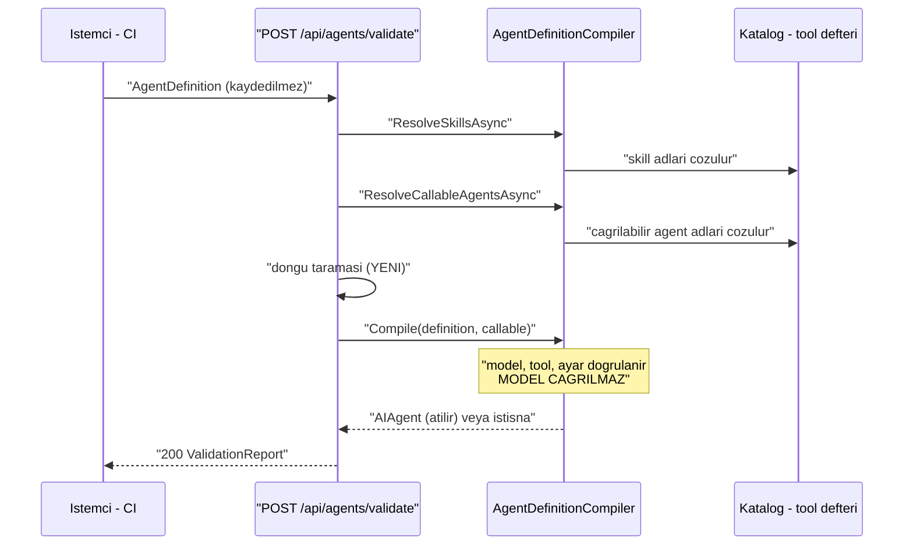

# Faz 34 — Tanım Doğrulama Ucu

> **Durum:** 📋 Planlandı (2026-08-06)
> **Kaynak:** [UCUNCU-FAZ-ADAYLARI.md](UCUNCU-FAZ-ADAYLARI.md) · **F-60**
> **Önkoşul:** Yok
> **Paketler:** `AgentPrism.Abstractions`, `.Core`, `.AspNetCore`, `.UI`
> **Yeni paket:** Yok · **Migration:** Yok
> **Public API:** büyüyor — Faz 7'den önce ucuz

---

## Bu Faza Başlarken

> `faz-baslangic` skill'ini uygula. Aşağıdaki liste o skill'in 2. adımıdır —
> **tamamını değil, yalnız işaret edilen bölümleri oku.**

1. Bu doküman
2. Kararlar — dosyanın tamamını **okuma**, yalnız bu kalemleri grep'le:
   ```bash
   grep -n "K-032\|K-103\|K-208\|K-218\|K-228\|K-232" docs/KARARLAR.md
   ```
   **K-032** (model kataloğu yapılandırmadan gelir — "model var mı" denetimi
   katalogla yapılır, yerleşik listeyle değil), **K-103** (alt agent onay
   isteyemez — çağrı grafiği sınırı), **K-208** (bilinmeyen sağlayıcı ayarı
   derleme hatasıdır — doğrulamanın yakalayacağı hata sınıfı),
   **K-218** (tool bağımlılıkları kurulum anında alınır),
   **K-228**/**K-232** (arayüz sözlüğü).
3. [`12-AGENT-CAGRI-GRAFIGI.md`](12-AGENT-CAGRI-GRAFIGI.md) — yalnız devir notu:
   ```bash
   awk '/## Sonraki Faza Devir Notu/,0' docs/12-AGENT-CAGRI-GRAFIGI.md
   ```
   `CallableAgentNames` sözleşmesini ve çalışma anı derinlik bütçesini
   devralıyorsun. Döngü denetimi bugün **yalnız çalışma anındadır**.
4. Alan hafızası (bu faz iki alana dokunuyor):
   [`hafiza/kod-haritasi.md`](hafiza/kod-haritasi.md) (derleyici ve katalog
   kaynakları nerede), [`hafiza/aspnetcore-di.md`](hafiza/aspnetcore-di.md) (uç kaydı)
5. Gerektiğinde, tamamı değil ilgili bölümü:
   [`MIMARI.md`](MIMARI.md) — derleme yolu bölümü

---

## Amaç

Bir agent tanımını **kaydetmeden** denemenin yolu yoktur. Bugün tek yol tanımı
yazmak, kaydetmek ve çalıştırmayı denemektir; hatalıysa katalog kirlenmiş olur.

- **F-60** — `POST /api/agents/validate`: bir tanımı kaydetmeden ve **hiçbir
  model çağırmadan** derler. Model tanınıyor mu, tool'lar çözülüyor mu,
  skill'ler yükleniyor mu, çağrılabilir agent'lar var mı, çağrı grafiği döngü
  içeriyor mu.

Bu uç aynı zamanda aday listesindeki **F-48** (GitOps: tanım dışa/içe aktarımı)
kaleminin CI adımıdır. F-48 bu dalgada **yoktur**; bu faz onun önkoşulunu
hazırlar.

### Bugün ne çalışmıyor — doğrulanmış kanıt

| Kanıt | Gözlem |
|---|---|
| `grep -rn "validate" src/AgentPrism.AspNetCore/Endpoints/AgentEndpoints.cs` | **Hiç sonuç yok.** `POST /api/agents/validate` yoktur |
| [`AgentPrismException.cs:108`](../src/AgentPrism.Abstractions/AgentPrismException.cs) | `AgentPrismCompilationException` **tanımlıdır** ve derleyici onu fırlatır |
| [`AgentDefinitionCompiler.cs:22`](../src/AgentPrism.Core/Compilation/AgentDefinitionCompiler.cs) | Bilinmeyen tool adı bu istisnayla reddedilir — mantık hazırdır |
| [`DefinitionStoreAgentSource.cs:81-87`](../src/AgentPrism.Core/Catalog/DefinitionStoreAgentSource.cs) | Gerçek derleme sırası: `ResolveSkillsAsync` → `ResolveCallableAgentsAsync` → `Compile(definition, callable)`. Doğrulama **aynı sırayı** izlemelidir |
| `grep -rni "cycle\|circular" src/AgentPrism.Core/Compilation/ src/AgentPrism.Core/Agents/` | **Hiç sonuç yok.** Statik döngü tespiti **yoktur** |

> Kanıtlar 2026-08-06 tarihinde doğrulandı.

> 🚨 **Aday listesinin kapsamı bir noktada iyimserdi.** Liste "eksik olan yalnız
> bir uçtan çağrılmasıdır" diyor. Bu, **model/tool/skill** denetimleri için
> doğrudur. Ama **çağrı grafiği döngü denetimi** bugün hiç yoktur: derleyicide
> döngü araması yok, koruma yalnız çalışma anındaki derinlik bütçesidir
> (Faz 12). Döngü denetimi bu fazda **yeni yazılır**, mevcut mantığın uca
> bağlanması değildir.

---

## 34.1 — Doğrulama gerçek yolu tekrarlar

Doğrulamanın tek değeri, **çalıştırmanın yapacağının aynısını** yapmasıdır.
Farklı bir yol izleyen bir doğrulayıcı yeşil verir, çalıştırma kırılır.



Derlenen `AIAgent` **kullanılmaz ve atılır**. Uç hiçbir şey kaydetmez, hiçbir
`runs` satırı açmaz, hiçbir token harcamaz.

## 34.2 — Yanıt her zaman `200`

Doğrulama **başarısızlığı bir HTTP hatası değildir**. İstek geçerlidir; cevap
"bu tanım geçersiz"dir. `400` dönmek, CI'ın ağ hatasıyla doğrulama hatasını
ayırt etmesini zorlaştırır.

| Durum | Yanıt |
|---|---|
| Tanım geçerli | `200`, `valid: true`, boş `errors` |
| Tanım geçersiz | `200`, `valid: false`, dolu `errors` |
| Gövde ayrıştırılamıyor | `400` — bu gerçek bir istek hatasıdır |
| Rol yetersiz | `403` |

Hatalar **tek tek** raporlanır. İlk hatada durmak, kullanıcıyı beş kez uç
çağırmaya zorlar. Derleyici ilk hatada istisna fırlattığı için doğrulayıcı
denetimleri **kendi sırasıyla** yürütür ve derlemeyi en sona bırakır.

## 34.3 — 🚨 Ağ isteği ve zaman aşımı

Derleme yan etkisizdir, ama **tool çözümü ağa çıkabilir**: bir MCP sunucusundan
tool listesi çekmek gerçek bir HTTP isteğidir. Uç bu yüzden bir zaman aşımı
taşır.

Zaman aşımı dolarsa doğrulama **`valid: false` ile başarısız olmaz** — ayrı bir
`inconclusive` (sonuçsuz) alanı döner. "MCP sunucusuna ulaşılamadı" ile "tool
adı yanlış" aynı şey değildir; CI ikisine farklı tepki vermelidir.

---

## Planlanan Public API

> Taslak imzalardır. Gerçekleşen imzalar kapanışta ayrı bir bölüme yazılır.

```csharp
// AgentPrism.Abstractions/Agents
public enum ValidationSeverity
{
    Error = 1,
    Warning = 2,
}

public sealed record ValidationMessage
{
    public required ValidationSeverity Severity { get; init; }
    public required string Code { get; init; }      // "unknown_tool", "cycle", ...
    public required string Message { get; init; }   // cevrilmez (K-232)
    public string? Path { get; init; }              // "toolNames[2]"
}

public sealed record AgentValidationReport
{
    public required bool Valid { get; init; }

    /// <summary>Bir denetim ulasilamayan bir kaynak yuzunden tamamlanamadi.</summary>
    public required bool Inconclusive { get; init; }

    public required IReadOnlyList<ValidationMessage> Messages { get; init; }
}
```

```csharp
// AgentPrism.Core/Compilation
public sealed class AgentDefinitionValidator
{
    public ValueTask<AgentValidationReport> ValidateAsync(
        AgentDefinition definition,
        CancellationToken cancellationToken = default);
}
```

> 🚨 Yeni public tiplerdir. Faz 7'den (yayın) önce eklemek bedavadır.

### Denetim listesi

| Kod | Ne denetlenir | Kaynak |
|---|---|---|
| `unknown_model` | Model katalogda tanınıyor mu | K-032 — katalog yapılandırmadan gelir |
| `unknown_tool` | Her tool adı defterde var mı | `AgentDefinitionCompiler.cs:22` |
| `unknown_skill` | Skill yükleniyor mu | `ResolveSkillsAsync` |
| `unknown_agent` | Çağrılabilir agent katalogda var mı | `ResolveCallableAgentsAsync` |
| `cycle` | Çağrı grafiği kendine dönüyor mu | **YENİ** — bu fazda yazılır |
| `invalid_setting` | Sağlayıcı ayarı tanınıyor mu | K-208 |
| `mcp_unreachable` | MCP sunucusuna ulaşılamadı | `Inconclusive` yapar, `Valid`'i düşürmez |

### HTTP `endpoint`'leri

| Metot | Yol | Rol | Ne yapar |
|---|---|---|---|
| `POST` | `/api/agents/validate` | Operator | Bir tanımı kaydetmeden derler ve rapor döner |

Rol gerekçesi: doğrulama tanım içeriğini ve katalog yapısını açığa çıkarır;
salt okur bir `Reader` için fazladır. Kaydetme yetkisi olan `Operator` doğal
sahiptir.

### Arayüz payı

Agent editörüne bir "Doğrula" düğmesi ve hata listesi girer. Yeni bağımlılık
**yok**.

Bugünkü kullanım ölçüldü (2026-08-06): **151,3 KB gzip / 250 KB**, kalan pay
**98,7 KB**. Bu fazın payı **tahminî 1–2 KB gzip**'tir; gerçek değer uygulama
anında `postbuild.mjs` çıktısından okunur ve buraya yazılır.

Hata metinleri sunucudan gelir ve **çevrilmez** (K-232); arayüz yalnız `code`
alanına göre kendi başlığını gösterir.

---

## Planlanan Dosya Listesi

```
src/AgentPrism.Abstractions/Agents/
├── AgentValidationReport.cs
├── ValidationMessage.cs
└── ValidationSeverity.cs

src/AgentPrism.Core/Compilation/
├── AgentDefinitionValidator.cs
└── CallGraphCycleDetector.cs      (YENI)

src/AgentPrism.AspNetCore/Endpoints/
└── AgentEndpoints.cs              (uc eklenir)

src/AgentPrism.UI/frontend/src/
├── components/ValidateButton.tsx
└── locales/{en,tr}.ts             (anahtar eklenir)
```

---

## Testler

| Test sınıfı | Neyi doğrular |
|---|---|
| `AgentDefinitionValidatorTests` | Yedi denetim kodunun her biri doğru tetiklenir |
| `ValidatorMultipleErrorTests` | Üç hatalı alan taşıyan tanım **üç** mesaj döner, ilkinde durmaz |
| `CallGraphCycleDetectorTests` | Kendine çağrı, iki adımlı döngü, üç adımlı döngü ve döngüsüz derin grafik |
| `ValidatorNoSideEffectTests` | 🚨 Doğrulama sonrası katalog değişmez, `runs` satırı açılmaz, sahte model sağlayıcısının çağrı sayacı **sıfır** kalır |
| `ValidatorTimeoutTests` | Yanıt vermeyen MCP sunucusu `Inconclusive: true` üretir, `Valid: false` **üretmez** |
| `ValidateEndpointTests` | Geçersiz tanım `200` + `valid:false`; bozuk gövde `400`; Reader `403` |

---

## Açık Sorular

> Planı bloklamayan, faz uygulanırken karara bağlanacak sorular. Bloklayan
> sorular plan yazılmadan **önce** sorulur.

| # | Soru | Seçenekler | Öneri |
|---|---|---|---|
| 1 | Döngü denetimi hata mı uyarı mı? | A: `Error` · B: `Warning` | **A.** Faz 12'nin derinlik bütçesi döngüyü çalışma anında kesiyor ama para harcadıktan sonra. Statik döngü kesin bir kusurdur |
| 2 | MCP zaman aşımı ne kadar? | A: sabit 5 sn · B: `AgentPrismEndpointOptions`'ta ayarlanabilir, varsayılan 5 sn | **B.** Yavaş bir MCP sunucusu CI'ı kırmamalıdır; ayar ucuzdur |
| 3 | Var olan bir agent adıyla gelen tanım nasıl ele alınır? | A: doğrulanır, kayıt etkilenmez · B: `409` | **A.** Uç kaydetmez; ad çakışması doğrulamanın konusu değildir |
| 4 | Doğrulama denetim izine yazılsın mı? | A: hayır · B: evet | **A.** Yan etkisiz bir okuma işlemidir; denetim izini gürültüyle doldurur |

---

## Bitiş Ölçütleri (DoD)

- [ ] Geçerli bir tanım `POST /api/agents/validate` ile `200` +
      `{"valid":true,"messages":[]}` döner
- [ ] Bilinmeyen tool adı taşıyan tanım `200` + `valid:false` +
      `code:"unknown_tool"` döner
- [ ] Üç ayrı hata taşıyan tanım **üç** mesaj döner (ilk hatada durmaz)
- [ ] `A → B → A` çağrı grafiği `code:"cycle"` üretir
- [ ] 🚨 Doğrulama sonrası `GET /api/agents` listesi **değişmez** ve
      `GET /api/runs` yeni satır göstermez
- [ ] Ulaşılamayan MCP sunucusu `inconclusive:true` üretir, `valid` düşmez
- [ ] Dört doğrulama kapısı sıfır uyarı verir
- [ ] `samples/AgentPrism.Api` ile gerçek doğrulama yapıldı, çıktı bu belgeye
      yazıldı
- [ ] `secret` taraması boş döndü
- [ ] `en.ts` ve `tr.ts` eksiksiz; bundle payı ölçüldü ve yazıldı

### Doğrulama komutları

```bash
# Gecerli tanim
curl -s -X POST http://localhost:5081/agentprism/api/agents/validate \
  -H 'content-type: application/json' \
  -d '{"name":"deneme","model":{"provider":"echo","model":"echo-1"},"toolNames":[]}' | jq

# Bilinmeyen tool — 200 + valid:false beklenir
curl -s -X POST http://localhost:5081/agentprism/api/agents/validate \
  -H 'content-type: application/json' \
  -d '{"name":"deneme","model":{"provider":"echo","model":"echo-1"},"toolNames":["olmayan_tool"]}' \
  | jq '{valid, codes: [.messages[].code]}'

# 🚨 Yan etkisizlik: once ve sonra sayilar esit olmali
curl -s http://localhost:5081/agentprism/api/agents | jq 'length'
curl -s http://localhost:5081/agentprism/api/runs   | jq 'length'
```

---

## Riskler

| Risk | Önlem |
|------|-------|
| 🚨 Doğrulayıcı gerçek derleme yolundan **sapar**, yeşil verir ama çalıştırma kırılır | `DefinitionStoreAgentSource.cs:81-87` sırası birebir izlenir; sapma testle yakalanır |
| Tool çözümü ağa çıkar ve uç asılır | Zaman aşımı zorunludur; sonuç `Inconclusive` ile ayrılır |
| Döngü denetimi derin grafikte pahalı olur | Ziyaret edilen düğüm kümesiyle tek geçiş; derinlik Faz 12'nin sınırıyla zaten kapalıdır |
| Doğrulama uç yüzeyini büyütür ve Faz 7 maliyeti doğar | Yayından **önce** yapılırsa bedavadır; bu fazın sırası bunu sağlar |
| Yan etkisizlik sessizce bozulur | DoD'de açık sayım denetimi var; birim testi tek başına yetmez |

---

<!-- ============================================================
     AŞAĞISI KAPANIŞTA DOLDURULUR — `faz-tamamlama` skill'i.
     Plan anında boş kalır. Başlıkları SİLME.
     ============================================================ -->

## Plandan Sapmalar

> Kapanışta doldurulur. Plan ile gerçek arasındaki fark **gizlenmez** — sonraki
> oturumun en değerli bilgisidir.

## Bu Fazda Verilen Kararlar

> Kapanışta doldurulur. K-NNN numaraları burada alınır; plan numara rezerve etmez.

## Gerçekleşen Public API

> Kapanışta doldurulur. Koddaki **gerçek** imzalar.

## Dosya Listesi (gerçekleşen)

> Kapanışta doldurulur.

## Sonraki Faza Devir Notu

> Kapanışta doldurulur: devralınan sözleşmeler, bilinen tuzaklar (🚨), yarım
> kalan işler, sıradaki faz.
