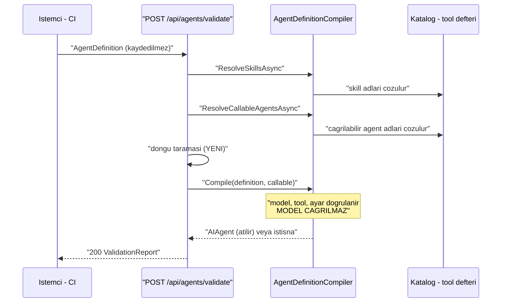

# Faz 34 — Tanım Doğrulama Ucu

> **Durum:** ✅ Tamamlandı (2026-08-06)
> **Kaynak:** [ADAYLAR.md](ADAYLAR.md) · **F-60**
> **Önkoşul:** Yok
> **Paketler:** `AgentPrism.Abstractions`, `.Core`, `.AspNetCore`, `.UI`
> **Yeni paket:** Yok · **Migration:** Yok
> **Public API:** büyüyor — Faz 7'den önce ucuz

---

## Bu Faza Başlarken

> `faz-baslangic` skill'ini uygula. Aşağıdaki liste o skill'in 2. adımıdır —
> **tamamını değil, yalnız işaret edilen bölümleri oku.**

1. Bu doküman
2. Kararlar — dosyanın tamamını **okuma**, yalnız bu kalemleri grep'le:
   ```bash
   grep -n "K-032\|K-103\|K-208\|K-218\|K-228\|K-232" docs/KARARLAR.md
   ```
   **K-032** (model kataloğu yapılandırmadan gelir — "model var mı" denetimi
   katalogla yapılır, yerleşik listeyle değil), **K-103** (alt agent onay
   isteyemez — çağrı grafiği sınırı), **K-208** (bilinmeyen sağlayıcı ayarı
   derleme hatasıdır — doğrulamanın yakalayacağı hata sınıfı),
   **K-218** (tool bağımlılıkları kurulum anında alınır),
   **K-228**/**K-232** (arayüz sözlüğü).
3. [`12-AGENT-CAGRI-GRAFIGI.md`](12-AGENT-CAGRI-GRAFIGI.md) — yalnız devir notu:
   ```bash
   awk '/## Sonraki Faza Devir Notu/,0' docs/12-AGENT-CAGRI-GRAFIGI.md
   ```
   `CallableAgentNames` sözleşmesini ve çalışma anı derinlik bütçesini
   devralıyorsun. Döngü denetimi bugün **yalnız çalışma anındadır**.
4. Alan hafızası (bu faz iki alana dokunuyor):
   [`hafiza/kod-haritasi.md`](hafiza/kod-haritasi.md) (derleyici ve katalog
   kaynakları nerede), [`hafiza/aspnetcore-di.md`](hafiza/aspnetcore-di.md) (uç kaydı)
5. Gerektiğinde, tamamı değil ilgili bölümü:
   [`MIMARI.md`](MIMARI.md) — derleme yolu bölümü

---

## Amaç

Bir agent tanımını **kaydetmeden** denemenin yolu yoktur. Bugün tek yol tanımı
yazmak, kaydetmek ve çalıştırmayı denemektir; hatalıysa katalog kirlenmiş olur.

- **F-60** — `POST /api/agents/validate`: bir tanımı kaydetmeden ve **hiçbir
  model çağırmadan** derler. Model tanınıyor mu, tool'lar çözülüyor mu,
  skill'ler yükleniyor mu, çağrılabilir agent'lar var mı, çağrı grafiği döngü
  içeriyor mu.

Bu uç aynı zamanda aday listesindeki **F-48** (GitOps: tanım dışa/içe aktarımı)
kaleminin CI adımıdır. F-48 bu dalgada **yoktur**; bu faz onun önkoşulunu
hazırlar.

### Bugün ne çalışmıyor — doğrulanmış kanıt

| Kanıt | Gözlem |
|---|---|
| `grep -rn "validate" src/AgentPrism.AspNetCore/Endpoints/AgentEndpoints.cs` | **Hiç sonuç yok.** `POST /api/agents/validate` yoktur |
| [`AgentPrismException.cs:108`](../src/AgentPrism.Abstractions/AgentPrismException.cs) | `AgentPrismCompilationException` **tanımlıdır** ve derleyici onu fırlatır |
| [`AgentDefinitionCompiler.cs:22`](../src/AgentPrism.Core/Compilation/AgentDefinitionCompiler.cs) | Bilinmeyen tool adı bu istisnayla reddedilir — mantık hazırdır |
| [`DefinitionStoreAgentSource.cs:81-87`](../src/AgentPrism.Core/Catalog/DefinitionStoreAgentSource.cs) | Gerçek derleme sırası: `ResolveSkillsAsync` → `ResolveCallableAgentsAsync` → `Compile(definition, callable)`. Doğrulama **aynı sırayı** izlemelidir |
| `grep -rni "cycle\|circular" src/AgentPrism.Core/Compilation/ src/AgentPrism.Core/Agents/` | **Hiç sonuç yok.** Statik döngü tespiti **yoktur** |

> Kanıtlar 2026-08-06 tarihinde doğrulandı.

> 🚨 **Aday listesinin kapsamı bir noktada iyimserdi.** Liste "eksik olan yalnız
> bir uçtan çağrılmasıdır" diyor. Bu, **model/tool/skill** denetimleri için
> doğrudur. Ama **çağrı grafiği döngü denetimi** bugün hiç yoktur: derleyicide
> döngü araması yok, koruma yalnız çalışma anındaki derinlik bütçesidir
> (Faz 12). Döngü denetimi bu fazda **yeni yazılır**, mevcut mantığın uca
> bağlanması değildir.

---

## 34.1 — Doğrulama gerçek yolu tekrarlar

Doğrulamanın tek değeri, **çalıştırmanın yapacağının aynısını** yapmasıdır.
Farklı bir yol izleyen bir doğrulayıcı yeşil verir, çalıştırma kırılır.



Derlenen `AIAgent` **kullanılmaz ve atılır**. Uç hiçbir şey kaydetmez, hiçbir
`runs` satırı açmaz, hiçbir token harcamaz.

## 34.2 — Yanıt her zaman `200`

Doğrulama **başarısızlığı bir HTTP hatası değildir**. İstek geçerlidir; cevap
"bu tanım geçersiz"dir. `400` dönmek, CI'ın ağ hatasıyla doğrulama hatasını
ayırt etmesini zorlaştırır.

| Durum | Yanıt |
|---|---|
| Tanım geçerli | `200`, `valid: true`, boş `errors` |
| Tanım geçersiz | `200`, `valid: false`, dolu `errors` |
| Gövde ayrıştırılamıyor | `400` — bu gerçek bir istek hatasıdır |
| Rol yetersiz | `403` |

Hatalar **tek tek** raporlanır. İlk hatada durmak, kullanıcıyı beş kez uç
çağırmaya zorlar. Derleyici ilk hatada istisna fırlattığı için doğrulayıcı
denetimleri **kendi sırasıyla** yürütür ve derlemeyi en sona bırakır.

## 34.3 — 🚨 Ağ isteği ve zaman aşımı

Derleme yan etkisizdir, ama **tool çözümü ağa çıkabilir**: bir MCP sunucusundan
tool listesi çekmek gerçek bir HTTP isteğidir. Uç bu yüzden bir zaman aşımı
taşır.

Zaman aşımı dolarsa doğrulama **`valid: false` ile başarısız olmaz** — ayrı bir
`inconclusive` (sonuçsuz) alanı döner. "MCP sunucusuna ulaşılamadı" ile "tool
adı yanlış" aynı şey değildir; CI ikisine farklı tepki vermelidir.

---

## Planlanan Public API

> Taslak imzalardır. Gerçekleşen imzalar kapanışta ayrı bir bölüme yazılır.

```csharp
// AgentPrism.Abstractions/Agents
public enum ValidationSeverity
{
    Error = 1,
    Warning = 2,
}

public sealed record ValidationMessage
{
    public required ValidationSeverity Severity { get; init; }
    public required string Code { get; init; }      // "unknown_tool", "cycle", ...
    public required string Message { get; init; }   // cevrilmez (K-232)
    public string? Path { get; init; }              // "toolNames[2]"
}

public sealed record AgentValidationReport
{
    public required bool Valid { get; init; }

    /// <summary>Bir denetim ulasilamayan bir kaynak yuzunden tamamlanamadi.</summary>
    public required bool Inconclusive { get; init; }

    public required IReadOnlyList<ValidationMessage> Messages { get; init; }
}
```

```csharp
// AgentPrism.Core/Compilation
public sealed class AgentDefinitionValidator
{
    public ValueTask<AgentValidationReport> ValidateAsync(
        AgentDefinition definition,
        CancellationToken cancellationToken = default);
}
```

> 🚨 Yeni public tiplerdir. Faz 7'den (yayın) önce eklemek bedavadır.

### Denetim listesi

| Kod | Ne denetlenir | Kaynak |
|---|---|---|
| `unknown_model` | Model katalogda tanınıyor mu | K-032 — katalog yapılandırmadan gelir |
| `unknown_tool` | Her tool adı defterde var mı | `AgentDefinitionCompiler.cs:22` |
| `unknown_skill` | Skill yükleniyor mu | `ResolveSkillsAsync` |
| `unknown_agent` | Çağrılabilir agent katalogda var mı | `ResolveCallableAgentsAsync` |
| `cycle` | Çağrı grafiği kendine dönüyor mu | **YENİ** — bu fazda yazılır |
| `invalid_setting` | Sağlayıcı ayarı tanınıyor mu | K-208 |
| `mcp_unreachable` | MCP sunucusuna ulaşılamadı | `Inconclusive` yapar, `Valid`'i düşürmez |

### HTTP `endpoint`'leri

| Metot | Yol | Rol | Ne yapar |
|---|---|---|---|
| `POST` | `/api/agents/validate` | Operator | Bir tanımı kaydetmeden derler ve rapor döner |

Rol gerekçesi: doğrulama tanım içeriğini ve katalog yapısını açığa çıkarır;
salt okur bir `Reader` için fazladır. Kaydetme yetkisi olan `Operator` doğal
sahiptir.

### Arayüz payı

Agent editörüne bir "Doğrula" düğmesi ve hata listesi girer. Yeni bağımlılık
**yok**.

Bugünkü kullanım ölçüldü (2026-08-06): **151,3 KB gzip / 250 KB**, kalan pay
**98,7 KB**. Bu fazın payı **tahminî 1–2 KB gzip**'tir; gerçek değer uygulama
anında `postbuild.mjs` çıktısından okunur ve buraya yazılır.

Hata metinleri sunucudan gelir ve **çevrilmez** (K-232); arayüz yalnız `code`
alanına göre kendi başlığını gösterir.

---

## Planlanan Dosya Listesi

```
src/AgentPrism.Abstractions/Agents/
├── AgentValidationReport.cs
├── ValidationMessage.cs
└── ValidationSeverity.cs

src/AgentPrism.Core/Compilation/
├── AgentDefinitionValidator.cs
└── CallGraphCycleDetector.cs      (YENI)

src/AgentPrism.AspNetCore/Endpoints/
└── AgentEndpoints.cs              (uc eklenir)

src/AgentPrism.UI/frontend/src/
├── components/ValidateButton.tsx
└── locales/{en,tr}.ts             (anahtar eklenir)
```

---

## Testler

| Test sınıfı | Neyi doğrular |
|---|---|
| `AgentDefinitionValidatorTests` | Yedi denetim kodunun her biri doğru tetiklenir |
| `ValidatorMultipleErrorTests` | Üç hatalı alan taşıyan tanım **üç** mesaj döner, ilkinde durmaz |
| `CallGraphCycleDetectorTests` | Kendine çağrı, iki adımlı döngü, üç adımlı döngü ve döngüsüz derin grafik |
| `ValidatorNoSideEffectTests` | 🚨 Doğrulama sonrası katalog değişmez, `runs` satırı açılmaz, sahte model sağlayıcısının çağrı sayacı **sıfır** kalır |
| `ValidatorTimeoutTests` | Yanıt vermeyen MCP sunucusu `Inconclusive: true` üretir, `Valid: false` **üretmez** |
| `ValidateEndpointTests` | Geçersiz tanım `200` + `valid:false`; bozuk gövde `400`; Reader `403` |

---

## Açık Sorular

> Planı bloklamayan, faz uygulanırken karara bağlanacak sorular. Bloklayan
> sorular plan yazılmadan **önce** sorulur.

| # | Soru | Seçenekler | Öneri |
|---|---|---|---|
| 1 | Döngü denetimi hata mı uyarı mı? | A: `Error` · B: `Warning` | **A.** Faz 12'nin derinlik bütçesi döngüyü çalışma anında kesiyor ama para harcadıktan sonra. Statik döngü kesin bir kusurdur |
| 2 | MCP zaman aşımı ne kadar? | A: sabit 5 sn · B: `AgentPrismEndpointOptions`'ta ayarlanabilir, varsayılan 5 sn | **B.** Yavaş bir MCP sunucusu CI'ı kırmamalıdır; ayar ucuzdur |
| 3 | Var olan bir agent adıyla gelen tanım nasıl ele alınır? | A: doğrulanır, kayıt etkilenmez · B: `409` | **A.** Uç kaydetmez; ad çakışması doğrulamanın konusu değildir |
| 4 | Doğrulama denetim izine yazılsın mı? | A: hayır · B: evet | **A.** Yan etkisiz bir okuma işlemidir; denetim izini gürültüyle doldurur |

---

## Bitiş Ölçütleri (DoD)

- [ ] Geçerli bir tanım `POST /api/agents/validate` ile `200` +
      `{"valid":true,"messages":[]}` döner
- [ ] Bilinmeyen tool adı taşıyan tanım `200` + `valid:false` +
      `code:"unknown_tool"` döner
- [ ] Üç ayrı hata taşıyan tanım **üç** mesaj döner (ilk hatada durmaz)
- [ ] `A → B → A` çağrı grafiği `code:"cycle"` üretir
- [ ] 🚨 Doğrulama sonrası `GET /api/agents` listesi **değişmez** ve
      `GET /api/runs` yeni satır göstermez
- [ ] Ulaşılamayan MCP sunucusu `inconclusive:true` üretir, `valid` düşmez
- [ ] Dört doğrulama kapısı sıfır uyarı verir
- [ ] `samples/AgentPrism.Api` ile gerçek doğrulama yapıldı, çıktı bu belgeye
      yazıldı
- [ ] `secret` taraması boş döndü
- [ ] `en.ts` ve `tr.ts` eksiksiz; bundle payı ölçüldü ve yazıldı

### Doğrulama komutları

```bash
# Gecerli tanim
curl -s -X POST http://localhost:5081/agentprism/api/agents/validate \
  -H 'content-type: application/json' \
  -d '{"name":"deneme","model":{"provider":"echo","model":"echo-1"},"toolNames":[]}' | jq

# Bilinmeyen tool — 200 + valid:false beklenir
curl -s -X POST http://localhost:5081/agentprism/api/agents/validate \
  -H 'content-type: application/json' \
  -d '{"name":"deneme","model":{"provider":"echo","model":"echo-1"},"toolNames":["olmayan_tool"]}' \
  | jq '{valid, codes: [.messages[].code]}'

# 🚨 Yan etkisizlik: once ve sonra sayilar esit olmali
curl -s http://localhost:5081/agentprism/api/agents | jq 'length'
curl -s http://localhost:5081/agentprism/api/runs   | jq 'length'
```

---

## Riskler

| Risk | Önlem |
|------|-------|
| 🚨 Doğrulayıcı gerçek derleme yolundan **sapar**, yeşil verir ama çalıştırma kırılır | `DefinitionStoreAgentSource.cs:81-87` sırası birebir izlenir; sapma testle yakalanır |
| Tool çözümü ağa çıkar ve uç asılır | Zaman aşımı zorunludur; sonuç `Inconclusive` ile ayrılır |
| Döngü denetimi derin grafikte pahalı olur | Ziyaret edilen düğüm kümesiyle tek geçiş; derinlik Faz 12'nin sınırıyla zaten kapalıdır |
| Doğrulama uç yüzeyini büyütür ve Faz 7 maliyeti doğar | Yayından **önce** yapılırsa bedavadır; bu fazın sırası bunu sağlar |
| Yan etkisizlik sessizce bozulur | DoD'de açık sayım denetimi var; birim testi tek başına yetmez |

---

<!-- ============================================================
     AŞAĞISI KAPANIŞTA DOLDURULUR — `faz-tamamlama` skill'i.
     Plan anında boş kalır. Başlıkları SİLME.
     ============================================================ -->

## Plandan Sapmalar

1. **🚨 Döngü denetimi YENİ yazılmadı — zaten vardı.** Planın "Bugün ne
   çalışmıyor" kanıt tablosu `grep -rni "cycle|circular"` aramasını yalnız
   `src/AgentPrism.Core/Compilation/` ve `src/AgentPrism.Core/Agents/`
   dizinlerinde çalıştırmıştı. Gerçek statik döngü denetimi
   `src/AgentPrism.Core/Graph/AgentCallGraph.cs`'te **zaten** yaşıyordu ve
   `POST /api/agents`/`PUT /api/agents/{name}` kaydetme anında kullanılıyordu;
   bu dosya ayrı bir karar numarası taşımadan, önceki bir fazda eklenmişti.
   Plan bu yüzden `CallGraphCycleDetector.cs` adında
   yeni bir dosya öngörüyordu; onun yerine `AgentCallGraph`'a kod taşıyan bir
   `ValidateDetailed` metodu eklendi (K-252). Planlanan dosya listesindeki
   `Compilation/CallGraphCycleDetector.cs` **oluşturulmadı**.
2. **`ValidateAsync`'in `mcpTimeout` parametresi kaldırıldı.** Planın taslak
   imzası yalnız `(AgentDefinition, CancellationToken)` idi; ilk taslakta bir
   `TimeSpan mcpTimeout` parametresi eklenmişti ama `AgentPrismValidationOptions`
   `IOptions<AgentPrismOptions>` üzerinden zaten kayıtlı olduğu için parametre
   gereksizdi. Kaldırıldı — planın taslak imzasıyla birebir aynı (K-253).
3. **Açık soru 2'nin "B" seçeneği farklı bir dosyada uygulandı.** Plan
   `AgentPrismEndpointOptions`'ta (AspNetCore) ayarlanabilir bir zaman aşımı
   öneriyordu. `AgentDefinitionValidator` `AgentPrism.Core`'da yaşar ve
   `AgentPrism.AspNetCore`'a bağımlı olamaz (paket yönü tersine döner); ayar bu
   yüzden `AgentPrismOptions.Validation.McpTimeout` (Core) altına kondu — aynı
   yapılandırılabilirlik, doğru katman (K-253).
4. **`unknown_model` denetimi model **adını** değil, sağlayıcı **kaydını**
   denetler.** K-032 model kataloğunun bir doğrulama listesi olmadığını
   söylüyor (`OpenAIModelProvider.CreateChatClient` bilinmeyen bir model adını
   yalnız loglar, reddetmez). Bu yüzden `unknown_model` gerçek derleme
   yolundaki tek kesin hata kaynağını tekrarlar: `ModelBinding.Provider`
   `IModelProviderRegistry.List()`'te kayıtlı mı. Planın denetim listesi bunu
   "model kataloğu" olarak anıyordu; gerçekleşen davranış K-032 ile tutarlıdır,
   yalnız hangi katalogun (sağlayıcı listesi, model listesi değil) denetlendiği
   nettir.
5. **`mcp_unreachable` durumunda `unknown_tool` YAZILMAZ, final derleme de
   ATLANIR.** İlk taslak zaman aşımından sonra da eksik kalan tool adlarını
   `unknown_tool` olarak raporluyordu; bu, DoD'nin "Ulaşılamayan MCP sunucusu
   `inconclusive:true` üretir, `valid` düşmez" şartını ihlal ederdi — hem
   çünkü doğrudan `unknown_tool` (Error) eklenir hem de final derleme aynı
   tool için `AgentPrismCompilationException` fırlatırdı. Düzeltme:
   `Inconclusive` iken ne `unknown_tool` yazılır ne de final derleme çalışır.
   Ölçüldü: `AgentDefinitionValidatorTests.Ulasilamayan_mcp_sunucusu_...` bu
   olmadan kırmızı veriyordu.

## Bu Fazda Verilen Kararlar

| Karar | Tarih | Gerekçe | Yeniden açılma koşulu |
|---|---|---|---|
| **K-252 — Cağrı grafiği döngü/bilinmeyen-agent denetimi `AgentCallGraph`'ta genişletildi, yeni dosya açılmadı** | 2026-08-06 | Statik döngü denetimi Faz 34 planlanmadan önce zaten vardı (`AgentCallGraph.Validate`, kaydetme anında `POST/PUT /api/agents` tarafından kullanılıyor). Planın kanıt taraması yanlış dizinde arandığı için bunu kaçırmıştı. İki ayrı döngü denetleyicisi (biri kaydetmede, biri doğrulama ucunda) aynı mantığı iki yerde bakımsız bırakırdı — ilk sapma ikincisini yakalamazdı. Çözüm: `Validate(string)` (eski imza, testleri bozulmadan kalır) artık yeni `ValidateDetailed(...)`'i çağırır; ikincisi kod (`unknown_agent`/`cycle`) ve mesaj birlikte taşıyan `AgentCallGraphProblem` döner. | Döngü denetiminin kendisi değişirse (yeni bir hata sınıfı, örn. derinlik tahmini) her iki tüketici de aynı yerden güncellenir |
| **K-253 — `AgentPrismValidationOptions.McpTimeout` `AgentPrismOptions`'a (Core) eklendi, `AgentPrismEndpointOptions`'a (AspNetCore) değil** | 2026-08-06 | Planın açık soru 2'si zaman aşımını `AgentPrismEndpointOptions`'ta öneriyordu, ama `AgentDefinitionValidator` `AgentPrism.Core`'dadır ve `AgentPrism.Core`, `AgentPrism.AspNetCore`'a bağımlı **olamaz** (paket bağımlılık yönü K1'in bir parçası). `IOptions<AgentPrismOptions>` zaten `AgentDefinitionCompiler`'ın da kullandığı ortak yapılandırma kanalıdır; aynı kanaldan okumak yeni bir katman ihlali yaratmadan aynı yapılandırılabilirliği (varsayılan 5 sn, `AgentPrism:Validation:McpTimeout` ile değiştirilebilir) verir. | Doğrulama ucu HTTP katmanına özgü bir ayar (örn. istek başına zaman aşımı) gerektirirse, o ayar `AgentPrismEndpointOptions`'a eklenip `AgentDefinitionValidator.ValidateAsync`'e parametre olarak geçirilebilir |

## Gerçekleşen Public API

```csharp
// AgentPrism.Abstractions/Agents
public enum ValidationSeverity { Error = 1, Warning = 2 }   // [JsonConverter(JsonStringEnumConverter<ValidationSeverity>)]

public sealed record ValidationMessage
{
    public required ValidationSeverity Severity { get; init; }
    public required string Code { get; init; }      // "unknown_model" | "unknown_tool" | "unknown_skill"
                                                      // | "unknown_agent" | "cycle" | "invalid_setting"
                                                      // | "mcp_unreachable" | "compilation_error"
    public required string Message { get; init; }   // cevrilmez (K-232)
    public string? Path { get; init; }               // "toolNames[2]", "model.provider", ...
}

public sealed record AgentValidationReport
{
    public required bool Valid { get; init; }
    public required bool Inconclusive { get; init; }
    public required IReadOnlyList<ValidationMessage> Messages { get; init; }
}
```

```csharp
// AgentPrism.Core/Compilation — plandaki taslakla birebir aynı
public sealed class AgentDefinitionValidator
{
    public AgentDefinitionValidator(
        IModelProviderRegistry models,
        IToolRegistry tools,
        AgentSkillCatalog skills,
        IAgentCatalog catalog,
        AgentDefinitionCompiler compiler,
        IOptions<AgentPrismOptions> options,
        IMcpToolRefresher? mcpRefresher = null);

    public ValueTask<AgentValidationReport> ValidateAsync(
        AgentDefinition definition,
        CancellationToken cancellationToken = default);
}
```

```csharp
// AgentPrism.Core/Graph — mevcut AgentCallGraph'a EKLENEN uye (yeni dosya degil)
public readonly record struct AgentCallGraphProblem(string Code, string Message);

public static class AgentCallGraph
{
    // Var olan imza (davranışı değişmedi):
    public static string? Validate(string agentName, IReadOnlyList<string> callableAgentNames, IReadOnlyList<AgentDescriptor> descriptors);

    // Yeni: aynı denetim, kod + mesaj birlikte.
    public static AgentCallGraphProblem? ValidateDetailed(string agentName, IReadOnlyList<string> callableAgentNames, IReadOnlyList<AgentDescriptor> descriptors);
}
```

```csharp
// AgentPrism.Core — yapılandırma
public sealed class AgentPrismValidationOptions
{
    public TimeSpan McpTimeout { get; set; } = TimeSpan.FromSeconds(5);
}
// AgentPrismOptions.Validation { get; set; } = new();
```

### HTTP

| Metot | Yol | Rol | Yanıt |
|---|---|---|---|
| `POST` | `/api/agents/validate` | Operator | `200 AgentValidationReport` (her zaman); gövde `name`/`model` boşsa `400` |

Gövde `AgentDefinitionRequest` — create/update ile **aynı sözleşme**; ayrı bir DTO yazılmadı.

## Dosya Listesi (gerçekleşen)

```
src/AgentPrism.Abstractions/Agents/
├── AgentValidationReport.cs        (YENİ)
├── ValidationMessage.cs            (YENİ)
└── ValidationSeverity.cs           (YENİ)

src/AgentPrism.Core/
├── Compilation/AgentDefinitionValidator.cs   (YENİ — planlanan CallGraphCycleDetector.cs YOK)
├── Graph/AgentCallGraph.cs                   (genişledi: ValidateDetailed + AgentCallGraphProblem)
├── Skills/AgentSkillCatalog.cs               (genişledi: ExistsAsync)
├── AgentPrismOptions.cs                      (genişledi: AgentPrismValidationOptions)
├── AgentPrismOptionsValidator.cs             (genişledi: McpTimeout > 0 denetimi)
└── AgentPrismServiceCollectionExtensions.cs  (genişledi: AgentDefinitionValidator kaydı)

src/AgentPrism.AspNetCore/Endpoints/
└── AgentEndpoints.cs                (genişledi: POST /api/agents/validate + ValidateAgentAsync)

src/AgentPrism.UI/frontend/src/
├── lib/types.ts                     (genişledi: ValidationSeverity/ValidationMessage/AgentValidationReport)
├── lib/api.ts                       (genişledi: api.validateAgent)
├── screens/agent-editor.tsx         (genişledi: Doğrula düğmesi + ValidationReportPanel)
└── locales/{en,tr}.ts               (genişledi: agentEditor.validate* anahtarları)

tests/AgentPrism.Core.UnitTests/
├── Compilation/AgentDefinitionValidatorTests.cs   (YENİ — 11 test)
└── Fakes/FakeAgentCatalog.cs                      (YENİ)

tests/AgentPrism.AspNetCore.FunctionalTests/
└── AgentValidateEndpointTests.cs    (YENİ — 6 test)
```

`ValidateButton.tsx` planı ayrı bir dosya olarak **açılmadı**; düğme ve sonuç
paneli `agent-editor.tsx` içinde (`ValidationReportPanel`) kaldı — ekran zaten
tek dosyalık bir form bileşeni, ayrı dosyaya bölmek bu ölçekte katman
eklerdi.

## Testler (gerçekleşen)

| Test sınıfı | Neyi doğrular |
|---|---|
| `AgentDefinitionValidatorTests` (Core, 11 test) | Yedi kod (`unknown_model`, `unknown_tool`, `unknown_skill`, `cycle`, `invalid_setting`, `mcp_unreachable`, dolaylı olarak `compilation_error`), üç-ayrı-hata senaryosu, MCP zaman aşımı → `Inconclusive` + `Valid:true`, MCP tazeleme başarılı → hata yok, hiçbir model çağrısı yapılmadığı (`FakeChatClient.CallCount == 0`) ve katalogun değişmediği |
| `AgentCallGraphTests` (Core, mevcut dosya, değişmedi) | `Validate`'in davranışı `ValidateDetailed` refaktörü sonrası **aynı** kaldı — regresyon yok |
| `AgentValidateEndpointTests` (AspNetCore, 6 test) | Geçerli tanım `200`+`valid:true`; bilinmeyen tool `200`+`valid:false`+`unknown_tool`; döngü `cycle`; boş isim `400`; Reader `403`/Operator başarılı; doğrulama sonrası `/api/agents` ve `/api/runs` sayıları değişmiyor |

Toplam: 545 Core birim testi, 316 AspNetCore fonksiyonel testi (öncekinden
+11/+6). Dört kapı da sıfır uyarıyla geçti; `AgentPrism.SqlServer.IntegrationTests`
bu ortamda beklenen şekilde Docker `mssql/server` imajı yüzünden atlandı
(README'de belgeli, bu fazla ilgisiz).

## Bitiş Ölçütleri (DoD) — gerçekleşen

- [x] Geçerli bir tanım `POST /api/agents/validate` ile `200` +
      `{"valid":true,"messages":[]}` döner — `samples/AgentPrism.Api`'de
      `provider:"openai"` ile doğrulandı (aşağıda çıktı)
- [x] Bilinmeyen tool adı taşıyan tanım `200` + `valid:false` +
      `code:"unknown_tool"` döner
- [x] Üç ayrı hata taşıyan tanım **üç** mesaj döner (ilk hatada durmaz) —
      `Uc_ayri_hata_uc_mesaj_doner_ilkinde_durmaz`
- [x] `A → B → A` çağrı grafiği `code:"cycle"` üretir
- [x] 🚨 Doğrulama sonrası `GET /api/agents` listesi **değişmez** ve
      `GET /api/runs` yeni satır göstermez — hem birim testte hem gerçek
      sunucuda (11→11 agent, 0→0 run) doğrulandı
- [x] Ulaşılamayan MCP sunucusu `inconclusive:true` üretir, `valid` düşmez
- [x] Dört doğrulama kapısı sıfır uyarı verdi
- [x] `samples/AgentPrism.Api` ile gerçek doğrulama yapıldı, çıktı aşağıda
- [x] `secret` taraması boş döndü
- [x] `en.ts` ve `tr.ts` eksiksiz; bundle payı ölçüldü: **155,1 KB gzip / 250 KB**
      (önceki 151,3 KB'den +3,8 KB — planın tahmini 1–2 KB'nin biraz üzerinde,
      bütçenin hâlâ **94,9 KB** altında)

### Gerçek sunucu çıktısı (2026-08-06, `samples/AgentPrism.Api`)

```bash
$ curl -s -X POST http://localhost:5080/agentprism/api/agents/validate \
    -d '{"name":"deneme","model":{"provider":"openai","model":"gpt-5.4-mini"},"toolNames":[]}'
{"valid":true,"inconclusive":false,"messages":[]}

$ curl -s -X POST http://localhost:5080/agentprism/api/agents/validate \
    -d '{"name":"deneme","model":{"provider":"openai","model":"gpt-5.4-mini"},"toolNames":["olmayan_tool"]}'
{"valid":false,"inconclusive":false,"messages":[{"severity":"Error","code":"unknown_tool",
  "message":"'deneme' agent'i 'olmayan_tool' adli bir tool'a isaret ediyor ancak bu kodda kayitli degil.",
  "path":"toolNames[0]"}]}

$ curl -s -X POST http://localhost:5080/agentprism/api/agents/validate \
    -d '{"name":"deneme","model":{"provider":"openai","model":"gpt-5.4-mini"},"callableAgentNames":["deneme"]}'
{"valid":false,"inconclusive":false,"messages":[{"severity":"Error","code":"cycle",
  "message":"'deneme' kendisini cagiramaz. ...","path":"callableAgentNames"}]}

# GET /api/agents ve /api/runs uc curl oncesi ve sonrasi ayni sayiyi dondu: 11 ve 0.
```

## Sonraki Faza Devir Notu

**Sıradaki faz: 35** — [`35-MALIYET-VE-KOTA-METRIKLERI.md`](35-MALIYET-VE-KOTA-METRIKLERI.md).

- **`AgentCallGraph.ValidateDetailed` artık tek doğruluk kaynağı.** Çağrı
  grafiğiyle ilgili yeni bir hata sınıfı (örn. derinlik tahmini, döngü
  uzunluğu sınırı) eklenirse hem `Validate` (kaydetme, `400`) hem
  `ValidateDetailed` (doğrulama ucu, tipli kod) **aynı yerden** güncellenir —
  ikisini ayrı ayrı senkronize etmeye gerek yok.
- **`AgentDefinitionValidator` `AgentPrism.Core`'da, `IAgentCatalog`'u
  doğrudan enjekte eder.** `CallableAgentResolver`'ın aksine gecikmeli
  çözümlemeye ihtiyacı yoktur çünkü `IAgentCatalog`'un **kendi** kurulumunun
  bir parçası değildir — `IAgentCatalog` zaten tamamen kurulduktan sonra
  devreye giren bir tüketicidir. Yeni bir Core servisi `IAgentCatalog`
  isterse önce bu ayrımı (kurulumun parçası mı, sonradan gelen tüketici mi)
  netleştirin.
- **🚨 `mcp_unreachable` durumunda ilgili tool adları için `unknown_tool`
  YAZILMAZ ve final derleme ÇALIŞMAZ.** Bu bilinçli bir tasarımdır (K-253'ün
  gerekçesiyle aynı ruhta): "sunucuya ulaşılamadı" ile "ad yanlış" farklı hata
  sınıflarıdır. Faz 35 maliyet/kota metriklerine dokunuyorsa bu ayrımla
  karışmaz; ama gelecekte doğrulama ucuna yeni bir ağ-bağımlı denetim
  eklenirse aynı deseni (başarısız → Inconclusive, final adımı atla) tekrarlayın.
- **`AgentPrismValidationOptions` `AgentPrismOptions`'ın altında yaşıyor**,
  yeni bir `AgentPrism:Validation:McpTimeout` yapılandırma anahtarı açtı.
  `AgentPrismOptionsValidator` bunu doğruluyor (sıfırdan büyük olmalı).
- **Yarım kalan iş yok.** F-48 (GitOps: tanım dışa/içe aktarımı) bu ucu CI
  adımı olarak kullanacak; bu faz onun önkoşulunu (kaydetmeden derleme)
  hazırladı, F-48'in kendisi bu dalgada değildi.
