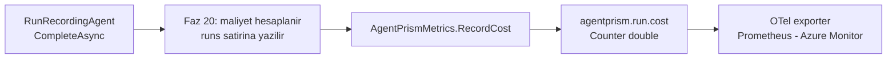

# Faz 35 — Maliyet ve Kota Metrikleri

> **Durum:** 📋 Planlandı (2026-08-06)
> **Kaynak:** [UCUNCU-FAZ-ADAYLARI.md](UCUNCU-FAZ-ADAYLARI.md) · **F-70**
> **Önkoşul:** Yok. Faz 20 (maliyet) ve Faz 21 (kota) hazır veriyi üretiyor
> **Paketler:** `AgentPrism.Core`
> **Yeni paket:** Yok · **Migration:** Yok
> **Public API:** büyüyor — iki enstrüman adı ve bir ayar

---

## Bu Faza Başlarken

> `faz-baslangic` skill'ini uygula. Aşağıdaki liste o skill'in 2. adımıdır —
> **tamamını değil, yalnız işaret edilen bölümleri oku.**

1. Bu doküman
2. Kararlar — dosyanın tamamını **okuma**, yalnız bu kalemleri grep'le:
   ```bash
   grep -n "K-055\|K-146\|K-151\|K-158" docs/KARARLAR.md
   ```
   **K-055** (span'ler `ActivityListener` ile toplanır, exporter ile değil —
   metrik tarafında da kendi toplayıcımızı yazmıyoruz), **K-146** (🚨 kardinalite
   disiplini: `experiment_id`/`variant` **hiçbir zaman** etiket olmaz; bu fazın
   ana kısıtı), **K-151** (ağaç maliyeti kendi maliyetiyle toplanmaz — iki ayrı
   alan; sayaç hangisini yazacak?), **K-158** (kota veritabanındadır — ölçer
   oradan okur).
3. [`20-MALIYET-VE-GOSTERGE-PANELI.md`](20-MALIYET-VE-GOSTERGE-PANELI.md) — yalnız devir notu:
   ```bash
   awk '/## Sonraki Faza Devir Notu/,0' docs/20-MALIYET-VE-GOSTERGE-PANELI.md
   ```
   Fiyat kataloğunu ve `runs` maliyet sütunlarını devralıyorsun. Metrik aynı
   hesabı **tekrar yapmaz**, yazılan değeri yayar.
4. Alan hafızası (bu faz bir alana dokunuyor):
   [`hafiza/cekirdek-calistirma.md`](hafiza/cekirdek-calistirma.md)
   (metrik kaydı, `RunRecording` zinciri)
5. Gerektiğinde, tamamı değil ilgili bölümü:
   [`MIMARI.md`](MIMARI.md) — gözlemlenebilirlik bölümü

---

## Amaç

`AgentPrismMetrics` beş enstrüman taşır ve **hiçbiri maliyet değildir**. Faz 20
maliyeti hesaplıyor ama yalnız `runs` tablosuna yazıyor. Grafana veya Azure
Monitor'da maliyet panosu kurmanın yolu bugün veritabanını sorgulamaktır ve bu,
tüketicinin APM'ine girmez.

- **F-70** — `agentprism.run.cost` sayacı (para birimi etiketiyle) ve
  `agentprism.quota.usage` gözlemlenen ölçeri.

Bu, dalganın **en ucuz** kalemidir: yeni tablo yok, yeni uç yok, arayüz işi yok.

### Bugün ne çalışmıyor — doğrulanmış kanıt

| Kanıt | Gözlem |
|---|---|
| [`AgentPrismMetrics.cs:45-68`](../src/AgentPrism.Core/Diagnostics/AgentPrismMetrics.cs) | Beş enstrüman: `Runs` (45), `RunDuration` (50), `Tokens` (55), `ToolInvocations` (60), `ToolDuration` (65) |
| `grep -rni "cost" src/AgentPrism.Core/Diagnostics/` | **Hiç sonuç yok.** Maliyet metrik yüzeyinde yoktur |
| [`AgentPrismDiagnostics.cs:40-52`](../src/AgentPrism.Core/Diagnostics/AgentPrismDiagnostics.cs) | Beş enstrüman adı sabit olarak tanımlı; yeni adlar aynı yere girer |
| [`AgentPrismMetrics.cs:109-114`](../src/AgentPrism.Core/Diagnostics/AgentPrismMetrics.cs) | `agentprism.runs` sayacı bugün `agent.name`, `run.status` **ve `tenant.id`** etiketlerini taşır |

> Kanıtlar 2026-08-06 tarihinde doğrulandı.

> 🚨 **Aday listesinin risk notu yanlıştı — düzeltildi.** Liste "kiracı etiketi
> ayarla açılmalıdır, varsayılan kapalı" diyordu. Ölçüm bunu yanlışlıyor:
> `tenant.id` **bugün zaten** `agentprism.runs` sayacında koşulsuz bir
> etikettir ([`AgentPrismMetrics.cs:113`](../src/AgentPrism.Core/Diagnostics/AgentPrismMetrics.cs)).
> Yeni maliyet sayacında kiracıyı varsayılan **kapalı** yapmak, iki sayacı
> birbirine göre tutarsız hâle getirirdi: `agentprism.runs` kiracı kırılımı
> verirken `agentprism.run.cost` vermezdi ve panoda ikisi çakışmazdı.
> Bu fazın kararı aşağıdadır ve gerekçesi bu ölçümdür.

---

## 35.1 — Kardinalite kuralı

K-146 bu deponun kardinalite disiplinini kurdu: `experiment_id` ve `variant`
**hiçbir zaman** etiket olmadı, çünkü ikisi de sınırsız büyür.

Yeni enstrümanlar aynı kuralı izler ve **mevcut etiket kümesinin dışına
çıkmaz**:

| Enstrüman | Etiketler | Neden bu kadar |
|---|---|---|
| `agentprism.run.cost` | `agent.name`, `model.id`, `tenant.id`, `currency` | `agentprism.runs` ile **aynı** küme + para birimi. Pano ikisini yan yana koyabilir |
| `agentprism.quota.usage` | `tenant.id`, `quota.scope`, `quota.period` | Kota kaydının kendi boyutları; hepsi sınırlıdır |

**`run.id` etiket olmaz.** Her çalıştırma yeni bir seri açardı — bu, metrik
sisteminde en pahalı hatadır.

**`currency` neden etiket:** Faz 20 fiyatı yapılandırmadan okur ve para birimi
kurulum başına sabittir; kardinalitesi birdir. Para birimini etiketlemeden
toplamak, iki para birimli bir kurulumda anlamsız bir sayı üretir.

### Kiracı etiketi kararı

Kiracı etiketi **açık gelir**, çünkü `agentprism.runs` bugün zaten öyle
davranıyor. Tutarlılık, kardinalite endişesinden önce gelir: iki sayacın farklı
etiket kümesi taşıması panoyu kullanılamaz yapar.

Kiracı sayısı yüksek bir kurulum için kardinalite gerçek bir sorundur — ama bu
sorun **bugün de vardır** ve çözümü tek bir enstrümanı değil, `agentprism.*`
ailesinin tamamını kapsayan bir ayardır. Bu, ayrı bir iştir ve bu fazın
kapsamı **dışındadır**. Bu faz mevcut davranışı sürdürür; sapmaz.

## 35.2 — Maliyet sayacı nereden beslenir



Metrik **hesap yapmaz**. Faz 20'nin zaten hesapladığı ve `runs` satırına
yazdığı değeri yayar. İkinci bir hesap, iki farklı sayı üretme riski taşır.

### 🚨 K-151 — hangi maliyet yayılır

K-151 ağaç maliyetini kendi maliyetiyle **toplamıyor**; `runs` satırında iki
ayrı alan var. Sayaç **yalnız çalıştırmanın kendi maliyetini** yayar.

Ağaç maliyetini de yaymak çift sayım demektir: kök ve her alt çalıştırma
sayaca yazar, alt maliyetler ikinci kez kökün ağaç toplamında görünür. Pano
gerçek harcamanın iki katını gösterir.

## 35.3 — Kota ölçeri

Kota `quotas` tablosundadır (Faz 21, K-158). Ölçer `ObservableGauge`'dur:
değer, toplayıcı **her yokladığında** okunur.

> 🚨 **Gerçek risk:** naif bir uygulama her yoklamada veritabanına sorgu atar.
> Prometheus 15 saniyede bir yokluyorsa bu, dakikada dört veritabanı taramasıdır
> ve kiracı sayısıyla çarpılır.

Bu yüzden ölçer **kısa ömürlü bir önbellekten** okur ve önbellek arka planda
tazelenir. Tazeleme aralığı ayarlanabilir olmalıdır.

Kota ölçeri **varsayılan kapalıdır** (K1). Maliyet sayacı ise açıktır: mevcut
`Tokens` sayacı gibi davranır ve ek bir kaynak tüketmez.

---

## Planlanan Public API

> Taslak imzalardır. Gerçekleşen imzalar kapanışta ayrı bir bölüme yazılır.

```csharp
// AgentPrism.Core/Diagnostics/AgentPrismDiagnostics.cs
public static partial class AgentPrismDiagnostics
{
    /// <summary>Calistirma basina para cinsinden maliyet sayaci.</summary>
    public const string RunCostCounterName = "agentprism.run.cost";

    /// <summary>Kota kullanim orani gozlemlenen olceri.</summary>
    public const string QuotaUsageGaugeName = "agentprism.quota.usage";

    public static partial class Tags
    {
        public const string Currency = "agentprism.cost.currency";
        public const string QuotaScope = "agentprism.quota.scope";
        public const string QuotaPeriod = "agentprism.quota.period";
    }
}
```

```csharp
// AgentPrism.Core/Diagnostics/AgentPrismMetrics.cs
public sealed partial class AgentPrismMetrics
{
    public Counter<double> RunCost { get; }

    /// <summary>Faz 20'nin hesapladigi maliyeti yayar. Agac toplamini YAYMAZ (K-151).</summary>
    public void RecordCost(string agentName, string? modelId, string tenantId, decimal cost, string currency);
}
```

```csharp
// AgentPrism.Core/Observability
public sealed class AgentPrismObservabilityOptions
{
    // ... mevcut alanlar (IncludeAgentVersionTag vb.)

    /// <summary>Kota kullanim olceri. VARSAYILAN KAPALI — veritabani okur.</summary>
    public bool EnableQuotaUsageGauge { get; set; }

    /// <summary>Kota olcerinin onbellek tazeleme araligi.</summary>
    public TimeSpan QuotaUsageRefreshInterval { get; set; } = TimeSpan.FromSeconds(30);
}
```

### HTTP `endpoint`'leri

Yok. Bu faz hiçbir uç eklemez.

### Arayüz payı

**Yok.** Arayüze dokunulmaz; sözlük anahtarı eklenmez.

---

## Planlanan Dosya Listesi

```
src/AgentPrism.Core/Diagnostics/
├── AgentPrismDiagnostics.cs      (iki enstruman adi + uc etiket eklenir)
├── AgentPrismMetrics.cs          (RunCost + RecordCost eklenir)
└── QuotaUsageObserver.cs         (YENI — onbellekli olcer kaynagi)

src/AgentPrism.Core/Recording/
└── RunRecordingAgent.cs          (CompleteAsync icinde RecordCost cagrisi)

src/AgentPrism.Core/Observability/
└── AgentPrismObservabilityOptions.cs   (iki ayar eklenir)
```

---

## Testler

| Test sınıfı | Neyi doğrular |
|---|---|
| `RunCostMetricTests` | `MeterListener` ile: maliyet yazılan her çalıştırma için tam bir ölçüm gelir |
| `RunCostTagTests` | Etiket kümesi `agentprism.runs` ile **aynıdır** + `currency`; `run.id` **yoktur** |
| `RunCostTreeTests` | 🚨 Kök + iki alt çalıştırmada sayaç toplamı üç **kendi** maliyetin toplamıdır; ağaç toplamı çift sayılmaz (K-151) |
| `QuotaUsageGaugeTests` | Varsayılan **kapalı**; açıldığında değer kota kaydıyla eşleşir |
| `QuotaUsageCacheTests` | 🚨 Ardışık on yoklama **bir** veritabanı sorgusu üretir |
| `MetricCardinalityTests` | Hiçbir yeni etiket sınırsız bir alan taşımaz (`run.id`, `experiment_id`, `variant` yok) |

> 🚨 **`MEMORY.md` dersi burada geçerlidir:** "imza değiştirmek ile gövdeyi
> kullanmak iki ayrı adımdır". Faz 20'de `RunEventWriter.CompleteAsync`'e
> `cost` parametresi eklenmiş ama nesne başlatıcıya yazılmamıştı ve 1068 test
> yakalamamıştı. Bu fazda `RecordCost` çağrısının **gerçekten yapıldığı**
> `MeterListener` ile doğrulanır; imzanın varlığı yeterli değildir.

---

## Açık Sorular

> Planı bloklamayan, faz uygulanırken karara bağlanacak sorular. Bloklayan
> sorular plan yazılmadan **önce** sorulur.

| # | Soru | Seçenekler | Öneri |
|---|---|---|---|
| 1 | Enstrüman adı `agentprism.run.cost` mü, OTel GenAI kuralına mı uyulur? | A: `agentprism.*` · B: `gen_ai.*` | **A.** OpenTelemetry GenAI semantik kuralları token'ı tanımlar, **maliyeti henüz tanımlamaz**. Kural yokken `gen_ai.*` ad alanına yazmak, kural geldiğinde çakışır. Bu **doğrulanmalıdır** — uygulama anında güncel kural sürümü kontrol edilir |
| 2 | Sayaç `double` mü `decimal` mi? | A: `Counter<double>` · B: özel toplama | **A.** `System.Diagnostics.Metrics` `decimal` desteklemez. `decimal` maliyet `double`'a çevrilir; kayıp kuruşun altındadır ve `runs` tablosu kesin değeri zaten tutar |
| 3 | Kota ölçeri oran mı mutlak sayı mı? | A: ikisi de (`usage` + `limit`) · B: yalnız oran | **A.** Yalnız oran, limitin değiştiğini gizler. İki ölçer aynı etiket kümesini paylaşır |
| 4 | İptal edilen ve başarısız çalıştırmalar maliyet yayar mı? | A: evet, harcanan token kadar · B: hayır | **A.** Para harcanmıştır; saklamak faturayı gizler. `run.status` zaten etiket değildir — bu, Açık Soru olarak uygulama anında yeniden bakılmalıdır |

---

## Bitiş Ölçütleri (DoD)

- [ ] Bir çalıştırma sonrası `agentprism.run.cost` ölçümü `MeterListener` ile
      görülür ve değeri `runs` satırındaki maliyetle **eşittir**
- [ ] Etiket kümesi `agent.name`, `model.id`, `tenant.id`, `currency`'dir;
      `run.id` **yoktur**
- [ ] Kök + iki alt çalıştırmada sayaç toplamı ağaç maliyetini **çift saymaz**
- [ ] `EnableQuotaUsageGauge` varsayılan `false`; açılmadan hiçbir kota sorgusu
      çalışmaz
- [ ] Ölçer açıkken ardışık on yoklama **bir** veritabanı sorgusu üretir
- [ ] Prometheus exporter ile `agentprism_run_cost_total` metriği görünür
- [ ] Dört doğrulama kapısı sıfır uyarı verir
- [ ] `samples/AgentPrism.Api` ile gerçek `run` yapıldı, metrik çıktısı bu
      belgeye yazıldı
- [ ] `secret` taraması boş döndü

### Doğrulama komutları

```bash
# Ornek uygulamayi OTel konsol exporter ile calistir, bir run yap
curl -s -X POST http://localhost:5081/agentprism/api/agents/echo/run \
  -H 'content-type: application/json' \
  -d '{"messages":[{"role":"user","content":"merhaba"}]}' > /dev/null

# Konsol ciktisinda maliyet olcumu gorunmeli:
#   agentprism.run.cost  Value: 0.000123
#   Tags: agentprism.agent.name=echo, agentprism.model.id=..., agentprism.cost.currency=USD

# Prometheus exporter kuruluysa
curl -s http://localhost:9464/metrics | grep agentprism_run_cost

# 🚨 run.id etiket OLMAMALI — cikti bos donmelidir
curl -s http://localhost:9464/metrics | grep agentprism_run_cost | grep 'run_id' \
  && echo "KARDINALITE HATASI" || echo "temiz"
```

---

## Riskler

| Risk | Önlem |
|------|-------|
| 🚨 Kardinalite patlaması | Etiket kümesi mevcut sayaçla aynıdır; `run.id` yasaktır ve DoD'de açık denetimi vardır |
| 🚨 Ağaç maliyeti çift sayılır | Yalnız kendi maliyeti yayılır (K-151); testte kök + iki alt senaryosu var |
| Kota ölçeri her yoklamada veritabanına gider | Önbellekli okuma + varsayılan kapalı; sorgu sayısı testi DoD'dedir |
| `RecordCost` çağrısı unutulur, imza eklenir gövde kullanılmaz | `MeterListener` testi gerçek ölçümü doğrular — `MEMORY.md`'nin Faz 20 dersi |
| Enstrüman adı ileride OTel kuralıyla çakışır | Ad `agentprism.*` ad alanındadır; kural geldiğinde ikinci bir ad eklenir, mevcut ad kırılmaz |

---

<!-- ============================================================
     AŞAĞISI KAPANIŞTA DOLDURULUR — `faz-tamamlama` skill'i.
     Plan anında boş kalır. Başlıkları SİLME.
     ============================================================ -->

## Plandan Sapmalar

> Kapanışta doldurulur. Plan ile gerçek arasındaki fark **gizlenmez** — sonraki
> oturumun en değerli bilgisidir.

## Bu Fazda Verilen Kararlar

> Kapanışta doldurulur. K-NNN numaraları burada alınır; plan numara rezerve etmez.

## Gerçekleşen Public API

> Kapanışta doldurulur. Koddaki **gerçek** imzalar.

## Dosya Listesi (gerçekleşen)

> Kapanışta doldurulur.

## Sonraki Faza Devir Notu

> Kapanışta doldurulur: devralınan sözleşmeler, bilinen tuzaklar (🚨), yarım
> kalan işler, sıradaki faz.
