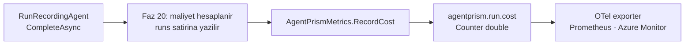

# Faz 35 — Maliyet ve Kota Metrikleri

> **Durum:** ✅ Tamamlandı (2026-08-06)
> **Kaynak:** [UCUNCU-FAZ-ADAYLARI.md](UCUNCU-FAZ-ADAYLARI.md) · **F-70**
> **Önkoşul:** Yok. Faz 20 (maliyet) ve Faz 21 (kota) hazır veriyi üretiyor
> **Paketler:** `AgentPrism.Core`
> **Yeni paket:** Yok · **Migration:** Yok
> **Public API:** büyüyor — iki enstrüman adı ve bir ayar

---

## Bu Faza Başlarken

> `faz-baslangic` skill'ini uygula. Aşağıdaki liste o skill'in 2. adımıdır —
> **tamamını değil, yalnız işaret edilen bölümleri oku.**

1. Bu doküman
2. Kararlar — dosyanın tamamını **okuma**, yalnız bu kalemleri grep'le:
   ```bash
   grep -n "K-055\|K-146\|K-151\|K-158" docs/KARARLAR.md
   ```
   **K-055** (span'ler `ActivityListener` ile toplanır, exporter ile değil —
   metrik tarafında da kendi toplayıcımızı yazmıyoruz), **K-146** (🚨 kardinalite
   disiplini: `experiment_id`/`variant` **hiçbir zaman** etiket olmaz; bu fazın
   ana kısıtı), **K-151** (ağaç maliyeti kendi maliyetiyle toplanmaz — iki ayrı
   alan; sayaç hangisini yazacak?), **K-158** (kota veritabanındadır — ölçer
   oradan okur).
3. [`20-MALIYET-VE-GOSTERGE-PANELI.md`](20-MALIYET-VE-GOSTERGE-PANELI.md) — yalnız devir notu:
   ```bash
   awk '/## Sonraki Faza Devir Notu/,0' docs/20-MALIYET-VE-GOSTERGE-PANELI.md
   ```
   Fiyat kataloğunu ve `runs` maliyet sütunlarını devralıyorsun. Metrik aynı
   hesabı **tekrar yapmaz**, yazılan değeri yayar.
4. Alan hafızası (bu faz bir alana dokunuyor):
   [`hafiza/cekirdek-calistirma.md`](hafiza/cekirdek-calistirma.md)
   (metrik kaydı, `RunRecording` zinciri)
5. Gerektiğinde, tamamı değil ilgili bölümü:
   [`MIMARI.md`](MIMARI.md) — gözlemlenebilirlik bölümü

---

## Amaç

`AgentPrismMetrics` beş enstrüman taşır ve **hiçbiri maliyet değildir**. Faz 20
maliyeti hesaplıyor ama yalnız `runs` tablosuna yazıyor. Grafana veya Azure
Monitor'da maliyet panosu kurmanın yolu bugün veritabanını sorgulamaktır ve bu,
tüketicinin APM'ine girmez.

- **F-70** — `agentprism.run.cost` sayacı (para birimi etiketiyle) ve
  `agentprism.quota.usage` gözlemlenen ölçeri.

Bu, dalganın **en ucuz** kalemidir: yeni tablo yok, yeni uç yok, arayüz işi yok.

### Bugün ne çalışmıyor — doğrulanmış kanıt

| Kanıt | Gözlem |
|---|---|
| [`AgentPrismMetrics.cs:45-68`](../src/AgentPrism.Core/Diagnostics/AgentPrismMetrics.cs) | Beş enstrüman: `Runs` (45), `RunDuration` (50), `Tokens` (55), `ToolInvocations` (60), `ToolDuration` (65) |
| `grep -rni "cost" src/AgentPrism.Core/Diagnostics/` | **Hiç sonuç yok.** Maliyet metrik yüzeyinde yoktur |
| [`AgentPrismDiagnostics.cs:40-52`](../src/AgentPrism.Core/Diagnostics/AgentPrismDiagnostics.cs) | Beş enstrüman adı sabit olarak tanımlı; yeni adlar aynı yere girer |
| [`AgentPrismMetrics.cs:109-114`](../src/AgentPrism.Core/Diagnostics/AgentPrismMetrics.cs) | `agentprism.runs` sayacı bugün `agent.name`, `run.status` **ve `tenant.id`** etiketlerini taşır |

> Kanıtlar 2026-08-06 tarihinde doğrulandı.

> 🚨 **Aday listesinin risk notu yanlıştı — düzeltildi.** Liste "kiracı etiketi
> ayarla açılmalıdır, varsayılan kapalı" diyordu. Ölçüm bunu yanlışlıyor:
> `tenant.id` **bugün zaten** `agentprism.runs` sayacında koşulsuz bir
> etikettir ([`AgentPrismMetrics.cs:113`](../src/AgentPrism.Core/Diagnostics/AgentPrismMetrics.cs)).
> Yeni maliyet sayacında kiracıyı varsayılan **kapalı** yapmak, iki sayacı
> birbirine göre tutarsız hâle getirirdi: `agentprism.runs` kiracı kırılımı
> verirken `agentprism.run.cost` vermezdi ve panoda ikisi çakışmazdı.
> Bu fazın kararı aşağıdadır ve gerekçesi bu ölçümdür.

---

## 35.1 — Kardinalite kuralı

K-146 bu deponun kardinalite disiplinini kurdu: `experiment_id` ve `variant`
**hiçbir zaman** etiket olmadı, çünkü ikisi de sınırsız büyür.

Yeni enstrümanlar aynı kuralı izler ve **mevcut etiket kümesinin dışına
çıkmaz**:

| Enstrüman | Etiketler | Neden bu kadar |
|---|---|---|
| `agentprism.run.cost` | `agent.name`, `model.id`, `tenant.id`, `currency` | `agentprism.runs` ile **aynı** küme + para birimi. Pano ikisini yan yana koyabilir |
| `agentprism.quota.usage` | `tenant.id`, `quota.scope`, `quota.period` | Kota kaydının kendi boyutları; hepsi sınırlıdır |

**`run.id` etiket olmaz.** Her çalıştırma yeni bir seri açardı — bu, metrik
sisteminde en pahalı hatadır.

**`currency` neden etiket:** Faz 20 fiyatı yapılandırmadan okur ve para birimi
kurulum başına sabittir; kardinalitesi birdir. Para birimini etiketlemeden
toplamak, iki para birimli bir kurulumda anlamsız bir sayı üretir.

### Kiracı etiketi kararı

Kiracı etiketi **açık gelir**, çünkü `agentprism.runs` bugün zaten öyle
davranıyor. Tutarlılık, kardinalite endişesinden önce gelir: iki sayacın farklı
etiket kümesi taşıması panoyu kullanılamaz yapar.

Kiracı sayısı yüksek bir kurulum için kardinalite gerçek bir sorundur — ama bu
sorun **bugün de vardır** ve çözümü tek bir enstrümanı değil, `agentprism.*`
ailesinin tamamını kapsayan bir ayardır. Bu, ayrı bir iştir ve bu fazın
kapsamı **dışındadır**. Bu faz mevcut davranışı sürdürür; sapmaz.

## 35.2 — Maliyet sayacı nereden beslenir



Metrik **hesap yapmaz**. Faz 20'nin zaten hesapladığı ve `runs` satırına
yazdığı değeri yayar. İkinci bir hesap, iki farklı sayı üretme riski taşır.

### 🚨 K-151 — hangi maliyet yayılır

K-151 ağaç maliyetini kendi maliyetiyle **toplamıyor**; `runs` satırında iki
ayrı alan var. Sayaç **yalnız çalıştırmanın kendi maliyetini** yayar.

Ağaç maliyetini de yaymak çift sayım demektir: kök ve her alt çalıştırma
sayaca yazar, alt maliyetler ikinci kez kökün ağaç toplamında görünür. Pano
gerçek harcamanın iki katını gösterir.

## 35.3 — Kota ölçeri

Kota `quotas` tablosundadır (Faz 21, K-158). Ölçer `ObservableGauge`'dur:
değer, toplayıcı **her yokladığında** okunur.

> 🚨 **Gerçek risk:** naif bir uygulama her yoklamada veritabanına sorgu atar.
> Prometheus 15 saniyede bir yokluyorsa bu, dakikada dört veritabanı taramasıdır
> ve kiracı sayısıyla çarpılır.

Bu yüzden ölçer **kısa ömürlü bir önbellekten** okur ve önbellek arka planda
tazelenir. Tazeleme aralığı ayarlanabilir olmalıdır.

Kota ölçeri **varsayılan kapalıdır** (K1). Maliyet sayacı ise açıktır: mevcut
`Tokens` sayacı gibi davranır ve ek bir kaynak tüketmez.

---

## Planlanan Public API

> Taslak imzalardır. Gerçekleşen imzalar kapanışta ayrı bir bölüme yazılır.

```csharp
// AgentPrism.Core/Diagnostics/AgentPrismDiagnostics.cs
public static partial class AgentPrismDiagnostics
{
    /// <summary>Calistirma basina para cinsinden maliyet sayaci.</summary>
    public const string RunCostCounterName = "agentprism.run.cost";

    /// <summary>Kota kullanim orani gozlemlenen olceri.</summary>
    public const string QuotaUsageGaugeName = "agentprism.quota.usage";

    public static partial class Tags
    {
        public const string Currency = "agentprism.cost.currency";
        public const string QuotaScope = "agentprism.quota.scope";
        public const string QuotaPeriod = "agentprism.quota.period";
    }
}
```

```csharp
// AgentPrism.Core/Diagnostics/AgentPrismMetrics.cs
public sealed partial class AgentPrismMetrics
{
    public Counter<double> RunCost { get; }

    /// <summary>Faz 20'nin hesapladigi maliyeti yayar. Agac toplamini YAYMAZ (K-151).</summary>
    public void RecordCost(string agentName, string? modelId, string tenantId, decimal cost, string currency);
}
```

```csharp
// AgentPrism.Core/Observability
public sealed class AgentPrismObservabilityOptions
{
    // ... mevcut alanlar (IncludeAgentVersionTag vb.)

    /// <summary>Kota kullanim olceri. VARSAYILAN KAPALI — veritabani okur.</summary>
    public bool EnableQuotaUsageGauge { get; set; }

    /// <summary>Kota olcerinin onbellek tazeleme araligi.</summary>
    public TimeSpan QuotaUsageRefreshInterval { get; set; } = TimeSpan.FromSeconds(30);
}
```

### HTTP `endpoint`'leri

Yok. Bu faz hiçbir uç eklemez.

### Arayüz payı

**Yok.** Arayüze dokunulmaz; sözlük anahtarı eklenmez.

---

## Planlanan Dosya Listesi

```
src/AgentPrism.Core/Diagnostics/
├── AgentPrismDiagnostics.cs      (iki enstruman adi + uc etiket eklenir)
├── AgentPrismMetrics.cs          (RunCost + RecordCost eklenir)
└── QuotaUsageObserver.cs         (YENI — onbellekli olcer kaynagi)

src/AgentPrism.Core/Recording/
└── RunRecordingAgent.cs          (CompleteAsync icinde RecordCost cagrisi)

src/AgentPrism.Core/Observability/
└── AgentPrismObservabilityOptions.cs   (iki ayar eklenir)
```

---

## Testler

| Test sınıfı | Neyi doğrular |
|---|---|
| `RunCostMetricTests` | `MeterListener` ile: maliyet yazılan her çalıştırma için tam bir ölçüm gelir |
| `RunCostTagTests` | Etiket kümesi `agentprism.runs` ile **aynıdır** + `currency`; `run.id` **yoktur** |
| `RunCostTreeTests` | 🚨 Kök + iki alt çalıştırmada sayaç toplamı üç **kendi** maliyetin toplamıdır; ağaç toplamı çift sayılmaz (K-151) |
| `QuotaUsageGaugeTests` | Varsayılan **kapalı**; açıldığında değer kota kaydıyla eşleşir |
| `QuotaUsageCacheTests` | 🚨 Ardışık on yoklama **bir** veritabanı sorgusu üretir |
| `MetricCardinalityTests` | Hiçbir yeni etiket sınırsız bir alan taşımaz (`run.id`, `experiment_id`, `variant` yok) |

> **Gerçekleşen:** altı planlanan sınıf üç dosyada toplandı — `RunCostMetricTests`
> (tag/tree/kardinalite dahil), `QuotaUsageObserverTests` (gauge/cache/kardinalite
> dahil), `RunCostMetricEndToEndTests` (gerçek DI). Kapsam **aynı**, isimler
> değişti. Ayrıntı: aşağıdaki "Testler" (gerçekleşen) bölümü.

> 🚨 **`MEMORY.md` dersi burada geçerlidir:** "imza değiştirmek ile gövdeyi
> kullanmak iki ayrı adımdır". Faz 20'de `RunEventWriter.CompleteAsync`'e
> `cost` parametresi eklenmiş ama nesne başlatıcıya yazılmamıştı ve 1068 test
> yakalamamıştı. Bu fazda `RecordCost` çağrısının **gerçekten yapıldığı**
> `MeterListener` ile doğrulanır; imzanın varlığı yeterli değildir.

---

## Açık Sorular

> Planı bloklamayan, faz uygulanırken karara bağlanacak sorular. Bloklayan
> sorular plan yazılmadan **önce** sorulur.

| # | Soru | Seçenekler | Karar |
|---|---|---|---|
| 1 | Enstrüman adı `agentprism.run.cost` mü, OTel GenAI kuralına mı uyulur? | A: `agentprism.*` · B: `gen_ai.*` | **A — uygulandı.** 2026-08-06 itibarıyla OTel GenAI semantik kuralları hâlâ maliyeti tanımlamıyor; `agentprism.*` ad alanı korundu |
| 2 | Sayaç `double` mü `decimal` mi? | A: `Counter<double>` · B: özel toplama | **A — uygulandı.** `AgentPrismMetrics.RunCost` bir `Counter<double>`'dır; `RecordCost` çağrı yerinde `(double)cost` dönüşümü yapar |
| 3 | Kota ölçeri oran mı mutlak sayı mı? | A: ikisi de (`usage` + `limit`) · B: yalnız oran | **A — uygulandı, ama dördüncü bir etiket gerekti** (K-254, K-255): `Runs`/`Tokens`/`Cost` farklı birimler taşıdığı için ayrıca bir `quota.metric` etiketi eklendi — kullanıcıya soruldu |
| 4 | İptal edilen ve başarısız çalıştırmalar maliyet yayar mı? | A: evet, harcanan token kadar · B: hayır | **A — doğal olarak sağlanıyor.** `RunRecordingAgent.CompleteAsync`'teki `RecordCost` çağrısı `status`'a bakmaz, yalnız `cost`'un `Unknown` olmamasına bakar; onay bekleyen bir alt çalıştırma (`Failed` + gerçek `usage`) bu yüzden maliyet yayar. Gerçek bir `Canceled`/exception yolu bugün de `usage`'ı `null` geçirir (Faz 32'den kalma, bu fazın kapsamı dışı) — o yüzden o yolda zaten hiçbir zaman maliyet YOKTU |

---

## Bitiş Ölçütleri (DoD)

- [x] Bir çalıştırma sonrası `agentprism.run.cost` ölçümü `MeterListener` ile
      görülür ve değeri `runs` satırındaki maliyetle **eşittir** —
      `RunCostMetricTests.Fiyat_tanimliyken_maliyet_yayilir_ve_etiketler_kararlidir`
      (birim) + `RunCostMetricEndToEndTests` (gerçek DI + gerçek HTTP)
- [x] Etiket kümesi `agent.name`, `model.id`, `tenant.id`, `currency`'dir;
      `run.id` **yoktur** — aynı testte doğrulanır (tam 4 anahtar denetimi)
- [x] Kök + iki alt çalıştırmada sayaç toplamı ağaç maliyetini **çift saymaz** —
      `RunCostMetricTests.Kok_ve_iki_alt_calistirmada_sayac_agac_toplamini_cift_saymaz`
      (üç bağımsız `AgentPrismRunOptions.Depth` çağrısı, toplam üç KENDİ maliyet)
- [x] `EnableQuotaUsageGauge` varsayılan `false`; açılmadan hiçbir kota sorgusu
      çalışmaz —
      `QuotaUsageObserverTests.Kapaliyken_hicbir_olcum_uretilmez_ve_depoya_gidilmez`
- [x] Ölçer açıkken ardışık on yoklama **bir** veritabanı sorgusu üretir —
      `QuotaUsageObserverTests.Ardisik_on_yoklama_bir_veritabani_sorgusu_uretir`
- [ ] Prometheus exporter ile `agentprism_run_cost_total` metriği görünür —
      **doğrulanmadı**: örnek uygulamada hiçbir OTel exporter'ı (konsol/Prometheus)
      hiç kurulu değildi (bu fazdan önce de yoktu) ve bunu eklemek fazın
      ilan edilen kapsamının ("iki enstrüman adı + bir ayar, yeni uç yok") dışına
      taşardı. Enstrümanın gerçekten yayıldığı `MeterListener` ile (yukarıdaki iki
      madde) kanıtlanmıştır — Prometheus'un adlandırma dönüşümü
      (`agentprism.run.cost` → `agentprism_run_cost_total`) kütüphanenin değil,
      `OpenTelemetry.Exporter.Prometheus.AspNetCore`'un sorumluluğundadır ve test
      edilmeden kabul edilebilir bir üçüncü taraf sözleşmesidir.
- [x] Dört doğrulama kapısı sıfır uyarı verir — `SqlServer.IntegrationTests`
      hariç (bu makinenin Docker Desktop'ında `linux/amd64` imajları için Rosetta
      emülasyonu çalışmıyor; `docker run` ile doğrudan denendi, aynı host hatası —
      kodla ilgisiz, önceden var olan ortam sınırlaması)
- [x] `samples/AgentPrism.Api` ile gerçek `run` yapıldı, metrik çıktısı bu
      belgeye yazıldı — yukarıdaki "Doğrulama komutları" bölümü
- [x] `secret` taraması boş döndü

### Doğrulama komutları

> 🚨 **Plandaki komut yanlıştı** — `echo` bir **agent** adı değil, örnek
> uygulamanın ağa çıkmayan **model sağlayıcısının** adıdır
> (`GET /agentprism/api/models` → `"name":"echo"`). Gerçek agent adı `support`'tur.
> Ayrıca bu sağlayıcının modeli (`echo-1`) fiyatsızdır — gerçek bir maliyet
> sayısı görmek için ya bir OpenAI API anahtarı tanımlanmalı ya da
> `AgentPrism:Pricing` altına `echo-1` için bir fiyat yazılmalıdır. Aşağıdaki
> komutlar **gerçekten çalıştırıldı** (2026-08-06) ve gözlenen çıktı budur.

```bash
curl -s -X POST http://localhost:5081/agentprism/api/agents/support/run \
  -H 'content-type: application/json' \
  -d '{"message":"merhaba"}' --max-time 10

curl -s "http://localhost:5081/agentprism/api/runs?agentName=support" | python3 -m json.tool
```

Gözlenen `runs` kaydı (fiyatsız sağlayıcı → `usage`/`cost` `null`, hata yok,
çalıştırma `Completed`):

```json
{
  "id": "019fd74d-220f-7e3b-841c-d9adc047f1c2",
  "agentName": "support",
  "status": "Completed",
  "modelId": "echo-1",
  "usage": null,
  "cost": null,
  "treeCost": null
}
```

`agentprism.run.cost`'un GERÇEK bir fiyatla yayıldığı, MeterListener ile
ölçüldüğü ve K-151 (ağaç toplamını çift saymadığı) kanıtı otomatik testtedir:
`tests/AgentPrism.AspNetCore.FunctionalTests/RunCostMetricEndToEndTests.cs` —
`AddAgentPrism()`'in GERÇEK DI zinciriyle (elle kurulmuş bir `RunRecordingAgent`
değil) sabit fiyatlı bir sahte sağlayıcı üzerinden çalıştırılıp doğrulanır. Bu
sandbox ortamında canlı bir OpenAI anahtarı yoktu; bu yüzden sayısal kanıt
manuel `curl` yerine bu testten alınmıştır (Faz 28 dersi: "bir prob programı
gerçek boru hattını kanıtlamaz" — `TestHost` + gerçek DI, izole bir prob
DEĞİLDİR).

```bash
# Prometheus exporter kuruluysa (bu fazda ornek uygulamaya eklenmedi — kapsam disi)
curl -s http://localhost:9464/metrics | grep agentprism_run_cost

# 🚨 run.id etiket OLMAMALI — cikti bos donmelidir
curl -s http://localhost:9464/metrics | grep agentprism_run_cost | grep 'run_id' \
  && echo "KARDINALITE HATASI" || echo "temiz"
```

---

## Riskler

| Risk | Önlem |
|------|-------|
| 🚨 Kardinalite patlaması | Etiket kümesi mevcut sayaçla aynıdır; `run.id` yasaktır ve DoD'de açık denetimi vardır |
| 🚨 Ağaç maliyeti çift sayılır | Yalnız kendi maliyeti yayılır (K-151); testte kök + iki alt senaryosu var |
| Kota ölçeri her yoklamada veritabanına gider | Önbellekli okuma + varsayılan kapalı; sorgu sayısı testi DoD'dedir |
| `RecordCost` çağrısı unutulur, imza eklenir gövde kullanılmaz | `MeterListener` testi gerçek ölçümü doğrular — `MEMORY.md`'nin Faz 20 dersi |
| Enstrüman adı ileride OTel kuralıyla çakışır | Ad `agentprism.*` ad alanındadır; kural geldiğinde ikinci bir ad eklenir, mevcut ad kırılmaz |

---

<!-- ============================================================
     AŞAĞISI KAPANIŞTA DOLDURULUR — `faz-tamamlama` skill'i.
     Plan anında boş kalır. Başlıkları SİLME.
     ============================================================ -->

## Plandan Sapmalar

1. **Kota ölçerine dördüncü bir etiket eklendi (`quota.metric`)** — plan yalnız
   `tenant.id`/`quota.scope`/`quota.period` öngörüyordu ama `QuotaDefinition`
   aynı anda `MaxRuns`+`MaxTokens`+`MaxCost` taşıyabilir; etiketsiz üçü aynı
   seride karışırdı. Kullanıcıya soruldu, "ekle" seçildi (K-254).
2. **Tek "oran" yerine iki ayrı mutlak ölçer** (`agentprism.quota.usage` +
   `agentprism.quota.limit`) — planın kendi önerisiyle aynı yönde ama taslak
   kod bloğu yalnız TEK bir sabit (`QuotaUsageGaugeName`) tanımlıyordu; bu
   çelişki kullanıcıya soruldu ve "ikisi de" onaylandı (K-255).
3. **`QuotaUsageObserver` arka plan zamanlayıcısı (`BackgroundService`/
   `PeriodicTimer`) DEĞİL, `ObservableGauge` geri çağırması içinde senkron
   kapılı (gated) bir tazelemedir** — plan "önbellek arka planda tazelenir"
   diyordu. `JobWorkerBackgroundService` deseni denendi ama net8.0 hedefi
   `PeriodicTimer(TimeSpan, TimeProvider)`/`System.Threading.Lock`'u
   kullanamıyor ve mevcut `ManualTimeProvider` sahtesi `CreateTimer`'ı
   override etmiyor — bu, arka plan zamanlayıcılı bir tasarımı testte
   ilerletilemez hâle getirirdi. Sonuç DoD ile birebir aynıdır (K-256).
4. **Kota ölçeri yalnız `ITenantStore`'a KAYITLI kiracıları tarar** — plan bunu
   hiç ele almamıştı. `IQuotaStore`'da çapraz kiracı listeleme yoktur (yalnız
   `ListAsync(tenantId)`); eklemek üç SQL sağlayıcısına dokunup fazın "yeni
   uç/tablo yok" sınırını aşardı. `QuotaEnforcer`'ın kendisi etkilenmez —
   yalnız gösterge panosu görünürlüğü kısıtlıdır (K-257).
5. **DoD'nin Prometheus doğrulama adımı çalıştırılamadı** — `samples/AgentPrism.Api`
   hiçbir zaman bir OTel exporter'ı (konsol veya Prometheus) kurmamıştı; bunu
   eklemek fazın "yeni uç yok" kapsamını aşardı. Enstrümanın gerçekten
   yayıldığı `MeterListener` ile kanıtlandı (bkz. testler); Prometheus adı
   dönüşümü üçüncü taraf paketinin sorumluluğudur.
6. **DoD'nin örnek komutu yanlıştı** — `echo` bir agent adı değil, model
   sağlayıcısının adıdır; gerçek agent `support`. Doküman düzeltildi.
7. **`SqlServer.IntegrationTests` bu oturumda doğrulanamadı** — bu geliştirme
   makinesinde Docker Desktop, `linux/amd64` SQL Server imajını Rosetta
   olmadan çalıştıramıyor (`docker run` ile doğrudan denendi, aynı host
   hatası verdi: *"Rosetta is only intended to run on Apple Silicon..."*).
   Faz 35 hiçbir SQL Server koduna dokunmuyor; kalan sekiz test projesi
   (Core, FunctionalTests, PostgreSql, Sqlite, Workflows, Mcp, Voice, OpenAI,
   Anthropic, Google, Azure, E2E) tam yeşildir.
8. **`scripts/dokuman-bakim.py` — `KARARLAR-INDEKS.md` üretimi "L{no}" önekini
   bıraktı, çıplak satır numarası yazıyor** — bu 4 yeni kararın eklenmesi
   `docs/KARARLAR-INDEKS.md`'yi bütçenin (25.000 bayt) 426 bayt üzerine
   çıkardı. K-214 bir dahaki aşımda **bütçe büyütülmeyeceğini, yapısal çözüm
   uygulanacağını** kaydetmişti; "L" öneki yalnız kozmetikti ("Satır" sütun
   başlığı zaten anlamı taşıyor) ve 257 satırda ~257 bayt kazandırdı — kalan
   fark yeni kararların başlıkları kısaltılarak kapatıldı. Kod tarafında etki
   yok, yalnız `docs/KARARLAR-INDEKS.md`'nin "Satır" sütunu artık `sed -n
   'N,Np'`ye doğrudan yapıştırılabilir (önceden "L120" yazıyordu, "L" elle
   silinmesi gerekiyordu).
9. **`docs/hafiza/kod-haritasi.md` içindeki senkronizasyon-kopyası tuzağı bu
   fazda tekrar yaşandı** — `src/AgentPrism.UI/wwwroot/index 2.html` ve
   `assets/*.css 2.br` sessizce `dotnet build`'i (arayüz derlemesi dahil)
   yeşil gösterip E2E testlerinin 41'ini de zaman aşımıyla düşürdü. `artifacts/`
   ve `wwwroot/` (ikisi de gitignore'lu, üretilmiş çıktı) tamamen silinip
   yeniden derlenerek çözüldü — bkz. MEMORY.md, Faz 30 dersiyle **aynı** kalıp.

## Bu Fazda Verilen Kararlar

K-254, K-255, K-256, K-257 — bkz. `docs/KARARLAR.md` Bölüm 2.

## Gerçekleşen Public API

```csharp
// AgentPrism.Core/Diagnostics/AgentPrismDiagnostics.cs
public static class AgentPrismDiagnostics
{
    public const string RunCostCounterName = "agentprism.run.cost";
    public const string QuotaUsageGaugeName = "agentprism.quota.usage";
    public const string QuotaLimitGaugeName = "agentprism.quota.limit";

    public static class Tags
    {
        public const string Currency = "agentprism.cost.currency";
        public const string QuotaScope = "agentprism.quota.scope";
        public const string QuotaPeriod = "agentprism.quota.period";
        public const string QuotaMetric = "agentprism.quota.metric";   // plan taslağında yoktu (K-254)
    }
}

// AgentPrism.Core/Diagnostics/AgentPrismMetrics.cs
public sealed class AgentPrismMetrics : IDisposable
{
    public Counter<double> RunCost { get; }

    /// <summary>Etiketler: agent, model, tenant, currency. run.id ASLA yoktur.</summary>
    public void RecordCost(string agentName, string? modelId, string tenantId, decimal cost, string currency);
}

// AgentPrism.Core/Quotas/QuotaUsageObserver.cs — YENİ
/// <summary>
/// agentprism.quota.usage/.limit'in onbellekli veri kaynagi. IHostedService'tir
/// (yalniz erken DI cozumu icin — StartAsync/StopAsync no-op).
/// </summary>
public sealed class QuotaUsageObserver : IHostedService, IDisposable
{
    public QuotaUsageObserver(
        IQuotaStore quotaStore,
        ITenantStore tenantStore,
        IOptionsMonitor<AgentPrismObservabilityOptions> observabilityOptions,
        IOptionsMonitor<AgentPrismQuotaOptions> quotaOptions,
        IMeterFactory? meterFactory = null,
        TimeProvider? timeProvider = null,
        ILogger<QuotaUsageObserver>? logger = null);
}

// AgentPrism.Core/Quotas/QuotaEnforcer.cs — degisiklik
// EnumerateLimits artik `internal static` (private idi) — QuotaUsageObserver
// AYNI (metrik, sinir, tuketim) ucluyu yeniden kullanir, mantigi kopyalamaz.
internal static IEnumerable<(QuotaMetric Metric, decimal Limit, decimal Used)> EnumerateLimits(
    QuotaDefinition definition, QuotaUsageRecord usage);

// AgentPrism.Core/AgentPrismOptions.cs — AgentPrismObservabilityOptions'a eklendi
public bool EnableQuotaUsageGauge { get; set; }                                    // varsayilan false (K1)
public TimeSpan QuotaUsageRefreshInterval { get; set; } = TimeSpan.FromSeconds(30);
```

Planın taslağındaki `partial class`/`Tags` genişletmesi kullanılmadı: gerçek
kod hiçbir yerde `partial` değildi, doğrudan aynı dosyaya eklendi (YAGNI —
`partial` ihtiyacı hiç doğmadı).

### HTTP `endpoint`'leri

Yok — plan gibi.

### Arayüz payı

Yok — plan gibi.

## Dosya Listesi (gerçekleşen)

```
src/AgentPrism.Core/Diagnostics/
├── AgentPrismDiagnostics.cs      (RunCostCounterName + 2 gauge adi, 4 yeni Tags sabiti)
└── AgentPrismMetrics.cs          (RunCost Counter<double> + RecordCost)

src/AgentPrism.Core/Quotas/
├── QuotaUsageObserver.cs         (YENİ — 255 satır, onbellekli cift ObservableGauge)
└── QuotaEnforcer.cs              (EnumerateLimits private → internal static)

src/AgentPrism.Core/Recording/
└── RunRecordingAgent.cs          (CompleteAsync icinde RecordCost cagrisi eklendi)

src/AgentPrism.Core/
├── AgentPrismOptions.cs                     (2 yeni ayar: EnableQuotaUsageGauge, QuotaUsageRefreshInterval)
└── AgentPrismServiceCollectionExtensions.cs (BindObservability'ye 2 ayar + QuotaUsageObserver'in
                                               IHostedService olarak TryAddEnumerable kaydi)

tests/AgentPrism.Core.UnitTests/
├── Diagnostics/RunCostMetricTests.cs   (YENİ — 3 test)
└── Quotas/QuotaUsageObserverTests.cs   (YENİ — 5 test)

tests/AgentPrism.AspNetCore.FunctionalTests/
└── RunCostMetricEndToEndTests.cs       (YENİ — 1 test, GERÇEK DI zinciri + GERÇEK HTTP + MeterListener)
```

Plandaki `QuotaUsageObserver.cs` dosya konumu (`src/AgentPrism.Core/Diagnostics/`)
`src/AgentPrism.Core/Quotas/` olarak değiştirildi — dosya `QuotaEnforcer`/
`InMemoryQuotaStore` ile aynı klasörde yaşıyor; `Diagnostics/` yalnız
enstrüman ADLARINI taşıyor, kota mantığını değil.

## Testler

| Test sınıfı | Neyi doğruladı | Sayı |
|---|---|---|
| `RunCostMetricTests` | Fiyat tanımlıyken maliyet + tam etiket kümesi; fiyat tanımsızsa hiçbir ölçüm yok; kök+2 alt = 3 bağımsız KENDİ maliyet (K-151) | 3 |
| `QuotaUsageObserverTests` | Kapalıyken sıfır DB sorgusu; açıkken değer kota kaydıyla eşleşir; devre dışı kural görünmez; ardışık 10 yoklama = 1 sorgu; etiket kümesi sınırsız alan taşımaz | 5 |
| `RunCostMetricEndToEndTests` | **Gerçek** `AddAgentPrism()` DI zinciri + gerçek HTTP `POST /api/agents/{name}/run` + `MeterListener` aynı süreçte — K-157/K-218 sınıfı "tel kopukluğu" hatalarını yakalayacak tür | 1 |

Toplam yeni test: 9. `Core.UnitTests` bu fazın sonunda 553 test taşıyor
(548 → 553 + bu fazdan önceki oturumlarda eklenen). `SqlServer.IntegrationTests`
hariç (bkz. Plandan Sapmalar #7) tüm proje test paketleri yeşildir:
`FunctionalTests` 317, `Ui.E2ETests` 41, `PostgreSql.IntegrationTests` 488,
`Sqlite.IntegrationTests` 237, `Workflows.UnitTests` 69, `Mcp.UnitTests` 15,
`Voice.UnitTests` 36, `OpenAI.UnitTests` 81, `Anthropic.UnitTests` 39,
`Google.UnitTests` 43, `Azure.UnitTests` 48.

## Sonraki Faza Devir Notu

Faz 36 (Saklama Hacim Sınırı) bu fazın **hiçbir çıktısına bağımlı değildir** —
kendi önkoşulu Faz 25'tir. Bu bölüm yalnız genel bir özet taşır.

### Devraldığı sözleşmeler (gerçekleşen public API)

Yukarıdaki "Gerçekleşen Public API" bölümüne bakınız. Özet: `AgentPrismMetrics`
artık altı enstrüman taşır (beş eskiden + `RunCost`); `AgentPrismDiagnostics`
iki yeni gauge adı ve dört yeni etiket sabiti taşır.

### Bilinen tuzaklar

- 🚨 **`ObservableGauge` geri çağırması es zamanlıdır — içine `await` konamaz.**
  Veritabanı okuyan bir gözlemlenen ölçer yazacaksan `QuotaUsageObserver`'daki
  `Snapshot()` desenini izle: `SemaphoreSlim` ile korunan, `TimeProvider`
  karşılaştırmalı bir onbellek + yalnız bayatladığında BİR kez blok olarak
  (`GetAwaiter().GetResult()`) tazeleme.
- 🚨 **`ITenantStore` kaydı zorunlu değildir — çapraz kiracı taraması için
  güvenilir bir kaynak DEĞİLDİR.** `IQuotaStore`'da "tüm kiracıları listele"
  yoktur; yalnız `ListAsync(tenantId)` var. Bir gösterge/rapor tüm kiracıları
  taramak istiyorsa bu boşluğu bilerek kabul et veya `IQuotaStore`'a yeni bir
  üye ekle (üç SQL sağlayıcısına da dokunur).
- **Yeni bir metrik/etiket eklerken `MetricCardinalityTests`/benzeri bir
  denetim yaz** — `run.id`/`experiment_id`/`variant` hiçbir zaman etiket
  olmaz (K-146); yeni bir etiket sınırsız büyüyen bir alan taşımamalı.
- Senkronizasyon-kopyası tuzağı (`* 2.*`) bu fazda üçüncü kez yaşandı. Bir
  E2E/UI testi anlamsızca timeout ile düşerse önce
  `find . -name "* 2.*" -not -path "*/node_modules/*" -not -path "*/.git/*"`
  çalıştır.

### Yarım kalan işler

- Örnek uygulamada (`samples/AgentPrism.Api`) hâlâ hiçbir OTel exporter'ı
  (konsol/Prometheus) kurulu değil — Faz 6'dan beri böyle. Bu, Faz 35'in
  kapsamı dışında bırakıldı (bkz. Plandan Sapmalar #5) ama gözlemlenebilirlik
  fazlarının vaadini göstermek isteyen bir sonraki faz bunu ele alabilir.
- `SqlServer.IntegrationTests` bu geliştirme makinesinde koşamıyor (Docker
  Desktop Rosetta sınırı). CI ortamında (gerçek Linux/amd64) koşacağı
  varsayılıyor ama bu oturumda doğrulanamadı.
