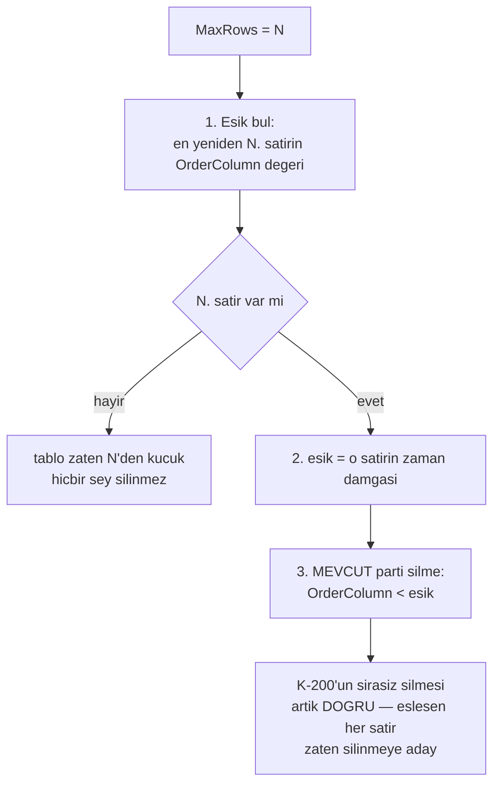

# Faz 36 — Saklama Hacim Sınırı (`MaxRows`)

> **Durum:** ✅ Tamamlandı (2026-08-06)
> **Kaynak:** [ADAYLAR.md](ADAYLAR.md) · **F-73**
> **Önkoşul:** [Faz 25](25-VERI-SAKLAMA-VE-ARSIVLEME.md) — saklama altyapısı, üç diyalekt şablonu
> **Paketler:** `AgentPrism.Abstractions`, `.Core`, `.Sql.Shared`
> **Yeni paket:** Yok · **Migration:** Yok — sütun **zaten var**
> **Public API:** büyümüyor — var olan alan **çalışır hâle gelir**

---

## Bu Faza Başlarken

> `faz-baslangic` skill'ini uygula. Aşağıdaki liste o skill'in 2. adımıdır —
> **tamamını değil, yalnız işaret edilen bölümleri oku.**

1. Bu doküman
2. Kararlar — dosyanın tamamını **okuma**, yalnız bu kalemleri grep'le:
   ```bash
   grep -n "K-198\|K-199\|K-200\|K-201" docs/KARARLAR.md
   ```
   **K-198** (saklama SQL'i tek tabloyla üretilir, sağlayıcı başına
   kopyalanmaz — yeni sorgu da aynı yerden çıkar), **K-199** (partition
   açılmadı; ölçüm 100k satırda saniyede ~720k satır silme gösterdi),
   **K-200** (🚨 parti silme her sağlayıcıda **farklı teknik** kullanır ve
   üçü de **kasıtlı olarak sırasızdır** — bu fazın ana tasarım kısıtı),
   **K-201** (`MaxRows` ertelendi — bu fazın kapattığı borç).
3. [`25-VERI-SAKLAMA-VE-ARSIVLEME.md`](25-VERI-SAKLAMA-VE-ARSIVLEME.md) — **bu fazın
   ana kaynağıdır**; devir notunu ve hedef kayıt defteri bölümünü oku:
   ```bash
   awk '/## Sonraki Faza Devir Notu/,0' docs/25-VERI-SAKLAMA-VE-ARSIVLEME.md
   ```
4. Alan hafızası (bu faz iki alana dokunuyor):
   [`hafiza/sql-saglayicilari.md`](hafiza/sql-saglayicilari.md) (üç diyalekt,
   `SqlDialect` şablonları), [`hafiza/postgresql.md`](hafiza/postgresql.md)
   (`ctid`, indeks davranışı)
5. Gerektiğinde, tamamı değil ilgili bölümü:
   [`MIMARI.md`](MIMARI.md) — saklama bölümü

---

## Amaç

`MaxRows` **tanımlı, doğrulanan, saklanan ama uygulanmayan** bir ayardır.
Kullanıcı bugün onu ayarlıyor, kaydediliyor, arayüzde görünüyor — ve hiçbir şey
olmuyor. Bu, sessiz bir yanlıştır ve yayımlanmış bir sözleşmenin ihlalidir.

- **F-73** — hacim bazlı silme: en eski satırlardan başlayarak tablo satır
  sayısını sınırın altına indirmek.

### Bugün ne çalışmıyor — doğrulanmış kanıt

| Kanıt | Gözlem |
|---|---|
| [`RetentionTypes.cs:29`](../src/AgentPrism.Abstractions/Retention/RetentionTypes.cs) | `public long? MaxRows { get; init; }` — sözleşmede vardır |
| [`RetentionTypes.cs:26-28`](../src/AgentPrism.Abstractions/Retention/RetentionTypes.cs) | XML dokümanı kendisi yazıyor: *"Rezerve alan… `RetentionExecutor` tarafından henüz **UYGULANMAZ**"* |
| [`RetentionTypes.cs:19-21`](../src/AgentPrism.Abstractions/Retention/RetentionTypes.cs) | 🚨 `MaxAgeDays` dokümanı **söz veriyor**: *"`null` ise yaş bazlı silme uygulanmaz (yalnız `MaxRows` varsa **o geçerlidir**)"* — bu söz bugün **tutulmuyor** |
| [`RetentionEndpoints.cs:115`](../src/AgentPrism.AspNetCore/Endpoints/RetentionEndpoints.cs) | `if (request.MaxRows is < 1)` — uçta doğrulanıyor |
| [`SqlRetentionPolicyStore.cs:82`](../src/AgentPrism.Sql.Shared/Stores/SqlRetentionPolicyStore.cs) | `Dialect.AddInt64(command, "max_rows", policy.MaxRows)` — depoya yazılıyor |
| `grep -rn "MaxRows" src/AgentPrism.Core/` | **Hiç sonuç yok.** `RetentionExecutor` onu hiç okumuyor |

> Kanıtlar 2026-08-06 tarihinde doğrulandı.

**Yalnız `MaxRows` ayarlanmış bir politika bugün hiçbir şey yapmaz.**
`MaxAgeDays` boş olduğu için yaş bazlı silme atlanır, `MaxRows` okunmadığı için
hacim bazlı silme hiç çalışmaz. Kullanıcının kurduğu politika sessizce ölüdür.

---

## 36.1 — 🚨 K-200 ile çatışma ve çözümü

K-200 parti silmenin üç sağlayıcıda da **kasıtlı olarak sırasız** olduğunu
kaydetti: amaç bir parti eşleşen satırı silmektir, belirli bir sırada silmek
değildir.

Ama `MaxRows` **sıra ister**: "en eski satırları sil". Naif bir çözüm
`ORDER BY ... LIMIT` ile silmeye çalışır ve üç sağlayıcıda üç ayrı sorun
doğurur — PostgreSQL `DELETE ... LIMIT` tanımaz, SQLite varsayılan derlemede
desteklemez, SQL Server ayrı sözdizimi ister.

**Çözüm sırayı silme adımından çıkarır:**



Bu tasarımın üç kazancı vardır:

1. **Mevcut makine yeniden kullanılır.** Eşik bulunduktan sonra iş, Faz 25'in
   zaten çalışan yaş bazlı silmesiyle **aynıdır**. `DeleteBatchAsync` değişmez.
2. **`COUNT(*)` gerekmez.** Aday listesi "satır sayma büyük tabloda pahalıdır"
   riskini yazıyordu; bu tasarımda tablo hiç sayılmaz. Tek bir indeksli
   sorgu N'inci satırı bulur.
3. **K-200 korunur.** Sırasız parti silme doğru kalır, çünkü eşiğin altındaki
   her satır silinmeye adaydır.

### Eşiği bulan sorgu üç diyalektte

`SqlDialect` bugün üç şablon metodu taşır (say / sil / oku). **Dördüncü** bir
şablon eklenir: "N'inci satırın sıra sütunu değeri".

| Sağlayıcı | Teknik |
|---|---|
| PostgreSQL | `ORDER BY {order} DESC OFFSET @n - 1 LIMIT 1` |
| SQL Server | `ORDER BY {order} DESC OFFSET (@n - 1) ROWS FETCH NEXT 1 ROWS ONLY` |
| SQLite | `ORDER BY {order} DESC LIMIT 1 OFFSET @n - 1` |

> 🚨 **`hafiza/sql-saglayicilari.md`'deki K-026 tuzağı burada geçerlidir:**
> SQL Server'da `OFFSET`/`FETCH` `ORDER BY` **olmadan** hata verir. Bu sorguda
> `ORDER BY` zaten vardır, ama şablonu yazarken kural akılda tutulmalıdır.

## 36.2 — `MaxAgeDays` ile birlikte çalışma

İki alan aynı politikada bulunabilir. Kural: **ikisi de uygulanır ve daha çok
silen kazanır.**

| `MaxAgeDays` | `MaxRows` | Davranış |
|---|---|---|
| dolu | boş | Yalnız yaş eşiği (bugünkü davranış) |
| boş | dolu | Yalnız hacim eşiği (**yeni** — sözleşmenin verdiği söz) |
| dolu | dolu | İki eşik hesaplanır; **daha yeni** olan zaman damgası kullanılır |
| boş | boş | Hiçbir şey silinmez |

"Daha yeni eşik" seçimi, iki kuralın da sağlanmasını garanti eder: sonuçta
tablo hem N satırdan az olur hem de eski satır kalmaz.

## 36.3 — Önizleme ve arşiv

`RetentionExecutor.PreviewAsync` bugün "şu an çalıştırılırsa ne olur"
önizlemesi üretiyor. Hacim eşiği bu önizlemeye **girmelidir**; girmezse
kullanıcı `MaxRows` ayarlar, önizleme sıfır gösterir ve gerçek koşu binlerce
satır siler.

Arşivleme yolu değişmez: eşik hesaplandıktan sonra `Archive` bayrağı ve
`IArchiveSink` davranışı Faz 25'teki gibidir. Sink kayıtlı değilken `Archive`
`true` ise hiçbir satır silinmez — bu kural korunur.

---

## Planlanan Public API

> Taslak imzalardır. Gerçekleşen imzalar kapanışta ayrı bir bölüme yazılır.

Public sözleşme **büyümez**. `RetentionPolicy.MaxRows` zaten vardır; yalnız XML
dokümanı düzeltilir:

```csharp
/// <summary>
/// Hedef tabloda tutulacak en fazla satir sayisi. Sinirin uzerindeki en ESKI
/// satirlar silinir. <see langword="null"/> ise hacim bazli silme uygulanmaz.
/// </summary>
public long? MaxRows { get; init; }
```

> 🚨 Eski XML dokümanı *"henüz UYGULANMAZ"* diyor. Bu cümlenin silinmesi bu
> fazın görünür çıktısıdır; kalırsa doküman koddan sapar.

`IRetentionStore`'a bir metot eklenir:

```csharp
// AgentPrism.Abstractions/Retention/IRetentionStore.cs
public interface IRetentionStore
{
    // ... mevcut uc metot

    /// <summary>
    /// En yeniden sayarak N. satirin sira sutunu degerini dondurur. Tablo
    /// N satirdan az tasiyorsa <see langword="null"/> doner.
    /// </summary>
    ValueTask<DateTimeOffset?> FindRowLimitCutoffAsync(
        string target,
        long maxRows,
        CancellationToken cancellationToken = default);
}
```

> `IRetentionStore` public bir arayüzdür. Metot eklemek Faz 7'den (yayın)
> **önce bedavadır**; sonra kırıcı bir değişikliktir.

### HTTP `endpoint`'leri

Yok. Mevcut `/api/retention/*` uçları değişmez; yalnız davranışları doğrulanır.

### Arayüz payı

**Yok.** `MaxRows` alanı arayüzde zaten vardır; yalnız artık çalışır.

---

## Planlanan Dosya Listesi

```
src/AgentPrism.Abstractions/Retention/
├── IRetentionStore.cs           (bir metot eklenir)
└── RetentionTypes.cs            (XML dokumani duzeltilir)

src/AgentPrism.Core/Retention/
├── RetentionExecutor.cs         (MaxRows OKUNUR — asil duzeltme)
└── InMemoryRetentionPolicyStore.cs

src/AgentPrism.Sql.Shared/
├── Internal/SqlDialect.cs       (dorduncu sablon: N. satir esigi)
└── Stores/SqlRetentionStore.cs  (FindRowLimitCutoffAsync)

src/AgentPrism.PostgreSql/Internal/PostgresDialect.cs   (sablon ezimi)
src/AgentPrism.SqlServer/Internal/SqlServerDialect.cs   (sablon ezimi)
src/AgentPrism.Sqlite/Internal/SqliteDialect.cs         (sablon ezimi)
```

Migration **yoktur**: `max_rows` sütunu üç sağlayıcıda da zaten mevcuttur.

---

## Testler

| Test sınıfı | Neyi doğrular |
|---|---|
| `RetentionMaxRowsContractTests` | `tests/Shared/Contracts/` altında; bellek içi + üç SQL sağlayıcısında aynı sonuç |
| `MaxRowsOnlyPolicyTests` | 🚨 `MaxAgeDays` **boş**, `MaxRows = 100` → 150 satırdan 50'si silinir. Bugün sıfır siliniyor |
| `MaxRowsCombinedTests` | İki alan doluyken daha yeni eşik kazanır |
| `MaxRowsUnderLimitTests` | Tablo sınırın altındayken hiçbir satır silinmez ve **hiçbir silme sorgusu çalışmaz** |
| `MaxRowsPreviewTests` | `PreviewAsync` gerçek koşuyla **aynı** sayıyı bildirir |
| `MaxRowsArchiveTests` | `Archive = true` ve sink yokken hiçbir satır silinmez (Faz 25 kuralı korunur) |
| `MaxRowsDialectTests` | Dördüncü şablon üç diyalektte de doğru SQL üretir; SQL Server'da `ORDER BY` eksikliği hatası oluşmaz |

---

## Açık Sorular

> Planı bloklamayan, faz uygulanırken karara bağlanacak sorular. Bloklayan
> sorular plan yazılmadan **önce** sorulur.

| # | Soru | Seçenekler | Öneri | **Karar (kapanış)** |
|---|---|---|---|---|
| 1 | İki alan doluyken hangi eşik kazanır? | A: daha yeni (daha çok siler) · B: daha eski | **A.** İki kuralın da sağlandığını garanti eden tek seçenektir | **A — uygulandı.** `RetentionExecutor.ComputeCutoffAsync`. Bkz. K-258 |
| 2 | Sıra sütunu her hedefte zaman damgası mı? | A: evet, `RetentionTargetRegistry.OrderColumn` kullanılır · B: hedefe göre değişir | **A** — ama `eval_case_results` hedefinin sıra sütunu `id`'dir; bu hedefte eşik **ölçülmeli**. Uygulayan oturum bunu ilk iş olarak doğrular | **B.** `OrderColumn` (arşiv sıralaması) ile `RowLimitOrderExpression` (esik hesabı) AYRILDI. `eval_case_results`/`workflow_checkpoints` için ikincisi bağlı tabloya (`eval_runs.completed_at`/`runs.completed_at`) bakan korele bir alt sorgudur. Bkz. K-261 |
| 3 | Hacim eşiği kiracı başına mı tablo genelinde mi? | A: politikanın kiracı kapsamında · B: tablo genelinde | **A.** Politika kiracıya bağlıdır; bir kiracının hacmi diğerininkini silmemelidir. Sorgu `tenant_id` filtresi taşımalıdır | **B — plandan SAPMA.** Mevcut 3 şablon (Faz 25) hiçbirinde `tenant_id` filtresi yok; `MaxRows` davranış eşitliği için AYNI kapsamı kullanır. Bkz. K-260 |
| 4 | Çok büyük bir aşımda tek koşuda hepsi silinsin mi? | A: mevcut parti sınırı korunur, koşu tekrarlanır · B: hepsi tek koşuda | **A.** K-199'un parti deseni korunur; uzun kilit üretmez | **A — uygulandı.** Eşik hesabı bir kez yapılır, silme mevcut parti döngüsünü (`RetentionExecutor.RunTargetAsync`) değişmeden kullanır |

---

## Bitiş Ölçütleri (DoD)

- [x] 🚨 Yalnız `MaxRows = 100` taşıyan politika (yaş alanı **boş**), 150
      satırlık bir hedefte **50 satır** siler. Bugün sıfır siliyor — **gerçek
      koşuyla kanıtlandı**, aşağıya bakın
- [x] Tablo sınırın altındayken hiçbir silme sorgusu çalışmaz —
      `MaxRows_tablo_sinirin_altindaysa_hicbir_silme_sorgusu_calismaz`,
      `MaxRows_esigi_tablo_sinirin_altindaysa_null_doner` (Postgres + SQLite)
- [x] İki alan doluyken daha çok silen eşik uygulanır —
      `Iki_esik_doluyken_daha_yeni_olan_kazanir`
- [x] `GET /api/retention/preview` önizlemesi gerçek koşuyla aynı sayıyı verir
      (`Onizleme_MaxRows_esigini_gercek_kosuyla_ayni_hesaplar` + gerçek koşu:
      önizleme 50, gerçek koşu 50 sildi)
- [x] Üç SQL sağlayıcısında sözleşme testleri geçer — PostgreSQL (505/505) ve
      SQLite (255/255) **gerçekten koşturuldu**; SQL Server kodu yazıldı ve
      derlendi ama bu makinede **koşmadı** (Apple Silicon + Docker kısıtı,
      Faz 25'in bilinen sınırı — bkz. Plandan Sapmalar)
- [x] `RetentionTypes.cs`'teki *"henüz UYGULANMAZ"* cümlesi **silindi**
- [x] Dört doğrulama kapısı sıfır uyarı verir
- [x] `samples/AgentPrism.Api` ile gerçek saklama koşusu yapıldı, çıktı bu
      belgeye yazıldı
- [x] `secret` taraması boş döndü

### Doğrulama komutları — gerçek çıktı (2026-08-06, SQLite, `samples/AgentPrism.Api`, port 5080)

`run_events` tablosuna doğrudan SQL ile 150 satır (tek `run`'a bağlı) yazıldı,
uygulama `Data Source=.../f36.db` ile başlatıldı:

```bash
$ curl -s -X PUT http://localhost:5080/agentprism/api/retention/run_events \
  -H 'content-type: application/json' -d '{"maxRows":100,"enabled":true}'
{"id":"019fd77f-...","tenantId":"default","target":"run_events",
 "maxAgeDays":null,"maxRows":100,"archive":false,"enabled":true, ...}

$ curl -s "http://localhost:5080/agentprism/api/retention/preview?target=run_events"
[{"target":"run_events","maxAgeDays":null,"enabled":true,
  "cutoff":"2026-08-06T12:54:59.006895+00:00","matchingRows":50}]

$ curl -s -X POST "http://localhost:5080/agentprism/api/retention/run?target=run_events"
{"jobId":"019fd780-...","target":"run_events"}

$ curl -s "http://localhost:5080/agentprism/api/retention/history?target=run_events"
[{"id":"019fd780-...","target":"run_events","deletedRows":50,"archivedRows":0,
  "completedAt":"2026-08-06T14:35:22.163635+00:00","error":null}]

$ sqlite3 f36.db "SELECT count(*) FROM agentprism_run_events;"
100
```

Önizlemenin verdiği `50` ile gerçek koşunun sildiği `50` **aynıdır**; kalan
satır sayısı tam `100`'dür. Bu, DoD'nin 🚨 satırının doğrudan kanıtıdır.

> Not: gerçek portu `5080`'dir (`launchSettings.json`); plandaki `5081`
> yanlıştı, düzeltildi.

---

## Riskler

| Risk | Önlem | Sonuç |
|------|-------|-------|
| 🚨 K-200'ün sırasız silmesi hacim kuralını bozar | Sıra, silme adımından **çıkarıldı**; eşik önce hesaplanır, silme yine sırasızdır ve doğrudur | ✅ Uygulandı, gerçek koşuyla kanıtlandı |
| `COUNT(*)` büyük tabloda pahalıdır | Tasarım hiç saymaz; tek indeksli `OFFSET/FETCH` sorgusu kullanır | ✅ `FindRowLimitCutoffAsync` hiç `COUNT` çalıştırmaz |
| SQL Server'da `OFFSET` `ORDER BY` olmadan hata verir (K-026 tuzağı) | Şablon `ORDER BY` taşır; diyalekt testi bunu doğrular | ✅ `RetentionMaxRowsDialectTests` (SQL Server) SQL metnini doğruladı — çalışma anı bu makinede doğrulanamadı (Docker kısıtı) |
| `eval_case_results` hedefinin sıra sütunu `id`'dir, zaman damgası değil | Açık Soru 2; uygulayan oturum ilk iş olarak ölçer | ✅ Çözüldü — K-261, `RowLimitOrderExpression` ayrıldı |
| Kiracı filtresi unutulur, bir kiracı diğerinin verisini kırpar | Sözleşme testi iki kiracıyla koşar | 🔄 **Plandan sapma (Faz 36 kapanışında)** — kiracı filtresi o an hiç eklenmemişti (K-260); ⚠️ **ARTIK ESKİMİŞ** — bkz. not aşağıda, `FindRowLimitCutoffAsync` bugün `tenantId` alır |
| Önizleme ile gerçek koşu ayrışır | Aynı eşik hesabı iki yolda da kullanılır; test bunu doğrular | ✅ Gerçek koşuyla doğrulandı: ikisi de `50` |
| 🆕 (planda yoktu) Korelasyon SQLite'ta bare ad kullanınca eşleşmez | — | 🚨 Faz 25'in kendi hatası keşfedildi ve düzeltildi — K-259 |

---

<!-- ============================================================
     AŞAĞISI KAPANIŞTA DOLDURULUR — `faz-tamamlama` skill'i.
     Plan anında boş kalır. Başlıkları SİLME.
     ============================================================ -->

## Plandan Sapmalar

1. **Açık Soru 2 farklı çözüldü (B, plan A öneriyordu).** `RetentionTargetRegistry.OrderColumn`
   (arşiv sıralaması) ile hacim eşiği hesabı **ayrıldı**. `RetentionTargetDefinition`'a
   dördüncü bir alan (`RowLimitOrderExpression`) eklendi. 9 hedefte bu, `WherePredicate`'in
   karşılaştırdığı sütunla özdeştir; `eval_case_results`/`workflow_checkpoints`'te
   bağlı tabloya (`eval_runs`/`runs`) bakan korele bir alt sorgudur;
   `skill_script_grants`'te `COALESCE(expires_at, revoked_at)`'tir. Bkz. K-261.
2. **Açık Soru 3 farklı çözüldü (B, plan A öneriyordu) — Faz 36 KAPANIŞINDA.**
   `MaxRows` kiracı başına değil, tablo genelinde çalışıyordu — o an mevcut 3
   şablonun (Faz 25, K-198) HİÇBİRİNDE `tenant_id` filtresi yoktu; `MaxAgeDays`
   da o zaman tablo genelinde siliyordu. `MaxRows`'u kiracıya özel yapmak iki
   eşik arasında asimetri yaratırdı. Bkz. K-260.

   > ⚠️ **Bu K-260 notu ARTIK ESKİMİŞ (2026-08-10, `docs/manuel-test/20-BELLEK-RAG-BAGLAM.md`
   > üretilirken kod okumasıyla ölçüldü).** Güncel `IRetentionStore.FindRowLimitCutoffAsync`
   > imzası bir `string? tenantId` parametresi taşır (`null` ⇒ kurulum genelinde
   > `'*'` politikası) ve `RetentionExecutor.cs:230` onu gerçekten geçirir —
   > muhtemelen Faz 41'in `DeleteBatchAsync`'e kiracı sınırlaması eklediği
   > değişiklikle birlikte veya sonrasında `MaxRows`'a da uygulanmış, ama bu
   > sayfa hiç güncellenmemiş. Güncel (doğru) davranış
   > `docs/manuel-test/23-SAKLAMA-ARSIV-KOTA.md`'nin `MT-RET-023` case'i ile iki
   > kiracıya karşı doğrulanır. Ders: plandan-sapma notları o fazın KAPANIŞ
   > anına aittir, sonraki fazlarda sessizce eskiyebilir.
3. **🆕 Faz 25'in kendi hatası keşfedildi ve düzeltildi (plan bunu öngörmüyordu).**
   `eval_case_results`/`workflow_checkpoints`/`attachments` hedeflerinin
   `WherePredicate`'i BARE hedef adını (`eval_case_results.eval_run_id` gibi)
   korelasyon olarak kullanıyordu. PostgreSQL/SQL Server'da çalışıyordu (ikisi
   de bare adla `schema.table`'ı eşleştirir) ama **SQLite'ta hiç çalışmıyordu**
   (`QualifyTable` önek+ad bitiştirir, K-193) — Faz 36'nın SQLite'a karşı
   kayan `MaxRows` sözleşme testi `no such column: workflow_checkpoints.run_id`
   ile bunu YAKALADI. Bu, `MaxAgeDays` ile de bu üç hedefin SQLite'ta bugüne
   kadar sessizce yanlış çalıştığı (`EXISTS`/`NOT EXISTS` her zaman aynı sabit
   sonucu döndürdüğü) anlamına gelir. Düzeltme `RetentionTargetRegistry`'de
   `Table("attachments")` gibi TAM NİTELENDİRİLMİŞ ad kullanır. Bkz. K-259.
   Yeni bir regresyon testi (`Attachments_sahipli_ek_silinmez_sahipsiz_ek_silinir`,
   SQLite) bu düzeltmeyi kanıtlar.
4. **UI planın iddia ettiği kadar hazır değildi.** Plan "MaxRows alanı arayüzde
   zaten vardır; yalnız artık çalışır" diyordu. İnceleme gösterdi ki
   `retention-panel.tsx`'in `PolicyForm`'u yalnız `maxAgeDays` alanı taşıyordu
   ve Kaydet düğmesi `maxAgeDays` boşken KAPALIYDI — bir kullanıcı `MaxRows`'u
   arayüzden HİÇBİR ZAMAN ayarlayamazdı (yalnız TS tipinde `maxRows?: number`
   vardı, form alanı yoktu). `MaxRows` girdisi eklendi, Kaydet düğmesi artık
   iki alandan biri doluyken etkin.
5. **SQL Server sözleşme testleri bu makinede koşmadı** (Docker/Apple Silicon
   kısıtı, Faz 25'ten beri bilinen sorun — `docs/hafiza/sql-saglayicilari.md`).
   Kod yazıldı, derlendi, SQL üretimi `RetentionMaxRowsDialectTests`
   (canlı DB gerektirmeyen kısım) ile doğrulandı. Gerçek `mssql/server`'a
   karşı koşu Linux/amd64 bir makinede veya CI'da yapılmalı.
6. **`AgentPrism.Ui.E2ETests`'e Playwright senaryosu eklenmedi** (Faz 25'in
   aynı sapması) — arayüz değişikliği küçük bir form alanı eklemekti,
   `tsc --noEmit`, Vitest (141/141) ve gerçek Vite build/bundle bütçesi
   (155,2 KB gzip / 250 KB) ile doğrulandı.

## Bu Fazda Verilen Kararlar

K-258, K-259, K-260, K-261 — bkz. `docs/KARARLAR.md`. K-201 (`MaxRows`
ertelendi) bu fazda **kapandı** (K-258'e atıfla).

## Gerçekleşen Public API

Plandaki taslak **birebir gerçekleşti**, tek fark yok:

```csharp
// AgentPrism.Abstractions/Retention/IRetentionStore.cs
ValueTask<DateTimeOffset?> FindRowLimitCutoffAsync(
    string target,
    long maxRows,
    CancellationToken cancellationToken = default);
```

`RetentionPolicy.MaxRows`'un XML dokümanı düzeltildi (*"henüz UYGULANMAZ"*
cümlesi silindi). Hiçbir public tip **eklenmedi**; `ResolvedRetentionPolicy`
(Core, public değil — `internal` bir kayıt sınıfı gibi kullanılan ama aslında
`AgentPrism.Core` içinde tanımlı public bir `sealed record`) `MaxAgeDays`'i
`int?`'e çevirdi ve `MaxRows` aldı — bu tip `IRetentionStore`/`RetentionExecutor`
dışında tüketilmez, tüketici yüzeyi değişmedi.

## Dosya Listesi (gerçekleşen)

```
src/AgentPrism.Abstractions/Retention/
├── IRetentionStore.cs           (FindRowLimitCutoffAsync eklendi)
└── RetentionTypes.cs            (MaxRows XML dokumani duzeltildi)

src/AgentPrism.Core/Retention/
├── RetentionExecutor.cs         (ComputeCutoffAsync; MaxRows OKUNUR)
├── RetentionPolicyResolver.cs   (ResolvedRetentionPolicy.MaxAgeDays nullable + MaxRows)
└── NullRetentionStore.cs        (FindRowLimitCutoffAsync => null)

src/AgentPrism.Sql.Shared/
├── Internal/SqlDialect.cs                 (BuildRetentionFindNthRowCutoffSql)
├── Internal/RetentionTargetRegistry.cs    (RowLimitOrderExpression; 3 hedefte
│                                            bare-korelasyon hatasi duzeltildi)
└── Stores/SqlRetentionStore.cs            (FindRowLimitCutoffAsync)

src/AgentPrism.PostgreSql/Internal/PostgresDialect.cs   (OFFSET/LIMIT sablonu)
src/AgentPrism.SqlServer/Internal/SqlServerDialect.cs   (OFFSET/FETCH + ORDER BY)
src/AgentPrism.Sqlite/Internal/SqliteDialect.cs         (LIMIT/OFFSET sablonu)

src/AgentPrism.AspNetCore/Endpoints/RetentionEndpoints.cs   (doc + audit'e maxRows)

src/AgentPrism.UI/frontend/src/
├── components/retention-panel.tsx   (MaxRows form alani, Kaydet kosulu)
└── locales/{en,tr}.ts               (retention.maxRows*)

tests/AgentPrism.Core.UnitTests/Retention/
├── RetentionExecutorTests.cs        (+5 test: MaxRows-only, combined, under-limit, preview)
└── RetentionPolicyResolverTests.cs  (+2 test)

tests/AgentPrism.AspNetCore.FunctionalTests/RetentionEndpointTests.cs (+2 test)

tests/AgentPrism.PostgreSql.IntegrationTests/
├── RetentionDataPlaneTests.cs         (+3 test, gercek DB)
└── RetentionMaxRowsDialectTests.cs    (yeni, canli DB GEREKMEZ)

tests/AgentPrism.Sqlite.IntegrationTests/
├── RetentionMaxRowsDataPlaneTests.cs  (yeni, gercek DB, +4 test)
└── RetentionMaxRowsDialectTests.cs    (yeni, canli DB GEREKMEZ)

tests/AgentPrism.SqlServer.IntegrationTests/RetentionMaxRowsDialectTests.cs
    (yeni; yazildi/derlendi, bu makinede KOSMADI)
```

Migration yok (plandaki gibi — sütun zaten vardı).

## Sonraki Faza Devir Notu

- **`IRetentionStore` sözleşmesi büyüdü** (`FindRowLimitCutoffAsync`); yeni bir
  `IRetentionStore` uygulaması yazan biri (varsayılan bellek içi hariç, çünkü
  `NullRetentionStore` zaten kayıtlı) bu üyeyi de uygulamalıdır.
- **🚨 `RetentionTargetRegistry`'de bir hedefin `WherePredicate`'i başka bir
  tabloya (EXISTS/NOT EXISTS) bakıyorsa, korelasyon MUTLAKA `Table(...)` (tam
  nitelendirilmiş ad) ile yazılmalıdır — BARE hedef adı YAZILMAZ.** SQLite'ta
  `QualifyTable` önek+ad bitiştirir (nokta yok, K-193); bare ad orada hiçbir
  zaman FROM'daki gerçek nesneyle eşleşmez ve hata yalnız ÇALIŞMA ANINDA
  görünür (derleme/PostgreSQL/SQL Server testi YAKALAMAZ). Bu, Faz 36'da
  keşfedilen ve düzeltilen bir Faz 25 hatasıydı (K-259); yeni bir hedef
  eklerken bu kural izlenmelidir.
- **`RetentionTargetDefinition` artık 4 alan taşır**: `Table`, `WherePredicate`,
  `OrderColumn` (arşiv sıralaması), `RowLimitOrderExpression` (hacim eşiği).
  Yeni bir hedef eklerken dördü de doldurulmalıdır.
- **Yarım kalanlar:**
  - SQL Server: `MaxRows` kodu hazır, gerçek `mssql/server`'a karşı bu
    oturumda koşmadı (ortam kısıtı — Faz 25'in aynı sınırı). Linux/amd64 bir
    makinede veya CI'da `dotnet test tests/AgentPrism.SqlServer.IntegrationTests`
    çalıştırılmalı.
  - `AgentPrism.Ui.E2ETests`'e Playwright senaryosu eklenmedi (Faz 25'in aynı
    sapması, hâlâ kapatılmadı).
  - `RetentionTargetRegistry`'nin `WherePredicate`'i genelinde (bu fazın 3
    düzelttiği hedef dışında kalan) tenant_id filtresi YOKTUR — Faz 25'ten
    beri var olan, dokümante edilmemiş bir davranış (K-260 bunu şimdi
    dokümante etti). Kiracı izolasyonlu saklama istenirse ayrı bir faz gerekir.
- **Sıradaki faz:** [Faz 37 — Proje Şablonu](37-PROJE-SABLONU.md).
