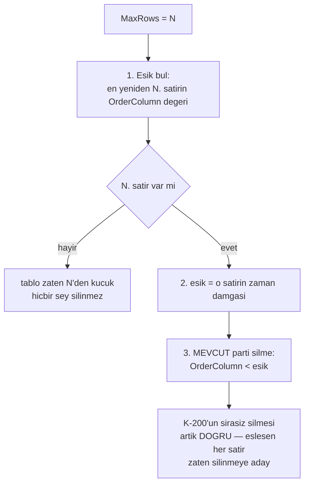

# Faz 36 — Saklama Hacim Sınırı (`MaxRows`)

> **Durum:** 📋 Planlandı (2026-08-06)
> **Kaynak:** [UCUNCU-FAZ-ADAYLARI.md](UCUNCU-FAZ-ADAYLARI.md) · **F-73**
> **Önkoşul:** [Faz 25](25-VERI-SAKLAMA-VE-ARSIVLEME.md) — saklama altyapısı, üç diyalekt şablonu
> **Paketler:** `AgentPrism.Abstractions`, `.Core`, `.Sql.Shared`
> **Yeni paket:** Yok · **Migration:** Yok — sütun **zaten var**
> **Public API:** büyümüyor — var olan alan **çalışır hâle gelir**

---

## Bu Faza Başlarken

> `faz-baslangic` skill'ini uygula. Aşağıdaki liste o skill'in 2. adımıdır —
> **tamamını değil, yalnız işaret edilen bölümleri oku.**

1. Bu doküman
2. Kararlar — dosyanın tamamını **okuma**, yalnız bu kalemleri grep'le:
   ```bash
   grep -n "K-198\|K-199\|K-200\|K-201" docs/KARARLAR.md
   ```
   **K-198** (saklama SQL'i tek tabloyla üretilir, sağlayıcı başına
   kopyalanmaz — yeni sorgu da aynı yerden çıkar), **K-199** (partition
   açılmadı; ölçüm 100k satırda saniyede ~720k satır silme gösterdi),
   **K-200** (🚨 parti silme her sağlayıcıda **farklı teknik** kullanır ve
   üçü de **kasıtlı olarak sırasızdır** — bu fazın ana tasarım kısıtı),
   **K-201** (`MaxRows` ertelendi — bu fazın kapattığı borç).
3. [`25-VERI-SAKLAMA-VE-ARSIVLEME.md`](25-VERI-SAKLAMA-VE-ARSIVLEME.md) — **bu fazın
   ana kaynağıdır**; devir notunu ve hedef kayıt defteri bölümünü oku:
   ```bash
   awk '/## Sonraki Faza Devir Notu/,0' docs/25-VERI-SAKLAMA-VE-ARSIVLEME.md
   ```
4. Alan hafızası (bu faz iki alana dokunuyor):
   [`hafiza/sql-saglayicilari.md`](hafiza/sql-saglayicilari.md) (üç diyalekt,
   `SqlDialect` şablonları), [`hafiza/postgresql.md`](hafiza/postgresql.md)
   (`ctid`, indeks davranışı)
5. Gerektiğinde, tamamı değil ilgili bölümü:
   [`MIMARI.md`](MIMARI.md) — saklama bölümü

---

## Amaç

`MaxRows` **tanımlı, doğrulanan, saklanan ama uygulanmayan** bir ayardır.
Kullanıcı bugün onu ayarlıyor, kaydediliyor, arayüzde görünüyor — ve hiçbir şey
olmuyor. Bu, sessiz bir yanlıştır ve yayımlanmış bir sözleşmenin ihlalidir.

- **F-73** — hacim bazlı silme: en eski satırlardan başlayarak tablo satır
  sayısını sınırın altına indirmek.

### Bugün ne çalışmıyor — doğrulanmış kanıt

| Kanıt | Gözlem |
|---|---|
| [`RetentionTypes.cs:29`](../src/AgentPrism.Abstractions/Retention/RetentionTypes.cs) | `public long? MaxRows { get; init; }` — sözleşmede vardır |
| [`RetentionTypes.cs:26-28`](../src/AgentPrism.Abstractions/Retention/RetentionTypes.cs) | XML dokümanı kendisi yazıyor: *"Rezerve alan… `RetentionExecutor` tarafından henüz **UYGULANMAZ**"* |
| [`RetentionTypes.cs:19-21`](../src/AgentPrism.Abstractions/Retention/RetentionTypes.cs) | 🚨 `MaxAgeDays` dokümanı **söz veriyor**: *"`null` ise yaş bazlı silme uygulanmaz (yalnız `MaxRows` varsa **o geçerlidir**)"* — bu söz bugün **tutulmuyor** |
| [`RetentionEndpoints.cs:115`](../src/AgentPrism.AspNetCore/Endpoints/RetentionEndpoints.cs) | `if (request.MaxRows is < 1)` — uçta doğrulanıyor |
| [`SqlRetentionPolicyStore.cs:82`](../src/AgentPrism.Sql.Shared/Stores/SqlRetentionPolicyStore.cs) | `Dialect.AddInt64(command, "max_rows", policy.MaxRows)` — depoya yazılıyor |
| `grep -rn "MaxRows" src/AgentPrism.Core/` | **Hiç sonuç yok.** `RetentionExecutor` onu hiç okumuyor |

> Kanıtlar 2026-08-06 tarihinde doğrulandı.

**Yalnız `MaxRows` ayarlanmış bir politika bugün hiçbir şey yapmaz.**
`MaxAgeDays` boş olduğu için yaş bazlı silme atlanır, `MaxRows` okunmadığı için
hacim bazlı silme hiç çalışmaz. Kullanıcının kurduğu politika sessizce ölüdür.

---

## 36.1 — 🚨 K-200 ile çatışma ve çözümü

K-200 parti silmenin üç sağlayıcıda da **kasıtlı olarak sırasız** olduğunu
kaydetti: amaç bir parti eşleşen satırı silmektir, belirli bir sırada silmek
değildir.

Ama `MaxRows` **sıra ister**: "en eski satırları sil". Naif bir çözüm
`ORDER BY ... LIMIT` ile silmeye çalışır ve üç sağlayıcıda üç ayrı sorun
doğurur — PostgreSQL `DELETE ... LIMIT` tanımaz, SQLite varsayılan derlemede
desteklemez, SQL Server ayrı sözdizimi ister.

**Çözüm sırayı silme adımından çıkarır:**



Bu tasarımın üç kazancı vardır:

1. **Mevcut makine yeniden kullanılır.** Eşik bulunduktan sonra iş, Faz 25'in
   zaten çalışan yaş bazlı silmesiyle **aynıdır**. `DeleteBatchAsync` değişmez.
2. **`COUNT(*)` gerekmez.** Aday listesi "satır sayma büyük tabloda pahalıdır"
   riskini yazıyordu; bu tasarımda tablo hiç sayılmaz. Tek bir indeksli
   sorgu N'inci satırı bulur.
3. **K-200 korunur.** Sırasız parti silme doğru kalır, çünkü eşiğin altındaki
   her satır silinmeye adaydır.

### Eşiği bulan sorgu üç diyalektte

`SqlDialect` bugün üç şablon metodu taşır (say / sil / oku). **Dördüncü** bir
şablon eklenir: "N'inci satırın sıra sütunu değeri".

| Sağlayıcı | Teknik |
|---|---|
| PostgreSQL | `ORDER BY {order} DESC OFFSET @n - 1 LIMIT 1` |
| SQL Server | `ORDER BY {order} DESC OFFSET (@n - 1) ROWS FETCH NEXT 1 ROWS ONLY` |
| SQLite | `ORDER BY {order} DESC LIMIT 1 OFFSET @n - 1` |

> 🚨 **`hafiza/sql-saglayicilari.md`'deki K-026 tuzağı burada geçerlidir:**
> SQL Server'da `OFFSET`/`FETCH` `ORDER BY` **olmadan** hata verir. Bu sorguda
> `ORDER BY` zaten vardır, ama şablonu yazarken kural akılda tutulmalıdır.

## 36.2 — `MaxAgeDays` ile birlikte çalışma

İki alan aynı politikada bulunabilir. Kural: **ikisi de uygulanır ve daha çok
silen kazanır.**

| `MaxAgeDays` | `MaxRows` | Davranış |
|---|---|---|
| dolu | boş | Yalnız yaş eşiği (bugünkü davranış) |
| boş | dolu | Yalnız hacim eşiği (**yeni** — sözleşmenin verdiği söz) |
| dolu | dolu | İki eşik hesaplanır; **daha yeni** olan zaman damgası kullanılır |
| boş | boş | Hiçbir şey silinmez |

"Daha yeni eşik" seçimi, iki kuralın da sağlanmasını garanti eder: sonuçta
tablo hem N satırdan az olur hem de eski satır kalmaz.

## 36.3 — Önizleme ve arşiv

`RetentionExecutor.PreviewAsync` bugün "şu an çalıştırılırsa ne olur"
önizlemesi üretiyor. Hacim eşiği bu önizlemeye **girmelidir**; girmezse
kullanıcı `MaxRows` ayarlar, önizleme sıfır gösterir ve gerçek koşu binlerce
satır siler.

Arşivleme yolu değişmez: eşik hesaplandıktan sonra `Archive` bayrağı ve
`IArchiveSink` davranışı Faz 25'teki gibidir. Sink kayıtlı değilken `Archive`
`true` ise hiçbir satır silinmez — bu kural korunur.

---

## Planlanan Public API

> Taslak imzalardır. Gerçekleşen imzalar kapanışta ayrı bir bölüme yazılır.

Public sözleşme **büyümez**. `RetentionPolicy.MaxRows` zaten vardır; yalnız XML
dokümanı düzeltilir:

```csharp
/// <summary>
/// Hedef tabloda tutulacak en fazla satir sayisi. Sinirin uzerindeki en ESKI
/// satirlar silinir. <see langword="null"/> ise hacim bazli silme uygulanmaz.
/// </summary>
public long? MaxRows { get; init; }
```

> 🚨 Eski XML dokümanı *"henüz UYGULANMAZ"* diyor. Bu cümlenin silinmesi bu
> fazın görünür çıktısıdır; kalırsa doküman koddan sapar.

`IRetentionStore`'a bir metot eklenir:

```csharp
// AgentPrism.Abstractions/Retention/IRetentionStore.cs
public interface IRetentionStore
{
    // ... mevcut uc metot

    /// <summary>
    /// En yeniden sayarak N. satirin sira sutunu degerini dondurur. Tablo
    /// N satirdan az tasiyorsa <see langword="null"/> doner.
    /// </summary>
    ValueTask<DateTimeOffset?> FindRowLimitCutoffAsync(
        string target,
        long maxRows,
        CancellationToken cancellationToken = default);
}
```

> `IRetentionStore` public bir arayüzdür. Metot eklemek Faz 7'den (yayın)
> **önce bedavadır**; sonra kırıcı bir değişikliktir.

### HTTP `endpoint`'leri

Yok. Mevcut `/api/retention/*` uçları değişmez; yalnız davranışları doğrulanır.

### Arayüz payı

**Yok.** `MaxRows` alanı arayüzde zaten vardır; yalnız artık çalışır.

---

## Planlanan Dosya Listesi

```
src/AgentPrism.Abstractions/Retention/
├── IRetentionStore.cs           (bir metot eklenir)
└── RetentionTypes.cs            (XML dokumani duzeltilir)

src/AgentPrism.Core/Retention/
├── RetentionExecutor.cs         (MaxRows OKUNUR — asil duzeltme)
└── InMemoryRetentionPolicyStore.cs

src/AgentPrism.Sql.Shared/
├── Internal/SqlDialect.cs       (dorduncu sablon: N. satir esigi)
└── Stores/SqlRetentionStore.cs  (FindRowLimitCutoffAsync)

src/AgentPrism.PostgreSql/Internal/PostgresDialect.cs   (sablon ezimi)
src/AgentPrism.SqlServer/Internal/SqlServerDialect.cs   (sablon ezimi)
src/AgentPrism.Sqlite/Internal/SqliteDialect.cs         (sablon ezimi)
```

Migration **yoktur**: `max_rows` sütunu üç sağlayıcıda da zaten mevcuttur.

---

## Testler

| Test sınıfı | Neyi doğrular |
|---|---|
| `RetentionMaxRowsContractTests` | `tests/Shared/Contracts/` altında; bellek içi + üç SQL sağlayıcısında aynı sonuç |
| `MaxRowsOnlyPolicyTests` | 🚨 `MaxAgeDays` **boş**, `MaxRows = 100` → 150 satırdan 50'si silinir. Bugün sıfır siliniyor |
| `MaxRowsCombinedTests` | İki alan doluyken daha yeni eşik kazanır |
| `MaxRowsUnderLimitTests` | Tablo sınırın altındayken hiçbir satır silinmez ve **hiçbir silme sorgusu çalışmaz** |
| `MaxRowsPreviewTests` | `PreviewAsync` gerçek koşuyla **aynı** sayıyı bildirir |
| `MaxRowsArchiveTests` | `Archive = true` ve sink yokken hiçbir satır silinmez (Faz 25 kuralı korunur) |
| `MaxRowsDialectTests` | Dördüncü şablon üç diyalektte de doğru SQL üretir; SQL Server'da `ORDER BY` eksikliği hatası oluşmaz |

---

## Açık Sorular

> Planı bloklamayan, faz uygulanırken karara bağlanacak sorular. Bloklayan
> sorular plan yazılmadan **önce** sorulur.

| # | Soru | Seçenekler | Öneri |
|---|---|---|---|
| 1 | İki alan doluyken hangi eşik kazanır? | A: daha yeni (daha çok siler) · B: daha eski | **A.** İki kuralın da sağlandığını garanti eden tek seçenektir |
| 2 | Sıra sütunu her hedefte zaman damgası mı? | A: evet, `RetentionTargetRegistry.OrderColumn` kullanılır · B: hedefe göre değişir | **A** — ama `eval_case_results` hedefinin sıra sütunu `id`'dir; bu hedefte eşik **ölçülmeli**. Uygulayan oturum bunu ilk iş olarak doğrular |
| 3 | Hacim eşiği kiracı başına mı tablo genelinde mi? | A: politikanın kiracı kapsamında · B: tablo genelinde | **A.** Politika kiracıya bağlıdır; bir kiracının hacmi diğerininkini silmemelidir. Sorgu `tenant_id` filtresi taşımalıdır |
| 4 | Çok büyük bir aşımda tek koşuda hepsi silinsin mi? | A: mevcut parti sınırı korunur, koşu tekrarlanır · B: hepsi tek koşuda | **A.** K-199'un parti deseni korunur; uzun kilit üretmez |

---

## Bitiş Ölçütleri (DoD)

- [ ] 🚨 Yalnız `MaxRows = 100` taşıyan politika (yaş alanı **boş**), 150
      satırlık bir hedefte **50 satır** siler. Bugün sıfır siliyor
- [ ] Tablo sınırın altındayken hiçbir silme sorgusu çalışmaz
- [ ] İki alan doluyken daha çok silen eşik uygulanır
- [ ] `GET /api/retention/{target}` önizlemesi gerçek koşuyla aynı sayıyı verir
- [ ] Üç SQL sağlayıcısında sözleşme testleri geçer (PostgreSQL, SQL Server,
      SQLite)
- [ ] `RetentionTypes.cs`'teki *"henüz UYGULANMAZ"* cümlesi **silindi**
- [ ] Dört doğrulama kapısı sıfır uyarı verir
- [ ] `samples/AgentPrism.Api` ile gerçek saklama koşusu yapıldı, çıktı bu
      belgeye yazıldı
- [ ] `secret` taraması boş döndü

### Doğrulama komutları

```bash
# Yalniz MaxRows tasiyan politika kur (MaxAgeDays YOK)
curl -s -X POST http://localhost:5081/agentprism/api/retention \
  -H 'content-type: application/json' \
  -d '{"target":"run_events","maxRows":100,"enabled":true}'

# Onizleme — silinecek satir sayisi sifirdan buyuk olmali
curl -s http://localhost:5081/agentprism/api/retention/run_events | jq

# Kosuyu tetikle
curl -s -X POST http://localhost:5081/agentprism/api/retention/run_events/run | jq

# Kalan satir sayisi 100 olmali
psql "$AGENTPRISM_CONN" -c "SELECT count(*) FROM agentprism.run_events;"
```

---

## Riskler

| Risk | Önlem |
|------|-------|
| 🚨 K-200'ün sırasız silmesi hacim kuralını bozar | Sıra, silme adımından **çıkarıldı**; eşik önce hesaplanır, silme yine sırasızdır ve doğrudur |
| `COUNT(*)` büyük tabloda pahalıdır | Tasarım hiç saymaz; tek indeksli `OFFSET/FETCH` sorgusu kullanır |
| SQL Server'da `OFFSET` `ORDER BY` olmadan hata verir (K-026 tuzağı) | Şablon `ORDER BY` taşır; diyalekt testi bunu doğrular |
| `eval_case_results` hedefinin sıra sütunu `id`'dir, zaman damgası değil | Açık Soru 2; uygulayan oturum ilk iş olarak ölçer |
| Kiracı filtresi unutulur, bir kiracı diğerinin verisini kırpar | Sözleşme testi iki kiracıyla koşar |
| Önizleme ile gerçek koşu ayrışır | Aynı eşik hesabı iki yolda da kullanılır; test bunu doğrular |

---

<!-- ============================================================
     AŞAĞISI KAPANIŞTA DOLDURULUR — `faz-tamamlama` skill'i.
     Plan anında boş kalır. Başlıkları SİLME.
     ============================================================ -->

## Plandan Sapmalar

> Kapanışta doldurulur. Plan ile gerçek arasındaki fark **gizlenmez** — sonraki
> oturumun en değerli bilgisidir.

## Bu Fazda Verilen Kararlar

> Kapanışta doldurulur. K-NNN numaraları burada alınır; plan numara rezerve etmez.
> **Not:** K-201 (`MaxRows` ertelendi) bu fazda **kapanır**; kapanış kaydı
> K-201'e atıf yapmalıdır.

## Gerçekleşen Public API

> Kapanışta doldurulur. Koddaki **gerçek** imzalar.

## Dosya Listesi (gerçekleşen)

> Kapanışta doldurulur.

## Sonraki Faza Devir Notu

> Kapanışta doldurulur: devralınan sözleşmeler, bilinen tuzaklar (🚨), yarım
> kalan işler, sıradaki faz.
