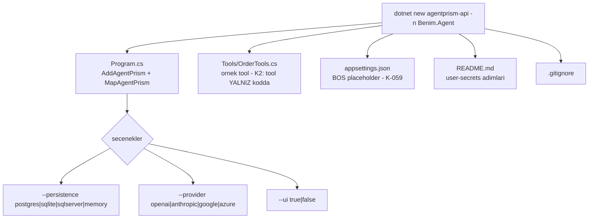

# Faz 37 — `dotnet new` Proje Şablonu

> **Durum:** ✅ Tamamlandı (2026-08-06)
> **Kaynak:** [ADAYLAR.md](ADAYLAR.md) · **F-49**
> **Önkoşul:** Yok. Faz 33 (sağlık denetimi) önce biterse şablon onu da taşır
> **Paketler:** yeni — `AgentPrism.Templates`
> **Yeni paket:** **Evet** — gerekçe aşağıda · **Migration:** Yok
> **Public API:** büyümüyor — şablon paketi kod yüzeyi taşımaz

---

## Bu Faza Başlarken

> `faz-baslangic` skill'ini uygula. Aşağıdaki liste o skill'in 2. adımıdır —
> **tamamını değil, yalnız işaret edilen bölümleri oku.**

1. Bu doküman
2. Kararlar — dosyanın tamamını **okuma**, yalnız bu kalemleri grep'le:
   ```bash
   grep -n "K-007\|K-032\|K-059\|K-185" docs/KARARLAR.md
   ```
   **K-007** (geçişli sabitleme kapalı — yeni paket gerekçesi ister),
   **K-032** (model kataloğu yapılandırmadan gelir — şablon yerleşik model adı
   **yazamaz**), **K-059** (🚨 `secret` dosyaya yazılmaz — şablonun ürettiği
   `appsettings.json` boş placeholder taşır), **K-185** (meta paket her
   sağlayıcıyı içermez — şablon hangi paketleri referans verecek?).
3. [`00-ALTYAPI.md`](00-ALTYAPI.md) — paketleme kuralları ve `Directory.Build.props`
   düzeni. Şablon paketi bu kuralların **istisnasıdır**; farkı bilmen gerekir.
4. Alan hafızası (bu faz bir alana dokunuyor):
   [`hafiza/build-ve-analyzer.md`](hafiza/build-ve-analyzer.md)
   (MSBuild, csproj, NuGet paketleme, analyzer)
5. Gerektiğinde, tamamı değil ilgili bölümü:
   [`README.md`](../README.md) — kurulum bölümü. Şablon bu bölümün **çalıştırılabilir
   hâlidir**; ikisi ayrışmamalıdır

---

## Amaç

`samples/AgentPrism.Api` çalışan bir kontrol düzlemidir ama bir **şablon
değildir**. Yeni bir kullanıcı onu kopyalamak, adları değiştirmek ve gereksiz
parçaları silmek zorundadır.

- **F-49** — `dotnet new agentprism-api` → çalışan bir kontrol düzlemi.

Bu, dalganın **ilk on dakikaya** dokunan tek kalemidir. Değeri benimseme
merceğindedir: ilk agent'a kadar geçen süreyi kısaltır.

### Bugün ne çalışmıyor — doğrulanmış kanıt

| Kanıt | Gözlem |
|---|---|
| `ls samples/AgentPrism.Api/` | `Program.cs`, `OrderTools.cs`, `EchoModelProvider.cs`, `FileSystemArchiveSink.cs`, `appsettings.json`, `Properties/launchSettings.json` — çalışan bir uygulama |
| `find . -name ".template.config" -not -path "*/node_modules/*"` | **Hiç sonuç yok.** Şablon altyapısı yoktur |
| [`AgentPrism.slnx:20-22`](../AgentPrism.slnx) | `samples/` klasöründe tek proje var; şablon projesi yoktur |
| `ls src/` | On beş kaynak paketi; hiçbiri şablon paketi değildir |

> Kanıtlar 2026-08-06 tarihinde doğrulandı.

---

## 37.1 — Yeni paket gerekçesi (K-007)

`AgentPrism.Templates` bir NuGet paketidir ama **bir kütüphane değildir**.
Ayrımı bilmek gerekir:

| Normal AgentPrism paketi | Şablon paketi |
|---|---|
| `PackageType` yok (varsayılan kütüphane) | `<PackageType>Template</PackageType>` |
| Derlenir, `dll` üretir | **Derlenmez**; yalnız içerik taşır |
| Bağımlılık grafiğine girer | 🚨 **Hiçbir bağımlılığı yoktur** ve tüketicinin grafiğine **girmez** |
| Meta pakete girebilir | **Meta pakete asla girmez** |
| Public API takibine tabidir | Public API taşımaz |

**Gerekçe:** Şablon paketi tüketicinin bağımlılık grafiğini kirletmez, çünkü
grafiğe hiç girmez. `dotnet new install` ile makineye kurulur, `dotnet new` ile
kullanılır ve üretilen proje ona **referans vermez**. K-007'nin endişesi
(geçişli ağırlık) burada sıfırdır.

Bu, `faz-tamamlama`'daki paket kontrol listesinin de bir kısmını **atlar**:
`DependencyDirectionTests` şablon paketini kapsamaz, çünkü bağımlılık yönü
yoktur. Kontrol listesinin geri kalanı (README, slnx, sürümleme) geçerlidir.

## 37.2 — Şablon neyi üretir



### 🚨 Şablon `secret` yazmaz

Üretilen `appsettings.json` **boş placeholder** taşır. Gerçek değer yalnız
`dotnet user-secrets` içinde yaşar ve üretilen `README.md` bunu ilk adım olarak
anlatır.

Bir şablonun ürettiği dosyaya örnek bir API anahtarı koymak, o anahtarın
binlerce depoda commit edilmesine yol açar. Bu, K-059'un ruhunun doğrudan
ihlalidir.

### 🚨 Şablon model adı yazmaz

K-032 model kataloğunun yapılandırmadan geldiğini, kodda yerleşik liste
olmadığını kararlaştırdı. Şablon bir model adı **sabitlemez**; yapılandırmada
adlandırılmış bir placeholder ve README'de "bugünkü model adını sağlayıcının
belgesinden alın" yönergesi taşır.

Model adları NuGet yayın hızından hızlı değişir. Şablona gömülen bir ad,
şablonun bayatlamasının **en hızlı** yoludur.

## 37.3 — 🚨 Şablon bayatlar — CI kapısı zorunludur

Bu kalemin tek gerçek riski budur. Şablon, kütüphane değiştiğinde sessizce
kırılır: derleme kapıları onu kapsamaz, çünkü üretilen proje depoda yoktur.

Kapı şudur:

```bash
dotnet new install ./src/AgentPrism.Templates
dotnet new agentprism-api -n Sablon.Denemesi -o "$TMP/sablon"
dotnet build "$TMP/sablon" -c Release      # sifir uyari
```

Bu adım **her seçenek birleşimi için** değil, en az iki birleşim için koşar:
en yalın (`memory` + arayüzsüz) ve en dolu (`postgres` + arayüz). Tüm
birleşimleri koşmak faz kapanışını yavaşlatır; iki uç nokta kırılmayı yakalar.

> **Beşinci bir kapı mı?** Hayır. Bu, dört kapının **içine** girmez; şablon
> projesinin kendi testidir ve `dotnet test` tarafından bir test olarak
> koşulur. Dört kapı disiplini değişmez.

---

## Planlanan Public API

> Taslak imzalardır. Gerçekleşen imzalar kapanışta ayrı bir bölüme yazılır.

Kod yüzeyi **yoktur**. Şablonun sözleşmesi `template.json` dosyasıdır:

```jsonc
{
  "identity": "AgentPrism.Api.CSharp",
  "shortName": "agentprism-api",
  "name": "AgentPrism control plane (ASP.NET Core)",
  "sourceName": "AgentPrism.Starter",
  "tags": { "language": "C#", "type": "project" },
  "symbols": {
    "persistence": {
      "type": "parameter",
      "datatype": "choice",
      "choices": [
        { "choice": "memory",    "description": "Veritabani yok" },
        { "choice": "postgres",  "description": "PostgreSQL" },
        { "choice": "sqlite",    "description": "SQLite (tek dosya)" },
        { "choice": "sqlserver", "description": "SQL Server / Azure SQL" }
      ],
      "defaultValue": "memory"
    },
    "provider": {
      "type": "parameter",
      "datatype": "choice",
      "choices": [
        { "choice": "openai",    "description": "OpenAI" },
        { "choice": "anthropic", "description": "Anthropic (Claude)" },
        { "choice": "google",    "description": "Google Gemini" },
        { "choice": "azure",     "description": "Azure OpenAI" }
      ],
      "defaultValue": "openai"
    },
    "ui": {
      "type": "parameter",
      "datatype": "bool",
      "defaultValue": "true",
      "description": "Gomulu kontrol duzlemi arayuzunu dahil et"
    }
  }
}
```

**Varsayılan `memory` seçilmesinin gerekçesi:** `dotnet new` sonrası
`dotnet run` **hiçbir kurulum olmadan** çalışmalıdır. Varsayılan PostgreSQL
olsaydı ilk deneyim bir bağlantı hatası olurdu.

### HTTP `endpoint`'leri

Yok.

### Arayüz payı

**Yok.** Şablon mevcut arayüz paketini referans verir; yeni arayüz kodu
üretmez.

---

## Planlanan Dosya Listesi

```
src/AgentPrism.Templates/
├── AgentPrism.Templates.csproj
└── content/
    └── AgentPrism.Starter/
        ├── .template.config/
        │   ├── template.json
        │   └── dotnetcli.host.json
        ├── AgentPrism.Starter.csproj
        ├── Program.cs
        ├── Tools/OrderTools.cs
        ├── appsettings.json
        ├── appsettings.Development.json
        ├── .gitignore
        └── README.md

tests/AgentPrism.Templates.Tests/
├── AgentPrism.Templates.Tests.csproj
└── TemplateInstantiationTests.cs
```

Ek olarak güncellenecekler: [`AgentPrism.slnx`](../AgentPrism.slnx) (`src/` ve
`tests/` klasörlerine birer satır), [`README.md`](../README.md) (kurulum
bölümüne şablon komutu).

---

## Testler

| Test sınıfı | Neyi doğrular |
|---|---|
| `TemplateInstantiationTests` | 🚨 Şablon kurulur, en yalın ve en dolu birleşim üretilir, ikisi de **sıfır uyarıyla derlenir** |
| `TemplateSecretTests` | 🚨 Üretilen hiçbir dosyada gerçek görünümlü bir anahtar yoktur; `appsettings.json` yalnız boş placeholder taşır |
| `TemplateModelNameTests` | Üretilen kodda sabitlenmiş bir model adı yoktur (K-032) |
| `TemplateRunTests` | `memory` birleşimi `dotnet run` ile ayağa kalkar ve `GET /agentprism/api/agents` `200` döner |
| `TemplateRenameTests` | `-n Benim.Agent` ile üretilen projede `AgentPrism.Starter` dizesi hiçbir dosyada kalmaz |

---

## Açık Sorular

> Planı bloklamayan, faz uygulanırken karara bağlanacak sorular. Bloklayan
> sorular plan yazılmadan **önce** sorulur.

| # | Soru | Seçenekler | Öneri |
|---|---|---|---|
| 1 | `samples/AgentPrism.Api` şablonla birleşsin mi? | A: ayrı kalsın · B: şablon örneğin yerini alsın | **A.** Örnek uygulama dört kapının ve her fazın gerçek doğrulama zeminidir (`MEMORY.md`: hatalar **yalnız** orada çıktı). Şablon sadeleştirilmiş bir başlangıçtır; ikisi farklı işlerdir |
| 2 | Şablon sürümü kütüphaneyle birlikte mi artar? | A: evet, aynı sürüm · B: bağımsız | **A.** Şablon `x.y.z` sürümlü paketleri referans verir; sürümleri ayırmak hangi şablonun hangi kütüphaneyle çalıştığını belirsizleştirir |
| 3 | Örnek tool şablona girsin mi? | A: evet, tek basit tool · B: hayır, boş başlasın | **A.** K2 gereği tool yalnız kodda tanımlanır; bunu **gösteren** bir örnek, kuralın en iyi belgesidir |
| 4 | Kaç seçenek birleşimi CI'da derlenir? | A: iki uç nokta · B: on altısı da | **A.** On altı birleşim faz kapanışını yavaşlatır; iki uç nokta kırılmayı yakalar |

---

## Bitiş Ölçütleri (DoD)

- [x] `dotnet new install ./src/AgentPrism.Templates` başarılı — doğrulandı,
      `agentprism-api` şablonu listelendi
- [x] `dotnet new agentprism-api -n Benim.Agent` çalışır ve üretilen projede
      `AgentPrism.Starter` dizesi **hiçbir dosyada kalmaz** — `TemplateRenameTests` geçti
- [x] Varsayılan (`memory`) birleşim **hiçbir kurulum olmadan** `dotnet run`
      ile ayağa kalkar; `GET /agentprism/api/agents` `200` döner — hem elle hem
      `TemplateRunTests` ile doğrulandı (`[{"name":"support",...}]` döndü)
- [x] `--persistence sqlserver --provider azure --ui true` (en dolu birleşim —
      postgres yerine SqlServer+Azure seçildi, ikisi de meta pakete dâhil
      DEĞİL, kırılmayı daha güçlü yakalar) sıfır uyarıyla derlenir —
      `TemplateInstantiationTests.EnDoluBirlesim_...` geçti
- [x] 🚨 Üretilen `appsettings.json` yalnız boş placeholder taşır; **üretilen
      projede** `secret` taraması boş döner — `TemplateSecretTests` (2 test) geçti
- [x] Üretilen kodda sabitlenmiş model adı yoktur (K-032) — `TemplateModelNameTests`
      dört sağlayıcının tamamı için geçti
- [x] Dört doğrulama kapısı sıfır uyarı verir — `dotnet build`/`test`/`pack`/`format`
      hepsi `AgentPrism.slnx` üzerinde 0 uyarı/0 hata ile geçti
- [x] `secret` taraması boş döndü (depo geneli — `faz-tamamlama` komutu) — boş
- [x] `README.md` kurulum bölümü şablon komutunu içerir
- [x] `AgentPrism.slnx` iki yeni projeyi taşır

### Doğrulama komutları

```bash
# Sablonu kur
dotnet new install ./src/AgentPrism.Templates

# En yalin birlesim
TMP=$(mktemp -d)
dotnet new agentprism-api -n Benim.Agent -o "$TMP/yalin" --persistence memory --ui false
dotnet build "$TMP/yalin" -c Release

# Yeniden adlandirma tam mi — cikti BOS olmali
grep -rn "AgentPrism.Starter" "$TMP/yalin" && echo "ADLANDIRMA EKSIK" || echo "temiz"

# 🚨 secret taramasi — cikti BOS olmali
grep -rniE "sk-[a-z0-9]{20}|api[_-]?key\"\s*:\s*\"[^\"]+\"" "$TMP/yalin" \
  && echo "SECRET VAR" || echo "temiz"

# Calisiyor mu
(cd "$TMP/yalin" && dotnet run &) && sleep 8
curl -s -i http://localhost:5081/agentprism/api/agents | head -1

# En dolu birlesim
dotnet new agentprism-api -n Benim.Agent2 -o "$TMP/dolu" --persistence postgres --ui true
dotnet build "$TMP/dolu" -c Release
```

---

## Riskler

| Risk | Önlem |
|------|-------|
| 🚨 Şablon bayatlar; kütüphane değişince sessizce kırılır | `TemplateInstantiationTests` her `dotnet test` koşusunda iki birleşimi gerçekten derler |
| 🚨 Şablon `secret` içeren bir dosya üretir | Yalnız boş placeholder; `TemplateSecretTests` ve DoD taraması |
| Gömülü model adı bayatlar | K-032 gereği ad sabitlenmez; test bunu doğrular |
| Şablon paketi meta pakete sızar | `PackageType=Template`; meta paket referansı **eklenmez**, kontrol listesinde açık madde |
| Yeni paket bakım yükü üretir | Şablon paketi bağımlılık taşımaz ve public API'si yoktur; yük yalnız içerik tazeliğidir ve testle kapatılır |
| Varsayılan seçenek ilk deneyimi kırar | Varsayılan `memory`; kurulum gerektirmez |

---

<!-- ============================================================
     AŞAĞISI KAPANIŞTA DOLDURULUR — `faz-tamamlama` skill'i.
     Plan anında boş kalır. Başlıkları SİLME.
     ============================================================ -->

## Plandan Sapmalar

- **Sürüm sabitleme yerine kayan `AgentPrismVersion=*-*`.** Açık Soru 2'nin
  önerisi ("A: aynı sürüm") bir **build-time token stamping** mekanizması
  ima ediyordu (şablon paketi paketlenirken `template.json`'daki placeholder'ı
  gerçek `$(PackageVersion)` ile değiştirmek). Uygulama sırasında bu, kaynak
  dosyayı `dotnet pack` çalıştıkça MUTASYONA uğratmadan yapmak için ayrı bir
  ara-kopyalama aşaması gerektirdiği görüldü — karmaşıklık/değer oranı düşük.
  Bunun yerine NuGet'in floating version söz dizimi (`*-*`) kullanıldı: her
  zaman yapılandırılan kaynaktaki en güncel ön-sürümü alır, `--AgentPrismVersion`
  ile geçersiz kılınabilir. Bkz. K-265.
- **Örnek tool sayısı ikiden bire indi.** Plan "tek basit tool" diyordu (Açık
  Soru 3); ilk taslak `samples/AgentPrism.Api`'deki üç tool'un (`get_order_status`,
  `list_recent_orders`, `cancel_order`) hepsini kopyalıyordu. Kapanışta tek
  `get_order_status` bırakıldı — `RequiresApproval` gibi ek kavramlar sablonun
  amacını (hızlı başlangıç) aşıyordu; onay akışı README'de metin olarak anlatılır.
- **`dotnetcli.host.json` eklendi** — planda yoktu. `--persistence`/`--provider`/
  `--ui` CLI bayraklarının `dotnet new -h agentprism-api` çıktısında düzgün
  görünmesi için gerekliydi; `AgentPrismVersion` parametresi orada `isHidden`
  işaretlendi (kullanıcı akışında görünmesi gerekmiyor).
- **Beklenmeyen NuGet paketleme tuzakları (37.3'ün "şablon bayatlar" riskinin
  ötesinde).** Plan yalnız kütüphane değiştiğinde şablonun kırılmasını
  öngörüyordu; gerçekte paketin **kendi ilk paketlenmesi** üç ayrı, birbirinden
  bağımsız NuGet davranışına takıldı — hiçbiri dokümante değildi ve hiçbiri
  açık bir hata mesajı vermedi (hepsi aynı `NU5017` arkasına gizlendi). Bkz.
  K-262/K-263/K-264 ve `docs/hafiza/build-ve-analyzer.md`.
- **`OrderTools.cs`'e açık `using AgentPrism;` eklendi** — planda yoktu, plan
  `samples/AgentPrism.Api/OrderTools.cs`'i örnek aldığı için bu satırın
  gereksiz olduğunu varsaymıştı. Otomatik testler (`TemplateInstantiationTests`,
  `TemplateRunTests`) `-n` ile yeniden adlandırılan bir projede bunun
  **derlemeyi kırdığını** yakaladı. Bkz. K-266.

## Bu Fazda Verilen Kararlar

K-262 — K-266. Ayrıntı ve gerekçe: `docs/KARARLAR.md`.

| Karar | Özet |
|---|---|
| K-262 | Şablonda `IncludeSymbols=false` zorunlu — boş sembol paketi `NU5017` verir |
| K-263 | Şablonda `TargetFrameworks` (çoğul) boşaltılır — `dotnet pack` çapraz-hedeflemeyi önler |
| K-264 | Şablon içeriği `<None Pack="true" PackagePath="content/...">` ile paketlenir |
| K-265 | Şablon `AgentPrism` paket sürümü varsayılanı kayan `*-*`'dir |
| K-266 | Üretilen `OrderTools.cs` açık `using AgentPrism;` taşır (yeniden adlandırma güvenliği) |

## Gerçekleşen Public API

Yok — plan doğruydu. `AgentPrism.Templates` kod içermez (`IncludeBuildOutput=false`);
tek "sözleşmesi" `content/AgentPrism.Starter/.template.config/template.json`
dosyasıdır. Gerçekleşen sembol kümesi (taslaktan sapma yok):

```jsonc
"symbols": {
  "persistence": { "choices": ["memory", "postgres", "sqlite", "sqlserver"], "defaultValue": "memory" },
  "provider":    { "choices": ["openai", "anthropic", "google", "azure"],    "defaultValue": "openai" },
  "ui":          { "datatype": "bool", "defaultValue": "true" },
  "AgentPrismVersion": { "datatype": "string", "defaultValue": "*-*" },  // plan taslağında YOKTU
  "skipRestore": { "datatype": "bool", "defaultValue": "false" }          // plan taslağında YOKTU
}
```

## Dosya Listesi (gerçekleşen)

```
src/AgentPrism.Templates/
├── AgentPrism.Templates.csproj
├── README.md                                  (NuGet paket sayfası — plan taslağında yoktu, K bkz. 00-ALTYAPI.md README zorunluluğu)
└── content/AgentPrism.Starter/
    ├── .template.config/
    │   ├── template.json
    │   └── dotnetcli.host.json
    ├── AgentPrism.Starter.csproj
    ├── Program.cs
    ├── Tools/OrderTools.cs                     (plan iki tool varsaydı, tek kaldı)
    ├── appsettings.json
    ├── appsettings.Development.json
    ├── Properties/launchSettings.json          (plan taslağında yoktu — DoD'un sabit port beklentisi için)
    ├── .gitignore
    └── README.md

tests/AgentPrism.Templates.Tests/
├── AgentPrism.Templates.Tests.csproj
├── TemplateInstantiationTests.cs
├── TemplateSecretTests.cs
├── TemplateModelNameTests.cs
├── TemplateRunTests.cs
├── TemplateRenameTests.cs
└── Infrastructure/
    ├── RepoPaths.cs
    ├── ProcessRunner.cs
    ├── ProcessResult.cs
    ├── TempDirectory.cs
    ├── TemplateFixture.cs
    └── AssemblyFixtures.cs
```

Ek olarak güncellenenler: `AgentPrism.slnx` (iki proje), `README.md` (paket
tablosu + kurulum + yol haritası), `scripts/dokuman-bakim.py` (bkz. altta),
`docs/KARARLAR.md`/`KARARLAR-INDEKS.md`/`arsiv/KARARLAR-INDEKS-ARSIV.md` (yeni).

## Testler

| Test sınıfı | Neyi doğrular | Kaç test |
|---|---|---|
| `TemplateInstantiationTests` | En yalın (memory+openai+ui:false) ve en dolu (sqlserver+azure+ui:true) birleşim sıfır uyarıyla derlenir | 2 |
| `TemplateSecretTests` | Üretilen hiçbir dosyada gerçek görünümlü anahtar yok; `appsettings.json` yalnız boş placeholder | 2 |
| `TemplateModelNameTests` | Dört sağlayıcının hiçbiri üretilen `Program.cs`'e sabit bir model adı yazmaz (K-032) | 4 (Theory) |
| `TemplateRunTests` | Varsayılan birleşim kurulumsuz `dotnet run` ile ayağa kalkar, `GET /agentprism/api/agents` 200 döner | 1 |
| `TemplateRenameTests` | `-n Benim.Agent` sonrası hiçbir dosyada `AgentPrism.Starter` kalmaz | 1 |

Toplam 10 test; `TemplateFixture` (assembly fixture) tüm çözümü bir kez
paketleyip şablonu bir kez kurar, her test kendi geçici dizininde üretir.
Doğrulandı: `dotnet test tests/AgentPrism.Templates.Tests -c Release --no-build`
→ 10/10 geçti (~15 dk — tam çözüm paketleme dahil).

## Sonraki Faza Devir Notu

- **🚨 Yeni bir `IncludeBuildOutput=false` paketi eklerken K-262/K-263'ü
  tekrar keşfetmeyin.** `src/Directory.Build.props` her pakete `IncludeSymbols=true`
  ve `TargetFrameworks=net8.0;net9.0;net10.0` dayatır; derlenmeyen bir paket
  (sembol yok) her ikisini de açıkça kapatmalıdır, aksi hâlde `dotnet pack`
  `NU5017` ile başarısız olur — hata mesajı `AgentPrism` paketinin (dolu
  `<files>` listesiyle) DEĞİL, boş sembol paketinin sorunu olduğunu SÖYLEMEZ.
  Ayrıntı: `docs/hafiza/build-ve-analyzer.md`.
- **🚨 `sourceName` ile yeniden adlandırılan bir ad alanında C#'ın kapsayan
  ad alanı kısayoluna güvenmeyin.** Bkz. K-266. Şablon içeriğine yeni bir
  `.cs` dosyası eklerken, `AgentPrism` namespace'indeki bir tipi (örn. yeni
  bir öznitelik) kullanıyorsa açık `using AgentPrism;` yazın.
  `samples/AgentPrism.Api`'deki dosyalar bu kısayola güvenebilir çünkü ORADA
  ad alanı asla yeniden adlandırılmaz — şablon içeriği farklıdır.
- **Karar defteri indeksi bölündü (K-214'ün sözü tutuldu).** `docs/KARARLAR-INDEKS.md`
  artık yalnız en yeni 150 kalıcı kararı taşır; daha eskisi
  `docs/arsiv/KARARLAR-INDEKS-ARSIV.md`'dedir (sıcak yol dışı). Yeni bir karar
  eklerken hiçbir ek adım gerekmez — `python3 scripts/dokuman-bakim.py`
  bölünmeyi kendiliğinden korur (`ARSIV_ESIK = 150`).
- **`samples/AgentPrism.Api`'ye dokunulmadı** — Açık Soru 1'in kararı (A:
  ayrı kalsın) korundu. Şablon ve örnek uygulama farklı amaçlar taşımaya
  devam ediyor.
- **Yarım kalan iş yok.** Tüm DoD kalemleri karşılandı (bkz. aşağıdaki tablo).
  Sıradaki faz kimliği bağımsızdır (`docs/arsiv/UCUNCU-FAZ-YOL-HARITASI.md`).
