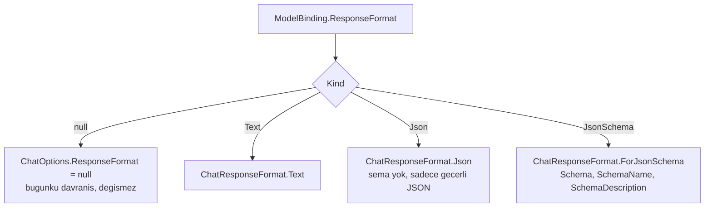

# Faz 38 — Yapılandırılmış Çıktı (JSON Şeması)

> **Durum:** 📋 Planlandı (2026-08-06)
> **Kaynak:** [UCUNCU-FAZ-ADAYLARI.md](UCUNCU-FAZ-ADAYLARI.md) · **F-42**
> **Önkoşul:** Yok. Kalem önkoşulsuzdur ve bugün yapılabilir
> **Paketler:** `AgentPrism.Abstractions`, `.Core`, `.OpenAI`, `.Anthropic`, `.Google`, `.Azure`, `.AspNetCore`, `.UI`
> **Yeni paket:** Yok · **Migration:** Yok — gerekçe [38.5](#385--neden-migration-yok)
> **Public API:** büyüyor — 🚨 **Faz 7'den önce bedava, sonra kırıcı**

---

## Bu Faza Başlarken

> `faz-baslangic` skill'ini uygula. Aşağıdaki liste o skill'in 2. adımıdır —
> **tamamını değil, yalnız işaret edilen bölümleri oku.**

1. Bu doküman
2. Kararlar — dosyanın tamamını **okuma**, yalnız bu kalemleri grep'le:
   ```bash
   grep -n "K-032\|K-034\|K-208\|K-016" docs/KARARLAR.md
   ```
   **K-208** (🚨 **bu fazın taşıyıcı deseni** — `ProviderSettings` sözleşmeye
   nasıl eklendi, bilinmeyen anahtar neden derleme hatasıdır, `jsonb` yolu neden
   hiç değişmedi), **K-034** (tanınmayan `ReasoningEffort` sessizce yok
   sayılmaz — bu fazın doğrulama kuralı ondan miras alınır), **K-032**
   (yerleşik model listesi kodda tutulmaz — yetenek bayrağı sağlayıcıdan gelir),
   **K-016** (public API takibi Faz 7'ye ertelendi — bu fazın aciliyetinin
   sebebi).
3. [`26-ANTHROPIC-VE-GEMINI.md`](26-ANTHROPIC-VE-GEMINI.md) — yalnız devir notu:
   ```bash
   awk '/## Sonraki Faza Devir Notu/,0' docs/26-ANTHROPIC-VE-GEMINI.md
   ```
   `ProviderSettings`'in dört sağlayıcıda nasıl okunduğunu ve
   `ModelProviderSettings` yardımcılarının sözleşmesini devralıyorsun.
4. Alan hafızası (bu faz iki alana dokunuyor):
   [`hafiza/openai-saglayici.md`](hafiza/openai-saglayici.md) (sağlayıcı
   adaptörleri, `ChatOptions` köprüsü),
   [`hafiza/build-ve-analyzer.md`](hafiza/build-ve-analyzer.md) (AOT duruşu —
   bu fazın en kolay kaçırılan kısıtı)
5. Gerektiğinde, tamamı değil ilgili bölümü:
   [`MIMARI.md`](MIMARI.md) — model sağlayıcı bölümü

---

## Amaç

Bir agent bugün yalnızca **metin** döndürebilir. Çağıran taraf, cevabı ayrıştırmak
için istemde "lütfen JSON döndür" yazmak ve gelen metni umutla `JsonSerializer`'a
vermek zorundadır. Bu, agent'ı bir API gibi kullanmanın önündeki tek engeldir.

Bu faz `ModelBinding`'e bir `ResponseFormat` alanı ekler ve onu MAF'ın
`ChatOptions.ResponseFormat` alanına bağlar. Sonuç: agent tanımı bir çıktı şeması
taşıyabilir ve sağlayıcı o şemaya uymayı garanti eder.

- **F-42** — `ModelBinding.ResponseFormat` → `ChatOptions.ResponseFormat`;
  üç kip (metin / JSON nesnesi / JSON şeması), derleme anı doğrulama ve model
  yetenek denetimi.

### Bugün ne çalışmıyor — doğrulanmış kanıt

| Kanıt | Gözlem |
|---|---|
| [`ModelBinding.cs:9-70`](../src/AgentPrism.Abstractions/Agents/ModelBinding.cs) | Sözleşme **yedi** alan taşıyor: `Provider`, `Model`, `Temperature`, `MaxOutputTokens`, `TopP`, `ReasoningEffort`, `ProviderSettings`. `ResponseFormat` **yok** |
| `grep -rn "ResponseFormat" src/ --include="*.cs"` | **Hiç sonuç yok.** Depoda bu kavram hiç geçmiyor |
| [`AgentDefinitionCompiler.cs:292-315`](../src/AgentPrism.Core/Compilation/AgentDefinitionCompiler.cs) | `BuildChatOptions` beş alan kuruyor (`Instructions`, `ModelId`, `Temperature`, `TopP`, `MaxOutputTokens`) + `Tools` + `Reasoning`. **Tek entegrasyon noktası budur** |
| [`ModelDescriptor.cs:8-16`](../src/AgentPrism.Abstractions/Models/ModelDescriptor.cs) | Üç yetenek bayrağı zaten var: `SupportsStreaming`, `SupportsTools`, `SupportsReasoning`. Yapılandırılmış çıktı için **karşılığı yok** |

> Kanıtlar 2026-08-06 tarihinde doğrulandı.

### MAF imzası — ölçüldü, tahmin edilmedi

`maf-api-kesfi` ile `Microsoft.Extensions.AI` **10.8.3** üzerinde ölçüldü
(2026-08-06). Statik üyeler reflection ile ayrıca doğrulandı, çünkü skill'in
script'i yalnız **örnek** property'leri listeler:

```csharp
// Microsoft.Extensions.AI.ChatOptions
prop ChatResponseFormat ResponseFormat { get; set; }

// Microsoft.Extensions.AI.ChatResponseFormat  (abstract DEGIL, ctor'u public DEGIL)
static ChatResponseFormatText Text { get; }        // statik property
static ChatResponseFormatJson Json { get; }        // statik property
static ChatResponseFormatJson ForJsonSchema(JsonElement schema, string schemaName, string schemaDescription)
static ChatResponseFormatJson ForJsonSchema(JsonSerializerOptions serializerOptions, string schemaName, string schemaDescription)
static ChatResponseFormatJson ForJsonSchema(Type schemaType, JsonSerializerOptions serializerOptions, string schemaName, string schemaDescription)

// Microsoft.Extensions.AI.ChatResponseFormatJson  [sealed]
ctor(JsonElement? schema, string schemaName = null, string schemaDescription = null)
prop JsonElement? Schema { get; }
prop string SchemaName { get; }
prop string SchemaDescription { get; }

// Microsoft.Extensions.AI.ChatResponseFormatText  [sealed]
ctor()
```

Üç ölçüm sonucu tasarımı doğrudan belirler:

1. **`ChatResponseFormat`'ın public kurucusu yoktur.** Kendi alt tipimizi
   türetemeyiz — zaten K3 bunu yasaklardı. Üç yerleşik biçim kullanılır.
2. **`ChatResponseFormatJson` şemayı `JsonElement?` olarak alır.** Şema `null`
   ise "geçerli JSON döndür" kipidir; dolu ise şema kipidir. Bu, `ModelBinding`
   içinde şemayı **ham `JsonElement`** olarak taşımamızı doğal kılar.
3. 🚨 **`ForJsonSchema(Type, ...)` aşırı yüklemesi kullanılmaz.** Bir `Type`'tan
   şema üretmek `AIJsonUtilities.CreateJsonSchema(Type, …)` üzerinden
   yansımaya dayanır ve `AgentPrism.Abstractions` ile `.Core`'un AOT duruşunu
   bozar. Ayrıntı: [38.4](#384--aot-kısıtı).

---

## 38.1 — Sözleşme: `ModelBinding.ResponseFormat`

Tasarım K-208'in desenini birebir izler: satıcı kavramı sözleşmeye sızmaz, şema
opak bir `JsonElement` olarak taşınır, `jsonb` yolu değişmez.

```csharp
public sealed record ModelBinding
{
    // ... mevcut yedi alan

    public AgentResponseFormat? ResponseFormat { get; init; }
}
```

`AgentResponseFormat` neden ayrı bir tip? Üç alan (kip, şema, şema adı) tek bir
alana sığmaz ve `ModelBinding`'i üç alan daha şişirmek K-208'in "sözleşmeyi
temiz tut" gerekçesine aykırıdır.



> **`null` varsayılandır ve bugünkü davranışı korur** (K1 — sıfır sürpriz).
> `Text` kipi `null`'dan farklıdır: `null` "hiçbir şey söyleme", `Text` "açıkça
> düz metin iste" demektir. İkisini ayırmak, bir üst katmanın (ileride F-44'ün
> yedek zinciri) varsayılanı ezip ezmediğini görünür kılar.

## 38.2 — Derleme anı doğrulama — K-034'ün deseni

K-034 ve K-208 aynı kuralı iki kez koydu: **sessizce yok sayılan bir ayar,
kullanıcının beklediği davranışı almamasına ve sebebini görememesine yol açar.**
Bu faz aynı kuralı üçüncü kez uygular.

`AgentDefinitionCompiler` şu dört durumu `AgentPrismCompilationException` ile
reddeder:

| Durum | Neden hata |
|---|---|
| `Kind = JsonSchema` ama `Schema` boş | İstenen şey ifade edilmemiş |
| `Kind = Text` veya `Json` ama `Schema` dolu | Çelişkili tanım; kullanıcı şema yazdığını sanır, şema hiç gitmez |
| `Schema` bir JSON **nesnesi** değil (`ValueKind != Object`) | Sağlayıcı bunu her hâlükârda reddeder; hatayı derlemeye çek |
| Seçili model yapılandırılmış çıktıyı desteklemiyor | [38.3](#383--model-yetenek-denetimi) |

🚨 **`Schema` bir `JsonElement`'tir ve `MEMORY.md`'nin struct tuzağı burada
geçerlidir.** Atanmamış bir `JsonElement` `ValueKind = Undefined` olur ve
`JsonElementConverter` istisna fırlatır — etki tek kayıtla sınırlı kalmaz, o
kaydı içeren **liste ucunun tamamı** çöker. `AgentResponseFormat` üreten her kod
yolu (uç, arayüz, kod tanımı, sürüm geri alma) `Schema` alanını bilinçli
doldurmalıdır. Sözleşme bunu `JsonElement?` yaparak zorlar: `null` ile
`Undefined` karışmaz.

Şema **içeriği** doğrulanmaz. AgentPrism bir JSON Schema doğrulayıcısı yazmaz —
bu bir bağımlılık kararı olurdu ve K-007 gerekçesi isterdi. Yalnız "nesne mi"
denetlenir; gerisini sağlayıcı söyler.

## 38.3 — Model yetenek denetimi

Sorunun zor yanı şudur: **her model yapılandırılmış çıktıyı desteklemez.**
Desteklemeyen bir modelde ne olmalı?

Depo bu soruya zaten bir cevap vermiş. `ModelDescriptor` üç yetenek bayrağı
taşıyor ve dört sağlayıcı paketi onları dolduruyor:

```csharp
public bool SupportsStreaming { get; init; } = true;
public bool SupportsTools { get; init; } = true;
public bool SupportsReasoning { get; init; }
```

Dördüncüsü aynı desenle eklenir:

```csharp
/// <summary>Model JSON semasina uyan cikti uretebiliyor mu.</summary>
public bool SupportsStructuredOutput { get; init; }
```

Varsayılan **`false`**'tur — `SupportsReasoning` ile aynı. Gerekçe: yanlış
`true` sessiz bir üretim hatası üretir, yanlış `false` ise anlaşılır bir derleme
hatası üretir. K1 ikinciyi tercih eder.

> Bu bayrak K-032'yi ihlal etmez. Yerleşik bir **model listesi** kodda
> tutulmuyor; bayrağı, modelleri zaten ilan eden sağlayıcı paketi yazıyor.

Yetenek bilinmiyorsa (model sağlayıcının listesinde yoksa) denetim **atlanır**.
Sebep: K-032 gereği model adları yapılandırmadan gelebilir ve liste eksik
olabilir; bilinmeyen bir modeli reddetmek çalışan kurulumları kırardı.

## 38.4 — AOT kısıtı

`AgentPrism.Abstractions` ve `.Core` AOT uyumludur. Bu faz o duruşu **hiç**
zorlamaz, ama zorlamanın iki kolay yolu vardır ve ikisi de yasaktır:

| Yasak | Neden |
|---|---|
| `ChatResponseFormat.ForJsonSchema(Type, …)` | `AIJsonUtilities.CreateJsonSchema(Type, …)` yansımayla şema üretir |
| `ChatResponseFormat.ForJsonSchema(JsonSerializerOptions, …)` | Aynı yol; `JsonSerializerOptions` üzerinden tip çözer |

Yalnız **`ForJsonSchema(JsonElement schema, …)`** aşırı yüklemesi kullanılır.
Şema kullanıcıdan hazır gelir; AgentPrism onu üretmez, taşır.

> Tüketici bir C# tipinden şema üretmek isterse bunu **kendi** uygulamasında
> yapar ve sonucu `JsonElement` olarak verir. Bu, K4'ün (her nokta
> değiştirilebilir) doğal sonucudur ve kütüphaneyi yansımadan uzak tutar.

## 38.5 — Neden migration yok

`agent_definitions` tablosu tanımı **tek bir `jsonb` sütununda** tutar:

```sql
CREATE TABLE IF NOT EXISTS {schema}.agent_definitions (
    id         uuid        NOT NULL PRIMARY KEY,
    tenant_id  text        NOT NULL,
    name       text        NOT NULL,
    version    integer     NOT NULL,
    definition jsonb       NOT NULL,
    ...
);
```

K-208 aynı yolu `ProviderSettings` için **ölçtü**: alan eklendi, `jsonb` yolu,
HTTP sözleşmesi ve kaynak üreteci bağlamı hiç değişmeden çalıştı. Aynı gerekçe
burada geçerlidir.

🚨 **Eski kayıtlar `responseFormat` anahtarını taşımaz.** Seri hâlden çıkarma
`null` üretmelidir, istisna değil. Bu, sözleşmenin `AgentResponseFormat?`
(nullable) olmasıyla sağlanır ve bir testle korunur.

---

## Planlanan Public API

> Taslak imzalardır. Gerçekleşen imzalar kapanışta ayrı bir bölüme yazılır.

```csharp
// AgentPrism.Abstractions/Agents/ResponseFormat.cs

/// <summary>Agent yanitinin istenen bicimi.</summary>
public enum AgentResponseFormatKind
{
    /// <summary>Duz metin. Acikca istenir.</summary>
    Text = 0,

    /// <summary>Gecerli bir JSON belgesi; sema dayatilmaz.</summary>
    Json = 1,

    /// <summary>Verilen JSON semasina uyan bir belge.</summary>
    JsonSchema = 2,
}

/// <summary>Yapilandirilmis cikti tanimi.</summary>
public sealed record AgentResponseFormat
{
    /// <summary>Istenen bicim.</summary>
    public required AgentResponseFormatKind Kind { get; init; }

    /// <summary>
    /// JSON semasi. Yalnizca <see cref="AgentResponseFormatKind.JsonSchema"/>
    /// icin doldurulur ve bir JSON <strong>nesnesi</strong> olmalidir.
    /// </summary>
    public JsonElement? Schema { get; init; }

    /// <summary>Semanin adi. Saglayici bunu modele iletebilir.</summary>
    public string? SchemaName { get; init; }

    /// <summary>Semanin aciklamasi.</summary>
    public string? SchemaDescription { get; init; }
}
```

```csharp
// AgentPrism.Abstractions/Agents/ModelBinding.cs   (bir alan eklenir)
public AgentResponseFormat? ResponseFormat { get; init; }

// AgentPrism.Abstractions/Models/ModelDescriptor.cs   (bir alan eklenir)
public bool SupportsStructuredOutput { get; init; }
```

> 🚨 `ModelBinding` ve `ModelDescriptor` **public `sealed record`**'lardır.
> Bugün alan eklemek bedavadır. Faz 7'den sonra her ikisi de bir sürüm
> kararıdır ve `PublicAPI.Shipped.txt` disiplinine girer.

### HTTP `endpoint`'leri

Yeni uç **yok**. `POST /api/agents` ve `PUT` gövdesindeki `model` nesnesi bir
alan kazanır:

```json
{
  "model": {
    "provider": "openai",
    "model": "gpt-5",
    "responseFormat": {
      "kind": "JsonSchema",
      "schemaName": "invoice",
      "schema": { "type": "object", "properties": { "total": { "type": "number" } } }
    }
  }
}
```

### Arayüz payı

Agent düzenleyicisinde model bölümüne bir kip seçici ve bir şema metin kutusu
eklenir. Şema **JSON metin kutusudur** — K-143'ün `checks` alanı için verdiği
kararın aynısı: az sayıda, nadiren düzenlenen, doğası gereği iç içe bir yapı
için ayrı form alanları üretmek anlamsızdır.

Yeni sözlük anahtarları `locales/en.ts` **ve** `tr.ts` içine eklenir; eksik
anahtar derleme hatasıdır (K-228).

**Bundle payı: ölçülmeli.** Bugünkü kullanım 151,3 KB gzip / 250 KB bütçe
(2026-08-06 ölçümü). Tahmin yazılmaz; uygulayan oturum `dotnet build` sonrası
`ls -l src/AgentPrism.UI/wwwroot/assets/` ile ölçer ve bu belgeye yazar.

---

## Planlanan Dosya Listesi

```
src/AgentPrism.Abstractions/
├── Agents/ResponseFormat.cs          (YENI — enum + record)
├── Agents/ModelBinding.cs            (bir alan)
└── Models/ModelDescriptor.cs         (bir alan)

src/AgentPrism.Core/
├── Compilation/AgentDefinitionCompiler.cs   (BuildChatOptions + dogrulama)
└── Serialization/                    (kaynak uretilmis JSON baglami — yeni tip kaydi)

src/AgentPrism.OpenAI/OpenAIProviderExtensions.cs        (SupportsStructuredOutput)
src/AgentPrism.Anthropic/AnthropicProviderExtensions.cs  (SupportsStructuredOutput)
src/AgentPrism.Google/GoogleProviderExtensions.cs        (SupportsStructuredOutput)
src/AgentPrism.Azure/AzureOpenAIProviderExtensions.cs    (SupportsStructuredOutput)

src/AgentPrism.AspNetCore/Contracts/     (agent tanimi sozlesmesi)
src/AgentPrism.UI/frontend/src/          (model bolumu + locales/en.ts + tr.ts)
```

Migration **yoktur** — [38.5](#385--neden-migration-yok).

---

## Testler

| Test sınıfı | Neyi doğrular |
|---|---|
| `ResponseFormatCompilationTests` | Dört kip `ChatOptions.ResponseFormat`'a doğru tipte iner: `null` → `null`, `Text` → `ChatResponseFormatText`, `Json` → `ChatResponseFormatJson` (şema `null`), `JsonSchema` → şema dolu |
| `ResponseFormatValidationTests` | Dört red durumu `AgentPrismCompilationException` verir ve mesaj **hangi alanın** yanlış olduğunu yazar |
| `ResponseFormatCapabilityTests` | `SupportsStructuredOutput = false` olan modelde derleme reddedilir; model listede **yoksa** denetim atlanır |
| `ResponseFormatSerializationTests` | 🚨 `responseFormat` anahtarı **olmayan** eski bir tanım JSON'u seri hâlden çıkar ve `null` üretir — istisna atmaz |
| `ResponseFormatJsonElementTests` | 🚨 `Schema` atanmamış bir `AgentResponseFormat` liste ucunu çökertmez (`MEMORY.md` struct tuzağı) |
| `AgentDefinitionStoreContract` (mevcut) | `jsonb` gidiş–dönüşü yeni alanı korur; üç SQL sağlayıcısında koşar |
| `ResponseFormatAotTests` | `ForJsonSchema(Type, …)` ve `ForJsonSchema(JsonSerializerOptions, …)` **çağrılmaz** — kaynak taraması |

---

## Açık Sorular

> Planı bloklamayan, faz uygulanırken karara bağlanacak sorular. Bloklayan
> sorular plan yazılmadan **önce** sorulur.

| # | Soru | Seçenekler | Öneri |
|---|---|---|---|
| 1 | `SupportsStructuredOutput` varsayılanı ne olmalı? | A: `false` (`SupportsReasoning` gibi) · B: `true` (`SupportsTools` gibi) | **A.** Yanlış `true` sessiz üretim hatası, yanlış `false` anlaşılır derleme hatası üretir. K1 ikincisini seçer |
| 2 | Şema JSON Schema'ya göre doğrulansın mı? | A: yalnız "nesne mi" denetlenir · B: tam JSON Schema doğrulaması | **A.** B bir NuGet bağımlılığıdır ve K-007 gerekçesi ister. Şema hatasını sağlayıcı zaten bildirir |
| 3 | `ResponseFormat` çalıştırma kaydına yazılsın mı? | A: hayır · B: evet, `runs` tablosuna | **A.** Tanım sürümlüdür (Faz 19); `runs.agent_version` üzerinden geriye izlenebilir. İkinci kopya kayma üretir |
| 4 | OpenAI uyumlu uçtaki (`/v1/chat/completions`) `response_format` alanı bu sözleşmeye bağlansın mı? | A: bu fazda hayır · B: evet | **A.** Uyumlu uç isteğin kendi gövdesinden okur; agent tanımının kipini ezmesi ayrı bir önceliktir. Devir notuna yazılır |
| 5 | Akışlı (`streaming`) yolda şema kipi destekleniyor mu? | A: **ölçülmeli** · B: varsayılır | **A.** Sağlayıcıya göre değişir. Uygulayan oturum `samples/AgentPrism.Api` ile gerçek bir akışlı `run` yapar ve sonucu buraya yazar |

---

## Bitiş Ölçütleri (DoD)

- [ ] `responseFormat.kind = "JsonSchema"` taşıyan bir agent tanımı kaydedilir,
      okunur ve çalıştırılır; yanıt **şemaya uyan** bir JSON belgesidir
- [ ] `Kind = JsonSchema` ama şema boş olan tanım `AgentPrismCompilationException`
      ile reddedilir; hata mesajı `Schema` alanını adlandırır
- [ ] `SupportsStructuredOutput = false` olan bir modelde derleme reddedilir
- [ ] 🚨 `responseFormat` anahtarı olmayan **eski** bir `agent_definitions`
      satırı okunur ve `null` üretir; hiçbir uç 500 dönmez
- [ ] `ForJsonSchema(Type, …)` çağrısı kaynak ağacında **yoktur**; AOT uyarısı
      üretilmez
- [ ] Dört doğrulama kapısı sıfır uyarı verir
- [ ] `samples/AgentPrism.Api` ile gerçek `run` yapıldı, çıktı bu belgeye yazıldı
- [ ] `secret` taraması boş döndü
- [ ] `en.ts` ve `tr.ts` eksiksiz; bundle payı **ölçüldü** ve buraya yazıldı

### Doğrulama komutları

```bash
# Semali agent tanimi kaydet
curl -s -X POST http://localhost:5081/agentprism/api/agents \
  -H 'content-type: application/json' \
  -d '{
        "name":"fatura-okuyucu",
        "instructions":"Faturayi ozetle.",
        "model":{
          "provider":"openai","model":"gpt-5",
          "responseFormat":{
            "kind":"JsonSchema","schemaName":"invoice",
            "schema":{"type":"object",
                      "properties":{"total":{"type":"number"},
                                    "currency":{"type":"string"}},
                      "required":["total","currency"]}
          }
        }
      }' | jq

# Calistir — cikti gecerli JSON olmali ve semaya uymali
curl -s -X POST http://localhost:5081/agentprism/api/agents/fatura-okuyucu/run \
  -H 'content-type: application/json' \
  -d '{"messages":[{"role":"user","text":"Toplam 1250 TL."}]}' | jq

# Gecersiz tanim reddedilmeli (sema yok)
curl -s -X POST http://localhost:5081/agentprism/api/agents \
  -H 'content-type: application/json' \
  -d '{"name":"kirik","instructions":"x",
       "model":{"provider":"openai","model":"gpt-5",
                "responseFormat":{"kind":"JsonSchema"}}}' -i | head -20
```

---

## Riskler

| Risk | Önlem |
|------|-------|
| 🚨 `ModelBinding` public `sealed record`'tur; Faz 7'den sonra alan eklemek kırıcıdır | Bu faz Faz 7'den **önce** yapılır. Yol haritası bunu sıralama gerekçesi olarak yazıyor |
| 🚨 `ForJsonSchema(Type, …)` AOT duruşunu bozar | Yalnız `JsonElement` aşırı yüklemesi kullanılır; kaynak taraması testi bunu korur |
| 🚨 Atanmamış `JsonElement` liste ucunun tamamını çökertir | Sözleşme `JsonElement?` kullanır; ayrı bir test bunu doğrular |
| Eski tanımlar yeni alanı taşımaz | Alan nullable'dır; seri hâlden çıkarma testi eski JSON ile koşar |
| Sağlayıcı şema kipini desteklemez, sessizce metin döner | `SupportsStructuredOutput` bayrağı derlemede reddeder; bilinmeyen modelde denetim atlanır ve sağlayıcı hatası çağırana iletilir |
| Akışlı yolda davranış farklı olabilir | Açık Soru 5; uygulayan oturum gerçek bir akışlı `run` ile ölçer |
| Şema metin kutusu arayüzde bundle'ı büyütür | Yeni kütüphane alınmaz; mevcut metin kutusu deseni kullanılır. Pay ölçülür |

---

<!-- ============================================================
     AŞAĞISI KAPANIŞTA DOLDURULUR — `faz-tamamlama` skill'i.
     Plan anında boş kalır. Başlıkları SİLME.
     ============================================================ -->

## Plandan Sapmalar

> Kapanışta doldurulur. Plan ile gerçek arasındaki fark **gizlenmez** — sonraki
> oturumun en değerli bilgisidir.

## Bu Fazda Verilen Kararlar

> Kapanışta doldurulur. K-NNN numaraları burada alınır; plan numara rezerve etmez.

## Gerçekleşen Public API

> Kapanışta doldurulur. Koddaki **gerçek** imzalar.

## Dosya Listesi (gerçekleşen)

> Kapanışta doldurulur.

## Sonraki Faza Devir Notu

> Kapanışta doldurulur: devralınan sözleşmeler, bilinen tuzaklar (🚨), yarım
> kalan işler, sıradaki faz.
>
> **Not:** Aday listesindeki **F-44** (model yedek zinciri) bu fazla **aynı
> sözleşmeye** dokunur — `ModelBinding`. Devir notu, F-44'ün eklemek isteyeceği
> `Fallbacks` alanının bu fazın bıraktığı yapıya nasıl oturacağını yazmalıdır.
