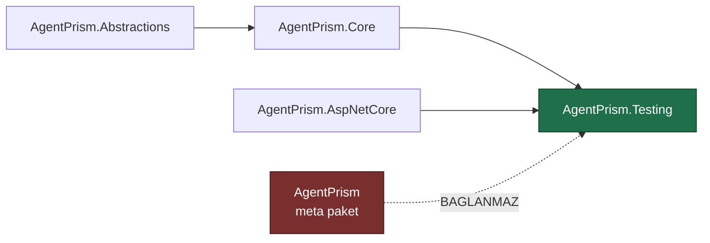

# Faz 39 — `AgentPrism.Testing` Paketi

> **Durum:** 📋 Planlandı (2026-08-06)
> **Kaynak:** [UCUNCU-FAZ-ADAYLARI.md](UCUNCU-FAZ-ADAYLARI.md) · **F-46**
> **Önkoşul:** Yok
> **Paketler:** `AgentPrism.Testing` (**yeni**), `AgentPrism.Abstractions`, `.Core`, `.AspNetCore`
> **Yeni paket:** **`AgentPrism.Testing`** — K-007 gerekçesi [39.1](#391--k-007-gerekçesi-neden-ayrı-bir-paket) · **Migration:** Yok
> **Public API:** büyüyor — 🚨 **bir kez doğru yapılmalıdır**; kırılırsa tüketicinin **tüm test paketi** kırılır

---

## Bu Faza Başlarken

> `faz-baslangic` skill'ini uygula. Aşağıdaki liste o skill'in 2. adımıdır —
> **tamamını değil, yalnız işaret edilen bölümleri oku.**

1. Bu doküman
2. Kararlar — dosyanın tamamını **okuma**, yalnız bu kalemleri grep'le:
   ```bash
   grep -n "K-001\|K-007\|K-008\|K-016\|K-018\|K-218" docs/KARARLAR.md
   ```
   **K-001** (modüler paket ailesi + meta paket — yeni paketin nereye
   oturacağını belirler), **K-007** (geçişli sabitleme kapalı — yeni paketin
   bağımlılık ağırlığı **sayılır**), **K-008** (ön sürüm MAF paketi yalnız
   `AspNetCore` içinde — test paketi bu kısıta uymak zorundadır),
   **K-018** (bellek içi `store`'lar birinci sınıf implementasyondur — test
   paketinin dayandığı temel), **K-016** (public API takibi Faz 7'ye ertelendi —
   bu fazın aciliyetinin sebebi), **K-218** (🚨 tool'un gördüğü servis sağlayıcı
   boştur — sahte tool yazan tüketici bu tuzağa düşecektir).
3. Alan hafızası (bu faz iki alana dokunuyor):
   [`hafiza/test-altyapisi.md`](hafiza/test-altyapisi.md) (**ana kaynak** —
   bugünkü sahte sağlayıcıların nasıl kullanıldığı),
   [`hafiza/build-ve-analyzer.md`](hafiza/build-ve-analyzer.md) (yeni paketin
   csproj, `slnx` ve paketleme kuralları)
4. Gerektiğinde, tamamı değil ilgili bölümü:
   [`MIMARI.md`](MIMARI.md) — paket ailesi bölümü

---

## Amaç

AgentPrism üzerine agent yazan biri, bugün kendi agent'ını **gerçek model
çağırmadan test edemez.** Test etmek için gereken her şey bu depoda **zaten
yazılmıştır** — ama test projelerinin içine kilitlidir ve `internal`'dır.

Bu faz o kodu birleştirir, tasarlar ve yayımlar. Yeni yetenek yazılmaz; var olan
yetenek **kullanılabilir hâle** getirilir.

- **F-46** — sahte model sağlayıcısı, bellek içi `host` fixture'ı ve çalıştırma
  iddiaları taşıyan bir test paketi.

### Bugün ne çalışmıyor — doğrulanmış kanıt

Beş ayrı sahte sağlayıcı, beş ayrı test projesinde yaşıyor:

| Kanıt | Satır | Gözlem |
|---|---|---|
| [`EchoModelProvider.cs`](../tests/AgentPrism.AspNetCore.FunctionalTests/Infrastructure/EchoModelProvider.cs) | 65 | `public` ama test projesinin içinde; tüketici erişemez |
| [`EchoModelProvider.cs`](../tests/AgentPrism.PostgreSql.IntegrationTests/Infrastructure/EchoModelProvider.cs) | 65 | 🚨 **İkinci kopya ve içerik AYNI DEĞİL** — `diff` fark bildiriyor |
| [`ScriptedModelProvider.cs`](../tests/AgentPrism.Ui.E2ETests/Infrastructure/ScriptedModelProvider.cs) | 190 | `internal`; senaryolu yanıt üretir |
| [`RoutingModelProvider.cs`](../tests/AgentPrism.AspNetCore.FunctionalTests/Infrastructure/RoutingModelProvider.cs) | 171 | `internal`; model adına göre yönlendirir |
| [`FakeModelProvider.cs`](../tests/AgentPrism.Core.UnitTests/Fakes/FakeModelProvider.cs) | 32 | `internal`; en yalın |
| [`AgentPrismTestHost.cs`](../tests/AgentPrism.AspNetCore.FunctionalTests/Infrastructure/AgentPrismTestHost.cs) | — | `StartAsync(…)` bellek içi bir host kurar. **Tüketicinin en çok isteyeceği tip budur ve erişilemez** |

Toplam **523 satır** kopyalanmış ve ayrışmış sahte sağlayıcı kodu.

Uygulanması gereken sözleşme ise küçüktür — üç üye:

```csharp
public interface IModelProvider
{
    string Name { get; }
    IReadOnlyList<ModelDescriptor> Models { get; }
    IChatClient CreateChatClient(ModelBinding binding);
}
```

> Kanıtlar 2026-08-06 tarihinde doğrulandı.

**Sorun bir yetenek eksikliği değildir; bir paketleme eksikliğidir.**

---

## 39.1 — K-007 gerekçesi: neden ayrı bir paket

K-007 her yeni pakette bir gerekçe ister. Gerekçe tek cümledir:

> **Test bağımlılığı üretim bağımlılık grafiğine girmemelidir.**

Sahte sağlayıcıyı `AgentPrism.Core` içine koymak, her üretim uygulamasına test
kodu taşırdı. `AgentPrism.Testing` tüketicinin yalnızca test projesinden
referans verdiği bir pakettir.

🚨 **Meta paket bu paketi taşımaz.** [`AgentPrism.csproj`](../src/AgentPrism/AgentPrism.csproj)
bugün altı proje referansı taşıyor; `AgentPrism.Testing` **eklenmez**. Meta
paket "tek referansla her şey" sözü verir ve test kodu o "her şey"in içinde
değildir.

### Bağımlılık yönü

`DependencyDirectionTests` dört kuralı zorluyor: izin verilen referanslar,
`Abstractions`'ın hiçbir AgentPrism paketine referans vermemesi, grafikte döngü
olmaması ve **her yayımlanabilir pakette README bulunması.** Yeni paket bu
kayıt defterine eklenir.



`AgentPrism.AspNetCore`'a bağlanmak bir karardır ve gerekçesi şudur: tüketicinin
en çok isteyeceği tip bellek içi `host` fixture'ıdır ve o, uçları kuran paketi
gerektirir.

> 🚨 **K-008 kısıtı burada geçerlidir.** `AgentPrism.AspNetCore` ön sürüm MAF
> paketleri taşıyabilen tek pakettir. `AgentPrism.Testing` ona bağlandığı için
> o ön sürüm bağımlılıkları **geçişli olarak** devralır. Bu kabul edilebilir —
> test paketi zaten üretim grafiğinde değildir — ama devir notunda yazılmalıdır.

## 39.2 — Çerçeveden bağımsızlık

Paket **hiçbir test çerçevesine bağlanmaz.** xunit, NUnit, MSTest, Shouldly,
FluentAssertions — hiçbiri `PackageReference` olmaz.

| Neden |
|---|
| Tüketici hangi çerçeveyi kullanırsa kullansın paket çalışır |
| K-007'nin saydığı geçişli ağırlık sıfır kalır |
| `Microsoft.AspNetCore.Mvc.Testing` deseninin aynısı — o da çerçeve seçmez |

İddialar başarısız olduğunda kendi istisnasını fırlatır:

```csharp
public sealed class AgentPrismAssertionException : AgentPrismException
```

Her test çerçevesi fırlatılan istisnayı başarısızlık sayar. Mesaj **ne
beklendiğini ve ne bulunduğunu** yazar; yığın izi tek başına yeterli değildir.

> Bu depo kendi testlerinde xunit + Shouldly kullanmaya devam eder. Paket bunu
> tüketiciye dayatmaz.

## 39.3 — Üç yetenek

### (a) Sahte model sağlayıcısı

Beş kopya tek bir yapılandırılabilir tipte birleşir. Bugünkü beş davranışın
tamamı korunur:

| Bugünkü kopya | Yeni karşılığı |
|---|---|
| `FakeModelProvider` (32 satır) | Varsayılan kurulum |
| `EchoModelProvider` (65 satır ×2) | `EchoesUserMessage()` |
| `ScriptedModelProvider` (190 satır) | `RespondsWith(…)` sırası |
| `RoutingModelProvider` (171 satır) | `ForModel("x").RespondsWith(…)` |
| — | `CallsTool("ad", args)` — tool çağrısı üretimi |

🚨 **İki `EchoModelProvider` kopyası aynı değildir.** Birleştiren oturum
`diff` çıktısını okumalı ve **hangi davranışın doğru olduğuna** karar
vermelidir. Sessizce birini seçmek, bugün geçen bir testi kıran en olası
yoldur.

### (b) Bellek içi `host` fixture'ı

`AgentPrismTestHost.StartAsync(…)` deseni public bir tipe taşınır. Tüketici
kendi agent'ını, kendi tool'larını ve kendi tanımlarını kaydeder; gerçek uçlar
üzerinden HTTP ile konuşur.

Bellek içi `store`'lar K-018 sayesinde **birinci sınıf implementasyondur** —
fixture bir veritabanı gerektirmez.

### (c) Çalıştırma iddiaları

`RunRecord` ve `run_events` zaten her şeyi kaydediyor. İddialar o kayıtları
okur:

```csharp
run.ShouldHaveCompleted();
run.ShouldHaveCalledTool("refund_order");
run.ShouldHaveCalledTool("refund_order", times: 1);
run.ShouldNotHaveCalledTool("delete_account");
run.ShouldHaveFailedWith("content_filtered");
```

Son satır Faz 26'nın `AgentPrismContentFilteredException.ContentFilteredErrorType`
kararlı adına dayanır — kararlı ad tam olarak bunun için vardı.

## 39.4 — K-218 tuzağı paketin dokümanına girer

`MEMORY.md` ve K-218 şunu kaydediyor: **tool'un gördüğü servis sağlayıcı
boştur.** MAF `AIFunctionArguments.Services` olarak `EmptyServiceProvider`
geçirir; bir tool bağımlılığını **kurulum anında** almalıdır.

Test paketi yazan tüketici bu tuzağa **kesinlikle** düşecektir: sahte bir tool
yazacak, DI'dan bir bağımlılık bekleyecek ve `null` alacaktır. Paketin README'si
ve fixture'ın XML dokümanı bunu açıkça yazar ve doğru deseni gösterir
(`new BenimTool(provider)` + fabrika kaydı).

> Faz 28'in ikinci dersi de buraya yazılır: **izole ölçüm entegre davranışı
> kanıtlamaz.** Test paketi gerçek boru hattını kurar, ayrı bir prob değildir.

---

## Planlanan Public API

> Taslak imzalardır. Gerçekleşen imzalar kapanışta ayrı bir bölüme yazılır.

```csharp
// AgentPrism.Testing

/// <summary>Aga cikmayan, yapilandirilabilir sahte model saglayicisi.</summary>
public sealed class FakeModelProvider : IModelProvider, IDisposable
{
    public FakeModelProvider(string name = "fake");

    public string Name { get; }
    public IReadOnlyList<ModelDescriptor> Models { get; }

    /// <summary>Bu saglayiciya bir model tanimlar.</summary>
    public FakeModelProvider WithModel(ModelDescriptor descriptor);

    /// <summary>Sirayla dondurulecek yanitlari ekler.</summary>
    public FakeModelProvider RespondsWith(params string[] responses);

    /// <summary>Gelen son kullanici mesajini yankilar.</summary>
    public FakeModelProvider EchoesUserMessage();

    /// <summary>Bir tool cagrisi uretir.</summary>
    public FakeModelProvider CallsTool(string toolName, object? arguments = null);

    /// <summary>Belirli bir model adi icin ayri davranis tanimlar.</summary>
    public FakeModelProvider ForModel(string modelId, Action<FakeModelProvider> configure);

    /// <summary>Saglayiciya ulasan istekler; en yeni sonuncudur.</summary>
    public IReadOnlyList<FakeModelRequest> Requests { get; }

    public IChatClient CreateChatClient(ModelBinding binding);
    public void Dispose();
}

/// <summary>Sahte saglayiciya ulasan tek bir istek.</summary>
public sealed record FakeModelRequest
{
    public required IReadOnlyList<ChatMessage> Messages { get; init; }
    public ChatOptions? Options { get; init; }
    public bool IsStreaming { get; init; }
}

/// <summary>Bellek ici AgentPrism host'u.</summary>
public sealed class AgentPrismTestHost : IAsyncDisposable
{
    public static ValueTask<AgentPrismTestHost> StartAsync(
        Action<AgentPrismTestHostOptions>? configure = null,
        CancellationToken cancellationToken = default);

    /// <summary>Host'a baglı HTTP istemcisi.</summary>
    public HttpClient Client { get; }

    /// <summary>Host'un servis saglayicisi.</summary>
    public IServiceProvider Services { get; }

    /// <summary>Bir agent'i calistirir ve kaydini dondurur.</summary>
    public ValueTask<RunAssertions> RunAsync(
        string agentName,
        string message,
        CancellationToken cancellationToken = default);

    public ValueTask DisposeAsync();
}

/// <summary>Kaydedilmis bir calistirma uzerinde iddialar.</summary>
public sealed class RunAssertions
{
    public RunRecord Record { get; }
    public IReadOnlyList<RunEvent> Events { get; }
    public IReadOnlyList<ToolInvocationRecord> ToolInvocations { get; }

    public RunAssertions ShouldHaveCompleted();
    public RunAssertions ShouldHaveFailed();
    public RunAssertions ShouldHaveFailedWith(string errorType);
    public RunAssertions ShouldHaveCalledTool(string toolName, int? times = null);
    public RunAssertions ShouldNotHaveCalledTool(string toolName);
    public RunAssertions ShouldHaveOutputContaining(string text);
}

/// <summary>Iddia karsilanmadiginda firlatilir.</summary>
public sealed class AgentPrismAssertionException : AgentPrismException;
```

> 🚨 Bu yüzeyin tamamı Faz 7'den **önce** yayımlanmalıdır. Bir test yardımcısı
> API'sini kırmak, tüketicinin tek bir testini değil **tüm test paketini**
> kırar — üretim API'sini kırmaktan daha görünür bir hatadır.

### HTTP `endpoint`'leri

Yok. Bu faz uç eklemez.

### Arayüz payı

**Yok.** Arayüze dokunulmaz.

---

## Planlanan Dosya Listesi

```
src/AgentPrism.Testing/
├── AgentPrism.Testing.csproj
├── README.md                       (DependencyDirectionTests bunu ZORUNLU kilar)
├── FakeModelProvider.cs
├── FakeModelRequest.cs
├── Internal/FakeChatClient.cs
├── AgentPrismTestHost.cs
├── AgentPrismTestHostOptions.cs
├── RunAssertions.cs
└── AgentPrismAssertionException.cs

tests/AgentPrism.Testing.UnitTests/      (YENI test projesi)
└── ...

AgentPrism.slnx                          (yeni proje + yeni test projesi)
README.md                                (paket tablosuna bir satir)
tests/AgentPrism.Core.UnitTests/Architecture/DependencyDirectionTests.cs
                                         (AllowedReferences'a yeni kayit)
```

### Kaldırılan kopyalar

```
tests/AgentPrism.AspNetCore.FunctionalTests/Infrastructure/EchoModelProvider.cs     SILINIR
tests/AgentPrism.PostgreSql.IntegrationTests/Infrastructure/EchoModelProvider.cs    SILINIR
tests/AgentPrism.AspNetCore.FunctionalTests/Infrastructure/RoutingModelProvider.cs  SILINIR
tests/AgentPrism.Ui.E2ETests/Infrastructure/ScriptedModelProvider.cs                SILINIR
tests/AgentPrism.Core.UnitTests/Fakes/FakeModelProvider.cs                          SILINIR
```

> 🚨 **Kopyaları silmek bu fazın işidir, sonraki fazın değil.** Depoda hem yeni
> paket hem eski kopyalar kalırsa ikisi ayrışır ve bugünkü sorun büyür.
> `MEMORY.md`'nin kopya dosya dersi bunun kardeşidir.

---

## Testler

| Test sınıfı | Neyi doğrular |
|---|---|
| `FakeModelProviderTests` | Beş davranışın (varsayılan, echo, senaryo, yönlendirme, tool çağrısı) her biri |
| `FakeModelProviderRequestTests` | `Requests` gelen mesajları ve `ChatOptions`'ı doğru kaydeder |
| `AgentPrismTestHostTests` | Host açılır, `/api/meta` yanıt verir, `DisposeAsync` kaynakları bırakır |
| `RunAssertionsTests` | Her iddia hem geçen hem **düşen** yolda doğrulanır; düşen yol mesajı beklenen ve bulunan değeri yazar |
| `RunAssertionsToolTests` | `ShouldHaveCalledTool(times:)` sayıyı doğru sayar |
| `TestingPackageDependencyTests` | 🚨 `AgentPrism.Testing` hiçbir test çerçevesine referans vermez; **meta paket ona referans vermez** |
| `DependencyDirectionTests` (mevcut) | Yeni paket kayıt defterinde; README var; grafik döngüsüz |
| Mevcut test paketlerinin **tamamı** | Kopyalar silindikten sonra yeni paketle koşar ve geçer |

---

## Açık Sorular

> Planı bloklamayan, faz uygulanırken karara bağlanacak sorular. Bloklayan
> sorular plan yazılmadan **önce** sorulur.

| # | Soru | Seçenekler | Öneri |
|---|---|---|---|
| 1 | İki `EchoModelProvider` kopyası hangi davranışta birleşsin? | A: `diff` okunur, davranış farkı bilinçli seçilir · B: fonksiyonel testlerdeki kopya esas alınır | **A.** Fark ölçülmeden seçim yapmak bugün geçen bir testi kırar. `diff` çıktısı kapanış bölümüne yazılır |
| 2 | `AgentPrismTestHost` `WebApplicationFactory` üstüne mi kurulsun? | A: hayır, kendi `IHost`'unu kurar · B: evet | **A.** B, `Microsoft.AspNetCore.Mvc.Testing` bağımlılığı getirir ve tüketiciyi bir test barındırma modeline bağlar. K-007'nin saydığı ağırlık artar |
| 3 | `RunAssertions` akışlı (`streaming`) çalıştırmaları da kapsasın mı? | A: evet, aynı kayıt okunur · B: hayır | **A.** `run_events` akışlı yolda da dolar; ayrı bir tip gereksizdir |
| 4 | Sahte **voice** sağlayıcısı (`StubVoiceProvider`) bu pakete girsin mi? | A: bu fazda hayır · B: evet | **A.** `AgentPrism.Voice` ayrı bir pakettir; test paketini ona bağlamak grafiği büyütür. Ayrı bir aday kalemdir |
| 5 | Paket AOT uyumlu işaretlensin mi? | A: **ölçülmeli** · B: hayır | **A.** Test paketi üretimde çalışmaz, ama `AgentPrism.AspNetCore` bağımlılığı duruşu belirler. Uygulayan oturum ölçer ve yazar |

---

## Bitiş Ölçütleri (DoD)

- [ ] `AgentPrism.Testing` paketlenir; `nuspec` **hiçbir test çerçevesi**
      bağımlılığı taşımaz (`dotnet pack` çıktısı okunarak doğrulanır)
- [ ] Meta paket `AgentPrism` bu pakete referans **vermez**
- [ ] Beş sahte sağlayıcı kopyasının **hepsi silindi**; `find tests -name "*ModelProvider.cs"`
      yalnızca gerçek sağlayıcı testlerini döndürür
- [ ] Mevcut test paketlerinin tamamı yeni paketle koşar ve geçer
- [ ] Depo dışından bir tüketici senaryosu çalıştı: `samples/` altında veya
      geçici bir projede, AgentPrism'e bağlı bir agent **gerçek model
      çağırmadan** test edildi; komut ve çıktı bu belgeye yazıldı
- [ ] Her iddia hem geçen hem düşen yolda test edildi; düşen yol mesajı
      **beklenen ve bulunan** değeri içeriyor
- [ ] `DependencyDirectionTests` yeni paketi tanıyor ve README denetimi geçiyor
- [ ] 🚨 K-218 tuzağı paketin README'sinde ve fixture XML dokümanında yazılı
- [ ] Dört doğrulama kapısı sıfır uyarı verir
- [ ] `samples/AgentPrism.Api` ile gerçek `run` yapıldı, çıktı bu belgeye yazıldı
- [ ] `secret` taraması boş döndü

### Doğrulama komutları

```bash
# Paket bagimliliklari — test cercevesi GORUNMEMELI
dotnet pack src/AgentPrism.Testing -c Release --no-build
unzip -p src/AgentPrism.Testing/bin/Release/AgentPrism.Testing.*.nupkg \
  AgentPrism.Testing.nuspec | grep -A20 "<dependencies>"

# Meta paket Testing'e baglanmamali
grep -c "AgentPrism.Testing" src/AgentPrism/AgentPrism.csproj   # 0 olmali

# Kopyalar silindi mi
find tests -name "EchoModelProvider.cs" -o -name "ScriptedModelProvider.cs" \
  -o -name "RoutingModelProvider.cs" -o -name "FakeModelProvider.cs"   # bos olmali

# Kopya dosya denetimi (MEMORY.md dersi)
find src -name "* 2.*"    # bos olmali
```

---

## Riskler

| Risk | Önlem |
|------|-------|
| 🚨 Public test API'si kırılırsa tüketicinin **tüm** test paketi kırılır | Faz 7'den **önce** yayımlanır; her tip ve üye kapanışta gözden geçirilir |
| İki `EchoModelProvider` farkı sessizce kaybolur ve bir test kırılır | Açık Soru 1; `diff` çıktısı okunur ve karar kapanışa yazılır |
| Yeni paket geçişli bağımlılık getirir | `nuspec` DoD'de **okunarak** doğrulanır; çerçeveden bağımsızlık kuralı bunu sıfırda tutar |
| 🚨 `AgentPrism.AspNetCore` üzerinden ön sürüm MAF bağımlılığı geçişli gelir (K-008) | Kabul edilir — test paketi üretim grafiğinde değildir — ama devir notunda **yazılır** |
| Meta pakete yanlışlıkla eklenir | `TestingPackageDependencyTests` bunu bir testle kapatır |
| Kopyalar silinmeden yeni paket eklenir; ikisi ayrışır | Silme DoD kalemidir ve `find` komutuyla doğrulanır |
| 🚨 Tüketici sahte tool yazar, DI bağımlılığı `null` gelir (K-218) | README ve XML dokümanı doğru deseni gösterir; bir örnek test bunu kanıtlar |

---

<!-- ============================================================
     AŞAĞISI KAPANIŞTA DOLDURULUR — `faz-tamamlama` skill'i.
     Plan anında boş kalır. Başlıkları SİLME.
     ============================================================ -->

## Plandan Sapmalar

> Kapanışta doldurulur. Plan ile gerçek arasındaki fark **gizlenmez** — sonraki
> oturumun en değerli bilgisidir.

## Bu Fazda Verilen Kararlar

> Kapanışta doldurulur. K-NNN numaraları burada alınır; plan numara rezerve etmez.
> **Not:** İki `EchoModelProvider` kopyası arasındaki fark ve seçilen davranış
> burada kayda geçer.

## Gerçekleşen Public API

> Kapanışta doldurulur. Koddaki **gerçek** imzalar.

## Dosya Listesi (gerçekleşen)

> Kapanışta doldurulur.

## Sonraki Faza Devir Notu

> Kapanışta doldurulur: devralınan sözleşmeler, bilinen tuzaklar (🚨), yarım
> kalan işler, sıradaki faz.
>
> **Not:** `AgentPrism.Testing`'in geçişli olarak devraldığı ön sürüm MAF
> paketleri (K-008) burada **listelenmelidir**.
