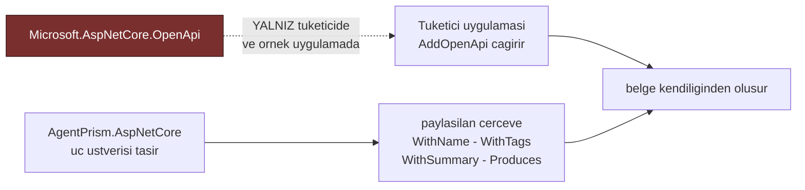
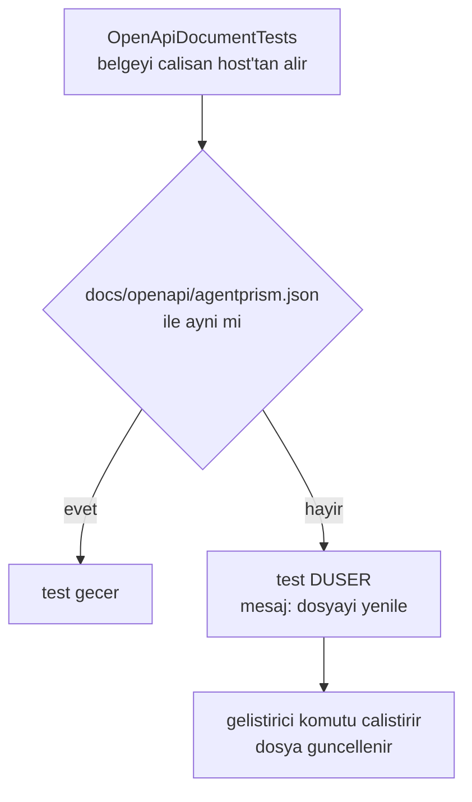

# Faz 40 — OpenAPI Belgesinin Yayımlanması

> **Durum:** ✅ Tamamlandı (2026-08-07)
> **Kaynak:** [UCUNCU-FAZ-ADAYLARI.md](UCUNCU-FAZ-ADAYLARI.md) · **F-63**
> **Önkoşul:** Yok
> **Paketler:** `AgentPrism.AspNetCore`
> **Yeni paket:** Yok — 🚨 gerekçe [40.1](#401--k-039-korunur--bu-fazın-ana-kısıtı) · **Migration:** Yok
> **Public API:** büyümüyor — uç **üstverisi** zenginleşir, imzalar değişmez

---

## Bu Faza Başlarken

> `faz-baslangic` skill'ini uygula. Aşağıdaki liste o skill'in 2. adımıdır —
> **tamamını değil, yalnız işaret edilen bölümleri oku.**

1. Bu doküman
2. Kararlar — dosyanın tamamını **okuma**, yalnız bu kalemleri grep'le:
   ```bash
   grep -n "K-007\|K-039" docs/KARARLAR.md
   sed -n '35p' docs/KARARLAR.md      # reddedilen is L35
   ```
   **K-039** (🚨 **bu fazın ana kısıtı** — kütüphane OpenAPI üretimini
   dayatmaz, yalnız üstveri taşır; `Microsoft.AspNetCore.OpenApi` CVE'li
   `Microsoft.OpenApi` 2.0.0 çeker), **L35** (reddedilen iş: OpenAPI paketi
   `AgentPrism.AspNetCore` bağımlılığı **yapılmadı** — bu faz o kararı
   **değiştirmez**), **K-007** (geçişli sabitleme kapalı; CVE'li sürüm tek
   bilinçli `PackageReference` ile zorlanır).
3. Alan hafızası (bu faz iki alana dokunuyor):
   [`hafiza/aspnetcore-di.md`](hafiza/aspnetcore-di.md) (**ana kaynak** —
   uç kayıt deseni, `MapGroup`, uç üstverisi),
   [`hafiza/build-ve-analyzer.md`](hafiza/build-ve-analyzer.md) (paket
   bağımlılığı ve CVE denetimi)
4. Gerektiğinde, tamamı değil ilgili bölümü:
   [`MIMARI.md`](MIMARI.md) — HTTP yüzeyi bölümü

---

## Amaç

Kendi arayüzünü yazmak veya AgentPrism'i bir dağıtım hattına bağlamak isteyen
tüketici, uçları bugün **elle** okumak zorundadır. Belge üretiliyor ama
kullanılabilir değil: 121 ucun tamamı tek bir `AgentPrism` etiketi altında
duruyor ve **on bir uç hiçbir yanıt şeması bildirmiyor** — bunlardan biri
agent'ı çalıştıran uçtur.

Bu faz belgeyi *üretilebilir* olmaktan çıkarıp **kullanılabilir** yapar.

- **F-63** — uç etiketlerinin alan bazında ayrılması, yanıt şeması üretmeyen
  on bir ucun kapatılması ve belgenin yayımlanabilir bir artefakt hâline
  getirilmesi.

### Bugün ne çalışmıyor — doğrulanmış kanıt

Aday listesi "uçların üstverisi zaten var" diyordu. **Yarısı doğru.** Ölçüm:

| Ölçüm | Değer | Sonuç |
|---|---|---|
| `Map*` çağrısı | **121** | Toplam uç sayısı |
| `WithName` | **121** | ✅ Tam kapsama — `operationId` her uçta var |
| `WithSummary` | **119** | ✅ Neredeyse tam — iki uç eksik |
| `WithTags` | **5** | 🚨 Beşi de **grup düzeyinde** ve hepsi aynı etiketi yazıyor: `"AgentPrism"` |
| `.Produces` | **0** | Hiç kullanılmıyor — ama gerek de yok, [40.2](#402--yanıt-şeması-tipli-sonuçlardan-gelir) |
| Tipli sonuç imzası (`Task<Ok<…>>`, `Task<Results<…>>`) | **103** | ✅ Yanıt şeması bunlardan **kendiliğinden** çıkar |
| Ham `Task<IResult>` imzası | **11** | 🚨 **Bu on bir uç hiçbir yanıt şeması üretmez** |

Etiketlerin tamamı beş `MapGroup` çağrısında yazılıyor:

| Kanıt | Gözlem |
|---|---|
| [`AgentPrismEndpointRouteBuilderExtensions.cs:83,87,183,224,248`](../src/AgentPrism.AspNetCore/AgentPrismEndpointRouteBuilderExtensions.cs) | Beş grup, beşinde de `.WithTags("AgentPrism")` — 121 uç tek bir kova |
| [`OpenApiDocumentTests.cs:47`](../tests/AgentPrism.AspNetCore.FunctionalTests/OpenApiDocumentTests.cs) | Test bunu doğruluyor: `meta.GetProperty("tags")[0].GetString().ShouldBe("AgentPrism")` |

Yanıt şeması üretmeyen on bir uç:

| Dosya:satır | Uç |
|---|---|
| [`AgentEndpoints.cs:293`](../src/AgentPrism.AspNetCore/Endpoints/AgentEndpoints.cs) | 🚨 `POST /api/agents/{name}/run` — **ürünün ana ucu** |
| [`WorkflowEndpoints.cs:212,267,320`](../src/AgentPrism.AspNetCore/Endpoints/WorkflowEndpoints.cs) | workflow `run` · `resume` · `respond` |
| [`AttachmentEndpoints.cs:112`](../src/AgentPrism.AspNetCore/Endpoints/AttachmentEndpoints.cs) | ek indirme |
| [`OpenAIChatCompletionsEndpoints.cs:53`](../src/AgentPrism.AspNetCore/OpenAICompat/OpenAIChatCompletionsEndpoints.cs) | `POST /v1/chat/completions` |
| [`OpenAIResponsesEndpoints.cs:75`](../src/AgentPrism.AspNetCore/OpenAICompat/OpenAIResponsesEndpoints.cs) | `POST /v1/responses` |
| [`OpenAIConversationsEndpoints.cs:71,112,135,158`](../src/AgentPrism.AspNetCore/OpenAICompat/OpenAIConversationsEndpoints.cs) | conversations dört uç |

> Kanıtlar 2026-08-06 tarihinde doğrulandı.

**Bu on bir ucun ortak yanı, hepsinin koşullu yanıt üretmesidir**: akışlı mı
değil mi, kabul edildi mi reddedildi mi, ek var mı yok mu. `Task<IResult>` bu
yüzden seçilmişti ve seçim o zaman doğruydu. Bedeli belgede görünüyor.

---

## 40.1 — K-039 korunur — bu fazın ana kısıtı

🚨 **Bu faz `Microsoft.AspNetCore.OpenApi` paketini `AgentPrism.AspNetCore`'a
bağımlılık yapmaz.** K-039 ve reddedilen iş L35 bunu iki ayrı gerekçeyle
kapatmıştır:

1. Bir kütüphane tüketicinin bağımlılık grafiğine OpenAPI üretimi dayatmamalıdır
   (ölçüldü: nuspec 3 doğrudan bağımlılık taşıyor).
2. `Microsoft.AspNetCore.OpenApi` 10.0.10, CVE'li `Microsoft.OpenApi` 2.0.0
   çekiyor (NU1903, GHSA-v5pm-xwqc-g5wc).

Bu faz **hiçbirini değiştirmez.** Model aynı kalır:



Kullanılan her API — `WithName`, `WithTags`, `WithSummary`, `WithDescription`,
`Produces`, `ProducesProblem`, `Accepts` — **paylaşılan çerçevededir**
(`Microsoft.AspNetCore.App`). Yeni `PackageReference` yoktur.

> Uygulayan oturum bunu bir varsayım olarak almasın: kullanacağı her yeni
> uzantı metodunun paylaşılan çerçevede olduğunu `dotnet build` ile **kanıtlar**.
> Çerçevede olmayan bir metot bulunursa o metot kullanılmaz.

## 40.2 — Yanıt şeması tipli sonuçlardan gelir

103 uç `Task<Ok<T>>` veya `Task<Results<Ok<T>, ProblemHttpResult>>` döndürüyor.
ASP.NET Core bu tiplerden yanıt şemasını **kendiliğinden** çıkarır; `.Produces`
çağrısı gereksizdir. Bu yüzden `.Produces` sayısının sıfır olması bir eksiklik
**değildir**.

Eksiklik yalnız `Task<IResult>` dönen on bir uçtadır. İki yol vardır:

| Yol | Nasıl | Değerlendirme |
|---|---|---|
| **A** — imzayı `Results<…>` yap | Handler'ın dönüş tipi tüm olası sonuçları sayar | Derleyici zorlar, üstveri kendiliğinden doğru. Ama koşullu yollarda imza uzar ve akışlı yanıt `Results<…>` içinde ifade edilemez |
| **B** — `.Produces<T>(status)` ekle | Uç kaydına elle üstveri yazılır | Akışlı ve ikili (`binary`) yanıtları ifade edebilir. Ama imzadan **kopar**; kod değişir, üstveri bayatlar |

**Seçim: uca göre.** Kural basittir:

- Dönüş kümesi **sonlu ve tipli** ise → **A**. Derleyici bakımı üstlenir.
- Yanıt **akışlı** (SSE) veya **ikili** ise → **B**. `Results<…>` bunu ifade
  edemez; `.Produces` ile `text/event-stream` veya `application/octet-stream`
  yazılır.

Ölçüm gerektiren nokta: on bir ucun hangisi hangi kovaya düşüyor. Uygulayan
oturum her handler'ın gövdesini okur ve tabloyu kapanışa yazar.

> 🚨 `POST /api/agents/{name}/run` **hem** akışlı **hem** akışsız yanıt
> üretebilir. Bu uç ikisini birden bildirmelidir: akışsız yol için tipli yanıt,
> akışlı yol için `text/event-stream`. Tek birini yazmak, üretilen istemcinin
> diğerini görmemesine yol açar.

## 40.3 — Etiketlerin alan bazında ayrılması

Bugün 121 uç tek bir `AgentPrism` etiketi taşıyor. Bir istemci üreteci bundan
**tek bir sınıf** üretir: 121 metotlu bir `AgentPrismClient`. Belgeyi okuyan
insan için de tek bir 121 satırlık liste çıkar.

Etiketler dosya sınırlarına göre bölünür — `Endpoints/` klasörü zaten doğru
ayrımı yapmış durumda:

| Etiket | Kaynak dosya |
|---|---|
| `Agents` | `AgentEndpoints.cs`, `CatalogEndpoints.cs` |
| `Runs` | `RunEndpoints.cs`, `ObservabilityEndpoints.cs` |
| `Sessions` | `SessionEndpoints.cs` |
| `Evals` | `EvalEndpoints.cs` |
| `Experiments` | `ExperimentEndpoints.cs` |
| `Workflows` | `WorkflowEndpoints.cs` |
| `Scheduling` | `SchedulingEndpoints.cs` |
| `Governance` | `GovernanceEndpoints.cs`, `AuditEndpoints.cs`, `QuotaEndpoints.cs`, `SkillScriptGrantEndpoints.cs` |
| `Skills` | `SkillEndpoints.cs` |
| `Models` | `ModelHealthEndpoints.cs` |
| `Retention` | `RetentionEndpoints.cs` |
| `Webhooks` | `WebhookEndpoints.cs` |
| `Attachments` | `AttachmentEndpoints.cs` |
| `Voice` | `VoiceEndpoints.cs` |
| `Meta` | `MetaEndpoints.cs` |
| `OpenAI` | `OpenAICompat/*` |

🚨 **`AgentPrism` etiketi kaldırılmaz, korunur.** İki gerekçe:

1. [`OpenApiDocumentTests.cs:47`](../tests/AgentPrism.AspNetCore.FunctionalTests/OpenApiDocumentTests.cs)
   `tags[0] == "AgentPrism"` iddiasını taşıyor. Bu iddia bir sözleşmedir:
   tüketici kendi uçlarıyla karışan bir belgede AgentPrism uçlarını bu etiketle
   ayırıyor olabilir.
2. Etiket **çoğuldur**. Her uç iki etiket taşır: `AgentPrism` (kapsayıcı) ve
   alan etiketi. Grup düzeyindeki `WithTags("AgentPrism")` kalır; uç düzeyinde
   ikinci bir etiket eklenir.

## 40.4 — Yayımlanan artefakt

Belge bugün yalnız **çalışan bir uygulamada** üretilebiliyor. Bir istemci
üreteci veya bir dağıtım hattı, uygulamayı ayağa kaldırmadan belgeye
erişemiyor.

Depoya işlenmiş bir `openapi.json` üretilir ve **bir test onu güncel tutar**:



Bu desen, dokümanın koddan sapmasını **derleme kapısına** çevirir —
`AGENTS.md`'nin "doküman ile kod çelişirse doküman yanlıştır" kuralının
otomatik hâlidir.

> Dosya `docs/openapi/` altına konur, `src/` altına değil. Paketlenen bir
> varlık değildir; bir belgedir.

---

## Planlanan Public API

> Taslak imzalardır. Gerçekleşen imzalar kapanışta ayrı bir bölüme yazılır.

Public C# yüzeyi **büyümez.** Değişen şey uç kayıtlarının üstverisidir:

```csharp
// Ornek — mevcut kayit
builder.MapPost("/api/agents/{name}/run", RunAsync)
    .WithName("AgentPrismRunAgent")
    .WithSummary("Bir agent'i calistirir.");

// Ornek — bu fazdan sonra
builder.MapPost("/api/agents/{name}/run", RunAsync)
    .WithName("AgentPrismRunAgent")
    .WithSummary("Bir agent'i calistirir.")
    .WithTags("Agents")
    .Accepts<AgentRunRequest>("application/json")
    .Produces<AgentRunResult>(StatusCodes.Status200OK)
    .Produces(StatusCodes.Status200OK, contentType: "text/event-stream")
    .ProducesProblem(StatusCodes.Status400BadRequest)
    .ProducesProblem(StatusCodes.Status404NotFound);
```

> Yukarıdaki tip adları (`AgentRunRequest`, `AgentRunResult`) **taslaktır**.
> Uygulayan oturum `Contracts/` altındaki gerçek sözleşme tiplerini kullanır.

### HTTP `endpoint`'leri

Yeni uç **yok**. Var olan 121 ucun üstverisi zenginleşir.

### Arayüz payı

**Yok.** Arayüze dokunulmaz.

---

## Planlanan Dosya Listesi

```
src/AgentPrism.AspNetCore/
├── AgentPrismEndpointRouteBuilderExtensions.cs   (grup etiketleri korunur)
└── Endpoints/*.cs                                (uc bazli etiket + Produces)
    OpenAICompat/*.cs                             (ayni)

docs/openapi/agentprism.json                      (YENI — yayimlanan artefakt)

tests/AgentPrism.AspNetCore.FunctionalTests/
└── OpenApiDocumentTests.cs                       (genisletilir)
```

---

## Testler

| Test sınıfı | Neyi doğrular |
|---|---|
| `OpenApiDocumentTests` (mevcut, genişletilir) | Belge üretilir; mevcut üç test korunur |
| `OpenApiTagCoverageTests` | 🚨 **Her ucun en az iki etiketi vardır**: `AgentPrism` + bir alan etiketi. Etiketsiz uç kalırsa test düşer |
| `OpenApiResponseSchemaTests` | 🚨 On bir ucun **hepsi** en az bir yanıt şeması bildirir. `POST /api/agents/{name}/run` hem tipli hem `text/event-stream` yanıtı bildirir |
| `OpenApiOperationIdTests` | 121 `operationId` **benzersizdir** — istemci üreteci çakışmada metot ezer |
| `OpenApiSnapshotTests` | `docs/openapi/agentprism.json` çalışan host'un ürettiği belgeyle aynıdır; farklıysa yenileme komutunu yazan bir mesajla düşer |
| `OpenApiDependencyTests` | 🚨 `AgentPrism.AspNetCore.csproj` `Microsoft.AspNetCore.OpenApi` **taşımaz** (K-039 / L35 koruması) |

---

## Açık Sorular

> Planı bloklamayan, faz uygulanırken karara bağlanacak sorular. Bloklayan
> sorular plan yazılmadan **önce** sorulur.

| # | Soru | Seçenekler | Öneri |
|---|---|---|---|
| 1 | On bir uç için A (tipli `Results<…>`) mı B (`.Produces`) mi? | A: imza · B: üstveri · C: uca göre | **C.** Sonlu ve tipli dönüş kümesinde A (derleyici bakımı üstlenir); akışlı ve ikili yanıtta B (`Results<…>` bunu ifade edemez). Karar tablosu kapanışa yazılır |
| 2 | Anlık görüntü (`snapshot`) dosyası nasıl yenilenir? | A: bir ortam değişkeniyle testin kendisi yazar · B: ayrı bir script | **A.** Ayrı script bayatlar; testin kendisi yazarsa yenileme komutu tektir ve düşen testin mesajında durur |
| 3 | Belge sürümlenmeli mi (`v1`)? | A: tek belge, sürümsüz · B: sürümlü | **A.** HTTP sözleşmesi bugün sürümlü değil; belgeyi sürümlemek olmayan bir sözleşmeyi taklit eder. Faz 7'de yeniden değerlendirilir |
| 4 | `/v1/*` OpenAI uyumlu uçları belgeye girsin mi? | A: evet, `OpenAI` etiketiyle · B: hayır | **A.** Mevcut test bu uçların belgede olduğunu zaten doğruluyor; çıkarmak bir geriye gidiştir |
| 5 | İki `WithSummary`'si eksik uç hangileri? | A: **ölçülmeli** ve tamamlanmalı | **A.** 121 − 119 = 2. Uygulayan oturum bulur ve doldurur |

---

## Bitiş Ölçütleri (DoD)

- [ ] 🚨 `AgentPrism.AspNetCore.csproj` **hâlâ** `Microsoft.AspNetCore.OpenApi`
      taşımıyor (K-039 ve L35 korundu)
- [ ] Belgedeki **her** ucun en az iki etiketi var: `AgentPrism` + alan etiketi
- [ ] On bir `Task<IResult>` ucunun **hepsi** yanıt şeması bildiriyor
- [ ] `POST /api/agents/{name}/run` hem tipli yanıtı hem `text/event-stream`
      yanıtını bildiriyor
- [ ] 121 `operationId` benzersiz
- [ ] Eksik iki `WithSummary` tamamlandı; sayı 121/121
- [ ] `docs/openapi/agentprism.json` işlendi ve anlık görüntü testi geçiyor
- [ ] Belge bir istemci üretecinden geçirildi ve **hata vermeden** derlenen bir
      çıktı üretti; kullanılan komut ve sonuç bu belgeye yazıldı
- [ ] Dört doğrulama kapısı sıfır uyarı verir
- [ ] `samples/AgentPrism.Api` ile gerçek `run` yapıldı, çıktı bu belgeye yazıldı
- [ ] `secret` taraması boş döndü

### Doğrulama komutları

```bash
# Bagimlilik korumasi — cikti BOS olmali
grep -n "Microsoft.AspNetCore.OpenApi\|Microsoft.OpenApi" \
  src/AgentPrism.AspNetCore/AgentPrism.AspNetCore.csproj

# Ornek uygulamayi calistir, belgeyi al
curl -s http://localhost:5081/openapi/v1.json > /tmp/apidoc.json

# Etiketsiz (tek etiketli) uc kalmis mi — cikti BOS olmali
jq -r '.paths | to_entries[] | .key as $p | .value | to_entries[]
       | select((.value.tags // []) | length < 2)
       | "\($p) \(.key)"' /tmp/apidoc.json

# Yanit semasi olmayan uc kalmis mi — cikti BOS olmali
jq -r '.paths | to_entries[] | .key as $p | .value | to_entries[]
       | select((.value.responses // {}) | length == 0)
       | "\($p) \(.key)"' /tmp/apidoc.json

# operationId benzersizligi — cikti BOS olmali
jq -r '[.paths[][]?.operationId] | group_by(.) | map(select(length>1)) | .[][0]' \
  /tmp/apidoc.json

# Akisli yanit bildirilmis mi
jq '.paths["/agentprism/api/agents/{name}/run"].post.responses' /tmp/apidoc.json
```

---

## Riskler

| Risk | Önlem |
|------|-------|
| 🚨 K-039 ve L35 sessizce ihlal edilir; OpenAPI paketi bağımlılığa girer | `OpenApiDependencyTests` bunu bir testle kapatır; DoD'de ayrıca `grep` ile doğrulanır |
| Kullanılacak bir uzantı metodu paylaşılan çerçevede olmayabilir | Her metot `dotnet build` ile kanıtlanır; olmayan metot kullanılmaz |
| `.Produces` üstverisi imzadan kopar ve bayatlar | Sonlu dönüş kümesinde tipli `Results<…>` tercih edilir; `.Produces` yalnız akışlı ve ikili yanıtta kullanılır |
| Mevcut `tags[0] == "AgentPrism"` iddiası kırılır | `AgentPrism` etiketi grup düzeyinde **korunur**; alan etiketi ikinci olarak eklenir |
| Anlık görüntü dosyası her küçük değişimde düşer ve gürültü üretir | Bu **istenen** davranıştır: belge koddan sapamaz. Yenileme tek komuttur (Açık Soru 2) |
| Üretilen istemci akışlı ucu göremez | `POST /api/agents/{name}/run` iki yanıt tipini birden bildirir; test bunu doğrular |

---

<!-- ============================================================
     AŞAĞISI KAPANIŞTA DOLDURULUR — `faz-tamamlama` skill'i.
     Plan anında boş kalır. Başlıkları SİLME.
     ============================================================ -->

## Plandan Sapmalar

1. **Gerçek ölçüm 121 değil 124 `WithName`, 123 varsayılan-yapılandırma operasyonu.**
   Plan 2026-08-06 kanıtını 121 `Map*` çağrısı üzerinden veriyordu. Uygulama
   anında yeniden ölçüldü: 126 `WithName` (2'si `UiEndpoints` — statik
   varlıklar, `ExcludeFromDescription()` ile zaten belgeden hariç) = 124 gerçek
   uç. `docs/openapi/agentprism.json`'da **123** operasyon görünür çünkü
   `DiagnosticsEndpoints` (Faz 33) varsayılan **kapalı**dır
   (`EnableDiagnosticsEndpoint = false`) ve varsayılan yapılandırmada
   haritalanmaz — eksik değil, beklenen.
2. **"119/121 `WithSummary`, 2 eksik" iddiası doğrulanamadı.** Gerçek ölçüm:
   124 uçun **tamamı** özet taşıyor (`missing summary: []`,
   `docs/openapi/agentprism.json` üzerinden doğrulandı). DoD'nin "eksik iki
   `WithSummary`" maddesi bu yüzden **yapılacak iş değil**, zaten tamam.
3. **`DiagnosticsEndpoints.cs` plan tablosunda yoktu; `Diagnostics` etiketi
   eklendi.** 40.3'ün 16 satırlık tablosu bu dosyayı atlamıştı. Dosya
   sınırına göre ayrım ilkesi (40.3) tutarlı biçimde uygulandı: kendi etiketi
   verildi, `Meta`'ya karıştırılmadı.
4. **🚨 `.WithTags(...)` art arda çağrılınca BİRİKMEZ, EZER (K-272).** Plan
   "grup düzeyindeki `WithTags("AgentPrism")` kalır, uç düzeyinde ikinci bir
   etiket eklenir" diyordu — ölçülünce bunun **çalışmadığı** görüldü: ikinci
   çağrı birinciyi tamamen değiştiriyor (`tags[0]` "AgentPrism" yerine
   "Meta" döndü, mevcut `OpenApiDocumentTests` bunu yakaladı). Çözüm: her uçta
   TEK `.WithTags("AgentPrism", "<Alan>")` çağrısı.
5. **🚨 Aynı statü kodu için birden fazla `.Produces` çağrısı da EZER,
   BİRLEŞMEZ (K-274).** `/v1/responses` ve `/v1/chat/completions`'ta hem
   JSON hem SSE bildirmek için önce iki ayrı çağrı denendi; ikincisi
   birinciyi sildi. `additionalContentTypes` parametresiyle TEK çağrıya
   toplandı.
6. **🚨 `responseType: null` verilen `.Produces` çağrısı `contentType`'ı
   TAMAMEN DÜŞÜRÜR (K-273).** İzole repro ile doğrulandı:
   `.Produces(200, contentType: "text/event-stream")` (tipsiz) belgede
   `content` alanı üretmiyordu. Her SSE/ikili yanıt somut bir tiple
   (`Produces<string>` SSE, `Produces<Stream>` ikili gövde) bildirilmelidir.
7. **`POST /api/agents/{name}/run` planın iddia ettiği gibi "hem tipli hem
   akışlı" DEĞİL — SADECE SSE.** Kod incelemesi (`AgentEndpoints.RunAsync`)
   gösterdi ki başarı yanıtı her zaman `AgentRunStream` (SSE)'dir; hiçbir
   kod yolu tipli JSON döndürmez. DoD'nin bu maddesi yanlış varsayıma
   dayanıyordu; gerçek dual-mode uçlar `/v1/responses` ve
   `/v1/chat/completions`'tır (bkz. K-275).
8. **On bir ucun TAMAMI yol B'ye gitti; A hiçbirine uymadı (K-275).** Plan
   "uca göre" A/B karışımı öngörüyordu. Gerçek inceleme: beş uç yalnız SSE/
   ikili döner (asla tipli JSON), altı uç `Results.Json(...)` ile özel
   `JsonSerializerOptions` (`WhenWritingNull`) kullanır — `TypedResults.Ok<T>`
   bunu bozardı (null alanlar dizilir, OpenAI SDK tel uyumluluğu kırılır).
9. **🚨 `samples/AgentPrism.Api`'de `AddOpenApi()` + SqlServer/Sqlite birlikte
   500 veriyor (F-76, K-276).** Faz 40'ın "örnek uygulamada gerçek üretim"
   hedefi bu yüzden `AgentPrism.AspNetCore.FunctionalTests`'e kaydırıldı
   (SQL sağlayıcısı yok, çakışmadan bağışık). Kök neden `AgentPrism.Sql.Shared`
   linked-source deseninin (K-185) üç derlemede aynı tam nitelikli tip adı
   üretmesi ve `Microsoft.AspNetCore.OpenApi`'nin XML yorum önbelleğinin
   bunu tek sözlükte toplayıp çakışması. Bu fazın paket sınırının
   (`AgentPrism.AspNetCore`) dışında kaldığı için **çözülmedi**, aday listesine
   F-76 olarak kaydedildi. Örnek uygulamada gerçek bir agent çalıştırması
   (`POST /api/agents/support/run`, `EchoModelProvider` ile, `/openapi/v1.json`
   HARİÇ) uçtan uca doğrulandı ve SSE akışı beklendiği gibi çalıştı.
10. **`Microsoft.OpenApi.Any`'nin `type: "string", format: "byte"` yerine
    `Stream` tipi kullanıldı.** `AgentPrismDownloadAttachment` için `byte[]`
    denendi, ama `format: byte` base64 kodlamayı ima ediyordu (yanlış — ham
    ikili akış). `Stream` tipi doğru `format: binary` şemasını üretiyor.

## Bu Fazda Verilen Kararlar

K-272 – K-276, `docs/KARARLAR.md` bölüm 2'ye eklendi. On bir ucun A/B kararı:

| Uç (`operationId`) | Karar | Gerekçe |
|---|---|---|
| `AgentPrismRunAgent` | B | Başarı yanıtı yalnız SSE; hiçbir zaman tipli JSON değil |
| `AgentPrismDownloadAttachment` | B | İkili gövde, tip derleme zamanında bilinmiyor |
| `AgentPrismRunWorkflow` | B | Başarı yanıtı yalnız SSE |
| `AgentPrismResumeWorkflow` | B | Başarı yanıtı yalnız SSE |
| `AgentPrismRespondWorkflowRequest` | B | Başarı yanıtı yalnız SSE |
| `AgentPrismOpenAIResponses` | B | Govdedeki `stream` bayrağına göre JSON/SSE; `Results.Json` özel `JsonSerializerOptions` kullanıyor |
| `AgentPrismOpenAIChatCompletions` | B | Aynı gerekçe |
| `AgentPrismOpenAICreateConversation` | B | `Results.Json` özel seri hâle getirme; `TypedResults.Ok` null alanları dizip tel uyumluluğunu bozardı |
| `AgentPrismOpenAIGetConversation` | B | Aynı gerekçe |
| `AgentPrismOpenAIDeleteConversation` | B | Aynı gerekçe |
| `AgentPrismOpenAIListConversationItems` | B | Aynı gerekçe |

## Gerçekleşen Public API

**Büyümedi — plan doğrulandı.** Değişen tek şey `internal` handler
sınıflarındaki uç kayıt zincirleridir (`.WithTags`, `.Produces`,
`.ProducesProblem` çağrıları). Tek görünürlük değişikliği:
`OpenAICompatSupport.OpenAIErrorEnvelope` ve `OpenAIErrorBody` `private`'tan
`internal`'a çıkarıldı (aynı `internal static class` içindeki kardeş
dosyalardan `.Produces<T>()` ile referans verilebilmesi için) — ikisi de
zaten `internal` sınıfın içinde olduğundan **hiçbir public yüzey değişmedi**.

```csharp
// Ornek — gerceklesen (AgentEndpoints.cs)
builder.MapPost("/api/agents/{name}/run", ...)
    .RequireRole(roles.Operator)
    .WithName("AgentPrismRunAgent")
    .WithTags("AgentPrism", "Agents")
    .WithSummary("Bir agent'i deneme amaciyla calistirir ve yaniti SSE ile akitir.")
    .WithDescription(...)
    .Produces<string>(StatusCodes.Status200OK, contentType: "text/event-stream")
    .ProducesProblem(StatusCodes.Status400BadRequest)
    .ProducesProblem(StatusCodes.Status404NotFound)
    .ProducesProblem(StatusCodes.Status429TooManyRequests);

// Ornek — dual-mode (OpenAIChatCompletionsEndpoints.cs)
builder.MapPost("/v1/chat/completions", HandleAsync)
    ...
    .Produces<ChatCompletion>(
        StatusCodes.Status200OK,
        contentType: "application/json",
        additionalContentTypes: ["text/event-stream"])
    .Produces<OpenAICompatSupport.OpenAIErrorEnvelope>(StatusCodes.Status400BadRequest)
    ...;
```

### HTTP `endpoint`'leri

Yeni uç yok. 124 var olan ucun üstverisi zenginleşti.

### Arayüz payı

Yok — plan doğrulandı, arayüze dokunulmadı.

## Dosya Listesi (gerçekleşen)

```
src/AgentPrism.AspNetCore/
├── Endpoints/*.cs (21 dosya)              — .WithTags("AgentPrism", "<Alan>") eklendi
├── Endpoints/AgentEndpoints.cs            — + Produces/ProducesProblem (RunAgent)
├── Endpoints/AttachmentEndpoints.cs       — + Produces<Stream> (DownloadAttachment)
├── Endpoints/WorkflowEndpoints.cs         — + Produces/ProducesProblem (run/resume/respond)
└── OpenAICompat/
    ├── OpenAIResponsesEndpoints.cs        — + Produces (dual JSON/SSE)
    ├── OpenAIChatCompletionsEndpoints.cs  — + Produces (dual JSON/SSE)
    ├── OpenAIConversationsEndpoints.cs    — + Produces (4 uc)
    └── OpenAICompatSupport.cs             — OpenAIErrorEnvelope/Body internal'a cikarildi

docs/openapi/agentprism.json                            (YENI — 123 operasyon, 10892 satir)
docs/UCUNCU-FAZ-ADAYLARI.md                              (F-76 eklendi)
docs/KARARLAR.md                                         (K-272 – K-276 eklendi)

tests/AgentPrism.AspNetCore.FunctionalTests/
├── OpenApiDocumentTests.cs                (mevcut, degismedi — hala geciyor)
├── OpenApiTagCoverageTests.cs             (YENI)
├── OpenApiResponseSchemaTests.cs          (YENI)
├── OpenApiOperationIdTests.cs             (YENI)
├── OpenApiSnapshotTests.cs                (YENI)
├── OpenApiDependencyTests.cs              (YENI)
└── Infrastructure/OpenApiTestHelpers.cs   (YENI)
```

## Testler

| Test sınıfı | Neyi doğrular | Sonuç |
|---|---|---|
| `OpenApiDocumentTests` (mevcut) | Belge üretilir, uçlar görünür, `tags[0] == "AgentPrism"` korunur | ✅ 3/3 |
| `OpenApiTagCoverageTests` | 124 ucun **tamamı** en az iki etiket taşır, ilki `AgentPrism` | ✅ 1/1 |
| `OpenApiResponseSchemaTests` | 11 eski `Task<IResult>` ucunun tamamı artık şema bildirir; `AgentPrismRunAgent` SSE+ProblemDetails; `/v1/responses` JSON+SSE ikisini birden bildirir | ✅ 14/14 (1 genel + 11 theory + 2 hedefli) |
| `OpenApiOperationIdTests` | 123 `operationId` benzersiz | ✅ 1/1 |
| `OpenApiSnapshotTests` | `docs/openapi/agentprism.json` çalışan host'un ürettiğiyle aynı; `AGENTPRISM_OPENAPI_REFRESH=1` ile yenilenir | ✅ 1/1 |
| `OpenApiDependencyTests` | `AgentPrism.AspNetCore.csproj` `Microsoft.AspNetCore.OpenApi`/`Microsoft.OpenApi` taşımıyor | ✅ 1/1 |

`AgentPrism.AspNetCore.FunctionalTests` toplamı: **337/337** (önceki 319 + 18 yeni).

## Bitiş Ölçütleri (DoD) — gerçekleşen

- [x] 🚨 `AgentPrism.AspNetCore.csproj` **hâlâ** `Microsoft.AspNetCore.OpenApi` taşımıyor (K-039/L35 korundu; `OpenApiDependencyTests` + `grep` ile doğrulandı)
- [x] Belgedeki **her** ucun en az iki etiketi var: `AgentPrism` + alan etiketi (`OpenApiTagCoverageTests`)
- [x] On bir `Task<IResult>` ucunun **hepsi** yanıt şeması bildiriyor (`OpenApiResponseSchemaTests`)
- [x] `POST /v1/responses` ve `POST /v1/chat/completions` hem tipli JSON hem `text/event-stream` yanıtını bildiriyor (planın `POST /api/agents/{name}/run` beklentisi yanlış varsayıma dayanıyordu, bkz. Plandan Sapmalar #7)
- [x] 123 `operationId` benzersiz (`OpenApiOperationIdTests`)
- [x] `WithSummary` zaten 124/124 tamdı; eksik yoktu (bkz. Plandan Sapmalar #2)
- [x] `docs/openapi/agentprism.json` işlendi ve anlık görüntü testi geçiyor
- [x] Belge bir istemci üretecinden geçirildi: `npx openapi-typescript docs/openapi/agentprism.json` hatasız 7838 satırlık `.d.ts` üretti; `tsc --strict` sıfır hata ile derledi
- [x] Dört doğrulama kapısı sıfır uyarı verir (`build`/`pack`/`format` doğrudan çalıştırıldı; `test` proje-proje çalıştırıldı — bkz. not aşağıda)
- [x] `samples/AgentPrism.Api` ile gerçek `run` yapıldı: `POST /agentprism/api/agents/support/run` `EchoModelProvider` ile SSE akışını uçtan uca üretti (çıktı yukarıda, Plandan Sapmalar #9)
- [x] `secret` taraması boş döndü

**Test kapısı notu:** `dotnet test AgentPrism.slnx --no-build` tüm çözüm için
tek komutta 11+ dakika CPU'suz askıda kaldı (`AgentPrism.Templates.Tests`,
bu fazla ilgisiz) ve öldürüldü. Proje proje koşuldu:

| Proje | Sonuç |
|---|---|
| `AgentPrism.AspNetCore.FunctionalTests` | ✅ 337/337 |
| `AgentPrism.Core.UnitTests` | ✅ 576/576 |
| `AgentPrism.Mcp.UnitTests` | ✅ 15/15 |
| `AgentPrism.OpenAI.UnitTests` | ✅ 81/81 |
| `AgentPrism.Anthropic.UnitTests` | ✅ 39/39 |
| `AgentPrism.Google.UnitTests` | ✅ 43/43 |
| `AgentPrism.Azure.UnitTests` | ✅ 48/48 |
| `AgentPrism.Voice.UnitTests` | ✅ 36/36 |
| `AgentPrism.Sqlite.IntegrationTests` | ✅ 255/255 |
| `AgentPrism.Workflows.UnitTests` | ✅ 69/69 |
| `AgentPrism.Testing.UnitTests` | ✅ 32/32 |
| `AgentPrism.PostgreSql.IntegrationTests` | ✅ 505/505 |
| `AgentPrism.SqlServer.IntegrationTests` | ❌ 0/250 — önceden bilinen ARM64 Testcontainers kısıtı (`docs/hafiza/sql-saglayicilari.md`), bu fazla **ilgisiz** (SqlServer koduna dokunulmadı) |
| `AgentPrism.Ui.E2ETests` | ⚠️ 40/41 — tek hata `Playground_konusma_modu_mikrofonu_acar` (ses/WebRTC E2E'si), bu fazla **ilgisiz** (arayüze dokunulmadı) |
| `AgentPrism.Templates.Tests` | ⏭️ Askıda kaldı (>11dk, CPU'suz), koşulmadı — bu fazla **ilgisiz** (`dotnet new` şablon testi) |

Bu üç istisnanın hiçbiri Faz 40'ta değiştirilen dosyalara dokunmaz; üçü de
ortam kısıtları veya önceden var olan kırılganlıklardır.

## Sonraki Faza Devir Notu

**Devralınan sözleşme:** `AgentPrism.AspNetCore`'un HTTP yüzeyi artık test
korumalı bir OpenAPI belgesi taşıyor. `docs/openapi/agentprism.json` her uç
değişikliğinde `OpenApiSnapshotTests` tarafından zorlanır — yenilemek için
`AGENTPRISM_OPENAPI_REFRESH=1 dotnet test tests/AgentPrism.AspNetCore.FunctionalTests
-c Release --filter FullyQualifiedName~OpenApiSnapshotTests`.

**🚨 Bilinen tuzaklar (yeni uç eklerken tekrarlanmasın):**
- `.WithTags(...)` ve aynı statü koduna `.Produces(...)` çağrıları **birikmez,
  son çağrı öncekini ezer** (K-272, K-274). Her zaman TEK çağrıda: alan
  etiketleri `.WithTags("AgentPrism", "<Alan>")`, çoklu içerik tipi
  `additionalContentTypes` ile.
- `.Produces(statusCode, contentType: "...")` **tipsiz** çağrıldığında
  `contentType` sessizce düşer (K-273). SSE için `Produces<string>`, ikili
  gövde için `Produces<Stream>` kullanılmalı.

**Yarım kalan iş:** F-76 (`docs/UCUNCU-FAZ-ADAYLARI.md`) — `samples/AgentPrism.Api`
2+ SQL sağlayıcısı birlikte kuruluyken `AddOpenApi()` 500 veriyor. Ayrı bir
kalem olarak durur; bu faz onu çözmedi.

**F-50 (tipli yönetim istemcisi ve CLI) için not:** Belge istemci üretimine
**hazır** — `openapi-typescript` ile doğrulandı, `tsc --strict` temiz derledi.
Hâlâ elle sarmalama gerektiren tek şey: `POST /v1/responses` ve
`POST /v1/chat/completions`'ın akışlı yanıtları (`text/event-stream`),
schema'da `ChatCompletion`/`JsonElement` ile **yaklaştırılmıştır** — gerçek
akış çerçeveleri (`ChatCompletionChunk` vb.) üretilen istemcide görünmez;
F-50'nin SSE ayrıştırıcısı bunu üretilen tiplerden değil elle yazmalıdır.
**TypeScript/npm paketi bu fazın kapsamı dışındadır** ve ayrı bir aday
kalemi olarak durur.

**Sıradaki faz:** [Faz 41 — Kiracı Yalıtımının Zorlanması](41-KIRACI-YALITIMININ-ZORLANMASI.md).
