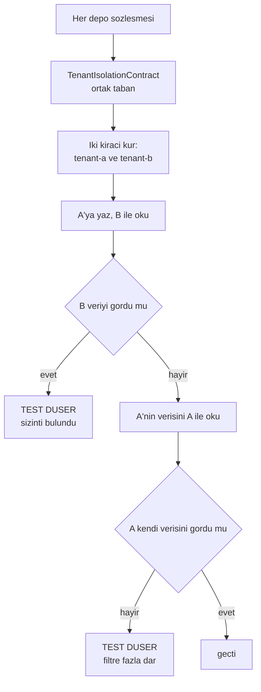

# Faz 41 — Kiracı Yalıtımının Zorlanması

> **Durum:** 📋 Planlandı (2026-08-06)
> **Kaynak:** [UCUNCU-FAZ-ADAYLARI.md](UCUNCU-FAZ-ADAYLARI.md) · **F-76**
> **Önkoşul:** Yok
> **Paketler:** `AgentPrism.Sql.Shared`, `.PostgreSql`, `.SqlServer`, `.Sqlite`, `.Core` (yalnız kusur çıkarsa)
> **Yeni paket:** Yok · **Migration:** Yok — 🚨 **kusur bulunursa gerekebilir**, [41.5](#415--kusur-bulunursa-ne-olur)
> **Public API:** büyümüyor
> **Seçim:** 👤 **Seçenek A — sözleşme testi kapısı** (kullanıcı kararı, 2026-08-06). Gerekçe [41.2](#412--neden-seçenek-a)

---

## Bu Faza Başlarken

> `faz-baslangic` skill'ini uygula. Aşağıdaki liste o skill'in 2. adımıdır —
> **tamamını değil, yalnız işaret edilen bölümleri oku.**

1. Bu doküman
2. Kararlar — dosyanın tamamını **okuma**, yalnız bu kalemleri grep'le:
   ```bash
   grep -n "K-013\|K-059" docs/KARARLAR.md
   sed -n '30p' docs/KARARLAR.md      # reddedilen is L30 — FK konmadi
   ```
   🚨 **L30 bir `K-` kaydı değildir.** Aday listesi buna "K-030" diyordu;
   **yanlıştır**. `tenant_id` sütunlarına yabancı anahtar konmaması
   `KARARLAR.md`'nin **reddedilen işler** bölümündedir (L30) ve K-030 bambaşka
   bir karardır (Responses API'de sunucu tarafı depolama). Ayrıntı
   [41.1](#411--düzeltilen-iki-kanıt).
   **K-013** (ayrı `agentprism` şeması), **K-059** (`secret` veritabanına
   yazılmaz — kiracı verisiyle aynı disiplin).
3. Alan hafızası (bu faz üç alana dokunuyor):
   [`hafiza/sql-saglayicilari.md`](hafiza/sql-saglayicilari.md) (**ana kaynak** —
   paylaşılan depo katmanı, üç diyalekt),
   [`hafiza/test-altyapisi.md`](hafiza/test-altyapisi.md) (sözleşme testi
   altyapısı, Testcontainers),
   [`hafiza/postgresql.md`](hafiza/postgresql.md) (sorgu ve indeks davranışı)
4. Gerektiğinde, tamamı değil ilgili bölümü:
   [`MIMARI.md`](MIMARI.md) — çok kiracılılık bölümü

---

## Amaç

Kiracı yalıtımı bugün **her sorgunun `tenant_id` filtresini hatırlamasına**
dayanıyor. Kural yazılı değildir, zorlanmaz ve tek bir unutulmuş `WHERE` bir
kiracının verisini diğerine sızdırır. Bu, çok kiracılı bir satın almada ilk
sorulan sorudur ve bugün cevabı "dikkatli yazıyoruz"dur.

Bu faz cevabı **"bir kapı zorluyor"** hâline getirir.

- **F-76** — her depo metodunun iki kiracıyla koşan bir sözleşme testi; kapsam
  boşluğunun kapatılması ve boşluğun bir daha açılmasının engellenmesi.

### Bugün ne çalışmıyor — doğrulanmış kanıt

| Kanıt | Değer | Gözlem |
|---|---|---|
| `ls src/AgentPrism.Sql.Shared/Stores/` | **22 dosya** | Her biri bir veya daha çok depo taşır |
| `grep -o "tenant_id" .../PostgresQueries.cs \| wc -l` | **262** | Elle yazılmış her filtre bir hatırlama noktasıdır |
| aynı, `SqlServerQueries.cs` | **278** | |
| aynı, `SqliteQueries.cs` | **266** | |
| `grep -rn "ROW LEVEL SECURITY" src/` | **boş** | Veritabanı düzeyinde savunma yok |
| `ls tests/Shared/Contracts/` | **18 sözleşme** | 22 depo dosyasına karşı |
| [`IsolationTests.cs:69-173`](../tests/AgentPrism.PostgreSql.IntegrationTests/IsolationTests.cs) | **5 test** | 🚨 Yalnız **üç** depoyu kapsıyor (agent tanımı, `run`, oturum) ve **yalnız PostgreSQL'de** koşuyor |
| `grep -rln "Isolation" tests/AgentPrism.SqlServer.IntegrationTests/ tests/AgentPrism.Sqlite.IntegrationTests/` | **boş** | 🚨 SQL Server ve SQLite'ta kiracı yalıtımı testi **hiç yok** |

Sözleşmesi **hiç olmayan** altı depo:

```
AgentFileStore          AgentSkillStore        ApprovalAndMcpStores
ChatHistoryProvider     RetentionStore         SkillScriptGrantStore
```

> Kanıtlar 2026-08-06 tarihinde doğrulandı.

**Boşluk üç katmanlıdır:** altı depo hiç sözleşme testi görmüyor; sözleşmesi
olan 18 depo yalıtımı ayrıca sınamıyor; var olan beş yalıtım testi üç sağlayıcının
yalnız birinde koşuyor.

---

## 41.1 — Düzeltilen iki kanıt

`faz-planlama`'nın 1. adımı aday listesinin iki iddiasını yanlışladı.
**Düzeltmeler burada da yazılıdır ki uygulayan oturum yanlış kanıta dayanmasın.**

| Aday listesinin iddiası | 2026-08-06 ölçümü |
|---|---|
| "`PostgresQueries.cs` içinde `tenant_id` **177 kez** geçiyor" | **Yanlış — 262 kez.** Ayrıca `SqlServerQueries.cs` 278, `SqliteQueries.cs` 266. Toplam **806** elle yazılmış filtre noktası. İddianın yönü doğru, büyüklüğü eksikti |
| "`tenants` tablosuna yabancı anahtar yok (**K-030**)" | **Kayıt numarası yanlış.** Bu bir `K-` kararı değil, `KARARLAR.md`'nin **reddedilen işler** bölümündeki **L30**'dur. K-030 bambaşka bir konudur (Responses API sunucu tarafı depolama). İddianın kendisi doğrudur: FK yoktur ve L30 bunu bilinçli bırakmıştır |

Ayrıca aday listesinin **bilmediği** bir kanıt bulundu ve bu fazın kapsamını
genişletti: `TenantIsolationTests` **vardır** ama üç depo ve tek sağlayıcı ile
sınırlıdır. Aday listesi bu testten hiç söz etmiyordu.

## 41.2 — Neden Seçenek A

Aday listesi seçimi faz dokümanına bırakmıştı. 👤 Kullanıcı **Seçenek A'yı**
seçti (2026-08-06). Gerekçeler:

| Ölçüt | Seçenek A — sözleşme testi | Seçenek B — PostgreSQL RLS |
|---|---|---|
| Üç sağlayıcı | ✅ Aynı test üçünde de koşar | 🚨 SQLite'ta RLS **yok**; davranış üç yerde ayrışır |
| Altyapı | ✅ `tests/Shared/Contracts/` hazır, 18 sözleşme × 4 koşum | Sıfırdan |
| Yeni paket | Yok | Yok |
| Risk | Yalnız **bilinen** metotları korur | Havuzlanmış bağlantıda oturum değişkeni sızıntısı |
| Bulduğu kusur | Gerçek bir kusuru **hemen** gösterir | Kusuru gizler — filtre unutulsa da RLS yakalar |

Son satır belirleyicidir. Seçenek B bir **kalkan**dır: eksik filtreyi maskeler
ve kod yanlış kalmaya devam eder. Seçenek A bir **kapı**dır: eksik filtreyi
kırmızı bir testle gösterir ve düzeltilmesini zorunlu kılar.

> Seçenek B iptal edilmedi, **ertelendi**. Derinlemesine savunma değerlidir ve
> A'nın üstüne eklenebilir. Aday listesine yeni bir kalem olarak yazılır
> ([Adım 6](#sonraki-faza-devir-notu)).

## 41.3 — Kapının tasarımı

Kapı üç parçadır.



🚨 **İkinci denetim (H) atlanamaz.** Yalnız "B görmemeli" denetlenirse, hiçbir
şey döndürmeyen kırık bir sorgu da testi geçer. İki yönlü denetim, filtrenin
hem yeterli hem de fazla dar olmadığını kanıtlar.

### (a) Ortak taban

`tests/Shared/Contracts/` altına `TenantIsolationContract` eklenir. Var olan 18
sözleşme onu miras alır veya bir yardımcı olarak kullanır. Dört koşum sınıfı
(bellek içi, PostgreSQL, SQL Server, SQLite) hiç değişmez — yeni testler
kendiliğinden dört yerde koşar.

### (b) Eksik altı sözleşme

Sözleşmesi olmayan altı depo için sözleşme yazılır. Bu, fazın **en büyük**
parçasıdır ve yalıtımdan bağımsız bir kazanç da üretir: o altı depo bugün üç
SQL sağlayıcısında hiç karşılaştırılmıyor.

> `ChatHistoryProvider` bir `store` değil bir MAF sağlayıcısıdır; sözleşmesi
> diğerlerinden farklı kurulur. Uygulayan oturum bunu ilk iş olarak ölçer.

### (c) Kapsam denetimi

En kolay kaçırılan şey, **yarın eklenecek** metodun testsiz kalmasıdır. Bir
yansıma tabanlı test bunu kapatır: `AgentPrism.Sql.Shared/Stores/` altındaki her
public depo metodu, ya yalıtım sözleşmesinde **görünmelidir** ya da açık bir
`[TenantAgnostic]` gerekçesiyle **muaf** işaretlenmelidir.

```csharp
// Muafiyet ornekleri — kiraci kavrami tasimayan metotlar
[TenantAgnostic("Migration durumu kiraci ustudur.")]
[TenantAgnostic("Is kuyrugu kiraci kimligini kaydin icinde tasir; sorgu kiraci filtrelemez.")]
```

Muafiyet **sessiz olamaz**: gerekçe yazmak zorunludur ve kod incelemesinde
görünür.

> 🚨 Bu denetim `AgentPrism.Sql.Shared`'a yansıma sokmaz. Test projesindedir;
> AOT duruşu etkilenmez.

## 41.4 — SQLite ve tek yazıcılık

SQLite üç sağlayıcıdan biridir ve testler orada da koşar. Ama bir uyarı gerekir:
SQLite tek yazıcılıdır ve çok kiracılı üretim kurulumunda kullanılmaz. Testin
orada koşması bir **regresyon kapısıdır**, bir üretim iddiası değil.

Aynı şey bellek içi `store`'lar için de geçerlidir. K-018 onları birinci sınıf
implementasyon sayar; yalıtım kuralı orada da geçerlidir ve orada da sınanır.

## 41.5 — Kusur bulunursa ne olur

**Bu faz bir kusur bulmayı bekler.** 806 elle yazılmış filtre noktası ve altı
testsiz depo varken, hepsinin doğru olması olası değildir.

Bulunan her kusur için:

| Adım | Ne yapılır |
|---|---|
| 1 | Kusur bu belgenin **Plandan Sapmalar** bölümüne yazılır — gizlenmez |
| 2 | Düzeltme aynı fazda yapılır; sonraki faza bırakılmaz |
| 3 | Kusur bir indeks veya benzersizlik kısıtı gerektiriyorsa **migration gerekir** — üç set, numaralar uygulama anında alınır (K-178) |
| 4 | Kusurun sınıfı `docs/hafiza/sql-saglayicilari.md`'ye yazılır |

> 🚨 **Bu bir güvenlik düzeltmesidir.** Bulunan bir sızıntı "sonra bakarız"
> kutusuna konmaz. Faz, kusur düzeltilmeden kapanmaz.

---

## Planlanan Public API

> Taslak imzalardır. Gerçekleşen imzalar kapanışta ayrı bir bölüme yazılır.

Public sözleşme **büyümez.** Bu faz yalnız test altyapısı ekler ve — kusur
bulunursa — var olan sorguları düzeltir.

```csharp
// tests/Shared/Contracts/TenantIsolationContract.cs   (test altyapisi, public API DEGIL)

/// <summary>
/// Bir deponun kiraci yalitimini iki yonlu sinar.
/// </summary>
public abstract class TenantIsolationContract<TStore> : IAsyncLifetime
{
    protected const string TenantA = "tenant-a";
    protected const string TenantB = "tenant-b";

    protected TStore Store { get; private set; } = default!;

    protected abstract ValueTask<TStore> CreateStoreAsync();

    /// <summary>A kiracisi icin ornek veri yazar ve anahtarini dondurur.</summary>
    protected abstract ValueTask<object> SeedAsync(string tenantId);

    [Fact] public async Task Kiraci_digerinin_verisini_okuyamaz();
    [Fact] public async Task Kiraci_kendi_verisini_okur();
    [Fact] public async Task Kiraci_digerinin_verisini_silemez();
    [Fact] public async Task Kiraci_digerinin_verisini_guncelleyemez();
    [Fact] public async Task Ayni_ad_iki_kiracida_bagimsiz_yasar();
}

/// <summary>Kiraci kavrami tasimayan bir depo metodunu muaf tutar.</summary>
[AttributeUsage(AttributeTargets.Method)]
public sealed class TenantAgnosticAttribute(string reason) : Attribute
{
    public string Reason { get; } = reason;
}
```

### HTTP `endpoint`'leri

Yok.

### Arayüz payı

**Yok.** Arayüze dokunulmaz.

---

## Planlanan Dosya Listesi

```
tests/Shared/Contracts/
├── TenantIsolationContract.cs        (YENI — ortak taban)
├── TenantAgnosticAttribute.cs        (YENI)
├── AgentFileStoreContract.cs         (YENI — eksik alti sozlesmeden)
├── AgentSkillStoreContract.cs        (YENI)
├── ApprovalStoreContract.cs          (YENI)
├── McpStoreContract.cs               (YENI)
├── ChatHistoryProviderContract.cs    (YENI — sekli OLCULMELI)
├── RetentionStoreContract.cs         (YENI)
├── SkillScriptGrantStoreContract.cs  (YENI)
└── *.cs                              (mevcut 18 sozlesme — yalitim taban sinifi eklenir)

tests/AgentPrism.PostgreSql.IntegrationTests/Contracts/PostgresStoreContractTests.cs
tests/AgentPrism.PostgreSql.IntegrationTests/Contracts/InMemoryStoreContractTests.cs
tests/AgentPrism.SqlServer.IntegrationTests/Contracts/SqlServerStoreContractTests.cs
tests/AgentPrism.Sqlite.IntegrationTests/Contracts/SqliteStoreContractTests.cs
                                      (yeni sozlesmeler icin dorder kosum sinifi)

tests/Shared/Contracts/TenantCoverageTests.cs   (YENI — yansimali kapsam denetimi)

src/AgentPrism.PostgreSql/Internal/PostgresQueries.cs    (YALNIZ kusur cikarsa)
src/AgentPrism.SqlServer/Internal/SqlServerQueries.cs    (ayni)
src/AgentPrism.Sqlite/Internal/SqliteQueries.cs          (ayni)
src/AgentPrism.Core/Storage/InMemory*.cs                 (ayni)
```

`tests/AgentPrism.PostgreSql.IntegrationTests/IsolationTests.cs` içindeki beş
`TenantIsolationTests` testi **ortak sözleşmeye taşınır**; PostgreSQL'e özgü
kalan `SchemaIsolationTests` yerinde durur.

---

## Testler

| Test sınıfı | Neyi doğrular |
|---|---|
| `TenantIsolationContract` türevleri | Her depo, dört koşumda (bellek içi + üç SQL) iki kiracıyla sınanır |
| `TenantCoverageTests` | 🚨 `Stores/` altındaki **her** public metot ya yalıtım sözleşmesinde ya `[TenantAgnostic]` gerekçesiyle muaf. Yeni bir metot testsiz eklenemez |
| Yeni altı sözleşme | Altı depo üç SQL sağlayıcısında **ilk kez** karşılaştırılır |
| `TenantIsolationRegressionTests` | Bulunan her kusur için bir test; kusuru **önce** kırmızı gösterir, sonra yeşile döner |

> Testlerin sayısı bu planda **yazılmaz**. 18 mevcut + 6 yeni sözleşme × 5
> yalıtım testi × 4 koşum kaba bir üst sınırdır; gerçek sayı, kiracı kavramı
> taşımayan metotların muafiyetiyle düşer. Uygulayan oturum gerçek sayıyı ölçer
> ve kapanışa yazar.

---

## Açık Sorular

> Planı bloklamayan, faz uygulanırken karara bağlanacak sorular. Bloklayan
> sorular plan yazılmadan **önce** sorulur.

| # | Soru | Seçenekler | Öneri |
|---|---|---|---|
| 1 | `ChatHistoryProvider` sözleşmesi diğerleriyle aynı şekilde mi kurulur? | A: **ölçülmeli** · B: aynı desen varsayılır | **A.** Bir MAF sağlayıcısıdır, `IStore` değildir. Uygulayan oturum imzasını ilk iş olarak okur |
| 2 | Muafiyet nasıl işaretlenir? | A: `[TenantAgnostic("gerekçe")]` · B: bir liste dosyası | **A.** Gerekçe metodun yanında durur ve kod incelemesinde görünür. Liste dosyası uzaktadır ve bayatlar |
| 3 | Bellek içi `store`'lar da sınansın mı? | A: evet · B: hayır | **A.** K-018 onları birinci sınıf sayar; yalıtım kuralı orada da geçerlidir. Ayrıca en hızlı koşan koşumdur ve kusuru ilk o gösterir |
| 4 | Kusur bulunursa migration gerekir mi? | A: **kusura bağlı** · B: baştan bir migration planlanır | **A.** Plan migration rezerve etmez. Bir indeks veya benzersizlik kısıtı gerekirse üç set alınır (K-178) |
| 5 | `IsolationTests.cs`'teki beş test taşınsın mı, kopyalansın mı? | A: taşınır · B: kalır | **A.** İki yerde tutmak kayma üretir; ayrıca taşınınca üç sağlayıcıda birden koşar |

---

## Bitiş Ölçütleri (DoD)

- [ ] `tests/Shared/Contracts/` altındaki **her** depo sözleşmesi kiracı
      yalıtımını iki yönlü sınıyor
- [ ] Sözleşmesi olmayan altı deponun **hepsi** sözleşme kazandı
- [ ] 🚨 Kiracı yalıtım testleri **üç SQL sağlayıcısında ve bellek içi
      `store`'larda** koşuyor — bugün yalnız PostgreSQL'de koşuyordu
- [ ] `TenantCoverageTests` yeşil: testsiz veya gerekçesiz muaf metot yok
- [ ] `IsolationTests.cs`'teki beş test ortak sözleşmeye **taşındı** (kopya
      bırakılmadı)
- [ ] 🚨 Bulunan **her** kusur düzeltildi ve Plandan Sapmalar bölümüne yazıldı;
      kusur bulunmadıysa bu da açıkça yazıldı
- [ ] Yeni metodun testsiz eklenemeyeceği **kanıtlandı**: geçici olarak
      filtresiz bir metot eklendi, `TenantCoverageTests` düştü, metot geri alındı
- [ ] Dört doğrulama kapısı sıfır uyarı verir
- [ ] `samples/AgentPrism.Api` ile gerçek `run` yapıldı, çıktı bu belgeye yazıldı
- [ ] `secret` taraması boş döndü

### Doğrulama komutları

```bash
# Uc saglayicida ve bellek icinde kosum
dotnet test tests/AgentPrism.PostgreSql.IntegrationTests -c Release --no-build
dotnet test tests/AgentPrism.SqlServer.IntegrationTests  -c Release --no-build
dotnet test tests/AgentPrism.Sqlite.IntegrationTests     -c Release --no-build

# Kapsam denetimi tek basina
dotnet test tests/AgentPrism.PostgreSql.IntegrationTests -c Release --no-build 2>&1 \
  | grep -i "TenantCoverage"

# Eski testler tasindi mi — TenantIsolationTests artik burada OLMAMALI
grep -n "class TenantIsolationTests" tests/AgentPrism.PostgreSql.IntegrationTests/IsolationTests.cs

# Filtre noktalarinin sayisi (kusur duzeltmesi sonrasi degisebilir)
for f in src/AgentPrism.PostgreSql/Internal/PostgresQueries.cs \
         src/AgentPrism.SqlServer/Internal/SqlServerQueries.cs \
         src/AgentPrism.Sqlite/Internal/SqliteQueries.cs; do
  printf "%s: " "$f"; grep -o "tenant_id" "$f" | wc -l
done
```

---

## Riskler

| Risk | Önlem |
|------|-------|
| 🚨 Faz gerçek bir sızıntı bulur ve kapsam büyür | **Beklenen sonuçtur.** Düzeltme aynı fazda yapılır; faz kusur düzeltilmeden kapanmaz |
| Tek yönlü test (yalnız "B görmemeli") kırık bir sorguyu geçirir | Sözleşme **iki yönlüdür**: A kendi verisini de görmelidir |
| Yeni bir depo metodu testsiz eklenir ve boşluk yeniden açılır | `TenantCoverageTests` yansımayla zorlar; muafiyet gerekçe ister |
| Muafiyet bir kaçış kapısına dönüşür | Gerekçe zorunludur ve metodun yanında durur; kod incelemesinde görünür |
| `ChatHistoryProvider` diğerlerinden farklıdır ve sözleşme kurulamaz | Açık Soru 1; uygulayan oturum imzayı ilk iş olarak ölçer |
| Testcontainers ile üç sağlayıcı koşumu yavaşlar | Bellek içi koşum en hızlısıdır ve kusuru ilk o gösterir; SQL koşumları kapanışta çalışır |
| Seçenek B (RLS) hiç yapılmaz ve derinlemesine savunma eksik kalır | B **iptal değil ertelendi**; aday listesine yeni kalem olarak yazılır |

---

<!-- ============================================================
     AŞAĞISI KAPANIŞTA DOLDURULUR — `faz-tamamlama` skill'i.
     Plan anında boş kalır. Başlıkları SİLME.
     ============================================================ -->

## Plandan Sapmalar

> Kapanışta doldurulur. Plan ile gerçek arasındaki fark **gizlenmez** — sonraki
> oturumun en değerli bilgisidir.
> **Not:** 🚨 Bulunan **her** kiracı sızıntısı buraya yazılır. Kusur
> bulunmadıysa bu da açıkça yazılır — "hiç kusur çıkmadı" değerli bir bilgidir.

## Bu Fazda Verilen Kararlar

> Kapanışta doldurulur. K-NNN numaraları burada alınır; plan numara rezerve etmez.

## Gerçekleşen Public API

> Kapanışta doldurulur. Koddaki **gerçek** imzalar.

## Dosya Listesi (gerçekleşen)

> Kapanışta doldurulur.

## Sonraki Faza Devir Notu

> Kapanışta doldurulur: devralınan sözleşmeler, bilinen tuzaklar (🚨), yarım
> kalan işler, sıradaki faz.
>
> **Not:** İki kalem buradan doğar ve aday listesine yazılmalıdır:
> 1. **Seçenek B — PostgreSQL RLS ile derinlemesine savunma.** Bu fazda
>    ertelendi; gerekçesi [41.2](#412--neden-seçenek-a)'de yazılıdır.
> 2. Aday listesindeki **F-40** (BYOK) ve **F-56** (kiracı API anahtarları)
>    bu fazın sağlamlaştırdığı zemine yazacaktır. Devir notu, o zeminin
>    hangi metotlarda **muaf** işaretlendiğini listelemelidir.
