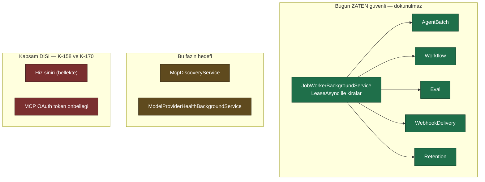
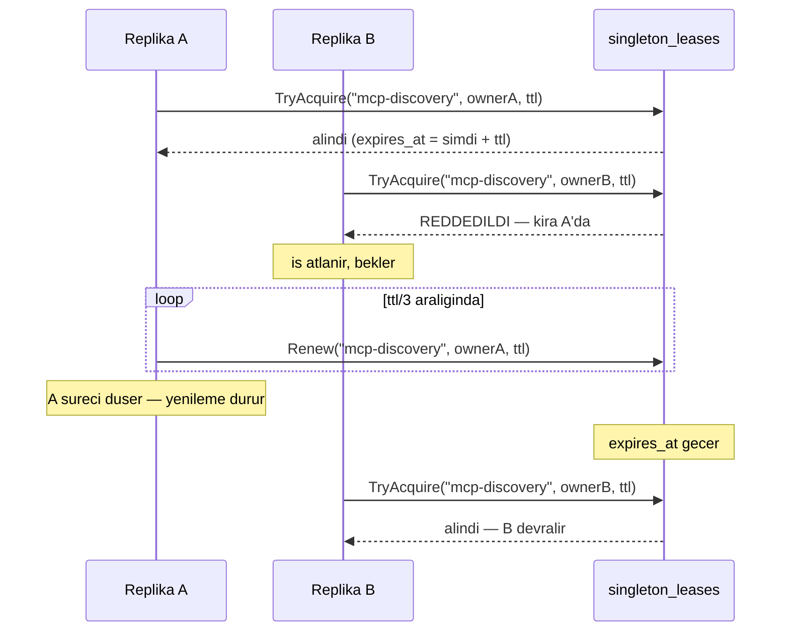

# Faz 42 — Tek Yürütücü Seçimi (Çok Örnekli Koordinasyon)

> **Durum:** 📋 Planlandı (2026-08-06)
> **Kaynak:** [UCUNCU-FAZ-ADAYLARI.md](UCUNCU-FAZ-ADAYLARI.md) · **F-57**
> **Önkoşul:** Yok
> **Paketler:** `AgentPrism.Abstractions`, `.Core`, `.Sql.Shared`, `.PostgreSql`, `.SqlServer`, `.Sqlite`, `.Mcp`
> **Yeni paket:** Yok · **Migration:** **gerekli** — bir tablo, üç set, numaralar uygulama anında alınır (K-178)
> **Public API:** büyüyor — bir arayüz ve bir ayar. Faz 7'den önce ucuz

---

## Bu Faza Başlarken

> `faz-baslangic` skill'ini uygula. Aşağıdaki liste o skill'in 2. adımıdır —
> **tamamını değil, yalnız işaret edilen bölümleri oku.**

1. Bu doküman
2. Kararlar — dosyanın tamamını **okuma**, yalnız bu kalemleri grep'le:
   ```bash
   grep -n "K-138\|K-158\|K-160\|K-170\|K-178" docs/KARARLAR.md
   ```
   **K-138** (🚨 cron çift tetiklemesi **zaten kapalı** — aday listesinin ana
   gerekçesi buydu ve **yanlıştı**; [42.1](#421--düzeltilen-kanıt-ve-yeni-kanıt)),
   **K-158** (hız sınırı bilerek bellekte; kota veritabanında — bu fazın
   **kapsam dışı** sınırı), **K-160** (geri adımlı bekleme — kira yenileme
   deseni buradan gelir), **K-170** (MCP OAuth token'ı bellek içi önbellekte,
   iki tüketici paylaşır — bu fazın en zor parçası), **K-178** (migration
   numaraları sağlayıcı başına bağımsızdır).
3. [`17-TOPLU-VE-ZAMANLANMIS-CALISTIRMA.md`](17-TOPLU-VE-ZAMANLANMIS-CALISTIRMA.md) — yalnız
   devir notu:
   ```bash
   awk '/## Sonraki Faza Devir Notu/,0' docs/17-TOPLU-VE-ZAMANLANMIS-CALISTIRMA.md
   ```
   🚨 **Kira deseni oradan devralınır ve yeniden yazılmaz.**
4. Alan hafızası (bu faz üç alana dokunuyor):
   [`hafiza/sql-saglayicilari.md`](hafiza/sql-saglayicilari.md) (üç diyalekt,
   kilit farkları), [`hafiza/aspnetcore-di.md`](hafiza/aspnetcore-di.md)
   (`IHostedService` kaydı, `TryAdd*`),
   [`hafiza/maf-api.md`](hafiza/maf-api.md) (MCP keşfi)
5. Gerektiğinde, tamamı değil ilgili bölümü:
   [`MIMARI.md`](MIMARI.md) — dağıtım ve arka plan servisleri bölümü

### 🚨 Faz 41'den devralınanlar (yeni tablo yazacaksın — bunları oku)

Bu faz **yeni bir tablo** (`singleton_leases`) ve **yeni bir depo** ekliyor.
Faz 41 depo katmanına bir kapı koydu; kapı seni etkiler:

1. **`TenantCoverageTests` yeni deponu bekler.** `AgentPrism.Sql.Shared/Stores/`
   altına eklediğin her public metot ya
   `tests/Shared/Contracts/TenantCoverageTests.cs`'teki `Covered` tablosunda
   görünmeli ya da `[TenantAgnostic("gerekçe")]` taşımalıdır. Gerekçe **40
   karakterden uzun** olmalıdır (ayrı test). Derleme yeşil kalır, test düşer.
   ```bash
   grep -rn "TenantAgnostic(" src/AgentPrism.Sql.Shared/Stores/   # örnek gerekçeler
   ```
2. **Kira deposu büyük olasılıkla `[TenantAgnostic]`'tir.** Tek yürütücü seçimi
   **kurulum genelindedir**, kiracı başına değil — Faz 41'in `SqlTenantStore` ve
   `SqlJobStore.LeaseAsync` muafiyetleri sana örnek gerekçe kalıbı verir. Kararı
   yaz; sessiz bırakma.
3. **Sözleşme testi yazmak artık ucuz.** Depon kiracıya bağlıysa
   `TenantIsolationContract<TStore>`'tan türet, dört kancayı (`SeedAsync`,
   `ExistsAsync`, `CountAsync`, `TryDeleteAsync`) yaz — **koşum sınıfı eklemek
   gerekmez**, dört koşum (bellek içi + üç SQL) testleri kendiliğinden alır.
   Kiracı kavramı yoksa `IAsyncLifetime`'dan türeyen düz bir sözleşme yaz;
   `RetentionStoreContract` bunun örneğidir.
4. **🚨 Çağıranın verdiği bir metin tek başına birincil anahtar olamaz** (K-278).
   Kira anahtarı (`name`) tüketiciden gelirse tabloyu ona göre kurgula.
5. **🚨 Bellek içi karşılık yazacaksan kiracı bağlamını unutma** (K-277).
   Bellek içi depolar artık isteğe bağlı `ITenantContext` alır ve verilmezse
   `FixedTenantContext.Default`'a düşer — parametre isteğe bağlıdır, **filtreleme
   değildir**.
6. **Migration numaraları:** PostgreSQL `0018`, SQL Server `0006`, SQLite `0006`
   Faz 41 tarafından kullanıldı. Sıradaki set **PostgreSQL `0019`, SQL Server
   `0007`, SQLite `0007`**'dir (K-178: numaralar sağlayıcı başına bağımsızdır).
7. **`IRetentionStore` kırıcı biçimde değişti** (K-279): dört metot artık
   `string? tenantId` alır. Yeni tablonu saklama hedefi yapacaksan
   `RetentionTargetRegistry`'ye **`TenantPredicate`'i de** yaz.

---

## Amaç

AgentPrism bugün **tek örnekli** çalışmayı varsayıyor. İki veya üç replika ile
dağıtıldığında bazı işler sessizce N katına çıkıyor: her replika kendi MCP
keşfini yapıyor, kendi sağlık yoklamasını gönderiyor ve kendi bellek içi
durumunu tutuyor.

Bu faz, "bu işi kümede yalnızca **bir** örnek yapsın" diyebilmeyi getirir.

- **F-57** — kira tabanlı tek yürütücü seçimi; MCP keşfi ve model sağlık
  yoklaması bunu paylaşır.

### Bugün ne çalışmıyor — doğrulanmış kanıt

| Kanıt | Gözlem |
|---|---|
| [`McpDiscoveryService.cs:22`](../src/AgentPrism.Mcp/Internal/McpDiscoveryService.cs) | `BackgroundService`'tir ve uzak MCP sunucularını aralıklarla yoklar. **Üç replika = üç kat MCP isteği** |
| [`ModelProviderHealthBackgroundService.cs:23`](../src/AgentPrism.Core/Models/ModelProviderHealthBackgroundService.cs) | 🚨 **Aday listesinde yoktu.** İkinci bir `BackgroundService`; sağlayıcı sağlığını yoklar. **Üç replika = üç kat yoklama** ve üç ayrı sağlık görüşü |
| `grep -rn "ROW LEVEL SECURITY\|pg_try_advisory" src/` | Boş. Migration kilidi dışında hiçbir dağıtık koordinasyon yok |
| [`PostgresDialect.cs:58`](../src/AgentPrism.PostgreSql/Internal/PostgresDialect.cs) | `pg_advisory_lock` **yalnız** migration kilidinde |
| [`SqlServerDialect.cs:87`](../src/AgentPrism.SqlServer/Internal/SqlServerDialect.cs) | `sp_getapplock` **yalnız** migration kilidinde |
| [`SqliteDialect.cs:53-60`](../src/AgentPrism.Sqlite/Internal/SqliteDialect.cs) | 🚨 SQLite'ta karşılığı **yok**; migration kilidi bir **sidecar dosya kilidi** ile çözülmüş |
| K-158 | Hız sınırı bellektedir. N replika = N× etkin sınır |
| K-170 | MCP OAuth token'ı bellek içi önbellektedir. A replikasında yetkilendirilir, B görmez |

> Kanıtlar 2026-08-06 tarihinde doğrulandı.

---

## 42.1 — Düzeltilen kanıt ve yeni kanıt

Aday listesi bu kalemi bir kez zaten düzeltmişti; bu plan ikinci bir düzeltme
ve bir ekleme getiriyor.

| İddia | Durum |
|---|---|
| *(ilk liste)* "Faz 17 bu olmadan yapılırsa her cron N kez tetiklenir" | **Yanlışlanmıştı.** [`0008_scheduling.sql:46`](../src/AgentPrism.PostgreSql/Migrations/0008_scheduling.sql) `jobs_schedule_scheduled_uq UNIQUE (schedule_id, scheduled_for)` kısıtını taşıyor (K-138) |
| *(aday listesi)* "Kalan gerçek kanıtlar **üçtür**" | **Dörttür.** `ModelProviderHealthBackgroundService` ikinci bir `BackgroundService`'tir ve listede yoktu |
| *(aday listesi)* "F-36'nın uzlaştırması ve **saklama koşusu** bunu paylaşır" | 🚨 **Saklama koşusu bunu paylaşmaz.** `JobKind.Retention = 4`'tür; saklama zaten iş kuyruğundan geçer ve kuyruk **zaten kira tabanlıdır** — [42.2](#422--iş-kuyruğu-zaten-güvenlidir--yeniden-yazma) |

## 42.2 — İş kuyruğu zaten güvenlidir — yeniden yazma

Bu fazın en pahalı hatası, çözülmüş bir sorunu ikinci kez çözmek olurdu.

[`JobWorkerBackgroundService.cs:84`](../src/AgentPrism.Core/Scheduling/JobWorkerBackgroundService.cs)
şunu yapıyor:

```csharp
job = await jobStore.LeaseAsync(_ownerId, options.LeaseDuration, stoppingToken)
```

İş kuyruğu **kira tabanlıdır**. Her işçi kendi `_ownerId`'siyle bir iş kiralar;
bir iş yalnız bir işçiye gider. Kira yenileme (`:165`) ve yeniden deneme için
serbest bırakma (`:218`) zaten yazılmıştır.

**Sonuç:** `JobWorkerBackgroundService` bu fazın kapsamında **değildir**. Çok
örnekli kurulumda bugün doğru davranıyor ve dokunulmaz. `JobKind`'ın beş
üyesinin (`AgentBatch`, `Workflow`, `Eval`, `WebhookDelivery`, `Retention`)
tamamı bu korumanın altındadır.



## 42.3 — Tasarım: kira tablosu, `advisory lock` değil

İki teknik var ve seçim önemlidir.

| Teknik | PostgreSQL | SQL Server | SQLite | Değerlendirme |
|---|---|---|---|---|
| **Oturum kilidi** | `pg_try_advisory_lock` | `sp_getapplock` | 🚨 **yok** | Üç sağlayıcıda üç davranış. Havuzlanmış bağlantıda oturum ömrü belirsizdir |
| **Kira tablosu** | tablo | tablo | tablo | ✅ Üçünde de **aynı**. `jobs` kirası ile aynı desen — kod zaten kanıtlanmış |

**Seçim: kira tablosu.** Üç gerekçe:

1. **Üç sağlayıcıda tek davranış.** SQLite'ın oturum kilidi yoktur; migration
   kilidi orada bir sidecar dosya kilidiyle çözülmüştür
   ([`SqliteDialect.cs:53-60`](../src/AgentPrism.Sqlite/Internal/SqliteDialect.cs)).
   Aynı ayrışmayı ikinci bir yerde üretmek bakım borcudur.
2. **Desen zaten kanıtlanmış.** `jobs` kirası Faz 17'de yazıldı ve üretimde
   çalışıyor. Kira süresi, yenileme ve süre dolumu mantığı yeniden yazılmaz.
3. **Bağlantı havuzuna bağımlı değil.** Oturum kilidi, kilidi alan bağlantının
   havuzda ne kadar yaşadığına bağlıdır; kira tablosu bağlantıdan bağımsızdır.

Bedeli bir tablodur ve bir migration'dır.

### Kira döngüsü



🚨 **Yenileme aralığı kira süresinin üçte biri olmalıdır.** Yarısı seçilirse tek
bir kaçırılmış yenileme kirayı düşürür ve iki yürütücü aynı anda çalışır.
Üçte bir, iki kaçırılmış yenilemeye dayanır.

🚨 **Kira süresi bir ayardır ve varsayılanı ölçülmelidir.** Çok kısa seçilirse
çalışan bir yürütücü ölü ilan edilir; çok uzun seçilirse devralma gecikir.
Uygulayan oturum `samples/AgentPrism.Api`'yi iki örnekle çalıştırıp gerçek
devralma süresini ölçer ve buraya yazar.

## 42.4 — K1: varsayılan kapalı, tek örnekte davranış değişmez

Bugün AgentPrism tek örnekle çalışıyor ve doğru davranıyor. Bu faz **hiçbir
mevcut kurulumun davranışını değiştirmemelidir**.

| Ayar | Varsayılan | Etki |
|---|---|---|
| `SingletonExecution.Enabled` | **`false`** | Kapalıyken bugünkü davranış birebir korunur — her örnek kendi işini yapar |

Kapalıyken kira tablosuna **hiç dokunulmaz**; sorgu bile atılmaz. Tek örnekli
bir kurulum yeni bir veritabanı gidişi ödemez.

> Seçim bilinçlidir. "Açık gelsin, zararı yok" demek, tek örnekli her kurulumu
> her aralıkta bir veritabanı sorgusuna sokar ve K1'i ihlal eder.

## 42.5 — Kapsam dışı: hız sınırı ve MCP token'ı

Aday listesi ikisini de kanıt olarak sayıyordu. İkisi de bu fazda
**çözülmez** ve gerekçeleri farklıdır.

| Konu | Neden kapsam dışı |
|---|---|
| **Hız sınırı** (K-158) | K-158 bunu bilerek bellekte tuttu: hız sınırı saniye ölçeğindedir ve kalıcılaştırmak her isteğe bir veritabanı gidişi eklerdi. Paylaşılan hız sınırı **ayrı bir iştir**; aday listesi de bunu kapsam dışı yazıyordu. Tek yürütücü seçimi bu soruna zaten çözüm değildir — hız sınırı her örnekte gerekir, bir örnekte değil |
| **MCP OAuth token'ı** (K-170) | 🚨 Token'ı paylaşmak, onu **veritabanına yazmak** demektir ve K-059 bunu yasaklar: `secret` veritabanına yazılmaz. Bu, tek yürütücü seçimiyle çözülemeyecek bir tasarım çatışmasıdır ve **kendi kararını** ister |

İkincisi bu fazın en önemli devir bilgisidir. Tek yürütücü seçimi MCP
**keşfini** tek örneğe indirir, ama bir kullanıcı A replikasında yetkilendirme
yaptığında B replikasının o token'ı görememesi sorunu **açık kalır**.

> Bu, aday listesine yeni bir kalem olarak yazılmalıdır: "MCP OAuth token'ının
> örnekler arasında paylaşılması — K-059 ile çatışır, ayrı karar ister."

---

## Planlanan Public API

> Taslak imzalardır. Gerçekleşen imzalar kapanışta ayrı bir bölüme yazılır.

```csharp
// AgentPrism.Abstractions/Coordination/ISingletonLeaseStore.cs

/// <summary>
/// Kume genelinde adlandirilmis bir isin yalnizca bir ornekte kosmasini saglar.
/// </summary>
public interface ISingletonLeaseStore
{
    /// <summary>
    /// Kirayi almayi dener. Kira baskasindaysa ve suresi dolmamissa
    /// <see langword="false"/> doner.
    /// </summary>
    ValueTask<bool> TryAcquireAsync(
        string name,
        string ownerId,
        TimeSpan duration,
        CancellationToken cancellationToken = default);

    /// <summary>
    /// Elde tutulan kirayi uzatir. Kira baskasina gectiyse
    /// <see langword="false"/> doner — cagiran isi BIRAKMALIDIR.
    /// </summary>
    ValueTask<bool> RenewAsync(
        string name,
        string ownerId,
        TimeSpan duration,
        CancellationToken cancellationToken = default);

    /// <summary>Kirayi birakir. Sahip degilse hicbir sey yapmaz.</summary>
    ValueTask ReleaseAsync(
        string name,
        string ownerId,
        CancellationToken cancellationToken = default);
}
```

```csharp
// AgentPrism.Abstractions/Coordination/SingletonExecutionOptions.cs

public sealed class SingletonExecutionOptions
{
    /// <summary>
    /// Tek yurutucu secimi acik mi. Varsayilan <see langword="false"/>:
    /// tek ornekli kurulumda davranis degismez ve ek veritabani gidisi olmaz.
    /// </summary>
    public bool Enabled { get; set; }

    /// <summary>Kira suresi. Yenileme bunun UCTE BIRI araliginda yapilir.</summary>
    public TimeSpan LeaseDuration { get; set; } = TimeSpan.FromSeconds(60);

    /// <summary>Bu ornegin kimligi. Bos ise kendiliginden uretilir.</summary>
    public string? OwnerId { get; set; }
}
```

```csharp
// AgentPrism.Core/Coordination/SingletonGuard.cs  (internal yardimci)
// Bir BackgroundService'in dongusunu kira ile sarar. McpDiscoveryService ve
// ModelProviderHealthBackgroundService ayni yardimciyi kullanir.
```

> Kayıt `TryAdd*` ile yapılır (K4). Tüketici kendi `ISingletonLeaseStore`
> uygulamasını (ör. Redis tabanlı) kaydederse onunki kazanır.

### Yeni tablo

```sql
CREATE TABLE IF NOT EXISTS {schema}.singleton_leases (
    name       text        NOT NULL PRIMARY KEY,
    owner_id   text        NOT NULL,
    expires_at timestamptz NOT NULL,
    updated_at timestamptz NOT NULL
);
```

Kiracı sütunu **yoktur** ve bu bilinçlidir: tek yürütücü seçimi kiracı üstü bir
işletim kavramıdır. `TenantCoverageTests` (Faz 41) bu depoyu
`[TenantAgnostic("Tek yurutucu secimi kiraci ustudur.")]` ile muaf tutar.

Migration **üç set** hâlinde yazılır; numaralar uygulama anında alınır (K-178).

### HTTP `endpoint`'leri

Yok. Bu faz uç eklemez.

> Kiranın kimde olduğunu görmek bir teşhis ihtiyacıdır ve
> [Faz 33](33-SAGLIK-DENETIMI-VE-TESHIS.md)'ün teşhis ucuna aittir. Devir
> notunda yazılır.

### Arayüz payı

**Yok.** Arayüze dokunulmaz.

---

## Planlanan Dosya Listesi

```
src/AgentPrism.Abstractions/Coordination/
├── ISingletonLeaseStore.cs           (YENI)
└── SingletonExecutionOptions.cs      (YENI)

src/AgentPrism.Core/Coordination/
├── SingletonGuard.cs                 (YENI — dongu sarmalayici)
└── InMemorySingletonLeaseStore.cs    (YENI — K-018: birinci sinif)

src/AgentPrism.Core/Models/
└── ModelProviderHealthBackgroundService.cs   (SingletonGuard ile sarilir)

src/AgentPrism.Mcp/Internal/
└── McpDiscoveryService.cs            (SingletonGuard ile sarilir)

src/AgentPrism.Sql.Shared/Stores/
└── SqlSingletonLeaseStore.cs         (YENI)

src/AgentPrism.PostgreSql/Migrations/NNNN_singleton_leases.sql   (YENI)
src/AgentPrism.SqlServer/Migrations/NNNN_singleton_leases.sql    (YENI)
src/AgentPrism.Sqlite/Migrations/NNNN_singleton_leases.sql       (YENI)

src/AgentPrism.PostgreSql/Internal/PostgresQueries.cs   (kira sorgulari)
src/AgentPrism.SqlServer/Internal/SqlServerQueries.cs   (ayni)
src/AgentPrism.Sqlite/Internal/SqliteQueries.cs         (ayni)
```

🚨 **`JobWorkerBackgroundService` bu listede YOKTUR** ve olmamalıdır —
[42.2](#422--iş-kuyruğu-zaten-güvenlidir--yeniden-yazma).

---

## Testler

| Test sınıfı | Neyi doğrular |
|---|---|
| `SingletonLeaseStoreContract` | `tests/Shared/Contracts/` altında; bellek içi + üç SQL sağlayıcısında aynı sonuç |
| `SingletonLeaseAcquireTests` | İkinci sahip kirayı **alamaz**; süre dolunca **alır** |
| `SingletonLeaseRenewTests` | 🚨 Kira başkasına geçtikten sonra `RenewAsync` **`false`** döner; eski sahip işi bırakır |
| `SingletonGuardTests` | Kira alınamazsa döngü gövdesi **hiç çalışmaz**; kira kaybedilirse döngü **durur** |
| `SingletonDisabledTests` | 🚨 `Enabled = false` iken kira tablosuna **hiçbir sorgu** gitmez (sorgu sayacı ile ölçülür) |
| `McpDiscoverySingletonTests` | İki örnek kurulur; MCP keşfi **yalnız birinde** koşar |
| `ModelHealthSingletonTests` | İki örnek kurulur; sağlık yoklaması **yalnız birinde** koşar |
| `SingletonLeaseTakeoverTests` | Sahip düşer, kira dolar, ikinci örnek devralır; devralma süresi **ölçülür** |
| `TenantCoverageTests` (Faz 41) | Yeni depo `[TenantAgnostic]` gerekçesiyle muaf |

---

## Açık Sorular

> Planı bloklamayan, faz uygulanırken karara bağlanacak sorular. Bloklayan
> sorular plan yazılmadan **önce** sorulur.

| # | Soru | Seçenekler | Öneri |
|---|---|---|---|
| 1 | Kira süresi varsayılanı ne olmalı? | A: **ölçülmeli**, taslak 60 sn · B: sabit bir sayı yazılır | **A.** İki örnekli gerçek bir kurulumda devralma süresi ölçülür ve buraya yazılır. Ölçülmemiş sayı plana yazılmaz |
| 2 | Kirayı kaybeden yürütücü ne yapar? | A: döngüyü durdurur, yeniden almayı dener · B: çalışmaya devam eder | **A.** B iki yürütücü demektir ve fazın amacını yok eder. Kayıp bir uyarı olarak loglanır |
| 3 | Bellek içi `store` gerçekten gerekli mi? | A: evet (K-018) · B: hayır | **A.** K-018 bellek içi `store`'ları birinci sınıf sayar. Ayrıca tek süreçte doğru davranır: tek örnekte kira hep alınır |
| 4 | `SingletonGuard` public mi `internal` mi? | A: `internal` · B: public | **A.** Tüketicinin sarmalayacağı bir döngüsü yok; `ISingletonLeaseStore` public olması yeterlidir. Public yüzey küçük tutulur |
| 5 | Saat kayması (`clock skew`) kirayı bozar mı? | A: **ölçülmeli**; zaman damgası veritabanından alınır · B: uygulama saati kullanılır | **A.** İki replikanın saati farklıysa uygulama saati kirayı erken düşürür. `expires_at` veritabanının kendi saatiyle hesaplanmalıdır; üç diyalektte karşılığı ölçülür |

---

## Bitiş Ölçütleri (DoD)

- [ ] 🚨 **İki örnek** aynı veritabanına bağlanır; MCP keşfi ve model sağlık
      yoklaması **yalnız birinde** koşar. Log çıktısı bu belgeye yazılır
- [ ] Birinci örnek durdurulur; ikinci örnek işi **devralır**. Devralma süresi
      **ölçülür** ve buraya yazılır
- [ ] `Enabled = false` (varsayılan) iken kira tablosuna hiçbir sorgu gitmez
- [ ] `Enabled = false` iken bugünkü tek örnekli davranış **birebir** korunur
- [ ] Kirayı kaybeden yürütücü döngüsünü durdurur ve bir uyarı loglar
- [ ] 🚨 `JobWorkerBackgroundService` **değiştirilmedi** — `git diff` ile
      doğrulanır
- [ ] Sözleşme testleri bellek içi + üç SQL sağlayıcısında geçer
- [ ] Migration üç sette de uygulandı; numaralar sağlayıcı başına bağımsız (K-178)
- [ ] Dört doğrulama kapısı sıfır uyarı verir
- [ ] `samples/AgentPrism.Api` ile gerçek `run` yapıldı, çıktı bu belgeye yazıldı
- [ ] `secret` taraması boş döndü

### Doğrulama komutları

```bash
# Iki ornek, ayni veritabani, farkli port
AGENTPRISM__SINGLETONEXECUTION__ENABLED=true ASPNETCORE_URLS=http://localhost:5081 \
  dotnet run --project samples/AgentPrism.Api &
AGENTPRISM__SINGLETONEXECUTION__ENABLED=true ASPNETCORE_URLS=http://localhost:5082 \
  dotnet run --project samples/AgentPrism.Api &

# Kira kimde
psql "$AGENTPRISM_CONN" -c \
  "SELECT name, owner_id, expires_at FROM agentprism.singleton_leases;"

# MCP kesif logu — YALNIZ bir ornekte gorunmeli
# (iki surecin ciktisi ayri ayri okunur)

# Birinci ornegi durdur, devralma suresini olc
# (kira dolana kadar gecen sure LeaseDuration'i asmamali)
watch -n 2 'psql "$AGENTPRISM_CONN" -c \
  "SELECT owner_id, expires_at FROM agentprism.singleton_leases;"'

# Is kuyrugu degismedi mi
git diff --stat src/AgentPrism.Core/Scheduling/JobWorkerBackgroundService.cs
```

---

## Riskler

| Risk | Önlem |
|------|-------|
| 🚨 İş kuyruğu yeniden yazılır; zaten çözülmüş bir sorun ikinci kez çözülür | [42.2](#422--iş-kuyruğu-zaten-güvenlidir--yeniden-yazma) bunu açıkça yasaklar; DoD `git diff` ile doğrular |
| Kira süresi yanlışsa iki yürütücü aynı anda çalışır | Yenileme aralığı kira süresinin **üçte biri**; kaybedilen kira döngüyü **durdurur** |
| Saat kayması kirayı erken düşürür | Açık Soru 5; `expires_at` veritabanı saatiyle hesaplanır, üç diyalektte ölçülür |
| Tek örnekli kurulum yeni bir veritabanı gidişi öder | Varsayılan **kapalıdır**; kapalıyken sorgu atılmaz ve bu bir testle korunur |
| SQLite'ta oturum kilidi yok, davranış ayrışır | Kira **tablosu** seçildi; üç sağlayıcıda aynı kod koşar |
| 🚨 MCP OAuth token sorunu çözülmüş sanılır | [42.5](#425--kapsam-dışı-hız-sınırı-ve-mcp-tokenı) kapsam dışı olduğunu ve K-059 ile çatıştığını yazar; devir notu yeni kalem açar |
| Hız sınırı çözülmüş sanılır | Aynı bölüm; K-158 bunu bilerek bellekte tuttu |

---

<!-- ============================================================
     AŞAĞISI KAPANIŞTA DOLDURULUR — `faz-tamamlama` skill'i.
     Plan anında boş kalır. Başlıkları SİLME.
     ============================================================ -->

## Plandan Sapmalar

> Kapanışta doldurulur. Plan ile gerçek arasındaki fark **gizlenmez** — sonraki
> oturumun en değerli bilgisidir.

## Bu Fazda Verilen Kararlar

> Kapanışta doldurulur. K-NNN numaraları burada alınır; plan numara rezerve etmez.
> **Not:** Ölçülen kira süresi ve devralma süresi burada kayda geçer.

## Gerçekleşen Public API

> Kapanışta doldurulur. Koddaki **gerçek** imzalar.

## Dosya Listesi (gerçekleşen)

> Kapanışta doldurulur.

## Sonraki Faza Devir Notu

> Kapanışta doldurulur: devralınan sözleşmeler, bilinen tuzaklar (🚨), yarım
> kalan işler, sıradaki faz.
>
> **Not:** Üç kalem buradan doğar ve aday listesine yazılmalıdır:
> 1. **MCP OAuth token'ının örnekler arasında paylaşılması** — K-059 ile
>    çatışır ([42.5](#425--kapsam-dışı-hız-sınırı-ve-mcp-tokenı)).
> 2. **Paylaşılan hız sınırı** — K-158 bunu bilerek bellekte tuttu.
> 3. **Kira durumunun teşhis ucunda gösterilmesi** —
>    [Faz 33](33-SAGLIK-DENETIMI-VE-TESHIS.md)'e aittir.
>
> Ayrıca aday listesindeki **F-36** (öksüz çalıştırma uzlaştırması) bu fazın
> `ISingletonLeaseStore`'unu doğrudan kullanır. Devir notu, uzlaştırıcının
> hangi kira adını alacağını önermelidir.
