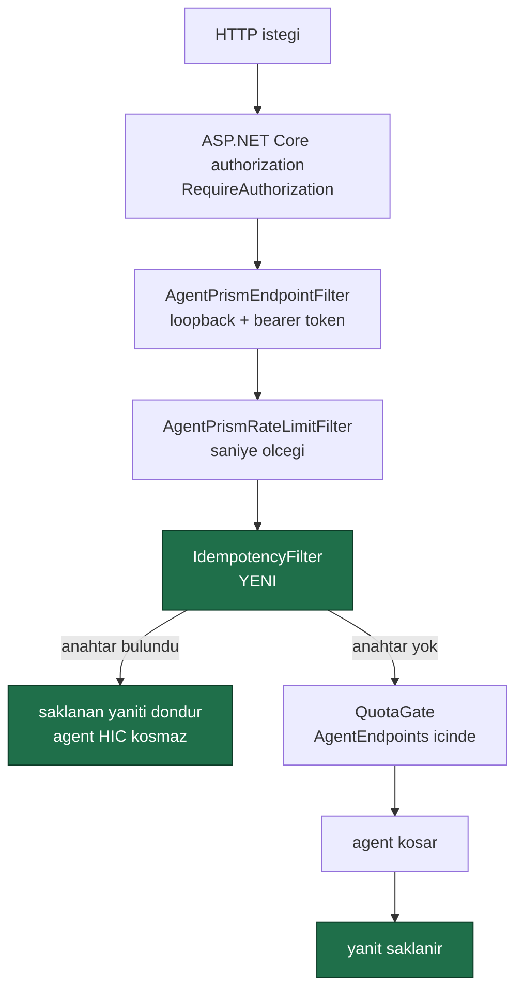
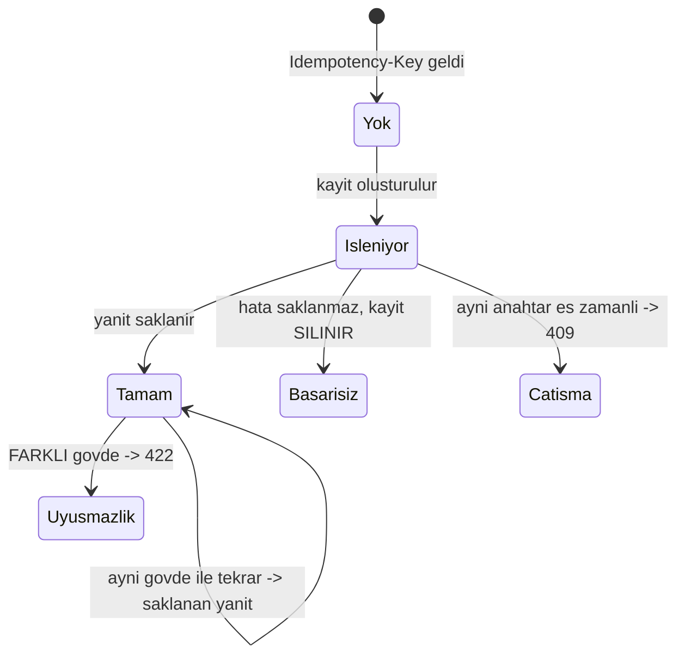

# Faz 43 — `Idempotency-Key` Desteği

> **Durum:** ✅ Tamamlandı (2026-08-07)
> **Kaynak:** [UCUNCU-FAZ-ADAYLARI.md](UCUNCU-FAZ-ADAYLARI.md) · **F-37**
> **Önkoşul:** Yok. Ama [Faz 25](25-VERI-SAKLAMA-VE-ARSIVLEME.md)'in saklama hedef kayıt defteri **kullanılır**
> **Paketler:** `AgentPrism.Abstractions`, `.Core`, `.Sql.Shared`, `.PostgreSql`, `.SqlServer`, `.Sqlite`, `.AspNetCore`
> **Yeni paket:** Yok · **Migration:** **gerekli** — bir tablo, üç set, numaralar uygulama anında alınır (K-178)
> **Public API:** büyüyor — bir arayüz, bir ayar, bir kayıt tipi. Faz 7'den önce ucuz

---

## Bu Faza Başlarken

> `faz-baslangic` skill'ini uygula. Aşağıdaki liste o skill'in 2. adımıdır —
> **tamamını değil, yalnız işaret edilen bölümleri oku.**

1. Bu doküman
2. Kararlar — dosyanın tamamını **okuma**, yalnız bu kalemleri grep'le:
   ```bash
   grep -n "K-059\|K-158\|K-178\|K-198\|K-232" docs/KARARLAR.md
   ```
   **K-158** (hız sınırı ve kota **ayrı** mekanizmalardır — idempotency
   üçüncü bir mekanizmadır ve ikisiyle karıştırılmamalıdır), **K-198**
   (saklama SQL'i tek tabloyla üretilir — yeni hedef aynı yerden çıkar),
   **K-232** (sunucu yanıtları çevrilmez), **K-178** (migration numaraları
   sağlayıcı başına bağımsız), **K-059** (`secret` veritabanına yazılmaz —
   saklanan yanıt gövdesi için [43.5](#435--saklanan-yanıt-ve-secret-riski)).
3. [`25-VERI-SAKLAMA-VE-ARSIVLEME.md`](25-VERI-SAKLAMA-VE-ARSIVLEME.md) — yalnız
   hedef kayıt defteri bölümü ve devir notu:
   ```bash
   awk '/## Sonraki Faza Devir Notu/,0' docs/25-VERI-SAKLAMA-VE-ARSIVLEME.md
   ```
   Saklanan yanıtların bir saklama hedefi olması gerekir; sözleşme oradan
   devralınır.
4. Alan hafızası (bu faz iki alana dokunuyor):
   [`hafiza/aspnetcore-di.md`](hafiza/aspnetcore-di.md) (**ana kaynak** —
   `IEndpointFilter` zinciri, filtre sırası),
   [`hafiza/sql-saglayicilari.md`](hafiza/sql-saglayicilari.md) (üç diyalekt,
   benzersizlik kısıtı ve çakışma davranışı)
5. Gerektiğinde, tamamı değil ilgili bölümü:
   [`MIMARI.md`](MIMARI.md) — HTTP yüzeyi ve güvenlik bölümü

---

## Amaç

Bir istemci ağ hatası aldığında isteği yeniden gönderir. AgentPrism bugün bunu
**ikinci bir çalıştırma** olarak görür: agent ikinci kez koşar, tool'lar ikinci
kez yan etki üretir ve model faturası ikinci kez yazılır.

Bu faz, standart `Idempotency-Key` başlığını destekler: aynı anahtarla gelen
ikinci istek **yeniden çalıştırmaz**, ilk yanıtı döndürür.

- **F-37** — `Idempotency-Key` başlığı, anahtar + kiracı benzersizliği,
  saklanan yanıtın tekrar döndürülmesi ve gövde parmak izi denetimi.

### Bugün ne çalışmıyor — doğrulanmış kanıt

| Kanıt | Gözlem |
|---|---|
| `grep -rni "idempoten" src/ --include="*.cs"` | **Yedi sonuç, hepsi iç kavram.** [`IJobStore.cs:15`](../src/AgentPrism.Abstractions/Scheduling/IJobStore.cs), üç SQL sorgu dosyası, [`InMemoryJobStore.cs:359`](../src/AgentPrism.Core/Scheduling/InMemoryJobStore.cs), [`TraceSpanIdentity.cs:18`](../src/AgentPrism.Core/Diagnostics/TraceSpanIdentity.cs). **HTTP yüzeyinde hiçbir şey yok** |
| [`AgentEndpoints.cs:75`](../src/AgentPrism.AspNetCore/Endpoints/AgentEndpoints.cs) | `POST /api/agents/{name}/run` — korumasız |
| [`OpenAIResponsesEndpoints.cs`](../src/AgentPrism.AspNetCore/OpenAICompat/OpenAIResponsesEndpoints.cs) | `POST /v1/responses` — korumasız |
| [`OpenAIChatCompletionsEndpoints.cs`](../src/AgentPrism.AspNetCore/OpenAICompat/OpenAIChatCompletionsEndpoints.cs) | `POST /v1/chat/completions` — korumasız |
| [`AgentEndpoints.cs:90`](../src/AgentPrism.AspNetCore/Endpoints/AgentEndpoints.cs) | `QuotaGate` çalıştırma başlamadan **kotayı tüketir**. Yeniden deneme kotayı ikinci kez tüketir |

> Kanıtlar 2026-08-06 tarihinde doğrulandı.

**Aday listesinin iddiası doğrulandı ve daraltıldı:** `grep` gerçekten yalnız iş
kuyruğunun iç yorumlarını buluyor. Ama iş kuyruğunun idempotency'si HTTP
yüzeyinin sorununu **çözmez** — o, kiralanan bir işin iki kez işlenmemesini
sağlar; istemcinin iki kez istek göndermesini değil.

---

## 43.1 — Zincirdeki yer

Filtre sırası bu tasarımın en önemli kararıdır ve bugünkü zincir onu belirliyor:



🚨 **Idempotency, `QuotaGate`'ten ÖNCE gelmelidir.** Bugün `QuotaGate`
[`AgentEndpoints.cs:90`](../src/AgentPrism.AspNetCore/Endpoints/AgentEndpoints.cs)
içinde, handler'ın gövdesinde çağrılıyor. Tekrarlanan bir istek kotayı ikinci
kez tüketirse fazın amacı yarım kalır: çalıştırma tekrarlanmaz ama **fatura
tekrarlanır**.

Bu, filtrenin handler'dan önce çalışmasıyla sağlanır — `IEndpointFilter`
zincirindeki yeri bunu doğal olarak verir.

🚨 **Idempotency, hız sınırından SONRA gelmelidir.** Aksi hâlde saklanmış bir
yanıtı sonsuz kez isteyen bir istemci hız sınırını atlar.

## 43.2 — Dört durum

Anahtar + kiracı çifti için dört durum vardır ve dördü de farklı yanıt verir.



| Durum | Yanıt | Gerekçe |
|---|---|---|
| Anahtar **yok** | Normal işlem; kayıt `Isleniyor` olarak açılır | İlk istek |
| Anahtar var, **tamamlanmış**, gövde parmak izi **aynı** | Saklanan yanıt, orijinal durum kodu ile | Fazın amacı |
| Anahtar var, **işleniyor** | `409 Conflict` | İlk istek hâlâ koşuyor; ikinciyi beklemek bağlantıyı tutar |
| Anahtar var, gövde parmak izi **farklı** | `422 Unprocessable Content` | 🚨 İstemci hatası. Aynı anahtarı farklı bir istek için kullanmak, sessizce yanlış yanıt döndürmekten **çok daha az** zararlıdır |

🚨 **Başarısız çalıştırma saklanmaz ve kayıt silinir.** Gerekçe: idempotency'nin
amacı yeniden denemeyi **güvenli** kılmaktır. Bir hatayı saklamak, istemcinin
geçici bir hatadan sonra hiç yeniden deneyememesi demektir — mekanizmanın
kendi amacını yok eder.

> Bu, Stripe'ın desenidir ve bilinçli olarak izlenir. Yeniden icat edilmez.

## 43.3 — Gövde parmak izi

Parmak izi, isteğin **ham gövdesinin** SHA-256 özetidir. Üç kural:

| Kural | Gerekçe |
|---|---|
| Ham baytlar özetlenir, ayrıştırılmış nesne değil | JSON alan sırası değişse bile istemci aynı isteği gönderdiğini düşünür; ham özet bunu ayırır ve **daha güvenlidir** |
| Özet saklanır, gövde **saklanmaz** | Gövde `secret` taşıyabilir; özet taşımaz |
| Yol ve HTTP metodu da özete girer | Aynı anahtarın iki farklı uçta kullanılması bir hatadır |

## 43.4 — Akışlı yanıt bu fazın kapsamı dışındadır

`POST /api/agents/{name}/run` **akışlı** (SSE) yanıt üretebilir. Saklanmış bir
SSE akışını yeniden oynatmak teknik olarak mümkündür ama üç sorun doğurur:
gövde büyüktür, zamanlama bilgisi kaybolur ve saklama maliyeti öngörülemez.

**Karar: akışlı bir istek `Idempotency-Key` taşırsa `400 Bad Request` döner** ve
mesaj sebebi açıkça yazar.

Sessizce yok saymak kabul edilemez: istemci korunduğunu sanır, korunmaz. Bu,
K-034 ve K-208'in üç kez tekrarladığı kuralın aynısıdır — **sessizce yok
sayılan bir ayar, kullanıcının beklediği davranışı almamasına yol açar.**

> Bu sınır kalıcı değildir. Aday listesindeki **F-68** (dayanıklı çalıştırma)
> Okuma A ile `202 Accepted` + `Location: /api/runs/{id}` sözleşmesini getirir.
> Akışlı idempotency'nin doğru evi orasıdır: anahtar `run`'ı tekilleştirir,
> istemci akışı `run` kimliğinden okur. Aday listesi zaten "F-37, F-68 ile
> birlikte planlanmalıdır" diyor.

## 43.5 — Saklanan yanıt ve `secret` riski

Saklanan yanıt gövdesi bir agent çıktısıdır ve **hassas içerik taşıyabilir**.
İki koruma uygulanır:

1. **Saklama süresi zorunludur.** Kayıt sonsuza dek yaşamaz. Faz 25'in hedef
   kayıt defterine yeni bir hedef (`idempotency_keys`) eklenir ve varsayılan
   bir yaş sınırı taşır.
2. **`secret` filtresi uygulanmaz — çünkü uygulanamaz.** `AuditSecretFilter`
   denetim kaydını temizler; bir agent yanıtının içindeki neyin `secret`
   olduğunu bilmenin yolu yoktur. Bunun yerine kural şudur: saklanan yanıt,
   **istemciye zaten gönderilmiş** olan yanıtın aynısıdır. Yeni bir bilgi
   açığa çıkmaz; yalnız ömrü uzar. Ömür sınırı bu yüzden zorunludur.

> K-059 ihlal edilmez: bir **yapılandırma `secret`'ı** veritabanına yazılmaz.
> Saklanan şey bir kullanıcı yanıtıdır ve `conversation_items` zaten aynı
> içeriği saklıyor (K-107).

---

## Planlanan Public API

> Taslak imzalardır. Gerçekleşen imzalar kapanışta ayrı bir bölüme yazılır.

```csharp
// AgentPrism.Abstractions/Idempotency/IIdempotencyStore.cs

/// <summary>Idempotency kayitlarinin deposu.</summary>
public interface IIdempotencyStore
{
    /// <summary>
    /// Anahtari <c>Isleniyor</c> olarak ayirmayi dener. Anahtar zaten varsa
    /// mevcut kayit dondurulur ve yeni kayit ACILMAZ.
    /// </summary>
    ValueTask<IdempotencyReservation> ReserveAsync(
        IdempotencyRequest request,
        CancellationToken cancellationToken = default);

    /// <summary>Tamamlanan yaniti kaydeder.</summary>
    ValueTask CompleteAsync(
        string tenantId,
        string key,
        IdempotencyResponse response,
        CancellationToken cancellationToken = default);

    /// <summary>Basarisiz istek sonrasi kaydi siler; yeniden deneme serbest kalir.</summary>
    ValueTask ReleaseAsync(
        string tenantId,
        string key,
        CancellationToken cancellationToken = default);
}

/// <summary>Bir idempotency ayirma istegi.</summary>
public sealed record IdempotencyRequest
{
    public required string TenantId { get; init; }
    public required string Key { get; init; }

    /// <summary>Metot + yol + ham govde ozeti.</summary>
    public required string Fingerprint { get; init; }

    public required DateTimeOffset CreatedAt { get; init; }
}

/// <summary>Ayirma sonucu.</summary>
public sealed record IdempotencyReservation
{
    public required IdempotencyState State { get; init; }

    /// <summary>Yalnizca <see cref="IdempotencyState.Completed"/> icin dolar.</summary>
    public IdempotencyResponse? Response { get; init; }
}

public enum IdempotencyState
{
    /// <summary>Anahtar yeni ayrildi; istek normal islenir.</summary>
    Reserved = 0,

    /// <summary>Ayni anahtar hala isleniyor. Yanit: 409.</summary>
    InProgress = 1,

    /// <summary>Tamamlanmis ve govde ayni. Saklanan yanit dondurulur.</summary>
    Completed = 2,

    /// <summary>Tamamlanmis ama govde FARKLI. Yanit: 422.</summary>
    FingerprintMismatch = 3,
}

/// <summary>Saklanan yanit.</summary>
public sealed record IdempotencyResponse
{
    public required int StatusCode { get; init; }
    public required string ContentType { get; init; }
    public required string Body { get; init; }
    public Guid? RunId { get; init; }
}
```

```csharp
// AgentPrism.AspNetCore
public sealed class AgentPrismIdempotencyOptions
{
    /// <summary>
    /// Idempotency destegi acik mi. Aciksa bile <c>Idempotency-Key</c>
    /// basligi TASIMAYAN istek hicbir ek maliyet odemez.
    /// </summary>
    public bool Enabled { get; set; } = true;   // Acik Soru 1

    /// <summary>Anahtarin gecerli kalacagi sure.</summary>
    public TimeSpan Retention { get; set; } = TimeSpan.FromHours(24);

    /// <summary>Anahtarin en fazla uzunlugu.</summary>
    public int MaxKeyLength { get; set; } = 255;
}
```

### Yeni tablo

```sql
CREATE TABLE IF NOT EXISTS {schema}.idempotency_keys (
    tenant_id    text        NOT NULL,
    key          text        NOT NULL,
    fingerprint  text        NOT NULL,
    state        smallint    NOT NULL,     -- 0=Reserved 2=Completed
    status_code  integer,
    content_type text,
    body         text,
    run_id       uuid,
    created_at   timestamptz NOT NULL,
    completed_at timestamptz,
    CONSTRAINT idempotency_keys_pkey PRIMARY KEY (tenant_id, key)
);

CREATE INDEX IF NOT EXISTS idempotency_keys_created_idx
    ON {schema}.idempotency_keys (tenant_id, created_at DESC);
```

🚨 **Ayırma atomik olmalıdır.** `ReserveAsync` iki eş zamanlı isteği ayırt
edebilmelidir. PostgreSQL'de `INSERT … ON CONFLICT DO NOTHING RETURNING`,
SQL Server'da `MERGE` veya `INSERT` + yakalanan benzersizlik hatası, SQLite'ta
`INSERT OR IGNORE`. Üç diyalekt üç teknik kullanır; `SqlQuotaStore`'un
`ON CONFLICT DO UPDATE` deseni örnek alınır.

### HTTP `endpoint`'leri

Yeni uç **yok**. Var olan uçlar bir başlık tanır:

| Metot | Yol | Başlık | Davranış |
|---|---|---|---|
| `POST` | `/api/agents/{name}/run` | `Idempotency-Key` | Akışsız istekte tekilleştirir; akışlı istekte `400` |
| `POST` | `/v1/responses` | `Idempotency-Key` | Aynı |
| `POST` | `/v1/chat/completions` | `Idempotency-Key` | Aynı |

Yanıt başlıkları:

| Başlık | Ne zaman |
|---|---|
| `Idempotency-Replayed: true` | Saklanan yanıt döndürüldüğünde |

### Arayüz payı

**Yok.** Arayüze dokunulmaz.

---

## Planlanan Dosya Listesi

```
src/AgentPrism.Abstractions/Idempotency/
├── IIdempotencyStore.cs              (YENI)
├── IdempotencyTypes.cs               (YENI — request, reservation, response, state)

src/AgentPrism.Core/Idempotency/
└── InMemoryIdempotencyStore.cs       (YENI — K-018: birinci sinif)

src/AgentPrism.Core/Retention/
└── RetentionTargets.cs               (idempotency_keys hedefi eklenir)

src/AgentPrism.AspNetCore/
├── Idempotency/IdempotencyFilter.cs  (YENI — IEndpointFilter)
├── AgentPrismIdempotencyOptions.cs   (YENI)
└── AgentPrismEndpointRouteBuilderExtensions.cs   (filtre zincirine eklenir)

src/AgentPrism.Sql.Shared/Stores/
└── SqlIdempotencyStore.cs            (YENI)

src/AgentPrism.PostgreSql/Migrations/NNNN_idempotency.sql   (YENI)
src/AgentPrism.SqlServer/Migrations/NNNN_idempotency.sql    (YENI)
src/AgentPrism.Sqlite/Migrations/NNNN_idempotency.sql       (YENI)

src/AgentPrism.PostgreSql/Internal/PostgresQueries.cs   (atomik ayirma)
src/AgentPrism.SqlServer/Internal/SqlServerQueries.cs   (ayni)
src/AgentPrism.Sqlite/Internal/SqliteQueries.cs         (ayni)
```

---

## Testler

| Test sınıfı | Neyi doğrular |
|---|---|
| `IdempotencyStoreContract` | `tests/Shared/Contracts/` altında; bellek içi + üç SQL sağlayıcısında aynı sonuç |
| `IdempotencyReplayTests` | Aynı anahtar + aynı gövde → agent **ikinci kez koşmaz**; yanıt ve durum kodu aynı; `Idempotency-Replayed: true` |
| `IdempotencyFingerprintTests` | Aynı anahtar + **farklı** gövde → `422`; saklanan yanıt döndürülmez |
| `IdempotencyConcurrencyTests` | 🚨 İki eş zamanlı istek, aynı anahtar → biri koşar, diğeri `409`. Ayırma atomikliği |
| `IdempotencyFailureTests` | 🚨 Başarısız çalıştırmadan sonra aynı anahtarla yeniden deneme **çalışır** — kayıt silinmiştir |
| `IdempotencyQuotaTests` | 🚨 Tekrarlanan istek kotayı **ikinci kez tüketmez** |
| `IdempotencyRateLimitTests` | Tekrarlanan istek hız sınırına **tabidir** |
| `IdempotencyStreamingTests` | Akışlı istek + anahtar → `400`, mesaj sebebi yazar |
| `IdempotencyTenantTests` | Aynı anahtar iki kiracıda **bağımsız** yaşar |
| `IdempotencyRetentionTests` | `idempotency_keys` saklama hedefi olarak tanınır ve temizlenir |
| `IdempotencyDisabledTests` | `Enabled = false` iken başlık taşıyan istek — Açık Soru 2'nin kararı doğrulanır |

---

## Açık Sorular

> Planı bloklamayan, faz uygulanırken karara bağlanacak sorular. Bloklayan
> sorular plan yazılmadan **önce** sorulur.

| # | Soru | Seçenekler | Öneri |
|---|---|---|---|
| 1 | K1 "varsayılan kapalı" der. Bu özellik kapalı mı gelsin? | A: **açık**; başlık yokken maliyet sıfır · B: kapalı | **A ve bu bilinçli bir K1 yorumudur.** K1'in amacı sürpriz üretmemektir. Başlık göndermeyen istemci için hiçbir şey değişmez — sorgu bile atılmaz. Kapalı gelirse, başlık gönderen istemci **korunduğunu sanır ve korunmaz**; asıl sürpriz budur. Karar `KARARLAR.md`'ye gerekçesiyle yazılmalıdır |
| 2 | `Enabled = false` iken başlık taşıyan isteğe ne olur? | A: `501 Not Implemented` · B: sessizce yok sayılır | **A.** B, kullanıcının korunduğunu sanmasına yol açar — K-034'ün kuralı. Yanıt, özelliğin kapalı olduğunu açıkça yazar |
| 3 | Akışlı istek + anahtar gerçekten `400` mü dönmeli? | A: evet · B: anahtar yok sayılır · C: akış saklanır | **A.** B sessiz yanlıştır. C bu fazın kapsamını iki katına çıkarır ve doğru evi F-68'dir ([43.4](#434--akışlı-yanıt-bu-fazın-kapsamı-dışındadır)) |
| 4 | Saklama süresi varsayılanı ne olmalı? | A: 24 saat · B: **ölçülmeli** | **A** bir taslaktır; Stripe'ın deseni budur. Ama saklanan gövdelerin **hacmi ölçülmelidir** — bir ölçüm yapılmadan üretim önerisi yazılmaz |
| 5 | `409` mu `425 Too Early` mi? | A: `409 Conflict` · B: `425` | **A.** `425` TLS erken veri içindir; `409` bu durumun yerleşik karşılığıdır ve Stripe da onu kullanır |
| 6 | Anahtar kotaya mı hız sınırına mı tabi? | A: hız sınırına evet, kotaya hayır | **A.** [43.1](#431--zincirdeki-yer)'in sıralaması bunu zaten veriyor; test iki yönü de doğrular |

---

## Bitiş Ölçütleri (DoD)

- [x] 🚨 Aynı `Idempotency-Key` ile gönderilen ikinci istek **agent'ı yeniden
      çalıştırmaz**; `runs` tablosunda **tek** satır oluşur — gerçek koşumda
      doğrulandı, bkz. "Doğrulama komutları" çıktısı
- [x] Tekrarlanan istek kotayı **ikinci kez tüketmez** (`/api/quotas` ile
      doğrulanır) — `IdempotencyTests.Tekrarlanan_istek_kotayi_ikinci_kez_tuketmez`
- [x] Aynı anahtar + farklı gövde `422` döner
- [x] İki eş zamanlı istek: biri koşar, diğeri `409` alır — sözleşme testinde
      (8 eşzamanlı çağrı, ağ katmanı olmadan) doğrulandı; HTTP-seviyesi testi
      `TestServer`'ın isteklerin SIRALI mı EŞZAMANLI mı işleneceğine karar
      vermesi yüzünden "kim 409 aldı" yerine "agent YALNIZ BİR KEZ çalıştı"
      değişmezini doğrular (bkz. Plandan Sapmalar)
- [x] Başarısız çalıştırmadan sonra aynı anahtarla yeniden deneme **çalışır**
- [x] Akışlı istek + anahtar `400` döner ve sebebi yazar — `/v1/responses` ve
      `/v1/chat/completions` için; `/api/agents/{name}/run` bu durumu hiç
      ÜRETEMEZ (K-288, bkz. Plandan Sapmalar)
- [x] Aynı anahtar iki kiracıda bağımsız yaşar — sözleşme testinde doğrulandı
- [x] `idempotency_keys` bir saklama hedefidir; `GET /api/retention/idempotency_keys`
      yanıt verir — gerçek koşumda `PUT` ile doğrulandı (200)
- [x] Sözleşme testleri bellek içi + üç SQL sağlayıcısında geçer — InMemory
      (813 test içinde), PostgreSQL (813/813), SQLite (420/420) **gerçekten
      koştu**; SQL Server bu makinede **koşamadı** (Docker/arm64 kısıtı,
      önceden bilinen — bkz. Plandan Sapmalar #6)
- [x] Migration üç sette de uygulandı (K-178) — PostgreSQL `0020` ve SQLite
      `0008` gerçek koşumda uygulandı (tablo sayısı testleri 41→42); SQL
      Server `0008` dosyası yazıldı ama bu makinede UYGULANAMADI
- [x] Dört doğrulama kapısı sıfır uyarı verir — `dotnet build`/`pack`/`format`
      temiz; `dotnet test` SqlServer.IntegrationTests DIŞINDA tüm projelerde
      yeşil (env kısıtı, kod hatası değil)
- [x] `samples/AgentPrism.Api` ile gerçek `run` yapıldı, çıktı bu belgeye yazıldı
- [x] `secret` taraması boş döndü

### Doğrulama komutları — gerçek çıktı (2026-08-07, `samples/AgentPrism.Api`, echo sağlayıcı, "support" agent)

🚨 Planın taslak `curl`'leri `/api/agents/{name}/run` için `{"messages":[...]}`
gövdesi varsayıyordu; gerçek şema `AgentRunRequest.Message` (tekil metin) ve
akış seçimi `?stream=true` **DEĞİL**, `Idempotency-Key` başlığının kendisidir
(K-288). Aşağıdaki komutlar gerçek şemayla çalıştırıldı.

```bash
KEY=$(uuidgen)

# Ilk istek
curl -s -D - -X POST http://localhost:5081/agentprism/api/agents/support/run \
  -H "content-type: application/json" -H "Idempotency-Key: $KEY" \
  -d '{"message":"merhaba"}'
# -> HTTP/1.1 200 OK (Idempotency-Replayed YOK)
# {"runId":"019fdac7-f3b8-7a40-9154-5397b05a0026","response":{"messages":[{"authorName":"support","role":"assistant","contents":[{"$type":"text","text":"Merhaba! Size nasıl yardımcı olabilirim?"}],...}],...}}

# Ikinci istek — AYNI govde.
curl -s -D - -X POST http://localhost:5081/agentprism/api/agents/support/run \
  -H "content-type: application/json" -H "Idempotency-Key: $KEY" \
  -d '{"message":"merhaba"}'
# -> HTTP/1.1 200 OK, Idempotency-Replayed: true
# runId ve response BIREBIR AYNI (ayni messageId, ayni createdAt) — agent IKINCI KEZ CALISMADI

# /api/runs sayisi TEK olmali
curl -s http://localhost:5081/agentprism/api/runs | python3 -c "import json,sys;print(len(json.load(sys.stdin)))"
# -> 1

# Farkli govde — 422 gelmeli
curl -s -o /dev/null -w "%{http_code}\n" -X POST http://localhost:5081/agentprism/api/agents/support/run \
  -H "content-type: application/json" -H "Idempotency-Key: $KEY" \
  -d '{"message":"BASKA"}'
# -> 422

# Akisli istek (stream:true govdede) + anahtar — 400 gelmeli (/v1/responses)
curl -s -o /dev/null -w "%{http_code}\n" -X POST http://localhost:5081/agentprism/v1/responses \
  -H "content-type: application/json" -H "Idempotency-Key: $(uuidgen)" \
  -d '{"model":"support","input":"merhaba","stream":true}'
# -> 400

# Saklama hedefi taniniyor mu — PUT ile politika kaydi (GET, DB'de kayit yoksa 404 doner; bu NORMALDIR)
curl -s -o /dev/null -w "%{http_code}\n" -X PUT http://localhost:5081/agentprism/api/retention/idempotency_keys \
  -H "content-type: application/json" -d '{"maxAgeDays":1,"enabled":true}'
# -> 200
```

---

## Riskler

| Risk | Önlem |
|------|-------|
| 🚨 Ayırma atomik değilse iki eş zamanlı istek de koşar | Üç diyalektte atomik `INSERT` deseni; `IdempotencyConcurrencyTests` bunu doğrular |
| Tekrarlanan istek kotayı ikinci kez tüketir | Filtre `QuotaGate`'ten **önce** çalışır; ayrı bir test bunu doğrular |
| Saklanan yanıt hacmi öngörülemez şekilde büyür | Saklama hedefi zorunludur; hacim **ölçülür** (Açık Soru 4). [Faz 36](36-SAKLAMA-HACIM-SINIRI.md)'nın `MaxRows`'u da uygulanabilir |
| 🚨 Başarısız istek saklanırsa istemci hiç yeniden deneyemez | Başarısızlıkta kayıt **silinir**; ayrı bir test bunu doğrular |
| Akışlı yol sessizce korumasız kalır | Akışlı istek + anahtar `400` döner; sessiz yok sayma reddedildi |
| Anahtar kiracılar arasında sızar | Birincil anahtar `(tenant_id, key)`; Faz 41'in yalıtım sözleşmesi bu depoyu da kapsar |
| İstemci çok uzun bir anahtar gönderir | `MaxKeyLength` ile sınırlanır; aşımda `400` |

---

<!-- ============================================================
     AŞAĞISI KAPANIŞTA DOLDURULUR — `faz-tamamlama` skill'i.
     Plan anında boş kalır. Başlıkları SİLME.
     ============================================================ -->

## Plandan Sapmalar

Plan ile gerçek arasındaki fark burada **gizlenmeden** yazılıdır.

1. **`POST /api/agents/{name}/run` akışsız bir dal kazandı — planın öngörmediği
   bir kod değişikliği (K-288, kullanıcı kararı).** Plan bu ucun hem akışsız
   hem akışlı çalışabileceğini varsayıyordu ("Idempotency-Key basligi tasiyan
   bir istek akissiz calisir; akisli istekte 400"). Ama koddaki gerçek durum
   FARKLIYDI: `AgentRunStream` KOŞULSUZ SSE dönüyordu, hiçbir akışsız dalı
   yoktu. Bu, doğrudan fazın kendi motivasyon örneğini ("bugün ne çalışmıyor")
   geçersiz kılıyordu — `QuotaGate`'in ikinci kez tüketmesi örneği tam olarak
   bu uçtu. Kullanıcıya iki seçenek sunuldu: (A) uca akışsız bir dal eklemek,
   (B) bu uçta `Idempotency-Key`'i hep 400 ile kapatıp DoD'un kota testini
   `/v1/responses`'a taşımak. Kullanıcı **A**'yı seçti. Sonuç:
   `AgentEndpoints.RunAsync` artık `Idempotency-Key` başlığı varsa
   `AgentRunStream`'i `streaming: false` ile kurar; `ExecuteBufferedAsync`
   `agent.RunAsync(...)` çağırır ve `Results.Json(...)` ile tek bir JSON gövde
   yazar (`AgentRunResult { RunId, SessionId, Response }`). Bu uçta akışlı+
   `Idempotency-Key` birlikteliği artık HİÇ oluşamaz (başlık varlığı zaten
   akışsızlığı seçiyor); 43.4'ün "akışlı istek+anahtar→400" kuralı yalnız
   `/v1/responses` ve `/v1/chat/completions` üzerinde gözlemlenir.
2. **`AgentPrismIdempotencyOptions` `AgentPrism.Core`'da, plandaki gibi
   `AgentPrism.AspNetCore`'da değil (K-289).** `AgentPrismRateLimitOptions`
   (Faz 21) ve `AgentPrismRetentionOptions` (Faz 25) emsali izlendi.
3. **`AgentPrismIdempotencyOptions.Retention: TimeSpan` planı terk edildi
   (K-290).** Bunun yerine `idempotency_keys` standart
   `RetentionTargets`/`RetentionTargetRegistry`/`AgentPrismRetentionOptions`
   üçlüsüne `MaxAgeDays = 1` varsayılanıyla eklendi — Faz 25'in devir notunun
   zorunlu kıldığı desen. `AgentPrismIdempotencyOptions` yalnız `Enabled` ve
   `MaxKeyLength` taşır.
4. **Ham gövde tamponlaması için `MapAgentPrism`'e koşullu bir ara yazılım
   eklendi — planda hiç yoktu (K-292).** Minimal API'nin `[FromBody]` bağlaması
   `/api/agents/{name}/run` gövdesini `IEndpointFilter.InvokeAsync`
   çağrılmadan ÖNCE tüketiyor; filtrenin kendi içinde `EnableBuffering()`
   çağırmak bu yüzden çok geç kalırdı. `MapVoiceConversation`'ın
   `app.UseWebSockets()` deseniyle aynı teknikle çözüldü.
5. **Ayırma "`ON CONFLICT DO NOTHING RETURNING`" değil, düz `INSERT` +
   `SqlDialect.IsUniqueViolation` yakalamasıdır.** Plan PostgreSQL için
   `ON CONFLICT ... RETURNING`, SQL Server için `INSERT` + yakalanan
   benzersizlik hatası öneriyordu (iki farklı teknik). Gerçekleşen, ÜÇÜNÜ DE
   tek bir C# kod yoluna indiren `SqlExperimentStore.StartAsync` deseninin
   (Faz 19) aynısıdır: düz `INSERT`, `catch (DbException ex) when
   (Dialect.IsUniqueViolation(ex))`, sonra `SelectIdempotencyKey` ile mevcut
   kaydı oku. Üç sağlayıcıda üç farklı SQL şekli yerine bir `SqlIdempotencyStore`.
6. **SQL Server entegrasyon testleri bu oturumda ÇALIŞTIRILAMADI.** Kod derlendi
   ve sözleşme testi (contract) yazıldı, ama gerçek `mssql/server` konteyneri bu
   Apple Silicon makinede başlatılamıyor (`docs/hafiza/sql-saglayicilari.md`'nin
   bilinen kısıtı — Faz 23'ten beri aynı). PostgreSQL, SQLite ve bellek içi
   sözleşme testleri **gerçekten koştu ve geçti**.

## Bu Fazda Verilen Kararlar

K-288 — K-292. Tam metin: `docs/KARARLAR.md`.

## Gerçekleşen Public API

```csharp
// AgentPrism.Abstractions/Idempotency/IIdempotencyStore.cs — plandakiyle BİREBİR AYNI.
public interface IIdempotencyStore
{
    ValueTask<IdempotencyReservation> ReserveAsync(IdempotencyRequest request, CancellationToken cancellationToken = default);
    ValueTask CompleteAsync(string tenantId, string key, IdempotencyResponse response, CancellationToken cancellationToken = default);
    ValueTask ReleaseAsync(string tenantId, string key, CancellationToken cancellationToken = default);
}

// IdempotencyRequest / IdempotencyReservation / IdempotencyResponse / IdempotencyState — plandakiyle BİREBİR AYNI.

// AgentPrism.Core/Idempotency/InMemoryIdempotencyStore.cs
public sealed class InMemoryIdempotencyStore : IIdempotencyStore { /* K-018: birinci sınıf */ }

// AgentPrism.Core/Idempotency/AgentPrismIdempotencyOptions.cs — PLANDAN SAPMA: Core'da, Retention alanı YOK.
public sealed class AgentPrismIdempotencyOptions
{
    public const string SectionName = "AgentPrism:Idempotency";
    public bool Enabled { get; set; } = true;
    public int MaxKeyLength { get; set; } = 255;
}

// AgentPrism.Abstractions/Retention/RetentionTargets.cs — yeni sabit.
public const string IdempotencyKeys = "idempotency_keys";
```

Yeni HTTP endpoint yok. `POST /api/agents/{name}/run`, `POST /v1/responses`,
`POST /v1/chat/completions` `Idempotency-Key` başlığını tanır; `Idempotency-Replayed: true`
yanıt başlığı yalnız saklanan yanıt döndüğünde eklenir.

## Dosya Listesi (gerçekleşen)

```
src/AgentPrism.Abstractions/Idempotency/
├── IIdempotencyStore.cs
├── IdempotencyTypes.cs

src/AgentPrism.Core/Idempotency/
├── InMemoryIdempotencyStore.cs
├── AgentPrismIdempotencyOptions.cs           (plandaki gibi AspNetCore'da DEĞİL — K-289)

src/AgentPrism.AspNetCore/Idempotency/
├── IdempotencyFilter.cs
├── IdempotencyResults.cs                     (IdempotencyReplayResult, IdempotencyCapturingResult — planda yoktu)

src/AgentPrism.Sql.Shared/Stores/SqlIdempotencyStore.cs
src/AgentPrism.PostgreSql/Migrations/0020_idempotency_keys.sql
src/AgentPrism.SqlServer/Migrations/0008_idempotency_keys.sql
src/AgentPrism.Sqlite/Migrations/0008_idempotency_keys.sql

tests/Shared/Contracts/IdempotencyStoreContract.cs
tests/AgentPrism.AspNetCore.FunctionalTests/IdempotencyTests.cs
```

Ek olarak değiştirilen dosyalar: `RetentionTargetRegistry.cs`, `SqlQueriesBase.cs`,
üç `*Queries.cs`, üç `AgentPrism*BuilderExtensions.cs` (DI kaydı),
`AgentPrismServiceCollectionExtensions.cs`, `AgentPrismRetentionOptions.cs`,
`AgentEndpoints.cs` (akışsız dal), `AgentPrismEndpointRouteBuilderExtensions.cs`
(tamponlama ara yazılımı + filtre kablolaması), `OpenAIResponsesEndpoints.cs`,
`OpenAIChatCompletionsEndpoints.cs`, üç sağlayıcının `*TestContext.cs`'i,
üç sağlayıcının `*StoreContractTests.cs`'i, `TenantCoverageTests.cs`,
iki `MigrationRunnerTests.cs`/`MigrationTests.cs` (tablo sayısı 41→42).

## Sonraki Faza Devir Notu

- **Devralınan sözleşme:** `IIdempotencyStore` — yukarıdaki imza. `SqlIdempotencyStore`
  yalnız iki kalıcı durum yazar (`Reserved=0`, `Completed=2`); `InProgress`/
  `FingerprintMismatch` OKUMA anında türetilir, veritabanında YOKTUR.
- 🚨 **`/api/agents/{name}/run` artık İKİ yanıt biçimine sahiptir**: `Idempotency-Key`
  YOKSA SSE (varsayılan, değişmedi), VARSA tek JSON gövde
  (`{ runId, sessionId, response: AgentResponse }`). Bu ucu değiştiren her
  gelecek faz her iki dalı da güncellemelidir (`AgentRunStream.ExecuteStreamingAsync`
  / `ExecuteBufferedAsync`).
- 🚨 **Aday listesindeki F-68 (dayanıklı çalıştırma) bu fazın üstüne oturur.**
  İki devir bilgisi zorunludur:
  1. **Akışlı idempotency** bu fazda `/v1/responses` ve `/v1/chat/completions`
     için `400` ile kapatıldı (`/run` için bu durum hiç oluşmaz — yukarı bak).
     F-68'in `202 Accepted` + `Location` sözleşmesi akışlı idempotency'nin
     doğru evidir.
  2. F-68 Okuma A "süreç düşerse iş **baştan** çalışır" diyor. Bu fazın
     `IIdempotencyStore`'u o yeniden çalışmanın yan etkili tool'ları ikinci kez
     tetiklemesini **engellemez** — anahtar HTTP yüzeyindedir, iş kuyruğunda
     değil.
- **SQL Server için gerçek doğrulama bekliyor.** Migration dosyası ve
  `SqlIdempotencyStore` kodu üç sağlayıcı için TEK yoldan yazıldı (aynı
  `IsUniqueViolation` deseni), ama `mssql/server` konteyneri bu makinede hiç
  çalışmadı. Linux/amd64 bir makinede veya CI'da
  `dotnet test tests/AgentPrism.SqlServer.IntegrationTests` çalıştırılmalı.
- **`idempotency_keys` saklama hedefi `AgentPrismRetentionOptions.IdempotencyKeys`
  ile `MaxAgeDays = 1` varsayılanı taşır** ama `RetentionExecutor`'ın gerçek
  bir üretim koşusunda ne kadar hacim sildiği ÖLÇÜLMEDİ (Faz 43 planının Açık
  Soru 4'ü — "hacim ölçülmeli" hâlâ açık).
