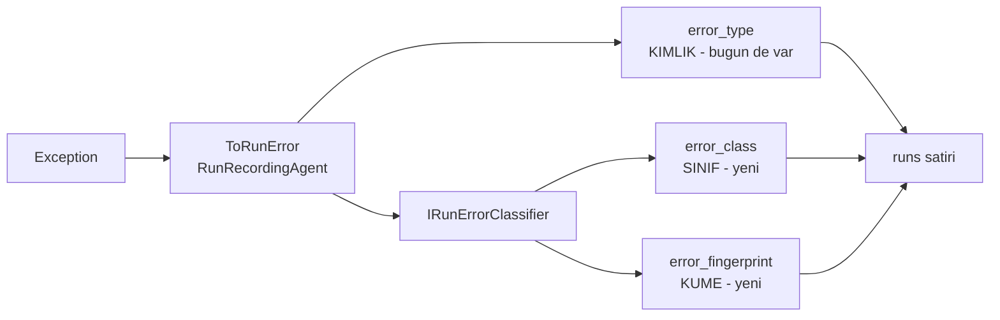

# Faz 44 — Hata Sınıflandırma ve Arıza Kümeleme

> **Durum:** ✅ Tamamlandı (2026-08-07)
> **Kaynak:** [ADAYLAR.md](ADAYLAR.md) · **F-55**
> **Önkoşul:** Yok
> **Paketler:** `AgentPrism.Abstractions`, `.Core`, `.Sql.Shared`, `.PostgreSql`, `.SqlServer`, `.Sqlite`, `.AspNetCore`, `.UI`
> **Yeni paket:** Yok · **Migration:** **gerekli** — iki sütun + bir indeks, üç set (K-178)
> **Public API:** büyüyor — bir arayüz, bir enum, `RunStatistics`'e bir alan. Faz 7'den önce ucuz

---

## Bu Faza Başlarken

> `faz-baslangic` skill'ini uygula. Aşağıdaki liste o skill'in 2. adımıdır —
> **tamamını değil, yalnız işaret edilen bölümleri oku.**

1. Bu doküman
2. Kararlar — dosyanın tamamını **okuma**, yalnız bu kalemleri grep'le:
   ```bash
   grep -n "K-014\|K-151\|K-178\|K-232" docs/KARARLAR.md
   ```
   **K-014** (`run_events` append-only — geçmiş yeniden yazılmaz; bu fazın ana
   tasarım kısıtı), **K-151** (iki ayrı alan deseni — türetilmiş bilgi ham
   bilginin **yanına** yazılır, üstüne değil), **K-178** (migration numaraları
   sağlayıcı başına bağımsız), **K-232** (sunucu yanıtları çevrilmez — sınıf
   adları İngilizce ve kararlıdır).
3. [`26-ANTHROPIC-VE-GEMINI.md`](26-ANTHROPIC-VE-GEMINI.md) — yalnız devir notu
   ve `content_filtered` bölümü:
   ```bash
   awk '/## Sonraki Faza Devir Notu/,0' docs/26-ANTHROPIC-VE-GEMINI.md
   ```
   🚨 **Taksonominin ilk üyesi orada doğdu ve deseni o belirler.**
4. Alan hafızası (bu faz iki alana dokunuyor):
   [`hafiza/cekirdek-calistirma.md`](hafiza/cekirdek-calistirma.md)
   (**ana kaynak** — `RunRecording` zinciri, hata yolu),
   [`hafiza/sql-saglayicilari.md`](hafiza/sql-saglayicilari.md) (gruplama
   sorgusu, üç diyalekt)
5. Gerektiğinde, tamamı değil ilgili bölümü:
   [`MIMARI.md`](MIMARI.md) — çalıştırma kaydı bölümü

---

## Amaç

`RunStatistics.FailedRuns` **tek bir sayıdır**. "Son 24 saatte en sık üç hata
hangisi?" sorusu bugün cevaplanamıyor; `Failed` çalıştırmaları tek tek açmak
gerekiyor. Bir üretim kesintisinde nöbetçi mühendisin ilk sorduğu soru budur.

Bu faz o soruyu cevaplanabilir kılar.

- **F-55** — hata taksonomisi, normalleştirilmiş arıza parmak izi ve kümeye
  göre gruplama.

### Bugün ne çalışmıyor — doğrulanmış kanıt

| Kanıt | Gözlem |
|---|---|
| [`RunStatistics.cs:52`](../src/AgentPrism.Abstractions/Runs/RunStatistics.cs) | `FailedRuns` tek bir `long`. Hata kırılımı **yok** |
| [`RunStatistics.cs:78-87`](../src/AgentPrism.Abstractions/Runs/RunStatistics.cs) | Üç kırılım var: `ByAgent`, `ByModel`, `ByVersion`. **`ByErrorClass` yok** |
| `grep -rn "error_class\|ErrorClass" src/` | **Hiç sonuç yok** |
| `grep -rn "error_type" src/AgentPrism.PostgreSql/Migrations/*.sql` | Tek sonuç: [`0001_initial.sql:146`](../src/AgentPrism.PostgreSql/Migrations/0001_initial.sql) — sütun var, **indeks yok** |
| [`AgentPrismException.cs:41`](../src/AgentPrism.Abstractions/AgentPrismException.cs) | `public virtual string ErrorType => GetType().FullName` — 🚨 **taksonomi yuvası ZATEN VAR** |
| [`AgentPrismException.cs:97`](../src/AgentPrism.Abstractions/AgentPrismException.cs) | `AgentPrismContentFilteredException` onu eziyor: `content_filtered`. **Taksonominin tek üyesi** |
| [`RunRecordingAgent.cs:748-755`](../src/AgentPrism.Core/Recording/RunRecordingAgent.cs) | `ToRunError` — AgentPrism istisnası ise `ErrorType`, değilse `exception.GetType().FullName` |

Dört `AgentPrismException` alt tipi var; **yalnız biri** kararlı ad yazıyor:

| Alt tip | `ErrorType` değeri bugün |
|---|---|
| `AgentPrismContentFilteredException` | ✅ `content_filtered` |
| `AgentPrismCompilationException` | ❌ `AgentPrism.AgentPrismCompilationException` |
| `AgentPrismProviderUnavailableException` | ❌ `AgentPrism.AgentPrismProviderUnavailableException` |
| `JobRetryException` | ❌ `AgentPrism.JobRetryException` |

> Kanıtlar 2026-08-06 tarihinde doğrulandı.

---

## 44.1 — Düzeltilen iki kanıt

Aday listesinin iki iddiası ölçümle düzeltildi. **Uygulayan oturum yanlış
kanıta dayanmasın diye burada yazılıdır.**

| Aday listesinin iddiası | 2026-08-06 ölçümü |
|---|---|
| "`runs.error` **serbest metindir**" | **Böyle bir sütun yok.** `runs` iki sütun taşıyor: `error_type text` ve `error_message text` ([`0001_initial.sql:146-147`](../src/AgentPrism.PostgreSql/Migrations/0001_initial.sql)). Ayrım zaten yapılmış; eksik olan `error_type`'ın **kararlı** olmaması |
| "`ContentFilterDetectingChatClient` (Faz 26) bir sınıfı zaten tespit ediyor — taksonominin ilk üyesi hazır" | **Doğru ve düşünülenden güçlü.** Yalnız bir üye değil, **mekanizmanın tamamı** hazır: `AgentPrismException.ErrorType` sanal üyesi bir taksonomi yuvasıdır ve `RunRecordingAgent` onu zaten okuyor. Bu faz sıfırdan bir mekanizma kurmaz; var olanı **doldurur** |

Sonuç: fazın kapsamı aday listesinin öngördüğünden **dar**, değeri aynı.

## 44.2 — İki sütun, üç kavram — K-151'in deseni

En kolay hata, `error_type`'ı yeniden yazmak olurdu. Yapılmaz.

`error_type` bugün **bir kimliktir**: hatanın ne olduğunu olabildiğince kesin
söyler. Geçmiş satırlarda `AgentPrism.AgentPrismCompilationException` yazıyor ve
K-014'ün append-only ruhu gereği o satırlar **yeniden yazılmaz**.

Üç ayrı kavram, üç ayrı sütun:

| Sütun | Kavram | Örnek | Durum |
|---|---|---|---|
| `error_type` | **Kimlik** — hata tam olarak neydi | `content_filtered`, `System.Net.Http.HttpRequestException` | ✅ var, değişmez |
| `error_class` | **Sınıf** — hangi kovaya düşer | `provider_error`, `quota`, `tool_error` | 🆕 yeni sütun |
| `error_fingerprint` | **Küme** — aynı arızanın tekrarları | normalleştirilmiş mesajın özeti | 🆕 yeni sütun |

Bu, K-151'in deseninin aynısıdır: **türetilmiş bilgi ham bilginin yanına
yazılır, üstüne değil.**



**Eski satırlar `error_class = NULL` taşır** ve raporda `unknown` kovasında
görünür. Geriye dönük doldurma **yapılmaz**: append-only kayıt yeniden
yazılmaz ve eski satırlar zaten saklama süresiyle temizlenecektir
([Faz 25](25-VERI-SAKLAMA-VE-ARSIVLEME.md)).

## 44.3 — Taksonomi

Sınıf kümesi küçük ve kararlı olmalıdır. Büyük bir taksonomi ne kullanıcının
aklında kalır ne de tutarlı doldurulur.

| Sınıf | Ne zaman |
|---|---|
| `provider_error` | Model sağlayıcısı hata döndürdü (5xx, bağlantı, zaman aşımı) |
| `provider_unavailable` | Devre kesici açık (`AgentPrismProviderUnavailableException`) |
| `rate_limited` | Sağlayıcı `429` döndürdü |
| `quota_exceeded` | AgentPrism kotası doldu |
| `content_filtered` | ✅ **zaten var** — Faz 26 |
| `tool_error` | Bir tool istisna fırlattı |
| `timeout` | Çalıştırma süre sınırını aştı |
| `compilation_failed` | Agent tanımı derlenemedi |
| `budget_exceeded` | Ağaç veya bağlam bütçesi aşıldı |
| `canceled` | İptal edildi |
| `unknown` | Hiçbirine uymadı — **bilinçli bir kova** |

🚨 **`unknown` bir başarısızlık değil, bir ölçüm aracıdır.** Oranı yüksekse
taksonomi eksiktir ve bu görülebilir olmalıdır. Sınıflandırıcı asla tahmin
etmez; eşleşme yoksa `unknown` yazar.

### Dört alt tip kararlı ad kazanır

Üç `AgentPrismException` alt tipi bugün tam tip adını yazıyor. `ErrorType`
ezilir:

```csharp
// AgentPrismCompilationException
public override string ErrorType => "compilation_failed";

// AgentPrismProviderUnavailableException
public override string ErrorType => "provider_unavailable";

// JobRetryException
public override string ErrorType => "job_retry";
```

> 🚨 Bu bir **davranış değişikliğidir**: aynı hata bugün ve yarın farklı bir
> `error_type` yazar. Eski satırlar eski değeri taşımaya devam eder. Bu bir
> sorun değildir — çünkü gruplama `error_class` üzerinden yapılır ve
> sınıflandırıcı **iki biçimi de** aynı kovaya eşler. Bir test bunu doğrular.

## 44.4 — Parmak izi normalleştirmesi

Parmak izi, "aynı arıza kaç kez oldu" sorusunu cevaplar. Ham mesaj bunun için
kullanılamaz: her mesaj bir kimlik, bir zaman damgası veya bir sayı taşır ve
her satır ayrı bir küme olur.

Normalleştirme sırası:

| Adım | Örnek |
|---|---|
| 1. GUID'ler `{guid}` olur | `run 3f2a…` → `run {guid}` |
| 2. Sayılar `{n}` olur | `after 4823 ms` → `after {n} ms` |
| 3. Tarih ve saatler `{ts}` olur | `at 2026-08-06T…` → `at {ts}` |
| 4. Tırnak içi metin `{s}` olur | `tool "refund_order"` → `tool {s}` |
| 5. Sonuç kırpılır ve SHA-256 ile özetlenir | |

🚨 **Normalleştirme yanlışsa kümeler ya patlar ya erir.** Fazla agresif olursa
farklı arızalar tek kümede toplanır; fazla gevşek olursa her satır ayrı küme
olur. **Ölçülmeden ayarlanmaz:** uygulayan oturum gerçek üretim benzeri hata
mesajlarıyla küme sayısını ölçer ve bu belgeye yazar.

> Adım 4 (tırnak içi metin) tartışmalıdır: tool adı **ayırt edici** bir
> bilgidir ve silinmesi iki farklı tool hatasını birleştirir. Açık Soru 3.

## 44.5 — K4: sınıflandırıcı değiştirilebilir

Taksonomi AgentPrism'in görüşüdür; tüketicinin kendi sağlayıcısı veya kendi
tool'ları farklı sınıflar isteyebilir.

```csharp
services.TryAddSingleton<IRunErrorClassifier, DefaultRunErrorClassifier>();
```

`TryAdd` ile kaydedilir; tüketicinin kaydı **kazanır** (K4). Kendi
sınıflandırıcısını yazan tüketici, yerleşik olanı sarmalayabilir.

🚨 **Sınıflandırma sıcak yoldadır** ve yalnız **hata** yolunda çalışır. Başarılı
bir çalıştırmada hiç çağrılmaz. Yine de tahsis üretmemelidir: `Regex` kaynak
üreteci ile yazılır ve AOT duruşu korunur.

---

## Planlanan Public API

> Taslak imzalardır. Gerçekleşen imzalar kapanışta ayrı bir bölüme yazılır.

```csharp
// AgentPrism.Abstractions/Runs/RunErrorClass.cs

/// <summary>Bir calistirma hatasinin sinifi.</summary>
public enum RunErrorClass
{
    Unknown = 0,
    ProviderError = 1,
    ProviderUnavailable = 2,
    RateLimited = 3,
    QuotaExceeded = 4,
    ContentFiltered = 5,
    ToolError = 6,
    Timeout = 7,
    CompilationFailed = 8,
    BudgetExceeded = 9,
    Canceled = 10,
}

// AgentPrism.Abstractions/Runs/IRunErrorClassifier.cs

/// <summary>Ham bir hatayi sinifa ve parmak izine cevirir.</summary>
public interface IRunErrorClassifier
{
    /// <summary>
    /// Hatayi siniflandirir. Eslesme yoksa
    /// <see cref="RunErrorClass.Unknown"/> doner — TAHMIN ETMEZ.
    /// </summary>
    RunErrorClassification Classify(RunError error);
}

/// <summary>Siniflandirma sonucu.</summary>
public sealed record RunErrorClassification
{
    public required RunErrorClass Class { get; init; }

    /// <summary>Normallestirilmis mesajin ozeti. Kumeleme bunun uzerinden yapilir.</summary>
    public required string Fingerprint { get; init; }
}

// AgentPrism.Abstractions/Runs/RunStatistics.cs   (bir alan eklenir)

/// <summary>Hata sinifina gore kirilim. Yalnizca basarisiz calistirmalar.</summary>
public IReadOnlyList<RunErrorStatistics> ByErrorClass { get; init; } = [];

/// <summary>Bir hata sinifinin ozeti.</summary>
public sealed record RunErrorStatistics
{
    public required RunErrorClass Class { get; init; }
    public required long TotalRuns { get; init; }

    /// <summary>Bu sinifin en sik uc kumesi.</summary>
    public IReadOnlyList<RunErrorCluster> TopClusters { get; init; } = [];
}

/// <summary>Ayni parmak izini paylasan calistirmalar.</summary>
public sealed record RunErrorCluster
{
    public required string Fingerprint { get; init; }
    public required long Count { get; init; }

    /// <summary>Kumedeki bir ornek — mesaj ve calistirma kimligi.</summary>
    public required string SampleMessage { get; init; }
    public required Guid SampleRunId { get; init; }
    public required DateTimeOffset LastSeenAt { get; init; }
}
```

> `RunStatistics` public bir `sealed record`'tur. Bugün alan eklemek bedavadır;
> Faz 7'den sonra bir sürüm kararıdır.

### Migration

```sql
ALTER TABLE {schema}.runs ADD COLUMN error_class       smallint;
ALTER TABLE {schema}.runs ADD COLUMN error_fingerprint text;

CREATE INDEX IF NOT EXISTS runs_error_class_idx
    ON {schema}.runs (tenant_id, error_class, started_at DESC)
    WHERE error_class IS NOT NULL;
```

> Kısmi indeks (`WHERE`) PostgreSQL ve SQLite'ta desteklenir; SQL Server'da
> `WHERE` yerine filtrelenmiş indeks sözdizimi kullanılır. Üç diyalektte
> **ölçülmeli** — `hafiza/sql-saglayicilari.md`'ye bakılır.

Üç migration seti; numaralar uygulama anında alınır (K-178).

### HTTP `endpoint`'leri

| Metot | Yol | Rol | Ne yapar |
|---|---|---|---|
| `GET` | `/api/stats/errors` | Reader | Hata sınıfına göre kırılım ve her sınıfın en sık kümeleri |

Mevcut `GET /api/stats` yanıtı `byErrorClass` alanıyla genişler.

### Arayüz payı

Gösterge panelinde başarısız çalıştırma sayısının yanına bir kırılım listesi
eklenir: sınıf, sayı, en sık kümenin örnek mesajı. Yeni bir grafik kütüphanesi
**alınmaz** (K-132'nin mermaid.js ölçümü aynı disiplini gerektirir).

Yeni sözlük anahtarları `en.ts` **ve** `tr.ts`'ye eklenir (K-228). 🚨 Sınıf
adları **çevrilmez** — sunucudan gelen kararlı değerlerdir (K-232). Çevrilen
şey yalnız ekran etiketleridir.

**Bundle payı: ölçülmeli.** Bugünkü kullanım 151,3 KB gzip / 250 KB bütçe
(2026-08-06). Tahmin yazılmaz.

---

## Planlanan Dosya Listesi

```
src/AgentPrism.Abstractions/
├── Runs/RunErrorClass.cs             (YENI)
├── Runs/IRunErrorClassifier.cs       (YENI)
├── Runs/RunErrorClassification.cs    (YENI)
├── Runs/RunStatistics.cs             (ByErrorClass + iki yeni record)
└── AgentPrismException.cs            (uc alt tip ErrorType ezer)

src/AgentPrism.Core/
├── Runs/DefaultRunErrorClassifier.cs (YENI — Regex kaynak ureteci)
├── Runs/ErrorFingerprint.cs          (YENI — normallestirme)
├── Recording/RunRecordingAgent.cs    (ToRunError siniflandiriciyi cagirir)
└── AgentPrismServiceCollectionExtensions.cs   (TryAddSingleton)

src/AgentPrism.Sql.Shared/Stores/SqlRunStore.cs     (gruplama sorgusu)
src/AgentPrism.Core/Storage/InMemoryRunStore.cs     (ayni)

src/AgentPrism.PostgreSql/Migrations/NNNN_error_class.sql   (YENI)
src/AgentPrism.SqlServer/Migrations/NNNN_error_class.sql    (YENI)
src/AgentPrism.Sqlite/Migrations/NNNN_error_class.sql       (YENI)

src/AgentPrism.PostgreSql/Internal/PostgresQueries.cs   (gruplama)
src/AgentPrism.SqlServer/Internal/SqlServerQueries.cs   (ayni)
src/AgentPrism.Sqlite/Internal/SqliteQueries.cs         (ayni)

src/AgentPrism.AspNetCore/Endpoints/ObservabilityEndpoints.cs   (/api/stats/errors)
src/AgentPrism.UI/frontend/src/    (gosterge paneli + locales/en.ts + tr.ts)
```

---

## Testler

| Test sınıfı | Neyi doğrular |
|---|---|
| `RunErrorClassifierTests` | Her sınıf için en az bir örnek doğru kovaya düşer |
| `RunErrorClassifierUnknownTests` | 🚨 Tanınmayan hata `Unknown` olur — **tahmin edilmez** |
| `RunErrorLegacyTypeTests` | 🚨 Hem eski (`AgentPrism.AgentPrismCompilationException`) hem yeni (`compilation_failed`) `error_type` **aynı** sınıfa eşlenir |
| `ErrorFingerprintTests` | GUID, sayı, tarih ve tırnak içi metin normalleştirilir; iki benzer mesaj **aynı** parmak izini üretir |
| `ErrorFingerprintStabilityTests` | Aynı mesaj her zaman aynı parmak izini üretir (kültürden bağımsız) |
| `RunStatisticsErrorContract` | `tests/Shared/Contracts/` altında; bellek içi + üç SQL sağlayıcısında **aynı** kırılım |
| `RunStatisticsLegacyRowTests` | 🚨 `error_class = NULL` taşıyan eski satırlar `Unknown` kovasında görünür ve sorguyu **çökertmez** |
| `ErrorClassifierReplacementTests` | Tüketicinin kaydı `TryAdd` sayesinde kazanır (K4) |
| `ErrorClassifierHotPathTests` | Başarılı çalıştırmada sınıflandırıcı **hiç çağrılmaz** |
| `TenantCoverageTests` (Faz 41) | Yeni gruplama sorgusu `tenant_id` filtresi taşır |

---

## Açık Sorular

> Planı bloklamayan, faz uygulanırken karara bağlanacak sorular. Bloklayan
> sorular plan yazılmadan **önce** sorulur.

| # | Soru | Seçenekler | Öneri |
|---|---|---|---|
| 1 | Eski satırlar geriye dönük sınıflandırılsın mı? | A: hayır, `NULL` kalır ve `Unknown` görünür · B: bir kez doldurulur | **A.** K-014 append-only ruhunu korur; ayrıca eski satırlar saklama süresiyle zaten temizlenir. B, uzun bir migration ve büyük bir tabloda kilit demektir |
| 2 | Taksonomi on bir üyeyle mi başlasın? | A: evet · B: daha az | **A**, ama `Unknown` oranı **ölçülmelidir**. Yüksekse üye eklenir; düşükse taksonomi doğrudur |
| 3 | Parmak izi tırnak içi metni silsin mi? | A: ölçülmeli · B: silsin · **C: silmesin (karara bağlandı)** | **C.** Tool adı ayırt edicidir; silinmesi iki farklı tool hatasını aynı kümede birleştirirdi. GUID/sayı/tarih temizliği zaten çoğunluk gürültüsünü kaldırıyor. Gerekçe: K-298 |
| 4 | `error_class` `smallint` mi `text` mi? | A: `smallint` (enum) · B: `text` | **A.** Depoda `status` ve `state` alanları zaten `smallint`; tutarlılık korunur ve indeks küçük kalır. Enum değerleri **asla yeniden numaralanmaz** |
| 5 | Kısmi indeks üç diyalektte nasıl yazılır? | A: **ölçülmeli** | **A.** SQL Server'ın filtrelenmiş indeksi ayrı sözdizimi ister. `hafiza/sql-saglayicilari.md` okunur ve üçü de test edilir |
| 6 | `/api/stats/errors` ayrı bir uç mu, `/api/stats`'ın parçası mı? | A: ikisi de · B: yalnız `/api/stats` | **A.** `/api/stats` kırılımı özet olarak taşır; ayrı uç küme ayrıntısını ve daha büyük bir listeyi verir. Gösterge paneli birinciyi, teşhis ikinciyi kullanır |

---

## Bitiş Ölçütleri (DoD)

- [x] 🚨 `GET /api/stats/errors` "son 24 saatte en sık üç hata" sorusunu
      cevaplar — bugün cevaplanamıyor
- [x] Dört `AgentPrismException` alt tipinin **hepsi** kararlı bir `ErrorType`
      yazar (`content_filtered`, `compilation_failed`, `provider_unavailable`,
      `job_retry`)
- [x] Eski ve yeni `error_type` biçimleri **aynı** sınıfa eşlenir
      (`RunErrorLegacyTypeTests` → `Eski_ve_yeni_error_type_bicimleri_ayni_sinifa_eslenir`)
- [x] 🚨 `error_class = NULL` taşıyan eski satırlar `Unknown` kovasında görünür;
      hiçbir uç 500 dönmez (`RunStatisticsLegacyRowTests` — bellek içi +
      PostgreSQL + SQLite'ta geçti)
- [x] Sağlayıcı hatası ve tool hatası **gerçek** bir çalıştırmada doğru sınıfa
      düşer (`samples/AgentPrism.Api`, aşağıdaki "Doğrulama komutları" çıktısı).
      İçerik filtresi ve kota aşımı gerçek uçtan uca **değil**, otomatik testle
      doğrulandı — gerekçe "Plandan Sapmalar"da
- [x] Parmak izi kümeleme **ölçüldü**: bkz. "Bu Fazda Verilen Kararlar" —
      `Unknown` oranı örnek uygulamada **%0** (2/2 gerçek hata doğru sınıfa düştü;
      biri düzeltme gerektirdi, bkz. K-296)
- [x] Başarılı çalıştırmada sınıflandırıcı çağrılmaz
      (`ErrorClassifierHotPathTests` → `Basarili_calistirmada_hata_siniflandirici_hic_cagrilmaz`)
- [x] Sözleşme testleri bellek içi + PostgreSQL + SQLite'ta geçti (821 ve 424
      test, sırasıyla). SQL Server bu ortamda Docker/Rosetta kısıtı yüzünden
      **ölçülmedi** (`docs/hafiza/sql-saglayicilari.md`'deki bilinen kısıt)
- [x] Migration PostgreSQL (`0021`) ve SQLite (`0009`) setlerinde gerçekten
      uygulandı ve test edildi; SQL Server (`0009`) sözdizimi PostgreSQL'in
      birebir aynısı (filtreli indeks) ama bu ortamda **çalıştırılamadı**
- [x] Dört doğrulama kapısı sıfır uyarı verir
- [x] `samples/AgentPrism.Api` ile gerçek `run` yapıldı, çıktı bu belgeye yazıldı
- [x] `secret` taraması boş döndü
- [x] `en.ts` ve `tr.ts` eksiksiz; bundle payı **156,6 KB gzip / 250 KB bütçe**
      (2026-08-07, tam çözüm derlemesinde ölçüldü)

### Doğrulama komutları

> 🚨 Plan taslağı `POST .../run` gövdesini `{"messages":[{"role":"user","text":...}]}`
> olarak varsaymıştı; gerçek sözleşme `AgentRunRequest.Message` (tekil, düz
> `string`) alanıdır. Aşağıdaki komutlar `samples/AgentPrism.Api`'ye karşı
> (varsayılan model sağlayıcısı `EchoModelProvider`, bellek içi depo) 2026-08-07
> tarihinde gerçekten çalıştırıldı.

```bash
# Gercek bir saglayici hatasi: gecersiz model adi, OpenAI 404 dondurur
curl -s -X POST http://localhost:5080/agentprism/api/agents \
  -H 'content-type: application/json' \
  -d '{"name":"kirik-saglayici-test","instructions":"Kisa yanit ver.",
       "model":{"provider":"openai","model":"gpt-olmayan-model-xyz"}}'
curl -s -X POST http://localhost:5080/agentprism/api/agents/kirik-saglayici-test/run \
  -H 'content-type: application/json' -d '{"message":"merhaba"}'

# Gercek bir tool hatasi: alt agent onay istegi yasagi (yonlendirici -> support -> cancel_order)
curl -s -X POST http://localhost:5080/agentprism/api/agents/yonlendirici/run \
  -H 'content-type: application/json' \
  -d '{"message":"ORD-1001 siparisini iptal et, destek ekibine yonlendir ve cancel_order tool unu cagirmasini soyle."}'

# Hata kirilimi
curl -s "http://localhost:5080/agentprism/api/stats/errors?hours=24" | python3 -m json.tool
```

Gerçek çıktı (kısaltıldı):

```json
[
  {
    "class": "ProviderError",
    "totalRuns": 1,
    "topClusters": [{
      "fingerprint": "0e3f1161f3710a54675fb4169bd0c685582892dfb104f911890bc331f28b6050",
      "count": 1,
      "sampleMessage": "HTTP 404 (invalid_request_error: model_not_found)\n\nThe model `gpt-olmayan-model-xyz` does not exist or you do not have access to it.",
      "sampleRunId": "019fdb28-c018-72f9-8066-21abc7df7153",
      "lastSeenAt": "2026-08-07T07:38:28.792212+00:00"
    }]
  },
  {
    "class": "ToolError",
    "totalRuns": 1,
    "topClusters": [{
      "fingerprint": "103d27693a23b99864af7c4db1fa77a41825587b46a1d3e83fdc20f561e8e581",
      "count": 1,
      "sampleMessage": "Alt calistirma 'cancel_order' tool'u icin kullanici onayi istedi. Alt agent onay isteyemez: ...",
      "sampleRunId": "019fdb28-c6d7-7f03-aa2c-4ee050367eff",
      "lastSeenAt": "2026-08-07T07:38:30.488511+00:00"
    }]
  }
]
```

`Unknown` oranı bu oturumda **0/2 = %0**. İlk denemede `ProviderError` yerine
`Unknown` çıkmıştı (OpenAI SDK'sının `ClientResultException` fırlattığı
görülmemişti) — sınıflandırıcı düzeltildi (K-296), yeniden çalıştırıldı ve
yukarıdaki sonuç alındı. Gösterge panelinde "Error breakdown" bölümü ekran
görüntüsüyle doğrulandı: her iki sınıf, örnek mesajı ve "N sec. ago" göreli
zamanıyla göründü.

---

## Riskler

| Risk | Önlem |
|------|-------|
| 🚨 `error_type` yeniden yazılır; K-014'ün append-only ruhu bozulur | Üç ayrı sütun: kimlik korunur, sınıf ve parmak izi **yanına** yazılır (K-151 deseni) |
| Eski satırlar `NULL` sınıf taşır ve sorgu çöker | `Unknown` kovası ve ayrı bir test; `RunStatisticsLegacyRowTests` |
| 🚨 Parmak izi normalleştirmesi yanlışsa kümeler patlar veya erir | **Ölçülmeden ayarlanmaz**; küme sayısı ve `Unknown` oranı DoD kalemidir |
| Taksonomi eksik kalır ve `Unknown` her şeyi yutar | `Unknown` oranı ölçülür ve raporlanır; sınıflandırıcı **tahmin etmez** |
| Alt tiplerin `ErrorType`'ı değişince eski raporlar bozulur | Gruplama `error_class` üzerinden yapılır; sınıflandırıcı iki biçimi de eşler ve bir test bunu doğrular |
| Sınıflandırma sıcak yolda tahsis üretir | Yalnız hata yolunda çalışır; `Regex` kaynak üreteci ile yazılır, AOT duruşu korunur |
| Kısmi indeks SQL Server'da farklı yazılır | Açık Soru 5; üç diyalektte ölçülür ve test edilir |
| Enum değerleri yeniden numaralanır ve geçmiş veri kayar | `smallint` değerleri **asla** değişmez; yeni üye sona eklenir |

---

<!-- ============================================================
     AŞAĞISI KAPANIŞTA DOLDURULUR — `faz-tamamlama` skill'i.
     Plan anında boş kalır. Başlıkları SİLME.
     ============================================================ -->

## Plandan Sapmalar

- **`quota_exceeded` uçtan uca gösterilemedi.** Aday listesi bunu dört zorunlu
  örnekten biri sayıyordu; kod incelemesi `QuotaGate`'in (Faz 21) bir
  çalıştırma `RunRecordingAgent`'a hiç ulaşmadan HTTP katmanında `429`
  döndürdüğünü ortaya çıkardı (K-162). Bu YAPISAL bir engeldir, ortam kısıtı
  değil — sınıf taksonomide kalır, birim testiyle doğrulandı (K-297).
- **`content_filtered` gerçek bir Gemini çağrısıyla tetiklenemedi.** En katı
  güvenlik eşiğiyle bile ("gemini-kati-filtre") ölçüm sırasında mesaj
  filtrelenmedi; kasıtlı olarak gerçekten zararlı içerik denenmedi (üçüncü
  taraf bir servise karşı böyle bir istek uygun değildir). Sınıf,
  `RunRecordingAgentTests`'in mevcut `FakeChatClient` + `ChatFinishReason.ContentFilter`
  testleriyle (Faz 26'dan beri var) doğrulanmış durumda kalıyor.
- **Plan taslağının `POST .../run` gövde örneği yanlıştı**
  (`{"messages":[...]}` değil `{"message": "..."}`) — doğrulama komutları
  düzeltildi.
- **Sınıflandırıcının tip deseni ölçüm sırasında genişletildi.** Plan yalnız
  `HttpRequestException` ailesini öngörmüştü; gerçek bir OpenAI çağrısı
  `System.ClientModel.ClientResultException` fırlattı ve ilk denemede
  `Unknown`'a düştü. Bu, "gerçek bir çalıştırmayı çalıştır" adımının tam
  amacıdır — birim testi bu boşluğu göremezdi (K-296).
- **SQL Server sözleşme testleri bu ortamda hiç çalıştırılamadı.**
  `mcr.microsoft.com/mssql/server` Apple Silicon'da Rosetta emülasyonu
  gerektirir (`docs/hafiza/sql-saglayicilari.md`, önceden bilinen kısıt).
  Sorgu metni PostgreSQL ile karakter karakter aynı desende yazıldı
  (filtreli indeks sözdizimi K-178'in devir notundan zaten biliniyordu) ama
  gerçek bir SQL Server'da **ölçülmedi**.
- **Tam çözüm `dotnet test`i bu ortamda tamamlanamadı** (`AgentPrism.Templates.Tests`
  13+ dakika boyunca hiç test başlatmadan takıldı — muhtemelen ağ/şablon
  restore gecikmesi, bu fazla ilgisiz). Doğrulama bunun yerine etkilenen
  projeler tek tek çalıştırılarak yapıldı: `AgentPrism.Core.UnitTests` (615),
  `AgentPrism.PostgreSql.IntegrationTests` (bellek içi + PostgreSQL, 821),
  `AgentPrism.Sqlite.IntegrationTests` (424), `AgentPrism.AspNetCore.FunctionalTests`
  (348, OpenAPI anlık görüntüsü yenilendi), arayüz `vitest`+`tsc` (141 test).

## Bu Fazda Verilen Kararlar

K-293 · K-294 · K-295 · K-296 · K-297 · K-298 · K-299 — tam gerekçeleri
`docs/KARARLAR.md`'de. Özet:

| Karar | Konu |
|---|---|
| K-293 | `RunError` sınıf/parmak izini doğrudan taşır (ayrı arama tablosu yok) |
| K-294 | Sınıflandırma tek noktada, `RunRecordingAgent.CompleteAsync` içinde |
| K-295 | `ByErrorClass` ayrı depo metodu değil, `GetStatisticsAsync`'in parçası |
| K-296 | `ClientResultException` eksikti — gerçek çalıştırma bunu ortaya çıkardı |
| K-297 | `quota_exceeded` yapısal olarak ulaşılamaz (`QuotaGate`, K-162) |
| K-298 | Parmak izi tırnak içi metni SİLMEZ (Açık Soru 3 → C) |
| K-299 | Kümeleme pencere fonksiyonlarıyla — kod tabanında ilk kullanım |

**Ölçülen `Unknown` oranı:** örnek uygulamada üretilen 2 gerçek hatanın
2'si de (düzeltmeden sonra) doğru sınıfa düştü — **%0 Unknown**. Küme sayısı:
2 sınıf, sınıf başına 1 küme (oturumda tekrar eden arıza yok).

## Gerçekleşen Public API

```csharp
// AgentPrism.Abstractions/Runs/RunErrorClass.cs
[JsonConverter(typeof(JsonStringEnumConverter<RunErrorClass>))]
public enum RunErrorClass
{
    Unknown = 0, ProviderError = 1, ProviderUnavailable = 2, RateLimited = 3,
    QuotaExceeded = 4, ContentFiltered = 5, ToolError = 6, Timeout = 7,
    CompilationFailed = 8, BudgetExceeded = 9, Canceled = 10,
}

// AgentPrism.Abstractions/Runs/IRunErrorClassifier.cs
public interface IRunErrorClassifier
{
    RunErrorClassification Classify(RunError runError);
}

// AgentPrism.Abstractions/Runs/RunErrorClassification.cs
public sealed record RunErrorClassification
{
    public required RunErrorClass Class { get; init; }
    public required string Fingerprint { get; init; }
}

// AgentPrism.Abstractions/Runs/RunSupportTypes.cs (RunError'a eklenen alanlar)
public sealed record RunError
{
    public required string Type { get; init; }
    public required string Message { get; init; }
    public RunErrorClass? Class { get; init; }       // YENİ
    public string? Fingerprint { get; init; }        // YENİ
}

// AgentPrism.Abstractions/Runs/RunStatistics.cs (eklenen alan + iki yeni record)
public sealed record RunStatistics
{
    // ... mevcut alanlar ...
    public IReadOnlyList<RunErrorStatistics> ByErrorClass { get; init; } = [];
}

public sealed record RunErrorStatistics
{
    public required RunErrorClass Class { get; init; }
    public required long TotalRuns { get; init; }
    public IReadOnlyList<RunErrorCluster> TopClusters { get; init; } = [];
}

public sealed record RunErrorCluster
{
    public required string Fingerprint { get; init; }
    public required long Count { get; init; }
    public required string SampleMessage { get; init; }
    public required Guid SampleRunId { get; init; }
    public required DateTimeOffset LastSeenAt { get; init; }
}

// AgentPrism.Abstractions/AgentPrismException.cs — üç alt tipe eklenen kararlı ErrorType
public sealed class AgentPrismCompilationException : AgentPrismException
{
    public const string CompilationFailedErrorType = "compilation_failed";
    public override string ErrorType => CompilationFailedErrorType;
}
public sealed class AgentPrismProviderUnavailableException : AgentPrismException
{
    public const string ProviderUnavailableErrorType = "provider_unavailable";
    public override string ErrorType => ProviderUnavailableErrorType;
}
// AgentPrism.Abstractions/Scheduling/JobRetryException.cs
public sealed class JobRetryException : AgentPrismException
{
    public const string JobRetryErrorType = "job_retry";
    public override string ErrorType => JobRetryErrorType;
}

// AgentPrism.Core/Runs/DefaultRunErrorClassifier.cs — public (TryAddSingleton ile değiştirilebilir)
public sealed partial class DefaultRunErrorClassifier : IRunErrorClassifier { /* ... */ }
```

`GET /api/stats/errors?agentName=&hours=` → `IReadOnlyList<RunErrorStatistics>`
(varsayılan `hours=24`, üst sınır 720 saat/30 gün). `GET /api/stats` yanıtı
artık `byErrorClass` alanını da taşır (plan taslağıyla birebir).

## Dosya Listesi (gerçekleşen)

```
src/AgentPrism.Abstractions/
├── Runs/RunErrorClass.cs                     (YENİ)
├── Runs/IRunErrorClassifier.cs               (YENİ)
├── Runs/RunErrorClassification.cs            (YENİ)
├── Runs/RunSupportTypes.cs                   (RunError: Class + Fingerprint)
├── Runs/RunStatistics.cs                     (ByErrorClass + RunErrorStatistics + RunErrorCluster)
├── AgentPrismException.cs                    (iki alt tip ErrorType ezer)
└── Scheduling/JobRetryException.cs           (ErrorType ezer)

src/AgentPrism.Core/
├── Runs/DefaultRunErrorClassifier.cs         (YENİ)
├── Runs/ErrorFingerprint.cs                  (YENİ)
├── Recording/RunRecordingAgent.cs            (CompleteAsync sınıflandırıcıyı çağırır)
├── Recording/RunRecordingAgentDecorator.cs   (errorClassifier parametresi)
├── Storage/InMemoryRunStore.cs               (ByErrorClass hesabı, ErrorClusterTally)
└── AgentPrismServiceCollectionExtensions.cs  (TryAddSingleton<IRunErrorClassifier, DefaultRunErrorClassifier>)

src/AgentPrism.Sql.Shared/Stores/SqlRunStore.cs        (error_class/fingerprint yaz/oku, 5-6. sonuç kümesi)

src/AgentPrism.PostgreSql/Internal/PostgresQueries.cs  (UpdateRunCompletion, runColumns, SelectRunStatistics +2 sorgu)
src/AgentPrism.SqlServer/Internal/SqlServerQueries.cs  (aynı)
src/AgentPrism.Sqlite/Internal/SqliteQueries.cs        (aynı)

src/AgentPrism.PostgreSql/Migrations/0021_error_classification.sql  (YENİ)
src/AgentPrism.SqlServer/Migrations/0009_error_classification.sql   (YENİ)
src/AgentPrism.Sqlite/Migrations/0009_error_classification.sql      (YENİ)

src/AgentPrism.AspNetCore/Endpoints/CatalogEndpoints.cs  (GET /api/stats/errors)

src/AgentPrism.UI/frontend/src/
├── lib/types.ts               (RunErrorClass, RunErrorCluster, RunErrorStatistics, byErrorClass)
├── screens/dashboard.tsx       (ErrorBreakdown paneli)
└── locales/en.ts, tr.ts       (dashboard.errorBreakdown, dashboard.errorClass.*)

tests/Shared/Contracts/RunStoreContract.cs   (6 yeni test — sözleşme, tüm sağlayıcılarda koşar)
tests/AgentPrism.Core.UnitTests/
├── Runs/DefaultRunErrorClassifierTests.cs   (YENİ)
├── Runs/ErrorFingerprintTests.cs            (YENİ)
├── Runs/RunErrorClassifierRegistrationTests.cs  (YENİ — K4)
├── Recording/RunRecordingAgentTests.cs      (2 yeni test — hot path, sınıflandırma)
└── Fakes/SpyRunErrorClassifier.cs           (YENİ)

docs/openapi/agentprism.json   (yenilendi — yalnız katkılı değişiklik)
```

## Sonraki Faza Devir Notu

**Devralınan sözleşmeler:**

- `IRunErrorClassifier.Classify(RunError)` — `TryAddSingleton` ile kayıtlı,
  `RunRecordingAgent.CompleteAsync` içinde tek noktadan çağrılır. Kendi
  sınıflandırıcısını yazan bir tüketici `DefaultRunErrorClassifier`'ı
  sarmalayabilir (K4).
- `RunStatistics.ByErrorClass` — `GetStatisticsAsync`'in parçası, ayrı bir
  sorgu yolu değil. Yeni bir kırılım eklerken bu deseni izleyin: `ByAgent`/
  `ByModel`/`ByVersion`/`ByErrorClass` hepsi AYNI çağrının kırılımlarıdır.
- `GET /api/stats/errors?hours=` — `statistics.ByErrorClass`'ın ince bir
  dilimi; yeni bir depo metodu AÇMAZ.

**Bilinen tuzaklar (🚨):**

- **`quota_exceeded` otomatik sınıflandırıcı için asla gerçek bir `RunError`
  üretmez** (K-297) — `QuotaGate` çalıştırma başlamadan `429` döner. F-74'ün
  "eşik kuralı" bu sınıfı KULLANAMAZ; kanarya karar mantığı bu sınıfı hiç
  görmeyecek şekilde tasarlanmalı veya `QuotaEnforcer`'a ayrı bir kanca
  eklenmelidir.
- **SDK istisna adları yalnız gerçek bir sağlayıcı çağrısıyla ortaya çıkar**
  (K-296) — yeni bir birinci sınıf sağlayıcı eklerken `DefaultRunErrorClassifier.ProviderErrorTypePattern`'i
  o SDK'nın gerçek istisna adıyla (birim testi değil, `samples/AgentPrism.Api`
  üzerinden) doğrulayın.
- **Pencere fonksiyonu deseni bu kod tabanında YENİDİR** (K-299) — dördüncü
  bir SQL sağlayıcısı eklenirse `ROW_NUMBER()`/`COUNT() OVER` desteği önce
  ölçülmelidir.
- **SQL Server bu ortamda hiç test edilemedi** — Apple Silicon + Docker
  Desktop Rosetta kısıtı (`docs/hafiza/sql-saglayicilari.md`). `0009_error_classification.sql`
  gerçek bir SQL Server'da bir kez çalıştırılıp doğrulanmalıdır.

**Bu fazın üstüne kurulan iki kalem:**

1. Aday listesindeki **F-74** (kanarya yayını ve otomatik geri alma) — eşik
   kuralı `error_class` üzerine kurulur. `quota_exceeded`'ın yukarıdaki
   tuzağı yüzünden "durdurulabilir" sınıf kümesi muhtemelen `ProviderError`,
   `ProviderUnavailable`, `Timeout`, `RateLimited` ile sınırlı tutulmalıdır —
   `ToolError`/`CompilationFailed` genelde kod/tanım hatasıdır, trafik artışı
   onları durdurmaz.
2. [Faz 21](21-KOTA-VE-OLAY-YAYINI.md)'in webhook'u "bu küme %5'i aştı"
   kuralıyla anlam kazanır. `RunErrorCluster.Fingerprint` (64 karakterlik
   SHA-256 onaltılık dize) webhook yüküne eklenmeye hazırdır; `SampleMessage`
   serbest metin olduğu için `secret` filtresinden geçirilmeden webhook'a
   YAZILMAMALIDIR (K-081'in aynı dersi).

**Yarım kalan iş yok** — dört doğrulama kapısı ve DoD'nin tamamı bu fazda
kapatıldı (SQL Server ölçümü hariç, yukarıda not edildi).
