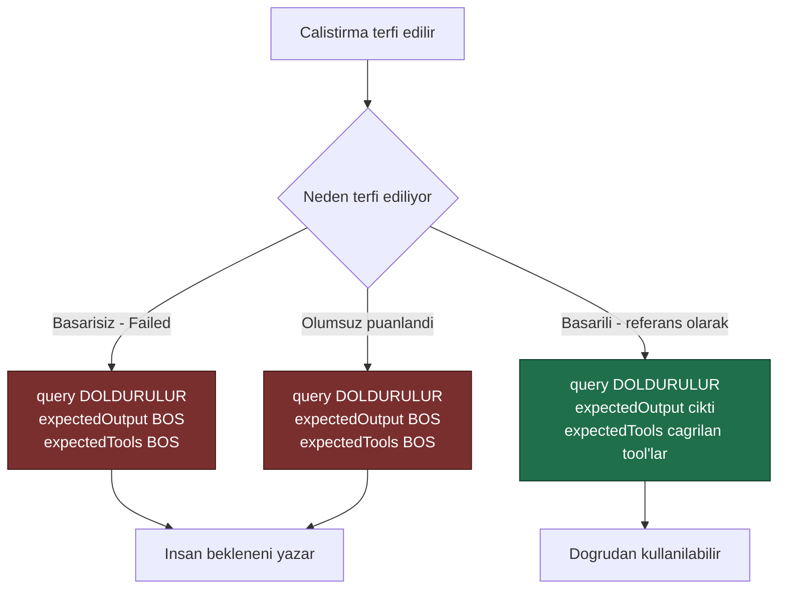

# Faz 45 — Üretimden Değerlendirme Veri Kümesi Toplama

> **Durum:** ✅ Tamamlandı (2026-08-07)
> **Kaynak:** [UCUNCU-FAZ-ADAYLARI.md](UCUNCU-FAZ-ADAYLARI.md) · **F-53**
> **Önkoşul:** [Faz 31](31-GERI-BILDIRIM-VE-PUANLAMA.md) — puan bazlı terfi `run_scores` tablosunu ister. Durum bazlı terfi Faz 31 olmadan da çalışır ([45.1](#451--faz-31-ne-kadar-önkoşul))
> **Paketler:** `AgentPrism.Abstractions`, `.Core`, `.Sql.Shared`, `.PostgreSql`, `.SqlServer`, `.Sqlite`, `.AspNetCore`, `.UI`
> **Yeni paket:** Yok · **Migration:** **gerekli** — `eval_cases`'e üç sütun, üç set (K-178). Gerekçe [45.5](#455--terfi-eden-vakanın-kökeni-izlenir)
> **Public API:** büyüyor — `IEvalStore`'a bir metot, bir kayıt tipi. 🚨 Faz 7'den önce ucuz, sonra **kırıcı**

---

## Bu Faza Başlarken

> `faz-baslangic` skill'ini uygula. Aşağıdaki liste o skill'in 2. adımıdır —
> **tamamını değil, yalnız işaret edilen bölümleri oku.**

1. Bu doküman
2. Kararlar — dosyanın tamamını **okuma**, yalnız bu kalemleri grep'le:
   ```bash
   grep -n "K-014\|K-107\|K-139\|K-140\|K-143\|K-178" docs/KARARLAR.md
   ```
   **K-139** (Faz 18 MAF'ın `LocalEvaluator`'ını kullanıyor — ikinci bir eval
   çerçevesi yazılmaz), **K-140** (AI yargıcı Faz 18 kapsamı dışında bırakıldı —
   bu faz da yargıç yazmaz), **K-143** (🚨 arayüzde vaka düzenleyici **tekrarlanan
   alan formudur**, JSON değil — terfi ekranı aynı deseni izler), **K-014**
   (`run_events` append-only — kaynak veri değişmez), **K-107** (özetlenen
   mesajlar silinmez — kaynak veri hassastır), **K-178** (migration numaraları
   sağlayıcı başına bağımsız).
3. [`18-DEGERLENDIRME.md`](18-DEGERLENDIRME.md) — 🚨 **bu fazın ana kaynağıdır**;
   devir notunu ve vaka sözleşmesi bölümünü oku:
   ```bash
   awk '/## Sonraki Faza Devir Notu/,0' docs/18-DEGERLENDIRME.md
   ```
4. [`31-GERI-BILDIRIM-VE-PUANLAMA.md`](31-GERI-BILDIRIM-VE-PUANLAMA.md) —
   `run_scores` şeması ve `IRunScoreStore` sözleşmesi
5. Alan hafızası (bu faz iki alana dokunuyor):
   [`hafiza/cekirdek-calistirma.md`](hafiza/cekirdek-calistirma.md)
   (`run_events` okuma yolu), [`hafiza/frontend.md`](hafiza/frontend.md)
   (vaka düzenleyici, K-143 deseni)
6. Gerektiğinde, tamamı değil ilgili bölümü:
   [`MIMARI.md`](MIMARI.md) — değerlendirme bölümü

---

## Amaç

Faz 18 eval altyapısını **verdi**: `eval_suites`, `eval_cases`, `eval_runs` ve
`eval_case_results` tabloları çalışıyor, MAF'ın `LocalEvaluator`'ı bağlı (K-139).
Eksik olan şey altyapı değil, **veri**dir.

Bugün bir eval vakası yazmanın tek yolu arayüzden elle doldurmaktır (K-143).
Elle yazılan kümeler bayatlar: kimse ürünün üç ay önceki hatalarını hatırlamaz.
Doğru kaynak üretimin kendisidir — üretim zaten her gün yeni ve gerçek vakalar
üretiyor, hiçbiri toplanmıyor.

Bu faz o toplama yolunu açar.

- **F-53** — başarısız veya olumsuz puanlanmış bir çalıştırmayı tek istekle bir
  test vakasına terfi ettirmek.

### Bugün ne çalışmıyor — doğrulanmış kanıt

| Kanıt | Gözlem |
|---|---|
| [`0009_eval.sql:15-24`](../src/AgentPrism.PostgreSql/Migrations/0009_eval.sql) | `eval_cases` çalışıyor: `suite_id`, `seq`, `query`, `expected_output`, `expected_tools`, `context` |
| [`EvalEndpoints.cs:48-58`](../src/AgentPrism.AspNetCore/Endpoints/EvalEndpoints.cs) | Vaka uçları **üç** tanedir: listele (`GET`), **tamamını değiştir** (`PUT`), temizle (`DELETE`). **Tek vaka ekleyen uç yok** |
| [`IEvalStore.cs`](../src/AgentPrism.Abstractions/Evaluation/IEvalStore.cs) | 🚨 `ReplaceCasesAsync(Guid suiteId, IReadOnlyList<EvalCase> cases, …)` — **sözleşme yalnız toplu değiştirmedir**. `AddCaseAsync` **yok** |
| [`0009_eval.sql:23`](../src/AgentPrism.PostgreSql/Migrations/0009_eval.sql) | `eval_cases_suite_seq_uq UNIQUE (suite_id, seq)` — `seq` çakışamaz; terfi eden vakanın `seq`'i **hesaplanmalıdır** |
| [`RunEvent.cs`](../src/AgentPrism.Abstractions/Runs/RunEvent.cs) | Kaynak veri hazır: `Text`, `ToolName`, `ToolCallId`, `Payload` |
| [`IRunStore.cs:91`](../src/AgentPrism.Abstractions/Runs/IRunStore.cs) | `ListToolInvocationsAsync` — beklenen tool listesinin kaynağı hazır |
| `grep -rn "from-run\|FromRun" src/` | **Hiç sonuç yok.** Terfi yolu hiç yazılmamış |

> Kanıtlar 2026-08-06 tarihinde doğrulandı.

**Aday listesinin "veri hazır, eksik olan yalnız terfi yolu" iddiası
doğrulandı** — ama iddia bir engeli görmemişti: `IEvalStore` tek vaka eklemeyi
desteklemiyor. [45.2](#452--sözleşme-engeli-replacecasesasync-tek-vaka-ekleyemez)

---

## 45.1 — Faz 31 ne kadar önkoşul

Terfinin iki tetikleyicisi vardır ve yalnız biri Faz 31'e bağlıdır:

| Tetikleyici | Faz 31 gerekir mi | Bugün mümkün mü |
|---|---|---|
| **Başarısız** çalıştırma (`RunStatus.Failed`) | ❌ hayır | ✅ evet |
| **Olumsuz puanlanmış** çalıştırma (`run_scores`) | ✅ evet | ❌ hayır — tablo yok |

Bu faz Faz 31'den **önce** de uygulanabilir; o durumda puan bazlı terfi kapsam
dışı kalır ve sonradan eklenir. Ama iki parçayı ayırmak, terfi ucunu iki kez
yazmak demektir.

**Öneri: Faz 31 önce bitsin.** Yol haritası ikisini de aynı turda planlıyor ve
sıra zorunlu değil, ucuzdur.

> Uygulayan oturum Faz 31'in bitmediğini görürse **durmaz**: durum bazlı terfiyi
> yazar, puan bazlı terfiyi Açık Sorular'a taşır ve sapmayı belgeye yazar.

## 45.2 — Sözleşme engeli: `ReplaceCasesAsync` tek vaka ekleyemez

Bu, planın en kolay kaçırılan noktasıdır ve aday listesi bunu görmemişti.

`IEvalStore` bugün yalnız **toplu değiştirme** sunuyor:

```csharp
ValueTask<IReadOnlyList<EvalCase>> ReplaceCasesAsync(
    Guid suiteId,
    IReadOnlyList<EvalCase> cases,
    CancellationToken cancellationToken = default);
```

Bir vakayı "eklemek" bugün şu demektir: hepsini oku → listeye ekle → hepsini
geri yaz. Bu üç sorun doğurur:

| Sorun | Sonuç |
|---|---|
| **Yarış durumu** | İki eş zamanlı terfi; ikincisi birincisinin vakasını **siler** |
| **`seq` çakışması** | `eval_cases_suite_seq_uq` benzersizdir; iki terfi aynı `seq`'i hesaplayabilir |
| **Maliyet** | Yüz vakalık bir takıma bir vaka eklemek yüz bir satır yazar |

**Çözüm: `IEvalStore`'a bir metot eklenir.**

```csharp
/// <summary>
/// Takima TEK bir vaka ekler. <c>seq</c> depo tarafindan atomik olarak
/// hesaplanir; cagiran hesaplamaz.
/// </summary>
ValueTask<EvalCase> AddCaseAsync(
    Guid suiteId,
    EvalCaseDraft draft,
    CancellationToken cancellationToken = default);
```

🚨 **`seq` atamasını depo yapar, çağıran değil.** Gerekçe K-022'nin deseniyle
aynıdır: *çalıştırma olayı sıra numarasını yazıcı üretir, depo değil* — burada
yön terstir ama ilke aynıdır: **sıra numarasını, çakışmayı görebilen taraf
üretir.** Üç diyalektte `MAX(seq) + 1` tek bir ifadede yazılır.

> `IEvalStore` public bir arayüzdür. Metot eklemek Faz 7'den **önce
> bedavadır**; sonra **kırıcı** bir değişikliktir. Bu, fazın Dalga 2'de
> bulunmasının sebebidir.

## 45.3 — Başarısız bir çalıştırmanın çıktısı beklenen çıktı DEĞİLDİR

Bu fazın en tehlikeli hatası şudur: bir başarısız çalıştırmayı terfi ederken
`expected_output` alanına o çalıştırmanın **kendi çıktısını** yazmak.

Sonuç, hatayı bir test olarak **kalıcılaştırmak** olurdu. Eval takımı yanlış
davranışı "doğru" ilan eder ve düzeltme yapıldığında test kırmızıya döner.

Kural nettir:



| Terfi sebebi | `expectedOutput` | Gerekçe |
|---|---|---|
| `Failed` | **boş** | Çıktı yanlıştı veya hiç yok |
| Olumsuz puan | **boş** | Kullanıcı bu çıktının yanlış olduğunu söyledi |
| Başarılı, referans olarak | çalıştırmanın çıktısı | Bu çıktı **doğru** kabul ediliyor |

🚨 **Boş `expectedOutput` taşıyan bir vaka eval koşusunda ne yapar?** Faz 18'in
`checks` mekanizması buna cevap vermelidir. İki seçenek vardır ve seçim
uygulama anında ölçülerek yapılır: (a) vaka **taslak** sayılır ve koşuda
atlanır; (b) yalnız `expectedTools` ve `checks` uygulanır. Açık Soru 2.

## 45.4 — Girdinin çıkarılması

Vakanın `query` alanı, çalıştırmanın **ilk kullanıcı mesajıdır**.

| Alan | Kaynak |
|---|---|
| `query` | `run_events` içindeki ilk kullanıcı mesajı; yoksa `conversation_items` |
| `expectedTools` | `ListToolInvocationsAsync(runId)` → tool adları (yalnız başarılı terfide) |
| `context` | 🚨 **Açık Soru 3** — çok turlu bir konuşmanın önceki turları buraya mı girer |

🚨 **Çok turlu konuşma tek alanlı bir vakaya sığmaz.** `EvalCase` bir `query` ve
bir `context` taşır; on turluk bir konuşmanın tamamı bu şekle **oturmaz**. Bu
fazın kapsamı **tek turluk terfi** ile sınırlıdır; çok turlu terfi
`EvalCase` sözleşmesini değiştirmeyi gerektirir ve ayrı bir kalemdir.

Çok turlu bir çalıştırma terfi edilmeye çalışılırsa iki davranış mümkündür:
son kullanıcı turunu almak veya reddetmek. **Reddetmek önerilir** — sessizce
bağlamı kaybetmiş bir vaka üretmek, K-034'ün "sessizce yok sayma" yasağının
aynısıdır.

## 45.5 — Terfi eden vakanın kökeni izlenir

Terfi eden vaka üretim verisinin bir **kopyasıdır**. Üç sebeple kökeni
saklanmalıdır:

| Sebep | Açıklama |
|---|---|
| **İzlenebilirlik** | "Bu vaka nereden geldi?" sorusu cevaplanabilir olmalı |
| **Yinelenen terfi** | Aynı çalıştırma iki kez terfi edilmemeli |
| 🚨 **Silme hakkı** | Aday listesindeki **F-58** (GDPR silme) bu kopyayı da **bulmalıdır**. Köken sütunu olmadan bulunamaz |

Üçüncüsü belirleyicidir. `eval_cases` bugün hiçbir köken bilgisi taşımıyor;
bir kullanıcının verisi terfi edilmişse silme isteği o kopyayı kaçırır.

```sql
ALTER TABLE {schema}.eval_cases ADD COLUMN source_run_id  uuid;
ALTER TABLE {schema}.eval_cases ADD COLUMN source_kind    smallint;
ALTER TABLE {schema}.eval_cases ADD COLUMN promoted_at    timestamptz;

CREATE UNIQUE INDEX IF NOT EXISTS eval_cases_source_run_uq
    ON {schema}.eval_cases (suite_id, source_run_id)
    WHERE source_run_id IS NOT NULL;
```

🚨 **`source_run_id` yabancı anahtar TAŞIMAZ.** Gerekçe `eval_case_results`
tablosunda zaten yazılıdır ([`0009_eval.sql:51-53`](../src/AgentPrism.PostgreSql/Migrations/0009_eval.sql)):
kaynak çalıştırma saklama süresiyle silinse bile vaka anlaşılır kalmalıdır.
Aynı append-only ruh burada da geçerlidir.

Kısmi benzersiz indeks aynı çalıştırmanın aynı takıma iki kez terfi edilmesini
engeller. Elle yazılmış vakalar `source_run_id = NULL` taşır ve kısıttan
etkilenmez.

> Kısmi indeksin SQL Server karşılığı ayrı sözdizimi ister; üç diyalektte
> **ölçülmeli** (`hafiza/sql-saglayicilari.md`).

---

## Planlanan Public API

> Taslak imzalardır. Gerçekleşen imzalar kapanışta ayrı bir bölüme yazılır.

```csharp
// AgentPrism.Abstractions/Evaluation/EvalCase.cs   (uc alan eklenir)
public sealed record EvalCase
{
    // ... mevcut yedi alan

    /// <summary>Vakanin uretildigi calistirma. Elle yazildiysa null.</summary>
    public Guid? SourceRunId { get; init; }

    /// <summary>Terfi sebebi. Elle yazildiysa null.</summary>
    public EvalCaseSource? SourceKind { get; init; }

    /// <summary>Terfi zamani. Elle yazildiysa null.</summary>
    public DateTimeOffset? PromotedAt { get; init; }
}

/// <summary>Bir vakanin uretildigi kaynak.</summary>
public enum EvalCaseSource
{
    /// <summary>Basarisiz bir calistirmadan.</summary>
    FailedRun = 0,

    /// <summary>Olumsuz puanlanmis bir calistirmadan. Faz 31 gerekir.</summary>
    NegativeScore = 1,

    /// <summary>Basarili bir calistirmadan, referans olarak.</summary>
    ReferenceRun = 2,
}

// AgentPrism.Abstractions/Evaluation/EvalCaseDraft.cs   (YENI)

/// <summary>Tek bir vaka eklemek icin tasiyici.</summary>
public sealed record EvalCaseDraft
{
    public required string Query { get; init; }
    public string? ExpectedOutput { get; init; }
    public IReadOnlyList<string> ExpectedTools { get; init; } = [];
    public string? Context { get; init; }
    public Guid? SourceRunId { get; init; }
    public EvalCaseSource? SourceKind { get; init; }
}

// AgentPrism.Abstractions/Evaluation/IEvalStore.cs   (bir metot eklenir)

/// <summary>
/// Takima TEK bir vaka ekler. <c>Seq</c> depo tarafindan atomik olarak
/// uretilir. Ayni <c>SourceRunId</c> ikinci kez eklenirse mevcut vaka doner.
/// </summary>
ValueTask<EvalCase> AddCaseAsync(
    Guid suiteId,
    EvalCaseDraft draft,
    CancellationToken cancellationToken = default);
```

> 🚨 `IEvalStore` public bir arayüzdür. Metot eklemek Faz 7'den **önce
> bedavadır**; sonra **kırıcıdır** — arayüzü uygulayan her tüketici kırılır.

### HTTP `endpoint`'leri

| Metot | Yol | Rol | Ne yapar |
|---|---|---|---|
| `POST` | `/api/evals/{name}/cases/from-run/{runId}` | Operator | Bir çalıştırmayı vakaya terfi eder |

Gövde isteğe bağlıdır ve terfi sebebini ezmeye yarar:

```json
{ "sourceKind": "ReferenceRun" }
```

Yanıtlar:

| Durum | Ne zaman |
|---|---|
| `201 Created` + `Location` | Vaka oluşturuldu |
| `200 OK` | Aynı çalıştırma zaten terfi edilmiş; mevcut vaka döner |
| `404 Not Found` | Takım veya çalıştırma yok, ya da **başka bir kiracıya ait** |
| `409 Conflict` | 🚨 Çok turlu çalıştırma; tek turluk vakaya oturmaz ([45.4](#454--girdinin-çıkarılması)) |

### Arayüz payı

Çalıştırma ayrıntı ekranına bir düğme eklenir: **"Vakaya terfi et"**. Takım
seçimi bir açılır liste; terfi sebebi çalıştırmanın durumundan **kendiliğinden**
gelir ve gösterilir.

K-143'ün deseni korunur: terfi sonrası kullanıcı vaka düzenleyicisine gider ve
`expectedOutput`'u **tekrarlanan alan formunda** doldurur. JSON metin kutusu
kullanılmaz.

Yeni sözlük anahtarları `en.ts` **ve** `tr.ts`'ye eklenir (K-228).

**Bundle payı: ölçülmeli.** Bugünkü kullanım 151,3 KB gzip / 250 KB bütçe
(2026-08-06). Tahmin yazılmaz.

---

## Planlanan Dosya Listesi

```
src/AgentPrism.Abstractions/Evaluation/
├── EvalCase.cs                       (uc alan)
├── EvalCaseDraft.cs                  (YENI)
└── EvalCaseSource.cs                 (YENI)

src/AgentPrism.Abstractions/Evaluation/
└── IEvalStore.cs                     (AddCaseAsync)

src/AgentPrism.Core/Evaluation/
└── RunToCasePromoter.cs              (YENI — girdi cikarma mantigi)

src/AgentPrism.Core/Storage/
└── InMemoryEvalStore.cs              (AddCaseAsync)

src/AgentPrism.Sql.Shared/Stores/
└── SqlEvalStore.cs                   (AddCaseAsync — atomik seq)

src/AgentPrism.PostgreSql/Migrations/NNNN_eval_case_source.sql   (YENI)
src/AgentPrism.SqlServer/Migrations/NNNN_eval_case_source.sql    (YENI)
src/AgentPrism.Sqlite/Migrations/NNNN_eval_case_source.sql       (YENI)

src/AgentPrism.PostgreSql/Internal/PostgresQueries.cs   (MAX(seq)+1 atomik)
src/AgentPrism.SqlServer/Internal/SqlServerQueries.cs   (ayni)
src/AgentPrism.Sqlite/Internal/SqliteQueries.cs         (ayni)

src/AgentPrism.AspNetCore/Endpoints/EvalEndpoints.cs    (from-run ucu)
src/AgentPrism.UI/frontend/src/     (terfi dugmesi + locales/en.ts + tr.ts)
```

---

## Testler

| Test sınıfı | Neyi doğrular |
|---|---|
| `EvalStoreContract` (mevcut, genişletilir) | `AddCaseAsync` bellek içi + üç SQL sağlayıcısında aynı sonuç |
| `EvalCaseSeqTests` | 🚨 İki **eş zamanlı** `AddCaseAsync` iki farklı `seq` üretir; benzersizlik kısıtı ihlal edilmez |
| `PromoteFailedRunTests` | 🚨 Başarısız bir çalıştırma terfi edilir; `expectedOutput` **boştur** — hata teste dönüşmez |
| `PromoteReferenceRunTests` | Başarılı bir çalıştırma referans olarak terfi edilir; `expectedOutput` ve `expectedTools` **dolar** |
| `PromoteNegativeScoreTests` | Olumsuz puanlanmış çalıştırma terfi edilir; `expectedOutput` boştur (Faz 31 gerekir) |
| `PromoteDuplicateTests` | Aynı çalıştırma iki kez terfi edilirse `200` döner ve **ikinci vaka oluşmaz** |
| `PromoteMultiTurnTests` | 🚨 Çok turlu çalıştırma `409` ile reddedilir — sessizce bağlam kaybedilmez |
| `PromoteTenantTests` | 🚨 Başka kiracının çalıştırması `404` döner (varlık **sızdırılmaz**) |
| `PromoteExpectedToolsTests` | `expectedTools` `tool_invocations`'tan doğru çıkarılır |
| `EvalCaseLegacyTests` | `source_run_id = NULL` taşıyan elle yazılmış vakalar etkilenmez |
| `TenantCoverageTests` (Faz 41) | Yeni sorgu `tenant_id` filtresi taşır |

---

## Açık Sorular

> Planı bloklamayan, faz uygulanırken karara bağlanacak sorular. Bloklayan
> sorular plan yazılmadan **önce** sorulur.

| # | Soru | Seçenekler | Öneri |
|---|---|---|---|
| 1 | Faz 31 bitmemişse ne yapılır? | A: durum bazlı terfi yazılır, puan bazlı ertelenir · B: faz beklenir | **A.** Uç ve sözleşme aynıdır; yalnız bir `EvalCaseSource` üyesi kullanılmaz. Sapma belgeye yazılır |
| 2 | Boş `expectedOutput` taşıyan vaka eval koşusunda ne yapar? | A: taslak sayılır, atlanır · B: yalnız `expectedTools` ve `checks` uygulanır | **B**, ama **ölçülmeli**: Faz 18'in `LocalEvaluator` davranışı okunmadan karar verilmez. A daha güvenli ama kümeyi işe yaramaz kılabilir |
| 3 | Çok turlu konuşma nasıl ele alınır? | A: `409` ile reddedilir · B: son tur alınır · C: `context`'e önceki turlar yazılır | **A.** B sessizce bağlam kaybeder (K-034 yasağı). C `context` alanının anlamını değiştirir ve `EvalCase` sözleşmesini zorlar. Çok turlu terfi **ayrı bir kalemdir** |
| 4 | `seq` atlaması olur mu? | A: evet, kabul edilir · B: sıkı sıralama | **A.** Bir vaka silinirse `seq` boşluğu kalır; benzersizlik korunur, süreklilik gerekmez. B, silme sonrası yeniden numaralama demektir ve `eval_case_results.case_id`'yi anlamsızlaştırır |
| 5 | Kısmi benzersiz indeks üç diyalektte nasıl yazılır? | A: **ölçülmeli** | **A.** SQL Server filtrelenmiş indeks sözdizimi ister; SQLite kısmi indeksi destekler. Üçü de test edilir |
| 6 | Terfi denetim kaydına yazılsın mı? | A: evet, `audit_log`'a · B: hayır | **A.** Üretim verisinin bir eval takımına kopyalanması bir veri hareketidir; Faz 9'un denetim izi bunu görmelidir |

---

## Bitiş Ölçütleri (DoD)

- [x] 🚨 **Başarısız** bir çalıştırma terfi edilir ve oluşan vakanın
      `expectedOutput` alanı **boştur** — hata teste dönüşmez.
      `RunToCasePromotionEndpointTests.Basarisiz_calistirma_terfi_edilir_ve_expectedOutput_bostur`
      (kasıtlı olarak fırlatan bir `IChatClient` ile gerçek bir HTTP çalıştırması)
- [x] Başarılı bir çalıştırma referans olarak terfi edilir; `expectedOutput` ve
      `expectedTools` doğru dolar.
      `RunToCasePromotionEndpointTests.Basarili_calistirma_referans_olarak_terfi_edilir_ve_denetim_kaydi_yazilir`
      + `samples/AgentPrism.Api` ile canlı doğrulandı (bkz. Doğrulama komutları çıktısı)
- [x] Aynı çalıştırma ikinci kez terfi edilirse `200` döner ve **ikinci vaka
      oluşmaz**. `RunToCasePromotionEndpointTests.Ayni_calistirma_ikinci_kez_terfi_edilirse_200_doner_ve_ikinci_vaka_olusmaz`
      + `AddCaseAsync_ayni_source_run_id_ikinci_kez_mevcut_vakayi_doner` (`EvalStoreContract`)
- [x] Çok turlu çalıştırma `409` ile reddedilir ve mesaj sebebi yazar.
      `RunToCasePromotionEndpointTests.Cok_turlu_calistirma_409_ile_reddedilir`
- [x] Başka kiracının çalıştırması `404` döner.
      `RunToCasePromotionEndpointTests.Baska_kiracinin_calistirmasi_terfi_edilemez_AYNI_404_doner`
- [x] İki eş zamanlı terfi iki farklı `seq` üretir; benzersizlik kısıtı
      ihlal edilmez. `EvalStoreContract.AddCaseAsync_es_zamanli_terfiler_farkli_seq_uretir`
      (8 eşzamanlı `AddCaseAsync`), bellek içi + PostgreSQL + SQLite'ta geçti
- [x] Terfi edilen vaka gerçek bir eval koşusunda kullanılır ve sonuç üretir.
      `samples/AgentPrism.Api` ile canlı doğrulandı: `passed: 1, failed: 0`
      (bkz. Doğrulama komutları çıktısı)
- [x] `source_run_id` yabancı anahtar **taşımaz**; kaynak çalıştırma silinse
      bile vaka okunabilir kalır. Migration `0022_eval_case_source.sql` (ve
      SQL Server/SQLite eşleri) — `source_run_id` sütununda `REFERENCES` yok
- [x] Terfi `audit_log`'a yazılır. `eval.case.promoted` eylemi;
      `RunToCasePromotionEndpointTests` + canlı doğrulama
- [x] Sözleşme testleri bellek içi + üç SQL sağlayıcısında geçer. Bellek içi +
      PostgreSQL + SQLite ölçüldü (831/831, 429/429). 🚨 **SQL Server bu
      ortamda koşulamadı** — bkz. Sonraki Faza Devir Notu madde 6
- [x] Migration üç sette de uygulandı (K-178). PostgreSQL `0022`,
      SQL Server `0010`, SQLite `0010`
- [x] Dört doğrulama kapısı sıfır uyarı verir. `build`/`test`/`pack`/`format`
      dördü de yeşil (SQL Server testleri hariç, ortam kısıtı)
- [x] `samples/AgentPrism.Api` ile gerçek `run` → terfi → eval koşusu zinciri
      **uçtan uca** çalıştı; çıktı bu belgeye yazıldı (bkz. aşağı)
- [x] `secret` taraması boş döndü
- [x] `en.ts` ve `tr.ts` eksiksiz; bundle payı **ölçüldü**: 157,0 KB gzip / 250 KB
      bütçe (önceki taban 151,3 KB — bu faz +5,7 KB ekledi)

### Gerçek sunucuyla doğrulama (samples/AgentPrism.Api, port 5091, SQLite + echo sağlayıcı)

```
$ curl -N -X POST .../agents/support/run -d '{"message":"12345 numarali siparisimin durumu ne?"}'
# runId: 019fdb7e-ed90-76a7-8d31-4201bdff565d, sessionId: null (oturumsuz)

$ curl .../runs/$RUN_ID/events | grep RunStarted
data: {...,"type":"RunStarted",...,"text":"12345 numarali siparisimin durumu ne?",...}

$ curl -X PUT .../evals/uretim-regresyon -d '{"agentName":"support","checks":[{"kind":"nonEmpty"}]}'
# 200, suiteId: 019fdb7f-5177-7620-881d-a9ef50abc251

$ curl -X POST .../evals/uretim-regresyon/cases/from-run/$RUN_ID
# HTTP/1.1 201 Created
# {"query":"12345 numarali siparisimin durumu ne?","expectedOutput":"Echo: 12345 ...",
#  "sourceKind":"ReferenceRun","sourceRunId":"019fdb7e-..."}

$ curl -X POST .../evals/uretim-regresyon/cases/from-run/$RUN_ID   # ikinci kez
# HTTP/1.1 200 OK — ayni id, vaka sayisi 1'de kaldi

$ curl .../audit?action=eval.case.promoted
# [{"action":"eval.case.promoted","entity":"eval_case:019fdb80-...", ...}]  — TEK kayit

$ curl -X POST .../evals/uretim-regresyon/run
# ... 3 sn sonra:
$ curl .../evals/runs/$EVAL_RUN_ID
# {"run":{"status":"Completed","total":1,"passed":1,"failed":0},
#  "results":[{"passed":true,"output":"Echo: 12345 numarali siparisimin durumu ne?",
#              "scores":[{"name":"non_empty","passed":true}]}]}
```

### Doğrulama komutları

```bash
# Basarisiz bir calistirma uret ve kimligini al
RUN_ID=$(curl -s -X POST http://localhost:5081/agentprism/api/agents/kirik/run \
  -H 'content-type: application/json' \
  -d '{"messages":[{"role":"user","text":"merhaba"}]}' | jq -r '.runId')

# Takim olustur
curl -s -X PUT http://localhost:5081/agentprism/api/evals/regresyon \
  -H 'content-type: application/json' \
  -d '{"agentName":"asistan","description":"uretimden toplanan"}' | jq

# Terfi et — 201 gelmeli
curl -s -X POST \
  "http://localhost:5081/agentprism/api/evals/regresyon/cases/from-run/$RUN_ID" \
  -i | head -10

# 🚨 expectedOutput BOS olmali
curl -s http://localhost:5081/agentprism/api/evals/regresyon/cases \
  | jq '.[] | {seq, query, expectedOutput, sourceRunId, sourceKind}'

# Ikinci terfi — 200 gelmeli, vaka sayisi ARTMAMALI
curl -s -X POST \
  "http://localhost:5081/agentprism/api/evals/regresyon/cases/from-run/$RUN_ID" \
  -i | head -3
curl -s http://localhost:5081/agentprism/api/evals/regresyon/cases | jq 'length'

# Denetim kaydi yazildi mi
curl -s "http://localhost:5081/agentprism/api/audit?action=eval.case.promoted" | jq

# Terfi eden vaka gercek bir kosuda kullaniliyor mu
curl -s -X POST http://localhost:5081/agentprism/api/evals/regresyon/run | jq
```

---

## Riskler

| Risk | Önlem |
|------|-------|
| 🚨 Başarısız çalıştırmanın çıktısı `expectedOutput`'a yazılır ve hata kalıcılaşır | [45.3](#453--başarısız-bir-çalıştırmanın-çıktısı-beklenen-çıktı-değildir) kuralı; ayrı bir DoD kalemi ve testi |
| 🚨 `ReplaceCasesAsync` ile eklemeye çalışılır; eş zamanlı terfi vaka siler | `AddCaseAsync` eklenir; `seq` **depo** tarafından atomik üretilir |
| `seq` çakışması benzersizlik kısıtını ihlal eder | Atomik `MAX(seq)+1`; eş zamanlılık testi bunu doğrular |
| 🚨 Terfi eden kopya F-58'in (GDPR silme) gözünden kaçar | `source_run_id` sütunu köken izini saklar; devir notu F-58'e bunu bildirir |
| Aynı çalıştırma iki kez terfi edilir | Kısmi benzersiz indeks; ikinci istek `200` ile mevcut vakayı döndürür |
| Çok turlu konuşma sessizce bağlam kaybeder | `409` ile reddedilir; sessiz yok sayma reddedildi |
| Kiracı sınırı aşılır ve başka kiracının verisi terfi edilir | `404` döner (varlık sızdırılmaz); Faz 41'in yalıtım sözleşmesi bu depoyu da kapsar |
| Boş `expectedOutput` eval koşusunu anlamsız kılar | Açık Soru 2; Faz 18'in `LocalEvaluator` davranışı **ölçülerek** karar verilir |
| Kısmi indeks SQL Server'da farklı yazılır | Açık Soru 5; üç diyalektte ölçülür ve test edilir |

---

<!-- ============================================================
     AŞAĞISI KAPANIŞTA DOLDURULUR — `faz-tamamlama` skill'i.
     Plan anında boş kalır. Başlıkları SİLME.
     ============================================================ -->

## Plandan Sapmalar

🚨 **En büyük sapma: planın "`query`, `run_events`'teki ilk kullanıcı mesajından
okunur" iddiası yanlıştı.** Ölçüldü (bölüm 45.4'ün kendisi bunu "muhtemelen"
diye yazmıştı, doğrulanmamıştı): `run_events` kullanıcının girdi metnini hiçbir
zaman taşımıyordu — yalnız model çıktısı (`MessageDelta`/`MessageCompleted`),
tool olayları ve durum geçişleri vardı. Uygulama bu yüzden iki turda ilerledi:

1. **İlk tur — oturum tabanlı okuma.** Çekirdek kayıt hattına (`RunRecordingAgent`)
   dokunmamak için `query`, çalıştırmanın oturumundan `ChatHistoryProvider`
   üzerinden okunacak şekilde tasarlandı (`/api/sessions/{id}`'nin kullandığı
   kanıtlanmış yol). Gerçek bir HTTP testiyle ölçüldü: `AgentEndpoints.AgentRunStream`
   `sessions.SaveSessionAsync(...)`'i YALNIZ başarı yolunda çağırıyor —
   başarısız bir çalıştırmanın oturumu hiç kaydedilmiyor. Bu, planın 🚨 işaretli
   **en önemli** DoD maddesini ("başarısız çalıştırma terfi edilir, `expectedOutput`
   boştur") yapısal olarak imkânsız kılıyordu.
2. **İkinci tur — `run_events`'e query eklendi (kullanıcı kararı, K-300).**
   Kullanıcıya iki seçenek sunuldu: kapsamı resmen daralt (yalnız başarılı+
   oturumlu terfi) veya çekirdek kayıt hattına dokunarak sorunu kökten çöz.
   Kullanıcı ikincisini seçti. `RunEventWriter.StartAsync` artık bir
   `string? query` parametresi alır ve `RunStarted` olayının `Text` alanına
   yazar; `RunRecordingAgent.RunCoreAsync`/`RunCoreStreamingAsync` bunu
   `messages`'ten (ilk `ChatRole.User` mesajı) SENKRON çıkarır — MEMORY.md'nin
   dört kez tekrarlanan `AsyncLocal`/`Activity.Current` tuzağına GİRMEZ, çünkü
   hiçbir `AsyncLocal` ataması yoktur, yalnız düz veri aktarımıdır.

Bu değişiklik, planın öngörmediği ama daha İYİ bir sonuç verdi: terfi artık
oturumsuz (sessionId'siz) çalıştırmalarda da çalışır — plan bunu hiç
düşünmemişti (bkz. K-300, K-301).

**İkinci sapma:** çok turluluk tespiti tam sohbet geçmişi okumadan yapıldı
(K-301) — plan bunun nasıl yapılacağını açık bırakmıştı (Açık Soru 3).
`query` artık `run_events`'ten geldiği için tam transkript gerekmiyor; yalnız
"bu `sessionId`'de bu çalıştırmadan ÖNCE başka bir çalıştırma var mı" sorusu
`IRunStore.QueryRunsAsync` ile cevaplanıyor.

**Üçüncü sapma:** planlanan `AddCaseAsync(Guid, EvalCaseDraft, CancellationToken) -> EvalCase`
imzası `EvalCaseAddResult { EvalCase Case, bool Created }` döndürecek şekilde
değişti — çağıranın (uç) 200 mü 201 mi döneceğini bilmesi gerekiyordu ve
taslak imza bunu ayırt edemiyordu.

Faz 31 bitmişti (Faz 44'te tamamlandı), bu yüzden puan bazlı terfi (`NegativeScore`)
ertelenmeden uygulandı. "Olumsuz puan" tanımı plan tarafından bırakılmıştı;
K-303 ile karara bağlandı: `Binary` için `Value == 0`, `Stars` için `Value <= 2`.

Açık Soru 2 **ölçüldü**: `EvalChecks.ContainsExpected`, `ExpectedOutput` `null`
iken FIRLATMAZ — sessizce `Passed = false` döner. Boş `expectedOutput` taşıyan
bir vaka (Failed/NegativeScore), takımı `containsExpected` denetimi
kullanıyorsa eval koşusunda her zaman "kaldı" görünür — bu doğru semantik
kabul edildi (vaka insan tarafından tamamlanmayı bekliyor demektir), B seçeneği
onaylandı. Regresyon testi: `EvalCheckRegistryTests.ContainsExpected_bos_ExpectedOutput_ile_daima_basarisiz_olur`.

## Bu Fazda Verilen Kararlar

- **K-300** — Terfi sorgusu `run_events`'teki `RunStarted.Text`'ten okunur (kullanıcı kararı)
- **K-301** — Çok turluluk tam geçmiş değil, "önceki çalıştırma var mı" sorgusuyla belirlenir
- **K-302** — `AddCaseAsync`'in eşzamanlılığı düz `INSERT` + `IsUniqueViolation` yakalama + yeniden deneme ile çözülür (`ON CONFLICT`/`MERGE` yok)
- **K-303** — "Olumsuz puan" eşiği: `Binary Value == 0` veya `Stars Value <= 2`

Tam gerekçeler `docs/KARARLAR.md`'de.

## Gerçekleşen Public API

```csharp
// AgentPrism.Abstractions/Evaluation/EvalCase.cs (uc alan eklendi)
public sealed record EvalCase
{
    // ... mevcut yedi alan
    public Guid? SourceRunId { get; init; }
    public EvalCaseSource? SourceKind { get; init; }
    public DateTimeOffset? PromotedAt { get; init; }
}

// AgentPrism.Abstractions/Evaluation/EvalCaseSource.cs (YENI)
public enum EvalCaseSource { FailedRun = 0, NegativeScore = 1, ReferenceRun = 2 }

// AgentPrism.Abstractions/Evaluation/EvalCaseDraft.cs (YENI)
public sealed record EvalCaseDraft
{
    public required string Query { get; init; }
    public string? ExpectedOutput { get; init; }
    public IReadOnlyList<string> ExpectedTools { get; init; } = [];
    public string? Context { get; init; }
    public Guid? SourceRunId { get; init; }
    public EvalCaseSource? SourceKind { get; init; }
}

// AgentPrism.Abstractions/Evaluation/IEvalStore.cs (bir metot eklendi)
ValueTask<EvalCaseAddResult> AddCaseAsync(
    Guid suiteId, EvalCaseDraft draft, CancellationToken cancellationToken = default);

// AgentPrism.Abstractions/Evaluation/IEvalStore.cs (YENI kayit, taslaktan FARKLI)
public sealed record EvalCaseAddResult
{
    public required EvalCase Case { get; init; }
    public required bool Created { get; init; }   // false = ayni SourceRunId zaten vardi
}

// AgentPrism.Core/Evaluation/RunToCasePromoter.cs (YENI)
public sealed class RunToCasePromoter
{
    public RunToCasePromoter(IRunStore runs, IRunScoreStore scores, IEvalStore evalStore);

    public ValueTask<RunPromotionOutcome> PromoteAsync(
        string tenantId, EvalSuite suite, Guid runId,
        EvalCaseSource? sourceKindOverride, CancellationToken cancellationToken = default);
}

public enum RunPromotionStatus
{
    RunNotFound, AmbiguousSource, NoQuery, MultiTurn, Created, AlreadyExists,
}

public sealed record RunPromotionOutcome(RunPromotionStatus Status, EvalCase? Case);

// AgentPrism.Core/Recording/RunEventWriter.cs (imza degisti)
public async ValueTask StartAsync(
    RunStartInfo info, string? query, CancellationToken cancellationToken = default);

// AgentPrism.AspNetCore/Contracts/EvaluationContracts.cs (YENI)
public sealed record EvalCasePromotionRequest { public EvalCaseSource? SourceKind { get; init; } }
```

### HTTP ucu (plandakiyle birebir aynı)

| Metot | Yol | Rol | Yanıtlar |
|---|---|---|---|
| `POST` | `/api/evals/{name}/cases/from-run/{runId}` | Operator | `201` (yeni) · `200` (zaten vardı) · `404` (çalıştırma/takım yok) · `409` (çok turlu) · `422` (sorgu okunamadı) · `400` (belirsiz kaynak) |

`422 Unprocessable Entity` plan tarafından öngörülmemişti; `NoQuery` durumu
(RunStarted olayı yok/boş — elle yazılmış çok eski bir kayıt) için eklendi.
`400` da plan tarafından öngörülmemişti; `AmbiguousSource` (çalıştırma ne
`Failed` ne `Completed` — ör. `Canceled`, `Running`) için eklendi.

## Dosya Listesi (gerçekleşen)

```
src/AgentPrism.Abstractions/Evaluation/
├── EvalCase.cs                       (degisti — uc alan)
├── EvalCaseDraft.cs                  (YENI)
├── EvalCaseSource.cs                 (YENI)
└── IEvalStore.cs                     (degisti — AddCaseAsync + EvalCaseAddResult)

src/AgentPrism.Abstractions/Runs/
└── RunEvent.cs                       (degisti — dokuman: RunStarted.Text)

src/AgentPrism.Core/Evaluation/
├── InMemoryEvalStore.cs              (degisti — AddCaseAsync)
└── RunToCasePromoter.cs              (YENI)

src/AgentPrism.Core/Recording/
├── RunEventWriter.cs                 (degisti — StartAsync(query) imzasi)
└── RunRecordingAgent.cs              (degisti — ExtractQuery + BeginRunAsync(query))

src/AgentPrism.Core/
└── AgentPrismServiceCollectionExtensions.cs   (degisti — RunToCasePromoter kaydi)

src/AgentPrism.Workflows/Internal/
└── WorkflowRunner.cs                 (degisti — StartAsync(query: null) — workflow'lar kapsam disi)

src/AgentPrism.Sql.Shared/
├── Internal/SqlQueriesBase.cs        (degisti — InsertEvalCaseWithComputedSeq, SelectEvalCaseBySourceRun)
└── Stores/SqlEvalStore.cs            (degisti — AddCaseAsync, ReadCase)

src/AgentPrism.PostgreSql/
├── Migrations/0022_eval_case_source.sql   (YENI)
└── Internal/PostgresQueries.cs            (degisti)

src/AgentPrism.SqlServer/  (0010_eval_case_source.sql, SqlServerQueries.cs — ayni desen)
src/AgentPrism.Sqlite/     (0010_eval_case_source.sql, SqliteQueries.cs — ayni desen)

src/AgentPrism.AspNetCore/
├── Contracts/EvaluationContracts.cs  (degisti — EvalCasePromotionRequest)
└── Endpoints/EvalEndpoints.cs        (degisti — POST .../cases/from-run/{runId})

src/AgentPrism.UI/frontend/src/
├── components/promote-to-eval-case.tsx   (YENI)
├── screens/run-detail.tsx                (degisti — PromoteToEvalCase entegrasyonu)
├── lib/api.ts                            (degisti — promoteRunToEvalCase)
├── lib/types.ts                          (degisti — EvalCase/EvalCaseSource/EvalCasePromotionRequest)
└── locales/{en,tr}.ts                    (degisti — evals.promote.*)

tests/Shared/
├── TestData.cs                       (degisti — EvalCaseDraft)
└── Contracts/EvalStoreContract.cs    (degisti — AddCaseAsync testleri, es zamanlilik)

tests/AgentPrism.Core.UnitTests/Evaluation/
└── EvalCheckRegistryTests.cs         (degisti — ContainsExpected + bos ExpectedOutput olcumu)

tests/AgentPrism.AspNetCore.FunctionalTests/
└── RunToCasePromotionEndpointTests.cs   (YENI — 12 uctan uca senaryo)
```

## Sonraki Faza Devir Notu

1. 🚨 **Aday listesindeki F-58 (GDPR silme) terfi eden kopyayı `eval_cases.source_run_id`
   üzerinden bulmalıdır.** Sütun yabancı anahtar TAŞIMAZ (K-178'in append-only
   deseni) — F-58 bunu `eval_cases.source_run_id = <silinen run>` eşleşmesiyle
   arayacak, JOIN ile değil.
2. **Aday listesindeki F-71 (çevrimiçi değerlendirme) aynı kaynağı kullanır**:
   örneklenmiş üretim çalıştırmaları. `RunToCasePromoter`'ın terfi mantığı
   (özellikle `ExtractOutputText` — `MessageCompleted`/`MessageDelta` birleştirme)
   doğrudan yeniden kullanılabilir; F-71 kendi puanlama akışını (`AIJudgeLoopEvaluator`
   veya benzeri) ayrıca yazmalıdır.
3. **Çok turlu terfi bu fazda `409` ile kapatıldı.** `EvalCase` sözleşmesinin
   çok turluluğu nasıl taşıyacağı (tüm geçmişi `context`'e mi yazacak, yoksa
   yeni bir alan mı açacak) yeni bir aday kalemidir.
4. 🚨 **`RunEventType.RunStarted.Text` artık kullanıcının girdi metnini taşıyor
   (K-300) — bu, çekirdek kayıt hattına eklenen YENİ bir davranıştır.** Bir
   sonraki `RunEventWriter`/`RunRecordingAgent` değişikliğinde bu alanın hâlâ
   doğru doldurulduğunu (özellikle akışlı/akışsız her iki dalda da) doğrulayın.
   Workflow çalıştırmaları (`RunKind.Workflow`) kapsam dışı bırakıldı — `Text`
   hep `null`'dır (`WorkflowRunner.cs`).
5. 🚨 **Keşfedilen, faz kapsamı DIŞINDA bir hata:** `PUT /api/evals/{name}`
   isteğinde `checks` alanı gövdeden atlanırsa (varsayılan `JsonElement` →
   `ValueKind = Undefined`) uç `500` döner (K-166'nın aynı deseni,
   `JsonElementConverter.Write` `InvalidOperationException` fırlatır).
   `samples/AgentPrism.Api` ile gerçek bir çağrıda ölçüldü, düzeltilmedi
   (Faz 18'in ucu, Faz 45'in kapsamı dışında). `EvalSuiteSaveRequest.Checks`'e
   bir varsayılan (`= default` yerine boş dizi) veya doğrulama eklenmeli.
6. **SQL Server entegrasyon testleri bu oturumda koşulamadı** — `docs/hafiza/sql-saglayicilari.md`'de
   zaten belgeli bir kısıt (Apple Silicon + Docker Desktop Rosetta emülasyonu,
   `mssql/server` yalnız `linux/amd64`). Kod PostgreSQL ve SQLite'ta ölçüldü;
   SQL Server sorgu metni ikisiyle birebir aynı desendedir ama gerçek bir
   SQL Server'a karşı hiç çalıştırılmadı — bir sonraki oturum (veya CI) bunu
   doğrulamalıdır.

> Kapanışta doldurulur: devralınan sözleşmeler, bilinen tuzaklar (🚨), yarım
> kalan işler, sıradaki faz.
>
> **Not:** Üç devir bilgisi zorunludur:
> 1. 🚨 Aday listesindeki **F-58** (GDPR silme) terfi eden kopyayı
>    `eval_cases.source_run_id` üzerinden bulmalıdır. Devir notu bunu açıkça
>    yazmalıdır.
> 2. Aday listesindeki **F-71** (çevrimiçi değerlendirme) aynı kaynağı
>    kullanır: örneklenmiş üretim çalıştırmaları. Devir notu, terfi mantığının
>    yeniden kullanılıp kullanılamayacağını değerlendirmelidir.
> 3. **Çok turlu terfi** bu fazda `409` ile kapatıldı. `EvalCase`
>    sözleşmesinin çok turluluğu nasıl taşıyacağı yeni bir aday kalemidir ve
>    Faz 7'den önce karara bağlanması ucuzdur.
