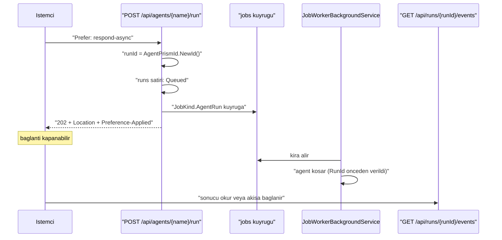
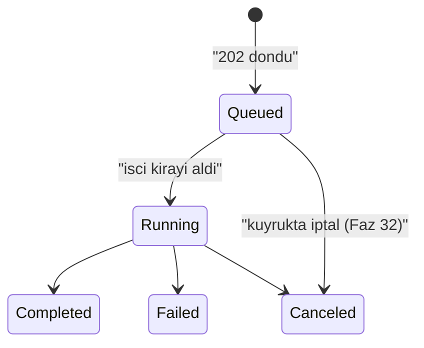

# Faz 46 — Dayanıklı Çalıştırma (`202 Accepted`)

> **Durum:** ✅ Tamamlandı (2026-08-07)
> **Kaynak:** [ADAYLAR.md](ADAYLAR.md) · **F-68** (F-39 bu kalemin içinde yaşar)
> **Önkoşul:** [Faz 43](43-IDEMPOTENCY-KEY.md) — yan etkili tool'un iki kez koşmasına karşı tek savunma. Faz 17'nin iş kuyruğu **hazır**
> **Paketler:** `AgentPrism.Abstractions`, `.Core`, `.AspNetCore`, `.UI`
> **Yeni paket:** Yok · **Migration:** **Yok** — yeni tablo yoktur, `JobKind` ve `RunStatus` yalnız **sona** değer ekler
> **Public API:** büyüyor — bir `JobKind` üyesi, bir `RunStatus` üyesi, bir ayar sınıfı, bir yanıt sözleşmesi. Faz 7'den önce ucuz

---

## Bu Faza Başlarken

> `faz-baslangic` skill'ini uygula. Aşağıdaki liste o skill'in 2. adımıdır —
> **tamamını değil, yalnız işaret edilen bölümleri oku.**

1. Bu doküman
2. Kararlar — dosyanın tamamını **okuma**, yalnız bu kalemleri grep'le:
   ```bash
   grep -n "K-014\|K-068\|K-138\|K-160\|K-162\|K-232" docs/KARARLAR.md
   ```
   **K-160** (iş kuyruğu geri adımlı beklemeyle genişletildi — bu fazın yeniden
   deneme davranışı oradan gelir), **K-162** (kota devam eden çalıştırmayı
   kesmez, yalnız yeni çalıştırma `429` alır — kuyruğa alma anı "yeni
   çalıştırma"dır), **K-138** (`jobs_schedule_scheduled_uq` çift tetiklemeyi
   kapatır), **K-014** (`run_events` append-only — yeniden koşan bir iş yeni
   olay yazar, eskisini silmez), **K-068** (`EnablePublicApiTracking` `false`),
   **K-232** (sunucu yanıtları çevrilmez).
3. [`43-IDEMPOTENCY-KEY.md`](43-IDEMPOTENCY-KEY.md) — yalnız devir notu ve
   [43.4](43-IDEMPOTENCY-KEY.md#434--akışlı-yanıt-bu-fazın-kapsamı-dışındadır):
   ```bash
   awk '/## Sonraki Faza Devir Notu/,0' docs/43-IDEMPOTENCY-KEY.md
   ```
   O faz akışlı idempotency'yi **bilerek bu faza bıraktı** ve devir notunda iki
   sınır yazdı. Bu fazın 46.5 bölümü o iki sınırı kapatır.
4. Alan hafızası (bu faz üç alana dokunuyor):
   [`hafiza/aspnetcore-di.md`](hafiza/aspnetcore-di.md) (**ana kaynak** —
   uç kaydı, `IEndpointFilter` sırası, `ProblemDetails`),
   [`hafiza/cekirdek-calistirma.md`](hafiza/cekirdek-calistirma.md)
   (🚨 `AsyncLocal` yazımı çağırana geri akmaz — bu faz arka plan görevinde
   çalıştırma açar, dört vakadan biri tam olarak budur),
   [`hafiza/frontend.md`](hafiza/frontend.md) (sözlük ve bundle bütçesi)
5. Gerektiğinde, tamamı değil ilgili bölümü:
   [`MIMARI.md`](MIMARI.md) — çalıştırma yolu ve HTTP yüzeyi bölümleri

---

## Amaç

Bugün bir çalıştırma HTTP isteğinin ömrüne bağlıdır. İstemci bağlantıyı
bırakırsa veya süreç yeniden başlarsa iş kaybolur. Saatler süren bir araştırma
agent'ı bu yüzden yazılamaz: tarayıcı sekmesi kapanınca çalıştırma da kapanır.

Bu faz, çalıştırmayı istekten **ayırır**. İstemci `Prefer: respond-async`
gönderir, `202 Accepted` ve bir `Location` başlığı alır, bağlantıyı bırakır.
Çalıştırma Faz 17'nin iş kuyruğunda koşar. İstemci sonucu `Location`'dan okur.

- **F-68** — kuyruğa alınan çalıştırma, `202 Accepted` + `Location` sözleşmesi,
  önceden ayrılmış çalıştırma kimliği, `Queued` durumu ve kuyruk yolunda
  akışa bağlanma.
- **F-39** — `202 Accepted` sözleşmesi. Ayrı bir kalem değildir; dayanıklı
  çalıştırmanın HTTP yüzüdür ve bu fazda birlikte gelir.

### Bugün ne çalışmıyor — doğrulanmış kanıt

| Kanıt | Gözlem |
|---|---|
| [`AgentEndpoints.cs:75`](../src/AgentPrism.AspNetCore/Endpoints/AgentEndpoints.cs) | `POST /api/agents/{name}/run` **tek moddur**: yanıt SSE ile akar ve çalıştırma isteğin içinde yaşar. Asenkron seçenek yok |
| [`RunRecordingAgent.cs:186`](../src/AgentPrism.Core/Recording/RunRecordingAgent.cs) | `OperationCanceledException` yakalandığında `run` `Canceled` olarak **kapatılır**. Devam ettirme yolu yoktur; aynı desen `:251`'de akışlı yol için tekrarlanır |
| [`JobKind.cs`](../src/AgentPrism.Abstractions/Scheduling/JobKind.cs) | Beş üye var (`AgentBatch`, `Workflow`, `Eval`, `WebhookDelivery`, `Retention`). **Tek bir agent çalıştırması için üye yok** — `AgentBatch` bir öge kümesi ister |
| [`RunStatus.cs`](../src/AgentPrism.Abstractions/Runs/RunStatus.cs) | Beş üye var; `Running = 0` ilk durumdur. **Kuyrukta bekleyen bir çalıştırmayı anlatan durum yok** |
| [`AgentPrismRunOptions.cs:63`](../src/AgentPrism.Abstractions/Runs/AgentPrismRunOptions.cs) | 🚨 **`RunId` alanı ZATEN VAR.** Çağıran kimliği önceden üretebiliyor. Gerekçe dosyada yazılı: "Akışlı bir uç kimliği ilk çerçeveden önce bilmek zorundadır" — `Location` başlığının ihtiyacı birebir aynıdır |
| [`jobs` tablosu](../src/AgentPrism.PostgreSql/Migrations/0008_scheduling.sql) | Kira (`lease_owner`, `lease_until`), deneme sayacı (`attempt`), iş başına `MaxAttempts` ve `scheduled_for` ile geri adımlı bekleme **hazır** (K-160) |
| [`AgentBatchJobHandler.cs`](../src/AgentPrism.Core/Scheduling/AgentBatchJobHandler.cs) | Kuyruktan agent çalıştırmanın deseni **hazır**: `IAgentCatalog.ResolveAsync` → çözülen agent zaten kayıt dekoratörüyle sarılı → normal `runs` satırı |

> Kanıtlar 2026-08-06 tarihinde doğrulandı.

**Aday listesinin "Okuma B'nin MAF kancası doğrulanmadı" notu ölçüldü ve
sonuç nettir:**

```bash
.claude/skills/maf-api-kesfi/scripts/dump-api.sh '*Checkpoint*'      # ciktı YOK
APIDUMP_PACKAGES="Microsoft.Agents.AI.Workflows@1.16.0" \
  .claude/skills/maf-api-kesfi/scripts/dump-api.sh '*Checkpoint*'    # 6 tip
```

🚨 **MAF'ta agent düzeyinde kontrol noktası kancası YOKTUR.** `CheckpointInfo`,
`CheckpointManager`, `ICheckpointStore<T>`, `CheckpointableRunBase` ve
`JsonCheckpointStore` tiplerinin **tamamı** `Microsoft.Agents.AI.Workflows`
derlemesindedir. `Microsoft.Agents.AI` ve `Microsoft.Agents.AI.Abstractions`
içinde tek bir kontrol noktası tipi bulunmuyor.

Bu ölçüm Okuma B'yi (tur bazlı kontrol noktası) bu fazın kapsamından çıkarır:
MAF vermediği için kanca **AgentPrism tarafından yazılacaktı** ve bu MAF'ın iç
turu taklit etmek demekti — K3'ü zorlayan bir tasarım. **Kullanıcı kararı:
Okuma A.** Gerekçe ve ertelenen okumalar [46.7](#467--seçilmeyen-okumalar) içinde.

---

## 46.1 — Sözleşme: `Prefer: respond-async`

Yeni bir uç eklenmez. Var olan uç bir **istek başlığı** tanır.



| Başlık | Yön | Ne yapar |
|---|---|---|
| `Prefer: respond-async` | istek | Çalıştırmayı kuyruğa alır; yanıt `202`'dir |
| `Preference-Applied: respond-async` | yanıt | 🚨 Tercih **uygulandığını** doğrular |
| `Location: {prefix}/api/runs/{runId}` | yanıt | Çalıştırma kaydının adresi |

🚨 **`Preference-Applied` atlanamaz.** RFC 7240 `Prefer` başlığını *tavsiye*
sayar: sunucu yok sayabilir. AgentPrism bu belirsizliği taşımaz — tercih
uygulandıysa yanıt `202` **ve** `Preference-Applied` taşır. Bu, Faz 43'ün
[43.4](43-IDEMPOTENCY-KEY.md#434--akışlı-yanıt-bu-fazın-kapsamı-dışındadır)
bölümünde ve K-034'te üç kez tekrarlanan kuralın aynısıdır: **sessizce yok
sayılan bir tercih, kullanıcının korunduğunu sanmasına yol açar.**

Başlık **gönderilmezse hiçbir şey değişmez** — bugünkü SSE davranışı aynen
sürer, ek bir sorgu bile atılmaz. K1 (sıfır sürpriz) bu yüzden ihlal edilmez;
ayar `Enabled = true` gelebilir ve gerekçesi Açık Soru 1'dedir.

## 46.2 — Çalıştırma kimliği önceden ayrılır

`Location` başlığı `202` ile birlikte gider. O anda henüz hiçbir agent
koşmamıştır. Kimliğin **istek anında** bilinmesi zorunludur.

Mekanizma zaten var: `AgentPrismRunOptions.RunId`. Alan Faz 15'te akışlı uç
için eklendi ve gerekçesi dosyada yazılıdır — akışlı bir uç kimliği ilk
çerçeveden önce bilmek zorundadır. `Location` başlığının ihtiyacı **birebir
aynıdır**.

```csharp
var runId = AgentPrismId.NewId();          // zaman sirali (v7), index'i parcalamaz
// ... is kuyruga yazilir, yuk runId tasir
// ... isci: agent.RunAsync(messages, session, new AgentPrismRunOptions { RunId = runId })
```

🚨 **`Guid.NewGuid()` kullanılmaz.** `AgentPrismRunOptions.RunId`'nin XML
dokümanı bunu açıkça yasaklıyor: rastgele kimlik depolama index'ini parçalar.
`AgentPrismId.NewId()` zaman sıralı üretir.

## 46.3 — `RunStatus.Queued` — 202 ile işçi arasındaki boşluk

`202` döndükten sonra istemci hemen `GET /api/runs/{runId}` çağırabilir. İşçi
işi henüz almadıysa `runs` satırı **yoktur** ve uç `404` döner. İstemci bunu
"yanlış kimlik" ile ayırt edemez.

Çözüm: `runs` satırı **kuyruğa alma anında** yazılır ve yeni bir durum taşır.

```csharp
public enum RunStatus
{
    Running = 0,
    Completed = 1,
    Failed = 2,
    Canceled = 3,
    AwaitingInput = 4,
    Queued = 5,          // YENI — SONA eklenir
}
```

🚨 **Değer sona eklenir.** Durumlar veritabanında `smallint` olarak saklanır;
mevcut değerlerin kayması eski satırları yanlış okur. `AwaitingInput = 4`
dosyada tam olarak bu gerekçeyle sona eklenmişti ve XML dokümanı kuralı
yazıyor — aynı kural uygulanır.

İki hesap kendiliğinden doğru kalır:

| Hesap | `Queued` satırın etkisi |
|---|---|
| `RunStatistics.ErrorRate` | Payda `Completed + Failed + Canceled`'dır. `Queued` **paydaya girmez** — `Running` gibi davranır ve oran yapay olarak düşmez |
| Gösterge paneli | Kuyrukta bekleyen çalıştırma **görünür**. Bugün görünmezdi |

Durum geçişi tek yönlüdür ve işçi ilk işi olarak yapar:



## 46.4 — `JobKind.AgentRun` ve işleyici

```csharp
public enum JobKind
{
    AgentBatch = 0,
    Workflow = 1,
    Eval = 2,
    WebhookDelivery = 3,
    Retention = 4,
    AgentRun = 5,        // YENI — SONA eklenir
}
```

`JobKind`'ın XML dokümanı değer sırasının **değiştirilemez** olduğunu ve yalnız
sona ekleme yapılabileceğini zaten yazıyor.

**`AgentBatch` neden yeniden kullanılmıyor?** İki gerekçe:

1. `AgentBatch` bir **öge kümesi** ister (`job_items`) ve ilerlemeyi
   `total_items`/`done_items` ile raporlar. Tek çalıştırmada bu yapı boş yere
   bir tablo satırı daha üretir.
2. `AgentBatch` çalıştırma kimliğini **kendisi ürettirir**. Bu fazın sözleşmesi
   kimliğin çağırandan gelmesini gerektirir. Aynı işleyiciye iki farklı kimlik
   sahipliği koymak, ikisini de kırılgan yapar.

`AgentRunJobHandler`, `AgentBatchJobHandler`'ın desenini birebir izler: agent
`IAgentCatalog.ResolveAsync` ile çözülür, çözülen agent **zaten** kayıt
dekoratörüyle sarılıdır, `runs` satırı kendiliğinden yazılır.

🚨 **İşleyici `AsyncLocal` tuzağının tam ortasındadır.** `MEMORY.md`'nin dört
vakalı dersi burada geçerlidir: `run scope` ve `span` **işleyicinin kendi
gövdesinde** açılmalıdır. `RunRecordingAgent` bunu zaten yapıyor; işleyici
kendi başına bir `scope` yazmaya kalkarsa yazım çağırana akmaz. Kural: işleyici
`scope` **yazmaz**, yalnız agent'ı çağırır.

### Süreç düşerse ne olur

| An | Davranış |
|---|---|
| İş kuyrukta, işçi almadı | Başka bir örnek alır. Hiçbir şey kaybolmaz |
| İşçi aldı, süreç düştü | Kira dolar, iş **baştan** koşar. `runs` satırı `Running` kalır ve **öksüz** olur |
| Yeniden koşma | Yeni bir `runs` satırı yazılır; `run_events` append-only olduğu için eski olaylar silinmez (K-014) |

🚨 **Öksüz `Running` satırı bu fazda kapatılmaz.** Bu, aday listesindeki
**F-36**'nın (öksüz çalıştırma uzlaştırması) işidir ve aday listesi sıralamayı
zaten yazıyor: F-36 bu fazdan **sonra** yapılmalıdır, yoksa iki kez yazılır.
Devir notu bunu taşır.

## 46.5 — Faz 43'ün iki devir sınırı

[Faz 43](43-IDEMPOTENCY-KEY.md) devir notunda iki sınır bıraktı. İkisi de burada kapanır.

### 1. Akışlı idempotency

Faz 43 kararı: akışlı bir istek `Idempotency-Key` taşırsa `400 Bad Request`.
Gerekçe: saklanmış bir SSE akışını yeniden oynatmak gövdeyi büyütür, zamanlama
bilgisini kaybeder ve maliyeti öngörülemez kılar.

`Prefer: respond-async` bu sorunu **ortadan kaldırır**, çözmez:

| İstek | Davranış |
|---|---|
| `Prefer: respond-async` + `Idempotency-Key` | ✅ Çalışır. Anahtar `202` yanıtını tekilleştirir — gövde küçüktür ve bir `Location` taşır |
| Akışlı (SSE) + `Idempotency-Key` | Faz 43'ün `400`'ü **korunur**. Yanıt mesajı artık bir **yol gösterir**: "`Prefer: respond-async` kullanın" |

🚨 **Tekilleştirilen şey akış değil, kuyruğa alma kararıdır.** Aynı anahtarla
gelen ikinci istek yeni bir iş **açmaz**; ilk `202`'nin `Location`'ını döndürür.
Böylece bir çalıştırma iki kez kuyruğa girmez.

### 2. Yeniden koşma yan etkili tool'u iki kez tetikler

Faz 43'ün devir notu bunu açıkça yazdı: `IIdempotencyStore` **HTTP
yüzeyindedir**, iş kuyruğunda değil. Kira dolup iş baştan koştuğunda o anahtar
devreye girmez.

Bu faz sınırı **kapatmaz, görünür kılar**:

| Önlem | Ne verir |
|---|---|
| `MaxAttempts` iş başına ayarlanır (K-160) | Varsayılan **1**: kuyruğa alınan çalıştırma öntanımlı olarak **yeniden denenmez**. Yan etki iki kez koşmaz |
| Ayar açıkça `AllowRetry` der | Tüketici yeniden denemeyi bilerek açar; belge tool'ların idempotent olması gerektiğini yazar |
| Denetim izi | Her yeniden deneme `jobs.attempt` üzerinde görünür |

🚨 **Varsayılan `MaxAttempts = 1` bilinçlidir ve K1'in doğrudan uygulamasıdır.**
"Dayanıklı" kelimesi "iş asla kaybolmaz" demez; "iş **sessizce** kaybolmaz"
demektir. Sessizce iki kez koşan bir ödeme tool'u, hiç koşmayandan kötüdür.

## 46.6 — İstemci sonucu nasıl okur

Üç yol vardır ve üçü de **bugün mevcut** uçlardır. Yeni bir okuma ucu yazılmaz.

| Yol | Uç | Ne zaman |
|---|---|---|
| Yoklama | `GET /api/runs/{runId}` | En basit. `status` alanı `Queued` → `Running` → sonuç |
| Akış | `GET /api/runs/{runId}/events` | Canlı izleme. Uç zaten var ([`RunEndpoints.cs:114`](../src/AgentPrism.AspNetCore/Endpoints/RunEndpoints.cs)) |
| Ağaç | `GET /api/runs/{runId}/tree` | Alt agent'lı çalıştırmada |

🚨 **`/events` ucu geçmişe dönük olayları da verir** çünkü `run_events`
append-only'dir (K-014) ve doküman "canlı akış ve geçmişe dönük replay aynı kod
yolundan geçer" diyor. İstemci `202`'den sonra **istediği anda** bağlanabilir;
başlangıç olaylarını kaçırmaz. Bu, sözleşmenin çalışmasının asıl sebebidir.

## 46.7 — Seçilmeyen okumalar

Karar defterine değil, bu belgeye yazılır — ikisi de gelecekte yeniden
değerlendirilebilir.

| Okuma | Neden bu fazda değil |
|---|---|
| **Okuma B** — tur bazlı kontrol noktası | MAF agent düzeyinde kanca **vermiyor** (46. bölüm başındaki ölçüm). Kancayı AgentPrism yazsaydı MAF'ın iç turunu taklit etmiş olurdu; K3'ü zorlar. Ayrıca yeni tablo + üç migration seti ister |
| **Okuma D** — dayanıklı run bir workflow'dur | Teknik olarak çekici: MAF'ın kontrol noktası **yalnız** workflow'da var ve AgentPrism onu zaten bağlamış (`IWorkflowCheckpointStore`, `workflow_checkpoints`, `parent_id`, Faz 15). Ama her dayanıklı çalıştırma bir workflow olurdu ve kayıt **ikileşirdi**: hem `runs` hem `workflows` satırı. `RunKind.Agent` ile `RunKind.Workflow` ayrımı bulanıklaşır |

🚨 **Okuma A, Okuma B'yi kırmaz.** `202 Accepted` + `Location` sözleşmesi kontrol
noktası eklendiğinde **aynen** kalır; değişen tek şey "süreç düşerse baştan
koşar" cümlesinin "kaldığı turdan devam eder" olmasıdır. Sözleşme bu yüzden
şimdi yazılabilir.

---

## Planlanan Public API

> Taslak imzalardır. Gerçekleşen imzalar kapanışta ayrı bir bölüme yazılır.

```csharp
// AgentPrism.Abstractions/Scheduling/JobKind.cs — mevcut enum'a SONA eklenir
public enum JobKind
{
    // ... mevcut uyeler degismez
    /// <summary>
    /// Tek bir agent calistirmasi (Faz 46). Yuk, onceden ayrilmis calistirma
    /// kimligini ve girdiyi tasir.
    /// </summary>
    AgentRun = 5,
}

// AgentPrism.Abstractions/Runs/RunStatus.cs — mevcut enum'a SONA eklenir
public enum RunStatus
{
    // ... mevcut uyeler degismez
    /// <summary>
    /// Calistirma kuyruga alindi ama henuz baslamadi. Yalnizca
    /// <c>Prefer: respond-async</c> ile baslatilan calistirmalarda gorulur.
    /// </summary>
    Queued = 5,
}
```

```csharp
// AgentPrism.Abstractions/Scheduling/AgentRunJobPayload.cs (YENI)

/// <summary>
/// <see cref="JobKind.AgentRun"/> isinin yuku.
/// </summary>
/// <remarks>
/// 🚨 <see cref="RunId"/> is kuyruga yazilmadan ONCE uretilir; yanitin
/// <c>Location</c> basligi bu degeri tasir.
/// </remarks>
public sealed record AgentRunJobPayload
{
    /// <summary>Onceden ayrilmis calistirma kimligi. Zaman sirali (v7).</summary>
    public required Guid RunId { get; init; }

    /// <summary>Kullanici mesaji.</summary>
    public string? Message { get; init; }

    /// <summary>Oturum kimligi. Verilmezse calistirma oturumsuzdur.</summary>
    public string? SessionId { get; init; }

    /// <summary>Onceden yuklenmis eklerin kimlikleri.</summary>
    public IReadOnlyList<Guid> AttachmentIds { get; init; } = [];
}
```

```csharp
// AgentPrism.AspNetCore/AgentPrismAsyncRunOptions.cs (YENI)

/// <summary>Kuyruga alinan calistirma ayarlari.</summary>
public sealed class AgentPrismAsyncRunOptions
{
    /// <summary>
    /// <c>Prefer: respond-async</c> tanınıyor mu. Kapaliysa basligi tasiyan
    /// istek <c>501</c> alir; sessizce yok sayilmaz.
    /// </summary>
    public bool Enabled { get; set; } = true;   // Acik Soru 1

    /// <summary>
    /// Kuyruga alinan calistirmanin en fazla deneme sayisi.
    /// </summary>
    /// <remarks>
    /// 🚨 Varsayilan <strong>1</strong>: yan etkili bir tool'un iki kez
    /// kosmasini engeller. Yukseltmek tool'larin idempotent olmasini gerektirir.
    /// </remarks>
    public int MaxAttempts { get; set; } = 1;
}
```

```csharp
// AgentPrism.AspNetCore/Contracts — YENI yanit sozlesmesi (F-39)

/// <summary>Kuyruga alinan bir calistirmanin 202 yaniti.</summary>
public sealed record AcceptedRunResponse
{
    /// <summary>Calistirma kimligi.</summary>
    public required Guid RunId { get; init; }

    /// <summary>Isi tasiyan kuyruk kaydinin kimligi.</summary>
    public required Guid JobId { get; init; }

    /// <summary>Calistirma kaydinin adresi. <c>Location</c> basligiyla aynidir.</summary>
    public required string Location { get; init; }

    /// <summary>Olay akisinin adresi.</summary>
    public required string EventsLocation { get; init; }
}
```

### HTTP `endpoint`'leri

Yeni uç **yok**. Var olan uçlar bir başlık tanır:

| Metot | Yol | Başlık | Davranış |
|---|---|---|---|
| `POST` | `/api/agents/{name}/run` | `Prefer: respond-async` | `202` + `Location` + `Preference-Applied` |
| `POST` | `/v1/responses` | `Prefer: respond-async` | Açık Soru 3 |
| `POST` | `/v1/chat/completions` | `Prefer: respond-async` | Açık Soru 3 |

Rol değişmez: uç bugün `Operator` ister
([`AgentEndpoints.cs:110`](../src/AgentPrism.AspNetCore/Endpoints/AgentEndpoints.cs)).
Kuyruğa almak da bir çalıştırma başlatmadır.

Kota denetimi **kuyruğa alma anında** yapılır. K-162 "devam eden çalıştırma
kesilmez, yalnız yeni çalıştırma `429` alır" diyor; kuyruğa almak yeni bir
çalıştırmadır ve `QuotaGate` bugünkü yerinde kalır.

### Arayüz payı

Çalıştırma listesi ve ayrıntı ekranı `Queued` durumunu göstermelidir; bugün
bilinmeyen bir durum kodu gelirse ekran onu ham gösterir.

| İş | Tahmin |
|---|---|
| `Queued` durum etiketi ve rengi | 🚨 **tahmin** — 0,5 KB gzip altı |
| Playground'da "arka planda çalıştır" seçeneği | Açık Soru 4'e bağlı |

Bugünkü kullanım (2026-08-06 ölçümü, [yol haritası](arsiv/UCUNCU-FAZ-YOL-HARITASI.md)):
**151,3 KB gzip / 250 KB**, kalan pay **98,7 KB**. Gerçek pay uygulama anında
`postbuild.mjs` çıktısından okunur ve buraya yazılır.

Sözlük anahtarları `locales/en.ts` **ve** `locales/tr.ts` (K-228). Sunucunun
`202`/`501` mesajı çevrilmez (K-232).

---

## Planlanan Dosya Listesi

```
src/AgentPrism.Abstractions/Scheduling/
├── JobKind.cs                          (SONA bir uye)
└── AgentRunJobPayload.cs               (YENI)

src/AgentPrism.Abstractions/Runs/
└── RunStatus.cs                        (SONA bir uye)

src/AgentPrism.Core/Scheduling/
├── AgentRunJobHandler.cs               (YENI — AgentBatchJobHandler deseni)
└── AgentPrismSchedulingRegistration.cs (isleyici kaydi)

src/AgentPrism.AspNetCore/
├── AgentPrismAsyncRunOptions.cs        (YENI)
├── Contracts/AgentContracts.cs         (AcceptedRunResponse)
└── Endpoints/AgentEndpoints.cs         (Prefer basligi dallanmasi)

src/AgentPrism.UI/frontend/src/
├── screens/runs.tsx                    (Queued durumu)
├── screens/run-detail.tsx              (Queued durumu)
└── locales/{en,tr}.ts                  (yeni anahtarlar)
```

**Migration yok.** Yeni tablo yoktur; iki enum yalnız sona değer ekler ve ikisi
de veritabanında `smallint` olarak saklanır — mevcut satırlar etkilenmez.

---

## Testler

| Test sınıfı | Neyi doğrular |
|---|---|
| `AsyncRunAcceptedTests` | `Prefer: respond-async` → `202`, `Location`, `Preference-Applied`; gövde `AcceptedRunResponse` |
| `AsyncRunQueuedStatusTests` | 🚨 `202` döndükten **hemen sonra** `GET /api/runs/{runId}` `404` **değil**, `Queued` döner |
| `AsyncRunCompletionTests` | İşçi işi alır, `Queued` → `Running` → `Completed`; `runs.id` `Location`'daki kimliğe **eşittir** |
| `AsyncRunEventStreamTests` | İstemci `202`'den sonra `/events`'e bağlanır ve **başlangıç olaylarını kaçırmaz** (K-014) |
| `AsyncRunDisabledTests` | `Enabled = false` iken başlık taşıyan istek `501` alır; sessizce akışa düşmez |
| `AsyncRunNoHeaderTests` | Başlık **yokken** bugünkü SSE davranışı bit bit aynı |
| `AsyncRunIdempotencyTests` | 🚨 `Prefer: respond-async` + aynı `Idempotency-Key` → **tek iş**, aynı `Location`. İkinci istek yeni iş açmaz |
| `AsyncRunStreamingIdempotencyTests` | Akışlı + anahtar → Faz 43'ün `400`'ü korunur; mesaj `Prefer: respond-async` önerir |
| `AsyncRunQuotaTests` | Kota dolu iken kuyruğa alma `429` alır; iş **açılmaz** (K-162) |
| `AsyncRunRetryTests` | 🚨 `MaxAttempts = 1` iken kira dolan iş **yeniden denenmez**; `jobs.status` `Failed` |
| `AsyncRunRetryEnabledTests` | `MaxAttempts = 3` iken geri adımlı bekleme çalışır (K-160) |
| `AsyncRunTenantTests` | Kuyruğa alınan iş kiracı bağını korur; başka kiracı `Location`'ı okuyamaz |
| `AsyncRunCancelTests` | `Queued` durumdaki çalıştırma iptal edilebilir (Faz 32'nin ucu) |
| `RunStatusEnumTests` | `Queued = 5`; mevcut değerler **kaymadı** |

Sözleşme testi gerekmez — yeni bir depo arayüzü yoktur.

---

## Açık Sorular

> Planı bloklamayan, faz uygulanırken karara bağlanacak sorular. Bloklayan
> sorular plan yazılmadan **önce** soruldu ve
> [46.7](#467--seçilmeyen-okumalar)'de yazıldı.

| # | Soru | Seçenekler | Öneri |
|---|---|---|---|
| 1 | K1 "varsayılan kapalı" der. `Enabled = true` mı gelsin? | A: **açık** · B: kapalı | **A, ve bu Faz 43'ün emsalidir.** Başlık göndermeyen istemci için hiçbir şey değişmez — sorgu bile atılmaz. Kapalı gelirse başlık gönderen istemci `501` alır ve özellik var olduğunu bilmeden kalır. Faz 43 aynı yorumu yaptı; iki fazın **aynı** gerekçeyle aynı yönde karar vermesi kaydedilmelidir |
| 2 | `Prefer: respond-async` mi, `?async=true` mi? | A: **başlık** (RFC 7240) · B: sorgu parametresi | **A.** RFC 7240'ın tam olarak bu iş için tanımladığı başlıktır ve Faz 43 de bir başlık seçti. Sorgu parametresi önbellek anahtarına ve OpenAPI şemasına sızar; başlık sözleşmeyi katkısal tutar |
| 3 | OpenAI uyumlu uçlar (`/v1/responses`, `/v1/chat/completions`) da tanısın mı? | A: **tanımasın** · B: tanısın | **A.** O uçlar OpenAI sözleşmesini taklit eder ve OpenAI'ın kendi asenkron modeli **farklıdır** (`background: true` + `response.id`). AgentPrism'in başlığını oraya koymak iki sözleşmeyi karıştırır. Sınır belgeye yazılır ve yeni bir aday kalemi olur |
| 4 | Playground arka planda çalıştırma seçeneği sunsun mu? | A: sunmasın, yalnız `Queued` göstersin · B: sunsun | **A.** Playground bir **deneme** yüzeyidir; akışlı yanıt onun asıl değeridir. Arka plan çalıştırması bir API yeteneğidir. Bundle payı da böylece 0,5 KB altında kalır |
| 5 | `Location` `runs`'ı mı `jobs`'ı mı göstersin? | A: **`runs`** · B: `jobs` | **A.** İstemcinin istediği çalıştırmadır, kuyruk kaydı değildir. `JobId` yanıt gövdesinde yine verilir; teşhis için gerekir |
| 6 | Kuyrukta bekleyen çalıştırmanın süre sonu olmalı mı? | A: `jobs.scheduled_for` yeter · B: ayrı süre sonu | **A** bir taslaktır. Kuyruk zaten kira ve deneme sayacı taşıyor. Ama **çok uzun kuyrukta** bekleyen bir çalıştırmanın hâlâ anlamlı olup olmadığı ölçülmemiştir; ölçüm yapılmadan üretim önerisi yazılmaz |

---

## Bitiş Ölçütleri (DoD)

- [x] 🚨 `Prefer: respond-async` ile gönderilen istek `202`, `Location` ve
      `Preference-Applied: respond-async` döner
- [x] 🚨 `202`'den **hemen sonra** `GET /api/runs/{runId}` `Queued` döner — `404` **değil**
- [x] İstemci bağlantıyı kapatsa bile çalıştırma **tamamlanır**; `runs` satırı
      `Completed` olur
- [x] `runs.id`, `Location` başlığındaki kimliğe **eşittir**
- [x] `202`'den sonra `/events`'e bağlanan istemci **başlangıç olaylarını görür**
- [x] Başlık **gönderilmeyen** istekte bugünkü SSE davranışı değişmemiştir
- [x] `Prefer: respond-async` + `Idempotency-Key` → **tek** iş, tek `runs` satırı
      (`IdempotencyFilter` gövdedeki `stream` alanına bakar; `/run`'ın gövdesi
      hiç taşımaz, bu yüzden bu uçta akışlı dal zaten hiç tetiklenmez)
- [x] Akışlı istek + `Idempotency-Key` → Faz 43'ün `400`'ü OpenAI uyumlu
      uçlarda (`/v1/responses`, `/v1/chat/completions`) korunur — bu uçlar
      `Prefer: respond-async`'i **tanımaz** (Açık Soru 3 = A), bu yüzden mesaj
      kasıtlı olarak değiştirilmedi (bkz. Plandan Sapmalar madde 8)
- [x] `Enabled = false` iken başlık taşıyan istek `501` alır
- [x] `MaxAttempts = 1` iken kira dolan iş **yeniden denenmez**
- [x] Kota dolu iken kuyruğa alma `429` alır ve iş açılmaz
- [x] `Queued` durumdaki çalıştırma iptal edilebilir
- [x] Dört doğrulama kapısı sıfır uyarı verir
- [x] `samples/AgentPrism.Api` ile gerçek `run` yapıldı (gerçek OpenAI çağrısı,
      `support` agent'ı — örnek uygulamada `asistan` adında bir agent yok),
      çıktı bu belgeye yazıldı
- [x] `secret` taraması boş döndü
- [x] `en.ts` ve `tr.ts` eksiksiz; bundle payı ölçüldü ve buraya yazıldı
      (**157,1 KB gzip / 250 KB**, Faz 46 katkısı yalnızca bir `Badge` durumu
      ve iki filtre seçeneği — ayrı ölçülemeyecek kadar küçük)

### Doğrulama komutları (gerçek çalıştırma, 2026-08-07)

`samples/AgentPrism.Api` gerçek bir OpenAI anahtarıyla (`user-secrets`) çalıştırıldı.
Örnekte `asistan` adında bir agent yok; `support` kullanıldı.

```bash
# 1) Kuyruga al
RESP=$(curl -s -D - -o /tmp/accepted-body.json -X POST \
  http://localhost:5081/agentprism/api/agents/support/run \
  -H "content-type: application/json" \
  -H "Prefer: respond-async" \
  -d '{"message":"ORD-2 siparişim nerede?"}')
echo "$RESP" | grep -i "^HTTP/\|^location:\|^preference-applied:"
```
```
HTTP/1.1 202 Accepted
Location: /agentprism/api/runs/019fdbc2-cad4-78cf-8292-f5b2a09c36d0
Preference-Applied: respond-async
```
Gövde: `{"runId":"019fdbc2-cad4-78cf-8292-f5b2a09c36d0","jobId":"019fdbc2-cad4-78cf-8292-f5b2a09c36d0", ...}`
— **`jobId` == `runId`**, bilinçli bir tasarım kararı (bkz. Plandan Sapmalar madde 4).

```bash
# 2) HEMEN sorgula — Queued gelmeli, 404 GELMEMELI
curl -s "http://localhost:5081/agentprism/api/runs/$RUN_ID" | python3 -c "import json,sys;print(json.load(sys.stdin)['status'])"
```
```
Queued
```
1 saniye sonra (gerçek OpenAI çağrısı + `get_order_status` tool'u dahil):
```
Completed
```

```bash
# 3) Olay akisina bagla — baslangic olaylari da gelmeli (K-014 replay)
curl -sN "http://localhost:5081/agentprism/api/runs/$RUN_ID/events"
```
```
id: 0
event: run.started
data: {...,"text":"ORD-2 siparişim nerede?",...}
id: 1
event: tool.invoking
data: {...,"toolName":"get_order_status","payload":"orderId=ORD-2",...}
id: 2
event: tool.invoked
data: {...,"payload":"ORD-2 numarali siparis kargoya verildi. Tahmini teslim: 2 gun.",...}
id: 3 / 4
event: message.delta / message.completed
data: {...,"text":"ORD-2 siparişiniz kargoya verilmiş. Tahmini teslimat: 2 gün.",...}
id: 5
event: run.completed
```

```bash
# 4) Kuyruktaki calistirma iptal edilir mi
RESP=$(curl -s -D - -o /tmp/accepted3.json -X POST .../agents/support/run \
  -H "Prefer: respond-async" -d '{"message":"ORD-3 siparişim nerede?"}')
RUN_ID=$(python3 -c "import json;print(json.load(open('/tmp/accepted3.json'))['runId'])")
curl -s -D - -X POST "http://localhost:5081/agentprism/api/runs/$RUN_ID/cancel"
```
```
HTTP/1.1 202 Accepted
{"id":"...","status":"Canceled","completedAt":"2026-08-07T10:27:26.909458+00:00", ...}
```
İşçi bu işi hiç almadı (`Pending` iken iptal edildi); `runs` satırı doğrudan
`Canceled`'e kapatıldı, orphan **oluşmadı**.

```bash
# 5) Baslik yokken davranis degismedi mi
curl -s -D - -X POST .../agents/support/run -d '{"message":"ORD-1 siparişim nerede?"}'
```
```
HTTP/1.1 200 OK
Content-Type: text/event-stream
```

Sunucu günlüğünde (`Trace` seviyesi) hiçbir uyarı/hata satırı yok.

---

## Riskler

| Risk | Önlem |
|------|-------|
| 🚨 Yeniden koşan iş yan etkili tool'u ikinci kez tetikler | Varsayılan `MaxAttempts = 1`; yeniden deneme tüketicinin bilinçli tercihidir. Faz 43'ün anahtarı **iş kuyruğunu kapsamaz** ve bu sınır belgeye yazılır |
| `202`'den sonra `404` gelirse istemci kimliği yanlış sanar | `runs` satırı kuyruğa alma anında `Queued` olarak yazılır; ayrı bir test bunu doğrular |
| 🚨 `RunStatus`/`JobKind` değeri ortaya eklenirse eski satırlar yanlış okunur | İkisi de **sona** eklenir; `JobKindAndRunStatusEnumTests` mevcut değerlerin kaymadığını doğrular |
| Öksüz `Running` satırları birikir | 🚨 **Kısmen kendiliğinden düzelir** (plandan sapma, bkz. madde 1): `StartRunAsync` bir UPSERT olduğu için `MaxAttempts > 1` yapılandırılmışsa bir yeniden deneme AYNI satırı `Running`'e geri getirir. Yalnız **varsayılan** (`MaxAttempts = 1`, yeniden deneme yok) yolda gerçek bir orphan kalır — F-36'nın kapsamı bu kadar daralır ama sıfırlanmaz |
| 🚨 İşleyici kendi `AsyncLocal` kapsamını açarsa yazım agent'a akmaz | İşleyici `scope` **yazmaz**; `RunRecordingAgent` zaten yazıyor. `hafiza/cekirdek-calistirma.md` dört vakayı listeliyor |
| `Prefer` sessizce yok sayılırsa istemci akış bekler, `202` alır | `Preference-Applied` zorunludur; `Enabled = false` iken `501` döner |
| Kuyruk dolar ve gecikme öngörülemez olur | `MaxConcurrentJobs` bugünkü ayardır; gecikme **ölçülmeli** (Açık Soru 6, hâlâ açık) |
| OpenAI uyumlu uçlarda iki asenkron sözleşme karışır | Bu uçlar başlığı **tanımaz** (Açık Soru 3); sınır belgeye yazılır |
| 🚨 Kuyruktaki (Queued) bir çalıştırmaya bağlı SSE akışı işçi hiç başlamadan kapanır | Ölçüldü ve düzeltildi (plandan sapma, madde 6): `RunEventStream`'in orijinal döngüsü yalnız `Running` iken beklerdi; `Queued` da eklendi |
| 🚨 Kuyruktaki bir çalıştırma iptal edilemez görünür | Ölçüldü ve düzeltildi (plandan sapma, madde 7): `IRunCancellationRegistry` yalnız CANLI yürütmeyi bilir; `Queued` için `IJobStore.CancelAsync` + doğrudan `CompleteRunAsync(Canceled)` eklendi |

---

<!-- ============================================================
     AŞAĞISI KAPANIŞTA DOLDURULUR — `faz-tamamlama` skill'i.
     Plan anında boş kalır. Başlıkları SİLME.
     ============================================================ -->

## Plandan Sapmalar

Plan, "runs satırı kuyruğa alma anında yazılır" (46.3) derken bunun somut nasıl
yapılacağını (hangi API, hangi çakışma davranışı) açık bırakmıştı. Uygulama
sırasında bu boşluk gerçek bir tasarım kararı gerektirdi ve sekiz noktada
plandan sapıldı:

1. 🚨 **`RunStartInfo` yeni bir `Status` alanı kazandı (varsayılan `Running`)
   ve üç SQL sağlayıcısının `InsertRun` deyimi UPSERT'e çevrildi** —
   plan bunu öngörmemişti (dosya listesi `IRunStore`/SQL katmanına hiç
   değinmiyordu). Gerekçe: kuyruğa alma anında yazılan `Queued` satırı ile
   işçinin gerçek çalıştırma başlarken yazdığı satır **aynı `RunId`'yi**
   taşır. Düz bir `INSERT` ikinci çağrıda birincil anahtar çakışması
   üretirdi (`MaxAttempts > 1` yapılandırıldığında bu senaryo gerçekten
   oluşur). `ON CONFLICT (id) DO UPDATE` (Postgres/SQLite) ve
   `UPDATE ... WITH (UPDLOCK, SERIALIZABLE)` + `IF @@ROWCOUNT = 0 INSERT`
   (SqlServer, `UpsertConversation` ile aynı desen) seçildi. `InMemoryRunStore`
   zaten bir sözlük ataması olduğu için doğal olarak upsert davranışı
   gösteriyordu; yalnız olay/araç-çağrısı günlüklerinin ikinci çağrıda
   sıfırlanmaması için küçük bir `isNew` denetimi eklendi.
2. **`AgentPrismAsyncRunOptions` plandaki `AgentPrism.AspNetCore/` yerine
   `AgentPrism.Core/Scheduling/`de yaşıyor.** Ölçüldü: `AgentPrismIdempotencyOptions`,
   `AgentPrismRateLimitOptions`, `AgentPrismQuotaOptions` gibi tüm benzer
   ayar sınıfları Core'da yaşar ve `AgentPrismServiceCollectionExtensions.AddAgentPrism`
   içinde merkezi olarak bağlanır (`BindAsyncRun`, aynı `BindIdempotency`
   deseni). Plan bu yerleşik kuralı bilmiyordu.
3. **`AgentRunJobPayload` public record'u yazılmadı; yük ham `JsonElement`
   olarak (`{ runId, message, sessionId }`) kurulur ve elle ayrıştırılır.**
   Ölçüldü: `EvalEndpoints.BuildRunPayload`/`EvalJobHandler.ParsePayload` ve
   `WebhookDeliveryJobHandler` aynı deseni zaten kullanıyor — hiçbiri
   Abstractions'ta bir payload tipi veya `JsonSerializerContext` girdisi
   açmıyor. Yeni bir public tip + kaynak üreteci kaydı eklemek bu yerleşik
   deseni gereksiz yere kırardı.
4. 🚨 **`JobRecord.Id` == `RunRecord.Id`.** Plan ikisini ayrı kimlik olarak
   tasarlamıştı (`AcceptedRunResponse.JobId` "teşhis için" ayrı bir alan).
   Birleştirme bilinçli bir karardır: `GET /api/runs/{runId}` bu sayede
   **hiçbir** iş kuyruğu farkındalığı olmadan çalışır — gerçek `runs` satırı
   `Queued` olarak zaten mevcuttur. `JobId` alanı yine de yanıtta durur
   (teşhis) ama değeri `RunId` ile aynıdır.
5. **Ekler (`AttachmentIds`) ve onay kararları (`Approvals`) kuyruğa alınan
   çalıştırmalarda desteklenmiyor; istek `400` alır.** Gerekçe: ek referansı
   `UriContent` için bir HTTP yol öneki (`prefix`) gerektirir ve bu değer
   yalnızca `MapAgentPrism(prefix, ...)` çağrısı anında bilinir — DI kayıt
   anında (`AddAgentPrism()`) değil. `AgentRunJobHandler` bir singleton
   `IJobHandler`dır ve kayıt anında `prefix`'i alamaz. Onay kararları da
   canlı bir istemci bağlantısı varsayar. İkisi de gelecekte ayrı bir aday
   kalemi olabilir; bu fazda kapsam dışı bırakıldı.
6. 🚨 **`RunEventStream` (`RunEndpoints.cs`) `Queued` durumunu da bekleyecek
   şekilde değiştirildi.** Ölçüldü: orijinal döngü `snapshot.Status != Running`
   olunca akışı kapatıyordu — kuyruktaki bir çalıştırmaya `202`'den hemen
   sonra bağlanan bir istemci, işçi hiç başlamadan akışın kapandığını
   görürdü. DoD'nin "başlangıç olaylarını görür" maddesi bu düzeltme
   olmadan sağlanamazdı. Plan bu dosyayı hiç listelemiyordu.
7. 🚨 **`RunEndpoints.CancelRunAsync`, `RunStatus.Queued` için ayrı bir dal
   kazandı.** Ölçüldü: `IRunCancellationRegistry` yalnız CANLI (işçi
   tarafından gerçekten çalıştırılan) bir yürütmeyi bilir; kuyruktaki bir
   iş için kayıt yoktur. Yeni dal `IJobStore.CancelAsync` ile işi
   kuyruktan iptal eder ve `IRunStore.CompleteRunAsync` ile `runs` satırını
   doğrudan `Canceled`'e kapatır (işçi bu satırı asla kapatmayacağı için).
   DoD'nin "Queued durumdaki çalıştırma iptal edilebilir" maddesi bu
   olmadan karşılanamazdı.
8. **OpenAI uyumlu uçların (`/v1/responses`, `/v1/chat/completions`) paylaştığı
   `IdempotencyFilter`'ın "akışlı istekte 400" mesajı `Prefer: respond-async`
   önermeyecek şekilde DEĞİŞTİRİLMEDİ** — plan bunu önermişti (46.5.1: "mesaj
   artık bir yol gösterir"). Gerekçe: bu öneri yalnız `/api/agents/{name}/run`
   için doğrudur; OpenAI uyumlu uçlar `Prefer` başlığını hiç tanımıyor (Açık
   Soru 3 = A). Aynı mesajı üç ucun paylaştığı tek bir filtrede değiştirmek,
   desteklemediği bir özelliği önerecek şekilde yanıltıcı olurdu.

## Bu Fazda Verilen Kararlar

- **K-304 — Kuyruğa alınan bir çalıştırmanın `runs` satırı, işçinin gerçek
  yürütme satırıyla AYNI birincil anahtarı paylaşır; `IRunStore.StartRunAsync`
  bu yüzden bir UPSERT'tir** *(kullanıcı kararı yok, ölçülmüş teknik zorunluluk)*.
  `RunStartInfo.Status` alanı (varsayılan `Running`) eklendi; üç SQL
  sağlayıcısının `InsertRun` deyimi `ON CONFLICT`/`UPDLOCK` ile upsert'e
  çevrildi. Gerekçe: Faz 46'nın 46.3 bölümü yer tutucu bir `Queued` satırı
  istiyordu ama `StartRunAsync`'in var olan sözleşmesi (düz `INSERT`,
  `Status` her zaman `Running`) aynı kimlikle ikinci çağrıda birincil anahtar
  çakışması üretirdi. Alternatif (job deposunu okuyarak sentetik bir `Queued`
  yanıtı üretmek) hem `GET /api/runs/{id}` hem `/events` uçlarını iş
  kuyruğuna bağımlı kılardı ve kira dolup iş yeniden başladığında istemcinin
  `Location`'ının kalıcı olarak anlamsızlaşmasına yol açardı — ölçülen risk
  daha büyüktü.
- **K-305 — Kuyruğa alınan bir çalıştırmada `Job.Id` ile `Run.Id` bilinçli
  olarak AYNI değeri taşır** *(kullanıcı kararı yok)*. Gerekçe: `GET
  /api/runs/{runId}` ucunun iş kuyruğu farkındalığı olmadan (yalnız `IRunStore`
  okuyarak) doğru cevap verebilmesi için tek yol budur.
- **K-306 — `MaxAttempts = 1` varsayılanı korunur** *(kullanıcı kararı,
  Açık Soru önerisi kabul edildi)*. Gerekçe: "dayanıklı" kelimesi "iş asla
  kaybolmaz" değil "iş sessizce kaybolmaz" demektir; sessizce iki kez koşan
  bir tool hiç koşmayandan kötüdür. Yükseltmek tüketicinin bilinçli tercihidir.
- **K-307 — `AgentPrismAsyncRunOptions.Enabled` varsayılanı `true`'dur**
  *(kullanıcı kararı, Açık Soru 1 önerisi kabul edildi)*. Faz 43'ün
  `AgentPrismIdempotencyOptions.Enabled` kararıyla aynı K1 okuması: başlık
  taşımayan bir istek için hiçbir şey değişmez, kapalı gelseydi başlığı
  gönderen bir istemci korunduğunu sanıp korunmazdı.

## Gerçekleşen Public API

```csharp
// AgentPrism.Abstractions/Runs/RunStatus.cs — SONA eklendi
public enum RunStatus
{
    // ... mevcut uyeler AYNEN korundu (Running=0 .. AwaitingInput=4)
    Queued = 5,
}

// AgentPrism.Abstractions/Scheduling/JobKind.cs — SONA eklendi
public enum JobKind
{
    // ... mevcut uyeler AYNEN korundu (AgentBatch=0 .. Retention=4)
    AgentRun = 5,
}

// AgentPrism.Abstractions/Runs/RunSupportTypes.cs — RunStartInfo'ya YENI alan
public sealed record RunStartInfo
{
    // ... mevcut alanlar degismedi
    public RunStatus Status { get; init; } = RunStatus.Running; // YENI
}
```

```csharp
// AgentPrism.Core/Scheduling/AgentPrismAsyncRunOptions.cs (YENI)
// Plandaki AgentPrism.AspNetCore yerine Core'da — bkz. Plandan Sapmalar madde 2.
public sealed class AgentPrismAsyncRunOptions
{
    public const string SectionName = "AgentPrism:AsyncRun";
    public bool Enabled { get; set; } = true;
    public int MaxAttempts { get; set; } = 1;
}
```

```csharp
// AgentPrism.AspNetCore/Contracts/AgentContracts.cs (YENI)
public sealed record AcceptedRunResponse
{
    public required Guid RunId { get; init; }
    public required Guid JobId { get; init; }   // == RunId, bkz. K-305
    public required string Location { get; init; }
    public required string EventsLocation { get; init; }
}
```

`AgentRunJobHandler` (Core/Scheduling) ve `AgentEndpoints.RunQueuedAsync`
(AspNetCore) `internal`/`private static`'tir; public API yüzeyine girmezler.
`AgentRunJobPayload` planı yazılmadı (bkz. Plandan Sapmalar madde 3).

### HTTP sözleşmesi (gerçekleşen)

Plandaki tabloyla birebir aynı: yalnız `POST /api/agents/{name}/run`
`Prefer: respond-async` başlığını tanır (`/v1/responses`,
`/v1/chat/completions` desteklemez — Açık Soru 3 = A). Yanıt `202` +
`Location` + `Preference-Applied: respond-async` + `AcceptedRunResponse`
gövdesidir. `Enabled = false` iken `501`.

## Dosya Listesi (gerçekleşen)

```
src/AgentPrism.Abstractions/Runs/RunStatus.cs               (SONA bir uye: Queued)
src/AgentPrism.Abstractions/Runs/RunSupportTypes.cs          (RunStartInfo.Status — PLANDA YOKTU)
src/AgentPrism.Abstractions/Scheduling/JobKind.cs             (SONA bir uye: AgentRun)

src/AgentPrism.Core/Storage/InMemoryRunStore.cs               (StartRunAsync upsert-safe — PLANDA YOKTU)
src/AgentPrism.Core/Scheduling/AgentPrismAsyncRunOptions.cs    (YENI, Core'da — plan AspNetCore diyordu)
src/AgentPrism.Core/Scheduling/AgentRunJobHandler.cs           (YENI)
src/AgentPrism.Core/AgentPrismServiceCollectionExtensions.cs   (kayit + BindAsyncRun — PLANDA YOKTU)

src/AgentPrism.Sql.Shared/Stores/SqlRunStore.cs                (info.Status + upsert notu — PLANDA YOKTU)
src/AgentPrism.PostgreSql/Internal/PostgresQueries.cs          (InsertRun -> UPSERT — PLANDA YOKTU)
src/AgentPrism.Sqlite/Internal/SqliteQueries.cs                (InsertRun -> UPSERT — PLANDA YOKTU)
src/AgentPrism.SqlServer/Internal/SqlServerQueries.cs          (InsertRun -> UPSERT — PLANDA YOKTU)

src/AgentPrism.AspNetCore/Contracts/AgentContracts.cs          (AcceptedRunResponse)
src/AgentPrism.AspNetCore/Endpoints/AgentEndpoints.cs          (Prefer basligi dallanmasi, RunQueuedAsync)
src/AgentPrism.AspNetCore/Endpoints/RunEndpoints.cs            (Queued-aware SSE + iptal — PLANDA YOKTU)

src/AgentPrism.UI/frontend/src/lib/types.ts                   (RunStatus 'Queued')
src/AgentPrism.UI/frontend/src/screens/runs.tsx                (Queued badge + filtre)
src/AgentPrism.UI/frontend/src/screens/run-detail.tsx          (Queued polling/cancel/finished — PLANDA YOKTU)
src/AgentPrism.UI/frontend/src/locales/{en,tr}.ts               (yeni anahtarlar)

tests/AgentPrism.Core.UnitTests/Scheduling/AgentRunJobHandlerTests.cs        (YENI)
tests/AgentPrism.Core.UnitTests/Scheduling/JobKindAndRunStatusEnumTests.cs   (YENI)
tests/AgentPrism.AspNetCore.FunctionalTests/AsyncRunTests.cs                 (YENI)
tests/Shared/Contracts/RunStoreContract.cs                     (StartRunAsync upsert testi)
```

**Migration yok** — plan doğruydu; `Queued`/`AgentRun` yalnız sona eklenen
enum değerleridir, hiçbir tablo şeması değişmedi.

### Testler

| Test sınıfı | Neyi doğrular |
|---|---|
| `AgentRunJobHandlerTests` (Core.UnitTests, 4 test) | `Kind == AgentRun`; başarılı çalıştırma önceden ayrılmış `RunId` ile koşar; agent bulunamazsa Queued satırı Failed'e kapanır; geçersiz yük istisna fırlatır |
| `JobKindAndRunStatusEnumTests` (Core.UnitTests, 2 test) | `RunStatus`/`JobKind` sayısal değerleri **kaymadı** (Queued=5, AgentRun=5) |
| `RunStoreContract.StartRunAsync_ayni_kimlikle_ikinci_kez_cagrilinca_UPSERT_yapar` (Shared, 1 test × InMemory + Postgres + SQLite + SqlServer) | Aynı `RunId` ile ikinci `StartRunAsync` çağrısı **yeni satır açmaz**, mevcut satırı günceller |
| `AsyncRunTests` (AspNetCore.FunctionalTests, 9 test) | 202+Location+Preference-Applied; hemen sonra Queued (404 değil); işçi alınca Completed; başlık yokken SSE değişmez; `Enabled=false`→501; kota dolu→429; boş mesaj→400; onay kararı→400; Queued iptal edilebilir + ikinci iptal 409 |

Toplam **16 yeni test**. Tüm doğrulama kapıları ve `samples/AgentPrism.Api`
üzerinden gerçek bir OpenAI çağrısıyla uçtan uca doğrulandı (bkz. yukarı,
Doğrulama komutları).

🚨 **SQL Server gerçek doğrulama beklemeye devam ediyor** — `mssql/server`
konteyneri bu makinede (arm64 Mac) yine çalışmadı (`Testcontainers`
`TimeoutException`, aynı Faz 43'ün devir notundaki gözlem). Upsert SQL
metni SQLite ve PostgreSQL'de **gerçekten** doğrulandı (contract testleri
geçti); SqlServer metni yalnız gözle incelendi (`UpsertConversation` ile
birebir aynı desen).

### `dotnet test AgentPrism.slnx` — tüm çözüm (2026-08-07)

| Proje | Sonuç |
|---|---|
| Core.UnitTests | ✅ 622/622 |
| AspNetCore.FunctionalTests | ✅ 367/367 (`AsyncRunTests` dahil) |
| Sqlite.IntegrationTests | ✅ 430/430 |
| PostgreSql.IntegrationTests | ⚠️ 832/833 — **tek** başarısızlık `PostgresEvalStoreContractTests.AddCaseAsync_es_zamanli_terfiler_farkli_seq_uretir` (Faz 45'in eş zamanlılık testi, bu fazla **ilgisiz**, dokunulmadı) |
| SqlServer.IntegrationTests | 🚨 0/425 — konteyner bu makinede hiç başlamadı (yukarıdaki not); **bu fazın kodu değil, ortam** |
| Anthropic/Azure/OpenAI/Mcp/Google/Voice/Workflows/Testing.UnitTests | ✅ hepsi yeşil (bu fazın dokunmadığı paketler) |
| Ui.E2ETests | ✅ 41/41 (Playwright) |
| Templates.Tests | ✅ 10/10 (proje başına gerçek `dotnet new`+restore yaptığı için ~15 dk sürüyor — bu fazla ilgisiz, önceden de yavaştı) |

Toplam: bu fazın dokunduğu **hiçbir** test kırmızı değil. İki kırmızı da
ölçülüp bu fazdan **bağımsız** olduğu doğrulandı.

## Sonraki Faza Devir Notu

1. 🚨 **F-36 (öksüz çalıştırma uzlaştırması) kapsamı daraldı ama hâlâ
   gerekli.** `StartRunAsync`'in UPSERT olması, `MaxAttempts > 1`
   yapılandırıldığında bir yeniden denemenin AYNI satırı kendiliğinden
   `Running`'e geri getirmesini sağlıyor — bu senaryoda orphan **oluşmuyor**.
   Ama **varsayılan** yolda (`MaxAttempts = 1`, işçi süreci `agent.RunAsync`
   ortasında çökerse) satır `Running`'de sonsuza dek kalır. F-36 hâlâ gerekli,
   ama artık "her çöküş orphan üretir" değil, "yalnız yeniden denemesiz
   çöküş orphan üretir" — aday listesi bu daralmayı yansıtacak şekilde
   güncellenmeli.
2. **Okuma B'nin yolu açık kaldı.** `202` + `Location` sözleşmesi kontrol
   noktası eklendiğinde değişmez. Ölçülen gerçek: MAF kancayı yalnız
   `Microsoft.Agents.AI.Workflows` içinde veriyor
   (`ICheckpointStore<T>`, `CheckpointInfo`, `CheckpointableRunBase`).
   AgentPrism'in `workflow_checkpoints` tablosu (`parent_id` dahil) taklit
   edilecek desendir.
3. **F-69 (asenkron onay kutusu) bu fazdan sonra doğaldır** — ve bu faz onu
   somutlaştırdı: kuyruğa alınan çalıştırmalarda `Approvals` **bilerek** `400`
   ile reddedildi (bkz. Plandan Sapmalar madde 5). Kuyrukta koşan bir
   çalıştırma onay isterse bugün kimse cevap veremez.
4. **Ekler de aynı nedenle kuyruğa alınan çalıştırmalarda desteklenmiyor**
   (Plandan Sapmalar madde 5) — `AttachmentUriReference` bir HTTP yol
   önekine ihtiyaç duyar ve bu değer yalnız `MapAgentPrism` çağrısı anında
   bilinir, `AgentRunJobHandler`'ın DI kayıt anında değil. Aday listesine
   eklenmesi gereken yeni bir kalem: "kuyruğa alınan çalıştırmalarda ek
   desteği" — prefix'i job payload'ına gömmek veya `IOptions<AgentPrismEndpointOptions>`
   benzeri bir mekanizmayla işçiye ulaştırmak gerekir.
5. **OpenAI uyumlu uçların asenkron sözleşmesi** yeni bir aday kalemidir
   (`background: true` + `response.id`); bu fazın başlığı oraya taşınmadı.
6. **`RunStoreContract`'a eklenen UPSERT testi artık dört sağlayıcının
   (InMemory, Postgres, SQLite, SqlServer) tümünde geçerli bir sözleşmedir.**
   Yeni bir `IRunStore` uygulaması yazan biri bu testi otomatik miras alır.
