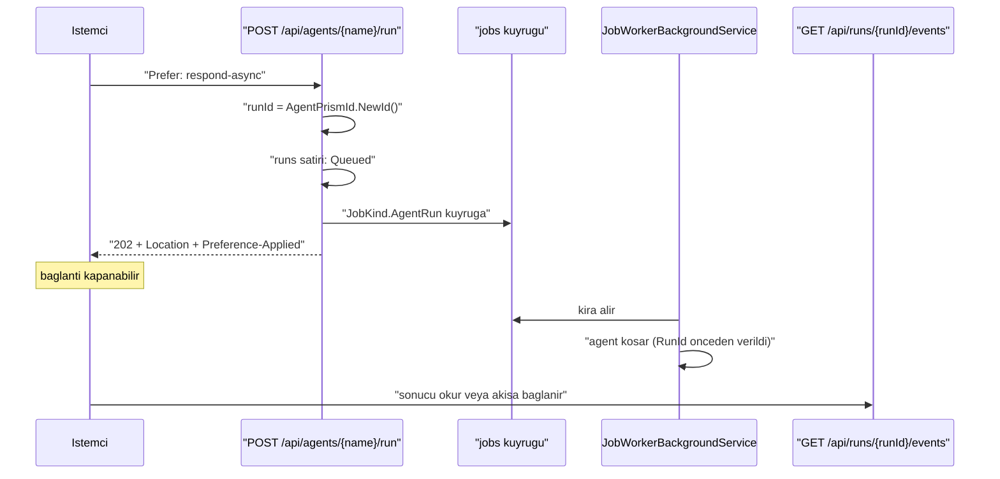
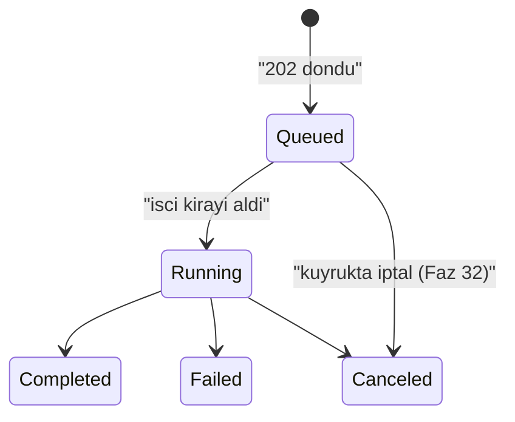

# Faz 46 — Dayanıklı Çalıştırma (`202 Accepted`)

> **Durum:** 📋 Planlandı (2026-08-06)
> **Kaynak:** [UCUNCU-FAZ-ADAYLARI.md](UCUNCU-FAZ-ADAYLARI.md) · **F-68** (F-39 bu kalemin içinde yaşar)
> **Önkoşul:** [Faz 43](43-IDEMPOTENCY-KEY.md) — yan etkili tool'un iki kez koşmasına karşı tek savunma. Faz 17'nin iş kuyruğu **hazır**
> **Paketler:** `AgentPrism.Abstractions`, `.Core`, `.AspNetCore`, `.UI`
> **Yeni paket:** Yok · **Migration:** **Yok** — yeni tablo yoktur, `JobKind` ve `RunStatus` yalnız **sona** değer ekler
> **Public API:** büyüyor — bir `JobKind` üyesi, bir `RunStatus` üyesi, bir ayar sınıfı, bir yanıt sözleşmesi. Faz 7'den önce ucuz

---

## Bu Faza Başlarken

> `faz-baslangic` skill'ini uygula. Aşağıdaki liste o skill'in 2. adımıdır —
> **tamamını değil, yalnız işaret edilen bölümleri oku.**

1. Bu doküman
2. Kararlar — dosyanın tamamını **okuma**, yalnız bu kalemleri grep'le:
   ```bash
   grep -n "K-014\|K-068\|K-138\|K-160\|K-162\|K-232" docs/KARARLAR.md
   ```
   **K-160** (iş kuyruğu geri adımlı beklemeyle genişletildi — bu fazın yeniden
   deneme davranışı oradan gelir), **K-162** (kota devam eden çalıştırmayı
   kesmez, yalnız yeni çalıştırma `429` alır — kuyruğa alma anı "yeni
   çalıştırma"dır), **K-138** (`jobs_schedule_scheduled_uq` çift tetiklemeyi
   kapatır), **K-014** (`run_events` append-only — yeniden koşan bir iş yeni
   olay yazar, eskisini silmez), **K-068** (`EnablePublicApiTracking` `false`),
   **K-232** (sunucu yanıtları çevrilmez).
3. [`43-IDEMPOTENCY-KEY.md`](43-IDEMPOTENCY-KEY.md) — yalnız devir notu ve
   [43.4](43-IDEMPOTENCY-KEY.md#434--akışlı-yanıt-bu-fazın-kapsamı-dışındadır):
   ```bash
   awk '/## Sonraki Faza Devir Notu/,0' docs/43-IDEMPOTENCY-KEY.md
   ```
   O faz akışlı idempotency'yi **bilerek bu faza bıraktı** ve devir notunda iki
   sınır yazdı. Bu fazın 46.5 bölümü o iki sınırı kapatır.
4. Alan hafızası (bu faz üç alana dokunuyor):
   [`hafiza/aspnetcore-di.md`](hafiza/aspnetcore-di.md) (**ana kaynak** —
   uç kaydı, `IEndpointFilter` sırası, `ProblemDetails`),
   [`hafiza/cekirdek-calistirma.md`](hafiza/cekirdek-calistirma.md)
   (🚨 `AsyncLocal` yazımı çağırana geri akmaz — bu faz arka plan görevinde
   çalıştırma açar, dört vakadan biri tam olarak budur),
   [`hafiza/frontend.md`](hafiza/frontend.md) (sözlük ve bundle bütçesi)
5. Gerektiğinde, tamamı değil ilgili bölümü:
   [`MIMARI.md`](MIMARI.md) — çalıştırma yolu ve HTTP yüzeyi bölümleri

---

## Amaç

Bugün bir çalıştırma HTTP isteğinin ömrüne bağlıdır. İstemci bağlantıyı
bırakırsa veya süreç yeniden başlarsa iş kaybolur. Saatler süren bir araştırma
agent'ı bu yüzden yazılamaz: tarayıcı sekmesi kapanınca çalıştırma da kapanır.

Bu faz, çalıştırmayı istekten **ayırır**. İstemci `Prefer: respond-async`
gönderir, `202 Accepted` ve bir `Location` başlığı alır, bağlantıyı bırakır.
Çalıştırma Faz 17'nin iş kuyruğunda koşar. İstemci sonucu `Location`'dan okur.

- **F-68** — kuyruğa alınan çalıştırma, `202 Accepted` + `Location` sözleşmesi,
  önceden ayrılmış çalıştırma kimliği, `Queued` durumu ve kuyruk yolunda
  akışa bağlanma.
- **F-39** — `202 Accepted` sözleşmesi. Ayrı bir kalem değildir; dayanıklı
  çalıştırmanın HTTP yüzüdür ve bu fazda birlikte gelir.

### Bugün ne çalışmıyor — doğrulanmış kanıt

| Kanıt | Gözlem |
|---|---|
| [`AgentEndpoints.cs:75`](../src/AgentPrism.AspNetCore/Endpoints/AgentEndpoints.cs) | `POST /api/agents/{name}/run` **tek moddur**: yanıt SSE ile akar ve çalıştırma isteğin içinde yaşar. Asenkron seçenek yok |
| [`RunRecordingAgent.cs:186`](../src/AgentPrism.Core/Recording/RunRecordingAgent.cs) | `OperationCanceledException` yakalandığında `run` `Canceled` olarak **kapatılır**. Devam ettirme yolu yoktur; aynı desen `:251`'de akışlı yol için tekrarlanır |
| [`JobKind.cs`](../src/AgentPrism.Abstractions/Scheduling/JobKind.cs) | Beş üye var (`AgentBatch`, `Workflow`, `Eval`, `WebhookDelivery`, `Retention`). **Tek bir agent çalıştırması için üye yok** — `AgentBatch` bir öge kümesi ister |
| [`RunStatus.cs`](../src/AgentPrism.Abstractions/Runs/RunStatus.cs) | Beş üye var; `Running = 0` ilk durumdur. **Kuyrukta bekleyen bir çalıştırmayı anlatan durum yok** |
| [`AgentPrismRunOptions.cs:63`](../src/AgentPrism.Abstractions/Runs/AgentPrismRunOptions.cs) | 🚨 **`RunId` alanı ZATEN VAR.** Çağıran kimliği önceden üretebiliyor. Gerekçe dosyada yazılı: "Akışlı bir uç kimliği ilk çerçeveden önce bilmek zorundadır" — `Location` başlığının ihtiyacı birebir aynıdır |
| [`jobs` tablosu](../src/AgentPrism.PostgreSql/Migrations/0008_scheduling.sql) | Kira (`lease_owner`, `lease_until`), deneme sayacı (`attempt`), iş başına `MaxAttempts` ve `scheduled_for` ile geri adımlı bekleme **hazır** (K-160) |
| [`AgentBatchJobHandler.cs`](../src/AgentPrism.Core/Scheduling/AgentBatchJobHandler.cs) | Kuyruktan agent çalıştırmanın deseni **hazır**: `IAgentCatalog.ResolveAsync` → çözülen agent zaten kayıt dekoratörüyle sarılı → normal `runs` satırı |

> Kanıtlar 2026-08-06 tarihinde doğrulandı.

**Aday listesinin "Okuma B'nin MAF kancası doğrulanmadı" notu ölçüldü ve
sonuç nettir:**

```bash
.claude/skills/maf-api-kesfi/scripts/dump-api.sh '*Checkpoint*'      # ciktı YOK
APIDUMP_PACKAGES="Microsoft.Agents.AI.Workflows@1.16.0" \
  .claude/skills/maf-api-kesfi/scripts/dump-api.sh '*Checkpoint*'    # 6 tip
```

🚨 **MAF'ta agent düzeyinde kontrol noktası kancası YOKTUR.** `CheckpointInfo`,
`CheckpointManager`, `ICheckpointStore<T>`, `CheckpointableRunBase` ve
`JsonCheckpointStore` tiplerinin **tamamı** `Microsoft.Agents.AI.Workflows`
derlemesindedir. `Microsoft.Agents.AI` ve `Microsoft.Agents.AI.Abstractions`
içinde tek bir kontrol noktası tipi bulunmuyor.

Bu ölçüm Okuma B'yi (tur bazlı kontrol noktası) bu fazın kapsamından çıkarır:
MAF vermediği için kanca **AgentPrism tarafından yazılacaktı** ve bu MAF'ın iç
turu taklit etmek demekti — K3'ü zorlayan bir tasarım. **Kullanıcı kararı:
Okuma A.** Gerekçe ve ertelenen okumalar [46.7](#467--seçilmeyen-okumalar) içinde.

---

## 46.1 — Sözleşme: `Prefer: respond-async`

Yeni bir uç eklenmez. Var olan uç bir **istek başlığı** tanır.



| Başlık | Yön | Ne yapar |
|---|---|---|
| `Prefer: respond-async` | istek | Çalıştırmayı kuyruğa alır; yanıt `202`'dir |
| `Preference-Applied: respond-async` | yanıt | 🚨 Tercih **uygulandığını** doğrular |
| `Location: {prefix}/api/runs/{runId}` | yanıt | Çalıştırma kaydının adresi |

🚨 **`Preference-Applied` atlanamaz.** RFC 7240 `Prefer` başlığını *tavsiye*
sayar: sunucu yok sayabilir. AgentPrism bu belirsizliği taşımaz — tercih
uygulandıysa yanıt `202` **ve** `Preference-Applied` taşır. Bu, Faz 43'ün
[43.4](43-IDEMPOTENCY-KEY.md#434--akışlı-yanıt-bu-fazın-kapsamı-dışındadır)
bölümünde ve K-034'te üç kez tekrarlanan kuralın aynısıdır: **sessizce yok
sayılan bir tercih, kullanıcının korunduğunu sanmasına yol açar.**

Başlık **gönderilmezse hiçbir şey değişmez** — bugünkü SSE davranışı aynen
sürer, ek bir sorgu bile atılmaz. K1 (sıfır sürpriz) bu yüzden ihlal edilmez;
ayar `Enabled = true` gelebilir ve gerekçesi Açık Soru 1'dedir.

## 46.2 — Çalıştırma kimliği önceden ayrılır

`Location` başlığı `202` ile birlikte gider. O anda henüz hiçbir agent
koşmamıştır. Kimliğin **istek anında** bilinmesi zorunludur.

Mekanizma zaten var: `AgentPrismRunOptions.RunId`. Alan Faz 15'te akışlı uç
için eklendi ve gerekçesi dosyada yazılıdır — akışlı bir uç kimliği ilk
çerçeveden önce bilmek zorundadır. `Location` başlığının ihtiyacı **birebir
aynıdır**.

```csharp
var runId = AgentPrismId.NewId();          // zaman sirali (v7), index'i parcalamaz
// ... is kuyruga yazilir, yuk runId tasir
// ... isci: agent.RunAsync(messages, session, new AgentPrismRunOptions { RunId = runId })
```

🚨 **`Guid.NewGuid()` kullanılmaz.** `AgentPrismRunOptions.RunId`'nin XML
dokümanı bunu açıkça yasaklıyor: rastgele kimlik depolama index'ini parçalar.
`AgentPrismId.NewId()` zaman sıralı üretir.

## 46.3 — `RunStatus.Queued` — 202 ile işçi arasındaki boşluk

`202` döndükten sonra istemci hemen `GET /api/runs/{runId}` çağırabilir. İşçi
işi henüz almadıysa `runs` satırı **yoktur** ve uç `404` döner. İstemci bunu
"yanlış kimlik" ile ayırt edemez.

Çözüm: `runs` satırı **kuyruğa alma anında** yazılır ve yeni bir durum taşır.

```csharp
public enum RunStatus
{
    Running = 0,
    Completed = 1,
    Failed = 2,
    Canceled = 3,
    AwaitingInput = 4,
    Queued = 5,          // YENI — SONA eklenir
}
```

🚨 **Değer sona eklenir.** Durumlar veritabanında `smallint` olarak saklanır;
mevcut değerlerin kayması eski satırları yanlış okur. `AwaitingInput = 4`
dosyada tam olarak bu gerekçeyle sona eklenmişti ve XML dokümanı kuralı
yazıyor — aynı kural uygulanır.

İki hesap kendiliğinden doğru kalır:

| Hesap | `Queued` satırın etkisi |
|---|---|
| `RunStatistics.ErrorRate` | Payda `Completed + Failed + Canceled`'dır. `Queued` **paydaya girmez** — `Running` gibi davranır ve oran yapay olarak düşmez |
| Gösterge paneli | Kuyrukta bekleyen çalıştırma **görünür**. Bugün görünmezdi |

Durum geçişi tek yönlüdür ve işçi ilk işi olarak yapar:



## 46.4 — `JobKind.AgentRun` ve işleyici

```csharp
public enum JobKind
{
    AgentBatch = 0,
    Workflow = 1,
    Eval = 2,
    WebhookDelivery = 3,
    Retention = 4,
    AgentRun = 5,        // YENI — SONA eklenir
}
```

`JobKind`'ın XML dokümanı değer sırasının **değiştirilemez** olduğunu ve yalnız
sona ekleme yapılabileceğini zaten yazıyor.

**`AgentBatch` neden yeniden kullanılmıyor?** İki gerekçe:

1. `AgentBatch` bir **öge kümesi** ister (`job_items`) ve ilerlemeyi
   `total_items`/`done_items` ile raporlar. Tek çalıştırmada bu yapı boş yere
   bir tablo satırı daha üretir.
2. `AgentBatch` çalıştırma kimliğini **kendisi ürettirir**. Bu fazın sözleşmesi
   kimliğin çağırandan gelmesini gerektirir. Aynı işleyiciye iki farklı kimlik
   sahipliği koymak, ikisini de kırılgan yapar.

`AgentRunJobHandler`, `AgentBatchJobHandler`'ın desenini birebir izler: agent
`IAgentCatalog.ResolveAsync` ile çözülür, çözülen agent **zaten** kayıt
dekoratörüyle sarılıdır, `runs` satırı kendiliğinden yazılır.

🚨 **İşleyici `AsyncLocal` tuzağının tam ortasındadır.** `MEMORY.md`'nin dört
vakalı dersi burada geçerlidir: `run scope` ve `span` **işleyicinin kendi
gövdesinde** açılmalıdır. `RunRecordingAgent` bunu zaten yapıyor; işleyici
kendi başına bir `scope` yazmaya kalkarsa yazım çağırana akmaz. Kural: işleyici
`scope` **yazmaz**, yalnız agent'ı çağırır.

### Süreç düşerse ne olur

| An | Davranış |
|---|---|
| İş kuyrukta, işçi almadı | Başka bir örnek alır. Hiçbir şey kaybolmaz |
| İşçi aldı, süreç düştü | Kira dolar, iş **baştan** koşar. `runs` satırı `Running` kalır ve **öksüz** olur |
| Yeniden koşma | Yeni bir `runs` satırı yazılır; `run_events` append-only olduğu için eski olaylar silinmez (K-014) |

🚨 **Öksüz `Running` satırı bu fazda kapatılmaz.** Bu, aday listesindeki
**F-36**'nın (öksüz çalıştırma uzlaştırması) işidir ve aday listesi sıralamayı
zaten yazıyor: F-36 bu fazdan **sonra** yapılmalıdır, yoksa iki kez yazılır.
Devir notu bunu taşır.

## 46.5 — Faz 43'ün iki devir sınırı

[Faz 43](43-IDEMPOTENCY-KEY.md) devir notunda iki sınır bıraktı. İkisi de burada kapanır.

### 1. Akışlı idempotency

Faz 43 kararı: akışlı bir istek `Idempotency-Key` taşırsa `400 Bad Request`.
Gerekçe: saklanmış bir SSE akışını yeniden oynatmak gövdeyi büyütür, zamanlama
bilgisini kaybeder ve maliyeti öngörülemez kılar.

`Prefer: respond-async` bu sorunu **ortadan kaldırır**, çözmez:

| İstek | Davranış |
|---|---|
| `Prefer: respond-async` + `Idempotency-Key` | ✅ Çalışır. Anahtar `202` yanıtını tekilleştirir — gövde küçüktür ve bir `Location` taşır |
| Akışlı (SSE) + `Idempotency-Key` | Faz 43'ün `400`'ü **korunur**. Yanıt mesajı artık bir **yol gösterir**: "`Prefer: respond-async` kullanın" |

🚨 **Tekilleştirilen şey akış değil, kuyruğa alma kararıdır.** Aynı anahtarla
gelen ikinci istek yeni bir iş **açmaz**; ilk `202`'nin `Location`'ını döndürür.
Böylece bir çalıştırma iki kez kuyruğa girmez.

### 2. Yeniden koşma yan etkili tool'u iki kez tetikler

Faz 43'ün devir notu bunu açıkça yazdı: `IIdempotencyStore` **HTTP
yüzeyindedir**, iş kuyruğunda değil. Kira dolup iş baştan koştuğunda o anahtar
devreye girmez.

Bu faz sınırı **kapatmaz, görünür kılar**:

| Önlem | Ne verir |
|---|---|
| `MaxAttempts` iş başına ayarlanır (K-160) | Varsayılan **1**: kuyruğa alınan çalıştırma öntanımlı olarak **yeniden denenmez**. Yan etki iki kez koşmaz |
| Ayar açıkça `AllowRetry` der | Tüketici yeniden denemeyi bilerek açar; belge tool'ların idempotent olması gerektiğini yazar |
| Denetim izi | Her yeniden deneme `jobs.attempt` üzerinde görünür |

🚨 **Varsayılan `MaxAttempts = 1` bilinçlidir ve K1'in doğrudan uygulamasıdır.**
"Dayanıklı" kelimesi "iş asla kaybolmaz" demez; "iş **sessizce** kaybolmaz"
demektir. Sessizce iki kez koşan bir ödeme tool'u, hiç koşmayandan kötüdür.

## 46.6 — İstemci sonucu nasıl okur

Üç yol vardır ve üçü de **bugün mevcut** uçlardır. Yeni bir okuma ucu yazılmaz.

| Yol | Uç | Ne zaman |
|---|---|---|
| Yoklama | `GET /api/runs/{runId}` | En basit. `status` alanı `Queued` → `Running` → sonuç |
| Akış | `GET /api/runs/{runId}/events` | Canlı izleme. Uç zaten var ([`RunEndpoints.cs:114`](../src/AgentPrism.AspNetCore/Endpoints/RunEndpoints.cs)) |
| Ağaç | `GET /api/runs/{runId}/tree` | Alt agent'lı çalıştırmada |

🚨 **`/events` ucu geçmişe dönük olayları da verir** çünkü `run_events`
append-only'dir (K-014) ve doküman "canlı akış ve geçmişe dönük replay aynı kod
yolundan geçer" diyor. İstemci `202`'den sonra **istediği anda** bağlanabilir;
başlangıç olaylarını kaçırmaz. Bu, sözleşmenin çalışmasının asıl sebebidir.

## 46.7 — Seçilmeyen okumalar

Karar defterine değil, bu belgeye yazılır — ikisi de gelecekte yeniden
değerlendirilebilir.

| Okuma | Neden bu fazda değil |
|---|---|
| **Okuma B** — tur bazlı kontrol noktası | MAF agent düzeyinde kanca **vermiyor** (46. bölüm başındaki ölçüm). Kancayı AgentPrism yazsaydı MAF'ın iç turunu taklit etmiş olurdu; K3'ü zorlar. Ayrıca yeni tablo + üç migration seti ister |
| **Okuma D** — dayanıklı run bir workflow'dur | Teknik olarak çekici: MAF'ın kontrol noktası **yalnız** workflow'da var ve AgentPrism onu zaten bağlamış (`IWorkflowCheckpointStore`, `workflow_checkpoints`, `parent_id`, Faz 15). Ama her dayanıklı çalıştırma bir workflow olurdu ve kayıt **ikileşirdi**: hem `runs` hem `workflows` satırı. `RunKind.Agent` ile `RunKind.Workflow` ayrımı bulanıklaşır |

🚨 **Okuma A, Okuma B'yi kırmaz.** `202 Accepted` + `Location` sözleşmesi kontrol
noktası eklendiğinde **aynen** kalır; değişen tek şey "süreç düşerse baştan
koşar" cümlesinin "kaldığı turdan devam eder" olmasıdır. Sözleşme bu yüzden
şimdi yazılabilir.

---

## Planlanan Public API

> Taslak imzalardır. Gerçekleşen imzalar kapanışta ayrı bir bölüme yazılır.

```csharp
// AgentPrism.Abstractions/Scheduling/JobKind.cs — mevcut enum'a SONA eklenir
public enum JobKind
{
    // ... mevcut uyeler degismez
    /// <summary>
    /// Tek bir agent calistirmasi (Faz 46). Yuk, onceden ayrilmis calistirma
    /// kimligini ve girdiyi tasir.
    /// </summary>
    AgentRun = 5,
}

// AgentPrism.Abstractions/Runs/RunStatus.cs — mevcut enum'a SONA eklenir
public enum RunStatus
{
    // ... mevcut uyeler degismez
    /// <summary>
    /// Calistirma kuyruga alindi ama henuz baslamadi. Yalnizca
    /// <c>Prefer: respond-async</c> ile baslatilan calistirmalarda gorulur.
    /// </summary>
    Queued = 5,
}
```

```csharp
// AgentPrism.Abstractions/Scheduling/AgentRunJobPayload.cs (YENI)

/// <summary>
/// <see cref="JobKind.AgentRun"/> isinin yuku.
/// </summary>
/// <remarks>
/// 🚨 <see cref="RunId"/> is kuyruga yazilmadan ONCE uretilir; yanitin
/// <c>Location</c> basligi bu degeri tasir.
/// </remarks>
public sealed record AgentRunJobPayload
{
    /// <summary>Onceden ayrilmis calistirma kimligi. Zaman sirali (v7).</summary>
    public required Guid RunId { get; init; }

    /// <summary>Kullanici mesaji.</summary>
    public string? Message { get; init; }

    /// <summary>Oturum kimligi. Verilmezse calistirma oturumsuzdur.</summary>
    public string? SessionId { get; init; }

    /// <summary>Onceden yuklenmis eklerin kimlikleri.</summary>
    public IReadOnlyList<Guid> AttachmentIds { get; init; } = [];
}
```

```csharp
// AgentPrism.AspNetCore/AgentPrismAsyncRunOptions.cs (YENI)

/// <summary>Kuyruga alinan calistirma ayarlari.</summary>
public sealed class AgentPrismAsyncRunOptions
{
    /// <summary>
    /// <c>Prefer: respond-async</c> tanınıyor mu. Kapaliysa basligi tasiyan
    /// istek <c>501</c> alir; sessizce yok sayilmaz.
    /// </summary>
    public bool Enabled { get; set; } = true;   // Acik Soru 1

    /// <summary>
    /// Kuyruga alinan calistirmanin en fazla deneme sayisi.
    /// </summary>
    /// <remarks>
    /// 🚨 Varsayilan <strong>1</strong>: yan etkili bir tool'un iki kez
    /// kosmasini engeller. Yukseltmek tool'larin idempotent olmasini gerektirir.
    /// </remarks>
    public int MaxAttempts { get; set; } = 1;
}
```

```csharp
// AgentPrism.AspNetCore/Contracts — YENI yanit sozlesmesi (F-39)

/// <summary>Kuyruga alinan bir calistirmanin 202 yaniti.</summary>
public sealed record AcceptedRunResponse
{
    /// <summary>Calistirma kimligi.</summary>
    public required Guid RunId { get; init; }

    /// <summary>Isi tasiyan kuyruk kaydinin kimligi.</summary>
    public required Guid JobId { get; init; }

    /// <summary>Calistirma kaydinin adresi. <c>Location</c> basligiyla aynidir.</summary>
    public required string Location { get; init; }

    /// <summary>Olay akisinin adresi.</summary>
    public required string EventsLocation { get; init; }
}
```

### HTTP `endpoint`'leri

Yeni uç **yok**. Var olan uçlar bir başlık tanır:

| Metot | Yol | Başlık | Davranış |
|---|---|---|---|
| `POST` | `/api/agents/{name}/run` | `Prefer: respond-async` | `202` + `Location` + `Preference-Applied` |
| `POST` | `/v1/responses` | `Prefer: respond-async` | Açık Soru 3 |
| `POST` | `/v1/chat/completions` | `Prefer: respond-async` | Açık Soru 3 |

Rol değişmez: uç bugün `Operator` ister
([`AgentEndpoints.cs:110`](../src/AgentPrism.AspNetCore/Endpoints/AgentEndpoints.cs)).
Kuyruğa almak da bir çalıştırma başlatmadır.

Kota denetimi **kuyruğa alma anında** yapılır. K-162 "devam eden çalıştırma
kesilmez, yalnız yeni çalıştırma `429` alır" diyor; kuyruğa almak yeni bir
çalıştırmadır ve `QuotaGate` bugünkü yerinde kalır.

### Arayüz payı

Çalıştırma listesi ve ayrıntı ekranı `Queued` durumunu göstermelidir; bugün
bilinmeyen bir durum kodu gelirse ekran onu ham gösterir.

| İş | Tahmin |
|---|---|
| `Queued` durum etiketi ve rengi | 🚨 **tahmin** — 0,5 KB gzip altı |
| Playground'da "arka planda çalıştır" seçeneği | Açık Soru 4'e bağlı |

Bugünkü kullanım (2026-08-06 ölçümü, [yol haritası](UCUNCU-FAZ-YOL-HARITASI.md)):
**151,3 KB gzip / 250 KB**, kalan pay **98,7 KB**. Gerçek pay uygulama anında
`postbuild.mjs` çıktısından okunur ve buraya yazılır.

Sözlük anahtarları `locales/en.ts` **ve** `locales/tr.ts` (K-228). Sunucunun
`202`/`501` mesajı çevrilmez (K-232).

---

## Planlanan Dosya Listesi

```
src/AgentPrism.Abstractions/Scheduling/
├── JobKind.cs                          (SONA bir uye)
└── AgentRunJobPayload.cs               (YENI)

src/AgentPrism.Abstractions/Runs/
└── RunStatus.cs                        (SONA bir uye)

src/AgentPrism.Core/Scheduling/
├── AgentRunJobHandler.cs               (YENI — AgentBatchJobHandler deseni)
└── AgentPrismSchedulingRegistration.cs (isleyici kaydi)

src/AgentPrism.AspNetCore/
├── AgentPrismAsyncRunOptions.cs        (YENI)
├── Contracts/AgentContracts.cs         (AcceptedRunResponse)
└── Endpoints/AgentEndpoints.cs         (Prefer basligi dallanmasi)

src/AgentPrism.UI/frontend/src/
├── screens/runs.tsx                    (Queued durumu)
├── screens/run-detail.tsx              (Queued durumu)
└── locales/{en,tr}.ts                  (yeni anahtarlar)
```

**Migration yok.** Yeni tablo yoktur; iki enum yalnız sona değer ekler ve ikisi
de veritabanında `smallint` olarak saklanır — mevcut satırlar etkilenmez.

---

## Testler

| Test sınıfı | Neyi doğrular |
|---|---|
| `AsyncRunAcceptedTests` | `Prefer: respond-async` → `202`, `Location`, `Preference-Applied`; gövde `AcceptedRunResponse` |
| `AsyncRunQueuedStatusTests` | 🚨 `202` döndükten **hemen sonra** `GET /api/runs/{runId}` `404` **değil**, `Queued` döner |
| `AsyncRunCompletionTests` | İşçi işi alır, `Queued` → `Running` → `Completed`; `runs.id` `Location`'daki kimliğe **eşittir** |
| `AsyncRunEventStreamTests` | İstemci `202`'den sonra `/events`'e bağlanır ve **başlangıç olaylarını kaçırmaz** (K-014) |
| `AsyncRunDisabledTests` | `Enabled = false` iken başlık taşıyan istek `501` alır; sessizce akışa düşmez |
| `AsyncRunNoHeaderTests` | Başlık **yokken** bugünkü SSE davranışı bit bit aynı |
| `AsyncRunIdempotencyTests` | 🚨 `Prefer: respond-async` + aynı `Idempotency-Key` → **tek iş**, aynı `Location`. İkinci istek yeni iş açmaz |
| `AsyncRunStreamingIdempotencyTests` | Akışlı + anahtar → Faz 43'ün `400`'ü korunur; mesaj `Prefer: respond-async` önerir |
| `AsyncRunQuotaTests` | Kota dolu iken kuyruğa alma `429` alır; iş **açılmaz** (K-162) |
| `AsyncRunRetryTests` | 🚨 `MaxAttempts = 1` iken kira dolan iş **yeniden denenmez**; `jobs.status` `Failed` |
| `AsyncRunRetryEnabledTests` | `MaxAttempts = 3` iken geri adımlı bekleme çalışır (K-160) |
| `AsyncRunTenantTests` | Kuyruğa alınan iş kiracı bağını korur; başka kiracı `Location`'ı okuyamaz |
| `AsyncRunCancelTests` | `Queued` durumdaki çalıştırma iptal edilebilir (Faz 32'nin ucu) |
| `RunStatusEnumTests` | `Queued = 5`; mevcut değerler **kaymadı** |

Sözleşme testi gerekmez — yeni bir depo arayüzü yoktur.

---

## Açık Sorular

> Planı bloklamayan, faz uygulanırken karara bağlanacak sorular. Bloklayan
> sorular plan yazılmadan **önce** soruldu ve
> [46.7](#467--seçilmeyen-okumalar)'de yazıldı.

| # | Soru | Seçenekler | Öneri |
|---|---|---|---|
| 1 | K1 "varsayılan kapalı" der. `Enabled = true` mı gelsin? | A: **açık** · B: kapalı | **A, ve bu Faz 43'ün emsalidir.** Başlık göndermeyen istemci için hiçbir şey değişmez — sorgu bile atılmaz. Kapalı gelirse başlık gönderen istemci `501` alır ve özellik var olduğunu bilmeden kalır. Faz 43 aynı yorumu yaptı; iki fazın **aynı** gerekçeyle aynı yönde karar vermesi kaydedilmelidir |
| 2 | `Prefer: respond-async` mi, `?async=true` mi? | A: **başlık** (RFC 7240) · B: sorgu parametresi | **A.** RFC 7240'ın tam olarak bu iş için tanımladığı başlıktır ve Faz 43 de bir başlık seçti. Sorgu parametresi önbellek anahtarına ve OpenAPI şemasına sızar; başlık sözleşmeyi katkısal tutar |
| 3 | OpenAI uyumlu uçlar (`/v1/responses`, `/v1/chat/completions`) da tanısın mı? | A: **tanımasın** · B: tanısın | **A.** O uçlar OpenAI sözleşmesini taklit eder ve OpenAI'ın kendi asenkron modeli **farklıdır** (`background: true` + `response.id`). AgentPrism'in başlığını oraya koymak iki sözleşmeyi karıştırır. Sınır belgeye yazılır ve yeni bir aday kalemi olur |
| 4 | Playground arka planda çalıştırma seçeneği sunsun mu? | A: sunmasın, yalnız `Queued` göstersin · B: sunsun | **A.** Playground bir **deneme** yüzeyidir; akışlı yanıt onun asıl değeridir. Arka plan çalıştırması bir API yeteneğidir. Bundle payı da böylece 0,5 KB altında kalır |
| 5 | `Location` `runs`'ı mı `jobs`'ı mı göstersin? | A: **`runs`** · B: `jobs` | **A.** İstemcinin istediği çalıştırmadır, kuyruk kaydı değildir. `JobId` yanıt gövdesinde yine verilir; teşhis için gerekir |
| 6 | Kuyrukta bekleyen çalıştırmanın süre sonu olmalı mı? | A: `jobs.scheduled_for` yeter · B: ayrı süre sonu | **A** bir taslaktır. Kuyruk zaten kira ve deneme sayacı taşıyor. Ama **çok uzun kuyrukta** bekleyen bir çalıştırmanın hâlâ anlamlı olup olmadığı ölçülmemiştir; ölçüm yapılmadan üretim önerisi yazılmaz |

---

## Bitiş Ölçütleri (DoD)

- [ ] 🚨 `Prefer: respond-async` ile gönderilen istek `202`, `Location` ve
      `Preference-Applied: respond-async` döner
- [ ] 🚨 `202`'den **hemen sonra** `GET /api/runs/{runId}` `Queued` döner — `404` **değil**
- [ ] İstemci bağlantıyı kapatsa bile çalıştırma **tamamlanır**; `runs` satırı
      `Completed` olur
- [ ] `runs.id`, `Location` başlığındaki kimliğe **eşittir**
- [ ] `202`'den sonra `/events`'e bağlanan istemci **başlangıç olaylarını görür**
- [ ] Başlık **gönderilmeyen** istekte bugünkü SSE davranışı değişmemiştir
- [ ] `Prefer: respond-async` + `Idempotency-Key` → **tek** iş, tek `runs` satırı
- [ ] Akışlı istek + `Idempotency-Key` → Faz 43'ün `400`'ü korunur; mesaj
      `Prefer: respond-async` önerir
- [ ] `Enabled = false` iken başlık taşıyan istek `501` alır
- [ ] `MaxAttempts = 1` iken kira dolan iş **yeniden denenmez**
- [ ] Kota dolu iken kuyruğa alma `429` alır ve iş açılmaz
- [ ] `Queued` durumdaki çalıştırma iptal edilebilir
- [ ] Dört doğrulama kapısı sıfır uyarı verir
- [ ] `samples/AgentPrism.Api` ile gerçek `run` yapıldı, çıktı bu belgeye yazıldı
- [ ] `secret` taraması boş döndü
- [ ] `en.ts` ve `tr.ts` eksiksiz; bundle payı ölçüldü ve buraya yazıldı

### Doğrulama komutları

```bash
# 1) Kuyruga al
RESP=$(curl -s -D - -o /dev/null -X POST \
  http://localhost:5081/agentprism/api/agents/asistan/run \
  -H "content-type: application/json" \
  -H "Prefer: respond-async" \
  -d '{"message":"uzun bir arastirma yap"}')
echo "$RESP" | grep -i "^HTTP/\|^location:\|^preference-applied:"

RUN_ID=$(echo "$RESP" | grep -i "^location:" | sed 's#.*/runs/##' | tr -d '\r')

# 2) HEMEN sorgula — Queued gelmeli, 404 GELMEMELI
curl -s "http://localhost:5081/agentprism/api/runs/$RUN_ID" | jq '.status'

# 3) Olay akisina bagla — baslangic olaylari da gelmeli
curl -sN "http://localhost:5081/agentprism/api/runs/$RUN_ID/events" | head -20

# 4) Tamamlandi mi
curl -s "http://localhost:5081/agentprism/api/runs/$RUN_ID" | jq '{status, completedAt, totalTokens}'

# 5) Kuyruk kaydi
curl -s "http://localhost:5081/agentprism/api/jobs?kind=AgentRun" | jq '.[0] | {kind, status, attempt}'

# 6) Idempotency — IKI istek, TEK is
KEY=$(uuidgen)
for i in 1 2; do
  curl -s -D - -o /dev/null -X POST \
    http://localhost:5081/agentprism/api/agents/asistan/run \
    -H "content-type: application/json" -H "Prefer: respond-async" \
    -H "Idempotency-Key: $KEY" -d '{"message":"merhaba"}' \
    | grep -i "^HTTP/\|^location:\|^idempotency-replayed:"
done

# 7) Akisli + anahtar — Faz 43'un 400'u korunmali
curl -s -o /dev/null -w "%{http_code}\n" -X POST \
  "http://localhost:5081/agentprism/api/agents/asistan/run" \
  -H "content-type: application/json" -H "Idempotency-Key: $(uuidgen)" \
  -d '{"message":"merhaba"}'

# 8) Surec dusme provasi: kuyrukta is varken ornegi oldur ve yeniden baslat.
#    Is BASTAN kosmali; runs tablosunda IKI satir olmali (biri oksuz Running).
psql "$AGENTPRISM_CONN" -c \
  "SELECT status, count(*) FROM agentprism.runs GROUP BY status ORDER BY status;"
```

---

## Riskler

| Risk | Önlem |
|------|-------|
| 🚨 Yeniden koşan iş yan etkili tool'u ikinci kez tetikler | Varsayılan `MaxAttempts = 1`; yeniden deneme tüketicinin bilinçli tercihidir. Faz 43'ün anahtarı **iş kuyruğunu kapsamaz** ve bu sınır belgeye yazılır |
| `202`'den sonra `404` gelirse istemci kimliği yanlış sanar | `runs` satırı kuyruğa alma anında `Queued` olarak yazılır; ayrı bir test bunu doğrular |
| 🚨 `RunStatus`/`JobKind` değeri ortaya eklenirse eski satırlar yanlış okunur | İkisi de **sona** eklenir; `RunStatusEnumTests` mevcut değerlerin kaymadığını doğrular |
| Öksüz `Running` satırları birikir | Bu fazın kapsamı **değildir**; F-36'nın işidir ve sıralama (F-68 → F-36) devir notunda yazılır |
| 🚨 İşleyici kendi `AsyncLocal` kapsamını açarsa yazım agent'a akmaz | İşleyici `scope` **yazmaz**; `RunRecordingAgent` zaten yazıyor. `hafiza/cekirdek-calistirma.md` dört vakayı listeliyor |
| `Prefer` sessizce yok sayılırsa istemci akış bekler, `202` alır | `Preference-Applied` zorunludur; `Enabled = false` iken `501` döner |
| Kuyruk dolar ve gecikme öngörülemez olur | `MaxConcurrentJobs` bugünkü ayardır; gecikme **ölçülmeli** (Açık Soru 6) |
| OpenAI uyumlu uçlarda iki asenkron sözleşme karışır | Bu uçlar başlığı **tanımaz** (Açık Soru 3); sınır belgeye yazılır |

---

<!-- ============================================================
     AŞAĞISI KAPANIŞTA DOLDURULUR — `faz-tamamlama` skill'i.
     Plan anında boş kalır. Başlıkları SİLME.
     ============================================================ -->

## Plandan Sapmalar

> Kapanışta doldurulur. Plan ile gerçek arasındaki fark **gizlenmez** — sonraki
> oturumun en değerli bilgisidir.

## Bu Fazda Verilen Kararlar

> Kapanışta doldurulur. K-NNN numaraları burada alınır; plan numara rezerve etmez.
>
> **Not:** Üç karar **mutlaka** kayda geçmelidir:
> 1. **Okuma A seçimi** ve MAF'ın agent düzeyinde kontrol noktası kancası
>    olmadığı ölçümü. Sonraki oturum bu ölçümü tekrarlamak zorunda kalmamalıdır.
> 2. **`MaxAttempts = 1` varsayılanı** ve gerekçesi ("sessizce iki kez koşan
>    tool, hiç koşmayandan kötüdür").
> 3. **`Enabled = true`** yorumu — Faz 43 ile aynı K1 okuması; iki fazın aynı
>    yönde karar vermesi bir emsal kurar.

## Gerçekleşen Public API

> Kapanışta doldurulur. Koddaki **gerçek** imzalar.

## Dosya Listesi (gerçekleşen)

> Kapanışta doldurulur.

## Sonraki Faza Devir Notu

> Kapanışta doldurulur: devralınan sözleşmeler, bilinen tuzaklar (🚨), yarım
> kalan işler, sıradaki faz.
>
> **Not:** Dört devir bilgisi zorunludur:
> 1. 🚨 **F-36 (öksüz çalıştırma uzlaştırması) artık yapılabilir ve
>    yapılmalıdır.** Bu faz öksüz `Running` satırı **üretir**. Aday listesi
>    sıralamayı zaten yazıyor: F-36 bu fazdan sonra gelir, yoksa iki kez yazılır.
> 2. **Okuma B'nin yolu açık kaldı.** `202` + `Location` sözleşmesi kontrol
>    noktası eklendiğinde değişmez. Ölçülen gerçek: MAF kancayı yalnız
>    `Microsoft.Agents.AI.Workflows` içinde veriyor
>    (`ICheckpointStore<T>`, `CheckpointInfo`, `CheckpointableRunBase`).
>    AgentPrism'in `workflow_checkpoints` tablosu (`parent_id` dahil) taklit
>    edilecek desendir.
> 3. **F-69 (asenkron onay kutusu) bu fazdan sonra doğaldır.** Kuyrukta koşan
>    bir çalıştırma onay isterse bugün kimse cevap veremez — istek o istemcinin
>    yanıtında kalır ve kuyrukta istemci yoktur. Bu, F-69'un aciliyetini
>    **artırır**; devir notu bunu ölçülmüş bir gözlem olarak yazmalıdır.
> 4. **OpenAI uyumlu uçların asenkron sözleşmesi** yeni bir aday kalemidir
>    (`background: true` + `response.id`); bu fazın başlığı oraya taşınmadı.
