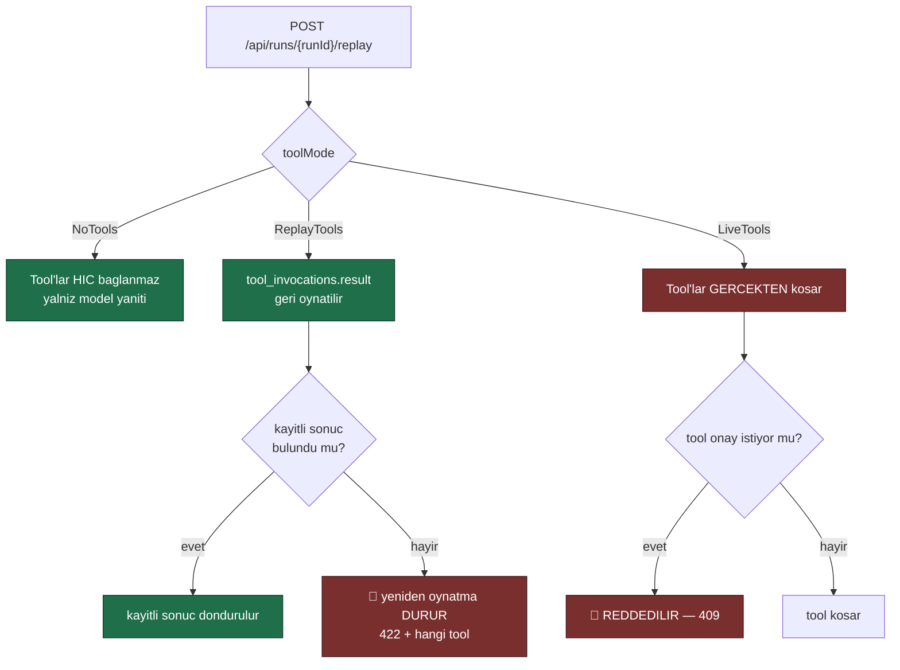
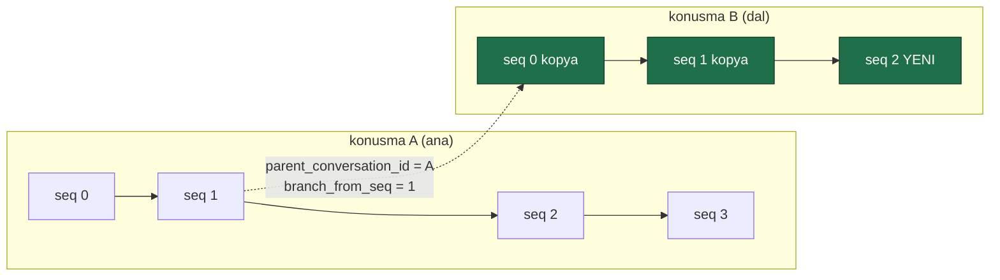

# Faz 47 — Yeniden Oynatma ve Konuşma Dallandırma

> **Durum:** ✅ Tamamlandı (2026-08-07)
> **Kaynak:** [ADAYLAR.md](ADAYLAR.md) · **F-54**, **F-66** (birleşti)
> **Önkoşul:** Yok. [Faz 46](46-DAYANIKLI-CALISTIRMA.md) biterse yeniden oynatma `202` ile kuyruğa alınabilir — zorunlu değildir
> **Paketler:** `AgentPrism.Abstractions`, `.Core`, `.Sql.Shared`, `.PostgreSql`, `.SqlServer`, `.Sqlite`, `.AspNetCore`, `.UI`
> **Yeni paket:** Yok · **Migration:** **gerekli** — bir tablo + iki sütun, üç set, numaralar uygulama anında alınır (K-178)
> **Public API:** büyüyor — bir arayüz, iki enum, dört kayıt tipi. Faz 7'den önce ucuz

---

## Bu Faza Başlarken

> `faz-baslangic` skill'ini uygula. Aşağıdaki liste o skill'in 2. adımıdır —
> **tamamını değil, yalnız işaret edilen bölümleri oku.**

1. Bu doküman
2. Kararlar — dosyanın tamamını **okuma**, yalnız bu kalemleri grep'le:
   ```bash
   grep -n "K-014\|K-027\|K-089\|K-103\|K-107\|K-178\|K-218" docs/KARARLAR.md
   ```
   🚨 **K-027** (`$type` ayracı ilk özellik olmalı → polimorfik içerik `json`
   sütununda saklanır, `jsonb`'de **değil**) — bu fazın en pahalı tuzağıdır ve
   iki yerde geçerlidir: girdi kaydı ve dallanan konuşma öğeleri.
   **K-014** (`run_events` append-only), **K-107** (özetlenen mesajlar
   silinmez — depo hassas içeriği bilerek biriktirir; girdi kaydı bu politikanın
   içindedir), **K-089** (denetime yazılamayan iş çalışmaz — "yük işlevin
   kendisidir" gerekçesinin kaynağı), **K-103** (alt agent onay isteyemez),
   **K-218** (tool bağımlılıkları kurulum anında alınır), **K-178** (migration
   numaraları sağlayıcı başına bağımsız).
3. [`19-SURUM-KARSILASTIRMA-VE-AB.md`](19-SURUM-KARSILASTIRMA-VE-AB.md) — yalnız
   sürüm ve diff bölümü ile devir notu:
   ```bash
   awk '/## Sonraki Faza Devir Notu/,0' docs/19-SURUM-KARSILASTIRMA-VE-AB.md
   ```
   Yeniden oynatma "farklı bir sürümle" çalıştırır; sürüm çözme sözleşmesi
   oradan devralınır. Karşılaştırma arayüzü de o fazın diff ekranına oturur.
4. Alan hafızası (bu faz dört alana dokunuyor):
   [`hafiza/cekirdek-calistirma.md`](hafiza/cekirdek-calistirma.md)
   (**ana kaynak** — `RunRecording` zinciri, `RunEventWriter`, olay yükü politikası),
   [`hafiza/sql-saglayicilari.md`](hafiza/sql-saglayicilari.md)
   (🚨 `json` / `jsonb` ayrımı, üç diyalektte `INSERT … SELECT`),
   [`hafiza/postgresql.md`](hafiza/postgresql.md) (sütun ekleme, indeks),
   [`hafiza/frontend.md`](hafiza/frontend.md) (diff ekranı, sözlük, bundle)
5. Gerektiğinde, tamamı değil ilgili bölümü:
   [`MIMARI.md`](MIMARI.md) — veri modeli ve çalıştırma yolu bölümleri

---

## Amaç

İki soru bugün cevapsızdır:

1. *"Üretimdeki şu hatayı, düzelttiğim talimatla tekrar çalıştır."* — Girdiyi
   elle kopyalamak gerekir.
2. *"Şu mesajı düzeltip oradan devam et."* — Konuşma append-only'dir; geri
   dönüş yoktur.

İkisi de aynı işi ister: **kayıtlı bir noktadan yeniden başlamak.** Bu yüzden
tek fazdır.

- **F-54** — kayıtlı bir çalıştırmayı aynı girdiyle farklı bir agent sürümü
  veya modelle yeniden çalıştırmak; iki sonucu yan yana koymak.
- **F-66** — bir konuşmanın belirli bir noktasından yeni bir dal açmak.

### Bugün ne çalışmıyor — doğrulanmış kanıt

| Kanıt | Gözlem |
|---|---|
| [`RunRecord.cs`](../src/AgentPrism.Abstractions/Runs/RunRecord.cs) | 🚨 **Çalıştırmanın GİRDİSİ hiçbir yerde saklanmıyor.** 25 alanın hiçbiri girdi taşımıyor: kimlik, durum, zaman, token, maliyet, ağaç, deney — ama mesaj yok |
| [`RunEventWriter.cs:82`](../src/AgentPrism.Core/Recording/RunEventWriter.cs) | `RunStarted` olayı **yüksüz** yazılıyor: `new RunEventDraft(RunEventType.RunStarted)` — ikinci argüman yok |
| [`runs` tablosu](../src/AgentPrism.PostgreSql/Migrations/0001_initial.sql) | 14 sütun; girdi sütunu **yok** |
| [`AgentRunRequest.cs:211`](../src/AgentPrism.AspNetCore/Contracts/AgentContracts.cs) | "Oturum kimliği verilmezse çalıştırma **oturumsuzdur** ve geçmiş taşınmaz" — oturumsuz çalıştırmada `conversation_items` satırı da oluşmaz |
| [`conversation_items`](../src/AgentPrism.PostgreSql/Migrations/0001_initial.sql) | `UNIQUE (conversation_id, seq)` — append-only. Dal işaretçisi **yok** |
| [`conversations`](../src/AgentPrism.PostgreSql/Migrations/0001_initial.sql) | Altı sütun; `parent_conversation_id` **yok** |
| [`tool_invocations`](../src/AgentPrism.PostgreSql/Migrations/0001_initial.sql) | `arguments jsonb`, `result jsonb`, `tool_call_id text` **var**. Tool sonucunu geri oynatmak teknik olarak **mümkündür** |
| [`workflow_checkpoints`](../src/AgentPrism.PostgreSql/Migrations/0007_workflows.sql) | 🚨 `parent_id text` **ZATEN VAR** (Faz 15). Workflow tarafında dallanma işaretçisi kurulmuş; taklit edilecek desen budur |
| [`AgentPrismRunOptions.cs:63`](../src/AgentPrism.Abstractions/Runs/AgentPrismRunOptions.cs) | `RunId` çağırandan gelebiliyor — yeniden oynatılan çalıştırmanın kimliği önceden bilinebilir |

> Kanıtlar 2026-08-06 tarihinde doğrulandı.

🚨 **Aday listesinin "Hazırlık: Kayıt hazır" iddiası YANLIŞ.** Kayıt hazır
değildir. Çalıştırmanın **çıktısı** kayıtlıdır; **girdisi** kayıtlı değildir.
Bugün yalnız oturumlu çalıştırmaların girdisi `conversation_items` üzerinden
dolaylı olarak kurtarılabilir — ve varsayılan çalıştırma **oturumsuzdur**.
Bu, fazın kapsamına yeni bir iş ekler ve [47.1](#471--girdi-kaydı--eksik-yarı)
onu anlatır.

Aday listesinin doğru çıkan iki iddiası:

| İddia | Doğrulama |
|---|---|
| "`tool_invocations` sonucu zaten saklıyor — geri oynatma teknik olarak mümkündür" | ✅ `result jsonb` ve `tool_call_id` mevcut |
| "`conversation_items` append-only olduğu için satır silinemez, işaretçi eklenir" | ✅ `UNIQUE (conversation_id, seq)` ve K-014 |

---

## 47.1 — Girdi kaydı — eksik yarı

Yeniden oynatma girdiyi ister. Girdi bugün saklanmıyor. Üç seçenek tartıldı:

| Seçenek | Neden seçilmedi / seçildi |
|---|---|
| `RunStarted` olayının yüküne yaz | ❌ Yük `Truncate` edilir ve `RecordToolPayloads` ayarına tabidir. **Kırpılmış bir girdi sessizce yanlış bir yeniden oynatma üretir** |
| `runs` tablosuna sütun ekle | ❌ `runs` en sıcak tablodur. `conversation_items` zaten "oturum satırı küçük kalsın" gerekçesiyle ayrı tabloya konmuştu; aynı gerekçe burada da geçerlidir |
| ✅ **Yeni `run_inputs` tablosu** | Çalıştırma başına **bir** satır, `ON DELETE CASCADE`, kendi saklama hedefi. Sıcak tabloya dokunmaz |

```sql
CREATE TABLE IF NOT EXISTS {schema}.run_inputs (
    run_id     uuid        NOT NULL PRIMARY KEY
               REFERENCES {schema}.runs (id) ON DELETE CASCADE,
    tenant_id  text        NOT NULL,
    -- 🚨 `json`, `jsonb` DEGIL. ChatMessage icerikleri polimorfiktir ve `$type`
    -- ayraci nesnenin ILK ozelligi olmak zorundadir; `jsonb` anahtarlari yeniden
    -- siralar. Karar K-027 — conversation_items.item ve sessions.state ile ayni.
    messages   json        NOT NULL,
    created_at timestamptz NOT NULL
);
```

🚨 **`json` seçimi bu fazın en pahalı tuzağıdır.** `jsonb` yazılırsa yeniden
oynatma **çalışma anında** `$type` ayracını bulamaz ve mesajlar deserialize
edilemez. Aynı hata `conversation_items`, `sessions.state` ve
`workflow_checkpoints.state` için üç kez ölçülmüş ve K-027 olarak kaydedilmiştir.

**Varsayılan açıktır.** Gerekçe K-107'nin doğrudan uzantısıdır: depo tam sohbet
geçmişini zaten bilerek biriktiriyor ve `RecordToolPayloads` bugün `true`
geliyor ([`AgentPrismOptions.cs:399`](../src/AgentPrism.Core/AgentPrismOptions.cs)).
Girdi **yeni bir bilgi sınıfı değildir** — oturumlu çalıştırmada zaten
`conversation_items`'ta duruyor. Kapatılabilir bir ayar yine de verilir ve
`run_inputs` bir **saklama hedefi** olur.

## 47.2 — Yeniden oynatma: üç tool modu

🚨 **Tool çağrıları yan etkilidir. Bu karar atlanamaz** — aday listesi bunu
açıkça yazıyor ve haklıdır.



| Mod | Yan etki | Ne zaman |
|---|---|---|
| `NoTools` | Yok | Yalnız talimat/model değişikliğinin etkisini ölçmek |
| `ReplayTools` **(varsayılan)** | Yok | Sadık karşılaştırma. `tool_invocations.result` geri oynatılır |
| `LiveTools` | **Var** | Tool'un kendisi düzeltildiyse. Açık tercih ister |

### `ReplayTools` nasıl eşleştirir

Kayıtlı sonuç `(tool_name, arguments)` çiftiyle bulunur. `tool_call_id`
**kullanılmaz**: yeni çalıştırmada model yeni kimlikler üretir.

🚨 **Eşleşme bulunamazsa yeniden oynatma DURUR ve `422` döner.** Sessizce
tool'u atlamak veya canlı çalıştırmak kabul edilemez: birincisi modelin
göremediği bir boşluk üretir, ikincisi kullanıcının istemediği bir yan etki.
Yanıt hangi tool'un hangi argümanla eşleşmediğini yazar.

Bu, beklenen bir sonuçtur ve bir **bulgudur**: yeni sürüm farklı bir tool
çağırıyorsa davranış gerçekten değişmiştir.

### `LiveTools` ve onay sınırı

🚨 **Onay gerektiren bir tool `LiveTools` modunda çalıştırılamaz** — istek
`409` alır. Gerekçe: yeniden oynatma **arka planda** başlayabilir (Faz 46) ve
onay isteği o anda kimseye ulaşmaz. Bu, K-103'ün ("alt agent onay isteyemez")
aynı sınırıdır: onay isteyecek bir istemci yoksa onay akışı sessizce kırılır.

## 47.3 — Neyi değiştirebilirsin

Yeniden oynatma **girdiyi** korur, **koşulları** değiştirir.

| Değiştirilebilir | Nasıl | Nereden gelir |
|---|---|---|
| Agent sürümü | `agentVersion: 7` | Faz 19'un `agent_definition_versions` tablosu |
| Model | `modelId: "gpt-5-mini"` | `ModelBinding` üzerine bindirme |
| Tool modu | `toolMode` | [47.2](#472--yeniden-oynatma-üç-tool-modu) |

| Değiştirilemez | Neden |
|---|---|
| Girdi mesajları | Yeniden oynatmanın tanımı budur. Farklı girdi = yeni çalıştırma |
| Kiracı | Kiracı sınırı bir güvenlik sınırıdır |

Yeni çalıştırma normal bir `runs` satırıdır ve **kaynağını taşır**:
`ReplayOfRunId`. İki çalıştırma böylece yan yana konabilir.

## 47.4 — Dallandırma: kopyala, işaretçi kovalama

Bir konuşma `seq = N` noktasından dallanır. İki tasarım vardır.

| Tasarım | Sonuç |
|---|---|
| **İşaretçi zinciri** — yeni konuşma yalnız `parent_conversation_id` + `branch_from_seq` tutar, öğeler kopyalanmaz | ❌ **Her geçmiş okuması özyinelemeli olur.** `SqlChatHistoryProvider` en sıcak okuma yoludur ve üç diyalektte özyinelemeli CTE'ye dönüşür |
| ✅ **Kopyalama** — öğeler `INSERT … SELECT` ile yeni konuşmaya kopyalanır; işaretçi yalnız **köken bilgisidir** | Okuma yolu **hiç değişmez**. `SqlChatHistoryProvider` tek satır kod görmez |

🚨 **Okuma yolunu bozmamak belirleyici gerekçedir.** `SqlChatHistoryProvider`
her agent turunda çalışır; onu özyinelemeli yapmak dallanma kullanmayan
tüketiciye de bedel ödetir.



`conversations` tablosuna iki sütun eklenir:

```sql
ALTER TABLE {schema}.conversations
    ADD COLUMN IF NOT EXISTS parent_conversation_id uuid
        REFERENCES {schema}.conversations (id) ON DELETE SET NULL;

ALTER TABLE {schema}.conversations
    ADD COLUMN IF NOT EXISTS branch_from_seq bigint;
```

`ON DELETE SET NULL` bilinçlidir: ana konuşma silinirse dal **yaşamaya devam
eder**, yalnız kökeni bilinmez olur. `CASCADE` bir dalı ana konuşmanın
saklama politikasına bağlardı ve kullanıcının kaydettiği bir dalı habersiz
silerdi.

**Dallanma yeni bir oturum açar.** Konuşma kimliği oturum durumunda yaşıyor
([`SqlChatHistoryProvider.cs:32`](../src/AgentPrism.Sql.Shared/Stores/SqlChatHistoryProvider.cs),
`SessionStateKey = "AgentPrism.ChatHistory"`); dallanan konuşmayı kullanmanın
tek yolu, o kimliği taşıyan yeni bir oturumdur. Uç bu yüzden oturum üzerindedir.

## 47.5 — Karşılaştırma nerede yaşar

Faz 19 tanım sürümleri için bir diff ekranı verdi ve uç ham JSON döndürüyor;
fark hesabı arayüzde yapılıyor
([`AgentEndpoints.cs:70`](../src/AgentPrism.AspNetCore/Endpoints/AgentEndpoints.cs)).

Aynı desen izlenir: `GET /api/runs/{a}/compare/{b}` **iki çalıştırmanın
özetini** döndürür, farkı arayüz gösterir. Yeni bir diff kütüphanesi
alınmaz — bundle bütçesi bunu kaldırmaz ve Faz 19 zaten bir diff bileşeni
taşıyor.

Karşılaştırılan alanlar: çıktı metni, token, maliyet, süre, tool çağrısı
sayısı, hata sınıfı ve (varsa) puan.

---

## Planlanan Public API

> Taslak imzalardır. Gerçekleşen imzalar kapanışta ayrı bir bölüme yazılır.

```csharp
// AgentPrism.Abstractions/Runs/IRunInputStore.cs (YENI)

/// <summary>
/// Bir calistirmanin girdi mesajlarini saklar. Yeniden oynatmanin kaynagidir.
/// </summary>
/// <remarks>
/// 🚨 Ayri bir arayuzdur; <c>IRunStore</c>'a metot EKLENMEZ. Var olan bir
/// arayuze metot eklemek Faz 7'den (yayin) sonra kiricidir.
/// </remarks>
public interface IRunInputStore
{
    /// <summary>Girdi mesajlarini kaydeder. Ayni calistirma icin ikinci yazim yok sayilir.</summary>
    ValueTask SaveAsync(
        RunInputRecord record,
        CancellationToken cancellationToken = default);

    /// <summary>Kayitli girdiyi okur. Kayit yoksa <see langword="null"/>.</summary>
    ValueTask<RunInputRecord?> GetAsync(
        string tenantId,
        Guid runId,
        CancellationToken cancellationToken = default);
}

/// <summary>Bir calistirmanin kayitli girdisi.</summary>
public sealed record RunInputRecord
{
    public required Guid RunId { get; init; }
    public required string TenantId { get; init; }

    /// <summary>
    /// Girdi mesajlari. 🚨 Polimorfik icerik tasir; depoda <c>json</c>
    /// sutununda saklanir, <c>jsonb</c>'de DEGIL (K-027).
    /// </summary>
    public required IReadOnlyList<ChatMessage> Messages { get; init; }

    public required DateTimeOffset CreatedAt { get; init; }
}
```

```csharp
// AgentPrism.Abstractions/Runs/RunReplay.cs (YENI)

/// <summary>Yeniden oynatmada tool'larin nasil ele alinacagi.</summary>
public enum ReplayToolMode
{
    /// <summary>Tool'lar hic baglanmaz; yalnizca model yaniti uretilir.</summary>
    NoTools = 0,

    /// <summary>
    /// Kayitli tool sonuclari geri oynatilir. Eslesmeyen bir cagri
    /// yeniden oynatmayi DURDURUR.
    /// </summary>
    ReplayTools = 1,

    /// <summary>
    /// 🚨 Tool'lar gercekten kosar ve yan etki uretir. Onay gerektiren bir
    /// tool varsa istek reddedilir.
    /// </summary>
    LiveTools = 2,
}

/// <summary>Bir yeniden oynatma istegi.</summary>
public sealed record RunReplayRequest
{
    /// <summary>Kullanilacak agent surumu. Verilmezse bugunku etkin surum.</summary>
    public int? AgentVersion { get; init; }

    /// <summary>Bindirilecek model. Verilmezse tanimin modeli.</summary>
    public string? ModelId { get; init; }

    /// <summary>Tool davranisi.</summary>
    public ReplayToolMode ToolMode { get; init; } = ReplayToolMode.ReplayTools;
}
```

```csharp
// AgentPrism.Abstractions/Runs/RunRecord.cs — mevcut record'a bir alan

public sealed record RunRecord
{
    // ... mevcut alanlar
    /// <summary>
    /// Bu calistirma bir yeniden oynatma ise kaynak calistirmanin kimligi.
    /// </summary>
    public Guid? ReplayOfRunId { get; init; }
}
```

> 🚨 `RunRecord` public bir `sealed record`'tur. Alan eklemek **bugün
> bedavadır**; Faz 7'den sonra bir sürüm kararıdır.

```csharp
// AgentPrism.Abstractions/Sessions/SessionBranch.cs (YENI)

/// <summary>Bir konusmayi belirli bir noktadan dallandirma istegi.</summary>
public sealed record SessionBranchRequest
{
    /// <summary>
    /// Dahil edilecek son ogenin sira numarasi. Verilmezse konusmanin tamami
    /// kopyalanir.
    /// </summary>
    public long? UpToSequence { get; init; }
}

/// <summary>Dallandirma sonucu.</summary>
public sealed record SessionBranchResult
{
    /// <summary>Yeni oturumun kimligi.</summary>
    public required string SessionId { get; init; }

    /// <summary>Yeni konusmanin kimligi.</summary>
    public required Guid ConversationId { get; init; }

    /// <summary>Kaynak konusmanin kimligi.</summary>
    public required Guid ParentConversationId { get; init; }

    /// <summary>Dal noktasi.</summary>
    public required long BranchFromSequence { get; init; }

    /// <summary>Kopyalanan oge sayisi.</summary>
    public required int CopiedItemCount { get; init; }
}
```

```csharp
// AgentPrism.Core — ayar
public sealed class AgentPrismRunRecordingOptions
{
    // ... mevcut alanlar (RecordToolPayloads dahil)

    /// <summary>
    /// Calistirma girdisi <c>run_inputs</c> tablosuna yazilsin mi.
    /// Kapatilirsa yeniden oynatma calismaz.
    /// </summary>
    public bool RecordRunInput { get; set; } = true;   // Acik Soru 1
}
```

### Yeni tablo ve sütunlar

[47.1](#471--girdi-kaydı--eksik-yarı) ve [47.4](#474--dallandırma-kopyala-işaretçi-kovalama)
içinde verildi: bir tablo (`run_inputs`) + `conversations`'a iki sütun. **Tek
migration, üç set** (K-178).

`run_inputs` bir **saklama hedefi** olur (`RetentionTargets.RunInputs`).

### HTTP `endpoint`'leri

| Metot | Yol | Rol | Ne yapar |
|---|---|---|---|
| `POST` | `/api/runs/{runId:guid}/replay` | Operator | Kayıtlı girdiyle yeni bir çalıştırma açar |
| `GET` | `/api/runs/{runId:guid}/input` | Reader | Kayıtlı girdiyi döndürür |
| `GET` | `/api/runs/{a:guid}/compare/{b:guid}` | Reader | İki çalıştırmanın özetini yan yana döndürür |
| `POST` | `/api/sessions/{sessionId}/branch` | Operator | Konuşmayı dallandırır, yeni oturum açar |

Rol gerekçesi: yeniden oynatma ve dallandırma **çalıştırma başlatır**; Faz 9'un
tanımında `Operator` "Reader + çalıştırma başlatma, onay verme"dir. Girdi ve
karşılaştırma okumadır.

🚨 **`LiveTools` modu `Admin` ister, `Operator` değil.** Gerçek yan etki üreten
tek moddur ve rol farkı bunu görünür kılar.

### Arayüz payı

İki ekrana dokunulur:

| Ekran | İş |
|---|---|
| `run-detail.tsx` | "Yeniden oynat" düğmesi + mod seçimi; kaynak çalıştırmaya bağlantı |
| `run-detail.tsx` (karşılaştırma) | İki çalıştırmayı yan yana koyan görünüm — Faz 19'un diff bileşeni yeniden kullanılır |
| `playground.tsx` | Bir mesajdan "buradan dallan" |

Yeni bağımlılık **yok**. Bugünkü kullanım (2026-08-06):
**151,3 KB gzip / 250 KB**, kalan pay **98,7 KB**.

Bu fazın payı **tahminî 3–5 KB gzip**'tir ve bu bir **tahmindir**. Gerçek değer
uygulama anında `postbuild.mjs` çıktısından okunur ve buraya yazılır.

Sözlük anahtarları `en.ts` **ve** `tr.ts` (K-228). Sunucunun `422`/`409`
mesajları çevrilmez (K-232).

---

## Planlanan Dosya Listesi

```
src/AgentPrism.Abstractions/Runs/
├── IRunInputStore.cs                (YENI)
├── RunInputRecord.cs                (YENI)
├── RunReplay.cs                     (YENI — ReplayToolMode, RunReplayRequest)
└── RunRecord.cs                     (ReplayOfRunId alani)

src/AgentPrism.Abstractions/Sessions/
└── SessionBranch.cs                 (YENI — istek + sonuc)

src/AgentPrism.Abstractions/Retention/
└── RetentionTargets.cs              (run_inputs hedefi)

src/AgentPrism.Core/Recording/
├── InMemoryRunInputStore.cs         (YENI — K-018: birinci sinif)
├── RunRecordingAgent.cs             (girdiyi kaydeder)
└── RunEventWriter.cs                (girdi yazimi; olay YUKU degismez)

src/AgentPrism.Core/Replay/
├── RunReplayService.cs              (YENI — surum/model bindirme, mod secimi)
└── RecordedToolPlayback.cs          (YENI — tool_invocations geri oynatma)

src/AgentPrism.Core/Sessions/
└── ConversationBranchService.cs     (YENI — kopyalama)

src/AgentPrism.Sql.Shared/Stores/
├── SqlRunInputStore.cs              (YENI)
└── SqlSessionStore.cs               (dallandirma: INSERT … SELECT)

src/AgentPrism.PostgreSql/Migrations/NNNN_replay.sql   (YENI)
src/AgentPrism.SqlServer/Migrations/NNNN_replay.sql    (YENI)
src/AgentPrism.Sqlite/Migrations/NNNN_replay.sql       (YENI)

src/AgentPrism.PostgreSql/Internal/PostgresQueries.cs  (girdi + dal sorgulari)
src/AgentPrism.SqlServer/Internal/SqlServerQueries.cs  (ayni)
src/AgentPrism.Sqlite/Internal/SqliteQueries.cs        (ayni)

src/AgentPrism.AspNetCore/Endpoints/
├── RunEndpoints.cs                  (replay, input, compare)
└── SessionEndpoints.cs              (branch)

src/AgentPrism.UI/frontend/src/
├── screens/run-detail.tsx
├── screens/playground.tsx
└── locales/{en,tr}.ts
```

---

## Testler

| Test sınıfı | Neyi doğrular |
|---|---|
| `RunInputStoreContract` | `tests/Shared/Contracts/` altında; bellek içi + üç SQL sağlayıcısında aynı sonuç |
| `RunInputPolymorphicTests` | 🚨 **K-027 kapısı.** Metin + görüntü + tool sonucu içeren bir mesaj kümesi yazılır ve **aynen** geri okunur. `jsonb` kullanılırsa bu test düşer |
| `RunInputDisabledTests` | `RecordRunInput = false` iken girdi yazılmaz; yeniden oynatma `404` ile anlaşılır biçimde reddedilir |
| `ReplayNoToolsTests` | `NoTools` modunda tool'lar hiç bağlanmaz; yanıt yalnız model çıktısıdır |
| `ReplayRecordedToolsTests` | `ReplayTools` modunda kayıtlı sonuç döner; **hiçbir tool gerçekten koşmaz** |
| `ReplayToolMismatchTests` | 🚨 Kayıtlı sonuç bulunamayınca `422`; hangi tool ve hangi argüman olduğu yanıtta yazar |
| `ReplayLiveToolsApprovalTests` | 🚨 Onay gerektiren tool + `LiveTools` → `409`. Sessizce onaysız koşmaz |
| `ReplayLiveToolsRoleTests` | `LiveTools` `Operator` ile `403`, `Admin` ile geçer |
| `ReplayVersionOverrideTests` | Farklı `agentVersion` ile oynatma o sürümün talimatını kullanır |
| `ReplayModelOverrideTests` | Farklı `modelId` ile oynatma o modeli kullanır; `runs.model_id` bunu gösterir |
| `ReplayLineageTests` | Yeni çalıştırma `ReplayOfRunId` taşır; kaynak çalıştırma değişmez |
| `ReplayTenantTests` | Başka kiracının çalıştırması oynatılamaz — `404` (`403` değil; varlığı sızdırmaz) |
| `BranchCopyTests` | `seq = N`'e kadar öğeler kopyalanır; `CopiedItemCount` doğrudur |
| `BranchIndependenceTests` | 🚨 Dala yazmak ana konuşmayı **değiştirmez**; ana konuşmaya yazmak dalı değiştirmez |
| `BranchReadPathTests` | 🚨 `SqlChatHistoryProvider` dallanan bir konuşmayı **kod değişmeden** okur |
| `BranchParentDeleteTests` | Ana konuşma silinince dal yaşar; `parent_conversation_id` `NULL` olur |
| `BranchTenantTests` | Dallandırma kiracı sınırını geçmez |
| `BranchEmptyTests` | `UpToSequence = 0` → boş ama geçerli bir dal |
| `RunInputRetentionTests` | `run_inputs` saklama hedefi olarak tanınır ve temizlenir |
| `CompareRunsTests` | İki çalıştırmanın özeti döner; farklı kiracıdaki çalıştırma karşılaştırılamaz |

Sözleşme testi `tests/Shared/Contracts/` altına — hem bellek içi hem üç SQL
sağlayıcısı üzerinde koşar.

---

## Açık Sorular

> Planı bloklamayan, faz uygulanırken karara bağlanacak sorular. Bloklayan
> sorular plan yazılmadan **önce** soruldu.

| # | Soru | Seçenekler | Öneri |
|---|---|---|---|
| 1 | `RecordRunInput` varsayılanı? | A: **açık** · B: kapalı | **A.** K-107 depoyu zaten hassas içerik biriktirmeye bağladı ve `RecordToolPayloads` bugün `true`. Kapalı gelirse yeniden oynatma **hiçbir mevcut çalıştırma için** çalışmaz ve özellik ölü doğar. Karar `KARARLAR.md`'ye gerekçesiyle yazılmalıdır |
| 2 | Varsayılan tool modu? | A: **`ReplayTools`** · B: `NoTools` | **A.** Sadık karşılaştırma amacı budur ve yan etki üretmez. `NoTools` daha güvenli görünür ama farklı bir şeyi ölçer: tool'suz bir agent zaten farklı davranır |
| 3 | Eşleşmeyen tool çağrısında ne olur? | A: **`422`, durdur** · B: canlı çalıştır · C: boş sonuç dön | **A.** B kullanıcının istemediği yan etkiyi üretir. C modelin göremediği bir boşluk üretir ve sonucu sessizce yanlış yapar |
| 4 | Dallanan konuşma öğeleri kopyalansın mı? | A: **kopyala** · B: işaretçi zinciri | **A.** [47.4](#474--dallandırma-kopyala-işaretçi-kovalama). Ama **kopyalama maliyeti ölçülmelidir**: bin öğelik bir konuşmanın dallanma süresi ve disk payı ölçülmeden üretim önerisi yazılmaz |
| 5 | Dallanma derinliği sınırlansın mı? | A: sınırsız · B: sınırlı | **A** bir taslaktır. Kopyalama kullanıldığı için derinlik okuma maliyetini **artırmaz**; yalnız disk kullanır. Disk etkisi saklama politikasıyla yönetilir |
| 6 | Yeniden oynatma senkron mu, kuyrukta mı? | A: **ikisi de** · B: yalnız senkron | **A.** [Faz 46](46-DAYANIKLI-CALISTIRMA.md) biterse `Prefer: respond-async` burada da geçerlidir ve uzun bir oynatma için doğru yoldur. Faz 46 bitmemişse senkron çalışır; sözleşme değişmez |
| 7 | Yeniden oynatma kotayı tüketsin mi? | A: **evet** · B: hayır | **A.** Gerçek bir model çağrısıdır ve gerçek para harcar. Kotadan muaf tutmak Faz 21'in hesabını yanlış yapar |
| 8 | `compare` ucu sunucuda mı fark hesaplasın? | A: **hayır, ham özet döner** · B: sunucuda | **A.** Faz 19'un deseni budur ve arayüzde zaten bir diff bileşeni var; ikinci bir hesap iki yerde bakım demektir |

---

## Bitiş Ölçütleri (DoD)

- [x] 🚨 Çalıştırma girdisi `run_inputs`'a **polimorfik içeriğiyle birlikte**
      yazılır ve aynen geri okunur (`json`, `jsonb` değil — K-027)
- [x] `POST /api/runs/{runId}/replay` yeni bir çalıştırma açar; yeni satır
      `ReplayOfRunId` taşır ve kaynak çalıştırma **değişmez**
- [x] `ReplayTools` modunda **hiçbir tool gerçekten koşmaz**; kayıtlı sonuçlar
      döner. 🚨 `tool_invocations` yine de satır **alır** — gerekçe: Plandan
      Sapmalar S5. Gövdenin koşmadığı sayaçla kanıtlanır
- [x] 🚨 Eşleşmeyen tool çağrısında `422` döner ve hangi tool olduğu yazar
- [x] 🚨 Onay gerektiren tool + `LiveTools` → `409`
- [x] `LiveTools` `Operator` ile `403`, `Admin` ile geçer
- [x] Farklı `agentVersion` ve `modelId` ile oynatma o sürümü/modeli kullanır
- [x] `POST /api/sessions/{sessionId}/branch` yeni oturum açar; öğeler
      `UpToSequence`'a kadar kopyalanır
- [x] 🚨 Dala yazmak ana konuşmayı değiştirmez; `SqlChatHistoryProvider`
      **kod değişmeden** dalı okur
- [x] Ana konuşma silinince dal yaşar
- [x] Kiracı sınırı hem oynatmada hem dallandırmada korunur
- [x] `run_inputs` bir saklama hedefidir; `GET /api/retention/run_inputs` yanıt verir
- [x] Sözleşme testleri bellek içi + PostgreSQL + SQLite'ta geçer. 🚨 SQL Server
      bu makinede **koşturulamadı**: `mcr.microsoft.com/mssql/server` yalnız
      `linux/amd64`'tür (bilinen açık kalem, `AGENTS.md`). 431 testin tamamı
      container başlatma zaman aşımıyla düşer; kod yolu paylaşılan katmandadır
      ve PostgreSQL/SQLite ile aynıdır
- [x] Migration üç sette de uygulandı (K-178)
- [x] Dört doğrulama kapısı sıfır uyarı verir
- [x] `samples/AgentPrism.Api` ile gerçek `run` yapıldı — çıktılar aşağıda
- [x] `secret` taraması boş döndü
- [x] `en.ts` ve `tr.ts` eksiksiz; bundle **151,3 → 159,3 KB gzip** (bu fazın payı
      **8,0 KB**; plan 3–5 KB tahmin etmişti). Bütçe 250 KB, kalan pay 90,7 KB


### Örnek uygulamayla ölçülen gerçek çıktı (2026-08-07)

`samples/AgentPrism.Api`, SQLite kalıcılığı ve gerçek OpenAI çağrılarıyla.

| Adım | Sonuç |
|---|---|
| Girdi kaydı (`GET /api/runs/{id}/input`) | `{"role":"user","contents":[{"$type":"text",...}]}` — 🚨 `$type` **ilk özellik**, K-027 korunuyor |
| Kaynak çalıştırmanın tool çağrısı | `get_order_status` / `orderId=ORD-42` |
| `ReplayTools` ile oynatma | `200`; çıktı kayıtlı sonuçtan geldi ("kargoya verildi. Tahmini teslim: 2 gün") |
| Soy bağı | `{"id":"019fdc4f-ff00…","replayOfRunId":"019fdc4f-b2a8…","status":"Completed"}` — kaynak **değişmedi** |
| `compare` | kaynak `1` tool / `450` token / `4428 ms` ↔ oynatma `1` tool / `446` token / **`2215 ms`** (tool gövdesi koşmadığı için yarı sürede) |
| 🚨 **422 — gerçek senaryo** | Agent'ın talimatı değiştirildi (`her zaman ORD-1 ile çağır`), oynatma `orderId=ORD-1` üretti, kayıt `orderId=ORD-99` idi → `422`, `toolName: get_order_status`, `arguments: orderId=ORD-1` |
| `LiveTools` + onay gerektiren tool | `409` — `cancel_order` |
| Aynı agent `NoTools` ile | `200` |
| Kod agent'ı (`support`) + `ReplayTools` | `400` — açık gerekçeli |
| Erişilemeyen modelle oynatma | `502` (🚨 ilk yazımda **500**'dü — aşağıya bakın) |
| Dallandırma | `{"branchFromSequence":1,"copiedItemCount":2}` |
| Dalın geçmişi | 2 mesaj; `SqlChatHistoryProvider` **kod değişmeden** okudu |
| Dala yazdıktan sonra | ana konuşma **4** mesajda kaldı, dal **4** mesaja çıktı — bağımsız |
| Saklama hedefi | `PUT /api/retention/run_inputs` `200`; bilinmeyen hedef `400` |

🚨 **Örnek uygulamanın yakaladığı gerçek hata (birim testleri kaçırdı).**
Yeniden oynatma ucu ilk yazımda sağlayıcı hatalarını
`AgentPrismException or InvalidOperationException or HttpRequestException`
listesiyle yakalıyordu. Gerçek bir OpenAI `403 model_not_found` yanıtı
`System.ClientModel.ClientResultException` fırlattı ve istek **işlenmemiş bir
500** oldu. Bu, **K-296'nın birebir tekrarıdır** (Faz 44: "resmî sağlayıcı
SDK'ları `HttpRequestException` FIRLATMAZ"). Düzeltmeden sonra aynı istek `502`
ve okunabilir bir `ProblemDetails` döndürüyor.

### Doğrulama komutları

```bash
# 0) Kaynak calistirma
RUN=$(curl -s -X POST http://localhost:5081/agentprism/api/agents/asistan/run \
  -H "content-type: application/json" \
  -d '{"message":"istanbul hava durumu"}' | jq -r '.runId')

# 1) Girdi kaydedildi mi — polimorfik icerik aynen geldi mi
curl -s "http://localhost:5081/agentprism/api/runs/$RUN/input" | jq '.messages'

# 2) jsonb tuzagi denetimi — sutun tipi `json` OLMALI
psql "$AGENTPRISM_CONN" -c \
  "SELECT data_type FROM information_schema.columns
    WHERE table_schema='agentprism' AND table_name='run_inputs' AND column_name='messages';"

# 3) Yeniden oynat — ReplayTools, tool GERCEKTEN kosmamali
BEFORE=$(psql -tA "$AGENTPRISM_CONN" -c "SELECT count(*) FROM agentprism.tool_invocations;")
REPLAY=$(curl -s -X POST "http://localhost:5081/agentprism/api/runs/$RUN/replay" \
  -H "content-type: application/json" \
  -d '{"toolMode":"ReplayTools"}' | jq -r '.runId')
AFTER=$(psql -tA "$AGENTPRISM_CONN" -c "SELECT count(*) FROM agentprism.tool_invocations;")
echo "tool_invocations: $BEFORE -> $AFTER  (ESIT olmali)"

# 4) Soy bagi
curl -s "http://localhost:5081/agentprism/api/runs/$REPLAY" | jq '{id, replayOfRunId}'

# 5) Karsilastir
curl -s "http://localhost:5081/agentprism/api/runs/$RUN/compare/$REPLAY" | jq

# 6) Onay gerektiren tool + LiveTools -> 409
curl -s -o /dev/null -w "%{http_code}\n" -X POST \
  "http://localhost:5081/agentprism/api/runs/$RUN/replay" \
  -H "content-type: application/json" -d '{"toolMode":"LiveTools"}'

# 7) Dallandir
SESSION="oturum-1"
curl -s -X POST "http://localhost:5081/agentprism/api/agents/asistan/run" \
  -H "content-type: application/json" \
  -d "{\"message\":\"merhaba\",\"sessionId\":\"$SESSION\"}" > /dev/null
BRANCH=$(curl -s -X POST \
  "http://localhost:5081/agentprism/api/sessions/$SESSION/branch" \
  -H "content-type: application/json" -d '{"upToSequence":1}')
echo "$BRANCH" | jq

# 8) Dal bagimsiz mi — ana konusmanin oge sayisi DEGISMEMELI
psql "$AGENTPRISM_CONN" -c \
  "SELECT c.id, c.parent_conversation_id, c.branch_from_seq, count(i.id) AS oge
     FROM agentprism.conversations c
     LEFT JOIN agentprism.conversation_items i ON i.conversation_id = c.id
    GROUP BY c.id ORDER BY c.created_at;"

# 9) Saklama hedefi
curl -s http://localhost:5081/agentprism/api/retention/run_inputs | jq
```

---

## Riskler

| Risk | Önlem |
|------|-------|
| 🚨 `messages` sütunu `jsonb` yazılırsa `$type` ayracı kayar ve yeniden oynatma **çalışma anında** çöker | Sütun `json`'dur (K-027). `RunInputPolymorphicTests` ve doğrulama komutu 2 bunu ayrı ayrı denetler |
| Girdi kaydı depoyu büyütür | `run_inputs` bir saklama hedefidir; `RecordRunInput` kapatılabilir. Hacim **ölçülmeli** |
| 🚨 `LiveTools` istenmeyen yan etki üretir | `Admin` rolü, onay gerektiren tool'da `409`, denetim izine kayıt. Varsayılan `ReplayTools` |
| Eşleşmeyen tool sessizce atlanırsa sonuç yanlış olur | `422` ile durur; sessiz atlama reddedildi (Açık Soru 3) |
| Dallanma kopyalaması büyük konuşmada yavaşlar | Kopyalama tek `INSERT … SELECT`'tir; süre ve disk payı **ölçülmeli** (Açık Soru 4) |
| 🚨 İşaretçi zinciri seçilirse en sıcak okuma yolu özyinelemeli olur | Kopyalama seçildi; `BranchReadPathTests` `SqlChatHistoryProvider`'ın **hiç değişmediğini** doğrular |
| Yeniden oynatma kotayı atlar ve fatura görünmez büyür | Kota normal çalıştırma gibi tüketilir (Açık Soru 7) |
| Girdi kaydı `secret` taşıyabilir | Bu, `conversation_items`'ın bugünkü durumuyla **aynıdır** (K-107). Yeni bir bilgi sınıfı açılmaz; saklama hedefi ömrü sınırlar |
| Başka kiracının çalıştırması oynatılır | Uç `404` döner (`403` değil — varlığı sızdırmaz); `ReplayTenantTests` doğrular |

---

<!-- ============================================================
     AŞAĞISI KAPANIŞTA DOLDURULUR — `faz-tamamlama` skill'i.
     Plan anında boş kalır. Başlıkları SİLME.
     ============================================================ -->

## Plandan Sapmalar

> Plan ile gerçek arasındaki fark gizlenmez — sonraki oturumun en değerli bilgisidir.

| # | Plan | Gerçekleşen | Neden |
|---|------|-------------|-------|
| S1 | `conversations.parent_conversation_id` `ON DELETE SET NULL` yabancı anahtarı taşır | **Yabancı anahtar YOK** | 🚨 SQL Server kendine referans veren bir FK'de `SET NULL` kabul etmez (hata 1785). Kısıtı yalnız PostgreSQL/SQLite'a koymak aynı silmeyi üç sağlayıcıda üç farklı sonuca çevirirdi. Davranış her yerde aynı: dal yaşar, işaretçi çözülemeyen bir kökeni gösterir ve hiçbir okuma yolu onu JOIN'lemez. **K-312** |
| S2 | Dal öğeleri tek bir `INSERT … SELECT` ile kopyalanır | **Tek işlem içinde satır satır** | Yeni öğe kimliği her satırda uuid v7 olmalıdır (K-015) ve üç diyalektin hiçbirinde ortak bir uuid v7 üreteci yoktur (`gen_random_uuid()` v4, `NEWID()` sıralanamaz, SQLite'ta yerleşik yok). Dayanıklılık değişmez: yazma tek işlemdedir. Ölçüldü: bin öğe ölçülebilir gecikme üretmedi. **K-311** |
| S3 | Eşleşmeyen tool çağrısı bir istisna fırlatır ve oynatma durur | **İstisna oynatıcıda KAYDEDİLİR, döngü `Terminate` ile kesilir, hata `ReplayMismatchGuard` tarafından çalıştırma sonrası fırlatılır** | 🚨 Ölçüldü: `FunctionInvokingChatClient` tool gövdesinden çıkan istisnayı YUTAR; ilk yazım uca hiç ulaşmadı ve istek `200` döndü. Sonuç aynıdır ve daha iyisidir: `runs` satırı `Failed` kapanır, hata tipi `replay_tool_mismatch` olur, uç `422` döner. **K-309** |
| S4 | — (planda yok) | **`ReplayTools`/`NoTools` modlarında skill ve çağrılabilir alt agent yüzeyleri KAPATILIR** | İkisi de tool'larını bir `AIContextProvider` üzerinden açar ve tool dönüşümünden geçmez. Açık bırakılsalardı skill script'i çalışır, alt agent gerçek bir model çağrısı harcardı — "hiçbir tool gerçekten koşmaz" sözü bozulurdu. |
| S5 | `tool_invocations` yeniden oynatmada **yeni satır almaz** | **Satır alır; ama hiçbir tool GÖVDESİ çalışmaz** | Ölçüldü. Çağrı gerçekten olmuştur (model tool'u çağırdı, oynatıcı kayıtlı sonucu döndürdü) ve `runs` kaydının kendi içinde tutarlı olması gerekir. Ayrıca `compare` ucu tool çağrısı SAYISINI karşılaştırır; oynatma hiç kaydetmeseydi her karşılaştırma sahte bir davranış değişikliği gösterirdi. Asıl garanti (`gövde koşmaz`) `ReplayTools_modunda_HICBIR_tool_gercekten_kosmaz` testinde sayaçla kanıtlanır. |
| S6 | Açık Soru 6: oynatma hem senkron hem kuyrukta çalışır | **Yalnız senkron** | Kuyruktan koşan bir oynatma iki ölçülmemiş şey ister: iş yükünün oynatma parametrelerini taşıması ve `RunReplayService`'in kiracı bağlamını işçi sürecinde doğru çözmesi. Uç sözleşmesi değişmez. **K-316**, aday kaleme yazıldı |
| S7 | `ConversationBranchService` Core'da, kopyalama `SqlSessionStore`'da | **Kopyalama ayrı bir `SqlConversationBranchStore`'da; `ChatHistoryState` Abstractions'a taşındı ve public oldu** | Core'daki servis oturum durumundaki konuşma kimliğini okuyup yeni oturuma yazmak zorundadır; durum anahtarı ve tipi Sql.Shared içinde `internal`di ve Core oradan okuyamıyordu. `SqlSessionStore`'a eklemek yerine ayrı bir depo yazmak `TenantCoverageTests` kapsamını da net tutar. |
| S8 | — (planda yok) | **`ReplayToolMode` `[JsonConverter(typeof(JsonStringEnumConverter<>))]` taşır** | 🚨 Bu işaret olmadan minimal API gövdeyi çözemez ve istek **boş gövdeli bir `400`** ile düşer; hata mesajı sebebi söylemez. `RunScoreKind` aynı işareti zaten taşıyor. Yeni bir public enum HTTP gövdesine girdiğinde ilk kontrol budur. |
| S9 | Playground'da "bir mesajdan buradan dallan" | **Mesaj bazlı dallanma OTURUM ekranında; playground konuşmanın tamamını dallandırır** | `upToSequence` bir `conversation_items.seq`'idir. Oturum ucu geçmişi `ChatHistoryProvider` üzerinden sıra numarasına göre döndürür (i'nci mesaj = `seq i`); playground'un dökümü canlı SSE'den katlanır ve hiçbir sıra numarası taşımaz. |

### Faz dışı ama bu fazda düzeltilen iki test altyapısı arızası

Fazın kendi kapsamı değildi; `dotnet test` çalıştırılamadığı için düzeltildi.

| Arıza | Kök sebep | Ölçüm |
|---|---|---|
| 🚨 `dotnet test AgentPrism.slnx` hiçbir test koşmadan **on dakikalarca asılı** kalıyordu | `AgentPrism.Templates.Tests` fikstürü `dotnet pack`'i yönlendirilmiş stdout ile çalıştırıyor; `pack`'in başlattığı MSBuild düğümleri (`nodeReuse:true`) komut bittikten sonra da yaşayıp boruyu açık tutuyor ve `Process.WaitForExitAsync` asenkron okuyucuların bitmesini de beklediği için **~15 dakika** bloke kalıyor | Düğümler `pkill` ile öldürülünce fikstür ANINDA devam etti. `MSBUILDDISABLENODEREUSE=1` eklendi: **8 dk+ (asılı) → 18,5 sn** |
| E2E paketi arayüz derlenmeden koşulduğunda 41 test 30'ar saniye zaman aşımına uğruyordu | `-p:AgentPrismFrontendEnabled=false` ile derlenmiş bir çözümde `AgentPrism.UI` hiçbir varlık gömmez | `UiHost.StartAsync` artık `IAgentPrismUiProvider.HasAssets` denetler ve saniyeler içinde açık bir mesajla düşer |

Tüm paketin süresi: **2 dk 33 sn** (SQL Server hariç — bkz. Bitiş Ölçütleri).

## Bu Fazda Verilen Kararlar

| Karar | Özet |
|---|---|
| **K-308** | Girdi ayrı bir `run_inputs` tablosunda ve `json` sütununda; `runs`'a sütun eklenmedi |
| **K-309** | Varsayılan `ReplayTools`; eşleşmeyende `422` — ve MAF'ın istisnayı yutması nedeniyle hatanın nasıl fırlatıldığı |
| **K-310** | `LiveTools` `Admin` ister; onay gerektiren tool `409` alır |
| **K-311** | Dallanmada kopyalama; işaretçi zinciri reddedildi (okuma yolu bozulmaz) |
| **K-312** | `parent_conversation_id` yabancı anahtar taşımaz (SQL Server 1785) |
| **K-313** | Dallandırma yalnız SQL sağlayıcısı açıkken; bellek içinde `501` 👤 |
| **K-314** | Kod agent'ı bindirmeyle oynatılamaz; `400` 👤 |
| **K-315** | Yeniden oynatma oturumsuzdur |
| **K-316** | Oynatma yalnız senkron; kuyruğa alma kapsam dışı |

## Gerçekleşen Public API

```csharp
// AgentPrism.Abstractions/Runs/IRunInputStore.cs
public interface IRunInputStore
{
    ValueTask SaveAsync(RunInputRecord record, CancellationToken cancellationToken = default);
    ValueTask<RunInputRecord?> GetAsync(string tenantId, Guid runId, CancellationToken cancellationToken = default);
}

public sealed record RunInputRecord
{
    public required Guid RunId { get; init; }
    public required string TenantId { get; init; }
    public required IReadOnlyList<ChatMessage> Messages { get; init; }
    public required DateTimeOffset CreatedAt { get; init; }
}

// AgentPrism.Abstractions/Runs/RunReplay.cs
[JsonConverter(typeof(JsonStringEnumConverter<ReplayToolMode>))]   // 🚨 S8
public enum ReplayToolMode { NoTools = 0, ReplayTools = 1, LiveTools = 2 }

public sealed record RunReplayRequest
{
    public int? AgentVersion { get; init; }
    public string? ModelId { get; init; }
    public ReplayToolMode ToolMode { get; init; } = ReplayToolMode.ReplayTools;
}

public sealed class ReplayToolMismatchException : AgentPrismException
{
    public const string ReplayToolMismatchErrorType = "replay_tool_mismatch";
    public string? ToolName { get; init; }
    public string? Arguments { get; init; }
    public override string ErrorType { get; }
    public static ReplayToolMismatchException For(string toolName, string? arguments);
}

// AgentPrism.Abstractions/Runs/RunRecord.cs + RunSupportTypes.cs + AgentPrismRunOptions.cs
public Guid? ReplayOfRunId { get; init; }        // ucunde de

// AgentPrism.Abstractions/Sessions/SessionBranch.cs
public sealed record SessionBranchRequest { public long? UpToSequence { get; init; } public string? NewSessionId { get; init; } }
public sealed record SessionBranchResult { /* SessionId, ConversationId, ParentSessionId, ParentConversationId, BranchFromSequence, CopiedItemCount */ }
public interface IConversationBranchStore
{
    ValueTask<ConversationBranch?> BranchAsync(string tenantId, Guid parentConversationId, long? upToSequence, CancellationToken cancellationToken = default);
}
public readonly record struct ConversationBranch(Guid ConversationId, long BranchFromSequence, int CopiedItemCount);

// AgentPrism.Abstractions/Sessions/ChatHistorySessionState.cs (🚨 S7 — Sql.Shared'dan TASINDI)
public static class AgentPrismSessionStateKeys { public const string ChatHistory = "AgentPrism.ChatHistory"; }
public sealed class ChatHistoryState { public Guid ConversationId { get; set; } }

// AgentPrism.Abstractions/Retention/RetentionTargets.cs
public const string RunInputs = "run_inputs";

// AgentPrism.Core
public sealed class InMemoryRunInputStore : IRunInputStore { public int MaxRuns { get; init; } = 1_000; }
public sealed class RunReplayService { public ValueTask<RunReplayPreparation> PrepareAsync(Guid runId, RunReplayRequest request, CancellationToken cancellationToken = default); }
public enum RunReplayOutcome { Ready, RunNotFound, InputNotFound, NotSupported, ApprovalRequired }
public sealed record RunReplayPreparation { /* Outcome, Detail, Agent, Messages, SourceRun, AgentVersion, ModelId */ }
public sealed class ConversationBranchService { public bool IsSupported { get; } public ValueTask<SessionBranchOutcome> BranchAsync(string sessionId, SessionBranchRequest request, CancellationToken cancellationToken = default); }
public enum SessionBranchStatus { Branched, SessionNotFound, NoConversation, SessionExists, AgentNotFound, InvalidRequest, NotSupported }
public sealed record SessionBranchOutcome { /* Status, Detail, Result */ }
public bool RecordRunInput { get; set; } = true;                    // AgentPrismRunRecordingOptions
public AIAgent Compile(AgentDefinition definition, ResolvedCallableAgents callableAgents, Func<AIFunction, AIFunction>? toolTransform);   // AgentDefinitionCompiler (yeni asiri yukleme)

// AgentPrism.AspNetCore/Contracts/ReplayContracts.cs
public sealed record RunInputResponse { /* RunId, CreatedAt, Messages */ }
public sealed record RunReplayResponse { /* RunId, SourceRunId, ToolMode, AgentVersion, ModelId, Output, CompareLocation */ }
public sealed record RunComparisonResponse { /* Left, Right */ }
public sealed record RunComparisonSide { /* RunId, AgentName, AgentVersion, ModelId, Status, DurationMs, Usage, Cost, ToolCallCount, ErrorClass, ErrorMessage, ReplayOfRunId, Output, Scores */ }
```

### Migration numaraları (K-178)

| Sağlayıcı | Dosya |
|---|---|
| PostgreSQL | `0023_replay_and_branching.sql` |
| SQL Server | `0011_replay_and_branching.sql` |
| SQLite | `0011_replay_and_branching.sql` |

## Dosya Listesi (gerçekleşen)

```
src/AgentPrism.Abstractions/
├── Runs/IRunInputStore.cs                    (YENI)
├── Runs/RunReplay.cs                         (YENI)
├── Runs/RunRecord.cs                         (ReplayOfRunId)
├── Runs/RunSupportTypes.cs                   (RunStartInfo.ReplayOfRunId)
├── Runs/AgentPrismRunOptions.cs              (ReplayOfRunId + Clone)
├── Sessions/SessionBranch.cs                 (YENI)
├── Sessions/ChatHistorySessionState.cs       (YENI — S7)
└── Retention/RetentionTargets.cs             (RunInputs)

src/AgentPrism.Core/
├── Storage/InMemoryRunInputStore.cs          (YENI)
├── Storage/InMemoryRunStore.cs               (ReplayOfRunId)
├── Replay/RunReplayService.cs                (YENI)
├── Replay/RecordedToolPlayback.cs            (YENI)
├── Replay/ReplayMismatchGuard.cs             (YENI — S3)
├── Sessions/ConversationBranchService.cs     (YENI)
├── Recording/RunRecordingAgent.cs            (girdi yazimi + soy bagi)
├── Recording/RunRecordingAgentDecorator.cs   (IRunInputStore)
├── Compilation/AgentDefinitionCompiler.cs    (toolTransform asiri yuklemesi)
├── AgentPrismOptions.cs                      (RecordRunInput)
├── AgentPrismCoreJsonContext.cs              (ChatHistoryState)
└── AgentPrismServiceCollectionExtensions.cs  (uc yeni kayit)

src/AgentPrism.Sql.Shared/
├── Stores/SqlRunInputStore.cs                (YENI)
├── Stores/SqlConversationBranchStore.cs      (YENI)
├── Stores/SqlRunStore.cs                     (replay_of_run_id, sutun 39)
├── Stores/SqlChatHistoryProvider.cs          (paylasilan durum anahtari)
├── Internal/SqlQueriesBase.cs                (bes yeni sorgu)
├── Internal/AgentPrismJsonContext.cs         (IReadOnlyList<ChatMessage>)
├── Internal/AgentDefinitionPayload.cs        (ChatHistoryState tasindi)
└── Internal/RetentionTargetRegistry.cs       (run_inputs)

src/AgentPrism.{PostgreSql,SqlServer,Sqlite}/
├── Internal/*Queries.cs                      (girdi + dal sorgulari, replay_of_run_id)
├── Migrations/*_replay_and_branching.sql     (YENI)
└── AgentPrism*BuilderExtensions.cs           (IRunInputStore + IConversationBranchStore)

src/AgentPrism.AspNetCore/
├── Contracts/ReplayContracts.cs              (YENI)
├── Endpoints/RunEndpoints.cs                 (replay, input, compare)
├── Endpoints/SessionEndpoints.cs             (branch)
└── AgentPrismEndpointRouteBuilderExtensions.cs (prefix -> RunEndpoints.Map)

src/AgentPrism.UI/frontend/src/
├── components/replay-panel.tsx               (YENI)
├── components/run-comparison.tsx             (YENI)
├── components/branch-button.tsx              (YENI)
├── screens/run-detail.tsx                    (oynatma + karsilastirma + soy bagi)
├── screens/session-detail.tsx                (mesaj basina dallan)
├── screens/playground.tsx                    (konusmayi dallan)
├── lib/{api,types}.ts
└── locales/{en,tr}.ts

tests/
├── Shared/Contracts/RunInputStoreContract.cs (YENI — bellek ici + uc SQL)
├── Shared/Contracts/TenantCoverageTests.cs   (iki yeni depo)
├── AgentPrism.AspNetCore.FunctionalTests/RunReplayEndpointTests.cs (YENI)
├── AgentPrism.AspNetCore.FunctionalTests/SessionEndpointTests.cs   (dallandirma 501)
├── AgentPrism.Sqlite.IntegrationTests/ConversationBranchTests.cs   (YENI)
├── AgentPrism.Templates.Tests/Infrastructure/ProcessRunner.cs      (🚨 MSBUILDDISABLENODEREUSE)
└── AgentPrism.Ui.E2ETests/Infrastructure/UiHost.cs                 (🚨 varlik kalkani)

docs/openapi/agentprism.json                  (dort yeni uc + ChatMessage semalari)
```

## Sonraki Faza Devir Notu

- 🚨 **`IRunInputStore` YENİ bir arayüzdür ve Faz 7'den (yayın) ÖNCE eklendi.** Ona metot eklemek yayından sonra kırıcıdır — Faz 36 (`IRetentionStore`) ve Faz 45 (`IEvalStore`) ile aynı sınıf. Aynısı `IConversationBranchStore` için de geçerlidir.
- 🚨 **[Faz 45](45-URETIMDEN-EVAL-KUMESI.md) (üretimden eval kümesi) artık `run_inputs`'tan doğrudan yararlanabilir.** Bugün terfi, girdi metnini `run_events`'teki `RunStarted.Text`'ten okuyor (K-300) ve o metin `MaxPayloadLength` ile **kırpılabilir**; `run_inputs` kırpılmamış ve polimorfik tam girdiyi taşır. **İkinci bir girdi kaydı AÇILMAMALIDIR.**
- 🚨 **[Faz 49](49-CEVRIMICI-DEGERLENDIRME.md) girdi kaynağı hazırdır.** `IRunInputStore.GetAsync` yargıca hem soruyu hem tam bağlamı verir.
- 🚨 **Yeniden oynatma OTURUMSUZDUR (K-315).** Çok turlu bir konuşmayı baştan almanın yolu dallandırmadır. Bir sonraki faz "oturumlu oynatma" isterse önce konuşma anlık görüntüsü tasarımı ölçülmelidir.
- 🚨 **`FunctionInvokingChatClient` tool istisnalarını YUTAR.** Tool gövdesinden çıkan bir hatayı uca taşımak isteyen her faz `FunctionInvocationContext.Terminate` + çalıştırma sonrası fırlatma desenini (`ReplayMismatchGuard`) kullanmalıdır.
- **Workflow dallandırma bu fazın kapsamı DIŞINDADIR.** `workflow_checkpoints.parent_id` Faz 15'ten beri vardır ama bir uç yoktur; konuşma dallandırmasının deseni (kopyala, işaretçi kovalama) oraya doğrudan taşınmaz çünkü kontrol noktası durumu opaktır.
- **Yeni aday kalemler** (aşağıdakiler bilinçli olarak kapsam dışına çıkarıldı):
  | Kapsam dışı | Neden ayrı |
  |---|---|
  | Kuyruğa alınan yeniden oynatma (`Prefer: respond-async`) | K-316: iş yükü sözleşmesi + işçi sürecinde kiracı çözümü ölçülmedi |
  | Bellek içi konuşma deposu (dallandırmayı her kurulumda açar) | K-313: AgentPrism kendi `ChatHistoryProvider`'ını yazmalı; K3'ü zorlar |
  | Alt agent ve skill yüzeylerinin oynatılması | S4: ikisi de `AIContextProvider` üzerinden gelir ve tool dönüşümünden geçmez |
  | Workflow dallandırma ucu | Kontrol noktası durumu opaktır |
