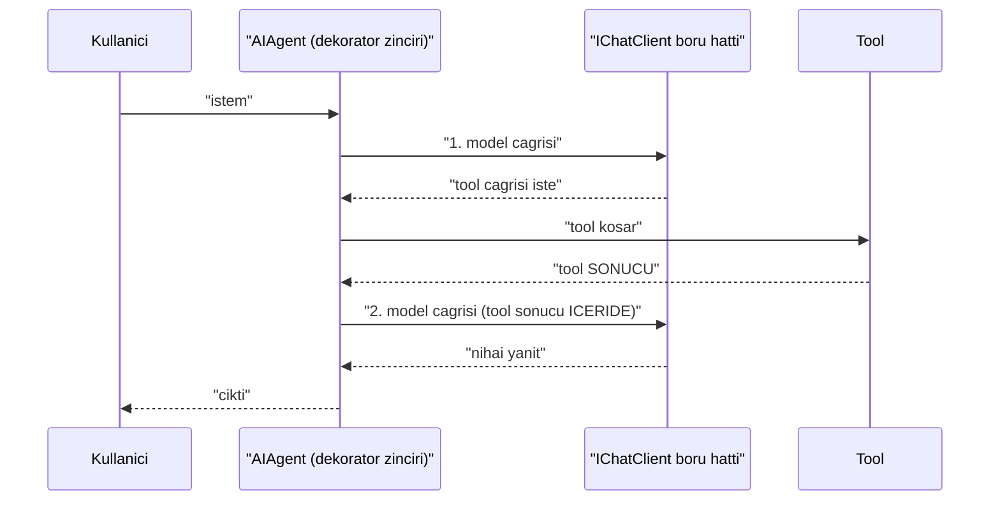
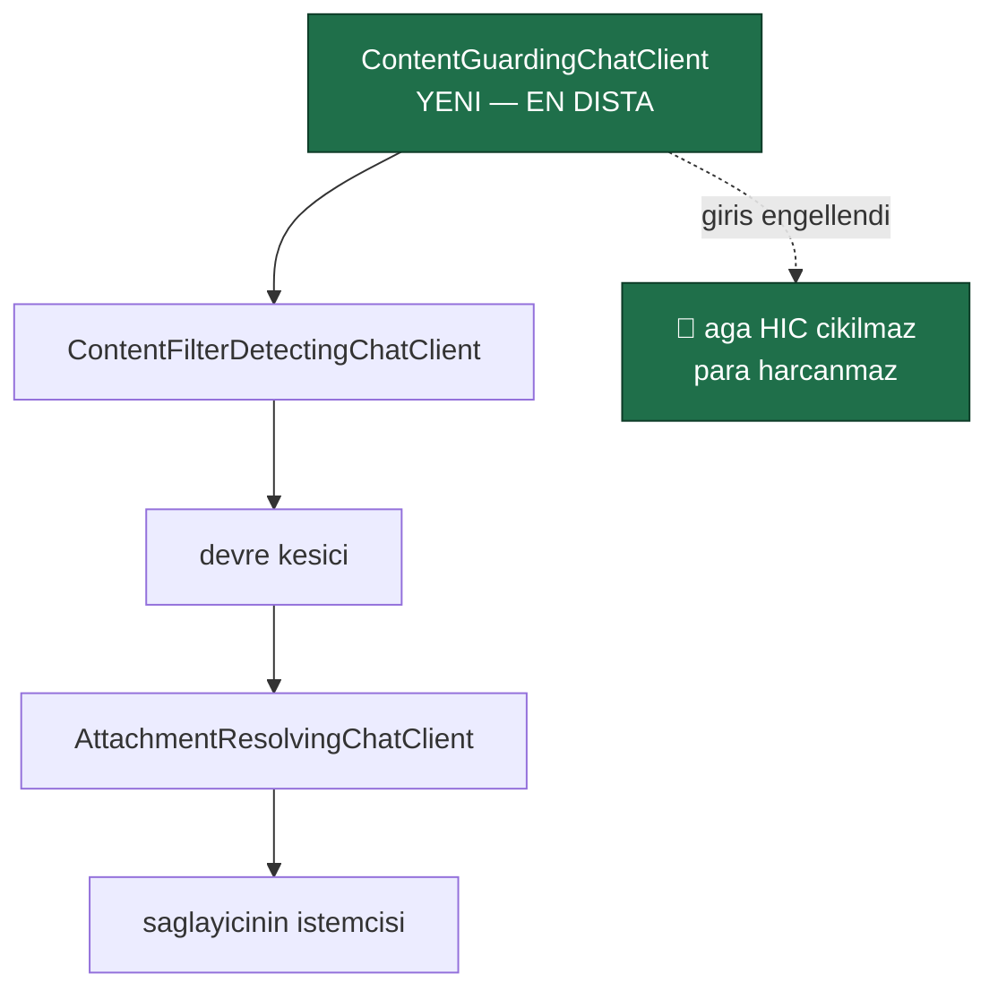

# Faz 48 — Guardrails ve İçerik Güvenliği Genişleme Noktası

> **Durum:** 📋 Planlandı (2026-08-06)
> **Kaynak:** [UCUNCU-FAZ-ADAYLARI.md](UCUNCU-FAZ-ADAYLARI.md) · **F-32**
> **Önkoşul:** Yok. Faz 8'in model boru hattı ve Faz 26'nın `ContentFilterDetectingChatClient`'ı **kullanılır**
> **Paketler:** `AgentPrism.Abstractions`, `.Core`, `.AspNetCore`
> **Yeni paket:** Yok — Azure adaptörü bilerek kapsam dışıdır ([48.6](#486--azure-ai-content-safety-bu-fazda-yok)) · **Migration:** Yok
> **Public API:** büyüyor — bir arayüz, üç kayıt tipi, iki enum, bir ayar, bir kararlı hata tipi. Faz 7'den önce ucuz

---

## Bu Faza Başlarken

> `faz-baslangic` skill'ini uygula. Aşağıdaki liste o skill'in 2. adımıdır —
> **tamamını değil, yalnız işaret edilen bölümleri oku.**

1. Bu doküman
2. Kararlar — dosyanın tamamını **okuma**, yalnız bu kalemleri grep'le:
   ```bash
   grep -n "K-018\|K-059\|K-089\|K-104\|K-158\|K-232" docs/KARARLAR.md
   ```
   **K-018** (bellek içi uygulama birinci sınıftır — yerleşik guard da öyledir),
   **K-089** ("denetime yazılamayan iş çalışmaz" — engelleme kararının
   kaydedilememesi de aynı sınıftır), **K-059** (`secret` veritabanına
   yazılmaz — engellenen içerik **saklanmaz**), **K-232** (sunucu yanıtları
   çevrilmez).
3. [`26-ANTHROPIC-VE-GEMINI.md`](26-ANTHROPIC-VE-GEMINI.md) — yalnız içerik
   filtresi bölümü ve devir notu:
   ```bash
   awk '/## Sonraki Faza Devir Notu/,0' docs/26-ANTHROPIC-VE-GEMINI.md
   ```
   `ContentFilterDetectingChatClient`'ın sarmalama sırası ve gerekçesi oradan
   devralınır; bu faz aynı boru hattına ikinci bir halka ekler.
4. Alan hafızası (bu faz üç alana dokunuyor):
   [`hafiza/openai-saglayici.md`](hafiza/openai-saglayici.md) (**ana kaynak** —
   `IChatClient` boru hattı, sarmalama sırası, devre kesici),
   [`hafiza/build-ve-analyzer.md`](hafiza/build-ve-analyzer.md)
   (🚨 AOT ve `[GeneratedRegex]` — `AgentPrism.Core` AOT uyumlu kalmalıdır),
   [`hafiza/cekirdek-calistirma.md`](hafiza/cekirdek-calistirma.md)
   (akışlı yol, `secret` filtresi)
5. Gerektiğinde, tamamı değil ilgili bölümü:
   [`MIMARI.md`](MIMARI.md) — güvenlik bölümü

---

## Amaç

AgentPrism bugün içeriği **denetlemiyor**. Modele giden istem hiç süzülmüyor;
modelden gelen yanıt yalnız sağlayıcının kendi filtresi kestiyse fark ediliyor.
Regüle bir sektörde bu, satın almanın önündeki kapıdır.

Bu faz bir **genişleme noktası** verir: `IContentGuard`. Yerleşik bir uygulama
da gelir, ama asıl ürün kancadır — tüketici kendi kural kümesini, kendi PII
maskeleyicisini veya bir bulut hizmetini aynı yere takar.

- **F-32** — giriş ve çıkış içerik denetimi, izin ver / engelle / maskele
  kararları, yerleşik desen tabanlı guard, denetim izine kayıt.

### Bugün ne çalışmıyor — doğrulanmış kanıt

| Kanıt | Gözlem |
|---|---|
| [`AuditSecretFilter.cs:24`](../src/AgentPrism.Core/Audit/AuditSecretFilter.cs) | Yalnız **denetim kaydını** temizler. Anahtar adına göre çalışır (`apikey`, `authorization`, `token`, `password`, `secret`) ve **modele giden isteme hiç dokunmaz** |
| [`ContentFilterDetectingChatClient.cs:31`](../src/AgentPrism.Core/Models/ContentFilterDetectingChatClient.cs) | Yalnız **sağlayıcının** filtresini *tespit eder*: `FinishReason == ContentFilter` **ve** yanıt boşsa istisna atar. Kendi filtresi yoktur |
| [`ModelProviderRegistry.cs:89-109`](../src/AgentPrism.Core/Models/ModelProviderRegistry.cs) | Boru hattı üç halkalıdır: `AttachmentResolvingChatClient` → devre kesici → `ContentFilterDetectingChatClient`. **İçerik denetimi halkası yok** |
| [`IAgentDecorator.cs:18`](../src/AgentPrism.Abstractions/Agents/IAgentDecorator.cs) | Dekoratör yuvası hazır: kayıt `0` → telemetri `10` → onay `20`. Küçük değer içe, büyük değer dışa sarılır |
| [`AgentPrismException.cs:41`](../src/AgentPrism.Abstractions/AgentPrismException.cs) | `ErrorType` **sanal üyedir** ve `ContentFilteredErrorType = "content_filtered"` kararlı bir değerdir. Taksonomi yuvası hazır |
| `grep -rn "GeneratedRegex" src/` | İki kullanım: [`McpToolNaming.cs:35`](../src/AgentPrism.Mcp/Internal/McpToolNaming.cs), [`HttpTenantContext.cs:122`](../src/AgentPrism.AspNetCore/Tenancy/HttpTenantContext.cs). **AOT uyumlu regex deseni repoda kurulu** |

> Kanıtlar 2026-08-06 tarihinde doğrulandı.

Aday listesinin iddiaları **doğrulandı**. Bir noktada daraltıldı: aday listesi
guard'ın "zincire bir `IAgentDecorator` olarak takıldığını" söylüyordu.
[48.1](#481--hangi-katman-iagentdecorator-değil-ichatclient) bunun neden yanlış
katman olduğunu ölçülmüş gerekçeyle anlatır.

---

## 48.1 — Hangi katman: `IAgentDecorator` değil, `IChatClient`

Bir `IAgentDecorator` agent'ın **girdisini ve çıktısını** görür. Görmediği şey
aradaki turlardır.



🚨 **Bir tool sonucu modele ikinci çağrıda girer.** `IAgentDecorator` o çağrıyı
**görmez** — yalnız ilk girdiyi ve son çıktıyı görür. Uzak bir MCP tool'u
zararlı içerik döndürürse (prompt injection'ın en yaygın yolu) dekoratör
katmanı bunu kaçırır.

`IChatClient` katmanı **her model çağrısını** görür ve tool sonuçları o
çağrıların mesajları içindedir. Bu yüzden guard boru hattına takılır.

| Katman | Görür | Seçildi mi |
|---|---|---|
| `IAgentDecorator` | İlk girdi, son çıktı | ❌ Ara turları kaçırır |
| `IChatClient` boru hattı | **Her** model çağrısının girdisi ve yanıtı — tool sonuçları dahil | ✅ |

Ek fayda: `ContentFilterDetectingChatClient`'ın gerekçesi birebir geçerlidir —
"OpenAI, Anthropic ve Gemini aynı davranışı **tek bir yerden** alır ve yeni bir
sağlayıcı kural yazmadan devralır".

## 48.2 — Boru hattındaki yer

Bugünkü sıra (dıştan içe):

```
ContentFilterDetectingChatClient
  → devre kesici
    → AttachmentResolvingChatClient
      → saglayicinin gercek istemcisi
```

Guard **en dışa** girer:



Üç gerekçe, üçü de mevcut koddaki gerekçelerin devamıdır:

| Gerekçe | Kaynak |
|---|---|
| 🚨 **Engellenen giriş ağa hiç çıkmaz.** Guard içeride olsaydı istek gönderilir, sonra atılırdı — para harcanmış olurdu | Ön uçuş denetiminin amacı |
| 🚨 **Engelleme devre kesiciyi tetiklememelidir.** İçerde olsaydı arka arkaya engellenen birkaç istek sağlayıcıyı kapatırdı | `ContentFilterDetectingChatClient`'ın kendi XML dokümanındaki gerekçenin aynısı |
| **Çıkış denetimi en son çalışmalıdır.** Yanıt tam olarak istemciye gideceği hâliyle görülmelidir | — |

## 48.3 — Üç karar: izin ver, engelle, maskele

```csharp
public enum ContentGuardAction { Allow = 0, Mask = 1, Block = 2 }
```

| Karar | Davranış | Çalıştırma |
|---|---|---|
| `Allow` | İçerik değişmeden geçer | Devam |
| `Mask` | 🚨 İçerik **değiştirilerek** geçer | Devam. Değişiklik `run_events`'e yazılır |
| `Block` | `AgentPrismContentBlockedException` | `Failed`; kararlı hata tipi `content_blocked` |

**`Mask` neden `Block`'tan önemli:** gerçek kurumsal ihtiyaç "TC kimlik numarası
modele gitmesin" biçimindedir, "TC kimlik numarası içeren her istek reddedilsin"
biçiminde değil. Yalnız engelleme sunan bir guard pratikte kapatılır.

🚨 **Maskeleme sessiz olamaz.** Modelin gördüğü metin kullanıcının yazdığından
farklıysa bu bir olay olarak kaydedilir (`RunEventType.ContentMasked`). K-089'un
kuralı burada da geçerlidir: **bir kararın kaydedilememesi, kararın
alınmamasıyla aynıdır.** Olay yazılamıyorsa maskeleme yine uygulanır ama hata
loglanır — gözlemlenebilirlik işlevselliği bozmaz.

### Akışlı yolda çıkış denetimi

🚨 **Akışta çıkış denetiminin doğal bir sınırı vardır.** Bir çerçeve istemciye
gönderildikten sonra geri alınamaz. İki seçenek:

| Seçenek | Sonuç |
|---|---|
| Çerçeve çerçeve denetle | Kısmi metin üzerinde desen eşleşmez — `4444-` görülür, kart numarası tamamlanmadan geçer |
| ✅ **Akışı tamponla, sonra denetle** | Akışın canlılığı kaybolur ama denetim doğru olur |

**Karar: çıkış guard'ı açıkken akışlı yanıt tamponlanır.** Ayar bunu açıkça
söyler (`BufferStreamingOutput`, varsayılan `true` — guard kapalıyken hiç
devreye girmez). Sessizce yarım denetim yapmak, denetim yapmamaktan kötüdür —
kullanıcı korunduğunu sanar.

Giriş denetimi akıştan etkilenmez: istem çağrıdan önce tamdır.

## 48.4 — Yerleşik guard: `PatternContentGuard`

Genişleme noktası tek başına yeterli değildir; K-018 "bellek içi uygulama
birinci sınıftır" der. Yerleşik uygulama üç desen ailesi taşır ve **hepsi
kapalı doğar**.

| Aile | Örnek | Varsayılan karar |
|---|---|---|
| Yasak sözcük listesi | tüketici doldurur | `Block` |
| PII desenleri | e-posta, IBAN, kredi kartı, TC kimlik numarası | `Mask` |
| `secret` desenleri | `sk-…`, `ghp_…`, `AKIA…` | `Mask` |

🚨 **Her desen `[GeneratedRegex]` ile yazılır.** `AgentPrism.Core` AOT
uyumludur; çalışma anında derlenen `Regex` bunu bozar. Repoda iki `[GeneratedRegex]`
kullanımı zaten var ve desen kuruludur.

🚨 **Her desen `matchTimeoutMilliseconds` taşır.** Mevcut iki kullanım 1000 ms
veriyor; ReDoS'a karşı tek savunma budur ve sıcak yolda zorunludur.

**Kredi kartı ve TC kimlik numarası deseni Luhn / kontrol basamağı denetimi
yapar.** Yalnız `\d{16}` eşleşmesi her sipariş numarasını maskeler ve guard
kullanılamaz hâle gelir.

### Tahsis — ölçülmeli, iddia edilmez

Guard sıcak yoldadır. **Tahsis etkisi bu fazda ölçülür ve buraya yazılır.**
Plan bir sayı iddia etmez. İki kural şimdiden bellidir:

1. **Hiç guard kayıtlı değilse maliyet sıfırdır.** `ContentGuardingChatClient`
   boru hattına **hiç eklenmez** — bir `if` bile çalışmaz.
2. Eşleşme yoksa yeni bir dize tahsis edilmez. `Regex.IsMatch` ile başlanır;
   `Replace` yalnız eşleşme varsa çağrılır.

Ölçüm aday listesinin 4. merceğinin (performans ve AOT) gereğidir ve DoD'dedir.

## 48.5 — Engellenen içerik saklanmaz

Bir `Block` kararı denetim izine yazılır. **Yazılan şey içerik değildir.**

| Yazılır | Yazılmaz |
|---|---|
| Hangi guard, hangi kural adı | 🚨 Engellenen metnin **kendisi** |
| Yön (giriş/çıkış), çalıştırma kimliği, kiracı | — |
| Eşleşme sayısı ve karakter aralığı | — |

Gerekçe: engellenen içerik tanımı gereği hassastır. Onu denetim iznine yazmak,
sorunu **kalıcı** hâle getirir. K-059'un ruhu budur ve `AuditSecretFilter`
zaten aynı yönde çalışıyor.

Maskelenen içerikte de aynı kural: olay maskenin **yapıldığını** yazar, ne
maskelendiğini değil.

## 48.6 — Azure AI Content Safety bu fazda yok

Aday listesi "Azure AI Content Safety adaptörü **ayrı paket**" diyordu. Ölçüldü
ve **ertelendi**.

| Ölçüm (2026-08-06) | Değer |
|---|---|
| `Azure.AI.ContentSafety` en son sürüm | **1.0.0** (GA) |
| Geçişli paket sayısı | **4** — `Azure.Core` 1.36.0, `Microsoft.Bcl.AsyncInterfaces` 1.1.1, `System.Memory.Data` 1.0.2 |

Ağırlık **sorun değil** (karşılaştırma: `Google.GenAI` 11, Foundry 37 — K-212).
Erteleme gerekçesi ağırlık değil, **doğrulanamazlıktır**:

🚨 Bir Azure Content Safety adaptörü gerçek bir Azure kaynağı olmadan sahte
istemciden öteye test edilemez. DoD'nin yarısı boş kalırdı. Bu, K-212'nin
Foundry için yazdığı üç gerekçeden ikincisinin birebir aynısıdır ve o karar
emsaldir.

Bu fazın ürünü **kancadır**. Kanca doğruysa Azure adaptörü otuz satırdır ve
`AgentPrism.ContentSafety` adıyla ayrı bir paket olarak, gerçek bir abonelikle
doğrulanabildiği gün yazılır. **Yeni bir aday kalemidir.**

---

## Planlanan Public API

> Taslak imzalardır. Gerçekleşen imzalar kapanışta ayrı bir bölüme yazılır.

```csharp
// AgentPrism.Abstractions/Guards/IContentGuard.cs (YENI)

/// <summary>
/// Modele giden ve modelden gelen icerigi denetleyen genisleme noktasi.
/// </summary>
/// <remarks>
/// <para>
/// Kayit <c>TryAddEnumerable</c> ile yapilir; birden cok guard sirayla calisir
/// ve <strong>en sert karar kazanir</strong> (Block &gt; Mask &gt; Allow).
/// </para>
/// <para>
/// 🚨 Guard <see cref="ModelProviderRegistry.CreateChatClient"/> boru hattinin
/// EN DISINDA calisir: engellenen bir istek aga hic cikmaz ve engelleme devre
/// kesiciyi tetiklemez.
/// </para>
/// <para>
/// Hicbir guard kayitli degilse sarmalayici boru hattina EKLENMEZ; maliyet
/// tam olarak sifirdir.
/// </para>
/// </remarks>
public interface IContentGuard
{
    /// <summary>Guard'in adi. Denetim izine ve olaya bu ad yazilir.</summary>
    string Name { get; }

    /// <summary>Icerigi denetler.</summary>
    ValueTask<ContentGuardResult> InspectAsync(
        ContentGuardContext context,
        CancellationToken cancellationToken = default);
}

/// <summary>Denetimin yonu.</summary>
public enum ContentGuardDirection
{
    /// <summary>Modele giden icerik.</summary>
    Input = 0,

    /// <summary>Modelden gelen icerik.</summary>
    Output = 1,
}

/// <summary>Guard'in verebilecegi karar.</summary>
public enum ContentGuardAction
{
    Allow = 0,
    Mask = 1,
    Block = 2,
}

/// <summary>Denetim baglami.</summary>
public sealed record ContentGuardContext
{
    public required ContentGuardDirection Direction { get; init; }

    /// <summary>Denetlenecek metin.</summary>
    public required string Text { get; init; }

    /// <summary>Calistirma kimligi. Kapsam disindan cagrilirsa <see langword="null"/>.</summary>
    public Guid? RunId { get; init; }

    public string? TenantId { get; init; }
    public string? AgentName { get; init; }
    public string? ModelId { get; init; }
}

/// <summary>Denetim sonucu.</summary>
public sealed record ContentGuardResult
{
    /// <summary>Icerik degismeden gecer.</summary>
    public static ContentGuardResult Allow { get; } = new() { Action = ContentGuardAction.Allow };

    /// <summary>Icerik degistirilerek gecer.</summary>
    public static ContentGuardResult Mask(string maskedText, string ruleName) => new()
    {
        Action = ContentGuardAction.Mask,
        MaskedText = maskedText,
        RuleName = ruleName,
    };

    /// <summary>Icerik engellenir; calistirma <c>Failed</c> olur.</summary>
    public static ContentGuardResult Block(string ruleName, string reason) => new()
    {
        Action = ContentGuardAction.Block,
        RuleName = ruleName,
        Reason = reason,
    };

    public required ContentGuardAction Action { get; init; }

    /// <summary>Yalnizca <see cref="ContentGuardAction.Mask"/> icin dolar.</summary>
    public string? MaskedText { get; init; }

    /// <summary>Eslesen kuralin adi. 🚨 Eslesen ICERIGI tasimaz.</summary>
    public string? RuleName { get; init; }

    /// <summary>Engelleme sebebi. 🚨 Engellenen metni tasimaz.</summary>
    public string? Reason { get; init; }
}
```

```csharp
// AgentPrism.Abstractions/AgentPrismException.cs — YENI istisna

/// <summary>Icerik bir guard tarafindan engellendi.</summary>
public sealed class AgentPrismContentBlockedException : AgentPrismException
{
    /// <summary><see cref="AgentPrismException.ErrorType"/> icin kararli deger.</summary>
    public const string ContentBlockedErrorType = "content_blocked";

    /// <inheritdoc />
    public override string ErrorType => ContentBlockedErrorType;

    /// <summary>Karari veren guard'in adi.</summary>
    public required string GuardName { get; init; }

    /// <summary>Eslesen kuralin adi.</summary>
    public string? RuleName { get; init; }

    /// <summary>Denetimin yonu.</summary>
    public required ContentGuardDirection Direction { get; init; }
}
```

```csharp
// AgentPrism.Core — yerlesik guard ayarlari
public sealed class PatternContentGuardOptions
{
    /// <summary>Guard acik mi. 🚨 Varsayilan KAPALI (K1).</summary>
    public bool Enabled { get; set; }

    /// <summary>Girisi denetle.</summary>
    public bool InspectInput { get; set; } = true;

    /// <summary>Cikisi denetle.</summary>
    public bool InspectOutput { get; set; } = true;

    /// <summary>
    /// 🚨 Cikis denetimi acikken akisli yanit tamponlanir. Kismi bir cerceve
    /// uzerinde desen eslesmez; tamponlamadan denetim yarim kalir.
    /// </summary>
    public bool BufferStreamingOutput { get; set; } = true;

    /// <summary>Yasak sozcukler. Eslesme <c>Block</c> uretir.</summary>
    public IList<string> DeniedTerms { get; } = [];

    /// <summary>Acilacak yerlesik PII desenleri.</summary>
    public PiiPatterns MaskedPii { get; set; } = PiiPatterns.None;
}

/// <summary>Yerlesik PII desen aileleri.</summary>
[Flags]
public enum PiiPatterns
{
    None = 0,
    Email = 1,
    Iban = 2,
    CreditCard = 4,          // Luhn dogrulamasi yapar
    TurkishNationalId = 8,   // kontrol basamagi dogrulamasi yapar
    ProviderApiKey = 16,     // sk-… ghp_… AKIA…
}
```

```csharp
// AgentPrism.Abstractions/Runs/RunEventType.cs — SONA iki uye
public enum RunEventType
{
    // ... mevcut uyeler (0–19) degismez
    /// <summary>Bir guard icerigi maskeledi. Yuk kural adini tasir, ICERIGI tasimaz.</summary>
    ContentMasked = 20,

    /// <summary>Bir guard icerigi engelledi. Yuk kural adini tasir, ICERIGI tasimaz.</summary>
    ContentBlocked = 21,
}
```

🚨 **`RunEventType` değerleri veritabanında `smallint` olarak saklanır.**
Değerler **sona** eklenir; mevcut değerlerin kayması eski satırları yanlış okur.
`RunStatus.AwaitingInput` aynı gerekçeyle sona eklenmişti.

### Kayıt

```csharp
// K4: tuketicinin kaydi kazanir
services.TryAddEnumerable(ServiceDescriptor.Singleton<IContentGuard, PatternContentGuard>());
```

Guard **listesi boşsa** `ContentGuardingChatClient` boru hattına hiç eklenmez.

### HTTP `endpoint`'leri

Yeni uç **yok**. Engelleme çalıştırma hatası olarak görünür: `runs.error_type`
`content_blocked` olur ve `GET /api/runs/{runId}` bunu döndürür.

`POST /api/agents/{name}/run` bir girişte engellenirse `422 Unprocessable
Content` döner — `500` **değil**. İstemci hatasıdır ve yeniden denemek işe
yaramaz. `ProblemDetails` guard adını ve kural adını taşır, **engellenen metni
taşımaz**.

### Arayüz payı

Çalıştırma ayrıntı ekranı iki yeni olay tipini göstermelidir (`ContentMasked`,
`ContentBlocked`) ve `content_blocked` hata tipini anlamlı bir metinle
karşılamalıdır.

Bugünkü kullanım (2026-08-06): **151,3 KB gzip / 250 KB**, kalan pay
**98,7 KB**. Bu fazın payı **tahminî 1 KB gzip altındadır**; gerçek değer
uygulama anında `postbuild.mjs` çıktısından okunur ve buraya yazılır.

Sözlük anahtarları `en.ts` **ve** `tr.ts` (K-228). Sunucunun `422` mesajı
çevrilmez (K-232).

---

## Planlanan Dosya Listesi

```
src/AgentPrism.Abstractions/Guards/
├── IContentGuard.cs                    (YENI)
├── ContentGuardContext.cs              (YENI)
├── ContentGuardResult.cs               (YENI — Action, Direction dahil)

src/AgentPrism.Abstractions/
├── AgentPrismException.cs              (AgentPrismContentBlockedException)
└── Runs/RunEventType.cs                (SONA iki uye)

src/AgentPrism.Core/Guards/
├── ContentGuardingChatClient.cs        (YENI — DelegatingChatClient)
├── PatternContentGuard.cs              (YENI — [GeneratedRegex])
├── PatternContentGuardOptions.cs       (YENI)
├── PiiPatterns.cs                      (YENI)
└── LuhnValidator.cs                    (YENI — kart + TC kimlik dogrulamasi)

src/AgentPrism.Core/Models/
└── ModelProviderRegistry.cs            (boru hattina EN DISTAKI halka)

src/AgentPrism.Core/
└── AgentPrismServiceCollectionExtensions.cs   (TryAddEnumerable kaydi)

src/AgentPrism.AspNetCore/
└── Endpoints/AgentEndpoints.cs         (content_blocked -> 422)

src/AgentPrism.UI/frontend/src/
├── screens/run-detail.tsx              (iki olay tipi)
└── locales/{en,tr}.ts
```

**Migration yok.** `RunEventType`'a değer eklemek şema değiştirmez; sütun zaten
`smallint`.

---

## Testler

| Test sınıfı | Neyi doğrular |
|---|---|
| `ContentGuardPipelinePositionTests` | 🚨 Guard **en dışta**: engellenen giriş sağlayıcıya **hiç ulaşmaz** (sahte istemci çağrı sayacı `0`) |
| `ContentGuardCircuitBreakerTests` | 🚨 Arka arkaya on engelleme devre kesiciyi **açmaz** |
| `ContentGuardZeroCostTests` | 🚨 Hiç guard kayıtlı değilken `ContentGuardingChatClient` boru hattında **yoktur** |
| `ContentGuardInputBlockTests` | Giriş engellemesi `AgentPrismContentBlockedException`; `runs.error_type` `content_blocked` |
| `ContentGuardOutputBlockTests` | Çıkış engellemesi aynı davranışı verir |
| `ContentGuardMaskTests` | Maskelenen metin modele **maskelenmiş** gider; olay yazılır |
| `ContentGuardToolResultTests` | 🚨 Bir **tool sonucu** zararlı içerik taşırsa ikinci model çağrısında yakalanır. `IAgentDecorator` katmanının kaçıracağı vaka |
| `ContentGuardStreamingBufferTests` | 🚨 Çıkış guard'ı açıkken akış tamponlanır; kısmi çerçeve üzerinden desen kaçmaz |
| `ContentGuardStreamingDisabledTests` | Çıkış guard'ı kapalıyken akış **tamponlanmaz**; canlılık korunur |
| `ContentGuardSeverityTests` | İki guard: biri `Mask`, biri `Block` → **`Block` kazanır** |
| `ContentGuardAuditTests` | 🚨 Denetim izine kural adı yazılır, **engellenen metin yazılmaz** |
| `ContentGuardEventPayloadTests` | 🚨 `ContentMasked`/`ContentBlocked` olay yükü **içerik taşımaz** |
| `PatternGuardLuhnTests` | Geçersiz kontrol basamaklı 16 haneli sayı **maskelenmez** (sipariş numarası vakası) |
| `PatternGuardTurkishIdTests` | Geçerli TC kimlik numarası maskelenir; rastgele 11 hane maskelenmez |
| `PatternGuardRegexTimeoutTests` | Patolojik girdi `matchTimeout` ile durur; çalıştırmayı kilitlemez |
| `PatternGuardDisabledTests` | `Enabled = false` varsayılanıyla hiçbir şey denetlenmez |
| `ContentGuardAotTests` | 🚨 `AgentPrism.Core` AOT uyarısı üretmez; hiçbir desen çalışma anında derlenmez |
| `ContentGuardTenantTests` | Guard bağlamı kiracıyı taşır; kiracı bazlı kural yazılabilir |
| `ContentGuardEndpointTests` | Girişte engelleme `422` döner, `500` değil; `ProblemDetails` metni taşımaz |

**Tahsis ölçümü** ayrı bir işidir ve DoD'dedir: guard açık ve kapalıyken bir
çalıştırmanın tahsisi karşılaştırılır ve sonuç bu belgeye yazılır.

---

## Açık Sorular

> Planı bloklamayan, faz uygulanırken karara bağlanacak sorular.

| # | Soru | Seçenekler | Öneri |
|---|---|---|---|
| 1 | Yerleşik guard varsayılan açık mı? | A: **kapalı** · B: açık | **A.** K1'in düz uygulaması. Faz 43 ve Faz 46 K1'i "açık" yorumlamıştı ama oradaki gerekçe "başlık göndermeyen istemci için maliyet sıfır"dı. Burada guard **her istekte** çalışır ve **davranışı değiştirir** — maskelenmiş bir istem sürprizdir. Bu faz K1'i düz uygular ve iki yorum arasındaki fark kayda geçmelidir |
| 2 | Birden çok guard'ta hangi karar kazanır? | A: **en sert** · B: ilk karar | **A.** Güvenlik kararlarında en sert karar kazanır; "ilk karar" kayıt sırasına bağlı olurdu ve `TryAddEnumerable` sırası garanti edilmez |
| 3 | Guard istisna atarsa ne olur? | A: **çalıştırma başarısız** · B: guard atlanır | **A.** K-089'un kuralı: denetlenemeyen içerik geçirilmez. "Gözlemlenebilirlik işlevselliği bozmaz" kuralı burada geçerli **değildir** — guard bir gözlem aracı değil, bir kontroldür |
| 4 | Denetlenen metin nasıl toplanır? | A: **mesaj başına ayrı** · B: hepsi birleştirilip tek metin | **A.** Birleştirme sahte eşleşme üretir (iki mesajın sınırında oluşan desen). Ama **tahsis maliyeti ölçülmelidir**; ölçüm B'yi haklı çıkarırsa karar değişir |
| 5 | Sistem talimatı da denetlensin mi? | A: **hayır** · B: evet | **A.** Sistem talimatı kodda veya yönetim API'sinde yazılır ve denetim izine zaten girer; her istekte yeniden denetlemek sabit bir maliyettir ve hiçbir şey yakalamaz |
| 6 | `Mask` kararında kullanıcıya bilgi verilir mi? | A: **hayır, yalnız olay** · B: yanıtta uyarı | **A.** Maskeleme bir kontrol düzlemi kararıdır; son kullanıcıya "isteğiniz değiştirildi" demek yeni bir sözleşme açar. Operatör olayı çalıştırma ayrıntısında görür |
| 7 | Azure adaptörü bu fazda mı? | A: **hayır** · B: evet | **A.** [48.6](#486--azure-ai-content-safety-bu-fazda-yok). Gerekçe ağırlık değil, doğrulanamazlık — K-212'nin emsali |

---

## Bitiş Ölçütleri (DoD)

- [ ] 🚨 Hiç guard kayıtlı değilken `ContentGuardingChatClient` boru hattında
      **yoktur**; tahsis farkı **sıfırdır** ve bu ölçülüp buraya yazılmıştır
- [ ] 🚨 Engellenen bir giriş sağlayıcıya **hiç ulaşmaz** (sahte istemci çağrı
      sayacı `0`)
- [ ] 🚨 Arka arkaya on engelleme devre kesiciyi **açmaz**
- [ ] 🚨 Bir **tool sonucundaki** zararlı içerik ikinci model çağrısında yakalanır
- [ ] Maskelenen metin modele maskelenmiş gider; `ContentMasked` olayı yazılır
- [ ] 🚨 Denetim izi ve olay yükü **engellenen metni taşımaz** — yalnız kural adı
- [ ] Çıkış guard'ı açıkken akış tamponlanır; kapalıyken tamponlanmaz
- [ ] İki guard'tan `Block` olan kazanır
- [ ] Girişte engelleme `422` döner (`500` değil); `runs.error_type` `content_blocked`
- [ ] Geçersiz Luhn kontrollü 16 haneli sayı **maskelenmez**
- [ ] Patolojik girdi `matchTimeout` ile durur
- [ ] 🚨 `AgentPrism.Core` AOT uyarısı üretmez; her desen `[GeneratedRegex]`
- [ ] **Tahsis ölçümü yapıldı ve sonucu buraya yazıldı** (guard açık vs kapalı)
- [ ] Dört doğrulama kapısı sıfır uyarı verir
- [ ] `samples/AgentPrism.Api` ile gerçek `run` yapıldı, çıktı bu belgeye yazıldı
- [ ] `secret` taraması boş döndü
- [ ] `en.ts` ve `tr.ts` eksiksiz; bundle payı ölçüldü ve buraya yazıldı

### Doğrulama komutları

```bash
# 1) Guard KAPALI (varsayilan) — davranis degismemeli
curl -s -X POST http://localhost:5081/agentprism/api/agents/asistan/run \
  -H "content-type: application/json" \
  -d '{"message":"kart numaram 4539578763621486"}' | jq '.text'

# --- ornek uygulamada guard acilir ---
#   MaskedPii = CreditCard | Email, DeniedTerms = ["gizli-proje"]

# 2) Maskeleme — modele giden metin maskelenmis olmali
RUN=$(curl -s -X POST http://localhost:5081/agentprism/api/agents/asistan/run \
  -H "content-type: application/json" \
  -d '{"message":"kart numaram 4539578763621486, tekrar eder misin"}' | jq -r '.runId')
curl -s "http://localhost:5081/agentprism/api/runs/$RUN/events" \
  | grep -i "ContentMasked"

# 3) 🚨 Olay yuku ICERIK tasimamali — kart numarasi GORULMEMELI
curl -s "http://localhost:5081/agentprism/api/runs/$RUN/events" | grep -c "4539578763621486"
#    beklenen cikti: 0

# 4) Engelleme -> 422, ProblemDetails metni tasimamali
curl -s -i -X POST http://localhost:5081/agentprism/api/agents/asistan/run \
  -H "content-type: application/json" \
  -d '{"message":"gizli-proje hakkinda bilgi ver"}' | head -20

# 5) Hata tipi kararli mi
curl -s "http://localhost:5081/agentprism/api/runs?errorType=content_blocked" | jq 'length'

# 6) 🚨 Engelleme devre kesiciyi acmamali
for i in $(seq 1 10); do
  curl -s -o /dev/null -X POST http://localhost:5081/agentprism/api/agents/asistan/run \
    -H "content-type: application/json" -d '{"message":"gizli-proje"}'
done
curl -s http://localhost:5081/agentprism/api/models/health | jq '.[] | {provider, state}'
#    state "Closed" kalmali

# 7) Luhn — gecersiz kontrol basamakli sayi maskelenmemeli
curl -s -X POST http://localhost:5081/agentprism/api/agents/asistan/run \
  -H "content-type: application/json" \
  -d '{"message":"siparis numaram 1234567812345678"}' | jq '.text'

# 8) 🚨 Denetim izinde icerik yok
curl -s "http://localhost:5081/agentprism/api/audit?action=content.blocked" \
  | grep -c "gizli-proje"
#    beklenen cikti: 0
```

---

## Riskler

| Risk | Önlem |
|------|-------|
| 🚨 Guard sıcak yolda tahsis üretir | Guard yoksa sarmalayıcı **hiç eklenmez**; `IsMatch` önce, `Replace` sonra. Tahsis **ölçülür** ve DoD'dedir |
| 🚨 Çalışma anında derlenen `Regex` AOT duruşunu bozar | Her desen `[GeneratedRegex]`; `ContentGuardAotTests` bunu doğrular. Repoda iki kullanım precedent'tir |
| ReDoS ile çalıştırma kilitlenir | Her desende `matchTimeoutMilliseconds`; ayrı bir test patolojik girdiyi koşar |
| 🚨 Engelleme devre kesiciyi açar ve sağlayıcı kapanır | Guard devre kesicinin **dışındadır**; on engellemeli test bunu doğrular |
| 🚨 Engellenen içerik denetim izine yazılır ve sorun kalıcılaşır | Yalnız kural adı yazılır. İki ayrı test (`grep -c` = 0) doğrular |
| Akışta çıkış denetimi kısmi çerçevede kaçar | Çıkış guard'ı açıkken akış tamponlanır; sessiz yarım denetim reddedildi |
| Yerleşik desenler yanlış pozitif üretir ve guard kapatılır | Kart ve TC kimlik desenleri kontrol basamağı doğrular; her aile ayrı ayrı açılır |
| Guard `IAgentDecorator` katmanına konursa tool sonuçları denetlenmez | Katman kararı [48.1](#481--hangi-katman-iagentdecorator-değil-ichatclient)'de gerekçelendirildi; `ContentGuardToolResultTests` doğrular |
| Guard istisnası çalıştırmayı sessizce geçirir | Guard istisnası çalıştırmayı **başarısız** yapar (Açık Soru 3) |

---

<!-- ============================================================
     AŞAĞISI KAPANIŞTA DOLDURULUR — `faz-tamamlama` skill'i.
     Plan anında boş kalır. Başlıkları SİLME.
     ============================================================ -->

## Plandan Sapmalar

> Kapanışta doldurulur. Plan ile gerçek arasındaki fark **gizlenmez** — sonraki
> oturumun en değerli bilgisidir.

## Bu Fazda Verilen Kararlar

> Kapanışta doldurulur. K-NNN numaraları burada alınır; plan numara rezerve etmez.
>
> **Not:** Dört karar **mutlaka** kayda geçmelidir:
> 1. **Guard `IChatClient` katmanındadır, `IAgentDecorator` değil** — gerekçe
>    tool sonuçlarının ara turlarda modele girmesidir.
> 2. **Guard boru hattının en dışındadır** — engellenen istek ağa çıkmaz ve
>    devre kesiciyi tetiklemez.
> 3. **K1'in düz uygulaması** (varsayılan kapalı) ve bunun Faz 43/46'nın
>    "açık" yorumundan **neden farklı** olduğu. İki yorum arasındaki sınır
>    yazılmazsa sonraki fazlar rastgele seçim yapar.
> 4. **Engellenen içerik saklanmaz** — kural adı yazılır, metin yazılmaz.
>
> Ölçülen tahsis farkı da buraya yazılır.

## Gerçekleşen Public API

> Kapanışta doldurulur. Koddaki **gerçek** imzalar.

## Dosya Listesi (gerçekleşen)

> Kapanışta doldurulur.

## Sonraki Faza Devir Notu

> Kapanışta doldurulur: devralınan sözleşmeler, bilinen tuzaklar (🚨), yarım
> kalan işler, sıradaki faz.
>
> **Not:** Üç devir bilgisi zorunludur:
> 1. **Azure AI Content Safety adaptörü yeni bir aday kalemidir.** Ölçülen
>    ağırlık: `Azure.AI.ContentSafety` 1.0.0 → **4 geçişli paket**. Erteleme
>    gerekçesi ağırlık **değil**, doğrulanamazlıktır (K-212 emsali). Ayrı paket
>    olacaktır: `AgentPrism.ContentSafety`.
> 2. 🚨 **F-72 (ACS uyumu) bu fazın üstüne oturur** ama ölçülmüş bir engeli
>    vardır ve aday listesinde yazılıdır: `AgentControlSpecification` paketi
>    **beta** ve **native** (Rust çekirdeği, beş RID; musl ve win-arm64 yok).
>    Bu fazın `IContentGuard`'ı ACS'nin `input`/`output` kesişim noktalarına
>    eşlenir; `pre_tool_call`/`post_tool_call` **bu fazda kapsanmadı** ve
>    F-61 (argüman düzeyinde tool politikası) ile birlikte düşünülmelidir.
> 3. **Tool argümanı denetimi bu fazın kapsamı dışındadır.** Guard model
>    sınırındadır; bir tool'un **argümanını** çağrıdan önce denetlemek
>    F-61'in işidir.
