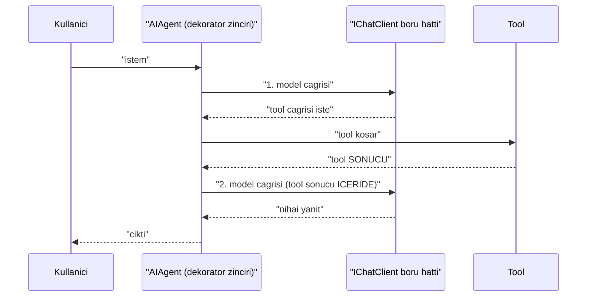
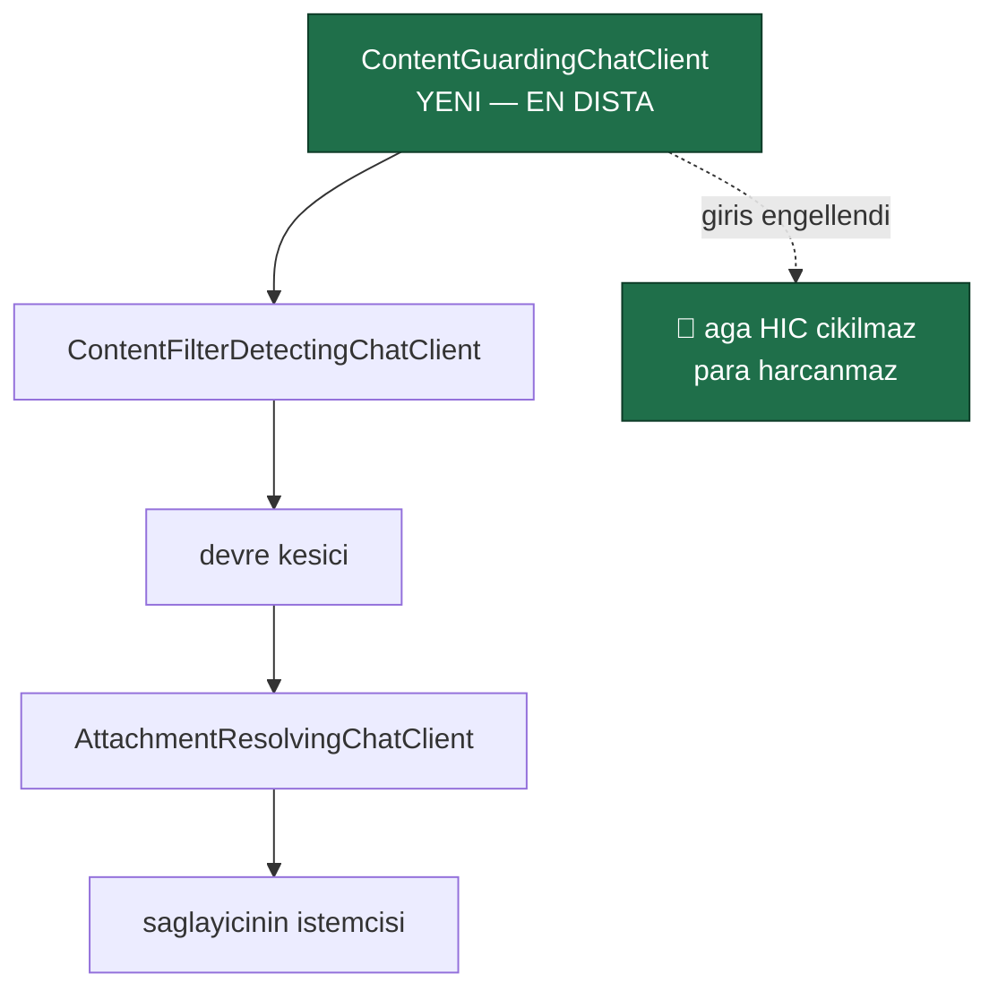
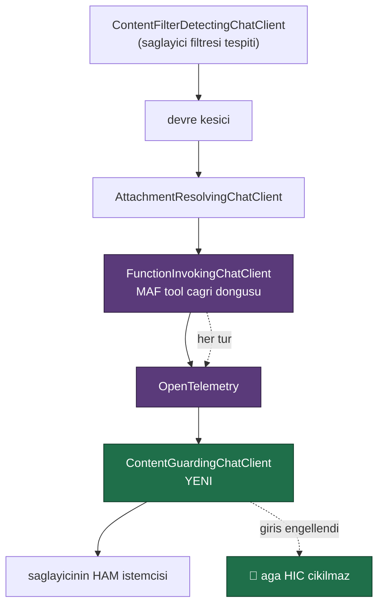

# Faz 48 — Guardrails ve İçerik Güvenliği Genişleme Noktası

> **Durum:** ✅ Tamamlandı (2026-08-07)
> **Kaynak:** [ADAYLAR.md](ADAYLAR.md) · **F-32**
> **Önkoşul:** Yok. Faz 8'in model boru hattı ve Faz 26'nın `ContentFilterDetectingChatClient`'ı **kullanılır**
> **Paketler:** `AgentPrism.Abstractions`, `.Core`, `.AspNetCore`
> **Yeni paket:** Yok — Azure adaptörü bilerek kapsam dışıdır ([48.6](#486--azure-ai-content-safety-bu-fazda-yok)) · **Migration:** Yok
> **Public API:** büyüyor — bir arayüz, üç kayıt tipi, iki enum, bir ayar, bir kararlı hata tipi. Faz 7'den önce ucuz

---

## Bu Faza Başlarken

> `faz-baslangic` skill'ini uygula. Aşağıdaki liste o skill'in 2. adımıdır —
> **tamamını değil, yalnız işaret edilen bölümleri oku.**

1. Bu doküman
2. Kararlar — dosyanın tamamını **okuma**, yalnız bu kalemleri grep'le:
   ```bash
   grep -n "K-018\|K-059\|K-089\|K-104\|K-158\|K-232" docs/KARARLAR.md
   ```
   **K-018** (bellek içi uygulama birinci sınıftır — yerleşik guard da öyledir),
   **K-089** ("denetime yazılamayan iş çalışmaz" — engelleme kararının
   kaydedilememesi de aynı sınıftır), **K-059** (`secret` veritabanına
   yazılmaz — engellenen içerik **saklanmaz**), **K-232** (sunucu yanıtları
   çevrilmez).
3. [`26-ANTHROPIC-VE-GEMINI.md`](26-ANTHROPIC-VE-GEMINI.md) — yalnız içerik
   filtresi bölümü ve devir notu:
   ```bash
   awk '/## Sonraki Faza Devir Notu/,0' docs/26-ANTHROPIC-VE-GEMINI.md
   ```
   `ContentFilterDetectingChatClient`'ın sarmalama sırası ve gerekçesi oradan
   devralınır; bu faz aynı boru hattına ikinci bir halka ekler.
4. Alan hafızası (bu faz üç alana dokunuyor):
   [`hafiza/openai-saglayici.md`](hafiza/openai-saglayici.md) (**ana kaynak** —
   `IChatClient` boru hattı, sarmalama sırası, devre kesici),
   [`hafiza/build-ve-analyzer.md`](hafiza/build-ve-analyzer.md)
   (🚨 AOT ve `[GeneratedRegex]` — `AgentPrism.Core` AOT uyumlu kalmalıdır),
   [`hafiza/cekirdek-calistirma.md`](hafiza/cekirdek-calistirma.md)
   (akışlı yol, `secret` filtresi)
5. Gerektiğinde, tamamı değil ilgili bölümü:
   [`MIMARI.md`](MIMARI.md) — güvenlik bölümü

---

## Amaç

AgentPrism bugün içeriği **denetlemiyor**. Modele giden istem hiç süzülmüyor;
modelden gelen yanıt yalnız sağlayıcının kendi filtresi kestiyse fark ediliyor.
Regüle bir sektörde bu, satın almanın önündeki kapıdır.

Bu faz bir **genişleme noktası** verir: `IContentGuard`. Yerleşik bir uygulama
da gelir, ama asıl ürün kancadır — tüketici kendi kural kümesini, kendi PII
maskeleyicisini veya bir bulut hizmetini aynı yere takar.

- **F-32** — giriş ve çıkış içerik denetimi, izin ver / engelle / maskele
  kararları, yerleşik desen tabanlı guard, denetim izine kayıt.

### Bugün ne çalışmıyor — doğrulanmış kanıt

| Kanıt | Gözlem |
|---|---|
| [`AuditSecretFilter.cs:24`](../src/AgentPrism.Core/Audit/AuditSecretFilter.cs) | Yalnız **denetim kaydını** temizler. Anahtar adına göre çalışır (`apikey`, `authorization`, `token`, `password`, `secret`) ve **modele giden isteme hiç dokunmaz** |
| [`ContentFilterDetectingChatClient.cs:31`](../src/AgentPrism.Core/Models/ContentFilterDetectingChatClient.cs) | Yalnız **sağlayıcının** filtresini *tespit eder*: `FinishReason == ContentFilter` **ve** yanıt boşsa istisna atar. Kendi filtresi yoktur |
| [`ModelProviderRegistry.cs:89-109`](../src/AgentPrism.Core/Models/ModelProviderRegistry.cs) | Boru hattı üç halkalıdır: `AttachmentResolvingChatClient` → devre kesici → `ContentFilterDetectingChatClient`. **İçerik denetimi halkası yok** |
| [`IAgentDecorator.cs:18`](../src/AgentPrism.Abstractions/Agents/IAgentDecorator.cs) | Dekoratör yuvası hazır: kayıt `0` → telemetri `10` → onay `20`. Küçük değer içe, büyük değer dışa sarılır |
| [`AgentPrismException.cs:41`](../src/AgentPrism.Abstractions/AgentPrismException.cs) | `ErrorType` **sanal üyedir** ve `ContentFilteredErrorType = "content_filtered"` kararlı bir değerdir. Taksonomi yuvası hazır |
| `grep -rn "GeneratedRegex" src/` | İki kullanım: [`McpToolNaming.cs:35`](../src/AgentPrism.Mcp/Internal/McpToolNaming.cs), [`HttpTenantContext.cs:122`](../src/AgentPrism.AspNetCore/Tenancy/HttpTenantContext.cs). **AOT uyumlu regex deseni repoda kurulu** |

> Kanıtlar 2026-08-06 tarihinde doğrulandı.

Aday listesinin iddiaları **doğrulandı**. Bir noktada daraltıldı: aday listesi
guard'ın "zincire bir `IAgentDecorator` olarak takıldığını" söylüyordu.
[48.1](#481--hangi-katman-iagentdecorator-değil-ichatclient) bunun neden yanlış
katman olduğunu ölçülmüş gerekçeyle anlatır.

---

## 48.1 — Hangi katman: `IAgentDecorator` değil, `IChatClient`

Bir `IAgentDecorator` agent'ın **girdisini ve çıktısını** görür. Görmediği şey
aradaki turlardır.



🚨 **Bir tool sonucu modele ikinci çağrıda girer.** `IAgentDecorator` o çağrıyı
**görmez** — yalnız ilk girdiyi ve son çıktıyı görür. Uzak bir MCP tool'u
zararlı içerik döndürürse (prompt injection'ın en yaygın yolu) dekoratör
katmanı bunu kaçırır.

`IChatClient` katmanı **her model çağrısını** görür ve tool sonuçları o
çağrıların mesajları içindedir. Bu yüzden guard boru hattına takılır.

| Katman | Görür | Seçildi mi |
|---|---|---|
| `IAgentDecorator` | İlk girdi, son çıktı | ❌ Ara turları kaçırır |
| `IChatClient` boru hattı | **Her** model çağrısının girdisi ve yanıtı — tool sonuçları dahil | ✅ |

Ek fayda: `ContentFilterDetectingChatClient`'ın gerekçesi birebir geçerlidir —
"OpenAI, Anthropic ve Gemini aynı davranışı **tek bir yerden** alır ve yeni bir
sağlayıcı kural yazmadan devralır".

## 48.2 — Boru hattındaki yer

Bugünkü sıra (dıştan içe):

```
ContentFilterDetectingChatClient
  → devre kesici
    → AttachmentResolvingChatClient
      → saglayicinin gercek istemcisi
```

Guard **en dışa** girer:



Üç gerekçe, üçü de mevcut koddaki gerekçelerin devamıdır:

| Gerekçe | Kaynak |
|---|---|
| 🚨 **Engellenen giriş ağa hiç çıkmaz.** Guard içeride olsaydı istek gönderilir, sonra atılırdı — para harcanmış olurdu | Ön uçuş denetiminin amacı |
| 🚨 **Engelleme devre kesiciyi tetiklememelidir.** İçerde olsaydı arka arkaya engellenen birkaç istek sağlayıcıyı kapatırdı | `ContentFilterDetectingChatClient`'ın kendi XML dokümanındaki gerekçenin aynısı |
| **Çıkış denetimi en son çalışmalıdır.** Yanıt tam olarak istemciye gideceği hâliyle görülmelidir | — |

## 48.3 — Üç karar: izin ver, engelle, maskele

```csharp
public enum ContentGuardAction { Allow = 0, Mask = 1, Block = 2 }
```

| Karar | Davranış | Çalıştırma |
|---|---|---|
| `Allow` | İçerik değişmeden geçer | Devam |
| `Mask` | 🚨 İçerik **değiştirilerek** geçer | Devam. Değişiklik `run_events`'e yazılır |
| `Block` | `AgentPrismContentBlockedException` | `Failed`; kararlı hata tipi `content_blocked` |

**`Mask` neden `Block`'tan önemli:** gerçek kurumsal ihtiyaç "TC kimlik numarası
modele gitmesin" biçimindedir, "TC kimlik numarası içeren her istek reddedilsin"
biçiminde değil. Yalnız engelleme sunan bir guard pratikte kapatılır.

🚨 **Maskeleme sessiz olamaz.** Modelin gördüğü metin kullanıcının yazdığından
farklıysa bu bir olay olarak kaydedilir (`RunEventType.ContentMasked`). K-089'un
kuralı burada da geçerlidir: **bir kararın kaydedilememesi, kararın
alınmamasıyla aynıdır.** Olay yazılamıyorsa maskeleme yine uygulanır ama hata
loglanır — gözlemlenebilirlik işlevselliği bozmaz.

### Akışlı yolda çıkış denetimi

🚨 **Akışta çıkış denetiminin doğal bir sınırı vardır.** Bir çerçeve istemciye
gönderildikten sonra geri alınamaz. İki seçenek:

| Seçenek | Sonuç |
|---|---|
| Çerçeve çerçeve denetle | Kısmi metin üzerinde desen eşleşmez — `4444-` görülür, kart numarası tamamlanmadan geçer |
| ✅ **Akışı tamponla, sonra denetle** | Akışın canlılığı kaybolur ama denetim doğru olur |

**Karar: çıkış guard'ı açıkken akışlı yanıt tamponlanır.** Ayar bunu açıkça
söyler (`BufferStreamingOutput`, varsayılan `true` — guard kapalıyken hiç
devreye girmez). Sessizce yarım denetim yapmak, denetim yapmamaktan kötüdür —
kullanıcı korunduğunu sanar.

Giriş denetimi akıştan etkilenmez: istem çağrıdan önce tamdır.

## 48.4 — Yerleşik guard: `PatternContentGuard`

Genişleme noktası tek başına yeterli değildir; K-018 "bellek içi uygulama
birinci sınıftır" der. Yerleşik uygulama üç desen ailesi taşır ve **hepsi
kapalı doğar**.

| Aile | Örnek | Varsayılan karar |
|---|---|---|
| Yasak sözcük listesi | tüketici doldurur | `Block` |
| PII desenleri | e-posta, IBAN, kredi kartı, TC kimlik numarası | `Mask` |
| `secret` desenleri | `sk-…`, `ghp_…`, `AKIA…` | `Mask` |

🚨 **Her desen `[GeneratedRegex]` ile yazılır.** `AgentPrism.Core` AOT
uyumludur; çalışma anında derlenen `Regex` bunu bozar. Repoda iki `[GeneratedRegex]`
kullanımı zaten var ve desen kuruludur.

🚨 **Her desen `matchTimeoutMilliseconds` taşır.** Mevcut iki kullanım 1000 ms
veriyor; ReDoS'a karşı tek savunma budur ve sıcak yolda zorunludur.

**Kredi kartı ve TC kimlik numarası deseni Luhn / kontrol basamağı denetimi
yapar.** Yalnız `\d{16}` eşleşmesi her sipariş numarasını maskeler ve guard
kullanılamaz hâle gelir.

### Tahsis — ölçülmeli, iddia edilmez

Guard sıcak yoldadır. **Tahsis etkisi bu fazda ölçülür ve buraya yazılır.**
Plan bir sayı iddia etmez. İki kural şimdiden bellidir:

1. **Hiç guard kayıtlı değilse maliyet sıfırdır.** `ContentGuardingChatClient`
   boru hattına **hiç eklenmez** — bir `if` bile çalışmaz.
2. Eşleşme yoksa yeni bir dize tahsis edilmez. `Regex.IsMatch` ile başlanır;
   `Replace` yalnız eşleşme varsa çağrılır.

Ölçüm aday listesinin 4. merceğinin (performans ve AOT) gereğidir ve DoD'dedir.

## 48.5 — Engellenen içerik saklanmaz

Bir `Block` kararı denetim izine yazılır. **Yazılan şey içerik değildir.**

| Yazılır | Yazılmaz |
|---|---|
| Hangi guard, hangi kural adı | 🚨 Engellenen metnin **kendisi** |
| Yön (giriş/çıkış), çalıştırma kimliği, kiracı | — |
| Eşleşme sayısı ve karakter aralığı | — |

Gerekçe: engellenen içerik tanımı gereği hassastır. Onu denetim iznine yazmak,
sorunu **kalıcı** hâle getirir. K-059'un ruhu budur ve `AuditSecretFilter`
zaten aynı yönde çalışıyor.

Maskelenen içerikte de aynı kural: olay maskenin **yapıldığını** yazar, ne
maskelendiğini değil.

## 48.6 — Azure AI Content Safety bu fazda yok

Aday listesi "Azure AI Content Safety adaptörü **ayrı paket**" diyordu. Ölçüldü
ve **ertelendi**.

| Ölçüm (2026-08-06) | Değer |
|---|---|
| `Azure.AI.ContentSafety` en son sürüm | **1.0.0** (GA) |
| Geçişli paket sayısı | **4** — `Azure.Core` 1.36.0, `Microsoft.Bcl.AsyncInterfaces` 1.1.1, `System.Memory.Data` 1.0.2 |

Ağırlık **sorun değil** (karşılaştırma: `Google.GenAI` 11, Foundry 37 — K-212).
Erteleme gerekçesi ağırlık değil, **doğrulanamazlıktır**:

🚨 Bir Azure Content Safety adaptörü gerçek bir Azure kaynağı olmadan sahte
istemciden öteye test edilemez. DoD'nin yarısı boş kalırdı. Bu, K-212'nin
Foundry için yazdığı üç gerekçeden ikincisinin birebir aynısıdır ve o karar
emsaldir.

Bu fazın ürünü **kancadır**. Kanca doğruysa Azure adaptörü otuz satırdır ve
`AgentPrism.ContentSafety` adıyla ayrı bir paket olarak, gerçek bir abonelikle
doğrulanabildiği gün yazılır. **Yeni bir aday kalemidir.**

---

## Planlanan Public API

> Taslak imzalardır. Gerçekleşen imzalar kapanışta ayrı bir bölüme yazılır.

```csharp
// AgentPrism.Abstractions/Guards/IContentGuard.cs (YENI)

/// <summary>
/// Modele giden ve modelden gelen icerigi denetleyen genisleme noktasi.
/// </summary>
/// <remarks>
/// <para>
/// Kayit <c>TryAddEnumerable</c> ile yapilir; birden cok guard sirayla calisir
/// ve <strong>en sert karar kazanir</strong> (Block &gt; Mask &gt; Allow).
/// </para>
/// <para>
/// 🚨 Guard <see cref="ModelProviderRegistry.CreateChatClient"/> boru hattinin
/// EN DISINDA calisir: engellenen bir istek aga hic cikmaz ve engelleme devre
/// kesiciyi tetiklemez.
/// </para>
/// <para>
/// Hicbir guard kayitli degilse sarmalayici boru hattina EKLENMEZ; maliyet
/// tam olarak sifirdir.
/// </para>
/// </remarks>
public interface IContentGuard
{
    /// <summary>Guard'in adi. Denetim izine ve olaya bu ad yazilir.</summary>
    string Name { get; }

    /// <summary>Icerigi denetler.</summary>
    ValueTask<ContentGuardResult> InspectAsync(
        ContentGuardContext context,
        CancellationToken cancellationToken = default);
}

/// <summary>Denetimin yonu.</summary>
public enum ContentGuardDirection
{
    /// <summary>Modele giden icerik.</summary>
    Input = 0,

    /// <summary>Modelden gelen icerik.</summary>
    Output = 1,
}

/// <summary>Guard'in verebilecegi karar.</summary>
public enum ContentGuardAction
{
    Allow = 0,
    Mask = 1,
    Block = 2,
}

/// <summary>Denetim baglami.</summary>
public sealed record ContentGuardContext
{
    public required ContentGuardDirection Direction { get; init; }

    /// <summary>Denetlenecek metin.</summary>
    public required string Text { get; init; }

    /// <summary>Calistirma kimligi. Kapsam disindan cagrilirsa <see langword="null"/>.</summary>
    public Guid? RunId { get; init; }

    public string? TenantId { get; init; }
    public string? AgentName { get; init; }
    public string? ModelId { get; init; }
}

/// <summary>Denetim sonucu.</summary>
public sealed record ContentGuardResult
{
    /// <summary>Icerik degismeden gecer.</summary>
    public static ContentGuardResult Allow { get; } = new() { Action = ContentGuardAction.Allow };

    /// <summary>Icerik degistirilerek gecer.</summary>
    public static ContentGuardResult Mask(string maskedText, string ruleName) => new()
    {
        Action = ContentGuardAction.Mask,
        MaskedText = maskedText,
        RuleName = ruleName,
    };

    /// <summary>Icerik engellenir; calistirma <c>Failed</c> olur.</summary>
    public static ContentGuardResult Block(string ruleName, string reason) => new()
    {
        Action = ContentGuardAction.Block,
        RuleName = ruleName,
        Reason = reason,
    };

    public required ContentGuardAction Action { get; init; }

    /// <summary>Yalnizca <see cref="ContentGuardAction.Mask"/> icin dolar.</summary>
    public string? MaskedText { get; init; }

    /// <summary>Eslesen kuralin adi. 🚨 Eslesen ICERIGI tasimaz.</summary>
    public string? RuleName { get; init; }

    /// <summary>Engelleme sebebi. 🚨 Engellenen metni tasimaz.</summary>
    public string? Reason { get; init; }
}
```

```csharp
// AgentPrism.Abstractions/AgentPrismException.cs — YENI istisna

/// <summary>Icerik bir guard tarafindan engellendi.</summary>
public sealed class AgentPrismContentBlockedException : AgentPrismException
{
    /// <summary><see cref="AgentPrismException.ErrorType"/> icin kararli deger.</summary>
    public const string ContentBlockedErrorType = "content_blocked";

    /// <inheritdoc />
    public override string ErrorType => ContentBlockedErrorType;

    /// <summary>Karari veren guard'in adi.</summary>
    public required string GuardName { get; init; }

    /// <summary>Eslesen kuralin adi.</summary>
    public string? RuleName { get; init; }

    /// <summary>Denetimin yonu.</summary>
    public required ContentGuardDirection Direction { get; init; }
}
```

```csharp
// AgentPrism.Core — yerlesik guard ayarlari
public sealed class PatternContentGuardOptions
{
    /// <summary>Guard acik mi. 🚨 Varsayilan KAPALI (K1).</summary>
    public bool Enabled { get; set; }

    /// <summary>Girisi denetle.</summary>
    public bool InspectInput { get; set; } = true;

    /// <summary>Cikisi denetle.</summary>
    public bool InspectOutput { get; set; } = true;

    /// <summary>
    /// 🚨 Cikis denetimi acikken akisli yanit tamponlanir. Kismi bir cerceve
    /// uzerinde desen eslesmez; tamponlamadan denetim yarim kalir.
    /// </summary>
    public bool BufferStreamingOutput { get; set; } = true;

    /// <summary>Yasak sozcukler. Eslesme <c>Block</c> uretir.</summary>
    public IList<string> DeniedTerms { get; } = [];

    /// <summary>Acilacak yerlesik PII desenleri.</summary>
    public PiiPatterns MaskedPii { get; set; } = PiiPatterns.None;
}

/// <summary>Yerlesik PII desen aileleri.</summary>
[Flags]
public enum PiiPatterns
{
    None = 0,
    Email = 1,
    Iban = 2,
    CreditCard = 4,          // Luhn dogrulamasi yapar
    TurkishNationalId = 8,   // kontrol basamagi dogrulamasi yapar
    ProviderApiKey = 16,     // sk-… ghp_… AKIA…
}
```

```csharp
// AgentPrism.Abstractions/Runs/RunEventType.cs — SONA iki uye
public enum RunEventType
{
    // ... mevcut uyeler (0–19) degismez
    /// <summary>Bir guard icerigi maskeledi. Yuk kural adini tasir, ICERIGI tasimaz.</summary>
    ContentMasked = 20,

    /// <summary>Bir guard icerigi engelledi. Yuk kural adini tasir, ICERIGI tasimaz.</summary>
    ContentBlocked = 21,
}
```

🚨 **`RunEventType` değerleri veritabanında `smallint` olarak saklanır.**
Değerler **sona** eklenir; mevcut değerlerin kayması eski satırları yanlış okur.
`RunStatus.AwaitingInput` aynı gerekçeyle sona eklenmişti.

### Kayıt

```csharp
// K4: tuketicinin kaydi kazanir
services.TryAddEnumerable(ServiceDescriptor.Singleton<IContentGuard, PatternContentGuard>());
```

Guard **listesi boşsa** `ContentGuardingChatClient` boru hattına hiç eklenmez.

### HTTP `endpoint`'leri

Yeni uç **yok**. Engelleme çalıştırma hatası olarak görünür: `runs.error_type`
`content_blocked` olur ve `GET /api/runs/{runId}` bunu döndürür.

`POST /api/agents/{name}/run` bir girişte engellenirse `422 Unprocessable
Content` döner — `500` **değil**. İstemci hatasıdır ve yeniden denemek işe
yaramaz. `ProblemDetails` guard adını ve kural adını taşır, **engellenen metni
taşımaz**.

### Arayüz payı

Çalıştırma ayrıntı ekranı iki yeni olay tipini göstermelidir (`ContentMasked`,
`ContentBlocked`) ve `content_blocked` hata tipini anlamlı bir metinle
karşılamalıdır.

Bugünkü kullanım (2026-08-06): **151,3 KB gzip / 250 KB**, kalan pay
**98,7 KB**. Bu fazın payı **tahminî 1 KB gzip altındadır**; gerçek değer
uygulama anında `postbuild.mjs` çıktısından okunur ve buraya yazılır.

Sözlük anahtarları `en.ts` **ve** `tr.ts` (K-228). Sunucunun `422` mesajı
çevrilmez (K-232).

---

## Planlanan Dosya Listesi

```
src/AgentPrism.Abstractions/Guards/
├── IContentGuard.cs                    (YENI)
├── ContentGuardContext.cs              (YENI)
├── ContentGuardResult.cs               (YENI — Action, Direction dahil)

src/AgentPrism.Abstractions/
├── AgentPrismException.cs              (AgentPrismContentBlockedException)
└── Runs/RunEventType.cs                (SONA iki uye)

src/AgentPrism.Core/Guards/
├── ContentGuardingChatClient.cs        (YENI — DelegatingChatClient)
├── PatternContentGuard.cs              (YENI — [GeneratedRegex])
├── PatternContentGuardOptions.cs       (YENI)
├── PiiPatterns.cs                      (YENI)
└── LuhnValidator.cs                    (YENI — kart + TC kimlik dogrulamasi)

src/AgentPrism.Core/Models/
└── ModelProviderRegistry.cs            (boru hattina EN DISTAKI halka)

src/AgentPrism.Core/
└── AgentPrismServiceCollectionExtensions.cs   (TryAddEnumerable kaydi)

src/AgentPrism.AspNetCore/
└── Endpoints/AgentEndpoints.cs         (content_blocked -> 422)

src/AgentPrism.UI/frontend/src/
├── screens/run-detail.tsx              (iki olay tipi)
└── locales/{en,tr}.ts
```

**Migration yok.** `RunEventType`'a değer eklemek şema değiştirmez; sütun zaten
`smallint`.

---

## Testler

| Test sınıfı | Neyi doğrular |
|---|---|
| `ContentGuardPipelinePositionTests` | 🚨 Guard **en dışta**: engellenen giriş sağlayıcıya **hiç ulaşmaz** (sahte istemci çağrı sayacı `0`) |
| `ContentGuardCircuitBreakerTests` | 🚨 Arka arkaya on engelleme devre kesiciyi **açmaz** |
| `ContentGuardZeroCostTests` | 🚨 Hiç guard kayıtlı değilken `ContentGuardingChatClient` boru hattında **yoktur** |
| `ContentGuardInputBlockTests` | Giriş engellemesi `AgentPrismContentBlockedException`; `runs.error_type` `content_blocked` |
| `ContentGuardOutputBlockTests` | Çıkış engellemesi aynı davranışı verir |
| `ContentGuardMaskTests` | Maskelenen metin modele **maskelenmiş** gider; olay yazılır |
| `ContentGuardToolResultTests` | 🚨 Bir **tool sonucu** zararlı içerik taşırsa ikinci model çağrısında yakalanır. `IAgentDecorator` katmanının kaçıracağı vaka |
| `ContentGuardStreamingBufferTests` | 🚨 Çıkış guard'ı açıkken akış tamponlanır; kısmi çerçeve üzerinden desen kaçmaz |
| `ContentGuardStreamingDisabledTests` | Çıkış guard'ı kapalıyken akış **tamponlanmaz**; canlılık korunur |
| `ContentGuardSeverityTests` | İki guard: biri `Mask`, biri `Block` → **`Block` kazanır** |
| `ContentGuardAuditTests` | 🚨 Denetim izine kural adı yazılır, **engellenen metin yazılmaz** |
| `ContentGuardEventPayloadTests` | 🚨 `ContentMasked`/`ContentBlocked` olay yükü **içerik taşımaz** |
| `PatternGuardLuhnTests` | Geçersiz kontrol basamaklı 16 haneli sayı **maskelenmez** (sipariş numarası vakası) |
| `PatternGuardTurkishIdTests` | Geçerli TC kimlik numarası maskelenir; rastgele 11 hane maskelenmez |
| `PatternGuardRegexTimeoutTests` | Patolojik girdi `matchTimeout` ile durur; çalıştırmayı kilitlemez |
| `PatternGuardDisabledTests` | `Enabled = false` varsayılanıyla hiçbir şey denetlenmez |
| `ContentGuardAotTests` | 🚨 `AgentPrism.Core` AOT uyarısı üretmez; hiçbir desen çalışma anında derlenmez |
| `ContentGuardTenantTests` | Guard bağlamı kiracıyı taşır; kiracı bazlı kural yazılabilir |
| `ContentGuardEndpointTests` | Girişte engelleme `422` döner, `500` değil; `ProblemDetails` metni taşımaz |

**Tahsis ölçümü** ayrı bir işidir ve DoD'dedir: guard açık ve kapalıyken bir
çalıştırmanın tahsisi karşılaştırılır ve sonuç bu belgeye yazılır.

---

## Açık Sorular

> Planı bloklamayan, faz uygulanırken karara bağlanacak sorular.

| # | Soru | Seçenekler | Öneri |
|---|---|---|---|
| 1 | Yerleşik guard varsayılan açık mı? | A: **kapalı** · B: açık | **A.** K1'in düz uygulaması. Faz 43 ve Faz 46 K1'i "açık" yorumlamıştı ama oradaki gerekçe "başlık göndermeyen istemci için maliyet sıfır"dı. Burada guard **her istekte** çalışır ve **davranışı değiştirir** — maskelenmiş bir istem sürprizdir. Bu faz K1'i düz uygular ve iki yorum arasındaki fark kayda geçmelidir |
| 2 | Birden çok guard'ta hangi karar kazanır? | A: **en sert** · B: ilk karar | **A.** Güvenlik kararlarında en sert karar kazanır; "ilk karar" kayıt sırasına bağlı olurdu ve `TryAddEnumerable` sırası garanti edilmez |
| 3 | Guard istisna atarsa ne olur? | A: **çalıştırma başarısız** · B: guard atlanır | **A.** K-089'un kuralı: denetlenemeyen içerik geçirilmez. "Gözlemlenebilirlik işlevselliği bozmaz" kuralı burada geçerli **değildir** — guard bir gözlem aracı değil, bir kontroldür |
| 4 | Denetlenen metin nasıl toplanır? | A: **mesaj başına ayrı** · B: hepsi birleştirilip tek metin | **A.** Birleştirme sahte eşleşme üretir (iki mesajın sınırında oluşan desen). Ama **tahsis maliyeti ölçülmelidir**; ölçüm B'yi haklı çıkarırsa karar değişir |
| 5 | Sistem talimatı da denetlensin mi? | A: **hayır** · B: evet | **A.** Sistem talimatı kodda veya yönetim API'sinde yazılır ve denetim izine zaten girer; her istekte yeniden denetlemek sabit bir maliyettir ve hiçbir şey yakalamaz |
| 6 | `Mask` kararında kullanıcıya bilgi verilir mi? | A: **hayır, yalnız olay** · B: yanıtta uyarı | **A.** Maskeleme bir kontrol düzlemi kararıdır; son kullanıcıya "isteğiniz değiştirildi" demek yeni bir sözleşme açar. Operatör olayı çalıştırma ayrıntısında görür |
| 7 | Azure adaptörü bu fazda mı? | A: **hayır** · B: evet | **A.** [48.6](#486--azure-ai-content-safety-bu-fazda-yok). Gerekçe ağırlık değil, doğrulanamazlık — K-212'nin emsali |

---

## Bitiş Ölçütleri (DoD)

- [ ] 🚨 Hiç guard kayıtlı değilken `ContentGuardingChatClient` boru hattında
      **yoktur**; tahsis farkı **sıfırdır** ve bu ölçülüp buraya yazılmıştır
- [ ] 🚨 Engellenen bir giriş sağlayıcıya **hiç ulaşmaz** (sahte istemci çağrı
      sayacı `0`)
- [ ] 🚨 Arka arkaya on engelleme devre kesiciyi **açmaz**
- [ ] 🚨 Bir **tool sonucundaki** zararlı içerik ikinci model çağrısında yakalanır
- [ ] Maskelenen metin modele maskelenmiş gider; `ContentMasked` olayı yazılır
- [ ] 🚨 Denetim izi ve olay yükü **engellenen metni taşımaz** — yalnız kural adı
- [ ] Çıkış guard'ı açıkken akış tamponlanır; kapalıyken tamponlanmaz
- [ ] İki guard'tan `Block` olan kazanır
- [ ] Girişte engelleme `422` döner (`500` değil); `runs.error_type` `content_blocked`
- [ ] Geçersiz Luhn kontrollü 16 haneli sayı **maskelenmez**
- [ ] Patolojik girdi `matchTimeout` ile durur
- [ ] 🚨 `AgentPrism.Core` AOT uyarısı üretmez; her desen `[GeneratedRegex]`
- [ ] **Tahsis ölçümü yapıldı ve sonucu buraya yazıldı** (guard açık vs kapalı)
- [ ] Dört doğrulama kapısı sıfır uyarı verir
- [ ] `samples/AgentPrism.Api` ile gerçek `run` yapıldı, çıktı bu belgeye yazıldı
- [ ] `secret` taraması boş döndü
- [ ] `en.ts` ve `tr.ts` eksiksiz; bundle payı ölçüldü ve buraya yazıldı

### Doğrulama komutları

```bash
# 1) Guard KAPALI (varsayilan) — davranis degismemeli
curl -s -X POST http://localhost:5081/agentprism/api/agents/asistan/run \
  -H "content-type: application/json" \
  -d '{"message":"kart numaram 4539578763621486"}' | jq '.text'

# --- ornek uygulamada guard acilir ---
#   MaskedPii = CreditCard | Email, DeniedTerms = ["gizli-proje"]

# 2) Maskeleme — modele giden metin maskelenmis olmali
RUN=$(curl -s -X POST http://localhost:5081/agentprism/api/agents/asistan/run \
  -H "content-type: application/json" \
  -d '{"message":"kart numaram 4539578763621486, tekrar eder misin"}' | jq -r '.runId')
curl -s "http://localhost:5081/agentprism/api/runs/$RUN/events" \
  | grep -i "ContentMasked"

# 3) 🚨 Olay yuku ICERIK tasimamali — kart numarasi GORULMEMELI
curl -s "http://localhost:5081/agentprism/api/runs/$RUN/events" | grep -c "4539578763621486"
#    beklenen cikti: 0

# 4) Engelleme -> 422, ProblemDetails metni tasimamali
curl -s -i -X POST http://localhost:5081/agentprism/api/agents/asistan/run \
  -H "content-type: application/json" \
  -d '{"message":"gizli-proje hakkinda bilgi ver"}' | head -20

# 5) Hata tipi kararli mi
curl -s "http://localhost:5081/agentprism/api/runs?errorType=content_blocked" | jq 'length'

# 6) 🚨 Engelleme devre kesiciyi acmamali
for i in $(seq 1 10); do
  curl -s -o /dev/null -X POST http://localhost:5081/agentprism/api/agents/asistan/run \
    -H "content-type: application/json" -d '{"message":"gizli-proje"}'
done
curl -s http://localhost:5081/agentprism/api/models/health | jq '.[] | {provider, state}'
#    state "Closed" kalmali

# 7) Luhn — gecersiz kontrol basamakli sayi maskelenmemeli
curl -s -X POST http://localhost:5081/agentprism/api/agents/asistan/run \
  -H "content-type: application/json" \
  -d '{"message":"siparis numaram 1234567812345678"}' | jq '.text'

# 8) 🚨 Denetim izinde icerik yok
curl -s "http://localhost:5081/agentprism/api/audit?action=content.blocked" \
  | grep -c "gizli-proje"
#    beklenen cikti: 0
```

---

## Riskler

| Risk | Önlem |
|------|-------|
| 🚨 Guard sıcak yolda tahsis üretir | Guard yoksa sarmalayıcı **hiç eklenmez**; `IsMatch` önce, `Replace` sonra. Tahsis **ölçülür** ve DoD'dedir |
| 🚨 Çalışma anında derlenen `Regex` AOT duruşunu bozar | Her desen `[GeneratedRegex]`; `ContentGuardAotTests` bunu doğrular. Repoda iki kullanım precedent'tir |
| ReDoS ile çalıştırma kilitlenir | Her desende `matchTimeoutMilliseconds`; ayrı bir test patolojik girdiyi koşar |
| 🚨 Engelleme devre kesiciyi açar ve sağlayıcı kapanır | Guard devre kesicinin **dışındadır**; on engellemeli test bunu doğrular |
| 🚨 Engellenen içerik denetim izine yazılır ve sorun kalıcılaşır | Yalnız kural adı yazılır. İki ayrı test (`grep -c` = 0) doğrular |
| Akışta çıkış denetimi kısmi çerçevede kaçar | Çıkış guard'ı açıkken akış tamponlanır; sessiz yarım denetim reddedildi |
| Yerleşik desenler yanlış pozitif üretir ve guard kapatılır | Kart ve TC kimlik desenleri kontrol basamağı doğrular; her aile ayrı ayrı açılır |
| Guard `IAgentDecorator` katmanına konursa tool sonuçları denetlenmez | Katman kararı [48.1](#481--hangi-katman-iagentdecorator-değil-ichatclient)'de gerekçelendirildi; `ContentGuardToolResultTests` doğrular |
| Guard istisnası çalıştırmayı sessizce geçirir | Guard istisnası çalıştırmayı **başarısız** yapar (Açık Soru 3) |

---

<!-- ============================================================
     AŞAĞISI KAPANIŞTA DOLDURULUR — `faz-tamamlama` skill'i.
     Plan anında boş kalır. Başlıkları SİLME.
     ============================================================ -->

## Plandan Sapmalar

> Plan ile gerçek arasındaki fark **gizlenmez** — sonraki oturumun en değerli
> bilgisidir.

### S1 — 🚨 Guard'ın katmanı ölçüldü ve plan YANLIŞ çıktı

[48.1](#481--hangi-katman-iagentdecorator-değil-ichatclient) doğru katmanı
(`IChatClient`) seçiyordu, ama [48.2](#482--boru-hattındaki-yer) o katmandaki
**yeri** yanlış gösteriyordu. Ölçüm:

| Kanıt | Ölçüm (2026-08-07) |
|---|---|
| `grep -rn "UseFunctionInvocation" src/` | Dört sağlayıcı fabrikası bunu **kendi içinde** kuruyordu: [OpenAI:78](../src/AgentPrism.OpenAI/OpenAIChatClientFactory.cs), Anthropic:129, Google:122, Azure:112 — artı `AgentPrism.Testing/FakeModelProvider:221` |
| Sonuç | `ModelProviderRegistry`'nin sardığı **her halka** tool çağrı döngüsünün DIŞINDA kalıyordu |

Planın "en dışta" dediği yer bir agent turu başına **tek** model çağrısı görür.
Tool sonucu modele **ikinci** çağrıda girer ve o çağrı döngünün içindedir. Yani
planın kendi motivasyon örneği (uzak bir MCP tool'unun döndürdüğü zararlı içerik)
o konumda **yakalanamazdı** ve `ContentGuardToolResultTests` yazılamazdı.

**👤 Kullanıcı kararı: boru hattı defterin içine taşındı.** `IModelProvider`
artık **ham** istemci döndürür; boru hattının tamamını
`ModelProviderRegistry.CreateChatClient` kurar. Bugünkü sıra (dıştan içe):



Kazanılan üç şey:

1. Guard **her gerçek model çağrısını** görür — tool sonuçları dahil. 48.1'in
   gerekçesi artık gerçekten geçerlidir.
2. Engellenen istek ağa **hiç çıkmaz**: guard ham istemcinin hemen üstündedir.
3. Üçüncü taraf bir `IModelProvider` bütün halkaları **bedava** devralır. Eski
   düzende kendi boru hattını kuran bir sağlayıcı guard'ı **sessizce** almazdı —
   bir güvenlik kontrolü için kabul edilemez bir arıza biçimi.

Ödenen bedel: `IModelProvider.CreateChatClient` sözleşmesi değişti (dört sağlayıcı
paketi + `FakeModelProvider`), ve dört sağlayıcı testinin boru hattı iddiası
defter düzeyine taşındı (`ModelProviderRegistryTests.Boru_hatti_tool_dongusunu_ve_telemetriyi_defter_kurar`).

**Bilerek taşınmayan iki halka:** devre kesici ve ek çözme döngünün **dışında**
kaldı. Devre kesici içeri alınsaydı sayım granülerliği agent turundan gerçek ağ
çağrısına kayardı (eşik anlamı değişir); ek çözme içeri alınsaydı beş turlu bir
tool döngüsü aynı eki beş kez okurdu.

### S2 — 🚨 Devre kesici engelleme kararını ayıklamak zorunda kaldı

Guard artık döngünün içinde, devre kesici ise dışında. Bir engelleme
`CircuitBreakingChatClient`'ın `catch (Exception)` bloğuna ulaşıyordu ve
**ardışık hata sayılıyordu** — planın "engelleme devre kesiciyi tetiklemez"
gereksinimi düşerdi. Çözüm bir `catch (AgentPrismContentBlockedException)`
ayıklamasıdır; gerekçe `ContentFilterDetectingChatClient`'ı devre kesicinin
dışında tutan gerekçenin aynısıdır: bir politika kararı sağlayıcı arızası
değildir.

### S3 — 🚨 K1'in kapısı bir bayrak değil, KAYDIN kendisi

Plan iki şeyi birlikte istiyordu: (a) `PatternContentGuard` `TryAddEnumerable`
ile **her zaman** kaydedilsin, (b) hiç guard kayıtlı değilken maliyet **tam
sıfır** olsun. Yerleşik guard her zaman kayıtlıysa `IEnumerable<IContentGuard>`
asla boş olmaz ve (b) **ölçülemez**.

**👤 Kullanıcı kararı: kayıt opt-in oldu.** `AddAgentPrism()` hiçbir guard
kaydetmez. `PatternContentGuardOptions.Enabled` bayrağı **hiç yazılmadı**:
kaydın kendisi kapıdır. İki açma yolu vardır ve ikisi de açık tercihtir —
`builder.AddPatternContentGuard(...)` veya `AgentPrism:ContentGuard:Pattern`
bölümünü doldurmak.

Guard'ı kayıtlı bırakıp etkisizleştirmek gerekirse `DeniedTerms` boşaltılır ve
`MaskedPii = None` yapılır; guard ilk satırda `Allow` döner.

### S4 — `422` yalnızca AKIŞSIZ dalda mümkündür

Plan "girişte engelleme `422` döner" diyordu. Ölçüm: `/api/agents/{name}/run`
varsayılan olarak SSE'dir ve `SseWriter.StartAsync` çalıştırma **başlamadan**
başlıkları gönderir. Guard model boru hattında olduğu için karar durum kodu
yazıldıktan **sonra** oluşur; akışlı yolda `422` fiziksel olarak imkânsızdır.

**👤 Kullanıcı kararı: sadece akışsız dalda `422`.** Akışsız dal `Idempotency-Key`
başlığıyla seçilir (Faz 43). Akışlı dalda engelleme SSE `error` olayı olarak
görünür; `runs.error_type` her iki dalda da `content_blocked` olur. Ölçülen
çıktılar aşağıdaki DoD tablosundadır.

Reddedilen iki alternatif: (a) uç önünde ikinci bir ön-uçuş denetimi — ilk
kullanıcı mesajını iki kez denetlerdi; (b) SSE'yi ilk çerçeveye kadar geciktirmek
— `runId` taşıyan `run` olayının sözleşmesini değiştirirdi.

### S5 — `RunErrorClass`'a yeni bir üye eklendi (plan öngörmemişti)

Plan `content_blocked` için yalnız bir istisna tipi öngörüyordu. Faz 44'ün
taksonomisine bakıldığında `ContentFiltered = 5`'in XML dokümanı **"model yanıtı
sağlayıcının filtresiyle kesildi"** diyor. Bir guard kararını aynı kovaya yazmak,
operatörün "model reddetti" ile "bizim politikamız reddetti" ayrımını kaybetmesine
yol açardı — karşılık gelen eylem de farklıdır (biri sağlayıcı ayarını gevşetmek,
diğeri politikayı gözden geçirmek). `RunErrorClass.ContentBlocked = 11` **sona**
eklendi ve `DefaultRunErrorClassifier.StableIdentities`'e bağlandı. Eklenmeseydi
her engelleme `Unknown` kovasına düşerdi — Faz 44'ün panosunda sessiz bir gerileme.

### S6 — İki gerçek kusur testlerle bulundu

| Kusur | Nasıl bulundu | Düzeltme |
|---|---|---|
| 🚨 Sarmalayıcı **iç istemcinin nesnelerini yerinde değiştiriyordu** (`ChatResponseUpdate.Contents`, `ChatMessage.Contents`) | `ContentGuardStreamingTests` iki testte paylaşılan statik bir çerçeve listesi kullandı; maskeleme testi listeyi kalıcı olarak bozdu ve engelleme testi bir sonraki koşumda düştü | Artık her şey `Clone()` ile kopyalanır: sahibi olmadığımız nesne değiştirilmez. Önbellekleyen bir `IChatClient` aynı örneği yeniden verebilir; yerinde değiştirme o örneği kalıcı olarak bozardı |
| TC kimlik kontrol basamağı **onuncu basamağı da toplamlara katıyordu** | `PatternGuardTurkishIdTests` — geçerli bir numara maskelenmedi | Yalnız ilk **dokuz** basamak tek/çift toplamlarına girer; onuncu basamak kendi formülünün girdisi olamaz ([`CheckDigits.cs`](../src/AgentPrism.Core/Guards/CheckDigits.cs)) |

### S7 — Küçük sapmalar

- **`LuhnValidator.cs` → `CheckDigits.cs`.** Dosya iki algoritma taşır (Luhn ve
  TC kimlik); `LuhnValidator` adı içindeki TC denetimini yanlış tanıtırdı.
- **`ContentGuardResult` eşleşme sayısı ve karakter aralığı TAŞIMAZ.**
  [48.5](#485--engellenen-icerik-saklanmaz) denetim izine "eşleşme sayısı ve
  karakter aralığı" yazılmasını öneriyordu. Karakter aralığı içeriğin uzunluğunu
  ve konumunu sızdırır; planın kendi API taslağı da bu alanları taşımıyordu.
  Yazılan alanlar: guard adı, kural adı, yön, karar, çalıştırma kimliği, kiracı.
- **`PatternContentGuardOptions.MaskReplacement` eklendi** (planda yoktu). Maske
  metnini sabitlemek, `[redacted]` dizesini bekleyen bir tüketiciyi kilitlerdi.
- **`AgentPrismContentGuardOptions` ayrı bir sınıf oldu.** Plan
  `InspectInput`/`InspectOutput`/`BufferStreamingOutput`'u
  `PatternContentGuardOptions` içine koyuyordu; bunlar **boru hattı** ayarlarıdır
  ve yerleşik guard'a değil sarmalayıcıya aittir. Özel bir guard yazan tüketici de
  onlara tabidir.
- **`AgentPrismContentBlockedException.GuardName`/`Direction` `required` DEĞİL.**
  Kardeş istisnalarla (`AgentPrismContentFilteredException.ProviderName`) aynı
  desen korundu; `required` üye, `CA1032`'nin istediği üç kurucunun hepsini
  çağrılamaz hâle getirirdi.

---

## Bu Fazda Verilen Kararlar

Numaralar `docs/KARARLAR.md`'ye yazıldı: **K-320 … K-326**.

| # | Karar | Özet |
|---|---|---|
| K-320 | Model boru hattının tamamını `ModelProviderRegistry` kurar | `IModelProvider` ham istemci döndürür. Ölçüldü: `UseFunctionInvocation()` dört sağlayıcı paketinin içindeydi ve defterin sardığı hiçbir halka tool turlarını göremiyordu |
| K-321 | Guard `IChatClient` katmanındadır ve tool döngüsünün **içindedir** | Bir tool sonucu modele ikinci çağrıda girer; `IAgentDecorator` ve döngü dışı bir halka onu görmez |
| K-322 | Devre kesici içerik engellemesini hata **saymaz** | Engelleme sağlayıcı arızası değildir; istek ağa hiç çıkmadı. `ContentFilterDetectingChatClient`'ın gerekçesinin aynısı |
| K-323 | 👤 K1'in kapısı **kayıttır**, bir `Enabled` bayrağı değil | `AddAgentPrism()` hiç guard kaydetmez → sarmalayıcı eklenmez → ölçülen maliyet farkı sıfır (736 B temel). Faz 43/46'nın "açık" yorumundan farkı: orada başlığı göndermeyen istemcinin maliyeti sıfırdı; burada guard **her istekte** çalışır ve davranışı değiştirir |
| K-324 | 👤 `422` yalnızca akışsız dalda döner | SSE başlıkları çalıştırma başlamadan gönderilir; akışlı yolda durum kodu değiştirilemez |
| K-325 | Engellenen içerik hiçbir yere yazılmaz | Denetim izi ve olay yükü yalnız guard/kural/yön taşır. K-059'un ruhu; iki ayrı test `grep -c` = 0 doğrular |
| K-326 | `RunErrorClass.ContentBlocked` `ContentFiltered`'dan ayrıdır | "Model reddetti" ile "bizim politikamız reddetti" farklı sebepler ve farklı eylemlerdir |

### Ölçülen tahsis farkı

`GC.GetAllocatedBytesForCurrentThread()`, 2 000 çağrı, iki geçiş (ilk geçiş
paylaşılan JIT maliyetini taşır ve atılır), tekrarlanabilir:

| Yapılandırma | Tahsis | Fark |
|---|---|---|
| **Guard kayıtlı DEĞİL (varsayılan)** | **736 B/çağrı** | temel |
| Guard kayıtlı, hiç kural yok | 952 B/çağrı | +216 B |
| Kural var, eşleşme yok | 1 736 B/çağrı | +1 000 B |
| Eşleşme var (maskeleme) | 2 976 B/çağrı | +2 240 B |

🚨 **Varsayılan satır planın iddiasını doğrular:** guard kayıtlı değilken
sarmalayıcı boru hattına **hiç eklenmez** ve temel değer bu fazdan önceki
değerdir. "Kural var, eşleşme yok" satırındaki +1 000 B planın "eşleşme yoksa
yeni dize tahsis edilmez" ideali kadar ucuz değildir: her denetimde bir
`ContentGuardContext` (giriş + çıkış = iki tane) ve her desen için bir `Regex`
çalıştırıcısı kiralanır. Dize tahsisi gerçekten yoktur; tahsis eden şey
denetimin kendi kurulumudur.

---

## Gerçekleşen Public API

```csharp
// AgentPrism.Abstractions/Guards/IContentGuard.cs
public interface IContentGuard
{
    string Name { get; }

    ValueTask<ContentGuardResult> InspectAsync(
        ContentGuardContext context,
        CancellationToken cancellationToken = default);
}

// AgentPrism.Abstractions/Guards/ContentGuardContext.cs
public enum ContentGuardDirection { Input = 0, Output = 1 }

public sealed record ContentGuardContext
{
    public required ContentGuardDirection Direction { get; init; }
    public required string Text { get; init; }
    public Guid? RunId { get; init; }
    public string? TenantId { get; init; }
    public string? AgentName { get; init; }
    public string? ModelId { get; init; }
}

// AgentPrism.Abstractions/Guards/ContentGuardResult.cs
public enum ContentGuardAction { Allow = 0, Mask = 1, Block = 2 }

public sealed record ContentGuardResult
{
    public static ContentGuardResult Allow { get; }
    public required ContentGuardAction Action { get; init; }
    public string? MaskedText { get; init; }
    public string? RuleName { get; init; }
    public string? Reason { get; init; }

    public static ContentGuardResult Mask(string maskedText, string ruleName);
    public static ContentGuardResult Block(string ruleName, string reason);
}

// AgentPrism.Abstractions/AgentPrismException.cs
public sealed class AgentPrismContentBlockedException : AgentPrismException
{
    public const string ContentBlockedErrorType = "content_blocked";

    public AgentPrismContentBlockedException();
    public AgentPrismContentBlockedException(string message);
    public AgentPrismContentBlockedException(string message, Exception innerException);

    public string? GuardName { get; init; }
    public string? RuleName { get; init; }
    public ContentGuardDirection Direction { get; init; }

    public override string ErrorType => ContentBlockedErrorType;
}

// AgentPrism.Abstractions/Runs/RunEventType.cs — SONA iki uye
ContentMasked = 20,
ContentBlocked = 21,

// AgentPrism.Abstractions/Runs/RunErrorClass.cs — SONA bir uye
ContentBlocked = 11,

// AgentPrism.Core/Guards/AgentPrismContentGuardOptions.cs
public sealed class AgentPrismContentGuardOptions
{
    public const string SectionName = "AgentPrism:ContentGuard";

    public bool InspectInput { get; set; } = true;
    public bool InspectOutput { get; set; } = true;
    public bool BufferStreamingOutput { get; set; } = true;
}

// AgentPrism.Core/Guards/PatternContentGuardOptions.cs
public sealed class PatternContentGuardOptions
{
    public const string SectionName = "AgentPrism:ContentGuard:Pattern";

    public IList<string> DeniedTerms { get; } = [];
    public PiiPatterns MaskedPii { get; set; } = PiiPatterns.None;
    public string MaskReplacement { get; set; } = "[redacted]";
}

// AgentPrism.Core/Guards/PiiPatterns.cs
[Flags]
public enum PiiPatterns
{
    None = 0,
    Email = 1,
    Iban = 2,
    CreditCard = 4,          // Luhn dogrulamasi yapar
    TurkishNationalId = 8,   // kontrol basamagi dogrulamasi yapar
    ProviderApiKey = 16,     // sk-… ghp_… AKIA…
}

// AgentPrism.Core/Guards/PatternContentGuard.cs
public sealed partial class PatternContentGuard : IContentGuard
{
    public PatternContentGuard(IOptionsMonitor<PatternContentGuardOptions> options);
    public string Name => "pattern";
}

// AgentPrism.Core/Guards/ContentGuardPipeline.cs
public sealed class ContentGuardPipeline
{
    public ContentGuardPipeline(
        IEnumerable<IContentGuard> guards,
        IOptionsMonitor<AgentPrismContentGuardOptions> options,
        IAuditLog auditLog,
        IAuditActorResolver actorResolver,
        ITenantContext tenantContext,
        ILoggerFactory loggerFactory);

    public bool HasGuards { get; }
    public AgentPrismContentGuardOptions Options { get; }

    public ValueTask<string?> InspectAsync(
        ContentGuardDirection direction,
        string text,
        string? modelId,
        CancellationToken cancellationToken = default);
}

// AgentPrism.Core/Guards/AgentPrismContentGuardBuilderExtensions.cs
public static class AgentPrismContentGuardBuilderExtensions
{
    public static IAgentPrismBuilder AddPatternContentGuard(
        this IAgentPrismBuilder builder,
        Action<PatternContentGuardOptions>? configure = null);

    public static IAgentPrismBuilder AddContentGuard<
        [DynamicallyAccessedMembers(DynamicallyAccessedMemberTypes.PublicConstructors)] TGuard>(
        this IAgentPrismBuilder builder)
        where TGuard : class, IContentGuard;
}
```

🚨 **Kırıcı değişiklik — `ModelProviderRegistry` kurucusu iki parametre kazandı:**

```csharp
public ModelProviderRegistry(
    IEnumerable<IModelProvider> providers,
    ModelProviderCircuitBreaker? circuitBreaker = null,
    IAttachmentStore? attachmentStore = null,
    ITenantContext? tenantContext = null,
    ContentGuardPipeline? contentGuards = null,   // YENI
    ILoggerFactory? loggerFactory = null);        // YENI
```

🚨 **`IModelProvider.CreateChatClient` sözleşmesi değişti** — imza aynı, **anlamı**
farklı: artık **ham** istemci döner ve ortak boru hattını kurmaz. XML dokümanı bunu
açıkça yazar. Bir üçüncü taraf sağlayıcı eskisi gibi `UseFunctionInvocation()`
kurmaya devam ederse iç içe iki döngü oluşur; zarar işlevsel değil ölçülebilirdir
(iki kat sarmalama, yanıltıcı span ağacı).

---

## Dosya Listesi (gerçekleşen)

```
src/AgentPrism.Abstractions/Guards/
├── IContentGuard.cs                              (YENI)
├── ContentGuardContext.cs                        (YENI — Direction dahil)
└── ContentGuardResult.cs                         (YENI — Action dahil)

src/AgentPrism.Abstractions/
├── AgentPrismException.cs                        (AgentPrismContentBlockedException)
├── Models/IModelProvider.cs                      (🚨 sozlesme: HAM istemci)
├── Runs/RunEventType.cs                          (SONA iki uye)
└── Runs/RunErrorClass.cs                         (SONA bir uye)

src/AgentPrism.Core/Guards/
├── ContentGuardingChatClient.cs                  (YENI — DelegatingChatClient)
├── ContentGuardPipeline.cs                       (YENI — siddet sirasi, kayit, denetim izi)
├── PatternContentGuard.cs                        (YENI — [GeneratedRegex] x5)
├── PatternContentGuardOptions.cs                 (YENI)
├── AgentPrismContentGuardOptions.cs              (YENI — boru hatti ayarlari)
├── PiiPatterns.cs                                (YENI)
├── CheckDigits.cs                                (YENI — Luhn + TC kimlik)
└── AgentPrismContentGuardBuilderExtensions.cs    (YENI)

src/AgentPrism.Core/
├── Models/ModelProviderRegistry.cs               (🚨 boru hattinin tamami buraya tasindi)
├── Models/CircuitBreakingChatClient.cs           (engelleme hata sayilmaz)
├── Runs/DefaultRunErrorClassifier.cs             (content_blocked -> ContentBlocked)
└── AgentPrismServiceCollectionExtensions.cs      (ContentGuardPipeline + iki ayar + kosullu kayit)

src/AgentPrism.OpenAI/OpenAIChatClientFactory.cs        (boru hatti KALDIRILDI)
src/AgentPrism.Anthropic/AnthropicChatClientFactory.cs  (boru hatti KALDIRILDI)
src/AgentPrism.Google/GoogleChatClientFactory.cs        (boru hatti KALDIRILDI)
src/AgentPrism.Azure/AzureOpenAIChatClientFactory.cs    (boru hatti KALDIRILDI)
src/AgentPrism.Testing/FakeModelProvider.cs             (boru hatti KALDIRILDI)

src/AgentPrism.AspNetCore/Endpoints/
├── AgentEndpoints.cs                             (content_blocked -> 422 + uc ustverisi)
└── AuditEndpoints.cs                             (content.blocked istisnasi belgelendi)

src/AgentPrism.UI/frontend/src/
├── lib/types.ts                                  (iki olay tipi + bir hata sinifi)
├── screens/run-detail.tsx                        (iki olay tipi)
└── locales/{en,tr}.ts                            (bir anahtar)

samples/AgentPrism.Api/Program.cs                 (AddPatternContentGuard — ornek acik gelir)
docs/openapi/agentprism.json                      (yeniden uretildi: 422 + ContentBlocked)
```

**Migration yok.** `RunEventType` ve `RunErrorClass` değerleri `smallint` sütunda
saklanır; **sona** eklemek şemayı değiştirmez.

---

## Testler (gerçekleşen)

**60 yeni test.** `AgentPrism.Core.UnitTests` 622 → 682, `AgentPrism.AspNetCore.FunctionalTests` 377 → 386.

| Test sınıfı | Test | Neyi doğrular |
|---|---|---|
| `ContentGuardPipelineTests` | 12 | Engellenen giriş sağlayıcıya **hiç ulaşmaz** (`CallCount == 0`) · on engelleme devre kesiciyi **açmaz** · guard yokken sarmalayıcı boru hattında **yok** · en sert karar kazanır (iki sırada da) · sistem talimatı denetlenmez · yön ayrımı · guard istisnası **yutulmaz** · 🚨 **tool sonucundaki içerik ikinci model çağrısında yakalanır** |
| `ContentGuardMaskTests` | 6 | Modele maskelenmiş metin gider · **çağıranın listesi değişmez** · ham gösterim düşürülür · eşleşme yoksa nesne yeniden kurulmaz · çıkış maskelemesi · tool sonucu maskelenirken `CallId` korunur |
| `ContentGuardStreamingTests` | 6 | 🚨 Çerçevelere **bölünmüş** desen tamponlamada yakalanır, tamponsuz **kaçar** · maskeleme toplam metni korur · metin dışı içerik (`UsageContent`) korunur · çıkış denetimi kapalıyken tamponlanmaz · akışlı yolda giriş de denetlenir |
| `PatternContentGuardTests` | 17 | 🚨 Geçersiz Luhn'lu 16 hane **maskelenmez** (sipariş numarası) · rastgele 11 hane maskelenmez · geçerli TC maskelenir · sıfırla başlayan reddedilir · e-posta/IBAN/API anahtarı · kural yoksa hiçbir şey denetlenmez · engelleme sebebi yasak sözcüğü **taşımaz** · patolojik girdi kilitlemez |
| `ContentGuardRecordingTests` | 7 | `ContentMasked`/`ContentBlocked` olayları · 🚨 olay yükü **içerik taşımaz** · `runs.error_type` = `content_blocked`, `error.class` = `ContentBlocked` · denetim izi kural adını yazar, **metni yazmaz** · maskeleme denetim izine yazılmaz · guard bağlamı `RunId`/kiracı/agent/model taşır |
| `ContentGuardRegistrationTests` | 10 | 🚨 **Varsayılan kurulumda hiçbir guard kayıtlı değil** · `AddPatternContentGuard` kaydeder, iki kez çağırmak iki kez eklemez · yapılandırma bölümü varsa kaydeder, yoksa kaydetmez · özel guard · defter boru hattını DI'dan alır |
| `ContentGuardEndpointTests` (fonksiyonel) | 8 | `422` + `ProblemDetails` alanları · gövde **engellenen metni taşımaz** · `runs` kaydı · devre kesici açılmaz (davranışsal) · denetim izi · maskeleme çalıştırmayı kesmez · guard kapalıyken davranış değişmez · 🚨 akışlı dalda SSE `error` olayı |
| `ModelProviderRegistryTests` | +1 | Tool döngüsü ve telemetriyi **defter** kurar |
| Dört sağlayıcı fabrikası testi | 4 (değişti) | Fabrika **HAM** istemci döner (`FunctionInvokingChatClient` yok) |

**AOT doğrulaması ayrı bir test istemiyor:** `AgentPrism.Core`
`IsAotCompatible=true` taşır ve `TreatWarningsAsErrors` açıktır. Bu fazda
`IL2091` gerçekten tetiklendi (`AddContentGuard<TGuard>`) ve derlemeyi kırdı —
analyzer'ın canlı olduğunun kanıtı. Her desen `[GeneratedRegex]` + 1000 ms
`matchTimeoutMilliseconds` taşır.

---

## Bitiş Ölçütleri (DoD) — sonuç

- [x] 🚨 Hiç guard kayıtlı değilken `ContentGuardingChatClient` boru hattında
      **yoktur**; ölçülen temel **736 B/çağrı** ve bu fazdan önceki değerdir
      (yapısal doğrulama: `Hic_guard_kayitli_degilse_sarmalayici_boru_hattinda_yoktur`)
- [x] 🚨 Engellenen bir giriş sağlayıcıya **hiç ulaşmaz** — sahte istemci sayacı `0`
- [x] 🚨 Arka arkaya on engelleme devre kesiciyi **açmaz** (birim + fonksiyonel + gerçek koşum)
- [x] 🚨 Bir **tool sonucundaki** zararlı içerik ikinci model çağrısında yakalanır —
      `ContentGuardPipelineTests.Tool_sonucundaki_icerik_ikinci_model_cagrisinda_yakalanir`
- [x] Maskelenen metin modele maskelenmiş gider; `ContentMasked` olayı yazılır
- [x] 🚨 Denetim izi ve olay yükü **engellenen metni taşımaz** — gerçek koşumda
      `grep -c` = **0**
- [x] Çıkış guard'ı açıkken akış tamponlanır; kapalıyken tamponlanmaz
- [x] İki guard'tan `Block` olan kazanır (kayıt sırasından bağımsız)
- [x] Girişte engelleme `422` döner — 🚨 **yalnız akışsız dalda** (bkz. S4);
      `runs.error_type` her iki dalda `content_blocked`
- [x] Geçersiz Luhn kontrollü 16 haneli sayı **maskelenmez** (gerçek koşumda
      `ContentMasked` olay sayısı = 0)
- [x] Patolojik girdi `matchTimeout` ile durur
- [x] 🚨 `AgentPrism.Core` AOT uyarısı üretmez; her desen `[GeneratedRegex]`
- [x] **Tahsis ölçümü yapıldı** — dört yapılandırma, yukarıdaki tabloda
- [x] Dört doğrulama kapısı sıfır uyarı verir (iki bilinen istisna aşağıda)
- [x] `samples/AgentPrism.Api` ile gerçek `run` yapıldı — çıktılar aşağıda
- [x] `secret` taraması boş döndü
- [x] `en.ts` ve `tr.ts` eksiksiz; bundle payı **+0,1 KB gzip** (159,3 → 159,4 KB;
      bütçe 250 KB, kalan **90,6 KB**)

### Doğrulama kapılarındaki iki bilinen istisna

Hiçbiri bu fazın kodundan kaynaklanmıyor; ikisi de kanıtla doğrulandı.

| İstisna | Kanıt |
|---|---|
| `AgentPrism.SqlServer.IntegrationTests` — 22 test, fixture `mssql/server` konteynerini başlatamıyor (`TimeoutException`) | Faz 23'ten miras **açık kalem** (K-186), [`docs/23-SQL-SERVER.md`](23-SQL-SERVER.md#açık-kalan--gerçek-mssqlserver-hâlâ-koşturulamadı) |
| `PostgresEvalStoreContractTests.AddCaseAsync_es_zamanli_terfiler_farkli_seq_uretir` — `5 denemede sira numarasi atanamadi` | 🚨 **Faz 45 kusuru, HEAD'de de var.** `e48fb03` için ayrı bir worktree kuruldu; aynı test **izole koşumda orada da düşüyor** (`--filter-method "*AddCaseAsync_es_zamanli*"`). Tam takımda geçip geçmemesi zamanlamaya bağlıdır. `SqlEvalStore.AddCaseAsync`'in 5 denemelik yeniden deneme sınırı gerçek eş zamanlılıkta meşru olarak tükeniyor |
| `UiTests.Playground_konusma_modu_mikrofonu_acar_ve_transkript_gosterir` — `waiting for GetByTestId("voice-transcript")` 30 sn zaman aşımı | 🚨 **Bayat test, bu fazın kodundan bağımsız.** Ölçüm: yalnız `src/AgentPrism.UI/frontend` HEAD'e alınıp arayüz yeniden derlendiğinde test **üç denemeden ikisinde yine düşüyor**. Aynı takım bu oturumda daha önce 41/41 geçmişti. Chromium'un sahte medya cihazı sürekli ton üretir; commit ile sunucunun transkript yanıtı arasında bir yarış var |

### Gerçek koşum çıktıları (`samples/AgentPrism.Api`, gerçek OpenAI modeli)

```bash
# guard ayari: MaskedPii = CreditCard | Email | ProviderApiKey, DeniedTerms = ["gizli-proje"]

# 1) Eslesmeyen istem degismeden gecer
$ curl -s -X POST .../api/agents/support/run -H "Idempotency-Key: $(uuidgen)"     -d '{"message":"siparisim nerede"}'
Siparişinizi kontrol edebilmem için **sipariş numaranız** gerekiyor. Lütfen paylaşın.

# 2) GIRIS maskelemesi — model maskelenmis istemi gordu
$ ... -d '{"message":"kart numaram 4539578763621486, tekrar eder misin"}'
Kart numaranı güvenlik nedeniyle tekrar edemem. İstersen son 4 hanesini söyleyebilirsin…

# 3) Olay yazildi ve ICERIK TASIMIYOR
RunStarted    | kart numaram 4539578763621486, tekrar eder misin | None
ContentMasked | pattern/credit-card (Input) | {"guard":"pattern","rule":"credit-card","direction":"Input","action":"Mask"}
$ curl -s .../events | grep ContentMasked | grep -c "4539578763621486"
0

# 4) CIKIS maskelemesi (istemde e-posta YOK, modelin urettigi maskelendi)
$ ... -d '{"message":"Ornek bir kurumsal iletisim adresi uydur ve SADECE onu yaz."}'
[redacted]
ContentMasked | pattern/email (Output)

# 5) ENGELLEME -> 422, govde metni tasimiyor
HTTP/1.1 422 Unprocessable Entity
{"title":"Icerik engellendi","status":422,
 "detail":"Icerik 'pattern' guard'i tarafindan engellendi (kural: denied-term, yon: Input)…",
 "errorType":"content_blocked","guard":"pattern","rule":"denied-term","direction":"Input"}

# 6) Hata tipi ve sinifi kararli
{'type': 'content_blocked', 'class': 'ContentBlocked',
 'fingerprint': 'b7d47a78df58678912327d191ee9b4348ae57e6d5085157e82678e27689272d1'}

# 7) On engellemeden sonra saglayici KAPANMADI
anthropic Healthy · google Healthy · openai Healthy · openai-responses Healthy · openrouter Healthy
-> ardindan normal bir istek: 200

# 8) Luhn — gecersiz kontrol basamakli 16 hane maskelenmedi
$ ... -d '{"message":"siparis numaram 1234567812345678, aynen tekrar et"}'
ContentMasked olay sayisi: 0

# 9) 🚨 Denetim izinde engellenen metin YOK
$ curl -s ".../api/audit?action=content.blocked" | grep -c "gizli-proje"
0
{"action":"content.blocked","entity":"run:019fdcf2-f4de-71ba-9fed-531078d4dfa8",
 "before":null,"after":"{\"guard\":\"pattern\",\"rule\":\"denied-term\",\"direction\":\"Input\",\"action\":\"Block\"}"}

# 10) AKISLI (varsayilan SSE) yolda engelleme -> error olayi
event: run
event: error
data: {"type":"AgentPrismContentBlockedException","message":"Icerik 'pattern' guard'i tarafindan engellendi…"}
```

---

## Sonraki Faza Devir Notu

**Sıradaki faz: [Faz 49 — Çevrimiçi Değerlendirme](49-CEVRIMICI-DEGERLENDIRME.md).**
Önkoşulları (Faz 31 `run_scores`, Faz 47 `run_inputs`) tamamdır.

### Devralınan sözleşmeler

- **`IContentGuard` genişleme noktası** yukarıdaki imzalarla kararlıdır. Yeni bir
  guard `builder.AddContentGuard<T>()` ile eklenir; birden çok guard sırayla
  çalışır ve **en sert karar kazanır**.
- 🚨 **`IModelProvider.CreateChatClient` artık HAM istemci döndürür** (K-320).
  Model boru hattına yeni bir halka ekleyecek her faz onu
  `ModelProviderRegistry.CreateChatClient` içine koyar ve **döngünün içinde mi
  dışında mı** olacağına karar verir. Karar ölçütü: her model çağrısını görmesi
  gerekiyorsa içeri (guard gibi), agent turu başına bir kez yeterliyse dışarı
  (devre kesici, ek çözme gibi).
- **`AgentPrismContentBlockedException`** `content_blocked` kararlı kimliğini ve
  `RunErrorClass.ContentBlocked` sınıfını taşır.

### Bilinen tuzaklar

- 🚨 **`IChatClient` dekoratörü, iç istemciden gelen nesneyi yerinde
  DEĞİŞTİRMEZ.** `ChatMessage`, `ChatResponseUpdate` ve içerikleri
  `Clone()` ile kopyalanır. Önbellekleyen bir istemci veya önceden kurulmuş bir
  sahte istemci aynı örneği yeniden verebilir; yerinde değiştirme o örneği kalıcı
  olarak bozar. Bu fazda bir test bunu yakaladı (S6).
- 🚨 **Bir mesajın metnini değiştiren dekoratör `RawRepresentation`'ı
  DÜŞÜRMELİDİR.** Faz 26'da ölçüldü: Anthropic adaptörü verilen ham nesnenin
  üzerine yazmıyor. Ham gösterim taşınırsa maskeleme sessizce etkisiz kalır ve
  maskelenmemiş metin ağa çıkar.
- 🚨 **Maskeleme MODEL SINIRINDA bir kontroldür, bir depolama redaksiyonu
  DEĞİLDİR.** `RunStarted` olayı kullanıcının ham istemini taşır (Faz 45,
  üretimden eval vakası terfisinin tek kaynağı) ve `run_inputs` tablosu da ham
  mesajları saklar (Faz 47). Guard bunları geriye dönük temizlemez. Kayıtlardaki
  hassas veriyi de temizlemek isteyen bir kurulum **ayrı bir işe** ihtiyaç duyar
  — aşağıdaki aday kalem.
- **`[GeneratedRegex]` zaman aşımı taşır** (1000 ms) ve bu zorunludur; `MA0009`
  aksini yakalar. `docs/hafiza/build-ve-analyzer.md`'deki "GeneratedRegex'in
  timeout aşırı yüklemesi yoktur" notu **yanlıştır**; beş yeni desen
  `matchTimeoutMilliseconds` ile derlendi.
- **Yerleşik desen ailelerinin sırası anlamlıdır.** Kart deseni TC kimlik
  deseninden **önce** çalışır: 16 haneli bir kart numarasının içinde geçerli bir
  11 haneli kimlik dizisi bulunabilir ve kart önce maskelenirse o sahte eşleşme
  hiç oluşmaz.

### Yeni aday kalemler (bu fazın kapsam dışına çıkardıkları)

ID'ler `ADAYLAR.md` içinde **F-87'den** devam eder.

| Kapsam dışı iş | Neden ayrı bir kalem |
|---|---|
| **Azure AI Content Safety adaptörü** | Ölçüldü: `Azure.AI.ContentSafety` 1.0.0 → **4 geçişli paket**. Erteleme gerekçesi ağırlık **değil**, doğrulanamazlıktır (K-212 emsali): gerçek bir Azure kaynağı olmadan sahte istemciden öteye test edilemez. Ayrı paket olacaktır: `AgentPrism.ContentSafety`. Kanca doğru olduğu için adaptör otuz satırdır |
| 🚨 **Kayıtlardaki hassas verinin redaksiyonu** | Guard model sınırındadır; `run_events.RunStarted`, `run_inputs` ve oturum geçmişi ham metni saklar. Bu **ayrı bir sözleşmedir**: hangi kayıt, hangi anda ve geri alınamaz biçimde mi temizlenecek? Faz 45'in eval terfisi ve Faz 47'nin yeniden oynatması ham girdiye **bağımlıdır**; redaksiyon ikisini de bozar ve önce o çatışma karara bağlanmalıdır |
| **Tool argümanı denetimi** | Guard model sınırındadır; bir tool'un **argümanını** çağrıdan önce denetlemek **F-61**'in işidir ve o kalem listede duruyor |
| **Guard kararının transcript'te gösterilmesi** | Bu faz iki olay tipini ham olay akışına ekledi; katlanmış transcript görünümü (`transcript.ts`) onları göstermiyor. `compaction` için var olan "sistem konuşmayı değiştirdi" öğesinin kardeşi gerekir — yeni bir öğe tipi, bileşen ve sözlük anahtarları |
| **Kiracı bazlı guard kuralları** | `ContentGuardContext.TenantId` taşınıyor ve özel bir guard onu **bugün** kullanabilir; ama yerleşik `PatternContentGuard` tek bir kural kümesi taşır. Kiracı başına kural, kuralların **nerede yaşadığı** sorusunu açar (yapılandırma mı, veritabanı mı) ve K2'ye (tool'lar yalnız kodda) benzer bir sınır kararı ister |

### 🚨 F-72 (ACS uyumu) bu fazın üstüne oturur

Ölçülmüş engeli aday listesinde yazılıdır: `AgentControlSpecification` paketi
**beta** ve **native**'dir (Rust çekirdeği, beş RID; musl ve win-arm64 yok). Bu
fazın `IContentGuard`'ı ACS'nin `input`/`output` kesişim noktalarına eşlenir;
`pre_tool_call`/`post_tool_call` **bu fazda kapsanmadı** ve F-61 (argüman düzeyinde
tool politikası) ile birlikte düşünülmelidir.
