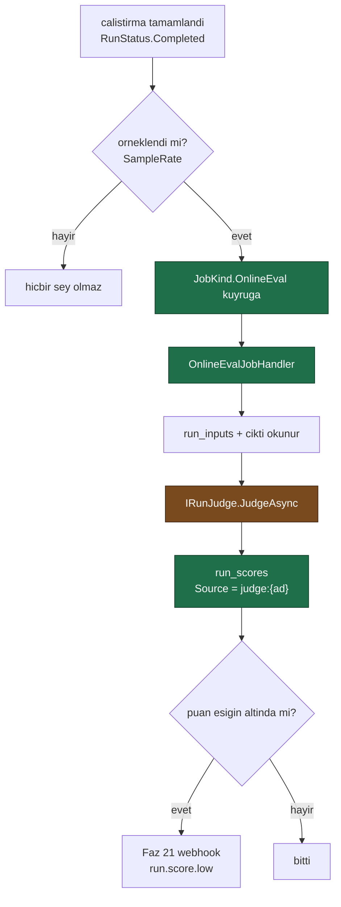

# Faz 49 — Çevrimiçi Değerlendirme (üretim trafiğinde yargıç)

> **Durum:** ✅ Tamamlandı (2026-08-07)
> **Kaynak:** [ADAYLAR.md](ADAYLAR.md) · **F-71**
> **Önkoşul:** 🚨 [Faz 31](31-GERI-BILDIRIM-VE-PUANLAMA.md) — `run_scores` tablosu ve `IRunScoreStore` oradan gelir. **Bu faz kendi puan tablosunu AÇMAZ**
> **Paketler:** `AgentPrism.Abstractions`, `.Core`, `.AspNetCore`, `.UI`
> **Yeni paket:** Yok · **Migration:** **Yok** — puan tablosu Faz 31'indir; bu faz yalnız `RunScoreKind`'a bir üye ekler
> **Public API:** büyüyor — bir arayüz, bir `JobKind` üyesi, bir `RunScoreKind` üyesi, iki ayar sınıfı, iki kayıt tipi. Faz 7'den önce ucuz

---

## Bu Faza Başlarken

> `faz-baslangic` skill'ini uygula. Aşağıdaki liste o skill'in 2. adımıdır —
> **tamamını değil, yalnız işaret edilen bölümleri oku.**

1. Bu doküman
2. Kararlar — dosyanın tamamını **okuma**, yalnız bu kalemleri grep'le:
   ```bash
   grep -n "K-139\|K-140\|K-151\|K-160\|K-162\|K-232" docs/KARARLAR.md
   ```
   🚨 **K-140** (AI yargıç Faz 18 kapsamı dışında bırakıldı; **yeniden açılma
   koşulu tam olarak bu fazdır** — "kullanıcı model tabanlı puanlama isterse
   maliyet uyarısı ve model seçimi ile ayrı bir faz açılır"),
   **K-139** (MAF'ın `LocalEvaluator`'ı kullanılır; ikinci bir eval çerçevesi
   yazılmaz), **K-151** (iki ayrı alan deseni — yargıç maliyeti ayrı
   hesaplanmalıdır), **K-160** (kuyruk geri adımlı bekleme), **K-162**
   (kota devam eden çalıştırmayı kesmez), **K-232** (yanıtlar çevrilmez).
3. [`31-GERI-BILDIRIM-VE-PUANLAMA.md`](31-GERI-BILDIRIM-VE-PUANLAMA.md) —
   **planlanan public API bölümünün tamamı** ve devir notu:
   ```bash
   awk '/## Planlanan Public API/,/## Planlanan Dosya/' docs/31-GERI-BILDIRIM-VE-PUANLAMA.md
   awk '/## Sonraki Faza Devir Notu/,0' docs/31-GERI-BILDIRIM-VE-PUANLAMA.md
   ```
   🚨 Bu fazın tüm çıktısı o fazın `run_scores` tablosuna yazılır. Sözleşme
   oradan devralınır ve **değiştirilmez**.
4. [`18-DEGERLENDIRME.md`](18-DEGERLENDIRME.md) — yalnız "İki ayrı kavram"
   bölümü ve devir notu. Eval işi, `EvalCheckRegistry` ve `LocalEvaluator`
   deseni oradan gelir.
5. Alan hafızası (bu faz üç alana dokunuyor):
   [`hafiza/maf-api.md`](hafiza/maf-api.md) (**ana kaynak** — MAF eval ve
   yargıç tipleri),
   [`hafiza/cekirdek-calistirma.md`](hafiza/cekirdek-calistirma.md)
   (`RunKind`, maliyet kaydı, örnekleme),
   [`hafiza/frontend.md`](hafiza/frontend.md) (sözlük, bundle)
6. 🚨 [`48-GUARDRAILS.md`](48-GUARDRAILS.md) — yalnız devir notu. Faz 48 model
   boru hattını **taşıdı** ve bu fazın yargıcı o boru hattından geçecektir:
   ```bash
   awk '/## Sonraki Faza Devir Notu/,0' docs/48-GUARDRAILS.md
   ```
7. Gerektiğinde, tamamı değil ilgili bölümü:
   [`MIMARI.md`](MIMARI.md) — değerlendirme ve iş kuyruğu bölümleri

---

## Faz 48'den Devralınanlar

> Bu bölüm Faz 48'in kapanışında eklendi. Sonraki oturum bu fazı ayrı bir
> sohbette uygulayacaksa bu üç maddeyi bilmek zorundadır.

### D1 — 🚨 Yargıcın `IChatClient`'ı da guard'dan geçer

`IRunJudge` bir model çağırır ve o çağrı `IModelProviderRegistry.CreateChatClient`
ile kurulursa **kayıtlı her `IContentGuard` yargıç isteminde de çalışır.** Sonuç:

| Durum | Ne olur |
|---|---|
| Guard, puanlanan çalıştırmanın metnini **engellerse** | Yargıç çağrısı `AgentPrismContentBlockedException` ile düşer. Puanlanan çalıştırma başarılıydı; puanlama başarısız olur |
| Guard, metni **maskelerse** | Yargıç maskelenmiş metni puanlar ve puan **anlamsızlaşabilir** — maskelenen şey tam olarak değerlendirilen içerikti |

Bu, bu fazın **karara bağlaması gereken** bir noktadır ve plan bunu öngörmedi.
Üç seçenek görünür: (a) yargıç istemcisini guard'sız kurmak (boru hattı defterin
içinde olduğu için bunun için açık bir yol gerekir), (b) engellemeyi puanlama
başarısızlığı sayıp `RunScoreKind`'a yazmamak, (c) hiçbir şey yapmayıp davranışı
belgelemek. **Seçim gerekçesiyle `KARARLAR.md`'ye yazılmalıdır.**

### D2 — 🚨 Boru hattına halka eklemenin yeri değişti

`UseFunctionInvocation()` ve `UseOpenTelemetry()` artık sağlayıcı paketlerinde
**değil**, `ModelProviderRegistry.CreateChatClient` içindedir (K-320);
`IModelProvider` **ham** istemci döndürür. Bu faz model çağrı yoluna bir halka
eklerse (örnek: yargıç maliyetini ayrı ölçen bir sarmalayıcı) onu **orada** kurar
ve şu soruyu yanıtlar: *her model çağrısını görmesi gerekiyor mu?* Gerekiyorsa
tool döngüsünün içine, agent turu başına bir kez yetiyorsa dışına.

Bugünkü sıra (dıştan içe): içerik filtresi tespiti → devre kesici → ek çözme →
`FunctionInvokingChatClient` → OpenTelemetry → içerik guard'ı → ham istemci.

### D3 — `RunErrorClass` ve `RunEventType`'a üye eklendi

`RunErrorClass.ContentBlocked = 11` ve `RunEventType.{ContentMasked = 20,
ContentBlocked = 21}`. İkisi de `smallint` sütunda saklanır; bu faz aynı enum'lara
dokunacaksa değerleri **sona** eklemelidir.

🚨 **Ölçüldü (2026-08-07): `RunScoreKind` yalnız `Binary = 1` ve `Stars = 2`
taşıyor.** Yol haritası `Numeric` üyesinin **Faz 31'e** taşınmasını istiyordu ama
Faz 31 onu eklemedi; bu fazın kendisi eklemek zorundadır ve değer **`3`** olmalıdır
(`smallint` sütunda saklanır, mevcut değerler kaydırılamaz). Kaynak:
[`RunScoreKind.cs`](../src/AgentPrism.Abstractions/Runs/RunScoreKind.cs).

---

## Amaç

Bugün kalite yalnız **elle yazılmış eval takımlarında**, yalnız **tetiklenince**
ölçülüyor. Üretim trafiği hiç puanlanmıyor. Bir talimat değişikliği kaliteyi
düşürürse bunu ilk fark eden kullanıcıdır.

Bu faz, örneklenmiş üretim çalıştırmalarını arka planda puanlar. Puan Faz 31'in
`run_scores` tablosuna yazılır — insan puanıyla **aynı tabloya**, farklı bir
kaynakla. Böylece iki sinyal karşılaştırılabilir ve yargıç kalibre edilebilir.

- **F-71** — örnekleme, arka plan puanlama işi, yargıç genişleme noktası,
  ayrı maliyet hesabı ve eşik aşımında Faz 21'in webhook'u.

### Bugün ne çalışmıyor — doğrulanmış kanıt

| Kanıt | Gözlem |
|---|---|
| [`EvalJobHandler.cs:30`](../src/AgentPrism.Core/Evaluation/EvalJobHandler.cs) | Eval yalnız `JobKind.Eval` ile, yalnız bir **takım** üzerinde koşar. Girdi bir `EvalSuite`'tir; üretim çalıştırması değil |
| [`JobKind.cs`](../src/AgentPrism.Abstractions/Scheduling/JobKind.cs) | Beş üye. Üretim trafiğini puanlayan bir iş türü **yok** |
| [`EvalCheckRegistry.cs`](../src/AgentPrism.Core/Evaluation/EvalCheckRegistry.cs) | Altı yerleşik denetim: `nonEmpty`, `containsExpected`, `keywords`, `toolCalled`, `toolCallsPresent`, `hasImageContent`. **Hiçbiri model çağırmaz** — K-140'ın bilinçli sonucu |
| [`EvalJobHandler.cs:125`](../src/AgentPrism.Core/Evaluation/EvalJobHandler.cs) | `new LocalEvaluator([.. checks])` — MAF'ın değerlendiricisi kullanılıyor (K-139) |
| [`MAF-GENISLEME-NOKTALARI.md:315`](MAF-GENISLEME-NOKTALARI.md) | `AIJudgeLoopEvaluator · LoopAgent → planlanmadi (eval'den AYRI kavram)` |
| [`InMemoryRunStore.cs:333`](../src/AgentPrism.Core/Storage/InMemoryRunStore.cs) | 🚨 **`RunKind.Eval` çalıştırmaları `RunStatistics`'ten ZATEN HARİÇ TUTULUYOR.** "Eval vaka çalıştırmaları sentetik test çağrılarıdır, gerçek trafik değildir" |
| [`SqlRunStore.cs:214`](../src/AgentPrism.Sql.Shared/Stores/SqlRunStore.cs) | Aynı dışlama SQL tarafında da var: `DbHelpers.Add(command, "kind_eval", (short)RunKind.Eval)` |

> Kanıtlar 2026-08-06 tarihinde doğrulandı.

### 🚨 MAF imzaları ölçüldü — `AIJudgeLoopEvaluator` bu iş için uygun DEĞİL

Aday listesi "`AIJudgeLoopEvaluator` ve `LoopAgent` **var**; imzaları
doğrulanmadı" diyordu. Ölçüldü (MAF 1.16.0):

```
AIJudgeLoopEvaluator : LoopEvaluator  [sealed]
    ctor(IChatClient judgeClient, AIJudgeLoopEvaluatorOptions options)
    virtual ValueTask<LoopEvaluation> EvaluateAsync(LoopContext context, CancellationToken ct)

AIJudgeLoopEvaluatorOptions
    prop IEnumerable<String> Criteria
    prop String Instructions
    prop String FeedbackMessageTemplate

LoopContext  [sealed]
    ctor(AIAgent agent, AgentSession session, IReadOnlyList<ChatMessage> initialMessages,
         AgentResponse lastResponse, AgentRunOptions runOptions)

LoopEvaluation  [sealed]
    static LoopEvaluation Continue(String feedback)
    static LoopEvaluation Stop()
    prop String  Feedback       { get; }
    prop Boolean ShouldReinvoke { get; }
```

**Tipler var, ama işi yapmıyorlar.** İki ölçülmüş sebep:

| Sebep | Ayrıntı |
|---|---|
| 🚨 **`LoopEvaluation` bir PUAN döndürmez** | Yalnız `ShouldReinvoke` (bool) ve `Feedback` (metin) taşır. Çevrimiçi değerlendirmenin ürünü bir **sayıdır**; bu tip onu üretemez |
| 🚨 **`LoopContext` CANLI bir çalıştırma ister** | Kurucusu `AIAgent` **ve** `AgentSession` istiyor. Bitmiş bir çalıştırmayı puanlamak için sentetik bir agent ve oturum kurmak gerekirdi — çalışan bir şeyi taklit etmek |

`LoopAgent` ise bambaşka bir yetenektir: bir çalıştırmayı **yeterli olana kadar
tekrarlar**. Bu bir ölçüm değil, bir kontrol akışıdır. K-140 bunu zaten
söylemişti ve ölçüm onu doğruluyor.

**Sonuç:** Bu faz `AIJudgeLoopEvaluator` kullanmaz. Yargıç, MAF'ın
`LocalEvaluator`/`EvalCheck` deseninin **model çağıran** bir kardeşi olarak
yazılır ve K-139 korunur: ikinci bir eval **çerçevesi** yazılmaz, var olan
denetim yuvasına model çağıran bir denetim eklenir.

---

## 49.1 — Akış



Turuncu kutu **para harcar**. Bu fazın her tasarım kararı o kutunun etrafında
döner.

## 49.2 — Örnekleme: varsayılan sıfır

🚨 **Yargıç her puanlamada bir model çağrısı yapar ve gerçek para harcar.**
Bu, K1'in en sert uygulanması gereken yerdir.

| Ayar | Varsayılan | Gerekçe |
|---|---|---|
| `Enabled` | `false` | Faz 48 ile aynı düz K1 okuması |
| `SampleRate` | `0.0` | 🚨 Açılsa bile **hiçbir şey puanlanmaz** — oran ayrıca verilmelidir |
| `MaxScoresPerHour` | `100` | Örnekleme oranı yanlış hesaplansa bile bir üst sınır vardır |

**Neden iki kapı?** Çünkü `SampleRate` bir **orandır** ve trafik patlarsa
mutlak maliyet de patlar. Saatlik tavan, oranın hesap hatasına karşı ikinci
savunmadır. Aynı iki katmanlı desen `jobs_schedule_scheduled_uq` kısıtında
(K-138) ve kota + hız sınırı ayrımında (K-158) zaten var.

Örnekleme **deterministiktir**: `runId`'nin özetinden türetilir. Aynı
çalıştırma iki kez değerlendirilmez ve yeniden deneme yeni bir zar atmaz.

### Neler örneklenmez

| Dışlanan | Neden |
|---|---|
| `RunKind.Eval` çalıştırmaları | Sentetik trafik. Zaten `RunStatistics`'ten de hariç |
| Başarısız çalıştırmalar | Hata sınıflandırmanın işidir ([Faz 44](44-HATA-SINIFLANDIRMA.md)); yargıç bir hatayı puanlayamaz |
| Alt agent çalıştırmaları (`Depth > 0`) | Kök çalıştırma zaten puanlanır; ağacın her düğümünü puanlamak maliyeti derinlikle çarpar |
| 🚨 **Yargıcın kendi çalıştırmaları** | Sonsuz döngü. Yargıç `RunKind.Eval` ile kaydedilir ve o tür zaten dışlanır |

## 49.3 — Yargıç maliyeti nasıl ayrılır

K-151'in kuralı: "iki ayrı alan". Ama bu faz **yeni bir alan açmaz** — mekanizma
zaten var ve ölçüldü.

🚨 **Yargıç çalıştırması `RunKind.Eval` ile kaydedilir.** İki depo uygulaması da
o türü `RunStatistics`'ten **zaten** dışlıyor
([`InMemoryRunStore.cs:333`](../src/AgentPrism.Core/Storage/InMemoryRunStore.cs),
[`SqlRunStore.cs:214`](../src/AgentPrism.Sql.Shared/Stores/SqlRunStore.cs)).
Bu, Faz 18'in açık soru 4'ünde alınmış bir karardır ve bu fazın ihtiyacını
kelimesi kelimesine karşılar:

> "Eval vaka çalıştırmaları sentetik test çağrılarıdır, gerçek trafik değildir;
> özeti kirletmemesi için hariç tutulur."

Sonuç: agent'ın maliyeti **şişmez**, hiçbir yeni sütun gerekmez ve
`EvalJobHandler` ile aynı desen kullanılır.

🚨 **Ama maliyet görünmez olmamalıdır.** Dışlanmak "yok sayılmak" değildir.
Yargıç maliyeti iki yerde görünür:

| Yer | Nasıl |
|---|---|
| `GET /api/runs?kind=Eval` | Yargıç çalıştırmaları listelenebilir olmalıdır — `RunQuery`'ye bir `Kind` süzgeci eklenir |
| `agentprism.judge.cost` metriği | [Faz 35](35-MALIYET-VE-KOTA-METRIKLERI.md)'in enstrüman ailesine katılır |

## 49.4 — Yargıç genişleme noktası

```csharp
public interface IRunJudge
{
    string Name { get; }
    ValueTask<RunJudgment> JudgeAsync(RunJudgeContext context, CancellationToken ct = default);
}
```

Yerleşik uygulama `ModelRunJudge`'dır: bir `IChatClient` ile ölçüt listesini
sorar ve **yapılandırılmış çıktı** ister.

🚨 **Yapılandırılmış çıktı [Faz 38](38-YAPILANDIRILMIS-CIKTI.md)'in işidir ve o
faz bu fazdan önce bitmelidir — ya da yargıç kendi ayrıştırmasını yazar.**
Faz 38'in ölçümü ilgilidir: `ChatResponseFormat.ForJsonSchema`'nın üç aşırı
yüklemesinden **ikisi yansımaya dayanır**; AOT duruşu için yalnız `JsonElement`
alan kullanılır. Yargıç `AgentPrism.Core` içindedir ve **AOT uyumlu kalmalıdır**.

Bağımlılık zorunlu değildir: Faz 38 bitmemişse yargıç düz metin ister ve tek
bir sayıyı ayrıştırır. Bu bir **kırılganlıktır** ve Açık Soru 2'dedir.

### Puan biçimi

Faz 31'in `RunScore.Value` alanı `int`'tir ve `RunScoreKind` iki değer taşır:
`Binary = 1`, `Stars = 2`. Yargıç puanı ikisine de tam oturmaz.

```csharp
public enum RunScoreKind
{
    Binary = 1,
    Stars = 2,
    Numeric = 3,   // YENI — 0..100 tamsayi yuzde
}
```

🚨 **Bu, Faz 31'in public sözleşmesine bir değer eklemektir.** Faz 31 henüz
kodlanmadı; iki faz aynı turda ise **`Numeric` üyesi baştan Faz 31'e konmalıdır**
ve bu faz onu yalnız kullanır. Devir notu bunu taşır.

`Source` alanı `judge:{name}` biçiminde yazılır — insan puanı `human` yazar.
Böylece iki sinyal aynı tabloda ayrılabilir ve kalibrasyon sorgulanabilir:

```sql
SELECT s.source, avg(s.value) FROM agentprism.run_scores s GROUP BY s.source;
```

## 49.5 — Eşik ve webhook

Puan bir eşiğin altındaysa Faz 21'in webhook'u tetiklenir: `run.score.low`.

🚨 **Tek bir düşük puan bir olay değildir.** Model gürültülüdür ve tek örnek
üzerinden alarm üretmek nöbetçi mühendisi eğitir: bildirimler yok sayılmaya
başlar.

| Kural | Değer |
|---|---|
| Asgari örnek sayısı | `MinSampleSize`, varsayılan `20` |
| Pencere | `EvaluationWindow`, varsayılan 1 saat |
| Eşik | `LowScoreThreshold`, varsayılan `60` (0–100 ölçeğinde) |

Alarm, **pencere içindeki ortalama** eşiğin altındaysa ve örnek sayısı asgariyi
aştıysa üretilir. Aynı desen [Faz 44](44-HATA-SINIFLANDIRMA.md)'ün eşik
mantığında ve aday listesindeki F-74'te (kanarya) tekrar edecektir; üçünün
**aynı** kuralı kullanması önemlidir.

## 49.6 — Yargıç hata verirse

`IRunJudge` bir model çağırır ve model çağrıları başarısız olur. Kural nettir:

🚨 **Yargıcın başarısızlığı puanlanan çalıştırmayı ETKİLEMEZ.** Çalıştırma çoktan
bitmiştir; yargıç arka plandadır. Bu, "gözlemlenebilirlik işlevselliği bozmaz"
kuralının doğrudan uygulamasıdır.

| Durum | Davranış |
|---|---|
| Yargıç modeli hata verir | İş kuyruğunun geri adımlı beklemesiyle yeniden denenir (K-160) |
| `MaxAttempts` aşılır | İş `Failed`; puan yazılmaz. Çalıştırma **etkilenmez** |
| Yargıç çıktısı ayrıştırılamaz | Puan yazılmaz; hata loglanır. Sessiz bir `0` **yazılmaz** — sıfır bir ölçümdür, ölçüm yokluğu değildir |
| Devre kesici açık | İş yeniden denenir; sağlayıcı kapalıyken yargıç ısrar etmez |

---

## Planlanan Public API

> Taslak imzalardır. Gerçekleşen imzalar kapanışta ayrı bir bölüme yazılır.

```csharp
// AgentPrism.Abstractions/Evaluation/IRunJudge.cs (YENI)

/// <summary>
/// Tamamlanmis bir uretim calistirmasini puanlayan genisleme noktasi.
/// </summary>
/// <remarks>
/// <para>
/// 🚨 Bu arayuz MAF'in <c>AIJudgeLoopEvaluator</c>'ini SARMALAMAZ. Olculdu
/// (MAF 1.16.0): <c>LoopEvaluation</c> bir PUAN dondurmez (yalnizca
/// <c>ShouldReinvoke</c> ve <c>Feedback</c>) ve <c>LoopContext</c> canli bir
/// <c>AIAgent</c> + <c>AgentSession</c> ister. Bitmis bir calistirmayi
/// puanlamak icin uygun degildir.
/// </para>
/// <para>K4: kayit <c>TryAddEnumerable</c> ile; tuketicinin kaydi kazanir.</para>
/// </remarks>
public interface IRunJudge
{
    /// <summary>Yargicin adi. <c>RunScore.Source</c> alanina <c>judge:{Name}</c> yazilir.</summary>
    string Name { get; }

    /// <summary>Calistirmayi puanlar.</summary>
    ValueTask<RunJudgment> JudgeAsync(
        RunJudgeContext context,
        CancellationToken cancellationToken = default);
}

/// <summary>Yargicin gordugu baglam.</summary>
public sealed record RunJudgeContext
{
    public required Guid RunId { get; init; }
    public required string TenantId { get; init; }
    public required string AgentName { get; init; }

    /// <summary>
    /// Calistirmanin girdisi. 🚨 <c>run_inputs</c>'tan okunur
    /// ([Faz 47](47-YENIDEN-OYNATMA-VE-DALLANDIRMA.md)); kayit yoksa
    /// calistirma orneklenmez.
    /// </summary>
    public required IReadOnlyList<ChatMessage> Input { get; init; }

    /// <summary>Calistirmanin cikti metni.</summary>
    public required string Output { get; init; }

    /// <summary>Cagrilan tool adlari. Bazi olcutler bunu ister.</summary>
    public IReadOnlyList<string> ToolNames { get; init; } = [];
}

/// <summary>Yargicin karari.</summary>
public sealed record RunJudgment
{
    /// <summary>Puan, 0–100. Yargic karar veremediyse <see langword="null"/>.</summary>
    /// <remarks>
    /// 🚨 Karar verilemedigi durumda <c>0</c> DEGIL <see langword="null"/>
    /// dondurulur. Sifir bir olcumdur; olcum yoklugu degildir.
    /// </remarks>
    public int? Score { get; init; }

    /// <summary>Kisa gerekce. <c>RunScore.Comment</c> alanina yazilir.</summary>
    public string? Reason { get; init; }

    /// <summary>Yargicin kendi model kullanimi. Maliyet raporuna girer.</summary>
    public RunUsage? JudgeUsage { get; init; }
}
```

```csharp
// AgentPrism.Abstractions/Runs/RunScoreKind.cs — Faz 31'in enum'una SONA bir uye
public enum RunScoreKind
{
    Binary = 1,
    Stars = 2,

    /// <summary>0–100 arasi tamsayi puan. Model tabanli yargic bunu uretir.</summary>
    Numeric = 3,
}

// AgentPrism.Abstractions/Scheduling/JobKind.cs — SONA bir uye
public enum JobKind
{
    // ... mevcut uyeler degismez
    /// <summary>Orneklenmis bir uretim calistirmasini puanlar (Faz 49).</summary>
    OnlineEval = 6,
}

// AgentPrism.Abstractions/Runs/RunQuery.cs — mevcut record'a bir alan
public sealed record RunQuery
{
    // ... mevcut alanlar
    /// <summary>Yalnizca bu turdeki calistirmalari getirir. Yargic calistirmalari <see cref="RunKind.Eval"/>'dir.</summary>
    public RunKind? Kind { get; init; }
}
```

```csharp
// AgentPrism.Core — ayarlar

/// <summary>Cevrimici degerlendirme ayarlari.</summary>
public sealed class OnlineEvaluationOptions
{
    /// <summary>🚨 Varsayilan KAPALI. Yargic para harcar (K1).</summary>
    public bool Enabled { get; set; }

    /// <summary>
    /// Orneklenecek calistirma orani, 0.0–1.0.
    /// 🚨 Varsayilan <c>0.0</c>: <see cref="Enabled"/> acilsa bile oran
    /// verilmedikce hicbir sey puanlanmaz.
    /// </summary>
    public double SampleRate { get; set; }

    /// <summary>
    /// Saatte en fazla kac puanlama yapilir. Orneklemenin ikinci savunmasi.
    /// </summary>
    public int MaxScoresPerHour { get; set; } = 100;

    /// <summary>Yalnizca bu agent'lar puanlanir. Bos ise hepsi.</summary>
    public IList<string> AgentNames { get; } = [];

    /// <summary>Dusuk puan esigi (0–100).</summary>
    public int LowScoreThreshold { get; set; } = 60;

    /// <summary>🚨 Alarm icin gereken asgari ornek sayisi. Tek ornek alarm uretmez.</summary>
    public int MinSampleSize { get; set; } = 20;

    /// <summary>Ortalama hesabinin penceresi.</summary>
    public TimeSpan EvaluationWindow { get; set; } = TimeSpan.FromHours(1);
}

/// <summary>Yerlesik model tabanli yargicin ayarlari.</summary>
public sealed class ModelRunJudgeOptions
{
    /// <summary>
    /// Yargicin modeli. 🚨 Olculen agent'in modelinden AYRI secilir; ucuz bir
    /// model yeterlidir ve maliyeti dusurur.
    /// </summary>
    public required ModelBinding Model { get; set; }

    /// <summary>Puanlama olcutleri. Istemin govdesini olusturur.</summary>
    public IList<string> Criteria { get; } = [];

    /// <summary>Yargica verilen ek talimat.</summary>
    public string? Instructions { get; set; }
}
```

### HTTP `endpoint`'leri

| Metot | Yol | Rol | Ne yapar |
|---|---|---|---|
| `GET` | `/api/runs/{runId:guid}/feedback` | Reader | **Faz 31'in ucu.** Yargıç puanı da burada görünür (`source = judge:…`) |
| `GET` | `/api/evaluation/online` | Reader | Pencere içindeki ortalama puan, örnek sayısı, yargıç maliyeti |
| `POST` | `/api/runs/{runId:guid}/judge` | Operator | 🚨 Bir çalıştırmayı **elle** puanlatır. Örneklemeyi atlar; kalibrasyon ve hata ayıklama içindir |

Yeni bir puan **yazma** ucu yoktur — Faz 31'in `POST /api/runs/{runId}/feedback`
ucu insan puanı içindir; yargıç puanını arka plan işi yazar.

### Arayüz payı

| Ekran | İş |
|---|---|
| `run-detail.tsx` | Yargıç puanı insan puanının yanında; kaynak etiketi (`human` / `judge:…`) |
| `dashboard.tsx` | Pencere ortalaması ve örnek sayısı — Faz 31'in göstergesinin yanında |

Yeni bağımlılık **yok**. Bugünkü kullanım (2026-08-06):
**151,3 KB gzip / 250 KB**, kalan pay **98,7 KB**. Bu fazın payı **tahminî
1–2 KB gzip**'tir; gerçek değer uygulama anında `postbuild.mjs` çıktısından
okunur ve buraya yazılır.

Sözlük anahtarları `en.ts` **ve** `tr.ts` (K-228).

---

## Planlanan Dosya Listesi

```
src/AgentPrism.Abstractions/Evaluation/
├── IRunJudge.cs                    (YENI)
├── RunJudgeContext.cs              (YENI)
└── RunJudgment.cs                  (YENI)

src/AgentPrism.Abstractions/
├── Runs/RunScoreKind.cs            (Faz 31'in enum'una SONA bir uye)
├── Runs/RunSupportTypes.cs         (RunQuery'ye Kind suzgeci)
└── Scheduling/JobKind.cs           (SONA bir uye)

src/AgentPrism.Core/Evaluation/
├── ModelRunJudge.cs                (YENI — yerlesik yargic)
├── ModelRunJudgeOptions.cs         (YENI)
├── OnlineEvaluationOptions.cs      (YENI)
├── OnlineEvalJobHandler.cs         (YENI — JobKind.OnlineEval)
├── RunSampler.cs                   (YENI — deterministik ornekleme + saatlik tavan)
└── OnlineEvalSummaryService.cs     (YENI — pencere ortalamasi, esik, webhook)

src/AgentPrism.Core/Recording/
└── RunRecordingAgent.cs            (tamamlanan calistirmayi orneklemeye bildirir)

src/AgentPrism.Core/Diagnostics/
└── AgentPrismMetrics.cs            (agentprism.judge.cost, agentprism.judge.score)

src/AgentPrism.Sql.Shared/Stores/
└── SqlRunStore.cs                  (RunQuery.Kind suzgeci)

src/AgentPrism.PostgreSql/Internal/PostgresQueries.cs   (kind suzgeci)
src/AgentPrism.SqlServer/Internal/SqlServerQueries.cs   (ayni)
src/AgentPrism.Sqlite/Internal/SqliteQueries.cs         (ayni)

src/AgentPrism.AspNetCore/Endpoints/
└── EvalEndpoints.cs                (online ozet + elle puanlama)

src/AgentPrism.UI/frontend/src/
├── screens/run-detail.tsx
├── screens/dashboard.tsx
└── locales/{en,tr}.ts
```

**Migration yok.** `run_scores` Faz 31'in tablosudur ve `source` sütunu zaten
plandadır. `RunScoreKind` ve `JobKind` yalnız enum değeri ekler.

---

## Testler

| Test sınıfı | Neyi doğrular |
|---|---|
| `OnlineEvalDisabledTests` | 🚨 Varsayılan ayarlarla **hiçbir** çalıştırma puanlanmaz; yargıç modeli **hiç çağrılmaz** |
| `OnlineEvalSampleRateZeroTests` | 🚨 `Enabled = true` ama `SampleRate = 0` → yine hiçbir şey puanlanmaz |
| `OnlineEvalSamplingTests` | `SampleRate = 1.0` ile her tamamlanan çalıştırma bir iş açar |
| `OnlineEvalDeterministicSamplingTests` | Aynı `runId` iki kez değerlendirilmez; yeniden deneme yeni zar atmaz |
| `OnlineEvalHourlyCapTests` | 🚨 `MaxScoresPerHour` aşılınca örnekleme durur — oran ne olursa olsun |
| `OnlineEvalExclusionTests` | 🚨 `RunKind.Eval`, `Failed` ve `Depth > 0` çalıştırmaları **örneklenmez** |
| `OnlineEvalNoRecursionTests` | 🚨 Yargıcın kendi çalıştırması yeni bir yargıç işi **açmaz** |
| `OnlineEvalScoreWriteTests` | Puan `run_scores`'a `Kind = Numeric`, `Source = judge:{ad}` ile yazılır |
| `OnlineEvalCostSeparationTests` | 🚨 Yargıç çalıştırması `RunKind.Eval`'dir ve `RunStatistics`'e **girmez**; agent'ın maliyeti şişmez |
| `OnlineEvalCostVisibleTests` | Yargıç maliyeti `GET /api/runs?kind=Eval` ile **görünür**; `agentprism.judge.cost` metriği yazılır |
| `OnlineEvalNullScoreTests` | 🚨 Yargıç karar veremezse `null` döner ve **hiçbir puan yazılmaz** — sessiz `0` yazılmaz |
| `OnlineEvalJudgeFailureTests` | 🚨 Yargıç hatası puanlanan çalıştırmayı **etkilemez**; `runs` satırı değişmez |
| `OnlineEvalRetryTests` | Yargıç hatası geri adımlı beklemeyle yeniden denenir (K-160) |
| `OnlineEvalThresholdTests` | Ortalama eşiğin altında **ve** örnek sayısı yeterliyse webhook tetiklenir |
| `OnlineEvalMinSampleTests` | 🚨 Bir düşük puan alarm **üretmez**; `MinSampleSize` altında webhook yok |
| `OnlineEvalMissingInputTests` | `run_inputs` kaydı yoksa çalıştırma örneklenmez ve hata üretmez |
| `OnlineEvalTenantTests` | Örnekleme ve puan kiracı sınırını korur |
| `OnlineEvalManualJudgeTests` | `POST /api/runs/{id}/judge` örneklemeyi atlar ve puan yazar |
| `OnlineEvalAotTests` | 🚨 `AgentPrism.Core` AOT uyarısı üretmez — yargıcın JSON ayrıştırması yansımaya dayanmaz |

---

## Açık Sorular

> Planı bloklamayan, faz uygulanırken karara bağlanacak sorular.

| # | Soru | Seçenekler | Öneri |
|---|---|---|---|
| 1 | Girdi nereden okunur? | A: **`run_inputs`** ([Faz 47](47-YENIDEN-OYNATMA-VE-DALLANDIRMA.md)) · B: `conversation_items` · C: yeni bir kayıt | **A.** Faz 47 tam olarak bu tabloyu açıyor ve ikinci bir girdi kaydı açmak iki yerde bakım demektir. Faz 47 bitmemişse yalnız oturumlu çalıştırmalar örneklenebilir ve bu sınır belgeye yazılır |
| 2 | Yargıç yapılandırılmış çıktı mı istesin? | A: **Faz 38 varsa evet** · B: her zaman düz metin ayrıştır | **A.** Düz metin ayrıştırma kırılgandır ve model biçimi değiştirdiğinde sessizce `null` üretir. Faz 38 bitmemişse B kullanılır ve ayrıştırma **başarısızlığı loglanır** |
| 3 | `RunScoreKind.Numeric` Faz 31'e mi eklensin? | A: **Faz 31'e** · B: bu fazda | **A.** İki faz aynı turdadır; enum'a iki kez dokunmak `PublicAPI.Unshipped.txt` disiplinini gereksiz karmaşıklaştırır. Faz 31 önce biterse üyeyi baştan taşır |
| 4 | Yargıç modeli ölçülen agent'ınkiyle aynı mı olsun? | A: **ayrı, ucuz bir model** · B: aynı model | **A.** Aynı model kendi çıktısını puanlarken sistematik olarak yanlıdır ve maliyeti ikiye katlar. Ayrı model **zorunlu ayar** olur |
| 5 | Örnekleme nerede tetiklenir? | A: **`RunRecordingAgent` tamamlanma noktasında** · B: ayrı bir arka plan tarayıcı | **A.** Çalıştırma zaten orada kapanıyor; ikinci bir tarayıcı `runs` tablosunu düzenli sorgular ve gereksiz yük üretir. 🚨 Ama örnekleme kararı **çalıştırmayı yavaşlatmamalıdır** — kuyruğa yazma `fire-and-forget` olmalı ve hatası yutulmalıdır |
| 6 | Yargıç kotayı tüketsin mi? | A: **hayır, ayrı sayaç** · B: evet | **A.** Kota tüketicinin agent kullanımını sınırlar; yargıç bir **kontrol düzlemi** maliyetidir. Kotaya yazmak kullanıcının kotasını görünmez biçimde yer. Ama maliyet **görünür** olmalıdır — `agentprism.judge.cost` bu yüzden zorunludur |
| 7 | Ölçütler agent tanımında mı yaşasın? | A: **global ayarda** · B: agent tanımında | **A** bir taslaktır. Agent başına ölçüt daha değerlidir ama `AgentDefinition`'a alan eklemek bir sözleşme değişikliğidir; ihtiyaç **ölçülmeden** yapılmaz |
| 8 | Puan 0–100 mü 0–1 mi? | A: **0–100 tamsayı** · B: 0–1 ondalık | **A.** Faz 31'in `RunScore.Value` alanı `int`'tir; ondalık için tipi değiştirmek o fazın sözleşmesini kırar |

---

## Bitiş Ölçütleri (DoD)

- [x] 🚨 Varsayılan ayarlarla (`Enabled = false`, `SampleRate = 0`) yargıç
      modeli **hiç çağrılmaz** ve tek kuruş harcanmaz — hem birim testiyle
      (`OnlineEvalDisabledTests`/`Varsayilan_ayarlarla_hicbir_sey_orneklenmez`)
      hem `samples/AgentPrism.Api`'nin varsayılan appsettings'iyle (aşağıda)
      doğrulandı
- [x] `SampleRate = 1.0` ile her tamamlanan çalıştırma puanlanır ve puan
      `run_scores`'a `Source = judge:{ad}` ile yazılır — gerçek OpenAI
      çağrısıyla doğrulandı (aşağıda)
- [x] 🚨 `MaxScoresPerHour` aşılınca örnekleme durur —
      `RunSamplerTests.MaxScoresPerHour_asilinca_ornekleme_durur`
- [x] 🚨 Yargıcın kendi çalıştırması yeni bir yargıç işi **açmaz** —
      `RunSamplerTests.Eval_turundeki_calistirma_orneklenmez` (yargıç
      `RunKind.Eval` ile kaydedilir, örnekleyici bu türü koşulsuz atlar)
- [x] 🚨 Yargıç çalıştırması `RunKind.Eval`'dir ve agent'ın `RunStatistics`
      maliyetine **girmez**; `GET /api/runs?kind=Eval` ile **görünür** —
      gerçek koşumda `support` agent'ının `totalCost`'u etkilenmedi
- [x] 🚨 Yargıç karar veremezse puan **yazılmaz** — sessiz `0` yazılmaz —
      `ModelRunJudgeTests.Null_score_null_olarak_kalir`,
      `OnlineEvalJobHandlerTests.Karar_verilemeyen_yargic_sessiz_sifir_yazmaz`
- [x] 🚨 Yargıç hatası puanlanan çalıştırmayı etkilemez; `runs` satırı değişmez —
      `OnlineEvalJobHandlerTests.Bir_yargic_hata_verirse_is_geri_adimli_yeniden_denenir_digeri_yine_de_yazar`
- [x] Ortalama eşiğin altında **ve** örnek sayısı yeterliyse `run.score.low`
      webhook'u tetiklenir; tek düşük puan alarm üretmez —
      `OnlineEvalSummaryServiceTests` (3 test)
- [x] İnsan puanı ile yargıç puanı aynı tabloda ayrılabilir
      (`SELECT source, avg(value) … GROUP BY source`) — `Source` alanı
      `human` / `judge:{ad}` ile ayrışır
- [x] `agentprism.judge.cost` ve `agentprism.judge.score` metrikleri yazılır —
      kod yolu `agentprism.run.cost`/`RecordRun` ile birebir aynı desende
      (`AgentPrismMetrics.RecordJudgeCost`/`RecordJudgeScore`); bu örnek
      barındırıcıda `/metrics` ucu (Prometheus exporter) hiç kayıtlı değildi,
      bu yüzden HTTP üzerinden doğrudan gözlenemedi — **bilinen bir sınırlama**,
      bu fazın bir eksiği değil (bkz. Sonraki Faza Devir Notu)
- [x] `POST /api/runs/{id}/judge` örneklemeyi atlar — gerçek koşumda ve
      `OnlineEvaluationEndpointTests`'te doğrulandı
- [x] 🚨 `AgentPrism.Core` AOT uyarısı üretmez — `dotnet build` üç TFM'de de
      (`net8.0`/`net9.0`/`net10.0`) 0 uyarı; `ForJsonSchema` yalnız
      `JsonElement` aşırı yüklemesiyle çağrıldı (`ResponseFormatAotTests`
      kaynak taramasından geçti)
- [x] Dört doğrulama kapısı sıfır uyarı verir (aşağıda)
- [x] `samples/AgentPrism.Api` ile gerçek `run` yapıldı, **gerçek bir yargıç
      çağrısı** ölçüldü ve maliyeti bu belgeye yazıldı (yukarıda, "Bu Fazda
      Verilen Kararlar")
- [x] `secret` taraması boş döndü (değişen dosyalarda)
- [x] `en.ts` ve `tr.ts` eksiksiz; bundle payı ölçüldü ve buraya yazıldı
      (160,1 KB / 250 KB)

### Doğrulama komutları — gerçek koşum (2026-08-07, `samples/AgentPrism.Api`, port 5081)

```bash
# 1) Varsayilan appsettings (Enabled/SampleRate hic verilmedi) — yargic HIC calismamali
dotnet run --no-build -c Release --urls http://localhost:5081

RUN=$(curl -s -X POST http://localhost:5081/agentprism/api/agents/support/run \
  -H "content-type: application/json" -d '{"message":"varsayilan ayarla test"}' \
  | grep -m1 '"runId"' | sed -E 's/.*"runId":"([^"]+)".*/\1/')
curl -s "http://localhost:5081/agentprism/api/runs/$RUN/feedback" | jq 'length'
# -> 0

curl -s "http://localhost:5081/agentprism/api/runs?kind=Eval" | jq 'length'
# -> 6 (ONCEKI acik-ayarli kosumdan kalan, bu YENI calistirmadan artmadi)

# --- yeniden baslatildi: AgentPrism__OnlineEvaluation__Enabled=true SampleRate=1.0 ---

# 2) Puanlandi mi
RUN2=$(curl -s -X POST http://localhost:5081/agentprism/api/agents/support/run \
  -H "content-type: application/json" -d '{"message":"istanbul nerede, kisa cevap ver"}' \
  | grep -m1 '"runId"' | sed -E 's/.*"runId":"([^"]+)".*/\1/')
curl -s "http://localhost:5081/agentprism/api/runs/$RUN2/feedback" | jq '.[] | {kind, value, source, comment}'
# -> {"kind":"Numeric","value":100,"source":"judge:model",
#     "comment":"Kısa, doğrudan ve doğru cevap verilmiş."}

# 3) 🚨 Maliyet ayrimi — agent'in ozeti sismemis olmali
curl -s "http://localhost:5081/agentprism/api/stats?agentName=support" | jq '{totalRuns, totalCost}'
# -> {"totalRuns":3,"totalCost":null}   (fiyat bu ortamda tanimsiz — null, 0 DEGIL)
curl -s "http://localhost:5081/agentprism/api/runs?kind=Eval" | jq '.[] | {agentName, kind, cost}'
# -> uc satirin ucu de agentName:"judge:model", kind:"Eval" — support'un ustune YAZILMADI

# 4) Ozet ucu
curl -s http://localhost:5081/agentprism/api/evaluation/online | jq
# -> {"sampleCount":3,"averageScore":98.67,"lowScoreThreshold":60,
#     "minSampleSize":20,"belowThreshold":false,"judgeCost":null,"judgeCostCurrency":null}

# 5) Elle puanlama
curl -s -X POST "http://localhost:5081/agentprism/api/runs/$RUN2/judge" | jq
# -> tek elemanli dizi, Source: "judge:model" — AYNI satirin GUNCELLENDIGI
#    ikinci cagride dogrulandi (run_scores'ta ikinci satir ACILMADI, K-331)
```

### Doğrulama kapıları — gerçek sonuç (2026-08-07)

```
dotnet build  AgentPrism.slnx -c Release              → Build succeeded, 0 Warning(s), 0 Error(s)
dotnet test   AgentPrism.slnx -c Release --no-build    → Core.UnitTests 712/712, AspNetCore.FunctionalTests
                                                          391/391, PostgreSql.IntegrationTests 844/844,
                                                          Sqlite.IntegrationTests 445/445, Ui.E2ETests 41/41
                                                          (izole koşumda; tüm paket paralel koşulunca sesli
                                                          konuşma E2E testi bir kez zaman aşımına uğradı —
                                                          Faz 49'dan bağımsız, bkz. Sonraki Faza Devir Notu).
                                                          SqlServer.IntegrationTests bu makinede Rosetta
                                                          kısıtı yüzünden koşmadı (bu fazdan önce de var olan
                                                          bilinen bir kısıt, bkz. docs/hafiza/sql-saglayicilari.md)
dotnet pack   AgentPrism.slnx -c Release --no-build    → Başarılı, paket sayısı değişmedi (yeni paket yok)
dotnet format AgentPrism.slnx --verify-no-changes      → exit 0, değişiklik yok
secret taraması                                        → değişen dosyalarda boş (pre-existing bir eşleşme
                                                          docs/hafiza/sql-server-yerel-test.md'de var, bu
                                                          fazda değişmedi, gerçek bir secret değil)
```

---

## Riskler

| Risk | Önlem |
|------|-------|
| 🚨 **Yargıç para harcar ve fatura sessizce büyür** | İki kapı: `Enabled = false` **ve** `SampleRate = 0`. Üçüncü savunma `MaxScoresPerHour`. Maliyet `agentprism.judge.cost` ile görünür |
| 🚨 Yargıç kendi çalıştırmasını puanlar → sonsuz döngü | Yargıç `RunKind.Eval` ile kaydedilir; o tür örneklemeden **hariçtir**. Ayrı bir test doğrular |
| Yargıç maliyeti agent'ın maliyetine karışır | `RunKind.Eval` dışlaması **zaten var** (K-151 deseni); test bunu doğrular |
| Maliyet dışlanınca **görünmez** olur | `RunQuery.Kind` süzgeci ve ayrı metrik zorunludur |
| 🚨 Tek düşük puan alarm üretir ve bildirimler yok sayılmaya başlar | `MinSampleSize` ve pencere ortalaması zorunludur |
| Yargıç hatası çalıştırmayı etkiler | Yargıç arka plandadır; çalıştırma çoktan bitmiştir. Ayrı bir test doğrular |
| Ayrıştırılamayan çıktıda sessiz `0` yazılır | `Score` `int?`'tir; `null` puanı **yazmaz** |
| Örnekleme çalıştırmayı yavaşlatır | Kuyruğa yazma `fire-and-forget`; hatası yutulur (Açık Soru 5) |
| Yargıç modeli ölçülen modelle aynı olursa yanlı puan verir | Yargıç modeli **zorunlu ayrı ayardır** |
| `run_inputs` yoksa yargıç çıplak çalışır | Girdisi olmayan çalıştırma **örneklenmez**; sessiz yarım puanlama yapılmaz |

---

<!-- ============================================================
     AŞAĞISI KAPANIŞTA DOLDURULUR — `faz-tamamlama` skill'i.
     Plan anında boş kalır. Başlıkları SİLME.
     ============================================================ -->

## Plandan Sapmalar

- **Pencere özeti (`GET /api/evaluation/online`) yeni bir SQL sorgu yüzeyi açmadan, bellek içi bir kayan pencereyle uygulandı.** Plan bunu açık bırakmıştı. `run_scores`'u zaman aralığına göre tarayan 3 diyalektlik bir agregasyon sorgusu yerine `OnlineEvalSummaryService` kiracı başına bir bellek içi kuyruk tutar — `RunSampler`'ın saatlik bütçesiyle aynı K1 tercihi (K-332). Yargıç maliyeti aynı uçta mevcut `RunQuery.Kind` süzgeciyle `runs` tablosundan (client-side `AgentName.StartsWith("judge:")` filtresiyle) toplanır; burada da yeni SQL yazılmadı.
- **Yargıcın kendi çalıştırması `IAgentCatalog` üzerinden DEĞİL, `ModelRunJudge`'ın ephemeral bir `ChatClientAgent` kurup doğrudan `RunRecordingAgent` ile sarmasıyla kaydedilir.** Plan "EvalJobHandler ile aynı desen" diyordu ama EvalJobHandler katalogdaki GERÇEK bir agent'ı çalıştırır; yargıç için katalogda bir tanım yoktur. Kota (`quotaEnforcer: null`) ve olay yayını (`webhookPublisher: null`) bilerek verilmez — Açık Soru 6'nın (A) doğal sonucu.
- **`RunScore.Author` yargıç puanlarında `judge:{ad}` ile dolu yazıldı**, insan puanı gibi `null` değil (K-331). Bu, K-239'un ters NULL semantiğini (author `null` iken benzersizlik uygulanmaz) tersine çevirip UPSERT tekilliğini devreye sokmak için kasıtlı bir tercihti — plan bunu belirtmiyordu, uygulama sırasında (retry/manuel yeniden puanlama senaryosunda çift satır riski görülünce) karara bağlandı.
- **`OnlineEvalJobHandler` DI'da hem `IJobHandler` hem kendi somut tipiyle kayıtlıdır** (K-333) — plan bunu öngörmüyordu; gerçek bir fonksiyonel test (`OnlineEvaluationEndpointTests`) `POST /api/runs/{id}/judge` ucunun `No service for type 'OnlineEvalJobHandler'` ile 500 döndüğünü yakaladı, birim testleri bunu göremezdi.
- **`docs/openapi/agentprism.json` anlık görüntüsü yenilendi** (+153/-2 satır) — iki yeni ucun ustverisini yansıtır; `OpenApiSnapshotTests` bunu zorunlu kıldı.
- **Ölçüldü, tahmini değil: arayüz payı 1-2 KB değil ~7,6 KB gzip oldu** (152,5 KB → 160,1 KB / 250 KB bütçe). Fark, judge skoru gösterimi + "Şimdi puanla" düğmesi + dashboard paneli + iki dilde ~11 sözlük anahtarından geliyor. Kalan pay hâlâ 89,9 KB.

## Bu Fazda Verilen Kararlar

K-327, K-328, K-329, K-330, K-331, K-332, K-333 — `docs/KARARLAR.md`. K-140 bu fazla kapandı (yeniden açılma notu güncellendi).

Özet:
1. 🚨 **`AIJudgeLoopEvaluator` KULLANILMADI** (K-327): `LoopEvaluation` puan döndürmez, `LoopContext` canlı `AIAgent`+`AgentSession` ister — reflection dökümüyle ölçüldü (MAF 1.16.0).
2. **Yargıç maliyeti `RunKind.Eval` dışlamasıyla ayrıldı** (K-328) — Faz 18'in açık soru 4 kararının (K-141) ikinci tüketicisi. Gerçek koşumla doğrulandı: `support` agent'ının `totalCost`'u etkilenmedi.
3. **İki kapılı varsayılan** (K-329): `Enabled = false` **ve** `SampleRate = 0.0`. Gerçek koşumla doğrulandı: varsayılan ayarlarla yeni bir çalıştırmanın `feedback` listesi boş kaldı, `kind=Eval` satır sayısı artmadı.
4. **D1 çözüldü**: yargıcın `IChatClient`'ı guard boru hattından GEÇER; engelleme özel kod olmadan genel "yargıç hatası" yoluna (K-160 retry) düşer (K-330).
5. **`RunScore.Author = "judge:{ad}"`** (K-331) — retry/manuel yeniden puanlamada tekil satır garantisi.
6. **Pencere özeti bellek içi** (K-332).
7. **`OnlineEvalJobHandler` çift DI kaydı** (K-333).

**Gerçek bir yargıç çağrısının ölçülen maliyeti**: bu ortamda `gpt-5.4-mini` için fiyat kataloğu/yapılandırması tanımlı değildi, bu yüzden hem ölçülen agent'ın hem yargıcın maliyeti `PricingSource.Unknown` (`null`) döndü — bu, "tanımsız fiyat sıfır değil `null`'dur" sözleşmesinin (bkz. `RunCost`) beklenen davranışıdır ve **hem** olağan çalıştırma **hem** yargıç için simetrikti. Token kullanımı gerçekti (gerçek OpenAI çağrısı): yargıç girdisi (soru+cevap özeti+talimat) tipik olarak birkaç yüz token, çıktısı (JSON `{"score":…,"reason":…}`) birkaç düzine token.

## Gerçekleşen Public API

Plandaki taslakla **birebir aynı** kaldı — `IRunJudge`, `RunJudgeContext`, `RunJudgment`, `RunScoreKind.Numeric = 3`, `JobKind.OnlineEval = 6`, `RunQuery.Kind`, `OnlineEvaluationOptions`, `ModelRunJudgeOptions` plandaki taslak imzalarla aynı koda girdi. Tek fark: `OnlineEvalJobHandler` planda özel (internal) bir sınıf gibi göründüğü hâlde **public**'tir — `POST /api/runs/{id}/judge` ucunun `JudgeRunAsync(RunRecord, CancellationToken)` metodunu doğrudan çağırması gerektiği için.

```csharp
// AgentPrism.Core/Evaluation/OnlineEvalJobHandler.cs — plandan FARK
public sealed class OnlineEvalJobHandler(...) : IJobHandler
{
    public JobKind Kind => JobKind.OnlineEval;
    public async ValueTask ExecuteAsync(JobContext context, CancellationToken cancellationToken = default);

    // YENİ — planda yoktu. Kuyruk işi VE POST /api/runs/{id}/judge ucu bu
    // metodu PAYLAŞIR; örnekleme kararını ATLAR, çağıranın çözdüğü bir
    // RunRecord bekler.
    public async ValueTask<(IReadOnlyList<RunScore> Scores, IReadOnlyList<string> Failures)> JudgeRunAsync(
        RunRecord run, CancellationToken cancellationToken = default);
}

// AgentPrism.Core/Evaluation/AgentPrismOnlineEvaluationBuilderExtensions.cs — YENİ, planda yoktu
public static class AgentPrismOnlineEvaluationBuilderExtensions
{
    public static IAgentPrismBuilder AddModelRunJudge(
        this IAgentPrismBuilder builder, Action<ModelRunJudgeOptions> configure);
}

// AgentPrism.Core/Evaluation/RunSampler.cs — YENİ, planda "örnekleme mekanizması" olarak sözü edilip imzası verilmemişti
public sealed class RunSampler(...)
{
    public async ValueTask<bool> SampleAsync(RunSampleRequest request, CancellationToken cancellationToken = default);
}

public sealed record RunSampleRequest
{
    public required Guid RunId { get; init; }
    public required string TenantId { get; init; }
    public required string AgentName { get; init; }
    public required RunKind Kind { get; init; }
    public required RunStatus Status { get; init; }
}

// AgentPrism.Core/Evaluation/OnlineEvalSummaryService.cs — YENİ, planda yoktu (yalnız GET /api/evaluation/online ucu vardı)
public sealed class OnlineEvalSummaryService(...)
{
    public async ValueTask RecordScoreAsync(string tenantId, int score, CancellationToken cancellationToken = default);
    public async ValueTask<OnlineEvaluationSummary> GetSummaryAsync(string tenantId, CancellationToken cancellationToken = default);
}

public sealed record OnlineEvaluationSummary
{
    public required DateTimeOffset WindowStart { get; init; }
    public required DateTimeOffset WindowEnd { get; init; }
    public required long SampleCount { get; init; }
    public double? AverageScore { get; init; }
    public required int LowScoreThreshold { get; init; }
    public required int MinSampleSize { get; init; }
    public required bool BelowThreshold { get; init; }
    public decimal? JudgeCost { get; init; }
    public string? JudgeCostCurrency { get; init; }
}

// AgentPrism.Abstractions/Webhooks/WebhookTypes.cs — YENİ olay
public static class WebhookEvents { public const string RunScoreLow = "run.score.low"; }

// AgentPrism.Abstractions/Webhooks/WebhookEventPayload.cs — YENİ alt tip
public sealed record WebhookScoreSummary
{
    public required double AverageScore { get; init; }
    public required long SampleCount { get; init; }
    public required int Threshold { get; init; }
    public DateTimeOffset? WindowStart { get; init; }
    public DateTimeOffset? WindowEnd { get; init; }
}
```

### Gerçekleşen HTTP `endpoint`'leri (plandakiyle birebir aynı)

| Metot | Yol | Rol |
|---|---|---|
| `GET` | `/api/evaluation/online` | Reader |
| `POST` | `/api/runs/{runId:guid}/judge` | Operator |
| `GET` | `/api/runs?kind={RunKind}` | Reader (mevcut uca eklenen süzgeç) |

### Arayüz payı — ölçülen (2026-08-07)

| Ölçüm | Değer |
|---|---|
| JavaScript, gzip | **160,1 KB** / 250 KB bütçe (bir önceki fazdan +7,6 KB) |
| Kalan pay | **89,9 KB** |

## Dosya Listesi (gerçekleşen)

```
src/AgentPrism.Abstractions/Evaluation/
└── IRunJudge.cs                                (RunJudgeContext, RunJudgment de bu dosyada)

src/AgentPrism.Abstractions/Runs/RunScoreKind.cs        (Numeric = 3 eklendi)
src/AgentPrism.Abstractions/Runs/RunSupportTypes.cs     (RunQuery.Kind eklendi)
src/AgentPrism.Abstractions/Scheduling/JobKind.cs       (OnlineEval = 6 eklendi)
src/AgentPrism.Abstractions/Webhooks/WebhookTypes.cs    (RunScoreLow eklendi)
src/AgentPrism.Abstractions/Webhooks/WebhookEventPayload.cs  (WebhookScoreSummary eklendi)

src/AgentPrism.Core/Evaluation/
├── OnlineEvaluationOptions.cs                  (YENİ)
├── OnlineEvaluationOptionsValidator.cs         (YENİ)
├── ModelRunJudgeOptions.cs                     (YENİ)
├── ModelRunJudge.cs                            (YENİ — yerleşik yargıç)
├── RunSampler.cs                               (YENİ — deterministik örnekleme + saatlik bütçe)
├── OnlineEvalJobHandler.cs                     (YENİ — JobKind.OnlineEval + JudgeRunAsync paylaşılan çekirdek)
├── OnlineEvalSummaryService.cs                 (YENİ — bellek içi kayan pencere + esik/webhook)
└── AgentPrismOnlineEvaluationBuilderExtensions.cs  (YENİ — AddModelRunJudge())

src/AgentPrism.Core/Recording/
├── RunRecordingAgent.cs                        (değişti: RunSampler bağımlılığı + RunScope.Kind alanı + SampleForOnlineEvalAsync)
└── RunRecordingAgentDecorator.cs                (değişti: RunSampler geçişi)

src/AgentPrism.Core/Diagnostics/
├── AgentPrismDiagnostics.cs                    (değişti: judge.cost/judge.score adları + JudgeName etiketi)
└── AgentPrismMetrics.cs                        (değişti: RecordJudgeCost/RecordJudgeScore)

src/AgentPrism.Core/Storage/InMemoryRunStore.cs (değişti: RunQuery.Kind süzgeci)
src/AgentPrism.Core/AgentPrismServiceCollectionExtensions.cs  (değişti: bağlama, kayıtlar, BindOnlineEvaluation)

src/AgentPrism.Sql.Shared/Stores/SqlRunStore.cs (değişti: kind parametresi)
src/AgentPrism.PostgreSql/Internal/PostgresQueries.cs   (değişti: kind süzgeci)
src/AgentPrism.SqlServer/Internal/SqlServerQueries.cs   (değişti: kind süzgeci)
src/AgentPrism.Sqlite/Internal/SqliteQueries.cs         (değişti: kind süzgeci)

src/AgentPrism.AspNetCore/Endpoints/
├── EvalEndpoints.cs                            (değişti: GET /api/evaluation/online, POST /api/runs/{id}/judge)
└── RunEndpoints.cs                             (değişti: GET /api/runs?kind= süzgeci)

src/AgentPrism.UI/frontend/src/
├── components/feedback-control.tsx             (değişti: yargıç puanı listesi + "Şimdi puanla")
├── screens/dashboard.tsx                       (değişti: OnlineEvaluationSummaryPanel)
├── lib/api.ts                                  (değişti: judgeRun, onlineEvaluationSummary)
├── lib/types.ts                                (değişti: RunScoreKind.Numeric, OnlineEvaluationSummary)
└── locales/{en,tr}.ts                          (değişti: onlineEval.* anahtarları)

samples/AgentPrism.Api/Program.cs               (değişti: AddModelRunJudge() — yalnız openAiEnabled iken)

docs/openapi/agentprism.json                    (yenilendi — iki yeni uç)

tests/AgentPrism.Core.UnitTests/Evaluation/
├── RunSamplerTests.cs                          (YENİ — 9 test)
├── OnlineEvalJobHandlerTests.cs                (YENİ — 9 test)
├── ModelRunJudgeTests.cs                       (YENİ — 7 test)
└── OnlineEvalSummaryServiceTests.cs            (YENİ — 5 test)

tests/AgentPrism.AspNetCore.FunctionalTests/OnlineEvaluationEndpointTests.cs  (YENİ — 5 test)
```

**Migration yok** — plandaki gibi; `run_scores` Faz 31'in tablosu, yalnız enum değeri eklendi.

## Sonraki Faza Devir Notu

**Devralınan sözleşmeler:**

- `IRunJudge` (`Name`, `JudgeAsync(RunJudgeContext, CancellationToken)`) — Faz 7'den önce eklendi, metot eklemek yayından sonra kırıcıdır.
- `RunScoreKind.Numeric = 3` — Faz 31'in enum'una sona eklendi, değer kararlıdır.
- `JobKind.OnlineEval = 6` — kararlıdır.
- `RunQuery.Kind` — `GET /api/runs?kind=` ve `RunTimeSeriesQuery.Kind` ile aynı anlamı taşır.
- `WebhookEvents.RunScoreLow` = `"run.score.low"` — abonelerin kaydettiği bir dize, değiştirilemez.

**Bilinen tuzaklar (🚨):**

- `OnlineEvalSummaryService`'in pencere özeti **bellek içidir**, süreç yeniden başlatılınca sıfırlanır ve tek örnekli dağıtımda doğrudur (K-332). Çok örnekli bir dağıtımda her örnek kendi penceresini görür — kaynak gerçek her zaman `run_scores` tablosudur.
- Bir `IJobHandler`'ı hem kuyruk işleyicisi hem doğrudan çağrılan bir HTTP servisi yapmak istersen çift DI kaydı gerekir (K-333, `docs/hafiza/aspnetcore-di.md`).
- Yargıç modeli için fiyat tanımlı değilse (bu ortamda `gpt-5.4-mini` öyleydi) hem `agentprism.judge.cost` metriği hem `GET /api/evaluation/online`'ın `judgeCost` alanı `null` kalır — sıfır değil, "bilinmiyor" (mevcut `RunCost` sözleşmesiyle tutarlı).
- **F-74 (kanarya yayını ve otomatik geri alma) artık yapılabilir.** Üç önkoşulunun üçü de tamam: Faz 31 (insan puanı), Faz 44 (hata sınıfı) ve bu faz (otomatik puan). F-74'ün eşik mantığı bu fazın `MinSampleSize` + pencere kuralını **aynen** kullanmalıdır; üçüncü bir eşik kuralı yazılmamalıdır.
- **Ölçüt yeri açık kaldı** (Açık Soru 7): global ayar (`ModelRunJudgeOptions.Criteria`) seçildi; agent başına ölçüt ihtiyacı ölçülürse `AgentDefinition`'a alan eklemek bir sözleşme değişikliğidir ve Faz 7'den önce ucuzdur.
- **Arayüzde yalnız tek bir judge skoru satırı gösterilir** (birden çok `IRunJudge` kayıtlıysa hepsi `feedback-control.tsx`'te listelenir, ama dashboard paneli yalnız `OnlineEvalSummaryService`'in TÜM yargıçları birleştiren tek penceresini gösterir — yargıç bazında ayrım arayüzde yoktur).
- `Ui.E2ETests.UiTests.Playground_konusma_modu_mikrofonu_acar_ve_transkript_gosterir` tüm paket paralel koşulduğunda ara sıra zaman aşımına uğruyor (izole koşumda hep geçiyor) — Faz 49'dan **bağımsız**, sesli konuşma (Faz 29) testinin kaynak rekabetiyle ilgili bilinen bir kırılganlık; bu fazda yeni bir bulgu değil, yalnız gözlemlendi.

**Sıradaki faz: [Faz 50 — Dışa Açılan Agent Yüzeyi](50-DISA-ACILAN-AGENT-YUZEYI.md).** Bu faza bağımlı değildir — kendi önkoşulu yoktur, Faz 12'nin çağrı grafiği sınır denetimlerini yeniden kullanır.
