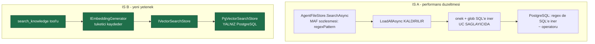
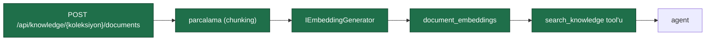

# Faz 51 — Vektör Bellek ve RAG (`pgvector`)

> **Durum:** 📋 Planlandı (2026-08-06)
> **Kaynak:** [UCUNCU-FAZ-ADAYLARI.md](UCUNCU-FAZ-ADAYLARI.md) · **F-30**
> **Önkoşul:** Yok
> **Paketler:** `AgentPrism.Abstractions`, `.Core`, `.Sql.Shared`, `.PostgreSql`, `.SqlServer`, `.Sqlite`, `.AspNetCore`
> **Yeni paket:** Yok · **Yeni NuGet:** 🚨 **Yok** — gerekçe [51.2](#512--sıfır-yeni-paket-ölçülmüş-gerekçe) · **Migration:** **gerekli** — PostgreSQL'de bir tablo + uzantı; SQL Server ve SQLite'ta **yok**
> **Public API:** büyüyor — bir arayüz, üç kayıt tipi, iki ayar. Faz 7'den önce ucuz

---

## Bu Faza Başlarken

> `faz-baslangic` skill'ini uygula. Aşağıdaki liste o skill'in 2. adımıdır —
> **tamamını değil, yalnız işaret edilen bölümleri oku.**

1. Bu doküman
2. Kararlar — dosyanın tamamını **okuma**, yalnız bu kalemleri grep'le:
   ```bash
   grep -n "K-007\|K-018\|K-104\|K-105\|K-110\|K-178\|K-181\|K-205\|K-211" docs/KARARLAR.md
   ```
   🚨 **K-105** (`ChatHistoryMemoryProvider` Faz 13 kapsamı dışında bırakıldı;
   yeniden açılma koşulu "bir `VectorStore` implementasyonu ve embedding
   sağlayıcısı seçildiğinde" — [51.5](#515--chathistorymemoryprovider-yine-bağlanamıyor--ölçülmüş-sebep)
   bu koşulun **karşılanmadığını** ölçümle gösterir),
   🚨 **K-211** (sürüm kayması gerçek bir çalışma anı hatasıdır — bu fazın
   paket kararının kaynağı), **K-205** (geçişli ağırlık nasıl tartılır),
   **K-007** (geçişli sabitleme kapalı), **K-110** (`TextSearchProvider` kod
   değişmeden kalıcı depoya döner), **K-181** (`AgentPrism.SqlServer` AOT
   uyumlu **değildir**; PostgreSql **uyumludur**), **K-178** (migration
   numaraları sağlayıcı başına bağımsız), **K-018** (bellek içi uygulama
   birinci sınıftır).
3. [`13-BAGLAM-SIKISTIRMA-VE-BELLEK.md`](13-BAGLAM-SIKISTIRMA-VE-BELLEK.md) — yalnız bellek
   sağlayıcıları bölümü ve devir notu:
   ```bash
   awk '/## Sonraki Faza Devir Notu/,0' docs/13-BAGLAM-SIKISTIRMA-VE-BELLEK.md
   ```
4. [`23-SQL-SERVER.md`](23-SQL-SERVER.md) — yalnız paylaşılan depo modeli
   bölümü. 🚨 Bu faz o modeli **bilinçli olarak kısmen kırar**; nasıl
   kırıldığını anlamak için önce nasıl kurulduğunu bilmek gerekir.
5. Alan hafızası (bu faz üç alana dokunuyor):
   [`hafiza/postgresql.md`](hafiza/postgresql.md) (**ana kaynak** — uzantı,
   indeks, `Npgsql` sürümü),
   [`hafiza/sql-saglayicilari.md`](hafiza/sql-saglayicilari.md)
   (🚨 paylaşılan depo modeli ve bu fazın onu nasıl böldüğü),
   [`hafiza/build-ve-analyzer.md`](hafiza/build-ve-analyzer.md)
   (🚨 `AgentPrism.PostgreSql` **AOT uyumludur** ve öyle kalmalıdır)
6. Gerektiğinde, tamamı değil ilgili bölümü:
   [`MIMARI.md`](MIMARI.md) — veri modeli bölümü

---

## Amaç

AgentPrism'de anlamsal arama yoktur. Bir agent'a doküman verip "buna göre
cevapla" demenin yolu yoktur; dosya belleği vardır ama araması **regex**'tir ve
her çağrıda **bütün dosyaları belleğe alır**.

Bu faz `pgvector` ile anlamsal aramayı getirir ve dosya aramasının O(n)
davranışını düzeltir. **PostgreSQL ile sınırlıdır** ve bu bir karardır —
gerekçe [51.3](#513--neden-yalnız-postgresql)'te yazılıdır.

- **F-30** — `pgvector` uzantısı, gömü (embedding) deposu, anlamsal arama
  tool'u ve dosya aramasının SQL'e indirilmesi.

### Bugün ne çalışmıyor — doğrulanmış kanıt

| Kanıt | Gözlem |
|---|---|
| [`SqlAgentFileStore.cs:156`](../src/AgentPrism.Sql.Shared/Stores/SqlAgentFileStore.cs) | 🚨 `SearchAsync` her çağrıda `LoadAllAsync` yapıyor — **tüm dosyalar belleğe alınıyor** — sonra her birine `new Regex(...)` uygulanıyor |
| [`SqlAgentFileStore.cs:118`](../src/AgentPrism.Sql.Shared/Stores/SqlAgentFileStore.cs) | 🚨 Aynı sorun `ListChildrenAsync`'te de var: `LoadAllAsync` + bellekte önek süzme. **İki metot**, tek desen |
| [`agent_files`](../src/AgentPrism.PostgreSql/Migrations/0006_attachments.sql) | `content text` sütunu; içerik üzerinde **hiçbir indeks yok** |
| [`MemorySettings.cs:7`](../src/AgentPrism.Abstractions/Agents/MemorySettings.cs) | "Vektor tabanli anlamsal bellek (MAF'in `ChatHistoryMemoryProvider`'i) **bilerek burada yoktur**" — K-105 |
| `grep -rn "VectorStore" src/ --include="*.cs"` | **Tek sonuç** ve o da bir XML doküman satırı. Somut uygulama yok |
| [`Directory.Packages.props`](../Directory.Packages.props) | `Npgsql` **10.0.3**. Vektör paketlerinin sürüm kayması buna göre ölçülür |

> Kanıtlar 2026-08-06 tarihinde doğrulandı.

🚨 **Aday listesinin bir iddiası düzeltilmelidir.** Liste "vektör destekli
`AgentFileStore.SearchAsync`" diyordu. Ölçüldü (MAF 1.16.0):

```
AgentFileStore.SearchAsync(String directory, String regexPattern,
                           String globPattern, Boolean recursive, CancellationToken)
```

**İkinci parametrenin adı `regexPattern`'dır.** MAF'ın sözleşmesi bir düzenli
ifade bekler; anlamsal bir sorgu o imzadan geçirilemez. Bu yüzden faz iki
**ayrı** işe bölünür ve ikisi karıştırılmaz:

| İş | Ne | Nerede |
|---|---|---|
| **A** | Regex aramasını SQL'e indir — O(n) sorunu | `AgentFileStore.SearchAsync` (MAF sözleşmesi korunur) |
| **B** | Anlamsal arama — yeni yetenek | **Yeni** bir AgentPrism yüzeyi ve bir tool |

---

## 51.1 — İki ayrı iş



**İş A üç sağlayıcıda da çalışır.** Önek ve glob süzgeci SQL'e inince
`LoadAllAsync` kalkar; PostgreSQL ayrıca `~` (POSIX regex) operatörüyle regex'i
de indirir. SQL Server ve SQLite'ta yerleşik regex yoktur; orada süzülmüş
küme bellekte regex'ten geçer — ama küme artık **tüm dosyalar** değildir.

**İş B yalnız PostgreSQL'dedir.**

## 51.2 — Sıfır yeni paket: ölçülmüş gerekçe

Üç aday ölçüldü (2026-08-06, `dotnet restore` + `project.assets.json`):

| Aday | Sürüm | Geçişli | 🚨 Sorun |
|---|---|---|---|
| `Microsoft.SemanticKernel.Connectors.PgVector` | **1.74.0-preview** | 7 | **Yalnız ön sürüm.** `Npgsql 8.0.7`'ye karşı derlenmiş; bizde **10.0.3**. Ayrıca `Microsoft.Extensions.AI.Abstractions 10.4.0` (bizde 10.8.3) |
| `Pgvector` | 0.3.2 (GA) | 3 | `Npgsql 8.0.5`'e karşı derlenmiş. **Aynı sürüm kayması** |
| `Microsoft.Extensions.VectorData.Abstractions` | 10.8.0 (GA) | 4 | Ağırlık sorun değil; ama tek başına işe yaramaz ([51.5](#515--chathistorymemoryprovider-yine-bağlanamıyor--ölçülmüş-sebep)) |

🚨 **`Npgsql` sürüm kayması bu depoda ÖLÇÜLMÜŞ bir hata sınıfıdır.** K-211:
`Azure.AI.OpenAI` 2.1.0, `OpenAI` 2.1.0'a karşı derlenmişti; biz 2.12.0
kullanıyorduk ve ilgili uzantıların **tamamı** çalışma anında
`MissingMethodException` verdi. Derleme yeşildi. Aynı desenin `Npgsql` 8 → 10
sıçramasında tekrarlanmayacağının garantisi yoktur.

**Karar: hiçbiri alınmaz.** `pgvector` metin biçimini kullanır:

```sql
-- yazma: gomu bir METIN parametresi olarak gonderilir ve SQL'de cast edilir
INSERT INTO {schema}.document_embeddings (..., embedding)
VALUES (..., @embedding::vector);

-- okuma: mesafe bir double olarak doner; ozel bir tip esleyici GEREKMEZ
SELECT id, source_id, chunk_index, content,
       embedding <=> @query::vector AS distance
  FROM {schema}.document_embeddings
 WHERE tenant_id = @tenant_id AND collection = @collection
 ORDER BY embedding <=> @query::vector
 LIMIT @top;
```

Kazanç üç katlıdır:

| Kazanç | Ayrıntı |
|---|---|
| **Sıfır yeni bağımlılık** | K-007 gerekçesi bile gerekmez |
| 🚨 **AOT duruşu korunur** | `AgentPrism.PostgreSql` AOT uyumludur. Tip eşleyici eklentileri yansımaya dayanabilir; metin biçimi dayanmaz |
| Sürüm kayması yok | Yalnız bizim `Npgsql` 10.0.3'ümüz kullanılır |

**Bedeli:** gömü metin olarak serileştirilir ve ikili biçimden biraz daha çok
bayt taşır. 🚨 **Bu maliyet ölçülmelidir** ve DoD'dedir; ölçüm ikili biçimi
haklı çıkarırsa karar yeniden değerlendirilir.

## 51.3 — Neden yalnız PostgreSQL

Faz 23 üç sağlayıcı için **paylaşılan** bir depo modeli kurdu:
`AgentPrism.Sql.Shared` içindeki bir `Sql*Store`, üç diyalektte aynı sorgu
ailesini çalıştırır. Vektör araması bu modeli **kırar**:

| Sağlayıcı | Vektör yolu | Durum |
|---|---|---|
| PostgreSQL | `pgvector` uzantısı, `vector` tipi, HNSW indeksi | Olgun, yaygın |
| SQL Server | Yerel `VECTOR` tipi | 🚨 **Ölçülmedi.** Sürüm ve sürücü desteği doğrulanmalı |
| SQLite | `sqlite-vec` uzantısı | 🚨 **Yerel kütüphane** ister. `SQLitePCLRaw` paketimiz onu taşımıyor |

**Karar (kullanıcı kararı, 2026-08-06): yalnız PostgreSQL.**

Sonuçlar açıkça yazılır ve sessiz bırakılmaz:

1. `IVectorSearchStore` **Abstractions**'a girer, **varsayılan uygulama yoktur**
   (K4). SQL Server ve SQLite tüketicisi kendi uygulamasını kaydedebilir.
2. 🚨 **`EnableVectorSearch = true` ile PostgreSQL olmayan bir kurulum
   açılışta HATA verir.** Sessizce boş sonuç dönmez — kullanıcı arama
   çalışıyor sanmamalıdır. Bu, K-034'ün üç kez tekrarladığı kuralın aynısıdır.
3. `document_embeddings` tablosu yalnız PostgreSQL migration setinde vardır.
   SQL Server ve SQLite setleri bu fazda **hiç değişmez**.

## 51.4 — Gömü sağlayıcısı tüketiciden gelir

AgentPrism bir embedding modeli **seçmez** ve bir sağlayıcı SDK'sı **almaz**.

```csharp
// tuketicinin kurulumu
builder.Services.AddSingleton<IEmbeddingGenerator<string, Embedding<float>>>(
    new OpenAIClient(apiKey).GetEmbeddingClient("text-embedding-3-small")
        .AsIEmbeddingGenerator());
```

Ölçülen imza (`Microsoft.Extensions.AI.Abstractions` 10.8.3 — **zaten
bağımlılıkta**):

```
IEmbeddingGenerator`2 : IEmbeddingGenerator, IDisposable
    virtual Task<GeneratedEmbeddings<TEmbedding>> GenerateAsync(
        IEnumerable<TInput> values, EmbeddingGenerationOptions options, CancellationToken ct)

Embedding`1 : Embedding  [sealed]
    prop Int32 Dimensions { get; }
    prop ReadOnlyMemory<T> Vector { get; set; }
```

Gerekçe K-032 ile aynıdır: model adları NuGet yayın hızından hızlı değişir.
Ayrıca gömü modeli seçimi **boyutu** belirler ve boyut şemaya girer.

🚨 **Boyut kurulum anında sabitlenir ve DEĞİŞTİRİLEMEZ.** `vector(1536)`
sütunu bir boyut taşır; modeli değiştirmek tüm gömüleri geçersiz kılar. Ayar
bunu açıkça söyler ve boyut uyuşmazlığı **yazma anında** hata verir; sessizce
yanlış sonuç döndürmez.

## 51.5 — `ChatHistoryMemoryProvider` yine bağlanamıyor — ölçülmüş sebep

K-105'in yeniden açılma koşulu şuydu: *"Bir `VectorStore` implementasyonu ve
embedding sağlayıcısı seçildiğinde."* Embedding sağlayıcısı çözüldü
([51.4](#514--gömü-sağlayıcısı-tüketiciden-gelir)). `VectorStore` **çözülmedi**
ve sebebi ölçüldü.

`Microsoft.Extensions.VectorData.Abstractions` 10.8.0:

```
VectorStore  [abstract]
    virtual VectorStoreCollection<TKey,TRecord> GetCollection(String name, VectorStoreCollectionDefinition definition)

VectorStoreCollection`2  [abstract]
    virtual IAsyncEnumerable<TRecord> GetAsync(
        Expression<Func<TRecord,Boolean>> filter, Int32 top,
        FilteredRecordRetrievalOptions<TRecord> options, CancellationToken ct)
```

🚨 **`Expression<Func<TRecord,bool>>` bir ifade ağacıdır ve SQL'e çevrilmesi
gerekir.** İki sonuç:

1. İfade ağacı yorumlamak `[RequiresDynamicCode]` sınıfına girer.
   **`AgentPrism.PostgreSql` AOT uyumludur** ve öyle kalmalıdır; bu kod oraya
   giremez.
2. Bir LINQ→SQL çevirici yazmak, bir ORM yazmaktır. Aday listesinin
   "Bilerek Önerilmeyenler" tablosu bu sınıfı zaten reddediyor: *"Kendi vektör
   veritabanımızı yazmak — depolama motoru yazmak kütüphane sınırının
   dışındadır."*

**Sonuç: K-105 bu faz için açık kalır.** `ChatHistoryMemoryProvider`
bağlanmaz. Faz, ihtiyacın **kendisini** karşılar (anlamsal arama) ama MAF'ın o
belirli sağlayıcısını bağlamaz. Bu bir eksiklik değil, ölçülmüş bir sınırdır ve
K-105'in metni kapanışta bu ölçümle **güncellenmelidir**.

## 51.6 — Anlamsal arama nasıl kullanılır

Yeni bir tool: `search_knowledge`. K2 korunur — tool **kodda** tanımlıdır;
arayüzden yazılamaz. Agent tanımından yalnız **açılır**:

```csharp
public sealed record MemorySettings
{
    public bool EnableFileMemory { get; init; }
    public bool EnableTodo { get; init; }
    public bool EnableTextSearch { get; init; }

    /// <summary>Anlamsal arama tool'unu acar. 🚨 Yalnizca PostgreSQL.</summary>
    public bool EnableVectorSearch { get; init; }

    /// <summary>Aranacak koleksiyon adi. Bos ise agent adi kullanilir.</summary>
    public string? VectorCollection { get; init; }
}
```

Belge yükleme bir **yönetim** işidir, agent'ın işi değil:



**Parçalama basittir ve bilinçli olarak öyledir:** sabit uzunlukta, örtüşmeli.
Akıllı parçalama (başlığa göre, anlama göre) ayrı bir uzmanlıktır ve tüketici
kendi parçalarını `chunks` alanıyla doğrudan gönderebilir.

---

## Planlanan Public API

> Taslak imzalardır. Gerçekleşen imzalar kapanışta ayrı bir bölüme yazılır.

```csharp
// AgentPrism.Abstractions/Knowledge/IVectorSearchStore.cs (YENI)

/// <summary>
/// Gomu (embedding) tabanli anlamsal arama deposu.
/// </summary>
/// <remarks>
/// <para>
/// 🚨 <strong>Varsayilan uygulama YOKTUR</strong> (K4). Tek somut uygulama
/// <c>AgentPrism.PostgreSql</c> icindedir ve <c>pgvector</c> uzantisini ister.
/// SQL Server ve SQLite tuketicisi kendi uygulamasini kaydedebilir.
/// </para>
/// <para>
/// Bu arayuz <c>Microsoft.Extensions.VectorData.VectorStore</c>'u SARMALAMAZ.
/// Olculdu (10.8.0): o tip <c>Expression&lt;Func&lt;TRecord,bool&gt;&gt;</c>
/// suzgeci ister; ifade agaci cevirmek AOT duruşunu bozar ve
/// <c>AgentPrism.PostgreSql</c> AOT uyumludur.
/// </para>
/// </remarks>
public interface IVectorSearchStore
{
    /// <summary>Deponun beklediği gomu boyutu.</summary>
    int Dimensions { get; }

    /// <summary>Parcalari gomuleriyle birlikte yazar. Ayni kaynak yeniden yazilirsa eskiler silinir.</summary>
    ValueTask UpsertAsync(
        string tenantId,
        string collection,
        string sourceId,
        IReadOnlyList<VectorChunk> chunks,
        CancellationToken cancellationToken = default);

    /// <summary>Gomuye en yakin parcalari dondurur.</summary>
    ValueTask<IReadOnlyList<VectorSearchHit>> SearchAsync(
        VectorSearchRequest request,
        CancellationToken cancellationToken = default);

    /// <summary>Bir kaynagin tum parcalarini siler.</summary>
    ValueTask<int> DeleteSourceAsync(
        string tenantId,
        string collection,
        string sourceId,
        CancellationToken cancellationToken = default);
}

/// <summary>Yazilacak tek bir parca.</summary>
public sealed record VectorChunk
{
    public required int Index { get; init; }
    public required string Content { get; init; }

    /// <summary>
    /// Parcanin gomusu. 🚨 Uzunlugu <see cref="IVectorSearchStore.Dimensions"/>
    /// ile AYNI olmalidir; degilse yazma hata verir.
    /// </summary>
    public required ReadOnlyMemory<float> Embedding { get; init; }

    /// <summary>Istege bagli ustveri. Suzme icin kullanilabilir.</summary>
    public IReadOnlyDictionary<string, string>? Metadata { get; init; }
}

/// <summary>Arama istegi.</summary>
public sealed record VectorSearchRequest
{
    public required string TenantId { get; init; }
    public required string Collection { get; init; }
    public required ReadOnlyMemory<float> QueryEmbedding { get; init; }

    /// <summary>Kac sonuc dondurulur.</summary>
    public int Top { get; init; } = 5;

    /// <summary>
    /// En buyuk kabul edilen kosinus mesafesi (0 = ayni, 2 = zit).
    /// <see langword="null"/> ise mesafe suzgeci uygulanmaz.
    /// </summary>
    public double? MaxDistance { get; init; }
}

/// <summary>Bir arama sonucu.</summary>
public sealed record VectorSearchHit
{
    public required string SourceId { get; init; }
    public required int ChunkIndex { get; init; }
    public required string Content { get; init; }

    /// <summary>Kosinus mesafesi. Kucuk deger daha yakin demektir.</summary>
    public required double Distance { get; init; }

    public IReadOnlyDictionary<string, string>? Metadata { get; init; }
}
```

```csharp
// AgentPrism.Abstractions/Agents/MemorySettings.cs — iki alan
public sealed record MemorySettings
{
    // ... mevcut alanlar
    public bool EnableVectorSearch { get; init; }
    public string? VectorCollection { get; init; }
}

// AgentPrism.Core — ayar
public sealed class AgentPrismKnowledgeOptions
{
    /// <summary>
    /// Gomu boyutu. 🚨 Sema ile birlikte SABITLENIR; degistirmek tum
    /// gomuleri gecersiz kilar.
    /// </summary>
    public int Dimensions { get; set; } = 1536;

    /// <summary>Parca uzunlugu (karakter).</summary>
    public int ChunkSize { get; set; } = 1000;

    /// <summary>Ardisik parcalarin ortusme uzunlugu (karakter).</summary>
    public int ChunkOverlap { get; set; } = 100;

    /// <summary>Tool'un dondurecegi en fazla sonuc sayisi.</summary>
    public int MaxResults { get; set; } = 5;
}
```

### Yeni tablo — yalnız PostgreSQL

```sql
CREATE EXTENSION IF NOT EXISTS vector;

CREATE TABLE IF NOT EXISTS {schema}.document_embeddings (
    id          uuid          NOT NULL PRIMARY KEY,
    tenant_id   text          NOT NULL,
    collection  text          NOT NULL,
    source_id   text          NOT NULL,
    chunk_index integer       NOT NULL,
    content     text          NOT NULL,
    metadata    jsonb         NOT NULL DEFAULT '{}'::jsonb,
    embedding   vector({dim}) NOT NULL,
    created_at  timestamptz   NOT NULL,
    CONSTRAINT document_embeddings_uq UNIQUE (tenant_id, collection, source_id, chunk_index)
);

CREATE INDEX IF NOT EXISTS document_embeddings_tenant_collection_idx
    ON {schema}.document_embeddings (tenant_id, collection);

-- Kosinus mesafesi icin HNSW. 🚨 Indeks olusturma buyuk tabloda uzun surer;
-- migration suresi OLCULMELIDIR.
CREATE INDEX IF NOT EXISTS document_embeddings_hnsw_idx
    ON {schema}.document_embeddings USING hnsw (embedding vector_cosine_ops);
```

🚨 **`metadata` `jsonb`'dir, `json` değil.** K-027'nin `$type` kuralı burada
**geçerli değildir**: bu alan polimorfik `ChatMessage` taşımaz, düz bir
`string → string` sözlüğüdür ve `jsonb`'nin indekslenebilirliği kazançtır.
Ayrımı bilerek yazmak gerekir; iki kural karıştırılırsa yanlış sütun tipi
seçilir.

🚨 **`vector({dim})` bir şablon değeridir.** Boyut yapılandırmadan gelir ve
migration'a **kurulum anında** yazılır. Migration çalıştıktan sonra boyutu
değiştirmek yeni bir migration ister; ayar bunu açıkça söyler.

### HTTP `endpoint`'leri

| Metot | Yol | Rol | Ne yapar |
|---|---|---|---|
| `POST` | `/api/knowledge/{collection}/documents` | Operator | Belge yükler; parçalar, gömüler ve yazar |
| `GET` | `/api/knowledge/{collection}/documents` | Reader | Kaynakları listeler |
| `DELETE` | `/api/knowledge/{collection}/documents/{sourceId}` | Operator | Bir kaynağın tüm parçalarını siler |
| `POST` | `/api/knowledge/{collection}/search` | Reader | Anlamsal arama — teşhis ve kalibrasyon için |

### Arayüz payı

**Yok.** Bu faz arayüze dokunmaz. Belge yönetimi için bir ekran değerlidir ama
ayrı bir iştir; bundle payı ve kapsam bu fazı iki katına çıkarır. Yeni bir
aday kalemidir.

---

## Planlanan Dosya Listesi

```
src/AgentPrism.Abstractions/Knowledge/
├── IVectorSearchStore.cs               (YENI)
├── VectorChunk.cs                      (YENI)
├── VectorSearchRequest.cs              (YENI)
└── VectorSearchHit.cs                  (YENI)

src/AgentPrism.Abstractions/
├── Agents/MemorySettings.cs            (iki alan)
└── Retention/RetentionTargets.cs       (document_embeddings hedefi)

src/AgentPrism.Core/Knowledge/
├── AgentPrismKnowledgeOptions.cs       (YENI)
├── TextChunker.cs                      (YENI — sabit uzunluk + ortusme)
├── KnowledgeIngestionService.cs        (YENI — parcala, gomule, yaz)
└── VectorSearchTool.cs                 (YENI — search_knowledge, K2: KODDA)

src/AgentPrism.Core/Compilation/
└── AgentDefinitionCompiler.cs          (EnableVectorSearch -> tool baglanir)

src/AgentPrism.PostgreSql/
├── Stores/PgVectorSearchStore.cs       (YENI — TEK somut uygulama)
├── Internal/PostgresQueries.cs         (vektor sorgulari + regex indirme)
├── AgentPrismPostgreSqlBuilderExtensions.cs   (TryAddSingleton)
└── Migrations/NNNN_vector.sql          (YENI — uzanti + tablo + indeks)

src/AgentPrism.Sql.Shared/Stores/
└── SqlAgentFileStore.cs                (🚨 LoadAllAsync KALDIRILIR — IS A)

src/AgentPrism.SqlServer/Internal/SqlServerQueries.cs   (IS A: onek + glob SQL'e)
src/AgentPrism.Sqlite/Internal/SqliteQueries.cs         (IS A: ayni)

src/AgentPrism.AspNetCore/
├── Endpoints/KnowledgeEndpoints.cs     (YENI)
└── Contracts/KnowledgeContracts.cs     (YENI)
```

🚨 **`AgentPrism.SqlServer` ve `AgentPrism.Sqlite` migration setleri bu fazda
DEĞİŞMEZ.** Yalnız sorgu dosyaları İş A için güncellenir.

---

## Testler

| Test sınıfı | Neyi doğrular |
|---|---|
| `AgentFileSearchNoLoadAllTests` | 🚨 **İş A.** `SearchAsync` artık `LoadAllAsync` çağırmaz; 10 000 dosyalı bir depoda tek dosya araması sabit sayıda satır okur |
| `AgentFileListChildrenNoLoadAllTests` | 🚨 Aynı düzeltme `ListChildrenAsync` için de yapıldı |
| `AgentFileSearchContractTests` | 🚨 İş A davranışı **değiştirmez**: aynı regex, aynı sonuç kümesi. Üç sağlayıcıda ve bellek içinde |
| `AgentFileSearchPostgresRegexTests` | PostgreSQL'de regex SQL'e iner (`~`); sonuç .NET `Regex` ile **aynı** |
| `VectorStoreContractTests` | `IVectorSearchStore` sözleşmesi — PostgreSQL üzerinde (tek uygulama) |
| `VectorDimensionMismatchTests` | 🚨 Yanlış boyutlu gömü yazma **hata verir**; sessizce kesilmez |
| `VectorTenantIsolationTests` | 🚨 Bir kiracının koleksiyonu diğerine **sızmaz**. Faz 41'in sözleşme testi bu depoyu da kapsar |
| `VectorSearchOrderTests` | Sonuçlar mesafeye göre artan sırada; `MaxDistance` süzgeci çalışır |
| `VectorUpsertReplacesTests` | Aynı `sourceId` yeniden yazılınca eski parçalar silinir |
| `VectorDeleteSourceTests` | `DeleteSourceAsync` yalnız o kaynağı siler |
| `VectorSearchToolTests` | `EnableVectorSearch = true` ile `search_knowledge` tool'u agent'a bağlanır |
| `VectorSearchToolDisabledTests` | Varsayılan kapalıyken tool bağlanmaz |
| `VectorSearchWrongProviderTests` | 🚨 `EnableVectorSearch = true` + SQLite → **açılışta hata**; sessizce boş sonuç dönmez |
| `VectorNoEmbeddingGeneratorTests` | 🚨 `IEmbeddingGenerator` kayıtlı değilken açılışta anlaşılır hata |
| `TextChunkerTests` | Örtüşmeli parçalama; sınırda karakter kaybı yok |
| `KnowledgeRetentionTests` | `document_embeddings` saklama hedefi olarak tanınır |
| `VectorAotTests` | 🚨 `AgentPrism.PostgreSql` AOT uyarısı üretmez |
| `DependencyDirectionTests` | 🚨 Hiçbir projeye yeni NuGet bağımlılığı eklenmedi |

🚨 **Vektör testleri Testcontainers ile `pgvector` uzantısı taşıyan bir imaj
ister** (`pgvector/pgvector:pg17` veya eşdeğeri). Bugünkü PostgreSQL imajı bu
uzantıyı taşımıyor olabilir; **ölçülmeli** ve gerekiyorsa test fixture'ı
güncellenmelidir.

---

## Açık Sorular

> Planı bloklamayan, faz uygulanırken karara bağlanacak sorular. Bloklayan
> sorular plan yazılmadan **önce** soruldu (sağlayıcı kapsamı, paket seçimi).

| # | Soru | Seçenekler | Öneri |
|---|---|---|---|
| 1 | İş A ve İş B aynı fazda mı kalsın? | A: **evet** · B: İş A ayrı bir faza | **A.** İkisi de `SqlAgentFileStore`'un aynı zayıflığından doğuyor ve aynı dosyalara dokunuyor. Ayırmak `SqlAgentFileStore`'u iki kez değiştirmek olurdu. Ama DoD'de **ayrı** ölçütlerdir |
| 2 | Gömü ikili mi metin mi gönderilsin? | A: **metin** (`::vector` cast) · B: ikili | **A.** Sıfır bağımlılık ve AOT güvenliği. 🚨 Fark **ölçülmeli**; ikili biçim anlamlı bir kazanç verirse karar yeniden değerlendirilir ve o zaman `Pgvector` paketinin `Npgsql` sürüm kayması tekrar tartılır |
| 3 | HNSW mi IVFFlat mı? | A: **HNSW** · B: IVFFlat | **A.** HNSW eğitim gerektirmez ve küçük veride de çalışır; IVFFlat liste sayısı ayarı ister ve boş tabloda kötü davranır. 🚨 İndeks oluşturma süresi **ölçülmelidir** |
| 4 | Parçalama sunucuda mı istemcide mi? | A: **ikisi de** · B: yalnız sunucu | **A.** Basit parçalama sunucuda; tüketici kendi parçalarını `chunks` alanıyla gönderebilir. Akıllı parçalama kütüphane sınırının dışındadır |
| 5 | Belge yükleme kotaya girsin mi? | A: **evet, gömü maliyeti sayılır** · B: hayır | **A.** Gömü bir model çağrısıdır ve para harcar. Faz 20'nin fiyat modeli embedding modellerini **tanımıyor** olabilir; **ölçülmeli** |
| 6 | Koleksiyon adı serbest metin mi? | A: **doğrulanmış** (`^[a-zA-Z0-9_-]+$`) · B: serbest | **A.** Koleksiyon adı sorguya girer ve arayüzden gelebilir. Faz 22'nin `[GeneratedRegex]` doğrulaması yeniden kullanılır |
| 7 | `search_knowledge` sonuçları çalıştırma kaydına yazılsın mı? | A: **evet, tool çağrısı olarak** | **A.** Zaten bir tool'dur; `tool_invocations` kendiliğinden yazar. Ek bir mekanizma gerekmez |
| 8 | Boyut değişirse ne olur? | A: **açılışta hata** · B: otomatik migration | **A.** Boyut değişikliği tüm gömüleri geçersiz kılar; sessizce yeniden gömmek saatler sürebilir ve para harcar. Operatör bilinçli karar vermelidir |

---

## Bitiş Ölçütleri (DoD)

### İş A — performans düzeltmesi (üç sağlayıcı)

- [ ] 🚨 `SqlAgentFileStore.SearchAsync` ve `ListChildrenAsync` **`LoadAllAsync`
      çağırmaz**
- [ ] 10 000 dosyalı bir depoda tek dosya araması sabit sayıda satır okur;
      **okunan satır sayısı ölçüldü ve buraya yazıldı**
- [ ] Davranış **değişmedi**: aynı regex, aynı sonuç kümesi — bellek içi ve
      üç SQL sağlayıcısında
- [ ] PostgreSQL'de regex SQL'e iner ve sonuç .NET `Regex` ile aynı

### İş B — anlamsal arama (yalnız PostgreSQL)

- [ ] `pgvector` uzantısı migration ile kurulur; **HNSW indeks oluşturma
      süresi ölçüldü ve buraya yazıldı**
- [ ] Belge yüklenir, parçalanır, gömülür ve aranabilir
- [ ] 🚨 Yanlış boyutlu gömü yazma **hata verir**
- [ ] 🚨 Kiracı yalıtımı korunur — bir kiracının koleksiyonu diğerine sızmaz
- [ ] 🚨 `EnableVectorSearch = true` + SQLite/SQL Server → **açılışta hata**;
      sessizce boş sonuç dönmez
- [ ] 🚨 `IEmbeddingGenerator` kayıtlı değilken açılışta anlaşılır hata
- [ ] `search_knowledge` tool'u yalnız `EnableVectorSearch` ile bağlanır
- [ ] `document_embeddings` bir saklama hedefidir
- [ ] Aynı `sourceId` yeniden yüklenince eski parçalar silinir

### Ortak

- [ ] 🚨 **Hiçbir projeye yeni NuGet bağımlılığı eklenmedi**
      (`dotnet list package --include-transitive` ile doğrulandı)
- [ ] 🚨 `AgentPrism.PostgreSql` AOT uyarısı üretmez
- [ ] 🚨 **Metin biçimi ile ikili biçim arasındaki fark ölçüldü ve buraya
      yazıldı** (Açık Soru 2)
- [ ] SQL Server ve SQLite migration setleri **değişmedi**
- [ ] Dört doğrulama kapısı sıfır uyarı verir
- [ ] `samples/AgentPrism.Api` ile gerçek `run` yapıldı — bir belge yüklendi ve
      agent ona dayanarak cevap verdi; çıktı bu belgeye yazıldı
- [ ] `secret` taraması boş döndü

### Doğrulama komutları

```bash
# 0) pgvector uzantisi var mi
psql "$AGENTPRISM_CONN" -c "SELECT extname, extversion FROM pg_extension WHERE extname='vector';"

# 1) Belge yukle
curl -s -X POST http://localhost:5081/agentprism/api/knowledge/kurumsal/documents \
  -H "content-type: application/json" \
  -d '{"sourceId":"izin-politikasi",
       "text":"Yillik izin 14 gundur. Bes yildan sonra 20 gune cikar."}' | jq

# 2) Anlamsal arama — kelime esleşmesi OLMAYAN bir sorgu
curl -s -X POST http://localhost:5081/agentprism/api/knowledge/kurumsal/search \
  -H "content-type: application/json" \
  -d '{"query":"tatil hakkim ne kadar","top":3}' \
  | jq '.[] | {sourceId, chunkIndex, distance}'
#    "tatil" kelimesi belgede GECMIYOR; anlamsal arama yine de bulmali

# 3) Agent tool'u kullaniyor mu
RUN=$(curl -s -X POST http://localhost:5081/agentprism/api/agents/ik-asistani/run \
  -H "content-type: application/json" \
  -d '{"message":"kac gun tatilim var"}' | jq -r '.runId')
psql "$AGENTPRISM_CONN" -c \
  "SELECT tool_name FROM agentprism.tool_invocations WHERE run_id='$RUN';"
#    search_knowledge gorulmeli

# 4) 🚨 Kiraci yalitimi
curl -s -X POST http://localhost:5081/agentprism/api/knowledge/kurumsal/search \
  -H "content-type: application/json" -H "X-Tenant-Id: baska-kiraci" \
  -d '{"query":"tatil hakkim ne kadar"}' | jq 'length'
#    beklenen: 0

# 5) 🚨 Yanlis boyut hata vermeli
curl -s -o /dev/null -w "%{http_code}\n" -X POST \
  http://localhost:5081/agentprism/api/knowledge/kurumsal/documents \
  -H "content-type: application/json" \
  -d '{"sourceId":"x","chunks":[{"index":0,"content":"a","embedding":[0.1,0.2]}]}'
#    beklenen: 400

# 6) 🚨 IS A — LoadAllAsync kalkti mi (10 000 dosya ile)
#    Sorgu sayaci veya EXPLAIN ile olculur; sonuc belgeye yazilir
psql "$AGENTPRISM_CONN" -c \
  "EXPLAIN ANALYZE SELECT path, content FROM agentprism.agent_files
    WHERE tenant_id='default' AND agent_name='asistan'
      AND path LIKE 'docs/%' AND content ~ 'izin';"

# 7) 🚨 Yeni bagimlilik YOK
dotnet list AgentPrism.slnx package --include-transitive \
  | grep -Ei "pgvector|SemanticKernel|VectorData" || echo "TEMIZ"

# 8) HNSW indeks boyutu ve olusturma suresi
psql "$AGENTPRISM_CONN" -c \
  "SELECT pg_size_pretty(pg_relation_size('agentprism.document_embeddings_hnsw_idx'));"
```

---

## Riskler

| Risk | Önlem |
|------|-------|
| 🚨 `Npgsql` sürüm kayması çalışma anında `MissingMethodException` üretir (K-211) | **Hiçbir vektör paketi alınmaz**; metin biçimi + `::vector` cast kullanılır. `DependencyDirectionTests` yeni bağımlılık olmadığını doğrular |
| 🚨 `AgentPrism.PostgreSql` AOT duruşu bozulur | İfade ağacı yok, yansıma yok, tip eşleyici eklentisi yok. `VectorAotTests` doğrular |
| 🚨 Paylaşılan depo modeli kırılır ve üç sağlayıcı ayrışır | Kırılma **sınırlıdır**: yalnız İş B. İş A üçünde de çalışır. Sınır belgeye ve `IVectorSearchStore`'un XML dokümanına yazılır |
| SQLite/SQL Server kullanıcısı sessizce boş sonuç alır | 🚨 **Açılışta hata** verilir; sessiz yarım çalışma reddedildi |
| Gömü boyutu değişirse tüm veri geçersiz olur | Boyut şemadadır; uyuşmazlık **yazma anında** hata verir. Değiştirmek bilinçli bir migration ister |
| HNSW indeks oluşturma migration'ı uzun sürer | Süre **ölçülür** ve belgeye yazılır. Boş tabloda maliyet sıfırdır; mevcut kurulumda tablo yeni açıldığı için de sıfırdır |
| Gömü maliyeti fiyat modelinde görünmez | Faz 20'nin embedding modeli desteği **ölçülür** (Açık Soru 5) |
| Testcontainers imajı `pgvector` taşımıyor | 🚨 **Ölçülmeli**; gerekirse `pgvector/pgvector` imajına geçilir. Bu bir DoD kalemidir |
| Belge içeriği hassas olabilir | `document_embeddings` bir saklama hedefidir; kiracı yalıtımı sözleşme testiyle kapatılır |
| Koleksiyon adı SQL'e enjekte edilir | Ad `[GeneratedRegex]` ile doğrulanır ve parametre olarak geçirilir |

---

<!-- ============================================================
     AŞAĞISI KAPANIŞTA DOLDURULUR — `faz-tamamlama` skill'i.
     Plan anında boş kalır. Başlıkları SİLME.
     ============================================================ -->

## Plandan Sapmalar

> Kapanışta doldurulur. Plan ile gerçek arasındaki fark **gizlenmez** — sonraki
> oturumun en değerli bilgisidir.

## Bu Fazda Verilen Kararlar

> Kapanışta doldurulur. K-NNN numaraları burada alınır; plan numara rezerve etmez.
>
> **Not:** Dört karar **mutlaka** kayda geçmelidir:
> 1. 🚨 **Sıfır yeni paket** ve ölçülen gerekçe: `SK.Connectors.PgVector`
>    ön sürüm + `Npgsql 8.0.7`; `Pgvector` 0.3.2 + `Npgsql 8.0.5`; bizde
>    10.0.3. K-211'in ikinci uygulamasıdır.
> 2. 🚨 **K-105 GÜNCELLENIR.** `ChatHistoryMemoryProvider` yine bağlanmadı ve
>    sebep artık ölçülmüştür: `VectorStoreCollection<TKey,TRecord>`
>    `Expression<Func<TRecord,bool>>` süzgeci istiyor ve ifade ağacı çevirmek
>    AOT duruşunu bozuyor. Kararın "yeniden açılma koşulu" bu ölçümle
>    değiştirilmelidir.
> 3. **Yalnız PostgreSQL** kararı ve üç sağlayıcının ayrıştığı nokta.
> 4. **Metin biçimi vs ikili** ölçümünün sonucu.

## Gerçekleşen Public API

> Kapanışta doldurulur. Koddaki **gerçek** imzalar.

## Dosya Listesi (gerçekleşen)

> Kapanışta doldurulur.

## Sonraki Faza Devir Notu

> Kapanışta doldurulur: devralınan sözleşmeler, bilinen tuzaklar (🚨), yarım
> kalan işler, sıradaki faz.
>
> **Not:** Dört devir bilgisi zorunludur:
> 1. 🚨 **`IVectorSearchStore`'un SQL Server ve SQLite uygulaması yoktur** ve
>    bu yeni bir aday kalemidir. SQL Server'ın yerel `VECTOR` tipi ve
>    SQLite'ın `sqlite-vec` uzantısı **ölçülmemiştir**.
> 2. **Bilgi tabanı arayüz ekranı** yeni bir aday kalemidir; bu faz arayüze
>    hiç dokunmadı.
> 3. **Akıllı parçalama** (başlığa/anlama göre) bilerek kapsam dışıdır.
> 4. **Aday listesindeki F-67** (performans regresyon kapısı) İş A'nın
>    düzelttiği yolu ilk hedefi olarak sayıyor. Bu fazda ölçülen "okunan satır
>    sayısı" o kapının başlangıç eşiğidir ve devir notuna **sayı olarak**
>    yazılmalıdır.
