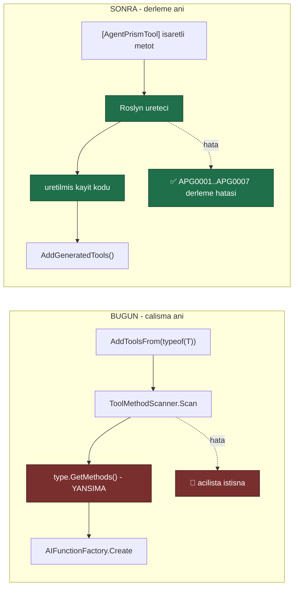

# Faz 52 — Tool Kaynak Üreteci ve Derleme Anı Doğrulama

> **Durum:** 📋 Planlandı (2026-08-06)
> **Kaynak:** [UCUNCU-FAZ-ADAYLARI.md](UCUNCU-FAZ-ADAYLARI.md) · **F-47**
> **Önkoşul:** Yok
> **Paketler:** `AgentPrism.Abstractions`, `.Core` (üreteç `.Core`'un nupkg'sinde taşınır)
> **Yeni paket:** 🚨 **Yok** — gerekçe [52.4](#524--üreteç-nerede-yaşar-yeni-paket-yok) · **Yeni NuGet:** `Microsoft.CodeAnalysis.CSharp` (`PrivateAssets=all`) · **Migration:** Yok
> **Public API:** büyüyor — bir arayüz, bir `partial` sınıf sözleşmesi, bir uzantı metodu. Faz 7'den önce ucuz

---

## Bu Faza Başlarken

> `faz-baslangic` skill'ini uygula. Aşağıdaki liste o skill'in 2. adımıdır —
> **tamamını değil, yalnız işaret edilen bölümleri oku.**

1. Bu doküman
2. Kararlar — dosyanın tamamını **okuma**, yalnız bu kalemleri grep'le:
   ```bash
   grep -n "K-007\|K-018\|K-068\|K-218" docs/KARARLAR.md
   ```
   🚨 **K-218** (tool bağımlılıkları **kurulum anında** alınır;
   `AIFunctionArguments.Services` MAF boru hattında **boştur**. Kararın
   yeniden açılma satırı şunu diyor: *"`ToolMethodScanner`'ın örnek-metot
   yolu ayrı bir işte onarılmalıdır"* — **bu faz o iştir**),
   **K-007** (yeni NuGet gerekçe ister), **K-068** (`EnablePublicApiTracking`
   `false`), **K-018** (bellek içi/yerleşik uygulama birinci sınıftır).
3. Alan hafızası (bu faz iki alana dokunuyor):
   [`hafiza/build-ve-analyzer.md`](hafiza/build-ve-analyzer.md)
   (**ana kaynak** — analyzer tanıları, `TreatWarningsAsErrors`, AOT işaretleri,
   nupkg yerleşimi),
   [`hafiza/cekirdek-calistirma.md`](hafiza/cekirdek-calistirma.md)
   (🚨 K-218'in ölçüm anlatısı — tool'un gördüğü servis sağlayıcı boştur)
4. 🚨 [`MEMORY.md`](../MEMORY.md) — **"Dört kapının dördünü de çalıştır"**
   maddesi bu fazın **doğrudan konusudur**: *"Kaynak üreteci build'in analyzer
   geçişinde tanıyı gizleyebilir."* Bu ders bu fazdan **önce** öğrenildi;
   fazın kendisi onun kaynağıdır.
5. Gerektiğinde, tamamı değil ilgili bölümü:
   [`MIMARI.md`](MIMARI.md) — tool kaydı bölümü

---

## Amaç

`AgentPrism.Core` ve `AgentPrism.Abstractions` AOT uyumludur. İçlerinde **tek
bir yansıma noktası** kaldı ve o nokta tool kaydıdır. Yansıma iki bedel
ödetiyor: AOT vaadini `[RequiresUnreferencedCode]` ile çağırana devrediyor ve
bir sınıf hatasını **çalışma anına** erteliyor.

Bu faz kaydı derleme anına taşır. Ek kazanç, .NET'in Python ve TypeScript'te
karşılığı olmayan gücüdür: **tool tanımındaki hata derlemede yakalanır.**

- **F-47** — Roslyn kaynak üreteci, derleme anı tanıları ve `ToolMethodScanner`
  yansıma yolunun emekliye ayrılması.

### Bugün ne çalışmıyor — doğrulanmış kanıt

| Kanıt | Gözlem |
|---|---|
| `grep -rln "System.Reflection" src/AgentPrism.Core/ src/AgentPrism.Abstractions/` | 🚨 **Tek dosya:** [`ToolMethodScanner.cs`](../src/AgentPrism.Core/Tools/ToolMethodScanner.cs). İki AOT uyumlu paketteki tek yansıma noktası |
| [`ToolMethodScanner.cs:34-35`](../src/AgentPrism.Core/Tools/ToolMethodScanner.cs) | `[RequiresUnreferencedCode]` + `[RequiresDynamicCode]`. Uyarı bastırılmıyor, **çağırana iletiliyor** — yani tüketicinin AOT derlemesi uyarı alıyor |
| [`IAgentPrismBuilder.cs:64-67`](../src/AgentPrism.Core/IAgentPrismBuilder.cs) | "**Statik siniflar tur argumani olamaz** (C# kurali). Tool'lariniz `static class` icindeyse `AddToolsFrom(Type)` asiri yuklemesini kullanin" — `AddToolsFrom<T>()` en doğal yazımda **derlenmiyor** |
| [`ToolMethodScanner.cs:45`](../src/AgentPrism.Core/Tools/ToolMethodScanner.cs) | `type.GetMethods(Flags)` — çalışma anında tarama |
| [`ToolMethodScanner.cs:60-65`](../src/AgentPrism.Core/Tools/ToolMethodScanner.cs) | "İşaretli metot yok" hatası **çalışma anındadır**. Derleme yeşil, uygulama açılışta patlar |
| [`ToolMethodScanner.cs:73-78`](../src/AgentPrism.Core/Tools/ToolMethodScanner.cs) | Generic metot denetimi de **çalışma anındadır** |

> Kanıtlar 2026-08-06 tarihinde doğrulandı.

### 🚨 Doğrulanmış bir kusur: örnek metot tool'ları çalışmıyor

K-218 (2026-08-05) ölçtü: MAF, `AIFunctionArguments.Services` olarak
`Microsoft.Extensions.AI.EmptyServiceProvider` geçiriyor. Kararın yan bulgusu
şuydu:

> "`ToolMethodScanner` **örnek metot** tool'larını da `arguments.Services` ile
> çözer, dolayısıyla onlar da çalışmaz — depoda hiç örnek-metot tool'u
> olmadığı için hiç görülmedi."

Kod bugün hâlâ öyle
([`ToolMethodScanner.cs:95-105`](../src/AgentPrism.Core/Tools/ToolMethodScanner.cs)):

```csharp
return AIFunctionFactory.Create(
    method,
    arguments => arguments.Services is { } services
        ? ActivatorUtilities.GetServiceOrCreateInstance(services, type)
        : throw new AgentPrismException(...),
    options);
```

🚨 **Koruma çalışmıyor.** `arguments.Services` **`null` değildir** — boş bir
sağlayıcıdır. `is { } services` deseni `true` döner, `throw` dalına hiç
girilmez ve `GetServiceOrCreateInstance` ya bağımlılıksız bir nesne kurar ya da
anlaşılmaz bir hata verir. Yazılan hata mesajı **hiçbir zaman görülmez**.

🚨 **Ayrıca doküman kodla çelişiyor.**
[`ToolMethodScanner.cs:21-24`](../src/AgentPrism.Core/Tools/ToolMethodScanner.cs)
şöyle diyor:

> "Ornek metotlarinda tasiyici nesne her cagride `AIFunctionArguments.Services`
> uzerinden cozulur; boylece tool sinifi bagimlilik enjeksiyonundan servis
> alabilir"

Bu cümle K-218 tarafından **yanlışlanmıştır**. `AGENTS.md`'nin kuralı nettir:
doküman ile kod çelişirse doküman yanlıştır ve koda göre düzeltilir. Burada
**ikisi de** düzeltilir — kod K-218'e uyacak biçimde, doküman koda göre.

---

## 52.1 — Ne değişir



## 52.2 — Derleme anı tanıları

Üretecin asıl değeri **ürettiği kod değil, verdiği hatalardır**.

| Kod | Ne yakalar | Bugün nerede ortaya çıkıyor |
|---|---|---|
| `APG0001` | Tool adı **çakışması** (aynı ad iki metotta) | 🚨 Hiçbir yerde — son kayıt sessizce kazanıyor olabilir |
| `APG0002` | Tool adı geçersiz karakter taşıyor | Çalışma anı veya sağlayıcı hatası |
| `APG0003` | Desteklenmeyen parametre tipi (serileştirilemez) | Model çağrısı sırasında |
| `APG0004` | Metot **generic** | Çalışma anı ([`ToolMethodScanner.cs:73`](../src/AgentPrism.Core/Tools/ToolMethodScanner.cs)) |
| `APG0005` | İşaretli metot **yok** | Çalışma anı ([`ToolMethodScanner.cs:60`](../src/AgentPrism.Core/Tools/ToolMethodScanner.cs)) |
| `APG0006` | XML `<summary>` veya `Description` eksik | Hiçbir yerde. Model tool'u ne zaman çağıracağını bilemez |
| `APG0007` | 🚨 **Örnek metot** işaretlenmiş | Hiçbir yerde — **sessizce bozuk** (K-218) |

🚨 **`APG0007` bu fazın en değerli tanısıdır.** K-218'in yan bulgusunu
"depoda hiç örnek-metot tool'u olmadığı için hiç görülmedi" durumundan
"**derlemede yakalanır**" durumuna taşır. Tanı, `IServiceProvider`'ı kurucuda
alan doğru deseni gösterir:

```
APG0007: 'OrderTools.GetStatus' bir ornek metodudur ve tool olamaz.
         MAF, AIFunctionArguments.Services olarak bos bir saglayici gecirir
         (karar K-218). Metodu `static` yapin veya tool'u kurulum aninda
         ornekleyin:
             services.AddSingleton(p => new AgentPrismToolRegistration(
                 AIFunctionFactory.Create(new OrderTools(p).GetStatus), ...));
```

**Şiddet seçimi:** `APG0006` (eksik açıklama) bir **uyarıdır**, diğerleri
**hatadır**. 🚨 Ama bu repoda `TreatWarningsAsErrors` açıktır; uyarı burada
zaten hatadır. Tüketicinin projesinde uyarı kalır ve bilerek bastırılabilir.

## 52.3 — Üretilen kod nasıl çağrılır

Üreteç, işaretli metot taşıyan her sınıf için bir `partial` uzantı üretir ve
hepsini tek bir giriş noktasında toplar:

```csharp
// tuketicinin kodu
internal static class OrderTools
{
    [AgentPrismTool("get_order_status", "Bir siparisin kargo durumunu dondurur.")]
    public static string GetOrderStatus(string orderId) => "kargoda";
}

// kurulum — YANSIMA YOK, AOT UYARISI YOK
builder.Services.AddAgentPrism()
    .AddGeneratedTools();      // ureteclerin urettigi kayitlarin TAMAMI
```

🚨 **`AddGeneratedTools()` derlemeye özeldir.** Üreteç onu tüketicinin
derlemesinde üretir; `AgentPrism.Core` içinde tanımlı değildir. Bu, kaynak
üreteçlerinin standart desenidir ve bir `partial` sınıf üzerinden çalışır.

### `AddToolsFrom` ne olur

**Kaldırılmaz.** İki gerekçe:

1. Faz 7 (yayın) henüz olmadı ama API zaten belgelenmiş ve örneklerde
   kullanılıyor; sessizce kaldırmak sürprizdir.
2. Bir tool sınıfı **başka bir derlemede** olabilir; üreteç oraya bakamaz.
   Yansıma yolu bu durum için meşru bir kaçış kapısıdır.

`AddToolsFrom` `[Obsolete]` **yapılmaz** — kullanımı meşrudur. XML dokümanı
`AddGeneratedTools()`'u önerir ve yansıma yolunun AOT bedelini yazar.

🚨 **Ama K-218 kusuru onarılır:** yansıma yolunda **örnek metot artık kabul
edilmez** ve `AgentPrismException` açıkça atılır. Bugünkü ölü `throw` dalı,
`arguments.Services` boş bir sağlayıcı olduğu için hiç çalışmıyor; denetim
**tarama anına** alınır ve orada kesin çalışır.

## 52.4 — Üreteç nerede yaşar: yeni paket yok

Üç seçenek tartıldı:

| Seçenek | Sonuç |
|---|---|
| Ayrı NuGet paketi (`AgentPrism.Generators`) | ❌ Tüketicinin **ikinci bir `PackageReference`** yazması gerekir. Unutulursa hiçbir şey üretilmez ve sebebi anlaşılmaz. Ayrıca `faz-tamamlama`'nın paket kontrol listesi (README, slnx, meta paket, `DependencyDirectionTests`) devreye girer |
| `AgentPrism.Abstractions` içinde | ❌ Üreteç `netstandard2.0` hedefler; `Abstractions` `net10.0`'dır. Aynı projede iki hedef karmaşası |
| ✅ **Ayrı proje, `AgentPrism.Core`'un nupkg'sinde taşınır** | Tüketici `AgentPrism.Core`'u alır, üreteç kendiliğinden çalışır. Ek paket referansı yok |

```xml
<!-- src/AgentPrism.Core/AgentPrism.Core.csproj -->
<ItemGroup>
  <ProjectReference Include="../AgentPrism.Generators/AgentPrism.Generators.csproj"
                    PrivateAssets="all"
                    ReferenceOutputAssembly="false"
                    OutputItemType="Analyzer" />
</ItemGroup>

<ItemGroup>
  <None Include="$(OutputPath)../../../AgentPrism.Generators/$(Configuration)/netstandard2.0/AgentPrism.Generators.dll"
        Pack="true" PackagePath="analyzers/dotnet/cs" Visible="false" />
</ItemGroup>
```

🚨 **`AgentPrism.Generators` projesi `IsPackable=false`'tır ve slnx'e girer
ama yayımlanmaz.** DLL, `AgentPrism.Core`'un nupkg'sinde
`analyzers/dotnet/cs/` altında taşınır. `System.Text.Json`'ın kendi üretecini
taşıma deseni budur.

### Yeni NuGet bağımlılığı

| Paket | Sürüm | Nereye | Geçişli etki |
|---|---|---|---|
| `Microsoft.CodeAnalysis.CSharp` | **4.14.0** | Yalnız `AgentPrism.Generators` | 🚨 **Sıfır** — `PrivateAssets="all"` ve proje `IsPackable=false` |
| `Microsoft.CodeAnalysis.CSharp.SourceGenerators.Testing.XUnit` | 1.1.2 | Yalnız test projesi | Sıfır |

🚨 **Roslyn sürümü 4.14.0'dır, 5.x DEĞİL.** Kaynak üreteci, kendisini
yükleyen derleyicinin Roslyn sürümüyle **uyumlu veya ondan eski** olmalıdır.
Yeni bir sürüme bağlamak, eski SDK kullanan tüketicide üretecin **sessizce
yüklenmemesine** yol açar. `global.json` bugün `10.0.100` SDK'sını sabitliyor;
🚨 **o SDK'nın taşıdığı Roslyn sürümü uygulama anında ölçülmelidir** ve seçim
ona göre kesinleşir. `4.14.0` bir **taslaktır**.

## 52.5 — 🚨 Üretecin en büyük riski: dört kapı

`MEMORY.md`'nin "her oturumda geçerli" listesinde şu satır var:

> **Dört kapının dördünü de çalıştır.** `dotnet build` tek başına yeşil
> görünürken `dotnet format` 276 `IDE0055` hatası verdi. **Kaynak üreteci
> build'in analyzer geçişinde tanıyı gizleyebilir.**

Bu ders bu fazdan **önce** öğrenildi ve tam olarak bu fazı hedefliyor. Üç
somut önlem:

| Önlem | Neden |
|---|---|
| 🚨 **Üretilen kod `dotnet format`'ı geçmelidir** | Üretilen dosyalar analyzer geçişinden geçer. `IDE0055` yağmuru üretmemek için üreteç **biçimli** kod yazmalıdır |
| 🚨 **Üretilen dosyalar `<auto-generated/>` başlığı taşımalıdır** | Analyzer'ların üretilen kodu atlaması bu başlığa bağlıdır |
| 🚨 **Üretecin kendi testleri olmalıdır** | Aday listesi bunu yazıyor. Üreteci uygulama derlemesiyle test etmek, hatayı gizleyen tam olarak o geçiştir |

Ayrıca üreteç **hiçbir tanıyı yutmaz**: bir sınıf işlenemiyorsa sessizce
atlanmaz, bir tanı üretilir. Sessiz atlama, bugünkü çalışma anı hatasından
**daha kötüdür** — tool hiç kaydolmaz ve kimse fark etmez.

---

## Planlanan Public API

> Taslak imzalardır. Gerçekleşen imzalar kapanışta ayrı bir bölüme yazılır.

```csharp
// AgentPrism.Abstractions — mevcut oznitelige DOKUNULMAZ.
// AgentPrismToolAttribute bugunku hâliyle kalir; ureteci ayni isareti okur.

// AgentPrism.Core/IAgentPrismBuilder.cs — mevcut arayuze bir metot

public interface IAgentPrismBuilder
{
    // ... mevcut uyeler

    /// <summary>
    /// Kaynak ureteci tarafindan bulunan tool'lari kaydeder.
    /// </summary>
    /// <remarks>
    /// <para>
    /// 🚨 Yansima KULLANMAZ. AOT uyarisi uretmez ve tool tanimindaki hatalar
    /// derleme aninda yakalanir (APG0001–APG0007).
    /// </para>
    /// <para>
    /// Yalnizca <strong>bu derlemedeki</strong> isaretli metotlari bulur.
    /// Baska bir derlemedeki tool'lar icin
    /// <see cref="AddToolsFrom(Type)"/> kullanilir.
    /// </para>
    /// </remarks>
    IAgentPrismBuilder AddGeneratedTools();
}
```

🚨 **`IAgentPrismBuilder` public bir arayüzdür. Metot eklemek Faz 7'den
(yayın) sonra KIRICIDIR.** Faz 36 (`IRetentionStore`) ve Faz 45 (`IEvalStore`)
aynı uyarıyı taşıyor. Bu faz üçüncüsüdür ve yayından önce yapılması bu yüzden
önemlidir.

```csharp
// Uretilen kod — tuketicinin derlemesinde olusur (ornek)

// <auto-generated/>
#nullable enable

namespace AgentPrism.Generated;

internal static class AgentPrismGeneratedTools
{
    internal static global::System.Collections.Generic.IReadOnlyList<
        global::AgentPrism.AgentPrismToolRegistration> Create()
        => new global::AgentPrism.AgentPrismToolRegistration[]
        {
            new(
                global::Microsoft.Extensions.AI.AIFunctionFactory.Create(
                    global::MyApp.OrderTools.GetOrderStatus,
                    new global::Microsoft.Extensions.AI.AIFunctionFactoryOptions
                    {
                        Name = "get_order_status",
                        Description = "Bir siparisin kargo durumunu dondurur.",
                    }),
                requiresApproval: false,
                source: "generated"),
        };
}
```

🚨 **`AgentPrismToolRegistration`'ın `source` alanı `"generated"` yazar.**
Alan bugün var ([`AgentPrismToolRegistration.cs:41`](../src/AgentPrism.Abstractions/Tools/AgentPrismToolRegistration.cs))
ve teşhis için kullanılır; hangi tool'un nereden geldiği görünür olur.

### HTTP `endpoint`'leri

**Yok.** Bu faz bir derleme zamanı yeteneğidir.

### Arayüz payı

**Yok.**

---

## Planlanan Dosya Listesi

```
src/AgentPrism.Generators/                     (YENI PROJE, IsPackable=false)
├── AgentPrism.Generators.csproj               (netstandard2.0, Roslyn)
├── ToolRegistrationGenerator.cs               (IIncrementalGenerator)
├── ToolCandidate.cs                           (esdegerlik icin record)
├── ToolDiagnostics.cs                         (APG0001–APG0007)
├── ToolNameValidator.cs                       (ad kurallari)
├── ParameterTypeValidator.cs                  (serilestirilebilirlik)
└── SourceWriter.cs                            (bicimli cikti, <auto-generated/>)

src/AgentPrism.Core/
├── AgentPrism.Core.csproj                     (ureteci Analyzer olarak tasir + Pack)
├── IAgentPrismBuilder.cs                      (AddGeneratedTools)
├── AgentPrismBuilder.cs                       (uygulama)
└── Tools/ToolMethodScanner.cs                 (🚨 K-218 onarimi + XML dokuman duzeltmesi)

tests/AgentPrism.Generators.UnitTests/         (YENI TEST PROJESI)
├── AgentPrism.Generators.UnitTests.csproj
├── GeneratedOutputTests.cs
├── DiagnosticTests.cs                         (yedi tani ayri ayri)
└── SnapshotTests.cs                           (uretilen kod bit bit sabit)

samples/AgentPrism.Api/
└── Tools/                                     (AddGeneratedTools'a gecer)

AgentPrism.slnx                                (iki yeni proje)
Directory.Packages.props                       (Microsoft.CodeAnalysis.CSharp + test kutuphanesi)
```

---

## Testler

| Test sınıfı | Neyi doğrular |
|---|---|
| `GeneratedOutputTests` | İşaretli statik metot için doğru kayıt kodu üretilir |
| `GeneratedNameOverrideTests` | `[AgentPrismTool("ad")]` ile ad; işaretsizde metot adı |
| `GeneratedApprovalTests` | `RequiresApproval = true` üretilen koda geçer |
| `GeneratedSourceFieldTests` | Kayıt `source: "generated"` taşır |
| `DiagnosticDuplicateNameTests` | 🚨 `APG0001` — aynı tool adı iki metotta |
| `DiagnosticInvalidNameTests` | `APG0002` — geçersiz karakter |
| `DiagnosticUnsupportedParameterTests` | `APG0003` — serileştirilemez parametre |
| `DiagnosticGenericMethodTests` | `APG0004` — generic metot |
| `DiagnosticNoToolsTests` | `APG0005` — işaretli metot yok |
| `DiagnosticMissingDescriptionTests` | `APG0006` — **uyarı**, hata değil |
| `DiagnosticInstanceMethodTests` | 🚨 `APG0007` — örnek metot. Mesaj K-218'i ve doğru deseni gösterir |
| `GeneratorNeverSilentTests` | 🚨 İşlenemeyen bir sınıf **sessizce atlanmaz**; bir tanı üretilir |
| `GeneratedCodeFormatTests` | 🚨 Üretilen kod `dotnet format` kurallarına uyar (`IDE0055` yok) |
| `GeneratedCodeHeaderTests` | 🚨 Her üretilen dosya `<auto-generated/>` başlığı taşır |
| `GeneratedCodeAotTests` | 🚨 Üretilen kod `[RequiresUnreferencedCode]`/`[RequiresDynamicCode]` **gerektirmez** |
| `SnapshotTests` | Üretilen kod bit bit sabittir; kasıtsız değişiklik yakalanır |
| `IncrementalityTests` | Alakasız bir dosya değişince üreteç yeniden çalışmaz (`IIncrementalGenerator` sözleşmesi) |
| `ToolMethodScannerInstanceRejectionTests` | 🚨 **K-218 onarımı.** Yansıma yolunda örnek metot **tarama anında** reddedilir; bugünkü ölü `throw` dalı canlanır |
| `ToolMethodScannerStillWorksTests` | `AddToolsFrom` statik metotlarla çalışmaya devam eder |

🚨 **Üreteç testleri `Microsoft.CodeAnalysis.CSharp.SourceGenerators.Testing.XUnit`
ile yazılır ve ayrı bir projededir.** Uygulama derlemesiyle test etmek, aday
listesinin ve `MEMORY.md`'nin uyardığı gizleme riskini üretir.

---

## Açık Sorular

> Planı bloklamayan, faz uygulanırken karara bağlanacak sorular.

| # | Soru | Seçenekler | Öneri |
|---|---|---|---|
| 1 | Roslyn sürümü ne olmalı? | A: **4.14.0** · B: 5.0.0 | **A bir taslaktır.** 🚨 `global.json`'daki SDK 10.0.100'ün taşıdığı Roslyn sürümü **uygulama anında ölçülmelidir**. Üretecin Roslyn'i, yükleyen derleyicininkinden **yeni olamaz**; yeni olursa üreteç sessizce yüklenmez |
| 2 | `AddToolsFrom` `[Obsolete]` olsun mu? | A: **hayır** · B: evet | **A.** Başka bir derlemedeki tool'lar için meşru tek yoldur. XML dokümanı `AddGeneratedTools()`'u önerir ve AOT bedelini yazar |
| 3 | Üreteç `AgentPrism.Core`'un kendi tool'larını da üretsin mi? | A: **evet** · B: hayır | **A.** `AgentPrism.Core`'daki yerleşik tool'lar (dosya belleği, todo) üretecin **ilk tüketicisi** olur. Kendi ürettiğimizi kullanmak en iyi testtir |
| 4 | `APG0006` (eksik açıklama) uyarı mı hata mı? | A: **uyarı** · B: hata | **A.** Bu repoda `TreatWarningsAsErrors` zaten hata yapar; tüketicinin projesinde bastırılabilir kalmalıdır. Bir kütüphane, tüketicinin derlemesini kırma hakkını dikkatli kullanır |
| 5 | Desteklenen parametre tipleri nasıl belirlenir? | A: **beyaz liste** · B: kara liste | **A.** İlkel tipler, `string`, `DateTimeOffset`, `Guid`, enum, `record`/`class` (public parametresiz kurucu veya `[JsonConstructor]`), diziler ve `IReadOnlyList<T>`. Kara liste yeni tiplerde sessizce yanılır |
| 6 | Üretilen kayıt DI'a nasıl girer? | A: **`AddGeneratedTools()` çağrısıyla açık** · B: modül başlatıcıyla otomatik | **A.** `[ModuleInitializer]` sihirdir ve K1'i (sıfır sürpriz) zorlar. Açık çağrı ne olduğunu gösterir |
| 7 | `partial` sınıf mı, statik sınıf mı üretilsin? | A: **internal statik sınıf + uzantı metodu** · B: kullanıcının `partial` sınıfını doldur | **A.** B, kullanıcının sınıfını `partial` yazmasını gerektirir; bu bir sürprizdir ve derleme hatası olarak görünür |
| 8 | Örnek uygulama `AddGeneratedTools`'a geçsin mi? | A: **evet** | **A.** DoD'deki "örnek uygulamayla gerçek `run`" ölçütü ancak böyle gerçek bir kanıt üretir |

---

## Bitiş Ölçütleri (DoD)

- [ ] İşaretli statik metotlar için doğru kayıt kodu üretilir ve
      `AddGeneratedTools()` ile kaydolur
- [ ] 🚨 Üretilen kod `[RequiresUnreferencedCode]`/`[RequiresDynamicCode]`
      **gerektirmez**; AOT uyarısı **yok**
- [ ] Yedi tanının **her biri** ayrı bir testle doğrulandı (`APG0001`–`APG0007`)
- [ ] 🚨 `APG0007` örnek metotları derlemede yakalar ve mesaj K-218'in doğru
      desenini gösterir
- [ ] 🚨 **K-218 onarıldı:** yansıma yolunda örnek metot **tarama anında**
      reddedilir; `ToolMethodScanner`'ın yanlış XML dokümanı düzeltildi
- [ ] 🚨 İşlenemeyen bir sınıf **sessizce atlanmaz**; her zaman bir tanı üretilir
- [ ] 🚨 Üretilen kod `dotnet format --verify-no-changes` **geçer**
- [ ] 🚨 Her üretilen dosya `<auto-generated/>` başlığı taşır
- [ ] Üretecin **kendi test projesi** vardır ve uygulama derlemesinden bağımsız koşar
- [ ] `AgentPrism.Core`'un yerleşik tool'ları üreteçten geçer
- [ ] `AddToolsFrom` statik metotlarla **çalışmaya devam eder**
- [ ] 🚨 `AgentPrism.Generators` yayımlanmaz (`IsPackable=false`); DLL
      `AgentPrism.Core` nupkg'sinde `analyzers/dotnet/cs/` altındadır —
      **`dotnet pack` çıktısı açılıp doğrulandı**
- [ ] 🚨 `Microsoft.CodeAnalysis.CSharp` tüketicinin bağımlılık grafiğine
      **girmez** (`dotnet list package --include-transitive` ile doğrulandı)
- [ ] 🚨 **Roslyn sürüm uyumu ölçüldü** ve seçilen sürüm buraya yazıldı
- [ ] Dört doğrulama kapısı sıfır uyarı verir
- [ ] `samples/AgentPrism.Api` `AddGeneratedTools()` kullanır ve gerçek `run`
      yapıldı; çıktı bu belgeye yazıldı
- [ ] `secret` taraması boş döndü

### Doğrulama komutları

```bash
# 1) Uretilen kodu gor
dotnet build samples/AgentPrism.Api -c Release \
  -p:EmitCompilerGeneratedFiles=true \
  -p:CompilerGeneratedFilesOutputPath=obj/generated
find samples/AgentPrism.Api/obj/generated -name "*.g.cs" -exec head -30 {} \;

# 2) 🚨 Uretilen kod dotnet format'i geciyor mu
dotnet format samples/AgentPrism.Api --verify-no-changes --no-restore

# 3) 🚨 Roslyn surumu — SDK'nin tasidigiyla uyumlu mu
dotnet build src/AgentPrism.Generators -c Release -v n 2>&1 | grep -i "roslyn\|CodeAnalysis"
ls "$(dotnet --list-sdks | tail -1 | sed 's/.*\[//;s/\]//')/10.0.100/Roslyn/bincore/" 2>/dev/null | head

# 4) 🚨 nupkg icinde ureteç dogru yerde mi
dotnet pack src/AgentPrism.Core -c Release -o /tmp/apk
unzip -l /tmp/apk/AgentPrism.Core.*.nupkg | grep -i "analyzers/dotnet/cs"

# 5) 🚨 Roslyn tuketiciye SIZMAMALI
dotnet list samples/AgentPrism.Api package --include-transitive \
  | grep -i "CodeAnalysis" || echo "TEMIZ"

# 6) Tanilar — her biri ayri ayri (uretec test projesi)
dotnet test tests/AgentPrism.Generators.UnitTests -c Release

# 7) 🚨 Ornek metot artik derlemede yakalaniyor mu
cat > /tmp/apg0007.cs <<'EOF'
using AgentPrism;
internal sealed class BozukTool
{
    [AgentPrismTool("kotu")]
    public string Getir(string id) => id;   // ORNEK metot -> APG0007
}
EOF
cp /tmp/apg0007.cs samples/AgentPrism.Api/Tools/
dotnet build samples/AgentPrism.Api -c Release 2>&1 | grep APG0007
rm samples/AgentPrism.Api/Tools/apg0007.cs

# 8) AOT — uretilen yol uyari uretmemeli
dotnet publish samples/AgentPrism.Api -c Release -r osx-arm64 \
  -p:PublishAot=true 2>&1 | grep -Ei "IL2|IL3" || echo "AOT TEMIZ"

# 9) Ornek uygulama gercek run
curl -s -X POST http://localhost:5081/agentprism/api/agents/asistan/run \
  -H "content-type: application/json" \
  -d '{"message":"12345 numarali siparisim nerede"}' | jq '.text'
curl -s http://localhost:5081/agentprism/api/tools | jq '.[] | {name, source}'
#    source "generated" gorulmeli
```

---

## Riskler

| Risk | Önlem |
|------|-------|
| 🚨 **Üreteç build'in analyzer geçişinde tanıyı gizler** (`MEMORY.md`) | Ayrı test projesi, `dotnet format` kapısı, `<auto-generated/>` başlığı. Üç ayrı DoD kalemi |
| 🚨 Roslyn sürümü SDK'nınkinden yeniyse üreteç **sessizce yüklenmez** | Sürüm **ölçülür** ve buraya yazılır. Ayrı bir doğrulama komutu var |
| 🚨 `Microsoft.CodeAnalysis` tüketicinin grafiğine sızar | `PrivateAssets="all"` + `ReferenceOutputAssembly="false"` + `IsPackable=false`. `dotnet list package` ile doğrulanır |
| Üreteç bir sınıfı sessizce atlar ve tool hiç kaydolmaz | Sessiz atlama **yasaktır**; her başarısızlık bir tanı üretir. Ayrı test |
| Roslyn ayrı bir uzmanlıktır ve tahmini zor | Kapsam yedi tanı ve tek bir üretim deseniyle **sınırlıdır**. Artımlı üreteç (`IIncrementalGenerator`) sözleşmesi bir testle korunur |
| `AddGeneratedTools()` `IAgentPrismBuilder`'a metot ekler | 🚨 Faz 7'den sonra **kırıcıdır**; Faz 36 ve 45 ile aynı uyarı. Yayından önce yapılmalıdır |
| Üretilen kod tüketicinin `dotnet format` kapısını kırar | Üreteç biçimli yazar; örnek uygulama üzerinde ayrı bir doğrulama komutu koşar |
| Beyaz liste bir tipi haksız yere reddeder | `APG0003` mesajı desteklenen tipleri **listeler**; tüketici `AddTool(AIFunctionFactory.Create(...))` ile kaçış yolunu kullanabilir |
| `AgentPrism.Generators` yayımlanmaz ama slnx'e girer | `IsPackable=false`; `faz-tamamlama`'nın paket kontrol listesi yalnız yayımlanan paketler içindir ve bu proje o listeye **girmez** |

---

<!-- ============================================================
     AŞAĞISI KAPANIŞTA DOLDURULUR — `faz-tamamlama` skill'i.
     Plan anında boş kalır. Başlıkları SİLME.
     ============================================================ -->

## Plandan Sapmalar

> Kapanışta doldurulur. Plan ile gerçek arasındaki fark **gizlenmez** — sonraki
> oturumun en değerli bilgisidir.

## Bu Fazda Verilen Kararlar

> Kapanışta doldurulur. K-NNN numaraları burada alınır; plan numara rezerve etmez.
>
> **Not:** Üç karar **mutlaka** kayda geçmelidir:
> 1. 🚨 **K-218 GÜNCELLENIR.** Kararın yeniden açılma satırı
>    (*"`ToolMethodScanner`'ın örnek-metot yolu ayrı bir işte onarılmalıdır"*)
>    bu fazda kapandı. Onarımın nasıl yapıldığı — `arguments.Services` boş bir
>    sağlayıcı olduğu için `is { }` denetiminin **hiç çalışmadığı** ve denetimin
>    tarama anına alındığı — yazılmalıdır.
> 2. **Üreteç ayrı paket değildir**; `AgentPrism.Core`'un nupkg'sinde
>    `analyzers/dotnet/cs/` altında taşınır. Gerekçe ve `dotnet pack`
>    doğrulaması yazılmalıdır.
> 3. **Ölçülen Roslyn sürümü** ve SDK uyum kuralı.

## Gerçekleşen Public API

> Kapanışta doldurulur. Koddaki **gerçek** imzalar.

## Dosya Listesi (gerçekleşen)

> Kapanışta doldurulur.

## Sonraki Faza Devir Notu

> Kapanışta doldurulur: devralınan sözleşmeler, bilinen tuzaklar (🚨), yarım
> kalan işler, sıradaki faz.
>
> **Not:** Dört devir bilgisi zorunludur:
> 1. 🚨 **`AgentPrism.Core` ve `.Abstractions` artık yansımasızdır.** Bu, AOT
>    duruşunun tamamlandığı andır ve `MIMARI.md` ile
>    `hafiza/build-ve-analyzer.md` bunu yazmalıdır. Yeni bir yansıma noktası
>    eklemek bundan sonra bir **gerileme**dir.
> 2. **Üreteç altyapısı kuruldu** ve ikinci bir üreteç ucuzdur. Aday
>    listesindeki F-42 (yapılandırılmış çıktı,
>    [Faz 38](38-YAPILANDIRILMIS-CIKTI.md)) `JsonSerializerContext` üretimi
>    isteyebilir; aynı proje kullanılır, **ikinci bir üreteç projesi
>    açılmamalıdır**.
> 3. **`AddToolsFrom` yaşamaya devam ediyor** ve `[Obsolete]` değil. Faz 7'de
>    public yüzey dondurulurken bu bilinçli bir karardır.
> 4. **Örnek metot tool'ları hâlâ desteklenmiyor.** `APG0007` onu görünür
>    kıldı ama çözmedi. MAF `functionInvocationServices`'i `AsAIAgent`
>    üzerinden akıtırsa (K-218'in yeniden açılma koşulu) bu tanı kaldırılabilir.
