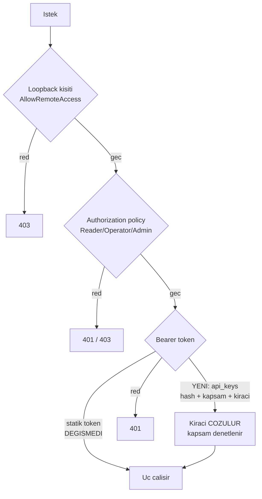
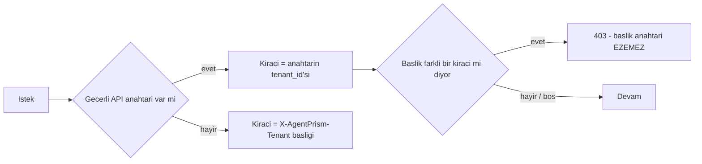

# Faz 53 — Kiracı Bazlı API Anahtarları ve Kapsamlar

> **Durum:** 📋 Planlandı (2026-08-08)
> **Kaynak:** [UCUNCU-FAZ-ADAYLARI.md](UCUNCU-FAZ-ADAYLARI.md) · **F-56**
> **Önkoşul:** [Faz 41](41-KIRACI-YALITIMININ-ZORLANMASI.md) — kiracı yalıtımı zemini · [Faz 50](50-DISA-ACILAN-AGENT-YUZEYI.md) — bu fazı **acil** kılan dış yüzey
> **Paketler:** `AgentPrism.Abstractions`, `AgentPrism.Core`, `AgentPrism.AspNetCore`, `AgentPrism.Sql.Shared`, `AgentPrism.UI`
> **Yeni paket:** Yok · **Migration:** gerekli — numara uygulama anında alınır (üç sağlayıcı için ayrı)
> **Public API:** büyüyor — yeni tipler ve bir depo arayüzü. Faz 7'den önce ucuz

---

## Bu Faza Başlarken

> `faz-baslangic` skill'ini uygula. Aşağıdaki liste o skill'in 2. adımıdır —
> **tamamını değil, yalnız işaret edilen bölümleri oku.**

1. Bu doküman
2. Kararlar — dosyanın tamamını **okuma**, yalnız bu kalemleri grep'le:
   ```bash
   grep -n "K-059\|K-280\|K-283\|K-355" docs/KARARLAR.md
   ```
   **K-059** (`secret` veritabanına yazılmaz; yalnız yapılandırma anahtarının **adı** durur),
   **K-280** (alt yazma yollarında ambient kiracıyla süzme **geri alındı**),
   **K-283** (bir depo davranışını değiştirmek çağıranı sessizce değiştirir),
   **K-355** (alt yazma yolları **beklenen** kiracıyı taşır)
3. [`50-DISA-ACILAN-AGENT-YUZEYI.md`](50-DISA-ACILAN-AGENT-YUZEYI.md) — yalnız devir notu:
   ```bash
   awk '/## Sonraki Faza Devir Notu/,0' docs/50-DISA-ACILAN-AGENT-YUZEYI.md
   ```
   Dış yüzeyin bugünkü geçici savunmasını (`ExternalSurfaceGuard`) devralıyorsun.
4. Alan hafızası (bu faz üç alana dokunuyor):
   [`hafiza/aspnetcore-di.md`](hafiza/aspnetcore-di.md) (uç filtresi, DI kaydı),
   [`hafiza/sql-saglayicilari.md`](hafiza/sql-saglayicilari.md) (üç sağlayıcı için migration),
   [`hafiza/frontend.md`](hafiza/frontend.md) (yeni ekran, sözlük anahtarları)
5. Gerektiğinde, tamamı değil ilgili bölümü:
   [`MIMARI.md`](MIMARI.md) — güvenlik bölümü (üç katmanlı erişim modeli)

---

## Amaç

AgentPrism'e gelen kimlik doğrulaması bugün **tek statik bearer token**'dır.
Bu token'ı bilen herkes bütün kiracıların bütün uçlarına erişir. Anahtar
döndürme, iptal, kapsam daraltma ve kiracıya bağlama yolu yoktur. Faz 50 bir
**dış yüzey** (MCP sunucusu, A2A) açtı ve o yüzeyi hâlâ bu tek token koruyor;
o faz geçici bir savunma koydu — `AllowRemoteAccess` açıkken dış yüzey
**hiç açılamıyor**. Bu faz o kilidi kaldırır.

- **F-56** — `api_keys` tablosu: hash saklanır, ham değer bir kez gösterilir;
  kiracı bağı, kapsam kümesi, süre sonu, iptal ve son kullanım damgası.

### Bugün ne çalışmıyor — doğrulanmış kanıt

| Kanıt | Gözlem |
|---|---|
| [`AgentPrismEndpointFilter.cs:21-22`](../src/AgentPrism.AspNetCore/Security/AgentPrismEndpointFilter.cs) | Filtre tek bir `_authToken` alanı taşır ve onu **kurulum anında** okur; çalışma anında ikinci bir kimlik kaynağı yoktur |
| [`AgentPrismEndpointFilter.cs:43`](../src/AgentPrism.AspNetCore/Security/AgentPrismEndpointFilter.cs) | `_allowRemoteAccess` de kurulum anında okunur; erişim kuralları çalışma anında gevşeyemez (korunacak davranış) |
| [`ExternalSurfaceGuard.cs:40`](../src/AgentPrism.AspNetCore/Security/ExternalSurfaceGuard.cs) | `AllowRemoteAccess` açıkken dış yüzey açılamıyor; red mesajı gerekçeyi **açıkça** "tek statik bearer token" diye yazıyor |
| [`BearerTokenValidator.cs:62`](../src/AgentPrism.AspNetCore/Security/BearerTokenValidator.cs) | Karşılaştırma `CryptographicOperations.FixedTimeEquals` ile sabit zamanlıdır — **korunacak** bir davranıştır |
| [`AgentPrismPolicies.cs:34-40`](../src/AgentPrism.AspNetCore/Security/AgentPrismPolicies.cs) | Üç rol politikası (`Reader`, `Operator`, `Admin`) vardır; bu faz onların **alternatifi değil**, ikinci bir kimlik kaynağıdır |
| [`AgentPrismTenancyOptions.cs:50`](../src/AgentPrism.AspNetCore/Tenancy/AgentPrismTenancyOptions.cs) | Kiracı bugün `X-AgentPrism-Tenant` başlığından çözülür — yani **istemcinin beyanıdır**, doğrulanmaz |

> Kanıtlar 2026-08-08 tarihinde doğrulandı.

🚨 **Son satır bu fazın asıl gerekçesidir.** Kiracı bugün bir başlıkla *beyan
edilir*. Anahtar kiracıya bağlandığında kiracı **kanıtlanır** hâle gelir.

---

## 53.1 — Üç katmanın neresine oturuyor

Bugünkü erişim modeli üç katmandır. Bu faz **ikinci katmanı** çoğaltır;
diğer ikisi değişmez.



**Statik token kaldırılmaz.** Tek örnekli, tek kiracılı bir kurulum bugünkü
gibi çalışmaya devam eder (K1 — sıfır sürpriz). API anahtarı **ikinci** bir
kimlik kaynağıdır; ikisi de tanımsızsa davranış bugünküyle aynıdır.

## 53.2 — Anahtarın anatomisi

Ham anahtar `ap_<kiraci-onek>_<32-bayt-base64url>` biçimindedir. Önek yalnız
**okunabilirlik** içindir; kimlik doğrulamada kullanılmaz.

| Alan | Neden |
|---|---|
| `id` | UUID v7 |
| `tenant_id` | Kiracı bağı. 🚨 Anahtar doğrulandığında kiracı **başlıktan değil buradan** çözülür |
| `name` | Operatörün anahtarı tanıması için |
| `key_hash` | SHA-256. 🚨 Ham değer **hiçbir yerde saklanmaz** |
| `key_prefix` | Ham değerin ilk 8 karakteri; listede anahtarı ayırt etmek için |
| `scopes` | Kapsam kümesi (aşağıda) |
| `expires_at` | Süre sonu. `null` ise süresiz |
| `revoked_at` | İptal damgası. Satır **silinmez** — denetim izi korunur |
| `last_used_at` | Son kullanım. Kullanılmayan anahtarı görmek için |
| `created_at` | Oluşturma |

🚨 **K-059 burada ihlal edilmiyor.** K-059 "`secret` veritabanına yazılmaz"
der ve bu faz **`secret`'ı yazmıyor** — geri döndürülemez bir **hash** yazıyor.
Ham değer yalnızca oluşturma yanıtında bir kez döner ve bir daha üretilemez.
Fark önemlidir ve karar defterine bu cümleyle yazılmalıdır.

## 53.3 — Kapsamlar

Kapsam **rol politikalarının yerine geçmez**, onları **daraltır**. Bir anahtarın
etkili yetkisi `rol ∩ kapsam` kümesidir.

| Kapsam | Ne açar |
|---|---|
| `runs:read` | Çalıştırma okuma, olay akışı, istatistik |
| `runs:write` | Çalıştırma başlatma, iptal, onay verme |
| `agents:read` | Katalog ve tanım okuma |
| `agents:admin` | Tanım yazma, sürüm geri alma |
| `external:invoke` | 🚨 Dış yüzey (MCP sunucusu, A2A). Ayrı tutulur: bir iç otomasyon anahtarı dışa açık yüzeyi **kendiliğinden** açmamalıdır |

**Kapsam listesi kapalıdır.** Serbest metin kapsam kabul edilmez; bilinmeyen
kapsam oluşturma anında reddedilir. Gerekçe K2'nin ruhudur — arayüzden
genişletilebilen bir yetki dili bir güvenlik yüzeyidir.

## 53.4 — Faz 50'nin kilidini açma

`ExternalSurfaceGuard` bugün `AllowRemoteAccess` ile dış yüzeyi birlikte
açtırmıyor. Bu faz sonrası kural şu olur:

- `AllowRemoteAccess` **kapalı** → bugünkü davranış, değişiklik yok
- `AllowRemoteAccess` **açık** + dış yüzey isteniyor → en az bir **`external:invoke`
  kapsamlı, süresi geçmemiş, iptal edilmemiş** API anahtarı gerekir; yoksa
  kurulum bugünkü gibi reddedilir

🚨 Kilit **gevşetilmez, koşullandırılır**. Guard kaldırılmaz; koşulu değişir.

## 53.5 — Kiracı çözümlemesinin önceliği

Bugün kiracı `X-AgentPrism-Tenant` başlığından okunur. Anahtar geldiğinde:



🚨 **Başlık anahtarı ezemez.** Ezebilseydi anahtarın kiracı bağı hiçbir şey
ifade etmezdi. Bu, K-283'ün ("bir davranışı değiştirmek çağıranı sessizce
değiştirir") doğrudan uygulandığı yerdir: `HttpTenantContext` değişiyor ve
onun **her** çağıranı taranmalıdır.

---

## Planlanan Public API

> Taslak imzalardır. Gerçekleşen imzalar kapanışta ayrı bir bölüme yazılır.

```csharp
// AgentPrism.Abstractions
public sealed record ApiKeyRecord
{
    public required Guid Id { get; init; }
    public required string TenantId { get; init; }
    public required string Name { get; init; }
    public required string KeyPrefix { get; init; }
    public required IReadOnlyList<ApiKeyScope> Scopes { get; init; }
    public DateTimeOffset? ExpiresAt { get; init; }
    public DateTimeOffset? RevokedAt { get; init; }
    public DateTimeOffset? LastUsedAt { get; init; }
    public required DateTimeOffset CreatedAt { get; init; }
    public bool IsActive { get; }
}

public enum ApiKeyScope { RunsRead, RunsWrite, AgentsRead, AgentsAdmin, ExternalInvoke }

/// <summary>Ham anahtar YALNIZCA olusturma aninda doner.</summary>
public sealed record ApiKeyCreationResult
{
    public required ApiKeyRecord Record { get; init; }
    public required string PlaintextKey { get; init; }
}

public interface IApiKeyStore
{
    ValueTask<ApiKeyCreationResult> CreateAsync(ApiKeyDraft draft, CancellationToken cancellationToken = default);
    ValueTask<IReadOnlyList<ApiKeyRecord>> ListAsync(CancellationToken cancellationToken = default);

    /// <summary>Hash ile arar. Kiraci suzgeci UYGULANMAZ: kiraci bu cagrinin SONUCUDUR.</summary>
    ValueTask<ApiKeyRecord?> FindByHashAsync(ReadOnlyMemory<byte> keyHash, CancellationToken cancellationToken = default);

    ValueTask<bool> RevokeAsync(Guid id, CancellationToken cancellationToken = default);
    ValueTask TouchLastUsedAsync(Guid id, DateTimeOffset usedAt, CancellationToken cancellationToken = default);
}
```

🚨 **`FindByHashAsync` `[TenantAgnostic]` olacaktır** ve bu, muafiyetin
*meşru* olduğu ender bir yerdir: kiracı bu çağrının **çıktısıdır**, girdisi
değil. Gerekçe `TenantCoverageTests`'in istediği uzunlukta yazılmalıdır.

### HTTP `endpoint`'leri

| Metot | Yol | Rol | Ne yapar |
|---|---|---|---|
| `GET` | `/api/api-keys` | Admin | Kiracının anahtarlarını listeler. Hash ve ham değer **dönmez** |
| `POST` | `/api/api-keys` | Admin | Anahtar üretir. Ham değer yanıtta **bir kez** döner |
| `DELETE` | `/api/api-keys/{id}` | Admin | İptal eder. Satır silinmez, `revoked_at` yazılır |

### Arayüz payı

Tek ekran (Settings altında bir sekme): anahtar listesi, oluşturma kutusu ve
"bu değeri bir daha göremezsiniz" uyarısı. **Tahmin edilmemelidir** — bugünkü
kullanım `ls -l src/AgentPrism.UI/wwwroot/assets/` ile ölçülür ve fazın sonunda
gerçek pay yazılır. Bütçe 250 KB gzip.

---

## Planlanan Dosya Listesi

```
src/AgentPrism.Abstractions/Security/
├── ApiKeyRecord.cs
├── ApiKeyScope.cs
├── ApiKeyDraft.cs
└── IApiKeyStore.cs

src/AgentPrism.Core/Security/
├── ApiKeyGenerator.cs          (ham deger + hash uretimi)
└── InMemoryApiKeyStore.cs

src/AgentPrism.Sql.Shared/Stores/
└── SqlApiKeyStore.cs

src/AgentPrism.{PostgreSql,SqlServer,Sqlite}/Migrations/
└── NNNN_api_keys.sql           (uc ayri set, numaralar bagimsiz - K-178)

src/AgentPrism.AspNetCore/Security/
├── ApiKeyAuthenticator.cs      (hash -> kayit -> kapsam)
└── AgentPrismEndpointFilter.cs (genisletilir)

src/AgentPrism.AspNetCore/Endpoints/
└── ApiKeyEndpoints.cs

src/AgentPrism.UI/src/
└── (ayarlar ekranina sekme + locales/en.ts, tr.ts)
```

---

## Testler

| Test sınıfı | Neyi doğrular |
|---|---|
| `ApiKeyStoreContract` | 🚨 `tests/Shared/Contracts/` altına — bellek içi **ve** üç SQL sağlayıcısında koşar. Oluşturma, listeleme, iptal, süre sonu, kiracı yalıtımı |
| `ApiKeyGeneratorTests` | Ham değer tahmin edilemez; aynı ham değer aynı hash'i üretir; hash'ten ham değere dönülemez |
| `ApiKeyAuthenticationTests` (functional) | Geçerli anahtar geçer; süresi geçmiş, iptal edilmiş ve bilinmeyen anahtar **401** alır |
| `ApiKeyScopeTests` (functional) | Kapsamsız anahtar **403**; `runs:read` anahtarı `POST /run` çağıramaz |
| `ApiKeyTenantBindingTests` (functional) | 🚨 `X-AgentPrism-Tenant` başlığı anahtarın kiracısını **ezemez** (403) |
| `ExternalSurfaceUnlockTests` (functional) | `AllowRemoteAccess` + `external:invoke` anahtarı varken dış yüzey açılır; anahtar yokken bugünkü red korunur |
| `SecretLeakTests` (mevcut, genişletilir) | Ham anahtar **hiçbir** yanıtta, logda veya denetim izinde görünmez |

---

## Açık Sorular

> Planı bloklamayan, faz uygulanırken karara bağlanacak sorular.

| # | Soru | Seçenekler | Öneri |
|---|---|---|---|
| 1 | Anahtar başına hız sınırı / bütçe bu fazda mı? | A: Bu fazda · B: Ayrı kalem | **B.** LiteLLM'in "virtual keys"i bunu içerir ama kota altyapısı (Faz 21) zaten var ve anahtara bağlamak ayrı bir tasarımdır. Faz şişer |
| 2 | Hash algoritması SHA-256 mi, Argon2 mi? | A: SHA-256 · B: Argon2id | **A.** Anahtar 32 baytlık **rastgele** bir değerdir, kullanıcı parolası değil; sözlük saldırısı yoktur ve yavaş hash yalnız her isteğe gecikme ekler |
| 3 | Anahtar doğrulaması önbelleğe alınsın mı? | A: Her istekte SQL · B: Kısa ömürlü bellek önbelleği | **B**, ama **ölçülmeden değil**. Önce A ile doğru çalışsın; gecikme ölçülür, gerekiyorsa B eklenir. İptalin ne kadar gecikeceği bir karardır |
| 4 | `last_used_at` her istekte mi yazılsın? | A: Her istekte · B: Kısıtlı (ör. dakikada bir) | **B.** Her istekte yazmak sıcak yola bir `UPDATE` ekler; okuma yolunda gereksiz yazma üretir |

---

## Bitiş Ölçütleri (DoD)

- [ ] `POST /api/api-keys` ham anahtarı **bir kez** döner; ikinci bir okuma yolu yoktur
- [ ] Geçerli bir API anahtarıyla yapılan istek, `X-AgentPrism-Tenant` başlığı **olmadan** doğru kiracıyı çözer
- [ ] Başlık anahtarın kiracısından farklı bir kiracı söylerse `403` döner
- [ ] Süresi geçmiş / iptal edilmiş anahtar `401` alır
- [ ] `runs:read` kapsamlı anahtar `POST /api/agents/{name}/run` çağırınca `403` alır
- [ ] `AllowRemoteAccess` + `external:invoke` anahtarıyla MCP/A2A yüzeyi açılır; anahtar yokken bugünkü red korunur
- [ ] Statik token'lı bugünkü kurulum **hiç değişmeden** çalışmaya devam eder
- [ ] Dört doğrulama kapısı sıfır uyarı verir
- [ ] `samples/AgentPrism.Api` ile gerçek `run` yapıldı, çıktı belgeye yazıldı
- [ ] `secret` taraması boş döndü
- [ ] `en.ts` ve `tr.ts` eksiksiz; bundle payı **ölçüldü** ve yazıldı

### Doğrulama komutları

```bash
# Anahtar uret (ham deger yalniz burada goruntulenir)
curl -s -X POST http://localhost:5080/agentprism/api/api-keys \
  -H "Authorization: Bearer $ADMIN_TOKEN" \
  -H "Content-Type: application/json" \
  -d '{"name":"ci","scopes":["runs:read"]}'

# Anahtarla kiraci COZULUR - baslik yok
curl -s http://localhost:5080/agentprism/api/runs -H "Authorization: Bearer $API_KEY"

# Baslik anahtari ezemez -> 403
curl -s -o /dev/null -w "%{http_code}\n" http://localhost:5080/agentprism/api/runs \
  -H "Authorization: Bearer $API_KEY" -H "X-AgentPrism-Tenant: baska-kiraci"

# Kapsam disi -> 403
curl -s -o /dev/null -w "%{http_code}\n" -X POST \
  http://localhost:5080/agentprism/api/agents/asistan/run \
  -H "Authorization: Bearer $API_KEY" -H "Content-Type: application/json" -d '{"message":"selam"}'
```

---

## Riskler

| Risk | Önlem |
|------|-------|
| 🚨 Ham anahtar bir loga veya denetim izine sızar | `SecretLeakTests` genişletilir; `AuditRecorder`'a giden yükte anahtar alanı **hiç** taşınmaz |
| Kiracı çözümlemesi değişince mevcut çağıranlar sessizce bozulur (K-283 emsali) | `grep -rn "HttpTenantContext\|ITenantContext" src/` ile **her** çağıran taranır; fonksiyonel testler birim testlerinden önce gelir |
| Zamanlama saldırısıyla anahtar keşfi | `FixedTimeEquals` korunur (bugün zaten var); arama **hash üzerinden** yapılır, ham değerle değil |
| Anahtar doğrulaması sıcak yola SQL ekler | Açık soru 3: önce ölç, sonra önbellek. Ölçüm faz kapanışında belgeye yazılır |
| Üç migration setinden biri unutulur | `sql-saglayicilari.md` kontrol listesi; sözleşme testi üç sağlayıcıda da koşar ve eksik tabloyu yakalar |
| Kapsam kümesi büyürse `record` alanı kırıcı olur | `ApiKeyScope` bir `enum`; yeni değer eklemek kırıcı değildir. Kapsam **listesi** kapalı tutulur |

---

<!-- ============================================================
     AŞAĞISI KAPANIŞTA DOLDURULUR — `faz-tamamlama` skill'i.
     Plan anında boş kalır. Başlıkları SİLME.
     ============================================================ -->

## Plandan Sapmalar

> Kapanışta doldurulur. Plan ile gerçek arasındaki fark **gizlenmez** — sonraki
> oturumun en değerli bilgisidir.

## Bu Fazda Verilen Kararlar

> Kapanışta doldurulur. K-NNN numaraları burada alınır; plan numara rezerve etmez.

## Gerçekleşen Public API

> Kapanışta doldurulur. Koddaki **gerçek** imzalar.

## Dosya Listesi (gerçekleşen)

> Kapanışta doldurulur.

## Sonraki Faza Devir Notu

> Kapanışta doldurulur: devralınan sözleşmeler, bilinen tuzaklar (🚨), yarım
> kalan işler, sıradaki faz.
