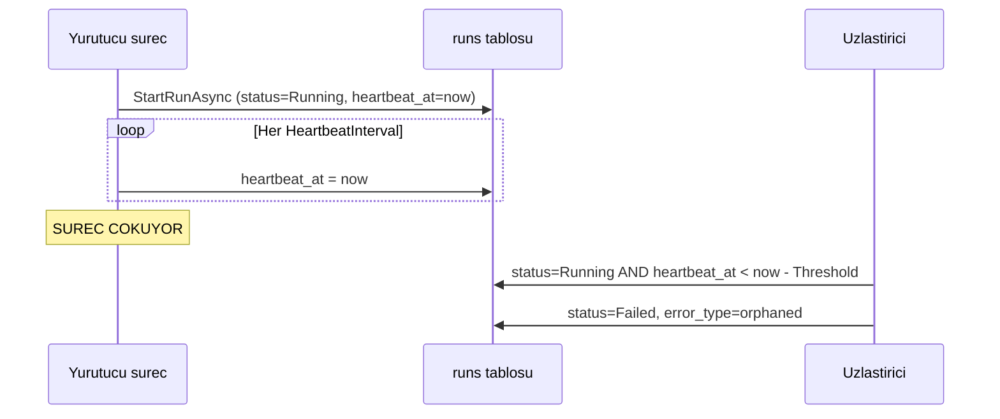

# Faz 54 — Öksüz Çalıştırma Uzlaştırması

> **Durum:** 📋 Planlandı (2026-08-08)
> **Kaynak:** [UCUNCU-FAZ-ADAYLARI.md](UCUNCU-FAZ-ADAYLARI.md) · **F-36**
> **Önkoşul:** [Faz 42](42-TEK-YURUTUCU-SECIMI.md) — `ISingletonLeaseStore` · [Faz 46](46-DAYANIKLI-CALISTIRMA.md) — bu fazın kapsamını **daraltan** faz
> **Paketler:** `AgentPrism.Abstractions`, `AgentPrism.Core`, `AgentPrism.Sql.Shared`
> **Yeni paket:** Yok · **Migration:** gerekli — `runs` tablosuna heartbeat sütunu, numara uygulama anında alınır
> **Public API:** büyüyor — bir ayar sınıfı ve `IRunStore`'a iki metot. Faz 7'den önce ucuz

---

## Bu Faza Başlarken

> `faz-baslangic` skill'ini uygula.

1. Bu doküman
2. Kararlar — dosyanın tamamını **okuma**, yalnız bu kalemleri grep'le:
   ```bash
   grep -n "K-138\|K-158\|K-355" docs/KARARLAR.md
   ```
   **K-138** (benzersiz kısıt cron çift tetiklemesini zaten kapatıyor),
   **K-158** (hız sınırı bilerek bellekte),
   **K-355** (alt yazma yolları **beklenen** kiracıyı taşır — uzlaştırma da bir yazmadır)
3. [`46-DAYANIKLI-CALISTIRMA.md`](46-DAYANIKLI-CALISTIRMA.md) — yalnız devir notu:
   ```bash
   awk '/## Sonraki Faza Devir Notu/,0' docs/46-DAYANIKLI-CALISTIRMA.md
   ```
   🚨 **Bu adım atlanamaz.** O notun 1. maddesi bu fazın kapsamını daraltıyor.
4. [`42-TEK-YURUTUCU-SECIMI.md`](42-TEK-YURUTUCU-SECIMI.md) — yalnız `SingletonGuard` kullanımı
5. Alan hafızası: [`hafiza/sql-saglayicilari.md`](hafiza/sql-saglayicilari.md) (üç migration seti),
   [`hafiza/cekirdek-calistirma.md`](hafiza/cekirdek-calistirma.md) (`RunRecording` zinciri)

---

## Amaç

Süreç düşerse `runs` satırı sonsuza dek `Running` kalır. Arayüzde asla
bitmeyen çalıştırmalar birikir ve `RunStatistics.ErrorRate` hesabının paydası
(`settled = CompletedRuns + FailedRuns + CanceledRuns`) bozulur: sonuçlanmamış
bir satır paydaya hiç girmez ve hata oranı **yapay olarak** düşük görünür.

- **F-36** — çalıştırma kirası: `runs`'a heartbeat sütunu, açılışta ve
  aralıklarla uzlaştırma. Süresi geçmiş `Running` satırlar `Failed` olarak
  kapanır ve nedeni yazılır.

### 🚨 Kanıt Faz 46'da DARALDI — düzeltilmiş gerekçe

Aday listesi "süreç düşerse satır sonsuza dek `Running` kalır" diyordu.
[Faz 46](46-DAYANIKLI-CALISTIRMA.md)'nın devir notu (madde 1) bunu ölçüp
**düzeltti** ve bu plan düzeltilmiş hâli kullanır:

| Senaryo | Bugünkü davranış |
|---|---|
| `MaxAttempts > 1` yapılandırılmış, işçi çöküyor | 🚨 **Orphan OLUŞMUYOR.** `StartRunAsync` bir UPSERT'tir; yeniden deneme **aynı** satırı `Running`'e geri getirir |
| `MaxAttempts = 1` (**varsayılan**), işçi `agent.RunAsync` ortasında çöküyor | Satır `Running`'de sonsuza dek kalır — **gerçek orphan** |
| Kuyruğa hiç girmemiş, doğrudan HTTP çalıştırması, süreç çöküyor | Satır `Running`'de kalır — **gerçek orphan** |

**Kalem ayakta, gerekçesi daraldı:** "her çöküş orphan üretir" değil,
"**yeniden denemesiz** çöküş orphan üretir". Varsayılan yapılandırma tam da
bu yüzden risklidir — `MaxAttempts` varsayılanı 1'dir.

### Doğrulanmış kanıt

| Kanıt | Gözlem |
|---|---|
| [`RunStatistics.cs:116-120`](../src/AgentPrism.Abstractions/Runs/RunStatistics.cs) | `settled = CompletedRuns + FailedRuns + CanceledRuns`; `Running` satır paydaya girmez ve hata oranını seyreltir |
| [`0008_scheduling.sql:35-36`](../src/AgentPrism.PostgreSql/Migrations/0008_scheduling.sql) | `jobs` tablosu `lease_owner` + `lease_until` taşıyor — **kopyalanacak desen budur**, sıfırdan tasarım gerekmez |
| [`ISingletonLeaseStore.cs`](../src/AgentPrism.Abstractions/Coordination/ISingletonLeaseStore.cs) | Küme genelinde tek yürütücü seçimi hazır; uzlaştırıcı bunu kullanır ve N replikada N kez koşmaz |
| [`RunStatus.cs:60`](../src/AgentPrism.Abstractions/Runs/RunStatus.cs) | `Queued = 5` (Faz 46). Uzlaştırma `Queued` satırlara **dokunmamalıdır** — onların sahibi iş kuyruğudur |

> Kanıtlar 2026-08-08 tarihinde doğrulandı.

---

## 54.1 — Kira mı, heartbeat mi

İki tasarım vardır ve fark önemlidir.

| Yaklaşım | Nasıl | Sorun |
|---|---|---|
| **Kira** (`lease_until`) | Çalıştırmayı yürüten süreç satırı belirli bir ana kadar kiralar | Uzun süren meşru bir çalıştırma kirayı **uzatmak** zorundadır |
| **Heartbeat** (`heartbeat_at`) | Yürüten süreç aralıklarla "hâlâ buradayım" yazar | Aynı şey, ama eşik okuma anında hesaplanır |

**Seçim: heartbeat.** Gerekçe: kira, "ne kadar süreceğini" **baştan** bilmeyi
gerektirir; bir agent çalıştırmasının süresi baştan bilinmez. Heartbeat'te
eşik tek bir yerde (uzlaştırıcıda) yaşar ve yanlış seçilirse tek yerden
düzeltilir.



## 54.2 — Eşik seçimi ve yanlış pozitif riski

🚨 **En büyük risk çalışan bir işi ölü ilan etmektir.** Üç koruma:

1. **Eşik heartbeat aralığının katıdır.** Varsayılan:
   `HeartbeatInterval = 30 sn`, `OrphanThreshold = 5 dk` — yani **on kaçırılmış**
   heartbeat. Tek bir GC duraklaması veya kısa bir veritabanı kesintisi
   çalıştırmayı öldürmez.
2. **Uzlaştırma varsayılan olarak KAPALI gelir** (K1). Tek örnekli bir geliştirme
   kurulumunda kimse bir arka plan yazıcısı beklemez.
3. **`Queued` satırlara dokunulmaz.** Onların sahibi iş kuyruğudur ve kendi
   kira alanları (`jobs.lease_until`) vardır. İki mekanizmanın aynı satırı
   kapatması yarış üretirdi.

## 54.3 — Uzlaştırma ne yazar

Öksüz satır `Failed` olarak kapatılır ve **neden** açıkça yazılır:

| Alan | Değer |
|---|---|
| `status` | `Failed` |
| `completed_at` | Uzlaştırma anı |
| `error_type` | `orphaned` |
| `error_message` | "Calistirma yuruten surec yanit vermiyor; son isaret: {heartbeat_at}." |
| `error_class` | Faz 44'ün sınıflandırmasından uygun olan (**ölçülmeli** — `Infrastructure` beklenir) |

🚨 **Bir `RunFailed` olayı da yazılmalı mıdır?** Yazılmalıdır: arayüzün
transcript görünümü olay akışını okur ve olaysız kapanan bir çalıştırma
"neden bitti" sorusuna cevap veremez. Ama `RunEventWriter` o süreçte artık
yoktur; olay **uzlaştırıcı tarafından** yazılır ve sıra numarası mevcut en
büyük değerin bir fazlasıdır.

## 54.4 — Faz 46 ile sıralama

Aday listesi "F-36, Faz 46'dan **sonra** yapılmalıdır, yoksa iki kez yazılır"
diyordu. Faz 46 bitti; sıra doğru. Bu faz Faz 46'nın ürettiği daralmış
senaryoyu kapatır ve `202 Accepted` sözleşmesine **dokunmaz**.

---

## Planlanan Public API

> Taslak imzalardır.

```csharp
// AgentPrism.Abstractions
public sealed class RunReconciliationOptions
{
    public const string SectionName = "AgentPrism:RunReconciliation";

    /// <summary>Varsayilan KAPALI (K1).</summary>
    public bool Enabled { get; set; }

    public TimeSpan HeartbeatInterval { get; set; } = TimeSpan.FromSeconds(30);

    /// <summary>Bu sureden uzun sure isaret vermeyen Running satir oksuz sayilir.</summary>
    public TimeSpan OrphanThreshold { get; set; } = TimeSpan.FromMinutes(5);

    public TimeSpan ScanInterval { get; set; } = TimeSpan.FromMinutes(1);

    /// <summary>Bir turda kapatilacak ust satir sayisi.</summary>
    public int MaxRunsPerScan { get; set; } = 100;
}

// IRunStore'a EKLENEN iki metot
// 🚨 Var olan bir arayuze metot eklemek Faz 7'den SONRA kirici olurdu.
ValueTask TouchHeartbeatAsync(Guid runId, DateTimeOffset at, string? tenantId = null, CancellationToken cancellationToken = default);

ValueTask<IReadOnlyList<RunRecord>> ClaimOrphanedRunsAsync(DateTimeOffset staleBefore, int max, CancellationToken cancellationToken = default);
```

🚨 **`ClaimOrphanedRunsAsync` `[TenantAgnostic]` olacaktır**: uzlaştırma bir
bakım işidir ve **bütün** kiracıların öksüz satırlarını tarar; ambient kiracıyla
süzmek diğer kiracıların satırlarını sonsuza dek `Running` bırakırdı. Gerekçe
`TenantCoverageTests`'in istediği uzunlukta yazılmalıdır.

### HTTP `endpoint`'leri

Yok. Bu bir arka plan işidir. **Açık soru 2**, elle tetikleme ucunun gerekip
gerekmediğini sorar.

### Arayüz payı

Yok — mevcut çalıştırma listesi `Failed` satırı zaten gösteriyor.

---

## Planlanan Dosya Listesi

```
src/AgentPrism.Abstractions/Runs/
├── RunReconciliationOptions.cs
└── IRunStore.cs                    (iki metot eklenir)

src/AgentPrism.Core/Recording/
├── RunHeartbeatWriter.cs           (yuruten surecin isareti)
└── RunReconciliationService.cs     (BackgroundService + SingletonGuard)

src/AgentPrism.Core/Storage/
└── InMemoryRunStore.cs             (iki metot eklenir)

src/AgentPrism.Sql.Shared/Stores/
└── SqlRunStore.cs                  (iki metot eklenir)

src/AgentPrism.{PostgreSql,SqlServer,Sqlite}/
├── Migrations/NNNN_run_heartbeat.sql   (uc ayri set - K-178)
└── Internal/*Queries.cs                (uc lehce)
```

---

## Testler

| Test sınıfı | Neyi doğrular |
|---|---|
| `RunStoreContract` (mevcut, genişletilir) | 🚨 `TouchHeartbeatAsync` ve `ClaimOrphanedRunsAsync` — bellek içi **ve** üç SQL sağlayıcısında |
| `RunReconciliationTests` | Eşiği aşan `Running` satır `Failed` olur; **eşiği aşmayan satıra dokunulmaz** (iki yönlü) |
| `RunReconciliationQueuedTests` | 🚨 `Queued` satır **hiçbir** koşulda uzlaştırılmaz |
| `RunReconciliationSingletonTests` | İki örnekte uzlaştırma yalnız birinde koşar (Faz 42 deseni, `McpDiscoverySingletonTests` emsali) |
| `RunReconciliationDisabledTests` | `Enabled = false` (varsayılan) iken **hiçbir** SQL sorgusu atılmaz |
| `RunStatisticsTests` (mevcut) | Uzlaştırma sonrası `ErrorRate` paydası düzelir |

🚨 **Uzlaştırıcı SQL'e dokunan bir `BackgroundService`'tir**; `SchemaReadyGate`'i
(K-354) beklemek **zorundadır**. Testi `SchemaReadyGateTests` deseninde yazılır.

---

## Açık Sorular

| # | Soru | Seçenekler | Öneri |
|---|---|---|---|
| 1 | Heartbeat'i kim yazar? | A: `RunEventWriter` içinden · B: Ayrı bir `BackgroundService` tüm aktif çalıştırmaları toplu günceller | **B.** A, uzun süren ama olay üretmeyen bir çalıştırmada hiç yazmaz (model yanıtı beklerken). B tek bir `UPDATE ... WHERE id IN (...)` ile N çalıştırmayı günceller ve sıcak yola hiçbir şey eklemez |
| 2 | Elle tetikleme ucu gerekli mi? | A: `POST /api/runs/reconcile` · B: Yok | **B**, ilk turda. Faz 33'ün teşhis ucu zaten "kaç öksüz satır var" sorusunu cevaplayabilir; yazma ucunu eklemek için gerçek bir talep beklenmelidir (YAGNI) |
| 3 | `error_class` hangi değer? | A: `Infrastructure` · B: Yeni bir `Orphaned` değeri | **A**, ama **ölçülmeli**: Faz 44'ün `ErrorClass` enum'ı okunup uygun değer seçilir. Yeni enum değeri eklemek Faz 7'den önce ucuzdur ama gereksizse eklenmemelidir |
| 4 | Heartbeat sütunu `runs`'a mı yoksa ayrı tabloya mı? | A: `runs.heartbeat_at` · B: `run_heartbeats` tablosu | **A.** Ayrı tablo her heartbeat'te bir JOIN ve bir satır daha demektir; `runs` zaten satır başına güncelleniyor |

---

## Bitiş Ölçütleri (DoD)

- [ ] Eşiği aşan bir `Running` satır `Failed` + `error_type = orphaned` olarak kapanır
- [ ] Eşiği **aşmayan** bir `Running` satıra dokunulmaz (yanlış pozitif yok)
- [ ] `Queued` satır hiçbir koşulda uzlaştırılmaz
- [ ] `Enabled = false` (varsayılan) iken hiçbir uzlaştırma sorgusu atılmaz
- [ ] İki örnekli kurulumda uzlaştırma yalnız birinde koşar
- [ ] Uzlaştırma sonrası `GET /api/stats` hata oranı paydası doğru
- [ ] Kapatılan çalıştırmanın olay akışında bir `RunFailed` olayı görünür
- [ ] Uzlaştırıcı `SchemaReadyGate`'i bekler (K-354)
- [ ] Dört doğrulama kapısı sıfır uyarı verir
- [ ] `samples/AgentPrism.Api` ile gerçek `run` yapıldı, çıktı belgeye yazıldı
- [ ] `secret` taraması boş döndü

### Doğrulama komutları

```bash
# Ornek uygulamayi calistir, bir run baslat, sureci SIGKILL ile oldur,
# yeniden baslat ve satirin kapandigini gozle:
curl -s http://localhost:5080/agentprism/api/runs?status=Running | jq '.items | length'
# uzlastirma turundan sonra 0 beklenir

curl -s http://localhost:5080/agentprism/api/runs/$RUN_ID | jq '.status, .error.type'
# "Failed", "orphaned" beklenir
```

---

## Riskler

| Risk | Önlem |
|------|-------|
| 🚨 Çalışan bir işi ölü ilan etmek | Eşik heartbeat aralığının **on katı**; varsayılan kapalı; iki yönlü test (dokunulmaması gereken satır) |
| Uzlaştırma N replikada N kez koşar | `SingletonGuard` (Faz 42) — `McpDiscoveryService` deseninin aynısı |
| `Queued` satırlar iş kuyruğuyla çakışır | Uzlaştırma sorgusu **yalnız** `status = Running` süzer; sözleşme testi bunu kapatır |
| Migration açılışta yarışır | `SchemaReadyGate` (K-354) beklenir |
| Heartbeat yazımı sıcak yola maliyet ekler | Açık soru 1: toplu `UPDATE`, çalıştırma başına değil tur başına bir sorgu. Maliyet **ölçülüp** belgeye yazılır |
| Üç migration setinden biri unutulur | Sözleşme testi üç sağlayıcıda koşar ve eksik sütunu yakalar |

---

<!-- ============================================================
     AŞAĞISI KAPANIŞTA DOLDURULUR — `faz-tamamlama` skill'i.
     Plan anında boş kalır. Başlıkları SİLME.
     ============================================================ -->

## Plandan Sapmalar

> Kapanışta doldurulur.

## Bu Fazda Verilen Kararlar

> Kapanışta doldurulur. K-NNN numaraları burada alınır.

## Gerçekleşen Public API

> Kapanışta doldurulur.

## Dosya Listesi (gerçekleşen)

> Kapanışta doldurulur.

## Sonraki Faza Devir Notu

> Kapanışta doldurulur.
