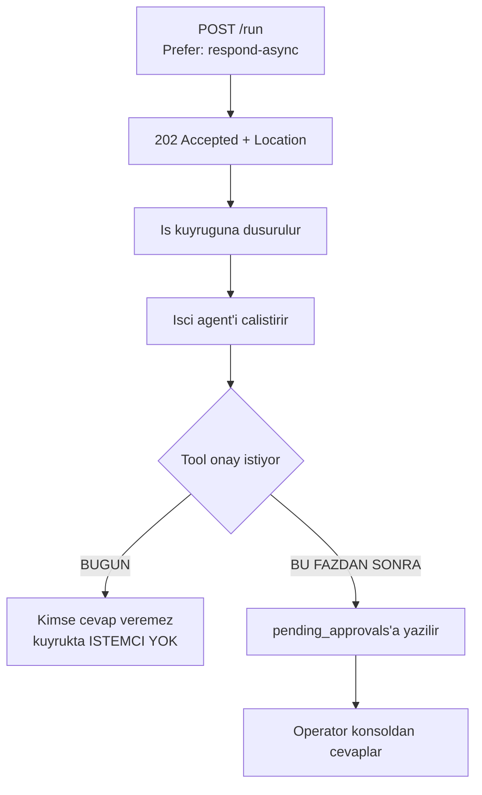
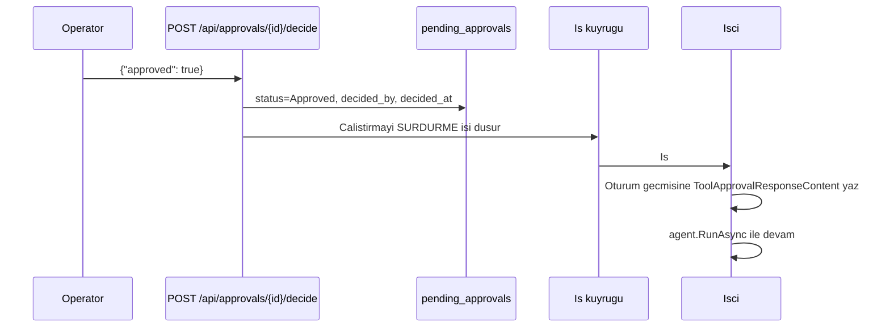

# Faz 55 — Asenkron Onay Kutusu

> **Durum:** 📋 Planlandı (2026-08-08)
> **Kaynak:** [UCUNCU-FAZ-ADAYLARI.md](UCUNCU-FAZ-ADAYLARI.md) · **F-69**
> **Önkoşul:** [Faz 46](46-DAYANIKLI-CALISTIRMA.md) — bu kalemi kolaylıktan **eksiğe** çeviren faz · [Faz 9](09-YONETISIM-VE-DENETIM-IZI.md) — rol politikaları
> **Paketler:** `AgentPrism.Abstractions`, `AgentPrism.Core`, `AgentPrism.AspNetCore`, `AgentPrism.Sql.Shared`, `AgentPrism.UI`
> **Yeni paket:** Yok · **Migration:** gerekli — `pending_approvals` tablosu, numara uygulama anında alınır
> **Public API:** büyüyor — yeni tipler, bir depo arayüzü, üç uç. Faz 7'den önce ucuz

---

## Bu Faza Başlarken

> `faz-baslangic` skill'ini uygula.

1. Bu doküman
2. Kararlar — dosyanın tamamını **okuma**, yalnız bu kalemleri grep'le:
   ```bash
   grep -n "K-089\|K-218\|K-355" docs/KARARLAR.md
   ```
   **K-089** (denetim izine yazılamayan iş **çalışmaz** — onay kararı için emsal),
   **K-218** (tool'un gördüğü servis sağlayıcı boştur),
   **K-355** (alt yazma yolları beklenen kiracıyı taşır)
3. [`46-DAYANIKLI-CALISTIRMA.md`](46-DAYANIKLI-CALISTIRMA.md) — devir notu (madde 3) **ve**
   Plandan Sapmalar madde 5:
   ```bash
   awk '/## Sonraki Faza Devir Notu/,0' docs/46-DAYANIKLI-CALISTIRMA.md
   ```
4. [`22-MCP-DERINLESMESI.md`](22-MCP-DERINLESMESI.md) — MCP tool'ları varsayılan onay ister; onay hacminin çoğu oradan gelir
5. Alan hafızası: [`hafiza/aspnetcore-di.md`](hafiza/aspnetcore-di.md),
   [`hafiza/frontend.md`](hafiza/frontend.md) (yeni ekran — **eksik sözlük anahtarı derleme hatasıdır**, K-228),
   [`hafiza/sql-saglayicilari.md`](hafiza/sql-saglayicilari.md)

---

## Amaç

Tool onayı bugün yalnız **aynı istemcinin bir sonraki turunda** verilebilir.
Uç, gövdede `approvals` alanını bekler ve kararı `ToolApprovalResolver` çözer.
Bekleyen onaylar için **depo yoktur**; `GET /api/approvals/pending` **yoktur**.
Bir arka uç `/v1/responses` üzerinden çalıştırma başlatırsa, o çalıştırmanın
onayını operatör konsoldan **veremez** — onay isteği o istemcinin yanıtında kalır.

- **F-69** — `pending_approvals` tablosu, iki uç, bir arayüz ekranı ve Faz 21'in
  webhook'uyla bildirim.

### Doğrulanmış kanıt

| Kanıt | Gözlem |
|---|---|
| [`AgentEndpoints.cs:405`](../src/AgentPrism.AspNetCore/Endpoints/AgentEndpoints.cs) | Karar gövdedeki `approvals` alanıyla gelir; **ikinci bir kanal yoktur** |
| [`AgentEndpoints.cs:413-418`](../src/AgentPrism.AspNetCore/Endpoints/AgentEndpoints.cs) | 🚨 `approvals` için `sessionId` **zorunludur**: "Bekleyen onay istegi oturum gecmisinde yasar". Yani bekleyen istek bugün **oturum durumunda** yaşıyor, bir tabloda değil |
| [`AgentEndpoints.cs:534-540`](../src/AgentPrism.AspNetCore/Endpoints/AgentEndpoints.cs) | 🚨 Kuyruğa alınan (`Prefer: respond-async`) çalıştırmada `approvals` **bilerek `400`** ile reddediliyor — Faz 46'nın açık kararı |
| [`ToolApprovalResolver.cs:15-16`](../src/AgentPrism.AspNetCore/Internal/ToolApprovalResolver.cs) | Karar "bir sonraki çalıştırmanın mesajlarında" `ToolApprovalResponseContent` olarak taşınır |
| `grep -rn "approvals/pending\|pending_approvals" src/` | **Sıfır sonuç** — ne uç ne tablo var |

> Kanıtlar 2026-08-08 tarihinde doğrulandı.

🚨 **İkinci satır bu fazın en önemli tasarım kısıtıdır.** Bekleyen istek bugün
MAF'ın oturum durumunda yaşar. Bu faz onu **kopyalar**, taşımaz — oturum
durumu tek gerçek kaynak kalmalıdır (K3: MAF sarmalanmaz).

---

## 55.1 — Neden Faz 46 bunu eksiğe çevirdi



Senkron yolda istemci yanıtı bekler ve onayı bir sonraki turda verir. Kuyrukta
**bekleyen bir istemci yoktur**. Faz 46 bunu görüp `400` ile reddetti — doğru
karardı, ama boşluğu bu faz kapatır.

## 55.2 — Bekleyen isteğin kopyası, sahibi değil

🚨 **Tek gerçek kaynak MAF'ın oturum durumudur.** `pending_approvals` tablosu
bir **izdüşümdür** — `ToolInvocationRecord`'un olay akışının izdüşümü olması
gibi (aynı emsal, aynı gerekçe).

| Alan | Neden |
|---|---|
| `id` | UUID v7 |
| `tenant_id` | Kiracı bağı |
| `run_id` | Hangi çalıştırma bekliyor |
| `session_id` | 🚨 Kararı uygulamak için **zorunlu**: karar oturum geçmişine yazılır |
| `request_id` | `ToolApprovalRequestContent.RequestId` |
| `tool_name` | Operatörün ne onayladığını görmesi için |
| `arguments` | Argüman özeti. 🚨 `RecordToolPayloads` kapalıysa **yazılmaz** |
| `status` | `Pending` / `Approved` / `Rejected` / `Expired` |
| `decided_by` | Kararı veren aktör (Faz 9'un `IAuditActorResolver`'ı) |
| `decided_at` | Karar anı |
| `expires_at` | 🚨 Süre sonu **zorunludur** — süresiz bekleyen onay bir sızıntıdır |
| `created_at` | Oluşturma |

## 55.3 — Karar nasıl uygulanır

Karar verildiğinde tool **hemen çalışmaz**. Karar oturuma yazılır ve
çalıştırma **sürdürülür**.



🚨 **Sürdürme işi bu fazın en riskli parçasıdır.** Faz 46'nın `AgentRunJobHandler`
deseni kopyalanır; yeni bir yürütme yolu **yazılmaz**.

## 55.4 — Güvenlik sınırı

Onay bir **güvenlik kararıdır**. Üç kural:

1. **Rol:** `AgentPrismPolicies.Operator` — Faz 9'un yapısı korunur, yeni bir
   rol icat edilmez.
2. **Kiracı:** Bir kiracının operatörü başka kiracının onayını **göremez ve
   veremez**. Sözleşme testi iki yönlü kapatır.
3. **Denetim izi:** Her karar `audit_log`'a yazılır. 🚨 K-089'un emsali burada
   **birebir** geçerlidir: denetim izine yazılamayan bir onay kararı
   **uygulanmaz**.

## 55.5 — Süre sonu

Süresi geçen bekleyen onay `Expired` olur ve çalıştırma `Failed` ile kapanır.
Uzlaştırma [Faz 54](54-OKSUZ-CALISTIRMA-UZLASTIRMASI.md)'ün arka plan
servisiyle **aynı desende** yazılır; ikinci bir zamanlayıcı deseni
üretilmemelidir.

---

## Planlanan Public API

```csharp
// AgentPrism.Abstractions
public sealed record PendingApproval
{
    public required Guid Id { get; init; }
    public required string TenantId { get; init; }
    public required Guid RunId { get; init; }
    public required string SessionId { get; init; }
    public required string RequestId { get; init; }
    public required string ToolName { get; init; }
    public string? Arguments { get; init; }
    public required ApprovalStatus Status { get; init; }
    public string? DecidedBy { get; init; }
    public DateTimeOffset? DecidedAt { get; init; }
    public required DateTimeOffset ExpiresAt { get; init; }
    public required DateTimeOffset CreatedAt { get; init; }
}

public enum ApprovalStatus { Pending, Approved, Rejected, Expired }

public interface IPendingApprovalStore
{
    ValueTask CreateAsync(PendingApproval approval, CancellationToken cancellationToken = default);
    ValueTask<IReadOnlyList<PendingApproval>> ListPendingAsync(CancellationToken cancellationToken = default);
    ValueTask<PendingApproval?> GetAsync(Guid id, CancellationToken cancellationToken = default);
    ValueTask<bool> DecideAsync(Guid id, bool approved, string decidedBy, DateTimeOffset decidedAt, CancellationToken cancellationToken = default);
    ValueTask<int> ExpireAsync(DateTimeOffset olderThan, int max, CancellationToken cancellationToken = default);
}
```

### HTTP `endpoint`'leri

| Metot | Yol | Rol | Ne yapar |
|---|---|---|---|
| `GET` | `/api/approvals/pending` | Operator | Kiracının bekleyen onaylarını listeler |
| `GET` | `/api/approvals/{id}` | Operator | Tek bir bekleyen onayı getirir |
| `POST` | `/api/approvals/{id}/decide` | Operator | Karar verir ve çalıştırmayı sürdürür |

🚨 Mevcut `approvals` gövde alanı **kaldırılmaz**. Senkron Playground yolu
bugünkü gibi çalışmaya devam eder; bu faz **ikinci** bir kanal ekler.

### Arayüz payı

Bir ekran: bekleyen onay listesi + karar kutusu. Aday listesi "tahminî 3–5 KB
gzip" diyordu — 🚨 **bu bir tahmindir, ölçüm değildir.** Bugünkü kullanım
`ls -l src/AgentPrism.UI/wwwroot/assets/` ile ölçülür; gerçek pay faz sonunda
yazılır. Bütçe 250 KB gzip.

---

## Planlanan Dosya Listesi

```
src/AgentPrism.Abstractions/Approvals/
├── PendingApproval.cs
├── ApprovalStatus.cs
└── IPendingApprovalStore.cs

src/AgentPrism.Core/Approvals/
├── InMemoryPendingApprovalStore.cs
└── ApprovalExpirationService.cs      (Faz 54 deseni)

src/AgentPrism.Sql.Shared/Stores/
└── SqlPendingApprovalStore.cs

src/AgentPrism.{PostgreSql,SqlServer,Sqlite}/Migrations/
└── NNNN_pending_approvals.sql        (uc ayri set - K-178)

src/AgentPrism.AspNetCore/Endpoints/
└── ApprovalEndpoints.cs

src/AgentPrism.UI/src/
└── (Approvals ekrani + locales/en.ts, tr.ts)
```

---

## Testler

| Test sınıfı | Neyi doğrular |
|---|---|
| `PendingApprovalStoreContract` | 🚨 `tests/Shared/Contracts/` — bellek içi **ve** üç SQL sağlayıcısı. Oluşturma, listeleme, karar, süre sonu, **kiracı yalıtımı iki yönlü** |
| `AsyncApprovalFlowTests` (functional) | 🚨 Kuyruğa alınan bir çalıştırma onay ister → `pending_approvals`'a düşer → konsoldan onaylanır → çalıştırma **tamamlanır**. Bu fazın varlık sebebidir |
| `ApprovalAuthorizationTests` (functional) | `Reader` rolü karar veremez (`403`); başka kiracının onayı görünmez (`404`) |
| `ApprovalExpirationTests` | Süresi geçen onay `Expired`; çalıştırma `Failed` |
| `ApprovalAuditTests` | Her karar `audit_log`'a yazılır; yazılamazsa karar **uygulanmaz** (K-089) |
| `ApprovalDoubleDecideTests` | Aynı onaya ikinci karar `409` alır |
| E2E (Playwright) | Onay ekranı listeyi gösterir ve karar gönderir |

---

## Açık Sorular

| # | Soru | Seçenekler | Öneri |
|---|---|---|---|
| 1 | Senkron yol da `pending_approvals`'a yazsın mı? | A: Yalnız kuyruk yolu · B: Her ikisi | **B.** Tek bir kanal olması operatörün "bekleyen her şey" görünümünü doğru yapar. A, iki farklı gerçeklik üretir |
| 2 | Karar sonrası sürdürme nasıl? | A: İş kuyruğuna sürdürme işi · B: Uçta doğrudan çalıştır | **A.** B, HTTP isteğini agent'ın süresine bağlar ve Faz 46'nın çözdüğü sorunu geri getirir |
| 3 | Varsayılan süre sonu? | A: 1 saat · B: 24 saat | **B**, ama yapılandırılabilir. Onay çoğu zaman bir insana gider ve bir saat gece 03:00'te yetmez |
| 4 | Bildirim bu fazda mı? | A: Faz 21 webhook'u tetiklensin · B: Ayrı kalem | **A.** Altyapı hazır; yeni bir olay tipi eklemek düşük maliyetlidir ve onay kutusu bildirimsiz yarım kalır |
| 5 | `Arguments` maskeleme | A: `RecordToolPayloads` ayarına uy · B: Her zaman yaz | **A.** İkisi aynı gizlilik kararıdır; iki ayrı ayar iki yerde bakım demektir. 🚨 F-87 (kayıtlarda redaksiyon) ile çatışabilir; o kalem karara bağlanınca yeniden bakılmalı |

---

## Bitiş Ölçütleri (DoD)

- [ ] 🚨 Kuyruğa alınan bir çalıştırma onay ister, konsoldan onaylanır ve **tamamlanır** (uçtan uca)
- [ ] `GET /api/approvals/pending` yalnız çağıranın kiracısının onaylarını döner
- [ ] `Reader` rolü karar veremez (`403`)
- [ ] Aynı onaya ikinci karar `409` alır
- [ ] Süresi geçen onay `Expired`, çalıştırma `Failed`
- [ ] Her karar `audit_log`'da görünür; denetim izi yazılamazsa karar uygulanmaz
- [ ] Senkron Playground onay akışı **hiç değişmeden** çalışır
- [ ] Süre sonu servisi `SchemaReadyGate`'i bekler (K-354)
- [ ] Dört doğrulama kapısı sıfır uyarı verir
- [ ] `samples/AgentPrism.Api` ile gerçek `run` yapıldı, çıktı belgeye yazıldı
- [ ] `secret` taraması boş döndü
- [ ] `en.ts` ve `tr.ts` eksiksiz; bundle payı **ölçüldü** ve yazıldı

### Doğrulama komutları

```bash
# Kuyruga alinan calistirma baslat (onay isteyen tool ile)
curl -s -X POST http://localhost:5080/agentprism/api/agents/siparis/run \
  -H "Prefer: respond-async" -H "Content-Type: application/json" \
  -d '{"message":"12 nolu siparisi iptal et"}'

# Bekleyen onaylar
curl -s http://localhost:5080/agentprism/api/approvals/pending | jq '.[].toolName'

# Karar ver
curl -s -X POST http://localhost:5080/agentprism/api/approvals/$ID/decide \
  -H "Content-Type: application/json" -d '{"approved":true}'

# Calistirma tamamlandi mi
curl -s http://localhost:5080/agentprism/api/runs/$RUN_ID | jq '.status'
```

---

## Riskler

| Risk | Önlem |
|------|-------|
| 🚨 Bekleyen istek iki yerde yaşar ve ayrışır | Tablo bir **izdüşümdür**; tek gerçek kaynak oturum durumudur. Karar uygulanırken oturum okunur, tablo değil |
| Onay kararı yanlış kiracıya uygulanır | Sözleşme testi iki yönlü; `decide` ucu kiracıyı **anahtardan/bağlamdan** çözer, gövdeden değil |
| Sürdürme yolu ikinci bir yürütme yolu üretir | Faz 46'nın `AgentRunJobHandler` deseni kopyalanır; yeni yol yazılmaz |
| Süresiz bekleyen onay birikir | `expires_at` **zorunlu**; süre sonu servisi Faz 54 deseninde |
| Denetim izi yazılamayınca karar yine uygulanır | K-089 emsali: yazılamazsa karar **uygulanmaz**; testle kapatılır |
| Arayüz bundle bütçesini zorlar | Pay **ölçülür**; 250 KB kapısı zaten build'de |
| Argümanlar hassas veri taşır | `RecordToolPayloads` ayarına uyulur; F-87 ile çatışma devir notuna yazılır |

---

<!-- ============================================================
     AŞAĞISI KAPANIŞTA DOLDURULUR — `faz-tamamlama` skill'i.
     Plan anında boş kalır. Başlıkları SİLME.
     ============================================================ -->

## Plandan Sapmalar

> Kapanışta doldurulur.

## Bu Fazda Verilen Kararlar

> Kapanışta doldurulur. K-NNN numaraları burada alınır.

## Gerçekleşen Public API

> Kapanışta doldurulur.

## Dosya Listesi (gerçekleşen)

> Kapanışta doldurulur.

## Sonraki Faza Devir Notu

> Kapanışta doldurulur.
