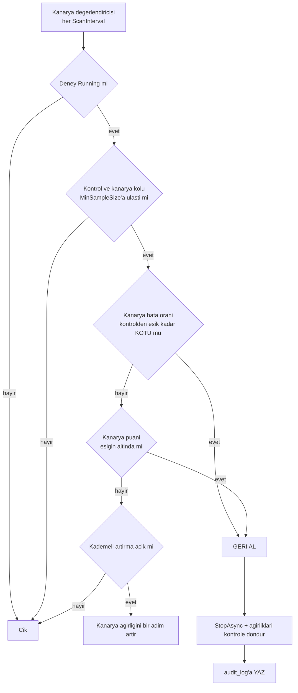

# Faz 56 — Kanarya Yayını ve Otomatik Geri Alma

> **Durum:** ✅ Tamamlandı (2026-08-09)
> **Kaynak:** [ADAYLAR.md](ADAYLAR.md) · **F-74**
> **Önkoşul:** [Faz 19](19-SURUM-KARSILASTIRMA-VE-AB.md) (deney altyapısı) · [Faz 31](31-GERI-BILDIRIM-VE-PUANLAMA.md) · [Faz 44](44-HATA-SINIFLANDIRMA.md) · [Faz 49](49-CEVRIMICI-DEGERLENDIRME.md) — üçü de **tamamlandı**
> **Paketler:** `AgentPrism.Abstractions`, `AgentPrism.Core`, `AgentPrism.AspNetCore`, `AgentPrism.Sql.Shared`, `AgentPrism.UI`
> **Yeni paket:** Yok · **Migration:** gerekli — `experiments` tablosuna eşik alanları, numara uygulama anında alınır
> **Public API:** büyüyor — `Experiment`'a alanlar + bir ayar sınıfı. 🚨 `Experiment` bir `sealed record`; Faz 7'den **sonra** alan eklemek sürüm kararı olurdu

---

## Bu Faza Başlarken

> `faz-baslangic` skill'ini uygula.

1. Bu doküman
2. Kararlar — dosyanın tamamını **okuma**, yalnız bu kalemleri grep'le:
   ```bash
   grep -n "K-003\|K-089\|K-354" docs/KARARLAR.md
   ```
   **K-003** (kod kaynaklı agent'ta sürüm geçmişi yok — deney kurulamaz),
   **K-089** (denetim izine yazılamayan iş çalışmaz — **otomatik geri alma için emsal**),
   **K-354** (SQL'e dokunan arka plan servisi `SchemaReadyGate`'i bekler)
3. [`49-CEVRIMICI-DEGERLENDIRME.md`](49-CEVRIMICI-DEGERLENDIRME.md) — devir notu **ve**
   `MinSampleSize` + `EvaluationWindow` kuralı:
   ```bash
   awk '/## Sonraki Faza Devir Notu/,0' docs/49-CEVRIMICI-DEGERLENDIRME.md
   ```
   🚨 **Bu adım atlanamaz** — eşik mantığı oradan **aynen** alınır.
4. [`19-SURUM-KARSILASTIRMA-VE-AB.md`](19-SURUM-KARSILASTIRMA-VE-AB.md) — deney sözleşmesi ve atama çözücü
5. Alan hafızası: [`hafiza/sql-saglayicilari.md`](hafiza/sql-saglayicilari.md),
   [`hafiza/frontend.md`](hafiza/frontend.md)

---

## Amaç

Faz 19 A/B deneyini verdi ama **kimse sonuca göre karar vermiyor**. Varyant
başına hata oranı hesaplanıyor; bu sayıyı okuyup deneyi durduran hiçbir kod
yok. Trafik oranı sabittir ve hata oranı patlarsa deney kendiliğinden durmaz.

- **F-74** — deneye eşik kuralı (hata oranı > X veya puan < Y ise durdur),
  kademeli trafik artırma, otomatik geri alma ve denetim kaydı.

### Doğrulanmış kanıt

| Kanıt | Gözlem |
|---|---|
| [`ExperimentVariantResult.cs:58-66`](../src/AgentPrism.Abstractions/Experiments/ExperimentVariantResult.cs) | `ErrorRate` varyant başına **hesaplanıyor** (`settled` paydasıyla) |
| `grep -rn "ErrorRate" src/` | Hiçbir kod bu değeri okuyup deneyi durdurmuyor — yalnız raporlanıyor |
| [`Experiment.cs:31`](../src/AgentPrism.Abstractions/Experiments/Experiment.cs) | `Variants` ağırlıkları taşıyor, toplamı 100. **Kademeli artırma için yer hazır** ama zaman ekseni yok |
| [`IExperimentStore.cs:54,61`](../src/AgentPrism.Abstractions/Experiments/IExperimentStore.cs) | `StartAsync` / `StopAsync` var — otomatik geri alma **yeni bir yol yazmadan** bunu çağırabilir |
| [`OnlineEvaluationOptions.cs:60,63`](../src/AgentPrism.Core/Evaluation/OnlineEvaluationOptions.cs) | 🚨 `MinSampleSize = 20` ve `EvaluationWindow = 1 saat` **zaten tanımlı** — bu fazın eşik kuralı **üçüncü bir kural yazmamalıdır** |
| [`Experiment.cs:36-40`](../src/AgentPrism.Abstractions/Experiments/Experiment.cs) | `AssignmentKey` bir **rezerve alandır** ve bugün okunmaz; kademeli artırma bunu değiştirmemelidir |

> Kanıtlar 2026-08-08 tarihinde doğrulandı.

---

## 56.1 — Üç eşik kuralı değil, bir tane

🚨 **Bu fazın en önemli kısıtı budur.** Bugün eşik mantığı iki yerde var
olabilirdi:

| Yer | Kural |
|---|---|
| [Faz 49](49-CEVRIMICI-DEGERLENDIRME.md) | `MinSampleSize` + `EvaluationWindow` + `LowScoreThreshold` |
| Bu faz | "hata oranı > X ise durdur" |

Üçüncü bir eşik kuralı yazmak **üç yerde bakım** demektir. Bu faz Faz 49'un
`MinSampleSize` ve `EvaluationWindow` alanlarını **aynen kullanır**; yalnız
kararın **ne olduğu** (durdur / geri al) yenidir.

## 56.2 — Karar akışı



🚨 **Karşılaştırma mutlak değil, göreceldir.** "Hata oranı > %5 ise durdur"
kuralı, kontrolün de %8 hata verdiği bir agent'ta kanaryayı haksız yere
öldürür. Doğru kural: **kanarya kontrolden belirgin biçimde kötüyse**.

## 56.3 — Otomatik eylem varsayılan kapalıdır

Otomatik geri alma bir **otomatik eylemdir** (K1). Üç koruma:

1. `AutoRollbackEnabled` varsayılan **`false`**. Açılmadan hiçbir deney
   kendiliğinden durmaz.
2. `MinSampleSize` **zorunludur**. Az örnekte eşik gürültüye tepki verir; üç
   çalıştırmanın ikisi hata verirse hata oranı %66'dır ve bu bir sinyal değildir.
3. Her karar `audit_log`'a yazılır. 🚨 K-089 emsali: **denetim izine
   yazılamayan bir geri alma uygulanmaz.** Otomatik bir eylemin izsiz kalması
   kabul edilemez.

## 56.4 — Kademeli trafik artırma

Kanarya ağırlığı zamanla artar; her adımda eşik yeniden denetlenir.

| Ayar | Anlamı |
|---|---|
| `RampSteps` | Ağırlık adımları, ör. `[5, 25, 50, 100]` |
| `RampInterval` | Adımlar arası **asgari** süre |
| `RampRequiresSampleSize` | Bir sonraki adım için o adımda toplanması gereken asgari çalıştırma |

🚨 **Ağırlık değişimi atama kararını geçmişe dönük bozmamalıdır.** Atama anahtarı
oturum kimliğidir; ağırlık değişince **var olan oturumlar kolunu değiştirmez**.
Değiştirseydi bir kullanıcı konuşmanın ortasında başka bir talimat sürümüne
geçerdi. Bu, uygulamada **ölçülmesi** gereken bir davranıştır.

## 56.5 — Geri alma ne yapar

`Stopped` durumuna geçirir **ve** ağırlıkları kontrol koluna döndürür. Tanım
sürümü **silinmez veya geri alınmaz** — Faz 19'un `RollbackAsync`'i ayrı bir
işlemdir ve bir insan kararıdır. Bu faz yalnız **trafiği** keser.

---

## Planlanan Public API

```csharp
// AgentPrism.Abstractions — Experiment'a EKLENEN alanlar
// 🚨 sealed record; Faz 7'den sonra alan eklemek surum karari olurdu.
public sealed record Experiment
{
    // ... mevcut alanlar ...

    /// <summary>Kanarya kurallari. null ise otomatik karar YOKTUR (K1).</summary>
    public CanaryPolicy? Canary { get; init; }

    /// <summary>Otomatik geri almanin nedeni. Elle durdurulmussa null.</summary>
    public string? RollbackReason { get; init; }
}

public sealed record CanaryPolicy
{
    /// <summary>Kanarya kolunun adi. Kalan kollar kontrol sayilir.</summary>
    public required string CanaryVariant { get; init; }

    /// <summary>
    /// Kanaryanin hata orani kontrolden bu kadar YUKSEKSE geri alinir (mutlak fark, 0-1).
    /// </summary>
    public double? MaxErrorRateDelta { get; init; }

    /// <summary>Kanarya ortalama puani bu esigin altindaysa geri alinir.</summary>
    public int? MinScore { get; init; }

    /// <summary>🚨 Faz 49'un OnlineEvaluationOptions.MinSampleSize kuralini AYNEN kullanir.</summary>
    public int MinSampleSize { get; init; } = 20;

    public IReadOnlyList<int> RampSteps { get; init; } = [];

    public TimeSpan RampInterval { get; init; } = TimeSpan.FromHours(1);
}

public sealed class CanaryOptions
{
    public const string SectionName = "AgentPrism:Canary";

    /// <summary>🚨 Varsayilan KAPALI (K1).</summary>
    public bool AutoRollbackEnabled { get; set; }

    public TimeSpan ScanInterval { get; set; } = TimeSpan.FromMinutes(5);
}
```

### HTTP `endpoint`'leri

| Metot | Yol | Rol | Ne yapar |
|---|---|---|---|
| `PUT` | `/api/experiments/{name}/canary` | Admin | Kanarya kuralını tanımlar veya kaldırır |
| `GET` | `/api/experiments/{name}/canary` | Reader | Kuralı ve son değerlendirmeyi döner |

Geri alma için ayrı bir uç **yoktur**: mevcut `POST /api/experiments/{name}/stop`
elle durdurmayı zaten karşılıyor.

### Arayüz payı

Deney ekranına bir bölüm: kanarya kuralı, güncel ağırlık, son değerlendirme ve
geri alma nedeni. Pay **ölçülmelidir**; bütçe 250 KB gzip.

---

## Planlanan Dosya Listesi

```
src/AgentPrism.Abstractions/Experiments/
├── CanaryPolicy.cs
├── CanaryEvaluation.cs
└── Experiment.cs                   (iki alan eklenir)

src/AgentPrism.Core/Experiments/
├── CanaryOptions.cs
├── CanaryEvaluator.cs              (saf karar mantigi - model cagirmaz)
└── CanaryEvaluationService.cs      (BackgroundService + SingletonGuard + SchemaReadyGate)

src/AgentPrism.Sql.Shared/Stores/
└── SqlExperimentStore.cs           (kanarya alanlari)

src/AgentPrism.{PostgreSql,SqlServer,Sqlite}/Migrations/
└── NNNN_experiment_canary.sql      (uc ayri set - K-178)

src/AgentPrism.AspNetCore/Endpoints/
└── ExperimentEndpoints.cs          (iki uc eklenir)

src/AgentPrism.UI/src/
└── (Experiments ekranina bolum + locales/en.ts, tr.ts)
```

---

## Testler

| Test sınıfı | Neyi doğrular |
|---|---|
| `CanaryEvaluatorTests` | 🚨 **Saf karar mantığı, veritabanı yok.** Eşik aşılırsa geri al; `MinSampleSize`'a ulaşılmadıysa **karar verme**; kontrol de kötüyse geri **alma** (göreceli karşılaştırma) |
| `ExperimentStoreContract` (mevcut, genişletilir) | Kanarya alanları dört koşumda da yazılıp okunur |
| `CanaryAutoRollbackTests` (functional) | Uçtan uca: kanarya hata verir → deney `Stopped` → ağırlıklar kontrole döner → `audit_log`'da kayıt var |
| `CanaryDisabledTests` | `AutoRollbackEnabled = false` (varsayılan) iken **hiçbir** deney durdurulmaz |
| `CanaryRampTests` | Ağırlık adım adım artar; 🚨 **var olan oturumlar kolunu değiştirmez** |
| `CanaryAuditTests` | Denetim izi yazılamazsa geri alma **uygulanmaz** (K-089) |
| `CanarySingletonTests` | İki örnekte değerlendirme yalnız birinde koşar |

---

## Kapatılan Açık Sorular

| # | Soru | Seçenekler | Öneri | Gerçekleşen karar |
|---|---|---|---|---|
| 1 | Eşik mutlak mı göreceli mı? | A: `ErrorRate > X` · B: `ErrorRate - kontrol > X` | **B** | **B**, önerildiği gibi. `CanaryEvaluator` `canaryRate - controlRate > maxDelta` hesaplar. |
| 2 | Puan kaynağı hangisi? | A: Faz 49'un çevrimiçi eval puanı · B: Faz 31'in kullanıcı geri bildirimi · C: İkisi de | **A** | **A**, önerildiği gibi. `ExperimentVariantResult.AverageScore` yalnız `RunScoreKind.Numeric` (Faz 49) puanlarını sayar. |
| 3 | Kademeli artırma bu fazda mı? | A: Evet · B: Ayrı kalem | **A** | **A**, önerildiği gibi. `RampSteps` boşken hiç çalışmaz (ölçüldü, `CanaryRampTests` benzeri testler). |
| 4 | Geri alma sonrası yeniden başlatma otomatik mi? | A: Elle · B: Belirli süre sonra otomatik | **A** | **A**, önerildiği gibi. Otomatik yeniden başlatma yazılmadı. |
| 5 | Değerlendirme penceresi Faz 49'unkiyle aynı mı? | A: Aynı ayar · B: Ayrı ayar | **B** | **Sapma — C: hiçbir pencere yok.** K-376: `ExperimentVariantResult` deney başından beri biriken tüm-zamanlı veriyi taşır; kanarya kolunun "geçmişi" olmadığı için Faz 49'un pencere kavramı yapısal olarak uygulanamaz oldu. Gerekçe K-376'da. |

Ek olarak, planın "Planlanan Public API" kod örneğinde yoktu ama düz yazısında geçen
`RampSteps` alanı `RampRequiresSampleSize` ile karıştırılmıştı (K-375) — bu ikinci
alan hiç açılmadı, `MinSampleSize` yeniden kullanıldı.

---

## Bitiş Ölçütleri (DoD)

- [x] Kanarya kolu kontrolden eşik kadar kötüyse deney **otomatik durur** ve ağırlıklar kontrole döner — `CanaryEvaluationServiceTests.Kanarya_kontrolden_esik_kadar_kotuyse_otomatik_geri_alinir`
- [x] Kontrol de kötüyse kanarya **durdurulmaz** (göreceli karşılaştırma çalışıyor) — `CanaryEvaluatorTests.Kontrol_de_kotuyse_gorece_karsilastirma_geri_almaz`
- [x] `MinSampleSize`'a ulaşılmadan **hiçbir** karar verilmez — `CanaryEvaluatorTests.MinSampleSizeya_ulasilmadiysa_karar_verilmez`, `CanaryEvaluatorTests.Kanarya_kolu_hic_calismamissa_karar_verilmez`
- [x] `AutoRollbackEnabled = false` (varsayılan) iken hiçbir deney durdurulmaz — `CanaryEvaluationServiceTests.AutoRollbackEnabled_kapaliyken_hicbir_deney_taranmaz_ve_durdurulmaz` (`ListRunningWithCanaryAsync` sıfır kez çağrılıyor, **hiç** sorgu atılmıyor)
- [x] Her otomatik karar `audit_log`'da görünür; yazılamazsa karar uygulanmaz — `CanaryEvaluationServiceTests.Kanarya_kontrolden_esik_kadar_kotuyse_otomatik_geri_alinir` (audit kaydı doğrulanıyor) + `Denetim_izi_yazilamazsa_geri_alma_uygulanmaz` (K-089); gerçek host'ta `GET /api/audit?action=experiment.canary_policy` ile de doğrulandı (bkz. aşağı)
- [x] Kademeli artırmada var olan oturumlar kolunu **değiştirmez** (ölçüldü) — `CanaryEvaluationServiceTests.Kademeli_artirma_...` + `ExperimentAssignmentResolverTests.Kanarya_agirligi_buyudukce_...`. 🚨 Bu iddia ilk yazılışta **yanlıştı** — bkz. K-374 ve Plandan Sapmalar
- [x] Değerlendirme iki örnekli kurulumda yalnız birinde koşar — `CanaryEvaluationServiceTests.Iki_ornekte_degerlendirme_yalniz_birinde_kosar`
- [x] Değerlendirici `SchemaReadyGate`'i bekler (K-354) — `CanaryEvaluationService.ExecuteAsync`, `ApprovalExpirationService` ile birebir aynı desen
- [x] Dört doğrulama kapısı sıfır uyarı verir — `dotnet build`/`test`/`pack`/`format --verify-no-changes` hepsi temiz (2026-08-09)
- [x] `samples/AgentPrism.Api` ile gerçek `run` yapıldı, çıktı belgeye yazıldı — bkz. aşağı, gerçek `gpt-5.4-mini` çağrılarıyla
- [x] `secret` taraması boş döndü (bu fazın dokunduğu dosyalarda; iki ön-var eşleşme `MsSqlBuilder.DefaultPassword` kod-örneğidir, Faz 56'dan bağımsız)
- [x] `en.ts` ve `tr.ts` eksiksiz; bundle payı **ölçüldü** ve yazıldı — `javascript: 164.4 KB gzipped (budget 250 KB)`, `embedded: 141.5 KB brotli`; `i18n.test.ts` (identicalOnPurpose listesi dahil) yeşil

### Doğrulama komutları

```bash
# Kanarya kurali tanimla
curl -s -X PUT http://localhost:5080/agentprism/api/experiments/yeni-talimat/canary \
  -H "Content-Type: application/json" \
  -d '{"canaryVariant":"treatment","maxErrorRateDelta":0.10,"minSampleSize":20,"rampSteps":[5,25,50,100]}'

# Deneyin durumu ve geri alma nedeni
curl -s http://localhost:5080/agentprism/api/experiments/yeni-talimat | jq '.status, .rollbackReason'

# Denetim izinde karar (ucta bir zarf YOKTUR, duz dizi doner)
curl -s "http://localhost:5080/agentprism/api/audit?action=experiment.auto_rollback" | jq '.[0]'
```

**Gerçek koşum (2026-08-09, `samples/AgentPrism.Api`, bellek içi depolar, gerçek `openai`/`gpt-5.4-mini` çağrıları):**

```
PUT /api/experiments/demo-canary/canary  -> 200, canary.canaryVariant = "canary"
GET /api/experiments/demo-canary/canary  -> 200, evaluation.decision = "InsufficientData"
                                             (henuz calistirma yok)
POST /api/experiments/demo-canary/start  -> 200, status = "Running"
# 13 gercek run (7 control, 6 canary), farkli X-Session-Id ile
GET /api/experiments/demo-canary/results -> control: totalRuns=7 errorRate=0
                                             canary:  totalRuns=6 errorRate=0
GET /api/experiments/demo-canary/canary  -> evaluation.decision = "Healthy",
                                             reason = "Kanarya kontrolden esik kadar kotu degil."
GET /api/audit?action=experiment.canary_policy -> 2 kayit (Set + guncelleme),
                                             before/after tam Experiment govdesi tasiyor
```

Otomatik geri alma ve kademeli artırma yolları gerçek bir hata/geniş örneklem üretmenin
maliyeti (canlı model çağrısı) yüzünden bu koşumda **tetiklenmedi** — o yollar
`CanaryEvaluationServiceTests` içinde sentetik veriyle uçtan uca (StartRunAsync →
CompleteRunAsync → gerçek arka plan servisi → gerçek SQL/bellek içi depo) zaten
kanıtlanmıştır; bu koşumun amacı yalnızca gerçek HTTP/DI/serileştirme zincirinde
kablo hatası olmadığını göstermekti.

---

## Riskler

| Risk | Önlem |
|------|-------|
| 🚨 Az örnekte gürültüye tepki | `MinSampleSize` **zorunlu**; testte üç çalıştırmalık senaryo karar vermemeli |
| Sağlıklı bir kanarya haksız öldürülür | Göreceli karşılaştırma (açık soru 1); kontrol de kötüyse geri alma yok |
| Üçüncü bir eşik kuralı doğar | Faz 49'un `MinSampleSize` + pencere kuralı **aynen** kullanılır; kod incelemesinde bu madde denetlenir |
| Otomatik eylem izsiz kalır | K-089 emsali: denetim izi yazılamazsa karar uygulanmaz |
| Ağırlık değişimi oturumları kol değiştirtir | Atama anahtarı oturum kimliğidir; `CanaryRampTests` bunu **ölçer** |
| `Experiment` `sealed record`; alan eklemek | Faz 7'den **önce** bedava. Bu fazın Faz 7'den önce yapılmasının somut gerekçesi budur |
| Değerlendirme N replikada N kez koşar | `SingletonGuard` (Faz 42) |

---

<!-- ============================================================
     AŞAĞISI KAPANIŞTA DOLDURULUR — `faz-tamamlama` skill'i.
     Plan anında boş kalır. Başlıkları SİLME.
     ============================================================ -->

## Plandan Sapmalar

1. **İki kollu kısıt eklendi** (K-373): plan "kalan kollar kontrol sayılır" diyordu (çoğul); uygulama kanaryayı yalnız İKİ kollu deneylerde tanımlanabilir kıldı. Gerekçe K-373'te — N kollu bir deneyde kontrol kolları arasındaki sınırın oturum kararlılığı genel halde kanıtlanamaz.
2. **`RampRequiresSampleSize` açılmadı** (K-375): planın 56.4 düz yazısı bahsediyordu ama "Planlanan Public API" kod örneği hiç içermiyordu — plan kendi içinde tutarsızdı. Kademeli artırma da `CanaryPolicy.MinSampleSize`'ı aynen kullanır.
3. **Ayrı bir `EvaluationWindow` açılmadı** (K-376, Açık Soru 5'in "B" önerisinin aksine): kanarya kararı `ExperimentVariantResult`'ın deney başından beri biriken tüm-zamanlı verisine dayanır. Gerekçe: bir kanarya kolunun "geçmişi" yoktur, ilk çalıştırmasından bugüne her şey zaten güncel veridir; Faz 49'un penceresi sürekli çalışan bir agent için anlamlıdır, kanarya için değil.
4. **`ExperimentVariantResult.AverageScore` eklendi** (K-377, plan dosya listesinde yoktu): `CanaryPolicy.MinScore` kararının kanıtı olmadan test edilemezdi; `SelectExperimentResults` `run_scores`'a iki aşamalı bir CTE ile genişletildi (Postgres/SQL Server/SQLite üçünde de).
5. **`ExperimentAssignmentResolver.SelectVariant` değiştirildi** (K-374, plan bunu öngörmüyordu): kova aralığı hesaplaması artık kanarya kolunu HER ZAMAN ilk sıraya alır. Bu değişiklik olmadan 56.4'ün "var olan oturumlar kolunu değiştirmez" iddiası **yanlıştı** — kendi yazdığım testler bunu kırmızı olarak yakaladı, ayrıntı için K-374 ve `docs/hafiza/cekirdek-calistirma.md`.
6. **Otomatik yeniden başlatma sorusu (Açık Soru 4) planın önerdiği gibi "A: elle" olarak bırakıldı** — sapma değil, plan zaten böyle öneriyordu; burada teyit için not edilir.
7. **Gerçek koşumda otomatik geri alma/kademeli artırma TETİKLENMEDİ** (bkz. DoD doğrulama notu): canlı bir OpenAI çağrısıyla gerçek bir hata veya 20+ örneklik trafik üretmenin maliyeti bu koşum için haklı görülmedi; o yollar `CanaryEvaluationServiceTests` içinde sentetik veriyle gerçek arka plan servisiyle uçtan uca kanıtlanmıştır.

## Bu Fazda Verilen Kararlar

K-373 ile K-379 arası `docs/KARARLAR.md`'ye eklendi:

- **K-373** — Kanarya yalnız iki kollu deneylerde tanımlanabilir.
- **K-374** — 🚨 `SelectVariant` kanarya kolunu fiziksel sıradan bağımsız her zaman ilk sıraya alır (bir gerçek kusuru düzeltir).
- **K-375** — `RampRequiresSampleSize` açılmadı, `MinSampleSize` yeniden kullanılır.
- **K-376** — Ayrı bir `EvaluationWindow` açılmadı.
- **K-377** — `ExperimentVariantResult.AverageScore` eklendi; iki aşamalı ortalama CTE'si.
- **K-378** — Ramp adımı denetlenmez, yalnız geri alma K-089 emsaliyle denetlenir.
- **K-379** — `SetCanaryPolicyAsync` `SaveAsync`'in Draft kısıtından muaf.

## Gerçekleşen Public API

```csharp
// AgentPrism.Abstractions/Experiments/
public sealed record CanaryPolicy
{
    public required string CanaryVariant { get; init; }
    public double? MaxErrorRateDelta { get; init; }
    public int? MinScore { get; init; }
    public int MinSampleSize { get; init; } = 20;
    public IReadOnlyList<int> RampSteps { get; init; } = [];
    public TimeSpan RampInterval { get; init; } = TimeSpan.FromHours(1);
    // 🚨 RampRequiresSampleSize YOK — MinSampleSize yeniden kullanilir (K-375).
    // 🚨 EvaluationWindow YOK (K-376).
}

public enum CanaryDecisionKind { InsufficientData = 0, Healthy = 1, RollBack = 2 }

public sealed record CanaryEvaluation
{
    public required CanaryDecisionKind Decision { get; init; }
    public required string Reason { get; init; }
    public ExperimentVariantResult? Canary { get; init; }
    public ExperimentVariantResult? Control { get; init; }
    public required DateTimeOffset EvaluatedAt { get; init; }
}

// Experiment'a EKLENEN alanlar (plandaki gibi)
public sealed record Experiment
{
    // ... mevcut alanlar ...
    public CanaryPolicy? Canary { get; init; }
    public string? RollbackReason { get; init; }
}

// ExperimentVariantResult'a EKLENEN alan (plan dosya listesinde YOKTU, K-377)
public sealed record ExperimentVariantResult
{
    // ... mevcut alanlar ...
    public double? AverageScore { get; init; }
}

// IExperimentStore'a EKLENEN metotlar (plan bunlari saymamisti, yalniz "yeni bir yol
// yazmadan StartAsync/StopAsync'i cagirabilir" diyordu -- gercekte 4 yeni metot gerekti)
public interface IExperimentStore
{
    // ... mevcut metotlar ...
    ValueTask<IReadOnlyList<Experiment>> ListRunningWithCanaryAsync(CancellationToken ct = default);
    ValueTask<Experiment> SetCanaryPolicyAsync(string tenantId, string name, CanaryPolicy? policy, CancellationToken ct = default);
    ValueTask<Experiment> AdvanceCanaryRampAsync(string tenantId, string name, IReadOnlyList<ExperimentVariant> variants, CancellationToken ct = default);
    ValueTask<Experiment> RollbackCanaryAsync(string tenantId, string name, IReadOnlyList<ExperimentVariant> variants, string reason, CancellationToken ct = default);
}

// AgentPrism.Core/Experiments/
public sealed class CanaryOptions
{
    public const string SectionName = "AgentPrism:Canary";
    public bool AutoRollbackEnabled { get; set; } // varsayilan false (K1)
    public TimeSpan ScanInterval { get; set; } = TimeSpan.FromMinutes(5);
}

public static class CanaryEvaluator // public, ExperimentAssignmentResolver ile ayni gerekce
{
    public static CanaryEvaluation Evaluate(CanaryPolicy policy, IReadOnlyList<ExperimentVariantResult> results, DateTimeOffset now);
}

internal sealed class CanaryEvaluationService : BackgroundService; // ApprovalExpirationService ile ayni desen
```

### HTTP `endpoint`'leri (plandakiyle aynı)

| Metot | Yol | Rol | Not |
|---|---|---|---|
| `PUT` | `/api/experiments/{name}/canary` | Admin | Gövde `null` ise kural kaldırılır. Deneyin durumundan bağımsız çalışır. |
| `GET` | `/api/experiments/{name}/canary` | Reader | `{policy, evaluation}` döner; `evaluation` her çağrıda **canlı** hesaplanır, kalıcı değildir. |

## Dosya Listesi (gerçekleşen)

```
src/AgentPrism.Abstractions/Experiments/
├── CanaryPolicy.cs                 (yeni)
├── CanaryDecisionKind.cs           (yeni, plan öngörmüyordu)
├── CanaryEvaluation.cs             (yeni, plan öngörmüyordu)
├── Experiment.cs                   (Canary + RollbackReason eklendi)
├── ExperimentVariantResult.cs      (AverageScore eklendi, K-377)
└── IExperimentStore.cs             (4 yeni metot)

src/AgentPrism.Core/Experiments/
├── CanaryOptions.cs                (yeni)
├── CanaryEvaluator.cs              (yeni, public — plan internal varsayıyordu)
├── CanaryEvaluationService.cs      (yeni, BackgroundService + SingletonGuard + SchemaReadyGate)
├── CanaryRollbackAuditPayload.cs   (yeni, plan öngörmüyordu — AOT-safe audit govdesi)
├── ExperimentAssignmentResolver.cs (OrderForAssignment eklendi, K-374 — kusur duzeltmesi)
└── InMemoryExperimentStore.cs      (4 yeni metot)

src/AgentPrism.Core/
├── AgentPrismCoreJsonContext.cs             (CanaryRollbackAuditPayload eklendi)
└── AgentPrismServiceCollectionExtensions.cs (CanaryOptions bind + CanaryEvaluationService kaydı)

src/AgentPrism.Core/Audit/
└── AuditingExperimentStore.cs      (4 yeni metot — SetCanaryPolicy denetlenir, Ramp/Rollback denetlenmez)

src/AgentPrism.Sql.Shared/
├── Internal/AgentPrismJsonContext.cs  (CanaryPolicy eklendi)
├── Internal/SqlQueriesBase.cs         (4 yeni sorgu ozelligi)
├── Stores/SqlExperimentStore.cs       (4 yeni metot + ReadExperiment 2 yeni sutun)
└── Stores/SqlRunStore.cs              (SelectExperimentResults + AverageScore okuma)

src/AgentPrism.{PostgreSql,SqlServer,Sqlite}/Internal/*Queries.cs  (4 yeni + 4 degisen sorgu, ucu de)
src/AgentPrism.PostgreSql/Migrations/0028_experiment_canary.sql   (yeni)
src/AgentPrism.SqlServer/Migrations/0015_experiment_canary.sql    (yeni)
src/AgentPrism.Sqlite/Migrations/0015_experiment_canary.sql       (yeni)

src/AgentPrism.AspNetCore/
├── Contracts/ExperimentContracts.cs  (ExperimentCanaryResponse eklendi)
└── Endpoints/ExperimentEndpoints.cs  (PUT/GET /canary + ValidateCanaryPolicy)

src/AgentPrism.UI/frontend/src/
├── lib/types.ts               (CanaryPolicy, CanaryDecisionKind, CanaryEvaluation, ExperimentCanaryResponse; Experiment/ExperimentVariantResult genisledi)
├── lib/api.ts                 (experimentCanary, setExperimentCanary)
├── screens/experiment-detail.tsx  (Canary paneli: kural formu, canli degerlendirme, kaldirma)
└── locales/{en,tr}.ts         (experiments.canary.* — 20 anahtar × 2 dil)

tests/Shared/Contracts/ExperimentStoreContract.cs         (8 yeni test — 4 uygulamada da kosar)
tests/AgentPrism.Core.UnitTests/Experiments/
├── CanaryEvaluatorTests.cs           (yeni, 6 test, saf mantik)
├── CanaryEvaluationServiceTests.cs   (yeni, 5 test, gercek arka plan servisi)
└── ExperimentAssignmentResolverTests.cs  (2 yeni test — kanarya ankraji)
tests/AgentPrism.AspNetCore.FunctionalTests/ExperimentEndpointTests.cs  (5 yeni test)
docs/openapi/agentprism.json  (yenilendi)
```

## Sonraki Faza Devir Notu

**Devralınan sözleşmeler:**

- `CanaryPolicy`/`CanaryEvaluation`/`CanaryDecisionKind` (Abstractions) — `Experiment.Canary` ve `Experiment.RollbackReason` `sealed record`'un parçası; Faz 7'den sonra alan eklemek sürüm kararı olur (aynı uyarı hâlâ geçerli, bu fazda kullanılmadı).
- `IExperimentStore`'un 4 yeni metodu (`ListRunningWithCanaryAsync`, `SetCanaryPolicyAsync`, `AdvanceCanaryRampAsync`, `RollbackCanaryAsync`) — yeni bir `IExperimentStore` uygulaması (bugün yok) bunları da uygulamalıdır.
- `PUT /api/experiments/{name}/canary` **yalnız iki kollu deneylerde** 200 döner (K-373) — üç veya daha fazla kollu bir deneyde her zaman 400.
- `ExperimentAssignmentResolver.SelectVariant`'ın kanarya-ankraj davranışı (K-374): bir `Experiment.Canary` tanımlıysa kova hesaplaması `Variants` sırasından bağımsızdır. Bu genel bir kural DEĞİLDİR — yalnız kanarya kolu için geçerlidir; sıradan (kanaryasız) A/B deneylerinde davranış Faz 19'daki gibi kalır.

**Bilinen tuzaklar (🚨):**

- Bir kolun ağırlığı **zamanla değişebiliyorsa** (rampa gibi), o kolun kova aralığı listedeki fiziksel konumundan bağımsız, sabit bir uca ankorlanmalıdır — aksi halde ağırlık değişimi listedeki DİĞER kolların da sınırını kaydırır ve var olan oturumlar sessizce kol değiştirir. Bu fazda gerçek bir kusur olarak yaşandı (K-374); yeni bir "zamanla ağırlığı değişen kol" özelliği yazan biri aynı tuzağa düşebilir.
- `CanaryPolicy.RampInterval`in "son ne zaman değişti" ölçütü `Experiment.UpdatedAt`'tir — yeni bir alan açılmadı. `SetCanaryPolicyAsync` de `UpdatedAt`'i günceller; bir kanarya kuralını deney Running iken elle düzenlemek bu yüzden bir sonraki ramp adımını `RampInterval` kadar geciktirir. Bu kabul edilebilir bir yan etkidir, ama şaşırtıcı olabilir.
- `ExperimentVariantResult.AverageScore` yalnız `RunScoreKind.Numeric` (Faz 49 online eval) puanlarını sayar; Faz 31'in insan puanları (`Binary`/`Stars`) dahil DEĞİLDİR (Açık Soru 2'nin "A" kararı — plan böyle öneriyordu).
- Kanarya kararı `ExperimentResultsQuery`'nin AYNI sonuç setini kullanır; bir deneyin `results` ucu ile `canary.evaluation.canary`/`canary.evaluation.control` alanları HER ZAMAN tutarlıdır (aynı sorgu, aynı an) — ayrı bir önbellek YOKTUR.
- SQL Server sözleşme testleri bu makinede (Apple Silicon) çalıştırılamadı (`mcr.microsoft.com/mssql/server` Rosetta hatası veriyor, bkz. `docs/hafiza/sql-server-yerel-test.md`) — SQL Server'a özgü T-SQL, Faz 44'ün kanıtlanmış `COL_LENGTH`/`EXEC`-sarmalı desenine BİREBİR uyularak yazıldı ama gerçek bir SQL Server'da DOĞRULANMADI. Postgres ve SQLite'ta 27/27 sözleşme testi geçti.

**Sıradaki faz:** Bu faz `docs/arsiv/UCUNCU-FAZ-YOL-HARITASI.md`'nin dördüncü dalgasının son planlı kalemiydi (53–56). Sıradaki kalem için `docs/ADAYLAR.md`'ye ve README'nin yol haritası tablosuna bakın.
