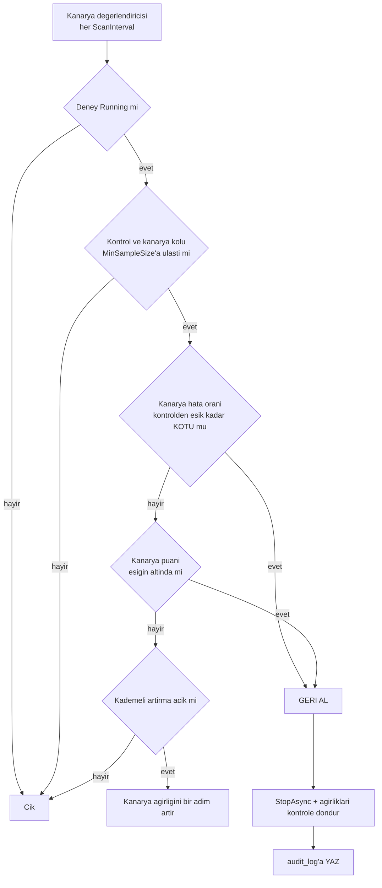

# Faz 56 — Kanarya Yayını ve Otomatik Geri Alma

> **Durum:** 📋 Planlandı (2026-08-08)
> **Kaynak:** [UCUNCU-FAZ-ADAYLARI.md](UCUNCU-FAZ-ADAYLARI.md) · **F-74**
> **Önkoşul:** [Faz 19](19-SURUM-KARSILASTIRMA-VE-AB.md) (deney altyapısı) · [Faz 31](31-GERI-BILDIRIM-VE-PUANLAMA.md) · [Faz 44](44-HATA-SINIFLANDIRMA.md) · [Faz 49](49-CEVRIMICI-DEGERLENDIRME.md) — üçü de **tamamlandı**
> **Paketler:** `AgentPrism.Abstractions`, `AgentPrism.Core`, `AgentPrism.AspNetCore`, `AgentPrism.Sql.Shared`, `AgentPrism.UI`
> **Yeni paket:** Yok · **Migration:** gerekli — `experiments` tablosuna eşik alanları, numara uygulama anında alınır
> **Public API:** büyüyor — `Experiment`'a alanlar + bir ayar sınıfı. 🚨 `Experiment` bir `sealed record`; Faz 7'den **sonra** alan eklemek sürüm kararı olurdu

---

## Bu Faza Başlarken

> `faz-baslangic` skill'ini uygula.

1. Bu doküman
2. Kararlar — dosyanın tamamını **okuma**, yalnız bu kalemleri grep'le:
   ```bash
   grep -n "K-003\|K-089\|K-354" docs/KARARLAR.md
   ```
   **K-003** (kod kaynaklı agent'ta sürüm geçmişi yok — deney kurulamaz),
   **K-089** (denetim izine yazılamayan iş çalışmaz — **otomatik geri alma için emsal**),
   **K-354** (SQL'e dokunan arka plan servisi `SchemaReadyGate`'i bekler)
3. [`49-CEVRIMICI-DEGERLENDIRME.md`](49-CEVRIMICI-DEGERLENDIRME.md) — devir notu **ve**
   `MinSampleSize` + `EvaluationWindow` kuralı:
   ```bash
   awk '/## Sonraki Faza Devir Notu/,0' docs/49-CEVRIMICI-DEGERLENDIRME.md
   ```
   🚨 **Bu adım atlanamaz** — eşik mantığı oradan **aynen** alınır.
4. [`19-SURUM-KARSILASTIRMA-VE-AB.md`](19-SURUM-KARSILASTIRMA-VE-AB.md) — deney sözleşmesi ve atama çözücü
5. Alan hafızası: [`hafiza/sql-saglayicilari.md`](hafiza/sql-saglayicilari.md),
   [`hafiza/frontend.md`](hafiza/frontend.md)

---

## Amaç

Faz 19 A/B deneyini verdi ama **kimse sonuca göre karar vermiyor**. Varyant
başına hata oranı hesaplanıyor; bu sayıyı okuyup deneyi durduran hiçbir kod
yok. Trafik oranı sabittir ve hata oranı patlarsa deney kendiliğinden durmaz.

- **F-74** — deneye eşik kuralı (hata oranı > X veya puan < Y ise durdur),
  kademeli trafik artırma, otomatik geri alma ve denetim kaydı.

### Doğrulanmış kanıt

| Kanıt | Gözlem |
|---|---|
| [`ExperimentVariantResult.cs:58-66`](../src/AgentPrism.Abstractions/Experiments/ExperimentVariantResult.cs) | `ErrorRate` varyant başına **hesaplanıyor** (`settled` paydasıyla) |
| `grep -rn "ErrorRate" src/` | Hiçbir kod bu değeri okuyup deneyi durdurmuyor — yalnız raporlanıyor |
| [`Experiment.cs:31`](../src/AgentPrism.Abstractions/Experiments/Experiment.cs) | `Variants` ağırlıkları taşıyor, toplamı 100. **Kademeli artırma için yer hazır** ama zaman ekseni yok |
| [`IExperimentStore.cs:54,61`](../src/AgentPrism.Abstractions/Experiments/IExperimentStore.cs) | `StartAsync` / `StopAsync` var — otomatik geri alma **yeni bir yol yazmadan** bunu çağırabilir |
| [`OnlineEvaluationOptions.cs:60,63`](../src/AgentPrism.Core/Evaluation/OnlineEvaluationOptions.cs) | 🚨 `MinSampleSize = 20` ve `EvaluationWindow = 1 saat` **zaten tanımlı** — bu fazın eşik kuralı **üçüncü bir kural yazmamalıdır** |
| [`Experiment.cs:36-40`](../src/AgentPrism.Abstractions/Experiments/Experiment.cs) | `AssignmentKey` bir **rezerve alandır** ve bugün okunmaz; kademeli artırma bunu değiştirmemelidir |

> Kanıtlar 2026-08-08 tarihinde doğrulandı.

---

## 56.1 — Üç eşik kuralı değil, bir tane

🚨 **Bu fazın en önemli kısıtı budur.** Bugün eşik mantığı iki yerde var
olabilirdi:

| Yer | Kural |
|---|---|
| [Faz 49](49-CEVRIMICI-DEGERLENDIRME.md) | `MinSampleSize` + `EvaluationWindow` + `LowScoreThreshold` |
| Bu faz | "hata oranı > X ise durdur" |

Üçüncü bir eşik kuralı yazmak **üç yerde bakım** demektir. Bu faz Faz 49'un
`MinSampleSize` ve `EvaluationWindow` alanlarını **aynen kullanır**; yalnız
kararın **ne olduğu** (durdur / geri al) yenidir.

## 56.2 — Karar akışı



🚨 **Karşılaştırma mutlak değil, göreceldir.** "Hata oranı > %5 ise durdur"
kuralı, kontrolün de %8 hata verdiği bir agent'ta kanaryayı haksız yere
öldürür. Doğru kural: **kanarya kontrolden belirgin biçimde kötüyse**.

## 56.3 — Otomatik eylem varsayılan kapalıdır

Otomatik geri alma bir **otomatik eylemdir** (K1). Üç koruma:

1. `AutoRollbackEnabled` varsayılan **`false`**. Açılmadan hiçbir deney
   kendiliğinden durmaz.
2. `MinSampleSize` **zorunludur**. Az örnekte eşik gürültüye tepki verir; üç
   çalıştırmanın ikisi hata verirse hata oranı %66'dır ve bu bir sinyal değildir.
3. Her karar `audit_log`'a yazılır. 🚨 K-089 emsali: **denetim izine
   yazılamayan bir geri alma uygulanmaz.** Otomatik bir eylemin izsiz kalması
   kabul edilemez.

## 56.4 — Kademeli trafik artırma

Kanarya ağırlığı zamanla artar; her adımda eşik yeniden denetlenir.

| Ayar | Anlamı |
|---|---|
| `RampSteps` | Ağırlık adımları, ör. `[5, 25, 50, 100]` |
| `RampInterval` | Adımlar arası **asgari** süre |
| `RampRequiresSampleSize` | Bir sonraki adım için o adımda toplanması gereken asgari çalıştırma |

🚨 **Ağırlık değişimi atama kararını geçmişe dönük bozmamalıdır.** Atama anahtarı
oturum kimliğidir; ağırlık değişince **var olan oturumlar kolunu değiştirmez**.
Değiştirseydi bir kullanıcı konuşmanın ortasında başka bir talimat sürümüne
geçerdi. Bu, uygulamada **ölçülmesi** gereken bir davranıştır.

## 56.5 — Geri alma ne yapar

`Stopped` durumuna geçirir **ve** ağırlıkları kontrol koluna döndürür. Tanım
sürümü **silinmez veya geri alınmaz** — Faz 19'un `RollbackAsync`'i ayrı bir
işlemdir ve bir insan kararıdır. Bu faz yalnız **trafiği** keser.

---

## Planlanan Public API

```csharp
// AgentPrism.Abstractions — Experiment'a EKLENEN alanlar
// 🚨 sealed record; Faz 7'den sonra alan eklemek surum karari olurdu.
public sealed record Experiment
{
    // ... mevcut alanlar ...

    /// <summary>Kanarya kurallari. null ise otomatik karar YOKTUR (K1).</summary>
    public CanaryPolicy? Canary { get; init; }

    /// <summary>Otomatik geri almanin nedeni. Elle durdurulmussa null.</summary>
    public string? RollbackReason { get; init; }
}

public sealed record CanaryPolicy
{
    /// <summary>Kanarya kolunun adi. Kalan kollar kontrol sayilir.</summary>
    public required string CanaryVariant { get; init; }

    /// <summary>
    /// Kanaryanin hata orani kontrolden bu kadar YUKSEKSE geri alinir (mutlak fark, 0-1).
    /// </summary>
    public double? MaxErrorRateDelta { get; init; }

    /// <summary>Kanarya ortalama puani bu esigin altindaysa geri alinir.</summary>
    public int? MinScore { get; init; }

    /// <summary>🚨 Faz 49'un OnlineEvaluationOptions.MinSampleSize kuralini AYNEN kullanir.</summary>
    public int MinSampleSize { get; init; } = 20;

    public IReadOnlyList<int> RampSteps { get; init; } = [];

    public TimeSpan RampInterval { get; init; } = TimeSpan.FromHours(1);
}

public sealed class CanaryOptions
{
    public const string SectionName = "AgentPrism:Canary";

    /// <summary>🚨 Varsayilan KAPALI (K1).</summary>
    public bool AutoRollbackEnabled { get; set; }

    public TimeSpan ScanInterval { get; set; } = TimeSpan.FromMinutes(5);
}
```

### HTTP `endpoint`'leri

| Metot | Yol | Rol | Ne yapar |
|---|---|---|---|
| `PUT` | `/api/experiments/{name}/canary` | Admin | Kanarya kuralını tanımlar veya kaldırır |
| `GET` | `/api/experiments/{name}/canary` | Reader | Kuralı ve son değerlendirmeyi döner |

Geri alma için ayrı bir uç **yoktur**: mevcut `POST /api/experiments/{name}/stop`
elle durdurmayı zaten karşılıyor.

### Arayüz payı

Deney ekranına bir bölüm: kanarya kuralı, güncel ağırlık, son değerlendirme ve
geri alma nedeni. Pay **ölçülmelidir**; bütçe 250 KB gzip.

---

## Planlanan Dosya Listesi

```
src/AgentPrism.Abstractions/Experiments/
├── CanaryPolicy.cs
├── CanaryEvaluation.cs
└── Experiment.cs                   (iki alan eklenir)

src/AgentPrism.Core/Experiments/
├── CanaryOptions.cs
├── CanaryEvaluator.cs              (saf karar mantigi - model cagirmaz)
└── CanaryEvaluationService.cs      (BackgroundService + SingletonGuard + SchemaReadyGate)

src/AgentPrism.Sql.Shared/Stores/
└── SqlExperimentStore.cs           (kanarya alanlari)

src/AgentPrism.{PostgreSql,SqlServer,Sqlite}/Migrations/
└── NNNN_experiment_canary.sql      (uc ayri set - K-178)

src/AgentPrism.AspNetCore/Endpoints/
└── ExperimentEndpoints.cs          (iki uc eklenir)

src/AgentPrism.UI/src/
└── (Experiments ekranina bolum + locales/en.ts, tr.ts)
```

---

## Testler

| Test sınıfı | Neyi doğrular |
|---|---|
| `CanaryEvaluatorTests` | 🚨 **Saf karar mantığı, veritabanı yok.** Eşik aşılırsa geri al; `MinSampleSize`'a ulaşılmadıysa **karar verme**; kontrol de kötüyse geri **alma** (göreceli karşılaştırma) |
| `ExperimentStoreContract` (mevcut, genişletilir) | Kanarya alanları dört koşumda da yazılıp okunur |
| `CanaryAutoRollbackTests` (functional) | Uçtan uca: kanarya hata verir → deney `Stopped` → ağırlıklar kontrole döner → `audit_log`'da kayıt var |
| `CanaryDisabledTests` | `AutoRollbackEnabled = false` (varsayılan) iken **hiçbir** deney durdurulmaz |
| `CanaryRampTests` | Ağırlık adım adım artar; 🚨 **var olan oturumlar kolunu değiştirmez** |
| `CanaryAuditTests` | Denetim izi yazılamazsa geri alma **uygulanmaz** (K-089) |
| `CanarySingletonTests` | İki örnekte değerlendirme yalnız birinde koşar |

---

## Açık Sorular

| # | Soru | Seçenekler | Öneri |
|---|---|---|---|
| 1 | Eşik mutlak mı göreceli mi? | A: `ErrorRate > X` · B: `ErrorRate - kontrol > X` | **B** (56.2'de gerekçelendirildi). A, gürültülü bir agent'ta kanaryayı haksız öldürür |
| 2 | Puan kaynağı hangisi? | A: Faz 49'un çevrimiçi eval puanı · B: Faz 31'in kullanıcı geri bildirimi · C: İkisi de | **A** ilk turda. B seyrektir ve `MinSampleSize`'a nadiren ulaşır; C iki kaynağı birleştirme kararı ister |
| 3 | Kademeli artırma bu fazda mı? | A: Evet · B: Ayrı kalem | **A**, ama `RampSteps` boşken **hiç çalışmaz**. Geri alma tek başına yarım bir yetenektir: kanarya kavramı "az trafikle başla" demektir |
| 4 | Geri alma sonrası yeniden başlatma otomatik mi? | A: Elle · B: Belirli süre sonra otomatik | **A.** Otomatik yeniden başlatma bir döngü üretir; geri alınan bir deneyin nedeni incelenmelidir |
| 5 | Değerlendirme penceresi Faz 49'unkiyle aynı mı? | A: Aynı ayar · B: Ayrı ayar | **B**, ama **varsayılanı A'dan alır**. Kanarya penceresi genelde daha kısadır; yine de üçüncü bir kural değil, aynı kuralın ayarlanmış hâlidir |

---

## Bitiş Ölçütleri (DoD)

- [ ] Kanarya kolu kontrolden eşik kadar kötüyse deney **otomatik durur** ve ağırlıklar kontrole döner
- [ ] Kontrol de kötüyse kanarya **durdurulmaz** (göreceli karşılaştırma çalışıyor)
- [ ] `MinSampleSize`'a ulaşılmadan **hiçbir** karar verilmez
- [ ] `AutoRollbackEnabled = false` (varsayılan) iken hiçbir deney durdurulmaz
- [ ] Her otomatik karar `audit_log`'da görünür; yazılamazsa karar uygulanmaz
- [ ] Kademeli artırmada var olan oturumlar kolunu **değiştirmez** (ölçüldü)
- [ ] Değerlendirme iki örnekli kurulumda yalnız birinde koşar
- [ ] Değerlendirici `SchemaReadyGate`'i bekler (K-354)
- [ ] Dört doğrulama kapısı sıfır uyarı verir
- [ ] `samples/AgentPrism.Api` ile gerçek `run` yapıldı, çıktı belgeye yazıldı
- [ ] `secret` taraması boş döndü
- [ ] `en.ts` ve `tr.ts` eksiksiz; bundle payı **ölçüldü** ve yazıldı

### Doğrulama komutları

```bash
# Kanarya kurali tanimla
curl -s -X PUT http://localhost:5080/agentprism/api/experiments/yeni-talimat/canary \
  -H "Content-Type: application/json" \
  -d '{"canaryVariant":"treatment","maxErrorRateDelta":0.10,"minSampleSize":20,"rampSteps":[5,25,50,100]}'

# Deneyin durumu ve geri alma nedeni
curl -s http://localhost:5080/agentprism/api/experiments/yeni-talimat | jq '.status, .rollbackReason'

# Denetim izinde karar
curl -s "http://localhost:5080/agentprism/api/audit?action=experiment.auto_rollback" | jq '.items[0]'
```

---

## Riskler

| Risk | Önlem |
|------|-------|
| 🚨 Az örnekte gürültüye tepki | `MinSampleSize` **zorunlu**; testte üç çalıştırmalık senaryo karar vermemeli |
| Sağlıklı bir kanarya haksız öldürülür | Göreceli karşılaştırma (açık soru 1); kontrol de kötüyse geri alma yok |
| Üçüncü bir eşik kuralı doğar | Faz 49'un `MinSampleSize` + pencere kuralı **aynen** kullanılır; kod incelemesinde bu madde denetlenir |
| Otomatik eylem izsiz kalır | K-089 emsali: denetim izi yazılamazsa karar uygulanmaz |
| Ağırlık değişimi oturumları kol değiştirtir | Atama anahtarı oturum kimliğidir; `CanaryRampTests` bunu **ölçer** |
| `Experiment` `sealed record`; alan eklemek | Faz 7'den **önce** bedava. Bu fazın Faz 7'den önce yapılmasının somut gerekçesi budur |
| Değerlendirme N replikada N kez koşar | `SingletonGuard` (Faz 42) |

---

<!-- ============================================================
     AŞAĞISI KAPANIŞTA DOLDURULUR — `faz-tamamlama` skill'i.
     Plan anında boş kalır. Başlıkları SİLME.
     ============================================================ -->

## Plandan Sapmalar

> Kapanışta doldurulur.

## Bu Fazda Verilen Kararlar

> Kapanışta doldurulur. K-NNN numaraları burada alınır.

## Gerçekleşen Public API

> Kapanışta doldurulur.

## Dosya Listesi (gerçekleşen)

> Kapanışta doldurulur.

## Sonraki Faza Devir Notu

> Kapanışta doldurulur.
