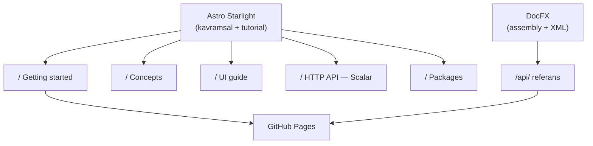

# Faz 59 — Ürün Dokümantasyonu (Doküman Sitesi)

> **Durum:** 📋 Planlandı (2026-08-15)
> **Kaynak:** Kullanıcı isteği (2026-08-15). Faz 7'nin 7.7 alt başlığını
> ("Dokümantasyon — dış tüketici gözüyle") **devralır ve genişletir**.
> **Önkoşul:** [Faz 57](57-KOD-DILI-BIRLESTIRME.md) — **zorunlu.** API referansı
> XML dokümandan üretilir; Türkçe XML doküman Türkçe site üretir.
> **Paketler:** Kod değişmez; `AgentPrism.AspNetCore` OpenAPI üstverisi düzeltilir
> **Yeni paket:** Yok (Node tarafında yeni bir çalışma alanı) · **Migration:** Yok
> **Public API:** Değişmiyor

---

## Bu Faza Başlarken

1. Bu doküman
2. Kararlar:
   ```bash
   grep -n "K-039\|K-232\|K-045\|K-228\|K-068" docs/KARARLAR.md
   ```
   **K-039** + reddedilen L35 (`Microsoft.AspNetCore.OpenApi` bağımlılığı
   **alınmadı**; belge tüketicinin `AddOpenApi()` çağrısıyla oluşur — siteye
   gömülecek JSON bu yüzden bir *snapshot*'tır), **K-232** (tek dilli API
   sözleşmesi), **K-045**/**K-228** ("kütüphane yerine elle yaz" emsali),
   **K-068** (yayın ertelendi).
3. Faz 57 devir notu:
   ```bash
   awk '/## Sonraki Faza Devir Notu/,0' docs/57-KOD-DILI-BIRLESTIRME.md
   ```
4. Alan hafızası: [`hafiza/frontend.md`](hafiza/frontend.md) (Node sürümü, Vite,
   bundle bütçesi), [`hafiza/aspnetcore-json.md`](hafiza/aspnetcore-json.md)
   (`.WithTags`/`.Produces` üstverisi — OpenAPI açıklamaları oradan gelir)
5. [`MIMARI.md`](MIMARI.md) — **tamamı**. Bu fazın "Concepts" bölümünün kaynağıdır.

---

## Amaç

AgentPrism 17 NuGet paketi ve 33 route'luk bir arayüz yayınlıyor. Kullanıcıya
dönük dokümantasyon bugün ~2.500 satırdır (`README.md` 362 + 18 paket README
1.375 + `MIMARI.md` 751); geri kalan ~99.500 satır **geliştirme günlüğüdür**.
Site altyapısı sıfırdır — repo genelinde DocFX, Docusaurus, MkDocs veya
GitHub Pages izi yoktur.

Bu faz iki hedef kitleye tek site üretir:

- **Kullanıcı** — kurulum, ilk agent, arayüz turu, HTTP API
- **Geliştirici (paket tüketicisi)** — API referansı, genişleme noktaları,
  paket seçimi

**Dil: yalnız İngilizce** (kullanıcı kararı, 2026-08-15). Gerekçe K-232 ile
aynıdır: paket uluslararası yayınlanır, aynı metin günlükte, testte ve destek
kaydında aynı olmalıdır. `docs/` Türkçe kalmaya devam eder — bu iki karar
birbirinden bağımsızdır.

### Bugün ne çalışmıyor — doğrulanmış kanıt

| Kanıt | Gözlem |
|---|---|
| `.github/workflows/` | **Tek dosya** (`ci.yml`); `pages` job'u, `permissions: pages`, `actions/deploy-pages` yok |
| `docs/openapi/agentprism.json` `info.title` | `"AgentPrism.AspNetCore.FunctionalTests \| v1"` — snapshot'ı üreten test host'unun adı |
| aynı dosya `servers` / `securitySchemes` | `http://localhost/` · **boş** |
| aynı dosya, `description` alanı | 143 operasyonun **68'inde** var (%48) |
| `src/AgentPrism.UI/README.md` | "7 ekran", "~88 KB" — gerçek 27 ekran / 33 route |
| `src/AgentPrism.Abstractions/README.md` | **20 satır**; `Core` 23, `PostgreSql` 25, meta 31, `AspNetCore` 32 — en merkezî beş paketin README'si en ince olanlar |
| `<example>` XML etiketi | 590 public tipte **21 tane** |

> Kanıtlar 2026-08-15 tarihinde doğrulandı.

### Eldeki hammadde — güçlü

| Girdi | Durum |
|---|---|
| HTTP API | 112 path, 143 operasyon, 226 şema; **143/143 `summary`**, 2xx şeması olmayan uç **0**; snapshot testiyle güncel tutuluyor |
| Arayüz | 33 route, 27 ekran, `locales/en.ts` 1.009 anahtar |
| Örnek uygulama | `samples/AgentPrism.Api/Program.cs` — 729 satır, başında ~201 satırlık kavram anlatımı (Faz 57.5'te İngilizce yazılacak) |
| Şablon | `dotnet new agentprism-api`, üç seçenek |
| XML doküman | 4.267 `<summary>`, 590 public tip — Faz 57 sonunda İngilizce |

---

## 59.0 — DocFX spike (ilk iş, kısa)

> Bu bölüm bir **ölçümdür**, bir uygulama değil. Sonucu 59.2'nin şeklini belirler.

**Risk.** DocFX kararlı sürümü **2.78.5**'tir (2026-02). .NET Foundation altında
topluluk bakımındadır ve **.NET 8 hedefler**; .NET 10 desteği yalnız nightly
paketlerdedir. Bu repo `global.json` ile SDK **10.0.100**'e sabittir ve
`allowPrerelease: false`'tur.

**Azaltma.** DocFX'i csproj/MSBuild üzerinden çalıştırma. `dotnet build`'in
zaten ürettiği ikiliyi ver:

```
artifacts/bin/<Paket>/release/<Paket>.dll
artifacts/bin/<Paket>/release/<Paket>.xml
```

Bu mod MSBuild/Roslyn bağımlılığını tamamen kaldırır. Spike bunu **17 pakette**
doğrular.

⚠️ Üç paket farklıdır: `AgentPrism.Testing` ve `AgentPrism.Templates` yalnız
`net10.0` hedefler; `AgentPrism.Generators` `netstandard2.0`'dır ve
`IsPackable=false`'tur (DLL'i `Core` nupkg'sinin içinde taşınır).

**Spike başarısızsa** alternatif: XML → markdown üreteci yazmak. Repo'nun
"kütüphane yerine elle yaz" emsali vardır (K-045 yönlendirici, K-228 i18n).
Maliyet: kalıtım, generic ve overload gösterimini kendin sahiplenirsin.

**Çıktı:** bir karar cümlesi — "DocFX assembly+XML modu 17 pakette çalışıyor"
veya "çalışmıyor, sebep X, alternatif Y".

---

## 59.1 — Ön koşul düzeltmeleri

Site yazılmadan önce kaynak veriler doğru olmalıdır.

| # | Düzeltme | Yer |
|---|---|---|
| 1 | `info.title` gerçek ürün adını taşısın | Snapshot'ı üreten host yapılandırması |
| 2 | `servers` ve `securitySchemes` doldurulsun | Aynı yer; `securitySchemes` API anahtarı şemasını yansıtmalı (Faz 53) |
| 3 | Eksik 75 `description` yazılsın | `.WithDescription` — `src/AgentPrism.AspNetCore/` |
| 4 | Beş merkezî paket README'si genişletilsin | `Abstractions`, `Core`, `PostgreSql`, `AspNetCore`, meta |
| 5 | `src/AgentPrism.UI/README.md` güncellensin | 27 ekran, ölçülen bundle değeri |

> 1–3 `docs/openapi/agentprism.json` snapshot'ını değiştirir. Yenileme:
> `AGENTPRISM_OPENAPI_REFRESH=1 dotnet test tests/AgentPrism.AspNetCore.FunctionalTests -c Release --filter-method "*OpenApiSnapshot*"`

---

## 59.2 — Site yapısı



| Bölüm | Kaynak |
|---|---|
| Getting started | `README.md` kurulum + `dotnet new agentprism-api` + ilk agent |
| Concepts | `docs/MIMARI.md` (İngilizce yazılır) + `samples/.../Program.cs` kavram bloğu |
| UI guide | 33 route / 27 ekran; ekran görüntüleriyle |
| HTTP API | `docs/openapi/agentprism.json` → Scalar ile render |
| Packages | 17 paket README'si |
| `/api/` | DocFX, 590 public tip |

**Neden iki araç.** Starlight yerleşik i18n, Pagefind araması, MDX ve
bakımlı bir tema verir; DocFX .NET API referansının standart üreticisidir ve
XML dokümanı doğrudan okur. Tek araçla ikisini iyi yapmak mümkün değildi:
DocFX'in kavramsal tarafı zayıf, Starlight'ın .NET API referansı yok.

**Ekran görüntüsü disiplini.** Playwright E2E altyapısı zaten var
(`tests/AgentPrism.Ui.E2ETests/`). Tutorial görselleri **elle alınmaz** —
E2E koşumundan üretilir. Gerekçe: elle alınan görsel arayüz değişince sessizce
bayatlar ve bunu kimse fark etmez. `docs/manuel-test/kanit/S4/MT-UI-043-dashboard-375.png`
bu desenin tek örneğidir; genelleştirilir.

> 🚨 E2E testleri dili **sabitlemek zorundadır** (K-231: varsayılan dil
> tarayıcıdan gelir). Ekran görüntüsü üreten koşum `en-US` sabitler, yoksa
> görseller koşumu yapan makinenin diline bağlanır.

---

## 59.3 — Yayın

`.github/workflows/ci.yml`'e `pages` job'u eklenir: `permissions: pages: write`,
`actions/deploy-pages`. Tetikleyici `main`'e push.

Site çıktısı ve Node çalışma alanı `.gitignore`'a girer. Doküman sitesi
`dotnet build`'e **bağlanmaz** — arayüzden farklı olarak pakete gömülmez, ayrı
bir yayın hattıdır.

---

## Planlanan Public API

Değişiklik yok. 59.1'in 1–3 numaralı kalemleri `endpoint` **üstverisini**
değiştirir (`WithDescription`), imzaları değil.

### Arayüz payı

Yok. Doküman sitesi ayrı bir Node projesidir; `AgentPrism.UI` bundle'ına
girmez ve 250 KB gzip bütçesini etkilemez.

---

## Planlanan Dosya Listesi

```
docs-site/                          (yeni — repo kökünde, docs/ ile karıştırma)
├── astro.config.mjs
├── package.json
├── src/content/docs/               (MDX içerik, İngilizce)
└── public/screenshots/             (E2E'den üretilir)
docfx/
├── docfx.json                      (assembly + XML modu)
└── filterConfig.yml
.github/workflows/ci.yml            (pages job'u eklenir)
```

> `docs-site/` adı bilinçlidir. `docs/` Türkçe geliştirme günlüğüdür;
> `docs-site/` İngilizce ürün dokümantasyonudur. İkisi karıştırılmaz.

---

## Testler

| Test | Neyi doğrular |
|---|---|
| Bağlantı denetimi (site build'i) | İç bağlantılar kırık değil |
| `OpenApiSnapshotTests` (var olan) | 59.1'den sonra snapshot güncel |
| E2E ekran görüntüsü koşumu | Görseller üretiliyor ve dil `en-US` sabit |

---

## Açık Sorular

| # | Soru | Seçenekler | Öneri |
|---|---|---|---|
| 1 | Site sürümlenecek mi (v1 / v2 ayrı)? | A: hayır, tek sürüm · B: Starlight versioning | **A** — paket henüz yayınlanmadı; sürümleme ilk `1.0` sonrası anlam kazanır |
| 2 | `/api/` referansı 17 paketin **hepsini** mi kapsasın? | A: hepsi · B: yalnız meta pakete girenler (7) | **A** — `Sqlite`, `Anthropic` gibi paketler tam da referans aranan yerlerdir |
| 3 | `docs/MIMARI.md` İngilizce'ye kopyalansın mı, yoksa Concepts sıfırdan mı yazılsın? | A: kopyala-uyarla · B: sıfırdan | **B** — MIMARI iç okuyucu için yazıldı (karar referansları, faz numaraları). Dış okuyucu bunları bilmez |
| 4 | Alan adı / Pages yolu | `farukatasoy.github.io/AgentPrism` · özel alan adı | Kullanıcıya sorulacak; Faz 7'nin 7.4 (depo adresi) kalemiyle birlikte karara bağlanır |

---

## Bitiş Ölçütleri (DoD)

- [ ] 59.0 spike sonucu bir karar cümlesiyle bu dokümana yazıldı
- [ ] Site yerel derleniyor: `npm run build` sıfır hata
- [ ] `/api/` altında **590 public tip** görünüyor ve açıklamaları **İngilizce**
- [ ] Scalar 143 operasyonu render ediyor; `info.title` ürün adını taşıyor
- [ ] Getting started sayfası temiz bir makinede baştan sona izlendi ve çalıştı
- [ ] UI guide'daki her ekran görüntüsü E2E koşumundan **üretildi**, elle alınmadı
- [ ] İç bağlantı denetimi sıfır kırık bağlantı
- [ ] `pages` job'u yeşil; site yayında
- [ ] Dört doğrulama kapısı sıfır uyarı verir
- [ ] `secret` taraması boş döndü — yayınlanan sitede bağlantı dizesi/anahtar yok

### Doğrulama komutları

```bash
# Site
cd docs-site && npm ci && npm run build

# API referansı gerçekten İngilizce mi
grep -c "summary" docfx/_site/api/*.html | head

# OpenAPI üstverisi
python3 -c "import json;d=json.load(open('docs/openapi/agentprism.json'));print(d['info']['title'], d['servers'])"
```

---

## Riskler

| Risk | Önlem |
|------|-------|
| DocFX .NET 10 SDK ile çalışmaz | 59.0 spike **ilk iş**; assembly+XML modu MSBuild'i devre dışı bırakır. Başarısızsa markdown üreteci alternatifi |
| DocFX topluluk bakımında; sürüm kadansı düzensiz | Çıktı statik HTML'dir; araç durursa üretilmiş site çalışmaya devam eder. Bağımlılık yayın anında, çalışma anında değil |
| Faz 57 bitmeden site kurulur → API referansı Türkçe çıkar | Önkoşul **zorunlu** işaretli; 59.0 dışındaki hiçbir bölüm 57 bitmeden başlamaz |
| Ekran görüntüleri arayüz değişince bayatlar | E2E'den üretilir; elle alınan görsel kabul edilmez (DoD maddesi) |
| `docs/` ile `docs-site/` karışır, içerik iki yere yazılır | Ad ayrımı + `AGENTS.md`'ye tek satır kural |
| Site içeriği `README.md` ile kayar | README site'ye **bağlantı verir**, içeriği tekrarlamaz |

---

<!-- ============================================================
     AŞAĞISI KAPANIŞTA DOLDURULUR — `faz-tamamlama` skill'i.
     ============================================================ -->

## Plandan Sapmalar

> Kapanışta doldurulur.

## Bu Fazda Verilen Kararlar

> Kapanışta doldurulur. Beklenen: araç seçimi, `docs-site/` ayrımı, ekran
> görüntüsü üretim deseni, alan adı.

## Gerçekleşen Public API

> Kapanışta doldurulur. Değişiklik beklenmiyor.

## Dosya Listesi (gerçekleşen)

> Kapanışta doldurulur.

## Sonraki Faza Devir Notu

> Kapanışta doldurulur. Bu üç fazdan sonra sıradaki açık kalem **Faz 7**'dir
> (public API dondurma + NuGet yayını, K-068).
