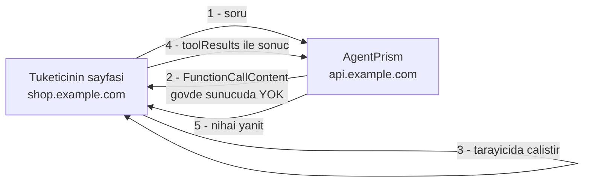
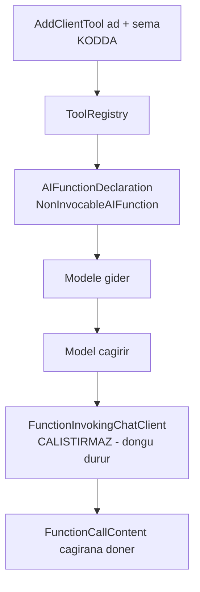

# Faz 61 — İstemci Tool'ları ve Gömülebilir Sohbet

> **Durum:** 📋 Planlandı (2026-08-18)
> **Kaynak:** [ADAYLAR.md](ADAYLAR.md) · **F-108**, **F-64**
> **Önkoşul:** [Faz 53](53-KIRACI-API-ANAHTARLARI.md) — tarayıcıya yönetim token'ı konulamaz, kapsamlı anahtar şart · [Faz 55](55-ASENKRON-ONAY-KUTUSU.md) — sonuç kanalının emsali · [Faz 48](48-GUARDRAILS.md) — istemciden gelen sonuç guard'dan geçer
> **Paketler:** `AgentPrism.Abstractions`, `AgentPrism.Core`, `AgentPrism.AspNetCore`, `AgentPrism.UI`
> **Yeni paket:** Yok · **Migration:** Yok — senkron kanal seçildi, bekleyen çağrı tablosu **yoktur** (Açık Soru 1'in kullanıcı kararı)
> **Public API:** büyüyor **ve bir imza genişliyor** — `PublicAPI.Shipped.txt` bugün **boş** (ölçüldü: 1 satır), `EnablePublicApiTracking` `true`. Kırıcı sayılan değişiklik bugün **bedava**, ilk yayından sonra değil
> **Site etkisi:** `ui.md` (gömülebilir bileşen bölümü), `capabilities.md`, yeni `guides/client-side-tools.md` + ekran görüntüsü
> **Manuel test alanı:** `docs/manuel-test/26-ISTEMCI-TOOLLARI-VE-GOMULEBILIR.md`

---

## Bu Faza Başlarken

> `faz-baslangic` skill'ini uygula. Aşağıdaki liste o skill'in 2. adımıdır —
> **tamamını değil, yalnız işaret edilen bölümleri oku.**

1. Bu doküman
2. Kararlar — dosyanın tamamını **okuma**, yalnız bu kalemleri grep'le:
   ```bash
   grep -n "K-012\|K-058\|K-059\|K-218\|K-228\|K-232\|K-296\|K-404" docs/KARARLAR.md
   ```
   **K-012** (tool'lar yalnız kodda — bu fazın en sıkı sınırı),
   **K-058** (MCP istisnası: kayıt kodda, çalıştırma uzakta — bu fazın emsali),
   **K-218** (tool bağımlılığı **kurulum anında** alınır, `AIFunctionArguments.Services` boştur),
   **K-228** (eksik sözlük anahtarı derleme hatasıdır),
   **K-232** (sunucu yanıtı çevrilmez),
   **K-296** (SSE başlıkları çoktan gönderilmiştir),
   **K-404** (bilinmeyen tool adı kayıt anında `400` ile reddedilir)
3. [`55-ASENKRON-ONAY-KUTUSU.md`](55-ASENKRON-ONAY-KUTUSU.md) — yalnız 55.2 ve 55.4:
   ```bash
   awk '/## 55.2/,/## 55.5/' docs/55-ASENKRON-ONAY-KUTUSU.md
   ```
   Bu faz onun **kanal desenini** devralır, tablosunu devralmaz.
4. Alan hafızası (bu faz üç alana dokunuyor):
   [`hafiza/frontend.md`](hafiza/frontend.md) (yeni bir Vite çıktısı ve sözlük),
   [`hafiza/aspnetcore-di.md`](hafiza/aspnetcore-di.md) (yeni uç ve seçenek),
   [`hafiza/maf-api.md`](hafiza/maf-api.md) (`AIFunctionDeclaration` ilk kez kullanılıyor)
5. Gerektiğinde, tamamı değil ilgili bölümü:
   [`MIMARI.md`](MIMARI.md) bölüm 3 (K2'nin tanımı ve iki istisnası)

---

## Amaç

Paketi kullanan bir arka uç servisi, agent'ının **tarayıcıda** çalışan bir
tool'u çağırmasını isteyebilir: kullanıcının o anki ekran durumunu okumak,
dosya seçtirmek, yalnız tarayıcıda duran bir kimlik bilgisiyle çağrı yapmak.
Bugün bunun yolu yoktur. Aynı tüketicinin kendi uygulamasına koyacağı küçük bir
sohbet kutusu da yoktur; arayüz tam bir kontrol düzlemidir.

Bu faz ikisini birlikte verir, çünkü **gömülebilir bileşen, istemci tool'unu
çalıştıran taraftır**. Biri olmadan diğeri yarım kalır.

- **F-108** — Gövdesi sunucuda olmayan tool türü ve sonucu geri alan senkron kanal.
- **F-64** — Ayrı çıktı olarak gömülebilir sohbet bileşeni ve onu mümkün kılan CORS yüzeyi.

### Bugün ne çalışmıyor — doğrulanmış kanıt

| Kanıt | Gözlem |
|---|---|
| [`IToolRegistry.cs:24`](../src/AgentPrism.Abstractions/Tools/IToolRegistry.cs) | `TryGet` bir **`AIFunction`** döndürür. Kayıtlı her tool'un gövdesi sunucudadır |
| [`ToolRegistry.cs:33-38`](../src/AgentPrism.Core/Tools/ToolRegistry.cs) | "Sunucuda çalıştırma" kararının **tek** yeri. `ApprovalRequiredAIFunction` yalnız **kararı** erteler; onaydan sonra gövdeyi yine sunucu çalıştırır |
| [`ApprovalResumeJobHandler.cs:96`](../src/AgentPrism.Core/Approvals/ApprovalResumeJobHandler.cs) | Sürdürme `ToolApprovalResponseContent` yazar — **karar**, sonuç değil |
| [`AgentContracts.cs:233`](../src/AgentPrism.AspNetCore/Contracts/AgentContracts.cs) | `AgentRunRequest.Approvals` var. İstemci sonucu için **kardeş alanın emsali** budur |
| [`AgentEndpoints.cs:545`](../src/AgentPrism.AspNetCore/Endpoints/AgentEndpoints.cs) | `approvals` için `sessionId` **zorunlu** — bekleyen istek oturum geçmişinde yaşar. Aynı kısıt tool sonucu için de geçerlidir |
| [`AgentEndpoints.cs:534-540`](../src/AgentPrism.AspNetCore/Endpoints/AgentEndpoints.cs) | Kuyruğa alınan çalıştırmada `approvals` **bilerek `400`**. Bu fazın kuyruk kararı aynı emsali izler |
| `grep -rn "ClientTool\|DeferredTool\|RemoteTool" src/` | Yalnız MCP'nin kendi `McpClientTool`'u. **Sıfır altyapı** |
| 🚨 `grep -rn "Cors\|AllowAnyOrigin\|WithOrigins" src/` | **Sıfır sonuç. CORS yoktur.** Farklı origin'deki bir sohbet kutusu bugün tarayıcı tarafından engellenir — F-64'ün gerçek ön koşulu budur ve aday listesi bunu yazmamıştı |
| [`postbuild.mjs:25`](../src/AgentPrism.UI/frontend/scripts/postbuild.mjs) | `JS_BUDGET_BYTES = 250 * 1024` gzip. Kapı **tek** çıktıya uygulanır |
| Ölçüm: `wwwroot/assets/index-*.js` | gzip **169.396 B = 165,4 KB** / 250 KB → kalan pay **84,6 KB**. 🚨 Aday listesindeki "151,3 KB, kalan ~99 KB" **bayattı** |
| [`ApiKeyScope.cs:26`](../src/AgentPrism.Abstractions/Security/ApiKeyScope.cs) | `RunsWrite` = "Starting a run, cancelling, giving approval". Gömülebilir bileşenin ihtiyacı tam olarak budur |
| `PublicAPI.Shipped.txt` (1 satır) · `Directory.Build.props:58` | İzleme **açık**, ama yayınlanmış yüzey **boş**. İmza genişletmek bugün bedava |

> Kanıtlar 2026-08-18 tarihinde doğrulandı.

### MAF ölçümleri — tahmin değil, koşuldu

Fazın çekirdek mekanizması `maf-api-kesfi` ve bir davranış probu ile ölçüldü
(2026-08-18, `Microsoft.Extensions.AI` + MAF 1.16.0):

| Ölçüm | Sonuç |
|---|---|
| `AIFunctionDeclaration` var mı? | **Var.** `AITool` türevi, `abstract`, yalnız `JsonSchema` + `ReturnJsonSchema` taşır |
| `AIFunction.AsDeclarationOnly()` ne döner? | `Microsoft.Extensions.AI.AIFunction+NonInvocableAIFunction`. 🚨 `is AIFunction` → **`False`**. Ad, açıklama ve şema korunur |
| Bildirim-yalnız tool modele gider mi? | **Evet.** `FunctionInvokingChatClient` onu `Tools` içinde modele geçirir |
| Sunucu onu çalıştırır mı? | **Hayır.** Tek model çağrısı sonrası döngü durur ve `FunctionCallContent` **çağırana döner** |
| `TerminateOnUnknownCalls` etkisi? | **Yok.** Varsayılan `False`; `true`/`false` ikisinde de davranış aynı — çağrı "bilinmeyen" değil, "çağrılamaz". Bu bayrağa **bağımlılık kurulmaz** |
| Kontrol: gerçek `AIFunction`? | İki model çağrısı, `FunctionResultContent` sunucuda üretiliyor — zıtlık kanıtlandı |
| Sonuç dışarıdan verilirse tur tamamlanır mı? | **Evet.** Geçmişe `FunctionResultContent` eklenince model ikinci turda nihai metni üretti |

🚨 **Bu ölçüm fazın en pahalı riskini kaldırdı.** Mekanizma MAF'ta **hazırdır**;
AgentPrism yeni bir çalıştırma yolu yazmaz, var olan bir MAF ayrımını kullanır.

### Ölçülen ve düzeltilen yanlış iddia

`OpenAIResponsesEndpoints.cs` XML dokümanı, çağıranın "standart OpenAI akışını
izleyip bir sonraki turda `function_call_output` verebileceğini" yazıyordu.
**Ölçüldü ve yanlış çıktı:** MAF'ın `OpenAIResponses.ToAgentRunRequest`'i
`input` dizisinin **her** öğesini iç `Responses.Models.InputMessage` tipine
çözer; bu tip `role` ve `content` alanlarını **zorunlu** ister. `type` üzerinden
çok biçimli dağıtım yoktur, bu yüzden `function_call_output` **ve**
`function_call` öğeleri `JsonException` ile düşer ve uç `400` döner.

Yorum bu fazın hazırlığı sırasında koda göre düzeltildi. **Sonuç: OpenAI uyumlu
yüzey bu fazın sonuç kanalı olamaz.** Tool çağrı turu orada yalnız **çıkış**
yönünde vardır.

---

## 61.1 — İki yarı neden tek faz



Üçüncü adım tarayıcıda geçer. Onu çalıştıracak bir istemci yoksa F-108'in
uçtan uca kanıtı yazılamaz. Birinci ve dördüncü adımlar **farklı origin**
arasında geçer; CORS olmadan tarayıcı ikisini de engeller. Bu yüzden iki kalem
aynı fazdadır: **F-64 F-108'in istemcisi, CORS ise ikisinin ortak ön koşuludur.**

## 61.2 — İstemci tool'u: bildirim kodda, gövde istemcide

🚨 **K2 gevşemez.** Tool'un **bildirimi** — ad, açıklama, JSON şeması — kodda
kalır. Yalnız **gövdesi** istemcide çalışır. Bu, K-058'in (MCP) desenidir:
kayıt kodda, çalıştırma başka yerde.



**Kapsam dışı, bilerek:** tool tanımının istemciden çalışma anında bildirilmesi
(Vercel AI SDK `useChat` deseni). O, K2'nin **üçüncü istisnası** olurdu ve ayrı
bir karar ister. Bu faz onu **açmaz**; `AgentDefinitionValidator` (K-404) hiç
değişmeden çalışmaya devam eder.

**`AgentPrismToolRegistration` bugün `AIFunction` alıyor.** İstemci tool'u
`AITool`'dur ama `AIFunction` **değildir** (ölçüldü). Kayıt tipi ve
`IToolRegistry.TryGet` bu yüzden `AITool`'a genişler. Bugün bedava; ilk
yayından sonra kırıcı olurdu.

## 61.3 — Sonuç kanalı: `AgentRunRequest.ToolResults`

Karar (kullanıcı, 2026-08-18): **senkron alan, tablo yok.**

`Approvals` ile birebir aynı sözleşme:

| Kural | Gerekçe |
|---|---|
| `sessionId` **zorunlu** | Bekleyen çağrı oturum geçmişinde yaşar. Oturumsuz çalıştırmada bulunamaz — `Approvals`'ın kısıtının aynısı (`AgentEndpoints.cs:545`) |
| Kuyruk yolunda **`400`** | `Prefer: respond-async` çalıştırmasında bağlı tarayıcı yoktur. Faz 46 `approvals` için aynı kararı verdi (`AgentEndpoints.cs:534-540`) |
| `callId` **eşleşmeli** | Oturum geçmişinde o `callId` ile bekleyen bir çağrı yoksa `400` |
| **Tek kullanımlık** | Aynı `callId` ikinci kez yanıtlanamaz — `409` |

## 61.4 — Güvenilmeyen sonucun işlenmesi

🚨 **Bu fazın en büyük güvenlik değişikliği budur.** Bugün konuşmadaki her
`FunctionResultContent`'i **sunucu kodu** üretir. Bu fazdan sonra bir kısmını
**tarayıcı** üretir; model bağlamına yeni bir enjeksiyon yüzeyi açılır.

| Önlem | Nerede |
|---|---|
| Guard boru hattından geçer | [`ContentGuardMessageMasker.cs:156`](../src/AgentPrism.Core/Guards/ContentGuardMessageMasker.cs) `FunctionResultContent`'i **bilerek** kapsıyor — yeni kod gerekmez, kapsandığı **test edilir** |
| Kiracı bağı | Sonuç, çağrıyı üreten çalıştırmanın kiracısına ait olmalı |
| Boyut sınırı | Sonuç gövdesi sınırlanır; sınırsız metin bağlam penceresini tüketir |
| Denetim izi | Sonuç `audit_log`'a yazılır. 🚨 K-089'un emsali **uygulanmaz**: bu bir güvenlik **kararı** değil, veridir — yazma hatası çalıştırmayı kesmez ("gözlemlenebilirlik işlevi bozmaz") |

## 61.5 — CORS: varsayılan kapalı

CORS bugün **yoktur** ve bu faz onu ekler. K1 gereği **varsayılan kapalıdır**;
açılması kodda, açık bir origin listesiyle olur.

🚨 `AllowAnyOrigin` **sunulmaz.** Kimlik bilgisi taşıyan bir uçta joker origin
bir güvenlik hatasıdır ve kütüphane onu kolay yapmamalıdır.

## 61.6 — Gömülebilir bileşen: ayrı çıktı, ayrı bütçe

🚨 **Kontrol düzlemi bundle'ına girmez.** Ölçüldü: konsol bugün 165,4 KB / 250
KB gzip kullanıyor, kalan pay 84,6 KB. Widget o payı yemez; **ayrı bir Vite
girişi, ayrı çıktı ve ayrı bir bütçe kapısı** alır. Hedef **< 30 KB gzip**.

Kontrol düzlemi bileşenleri bu çıktıya sızarsa hedef tutmaz; kapı bunu
sayısal olarak zorlar.

Kimlik: Faz 53'ün kiracı API anahtarı, `RunsWrite` kapsamı. Yönetim token'ı
tarayıcıya **konulmaz**.

---

## Planlanan Public API

> Taslak imzalardır. Gerçekleşen imzalar kapanışta ayrı bir bölüme yazılır.

```csharp
// AgentPrism.Abstractions — genisleyen imza
public interface IToolRegistry
{
    IReadOnlyList<ToolDescriptor> List();

    // AIFunction -> AITool. Istemci tool'u AIFunction DEGILDIR (olculdu).
    bool TryGet(string name, [NotNullWhen(true)] out AITool? tool);
}

// ToolDescriptor'a yeni alan
public sealed record ToolDescriptor
{
    // ... mevcut alanlar
    /// <summary>Whether the tool body runs on the caller instead of the server.</summary>
    public bool RunsOnClient { get; init; }
}

// AgentPrism.Core — kayit
public static class AgentPrismClientToolExtensions
{
    public static IAgentPrismBuilder AddClientTool(
        this IAgentPrismBuilder builder,
        string name,
        string description,
        JsonElement jsonSchema);
}

// AgentPrism.AspNetCore — sozlesme, Approvals'in kardesi
public sealed record ClientToolResult
{
    public required string CallId { get; init; }
    public required string Result { get; init; }
    public string? ErrorMessage { get; init; }
}

public sealed record AgentRunRequest
{
    // ... mevcut alanlar
    public IReadOnlyList<ClientToolResult> ToolResults { get; init; } = [];
}

// AgentPrism.AspNetCore — CORS, varsayilan KAPALI
public sealed class AgentPrismEndpointOptions
{
    // ... mevcut alanlar
    /// <summary>Origins allowed to call the endpoints from a browser. Empty by default.</summary>
    public IList<string> AllowedOrigins { get; } = [];
}
```

🚨 **`AddClientTool` gövdesiz bir bildirim üretir.** Ölçülmüş yol:
`AIFunctionFactory.Create(...)` ile bir fonksiyon kurup `AsDeclarationOnly()`
çağırmak. `AIFunctionDeclaration` `abstract` ve `AITool.Name`/`Description`
üyelerinin ezilebilirliği **ölçülmedi**; doğrudan alt sınıf yazmak istenirse
önce `maf-api-kesfi` ile ölçülmelidir (Açık Soru 2).

### HTTP `endpoint`'leri

| Metot | Yol | Rol | Ne yapar |
|---|---|---|---|
| `POST` | `/api/agents/{name}/run` | Operator · `RunsWrite` | **Mevcut uç.** Gövdeye `toolResults` alanı eklenir; yeni uç açılmaz |

Yeni uç **yoktur**. Sonuç, onay kararıyla aynı kapıdan girer.

### Arayüz payı

| Çıktı | Bugün | Bu fazdan sonra | Kapı |
|---|---|---|---|
| Kontrol düzlemi | 165,4 KB gzip | Playground'a istemci tool rozeti + sözlük — **artış ölçülüp yazılacak** | 250 KB |
| Gömülebilir bileşen | yok | **yeni** | **< 30 KB gzip, ayrı kapı** |

---

## Planlanan Dosya Listesi

```
src/AgentPrism.Abstractions/Tools/
├── IToolRegistry.cs                 (imza genisler: AIFunction -> AITool)
├── ToolDescriptor.cs                (RunsOnClient alani)
└── AgentPrismToolRegistration.cs    (AITool kabul eder)

src/AgentPrism.Core/Tools/
├── ToolRegistry.cs                  (bildirim-yalniz kayit yolu)
└── ClientToolRegistration.cs        (yeni)

src/AgentPrism.AspNetCore/
├── Contracts/AgentContracts.cs      (ClientToolResult + ToolResults)
├── Endpoints/AgentEndpoints.cs      (toolResults isleme, kuyrukta 400)
├── Internal/ClientToolResultResolver.cs   (yeni - ToolApprovalResolver kardesi)
└── AgentPrismEndpointOptions.cs     (AllowedOrigins)

src/AgentPrism.UI/frontend/
├── vite.config.ts                   (ikinci giris)
├── src/embed/                       (yeni - gomulebilir bilesen)
│   ├── main.ts
│   └── ClientToolRunner.ts
├── src/locales/{en,tr}.ts           (yeni anahtarlar - K-228)
└── scripts/postbuild.mjs            (ikinci butce kapisi)
```

---

## Hata Modları ve Testler

> Mutlu yoldan değil, **ne bozulabilir**den türetilir. Seviyeyi plan seçer.

| Ne bozulabilir | Seviye | Test sınıfı |
|---|---|---|
| İstemci tool'u sunucuda **çalışır** (K2 ihlali) | Fonksiyonel | `ClientToolEndpointTests` — gövdeli fonksiyon hiç çağrılmadan `FunctionCallContent` döner |
| Bilinmeyen `callId` ile sonuç gönderilir | Fonksiyonel | `ClientToolEndpointTests` → `400` |
| Aynı `callId` iki kez yanıtlanır | Fonksiyonel | `ClientToolEndpointTests` → `409` |
| `sessionId` olmadan sonuç gönderilir | Fonksiyonel | `ClientToolEndpointTests` → `400` |
| Kuyruk yolunda (`Prefer: respond-async`) sonuç gönderilir | Fonksiyonel | `ClientToolEndpointTests` → `400` (Faz 46 emsali) |
| Başka kiracının çalıştırmasına sonuç yazılır | Sözleşme (`TenantIsolationContract`) | dört koşumda birden |
| İstemciden gelen sonuç guard'ı **atlar** | Fonksiyonel | `ClientToolGuardTests` — engellenen desen taşıyan sonuç maskelenir |
| Aşırı büyük sonuç bağlamı doldurur | Fonksiyonel | `ClientToolEndpointTests` → sınır aşımında `400` |
| Çalıştırma iptal edilirken sonuç gelir | Fonksiyonel | `ClientToolEndpointTests` |
| Eşzamanlı iki sonuç aynı `callId` için yarışır | Fonksiyonel | `ClientToolConcurrencyTests` |
| CORS varsayılan **açık** gelir | Fonksiyonel | `CorsOptionsTests` — `AllowedOrigins` boşken `Origin` başlıklı istek reddedilir |
| `AllowAnyOrigin` yazılabilir | Birim | `CorsOptionsTests` — böyle bir API **yok** |
| Widget bundle'ı kontrol düzlemi kodunu çeker | E2E / kapı | `postbuild.mjs` ikinci bütçe kapısı, < 30 KB gzip |
| Eksik sözlük anahtarı | Derleme | `tsc --noEmit` (K-228) |
| Tarayıcıda tool çalışır ve tur tamamlanır | E2E (Playwright) | `UiTests.Istemci_toolu_tarayicida_calisir_ve_calistirma_tamamlanir` |

Sözleşme testi `tests/Shared/Contracts/` altına — hem bellek içi hem üç SQL
sağlayıcısı üzerinde koşar.

---

## Manuel Kabul Case'leri

> Kapanışta `docs/manuel-test/26-ISTEMCI-TOOLLARI-VE-GOMULEBILIR.md` içine
> eklenecek case'lerin taslağı.

| # | Ön koşul | Adımlar | Beklenen sonuç |
|---|---|---|---|
| 1 | `AddClientTool("read_page_title", …)` kodda kayıtlı | Playground'dan tool'u kullandıran bir istem gönder | Yanıt `FunctionCallContent` taşır; sunucu logunda tool **çalışmamıştır** |
| 2 | 1'in çıktısı | `toolResults` ile sonucu gönder | Çalıştırma tamamlanır, nihai metin sonucu kullanır |
| 3 | 1'in çıktısı | Aynı `callId` ile ikinci kez gönder | `409` |
| 4 | — | `sessionId` olmadan `toolResults` gönder | `400` |
| 5 | — | `Prefer: respond-async` ile `toolResults` gönder | `400`, mesaj kuyruk kısıtını açıklar |
| 6 | `AllowedOrigins` boş | Farklı origin'den `fetch` | Tarayıcı engeller; sunucu CORS başlığı **yollamaz** |
| 7 | `AllowedOrigins` doluyken | Aynı istek | Geçer |
| 8 | Widget kurulu, `RunsWrite` anahtarı | Sohbet kutusundan mesaj gönder ve istemci tool'unu tetikle | 👤 insan gerekir — tur uçtan uca tamamlanır |
| 9 | — | `npm run build` | Widget çıktısı < 30 KB gzip; kapı sayıyı yazar |

---

## Açık Sorular

> Planı bloklamayan, faz uygulanırken karara bağlanacak sorular.

| # | Soru | Seçenekler | Öneri |
|---|---|---|---|
| 1 | İstemci tool'u onay akışına da girebilmeli mi? | A: Hayır, ikisi ayrı · B: Evet, `RequiresApproval` birlikte çalışsın | **A.** Onay sunucu gövdesini bekletmek içindir; istemci tool'unda gövde zaten kullanıcının makinesinde. İkisini birleştirmek iki bekleme durumu üretir |
| 2 | Bildirim nasıl kurulur? | A: `AIFunctionFactory.Create(...).AsDeclarationOnly()` · B: `AIFunctionDeclaration` alt sınıfı | **A** — ölçüldü ve çalışıyor. B daha temiz görünür ama `AITool.Name`/`Description` ezilebilirliği **ölçülmedi**; B seçilecekse önce `maf-api-kesfi` koşulur |
| 3 | Widget kendi paketine mi girsin? | A: `AgentPrism.UI` içinde ikinci çıktı · B: yeni `AgentPrism.Embed` paketi | **A.** Yeni paket K-007 gerekçesi ister ve widget aynı yayın hattını paylaşır. Ayrılırsa bu bir sonraki fazın işidir |
| 4 | Sonuç hatası nasıl taşınır? | A: `ErrorMessage` alanı modele iletilir · B: hata `400` olur | **A.** Tarayıcıda tool başarısız olabilir (kullanıcı iptal etti); model bunu görüp toparlayabilmeli. `400` turu öldürür |
| 5 | Widget'ın sözlüğü konsolla ortak mı? | A: Ortak `locales/` · B: Widget'ın kendi küçük sözlüğü | **B.** Ortak sözlük tüm anahtarları widget bundle'ına çeker ve 30 KB hedefini bozar. 🚨 Ölçülmeli, tahmin edilmemeli |

---

## Bitiş Ölçütleri (DoD)

- [ ] Kodda kayıtlı bir istemci tool'u modele gider, **sunucuda çalışmaz**, `FunctionCallContent` çağırana döner
- [ ] `toolResults` ile gönderilen sonuç turu tamamlar; nihai yanıt sonucu kullanır
- [ ] `sessionId` yokken, kuyruk yolunda, bilinmeyen `callId` ile ve ikinci kez gönderimde sırasıyla `400`/`400`/`400`/`409`
- [ ] İstemciden gelen sonuç guard boru hattından geçer (engellenen desen maskelenir)
- [ ] Başka kiracının çalıştırmasına sonuç yazılamaz (sözleşme testi, dört koşum)
- [ ] `AllowedOrigins` boşken CORS başlığı **yollanmaz**; `AllowAnyOrigin` API'si **yoktur**
- [ ] Gömülebilir bileşen ayrı çıktıdır ve < 30 KB gzip; kapı sayıyı build çıktısına yazar
- [ ] Kontrol düzlemi bundle'ı 250 KB gzip altında; yeni pay ölçülüp belgeye yazıldı
- [ ] Dört doğrulama kapısı sıfır uyarı verir
- [ ] `samples/AgentPrism.Api` ile gerçek `run` yapıldı, çıktı belgeye yazıldı
- [ ] `secret` taraması boş döndü
- [ ] Manuel kabul case'leri `docs/manuel-test/26-ISTEMCI-TOOLLARI-VE-GOMULEBILIR.md` içine eklendi; otomatikleştirilebilenler koşuldu
- [ ] `faz-denetim` koşuldu; 🔴 bulgu kalmadı
- [ ] `docs-site/` güncellendi (`ui.md`, `capabilities.md`, `guides/client-side-tools.md`); `npm run build` + `check-links.mjs` temiz
- [ ] `en.ts` ve `tr.ts` eksiksiz (K-228)

### Doğrulama komutları

```bash
# Istemci tool'u cagrilir ama SUNUCUDA CALISMAZ
curl -s -X POST http://localhost:5081/agentprism/api/agents/demo/run \
  -H 'Content-Type: application/json' \
  -d '{"message":"sayfanin basligini oku","sessionId":"s1"}'

# Sonuc geri gonderilir, tur tamamlanir
curl -s -X POST http://localhost:5081/agentprism/api/agents/demo/run \
  -H 'Content-Type: application/json' \
  -d '{"sessionId":"s1","toolResults":[{"callId":"<yukaridaki>","result":"Sepetim"}]}'

# Kuyruk yolunda reddedilir
curl -s -X POST http://localhost:5081/agentprism/api/agents/demo/run \
  -H 'Prefer: respond-async' -H 'Content-Type: application/json' \
  -d '{"sessionId":"s1","toolResults":[{"callId":"x","result":"y"}]}'
```

---

## Riskler

| Risk | Önlem |
|------|-------|
| 🚨 İstemciden gelen sonuç bir enjeksiyon yüzeyidir | Guard boru hattı zorunlu ve **test edilir**; boyut sınırı; kiracı bağı |
| 🚨 CORS yanlış açılırsa kimlik bilgisi sızar | Varsayılan kapalı; `AllowAnyOrigin` API'si sunulmaz; açık origin listesi kodda |
| Widget bundle'ı kontrol düzlemi kodunu çeker | Ayrı Vite girişi + ayrı bütçe kapısı; sözlük ayrı (Açık Soru 5) |
| `IToolRegistry` imzası genişliyor | Bugün bedava (`PublicAPI.Shipped.txt` boş); ilk yayından sonra yapılamaz — bu faz **yayından önce** kalmalı |
| K2 sınırının gevşediği algısı | Bildirim kodda kalır; tanımın istemciden bildirilmesi **kapsam dışı** ve dokümanda açıkça yazılı |
| Kuyruk yolu kullanıcıyı şaşırtır | `400` mesajı kısıtı ve nedenini açıklar (K-232: İngilizce) |

---

<!-- ============================================================
     AŞAĞISI KAPANIŞTA DOLDURULUR — `faz-tamamlama` skill'i.
     Plan anında boş kalır. Başlıkları SİLME.
     ============================================================ -->

## Plandan Sapmalar

> Kapanışta doldurulur. Plan ile gerçek arasındaki fark **gizlenmez** — sonraki
> oturumun en değerli bilgisidir.

## Bu Fazda Verilen Kararlar

> Kapanışta doldurulur. K-NNN numaraları burada alınır; plan numara rezerve etmez.

## Gerçekleşen Public API

> Kapanışta doldurulur. Koddaki **gerçek** imzalar.

## Dosya Listesi (gerçekleşen)

> Kapanışta doldurulur.

## Denetim Bulguları

> Kapanışta doldurulur — `faz-denetim` çıktısı. Her satır: bulgu · seviye
> (🔴/🟡/🟢) · sonuç (düzeltildi / gerekçelendi / F-NN olarak devredildi).
> Bulgu yoksa "🔴 ve 🟡 yok" yazılır; boş bırakılmaz.

## Sonraki Faza Devir Notu

> Kapanışta doldurulur: devralınan sözleşmeler, bilinen tuzaklar (🚨), yarım
> kalan işler, sıradaki faz.
