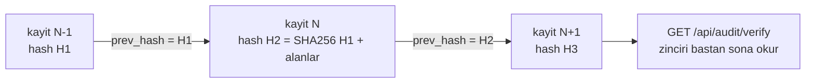

# Faz 64 — Denetim Zinciri ve Veri Konusu Hakları

> **Durum:** 📋 Planlandı (2026-08-18)
> **Kaynak:** [ADAYLAR.md](ADAYLAR.md) · **F-75**, **F-58**
> **Önkoşul:** [Faz 9](09-YONETISIM-VE-DENETIM-IZI.md) — denetim izi oradan gelir · [Faz 25](25-VERI-SAKLAMA-VE-ARSIVLEME.md) — yaşa göre temizlik makinesi ve `IRetentionStore` devralınır
> **Paketler:** `AgentPrism.Abstractions`, `AgentPrism.Core`, `AgentPrism.Sql.Shared`, `AgentPrism.PostgreSql`, `AgentPrism.SqlServer`, `AgentPrism.Sqlite`, `AgentPrism.AspNetCore`, `AgentPrism.UI`
> **Yeni paket:** Yok · **Migration:** **gerekli — üç set** (`audit_log`'a iki sütun). Numara uygulama anında alınır (K-178)
> **Public API:** **büyüyor** — `AuditEntry`'ye iki alan, bir yeni arayüz (`IDataSubjectResolver`), iki uç. `PublicAPI.Shipped.txt` bugün **boş**; ekleme **bugün bedava**
> **Site etkisi:** `concepts/governance.md`, `guides/production.md`, `reference/configuration.md`
> **Manuel test alanı:** `docs/manuel-test/28-DENETIM-ZINCIRI-VE-VERI-HAKLARI.md`

---

## Bu Faza Başlarken

> `faz-baslangic` skill'ini uygula. Aşağıdaki liste o skill'in 2. adımıdır —
> **tamamını değil, yalnız işaret edilen bölümleri oku.**

1. Bu doküman
2. Kararlar — dosyanın tamamını **okuma**, yalnız bu kalemleri grep'le:
   ```bash
   grep -n "K-059\|K-089\|K-107\|K-178\|K-370\|K-399" docs/KARARLAR.md
   ```
   **K-059** (`secret` veritabanına yazılmaz — kimlik de yazılmayacaktır),
   **K-089** (denetim kaydı mutasyondan **önce** yazılır),
   **K-107** (özetlenen mesajlar silinmez — bu fazın çözdüğü birikimin kaynağı),
   **K-178** (migration numaraları sağlayıcı başına bağımsız),
   **K-370** (güvenlik kararı `AuditRecorder` ile değil doğrudan `IAuditLog` ile yazılır),
   **K-399** (saklama hedefleri ve varsayılanları)
3. [`25-VERI-SAKLAMA-VE-ARSIVLEME.md`](25-VERI-SAKLAMA-VE-ARSIVLEME.md) — yalnız devir notu:
   ```bash
   awk '/## Sonraki Faza Devir Notu/,0' docs/25-VERI-SAKLAMA-VE-ARSIVLEME.md
   ```
   Silme makinesi oradan devralınır; bu faz ona **ikinci bir eksen** ekler.
4. Alan hafızası (bu faz iki alana dokunuyor):
   [`hafiza/postgresql.md`](hafiza/postgresql.md) (`audit_log` şeması, indeks),
   [`hafiza/sql-saglayicilari.md`](hafiza/sql-saglayicilari.md) (üç sağlayıcıda
   aynı sütun ve aynı sıralama garantisi)
5. Gerektiğinde, tamamı değil ilgili bölümü:
   [`MIMARI.md`](MIMARI.md) — güvenlik ve veri modeli bölümleri

---

## Amaç

Bu faz kurumsal alıcının iki sorusunu kapatır: **"geçmişi değiştirebilir
misiniz?"** ve **"bir kişinin verisini silebilir misiniz?"**

Bugün ikisinin de cevabı zayıftır. `audit_log` append-only **ruhla** yazılır ama
teknik olarak değişmez **değildir**; veritabanına yazma yetkisi olan biri
geçmişi sessizce düzenleyebilir. Silme ise yalnız **yaşa göredir**; kişiye göre
silme yolu yoktur.

- **F-75** — Denetim kaydına hash zinciri ve zincir doğrulama ucu.
- **F-58** — Veri konusuna göre arama, dışa aktarım ve silme.

İkisi tek fazdadır çünkü **aynı tabloda çatışırlar**: denetim izi değişmez
olmalıdır, veri konusu ise silinme hakkına sahiptir. Ayrı planlanırsa ikincisi
birincisini bozar.

### Çatışmanın çözümü — bu fazın en önemli kararı

Karar (2026-08-18): **denetim izi dokunulmazdır.**

Silme yalnız **içerik** verisinde uygulanır: konuşma öğeleri, çalıştırma
girdileri, ekler, ses oturumları, gömüler. `audit_log` hiç değişmez ve zincir
hiç kırılmaz.

Bu savunulabilir bir modeldir çünkü denetim kaydı **kim ne yaptı** bilgisidir,
kişinin içeriği değil. Ölçüldü:

- [`AuditEntry.cs:18-45`](../src/AgentPrism.Abstractions/Audit/AuditEntry.cs) —
  `Actor`, `Action`, `Entity`, `Before`, `After`.
- [`AuditRecorder.cs:47-48`](../src/AgentPrism.Core/Audit/AuditRecorder.cs) —
  `Before`/`After` zaten `AuditSecretFilter.Redact`'ten geçiyor.
- Çağrı yerleri yönetim eylemleridir: API anahtarı, katalog, kota, eval, kural
  ([`ApiKeyEndpoints.cs:122`](../src/AgentPrism.AspNetCore/Endpoints/ApiKeyEndpoints.cs),
  [`QuotaEndpoints.cs:142`](../src/AgentPrism.AspNetCore/Endpoints/QuotaEndpoints.cs)).
  Konuşma içeriği **yazılmıyor**.

🚨 Bu bir **kural** hâline gelir: `audit_log`'a konuşma içeriği yazılmaz. Faz bu
kuralı bir testle kapatır; kural olmadan karar zamanla çürür.

### Bugün ne çalışmıyor — doğrulanmış kanıt

| Kanıt | Gözlem |
|---|---|
| [`0001_initial.sql:229-238`](../src/AgentPrism.PostgreSql/Migrations/0001_initial.sql) | `audit_log` sütunları: `id`, `tenant_id`, `actor`, `action`, `entity`, `before`, `after`, `created_at`. **Hash veya imza yok** |
| `grep -rln "prev_hash\|PrevHash" src/` | **Sıfır sonuç.** Zincir hiçbir sağlayıcıda yoktur |
| [`IAuditLog.cs:17-29`](../src/AgentPrism.Abstractions/Audit/IAuditLog.cs) | Yalnız `WriteAsync` ve `QueryAsync`. Doğrulama metodu **yok** |
| [`AuditRecorder.cs:16`](../src/AgentPrism.Core/Audit/AuditRecorder.cs) | Yazma hatası **yutulur** ve loglanır. 🚨 Zincir eklendiğinde bu davranış bir kararı zorlar: yutulan bir yazım zinciri **deler** |
| [`RetentionEndpoints.cs:31-103`](../src/AgentPrism.AspNetCore/Endpoints/RetentionEndpoints.cs) | Uçlar yalnız **hedef** bazlıdır (`/api/retention/{target}`). Kişi ekseni yoktur |
| [`0001_initial.sql:21-25`](../src/AgentPrism.PostgreSql/Migrations/0001_initial.sql) | `tenants` sütunları `id`, `slug`, `display_name`, `created_at` |
| `sessions` şeması | `id`, `tenant_id`, `agent_name`, `state`, `schema_version`, `created_at`, `updated_at`. 🚨 **Kullanıcı veya konu kimliği yok** — silmenin "kimin verisi" sorusuna bugün cevabı yoktur |
| K-107 | "Özetlenen mesajlar silinmez" — depo hassas içeriği **bilerek** biriktiriyor |
| `PublicAPI.Shipped.txt` (1 satır) | Yayınlanmış yüzey boş; `AuditEntry`'ye alan eklemek bugün bedava |

> Kanıtlar 2026-08-18 tarihinde doğrulandı.

---

## 64.1 — Hash zinciri

Her denetim kaydı bir öncekinin hash'ini taşır. Zincir **kiracı başına**
tutulur; bir kiracının kayıt hızı diğerinin zincirini beklemez.



Hash **kanonik** bir gövdeden türetilir: `prev_hash`, `tenant_id`, `actor`,
`action`, `entity`, `before`, `after`, `created_at`. Alan sırası ve biçim
sabittir; bir alanın biçimi değişirse eski zincir doğrulanamaz hâle gelir.

🚨 **Yazma sırası bir yarıştır.** Eş zamanlı iki yazım aynı `prev_hash`'i
okursa zincir çatallanır. Çözüm uygulama anında seçilir (Açık Soru 1), ama
kural nettir: **kiracı başına seri yazım**. Ölçüm yapılmadan bir kilit
seçilmez; yavaşlama ölçülüp belgeye yazılır.

🚨 **Yutulan yazma zinciri deler.** `AuditRecorder` bugün hatayı yutuyor
("gözlemlenebilirlik işlevi bozmaz"). Zincirle birlikte bu davranış bir
**boşluk** üretir: kayıp bir halka doğrulamayı sonsuza dek kırar. Bu yüzden
zincir doğrulaması bir **kopukluk** ile bir **değişiklik** arasında ayrım
yapabilmelidir; ikisi farklı bulgu tipidir.

## 64.2 — Zincir doğrulama ucu

`GET /api/audit/verify` zinciri okur ve üç sonuçtan birini döner:

| Sonuç | Anlamı |
|---|---|
| `Valid` | Her halka bir öncekine bağlıdır |
| `Broken` | Bir kaydın hash'i içeriğiyle uyuşmuyor — **değiştirilmiş** |
| `Gap` | Bir halka eksik — yazım başarısız olmuş olabilir |

Doğrulama **isteğe bağlıdır** ve tarih aralığı alır. Tüm tabloyu her açılışta
doğrulamak büyük kurulumlarda pahalıdır; açılışta doğrulama bir seçenektir ve
varsayılan **kapalıdır** (K1).

## 64.3 — Veri konusu kimliği nerede yaşar

Karar (2026-08-18): **`IDataSubjectResolver` genişleme noktası.** AgentPrism
kişisel kimliği **saklamaz**.

Gerekçe: `sessions.id` zaten **tüketicinin ürettiği** bir değerdir. Hangi
oturumun hangi kullanıcıya ait olduğunu bilen taraf tüketicidir. Kimliği
AgentPrism'in tablosuna koymak yeni bir kişisel veri alanı doğurur — silmeyi
kolaylaştırmak için saklanan kimlik, silinmesi gereken ilk veridir.

```csharp
public interface IDataSubjectResolver
{
    ValueTask<DataSubjectScope> ResolveAsync(string subjectId, string tenantId, CancellationToken ct = default);
}
```

`DataSubjectScope` oturum ve çalıştırma kimliklerini taşır. Geri kalan her şey
(konuşma öğeleri, ekler, puanlar, ses oturumları, gömüler) bu iki kimlikten
**türetilir**; şema bunları zaten oturuma bağlar.

🚨 **Varsayılan uygulama yoktur (K4).** Kayıt yoksa uçlar `501 Not Implemented`
değil, **`409`** ile "bir çözümleyici kayıtlı değil" der; yanlış bir "silindi"
yanıtı vermek en tehlikeli sonuçtur.

## 64.4 — Dışa aktarım ve silme

| Uç | Ne yapar |
|---|---|
| `GET /api/data-subjects/{id}/export` | Konunun tüm içeriğini tek bir JSON belgesi olarak döner |
| `DELETE /api/data-subjects/{id}` | Konunun içeriğini siler |

Silme **hedef listesini** Faz 25'in `IRetentionStore` makinesinden alır; yeni
bir silme motoru yazılmaz. Fark tek eksendedir: yaş yerine kimlik.

Silme bir **denetim olayıdır** ve `audit_log`'a yazılır — K-370 emsali:
`AuditRecorder`'ın yutan sarmalayıcısı **kullanılmaz**, doğrudan `IAuditLog`
yazılır ve hata isteği düşürür. Silinemeyen bir veriyi "silindi" diye kaydetmek
bir uyum hatasıdır.

🚨 **Silme geri alınamaz.** Uç bir `dryRun` seçeneği taşır ve varsayılanı
**`true`** olabilir (Açık Soru 3). Silinecek satır sayısı önce gösterilir.

## 64.5 — K-107 ile çatışma

K-107 "özetlenen mesajlar silinmez" der: sıkıştırma sırasında özet üretilir,
ham mesajlar korunur. Konu bazlı silme bu kararın **istisnasıdır** ve bunu
açıkça yazar: kişi silindiğinde özet **de** silinir. Özet, silinen mesajların
türevidir; kalırsa silme eksiktir.

---

## Planlanan Public API

> Taslak imzalardır. Gerçekleşen imzalar kapanışta ayrı bir bölüme yazılır.

```csharp
// AgentPrism.Abstractions — denetim zinciri
public sealed record AuditEntry
{
    // ... mevcut alanlar

    /// <summary>Hash of the previous entry of the same tenant. Null for the first entry.</summary>
    public string? PreviousHash { get; init; }

    /// <summary>Hash of this entry, derived from its canonical form.</summary>
    public string? Hash { get; init; }
}

public enum AuditChainStatus
{
    Valid = 0,
    Broken = 1,
    Gap = 2,
}

public sealed record AuditChainVerification
{
    public required AuditChainStatus Status { get; init; }
    public required int EntriesChecked { get; init; }
    public Guid? FirstFailingEntryId { get; init; }
}

public interface IAuditLog
{
    // ... mevcut uyeler

    ValueTask<AuditChainVerification> VerifyChainAsync(AuditChainQuery query, CancellationToken cancellationToken = default);
}

// AgentPrism.Abstractions — veri konusu
public sealed record DataSubjectScope
{
    public required IReadOnlyList<string> SessionIds { get; init; }
    public required IReadOnlyList<Guid> RunIds { get; init; }
}

/// <summary>Maps a data subject to the sessions and runs that belong to it. No default implementation.</summary>
public interface IDataSubjectResolver
{
    ValueTask<DataSubjectScope> ResolveAsync(string subjectId, string tenantId, CancellationToken cancellationToken = default);
}

public sealed record DataSubjectErasureResult
{
    public required bool DryRun { get; init; }
    public required IReadOnlyDictionary<string, int> RowsByTarget { get; init; }
}
```

### HTTP `endpoint`'leri

| Metot | Yol | Rol · kapsam | Ne yapar |
|---|---|---|---|
| `GET` | `/api/audit/verify` | Admin · `AuditRead` | Zinciri doğrular; tarih aralığı alır |
| `GET` | `/api/data-subjects/{id}/export` | Admin · `SecurityAdmin` | Konunun içeriğini JSON olarak döner |
| `DELETE` | `/api/data-subjects/{id}` | Admin · `SecurityAdmin` | Konunun içeriğini siler; `dryRun` destekler |

### Arayüz payı

Denetim ekranına zincir durumu rozeti eklenir. Veri konusu uçları için ekran
**yoktur** — silme bir yönetim eylemidir ve arayüzden tek tıkla yapılabilir
olması bir risktir. Bugünkü kullanım **165,4 KB gzip / 250 KB**; artış uygulama
anında ölçülüp yazılır.

---

## Planlanan Dosya Listesi

```
src/AgentPrism.Abstractions/Audit/
├── AuditEntry.cs                    (PreviousHash, Hash)
├── IAuditLog.cs                     (VerifyChainAsync)
├── AuditChainVerification.cs        (yeni)
└── AuditChainQuery.cs               (yeni)

src/AgentPrism.Abstractions/Privacy/
├── IDataSubjectResolver.cs          (yeni)
├── DataSubjectScope.cs              (yeni)
└── DataSubjectErasureResult.cs      (yeni)

src/AgentPrism.Core/Audit/
├── AuditChainHasher.cs              (yeni - kanonik bicim, tek yer)
└── AuditRecorder.cs                 (zincir yazimi; yutma davranisi gozden gecirilir)

src/AgentPrism.Core/Privacy/
└── DataSubjectEraser.cs             (yeni - Faz 25 makinesini kullanir)

src/AgentPrism.Sql.Shared/Stores/
└── SqlAuditLog.cs                   (zincir sutunlari + seri yazim)

src/AgentPrism.{PostgreSql,SqlServer,Sqlite}/Migrations/
└── NNNN_audit_chain.sql             (uc set - numara uygulama aninda)

src/AgentPrism.AspNetCore/Endpoints/
├── AuditEndpoints.cs                (verify ucu)
└── DataSubjectEndpoints.cs          (yeni)
```

---

## Hata Modları ve Testler

> Mutlu yoldan değil, **ne bozulabilir**den türetilir. Seviyeyi plan seçer.

| Ne bozulabilir | Seviye | Test sınıfı |
|---|---|---|
| Bir satır elle değiştirilir, doğrulama **geçer** | Sözleşme (`AuditChainContract`) | dört koşumda birden |
| Bir satır silinir, doğrulama `Broken` yerine `Valid` der | Sözleşme | `AuditChainContract` |
| Eş zamanlı yazım zinciri çatallar | Fonksiyonel | `AuditChainConcurrencyTests` — N eş zamanlı yazım, zincir tek dal |
| Zincir yazımı `run`'ı yavaşlatır | Fonksiyonel | ölçüm yapılır, sayı belgeye yazılır |
| Yutulan yazma hatası zinciri sessizce deler | Fonksiyonel | `AuditChainGapTests` → `Gap` döner, `Valid` **değil** |
| Zincir kiracılar arasında karışır | Sözleşme (`TenantIsolationContract`) | dört koşumda birden |
| İlk kaydın `PreviousHash`'i beklenmedik | Birim | `AuditChainHasherTests` |
| Kanonik biçim alan sırasına duyarsız hâle gelir | Birim | `AuditChainHasherTests` — alan yeri değişince hash değişir |
| `audit_log`'a konuşma içeriği yazılır | Birim | `AuditContentPolicyTests` — yazan çağrı yolları taranır |
| Çözümleyici kayıtlı değilken silme "başarılı" döner | Fonksiyonel | `DataSubjectEndpointTests` → `409` |
| Silme başka kiracının verisine dokunur | Sözleşme (`TenantIsolationContract`) | dört koşumda birden |
| Silme özet mesajları bırakır (K-107 çatışması) | Fonksiyonel | `DataSubjectErasureTests` |
| Silme yarıda kalır, kısmi durum kalır | Fonksiyonel | `DataSubjectErasureTests` — işlem sınırı |
| Silme sırasında iptal gelir | Fonksiyonel | `DataSubjectErasureTests` |
| `dryRun` gerçekten siler | Fonksiyonel | `DataSubjectEndpointTests` |
| Silme denetim izine yazılamaz ama silme yapılır | Fonksiyonel | `DataSubjectAuditTests` — yazma hatası isteği düşürür (K-370) |
| Dışa aktarım başka konunun verisini taşır | Fonksiyonel | `DataSubjectExportTests` |
| Boş veya bilinmeyen `subjectId` | Fonksiyonel | `DataSubjectEndpointTests` |
| Kapsamsız anahtarla silme çağrılır | Fonksiyonel | `DataSubjectEndpointTests` → `403` |

Sözleşme testi `tests/Shared/Contracts/` altına — hem bellek içi hem üç SQL
sağlayıcısı üzerinde koşar.

---

## Manuel Kabul Case'leri

> Kapanışta `docs/manuel-test/28-DENETIM-ZINCIRI-VE-VERI-HAKLARI.md` içine
> eklenecek case'lerin taslağı.

| # | Ön koşul | Adımlar | Beklenen sonuç |
|---|---|---|---|
| 1 | Birkaç yönetim eylemi yapıldı | `GET /api/audit/verify` | `Valid`, denetlenen kayıt sayısı doğru |
| 2 | 1'in ardından | Veritabanında bir `after` alanını elle değiştir, tekrar doğrula | `Broken`, ilk bozuk kaydın kimliği döner |
| 3 | 1'in ardından | Bir satırı elle sil, tekrar doğrula | `Gap` |
| 4 | İki kiracı | Her ikisinde eylem yap, ikisini de doğrula | İki bağımsız zincir, ikisi de `Valid` |
| 5 | Çözümleyici kayıtlı **değil** | `DELETE /api/data-subjects/x` | `409`; hiçbir satır silinmez |
| 6 | Çözümleyici kayıtlı, `dryRun` | Aynı istek | Silinecek satır sayısı döner, veri **durur** |
| 7 | 6'nın ardından | `dryRun` olmadan | Konunun oturum ve çalıştırma verisi gider |
| 8 | 7'nin ardından | `GET /api/audit/verify` | Zincir hâlâ `Valid` — denetim izi **dokunulmamış** |
| 9 | 7'nin ardından | Silinen konunun oturumunu ara | Bulunamaz; özet mesaj da yok |
| 10 | 7'nin ardından | Denetim izini aç | Silme eylemi kayıtlı: aktör, konu, satır sayısı |

---

## Açık Sorular

> Planı bloklamayan, faz uygulanırken karara bağlanacak sorular.

| # | Soru | Seçenekler | Öneri |
|---|---|---|---|
| 1 | Kiracı başına seri yazım nasıl sağlanır? | A: Veritabanı işlemi içinde `SELECT ... FOR UPDATE` benzeri kilit · B: Uygulama içi kiracı başına `SemaphoreSlim` · C: Yeniden deneme (çakışırsa yeniden hesapla) | **A.** B çok örnekli dağıtımda **çalışmaz** ve bu repo çok örnekliliği Faz 42'de kabul etti. Üç sağlayıcıda karşılığı ölçülmelidir; SQLite'ta tek yazar zaten vardır |
| 2 | Yazma hatası artık yutulmalı mı? | A: Denetim yazımı **hata verirse istek düşer** · B: Bugünkü gibi yutulur, `Gap` doğrulamada görünür | **B.** A "gözlemlenebilirlik işlevselliği bozmaz" kuralını deler. `Gap` tipi bu yüzden vardır. Ama güvenlik **kararları** (K-370) zaten yutmayan yolu kullanıyor ve o yol korunur |
| 3 | `dryRun` varsayılanı ne olsun? | A: `true` — silmek için açık bayrak gerekir · B: `false` | **A.** Geri alınamaz bir işlemde varsayılan güvenli taraftır. `DELETE` çağrısının varsayılan olarak silmemesi şaşırtıcıdır; belgede açıkça yazılır |
| 4 | Dışa aktarım hangi biçimde? | A: Tek JSON belgesi · B: Zip içinde dosyalar (ekler dahil) | **A** ilk sürüm için. Ekler `bytea` olarak büyük olabilir; B ayrı bir kalemdir ve ölçülmeden seçilmemelidir |
| 5 | Zincir açılışta doğrulansın mı? | A: Hayır, yalnız istek üzerine · B: Evet, seçenekle | **A** varsayılan. Büyük tabloda açılışı yavaşlatır; B bir seçenek olarak eklenebilir ama varsayılanı kapalıdır |

---

## Bitiş Ölçütleri (DoD)

- [ ] `audit_log` her kayıtta `prev_hash` ve `hash` taşır; ilk kayıt hariç zincir kesintisizdir
- [ ] Elle değiştirilen bir satır `Broken`, elle silinen bir satır `Gap` üretir
- [ ] Eş zamanlı N yazımda zincir **tek dal** kalır (fonksiyonel test)
- [ ] Zincir yazımının maliyeti ölçüldü ve sayı belgeye yazıldı
- [ ] İki kiracının zinciri birbirinden bağımsızdır (sözleşme testi, dört koşum)
- [ ] `audit_log`'a konuşma içeriği yazılmadığı testle kapatıldı
- [ ] `IDataSubjectResolver` kayıtlı değilken silme ve dışa aktarım `409` döner
- [ ] `dryRun` hiçbir satıra dokunmaz; sayıları doğru döner
- [ ] Gerçek silme oturum, çalıştırma, konuşma, ek, puan, ses ve gömü verisini kaldırır; **özet mesajlar dahil**
- [ ] Silmeden sonra zincir doğrulaması hâlâ `Valid` — denetim izi dokunulmadı
- [ ] Silme denetim izine yazılır; yazma hatası isteği düşürür (K-370)
- [ ] Dört doğrulama kapısı sıfır uyarı verir
- [ ] `samples/AgentPrism.Api` ile gerçek `run` yapıldı, çıktı belgeye yazıldı
- [ ] `secret` taraması boş döndü
- [ ] Manuel kabul case'leri `docs/manuel-test/28-DENETIM-ZINCIRI-VE-VERI-HAKLARI.md` içine eklendi; otomatikleştirilebilenler koşuldu
- [ ] `faz-denetim` koşuldu; 🔴 bulgu kalmadı
- [ ] `docs-site/` güncellendi (`concepts/governance.md`, `guides/production.md`, `reference/configuration.md`); `npm run build` + `check-links.mjs` temiz

### Doğrulama komutları

```bash
# Zincir dogrulamasi
curl -s http://localhost:5081/agentprism/api/audit/verify

# Kuru kosum - hicbir sey silinmez
curl -s -X DELETE 'http://localhost:5081/agentprism/api/data-subjects/user-42?dryRun=true'

# Gercek silme
curl -s -X DELETE 'http://localhost:5081/agentprism/api/data-subjects/user-42?dryRun=false'

# Silme sonrasi zincir hala saglam
curl -s http://localhost:5081/agentprism/api/audit/verify
```

---

## Riskler

| Risk | Önlem |
|------|-------|
| 🚨 Eş zamanlı yazım zinciri çatallar | Kiracı başına seri yazım (Açık Soru 1); N eş zamanlı yazım testi |
| 🚨 Zincir yazımı sıcak yolu yavaşlatır | Ölçülür ve sayı belgeye yazılır; denetim yazımı zaten istek yolunda değil |
| 🚨 "Silindi" denip silinmemesi bir uyum hatasıdır | Çözümleyici yoksa `409`; silme denetim yazımı hata verirse istek düşer |
| Kanonik biçim değişirse eski zincir doğrulanamaz | Biçim tek bir yerde (`AuditChainHasher`) ve sürümlenir; değişimi bir karardır |
| Silme yarıda kalır | İşlem sınırı testi; kısmi durum kabul edilmez |
| K-107 ile çatışma gözden kaçar | Özetlerin de silindiği ayrı bir testle kapatılır |
| Kişisel kimlik AgentPrism'e sızar | Çözümleyici deseni: kimlik **saklanmaz**, yalnız sorulur |

---

<!-- ============================================================
     AŞAĞISI KAPANIŞTA DOLDURULUR — `faz-tamamlama` skill'i.
     Plan anında boş kalır. Başlıkları SİLME.
     ============================================================ -->

## Plandan Sapmalar

> Kapanışta doldurulur. Plan ile gerçek arasındaki fark **gizlenmez** — sonraki
> oturumun en değerli bilgisidir.

## Bu Fazda Verilen Kararlar

> Kapanışta doldurulur. K-NNN numaraları burada alınır; plan numara rezerve etmez.

## Gerçekleşen Public API

> Kapanışta doldurulur. Koddaki **gerçek** imzalar.

## Dosya Listesi (gerçekleşen)

> Kapanışta doldurulur.

## Denetim Bulguları

> Kapanışta doldurulur — `faz-denetim` çıktısı. Her satır: bulgu · seviye
> (🔴/🟡/🟢) · sonuç (düzeltildi / gerekçelendi / F-NN olarak devredildi).
> Bulgu yoksa "🔴 ve 🟡 yok" yazılır; boş bırakılmaz.

## Sonraki Faza Devir Notu

> Kapanışta doldurulur: devralınan sözleşmeler, bilinen tuzaklar (🚨), yarım
> kalan işler, sıradaki faz.
