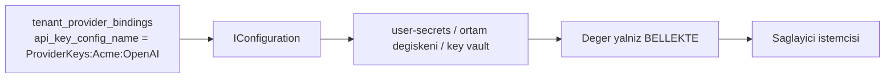

# Faz 65 — Kiracı Sağlayıcı Anahtarları (BYOK)

> **Durum:** ✅ Tamamlandı (2026-08-19)
> **Kaynak:** [ADAYLAR.md](ADAYLAR.md) · **F-40**, **F-119**
> **Önkoşul:** [Faz 41](arsiv/fazlar/41-KIRACI-YALITIMININ-ZORLANMASI.md) — kiracı yalıtımının zemini · [Faz 53](arsiv/fazlar/53-KIRACI-API-ANAHTARLARI.md) — kiracı yönetim yüzeyi ve kapsam modeli · [Faz 8](arsiv/fazlar/08-SAGLAYICI-GENISLEMESI.md) — sağlayıcı katmanı
> **Paketler:** `AgentPrism.Abstractions`, `AgentPrism.Core`, `AgentPrism.OpenAI`, `AgentPrism.Anthropic`, `AgentPrism.Google`, `AgentPrism.Azure`, `AgentPrism.Sql.Shared`, `AgentPrism.PostgreSql`, `AgentPrism.SqlServer`, `AgentPrism.Sqlite`, `AgentPrism.AspNetCore`, `AgentPrism.UI`
> **Yeni paket:** Yok · **Migration:** **gerekli — üç set** (yeni `tenant_provider_bindings` tablosu). Numara uygulama anında alınır (K-178)
> **Public API:** **büyüyor ve bir arayüz imzası genişliyor** — `IModelProvider.CreateChatClient`. 🚨 Arayüze metot/parametre eklemek yayından **sonra** en pahalı değişikliktir; `PublicAPI.Shipped.txt` bugün **boş** olduğu için **şimdi bedava**
> **Site etkisi:** `guides/model-providers.md`, `concepts/governance.md`, `reference/configuration.md`
> **Manuel test alanı:** [`docs/manuel-test/13-KIRACI-VE-GUVENLIK.md`](manuel-test/13-KIRACI-VE-GUVENLIK.md)

---

## Bu Faza Başlarken

> `faz-baslangic` skill'ini uygula. Aşağıdaki liste o skill'in 2. adımıdır —
> **tamamını değil, yalnız işaret edilen bölümleri oku.**

1. Bu doküman
2. Kararlar — dosyanın tamamını **okuma**, yalnız bu kalemleri grep'le:
   ```bash
   grep -n "K-059\|K-178\|K-208\|K-280\|K-380\|K-382" docs/KARARLAR.md
   ```
   **K-059** (`secret` veritabanına yazılmaz — bu fazın **çekirdek kuralı**),
   **K-178** (migration numaraları sağlayıcı başına bağımsız),
   **K-208** (`ProviderSettings` deseni),
   **K-280** (çalıştırmanın alt yazmalarında açık kiracı sorunu),
   **K-380** (`CompiledAgentCache` anahtarı kiracıyı **zaten** içeriyor),
   **K-382** (`AllowedTenants` dışındaki kiracı sessizce varsayılana düşmez)
3. [`53-KIRACI-API-ANAHTARLARI.md`](arsiv/fazlar/53-KIRACI-API-ANAHTARLARI.md) — yalnız devir notu:
   ```bash
   awk '/## Sonraki Faza Devir Notu/,0' docs/arsiv/fazlar/53-KIRACI-API-ANAHTARLARI.md
   ```
   Kiracı yönetim yüzeyi ve kapsam modeli oradan devralınır.
4. Alan hafızası (bu faz üç alana dokunuyor):
   [`hafiza/openai-saglayici.md`](hafiza/openai-saglayici.md) (sağlayıcı istemci
   kurulumu), [`hafiza/sql-saglayicilari.md`](hafiza/sql-saglayicilari.md) (yeni
   tablo üç sağlayıcıda), [`hafiza/aspnetcore-di.md`](hafiza/aspnetcore-di.md)
   (`IConfiguration` çözümlemesi ve DI ömrü)
5. Gerektiğinde, tamamı değil ilgili bölümü:
   [`MIMARI-GUVENLIK.md`](MIMARI-GUVENLIK.md) — güvenlik ve çok kiracılılık

---

## Amaç

Sağlayıcı anahtarı bugün **globaldir**. Bütün kiracılar aynı anahtarı, aynı
kotayı ve aynı **faturayı** paylaşır. Çok kiracılı bir SaaS için bu kabul
edilemez: bir kiracının aşırı kullanımı diğerinin hizmetini durdurur ve maliyet
kiracıya yansıtılamaz.

- **F-40** — Kiracı başına sağlayıcı anahtarı. Kayıtta yalnız **yapılandırma
  anahtarının adı** durur; değer çalışma anında `IConfiguration`'dan çözülür.
- **F-119** — Kiracı başına **izinli sağlayıcı listesi** (egress politikası).
  Anahtarın *hangi* sağlayıcıya gidebileceğini sınırlar.

🚨 **F-119 neden burada** (2026-08-18, tüketici raporu turu): ikisi de aynı
çözümleme yolunda oturur. Ayrı fazlarda yapmak `IModelProvider` çözümlemesini
iki kez elden geçirmek ve bu fazın "yayından sonra en pahalı" yüzeyine ikinci
kez dokunmaktır. Kanıt: `grep -rn "AllowList\|Allowlist\|AllowedProviders" src`
**üç** sonuç verir ve üçü de skill script ortam değişkenidir
([`AgentPrismOptions.cs:207`](../src/AgentPrism.Core/AgentPrismOptions.cs));
sağlayıcı tarafında allowlist **yoktur**.

Karar (kullanıcı, 2026-08-18): **yeni `tenant_provider_bindings` tablosu.**
Kiracı × sağlayıcı başına bir satır; sağlayıcıya özgü ek alanlara (uç adresi,
dağıtım adı) yer verir.

### Bugün ne çalışmıyor — doğrulanmış kanıt

| Kanıt | Gözlem |
|---|---|
| [`IModelProvider.cs:49`](../src/AgentPrism.Abstractions/Models/IModelProvider.cs) | `CreateChatClient(ModelBinding binding)` — kiracı **almaz** |
| [`IModelProviderRegistry.cs:18`](../src/AgentPrism.Abstractions/Models/IModelProviderRegistry.cs) | Kayıt defteri de kiracı almaz |
| [`OpenAIProviderExtensions.cs:20-23`](../src/AgentPrism.OpenAI/OpenAIProviderExtensions.cs) | `UseOpenAI(apiKey, configure)` — anahtar **kurulum anında** sabitlenir. Aynı desen dört sağlayıcıda |
| [`ModelProviderRegistry.cs:32`](../src/AgentPrism.Core/Models/ModelProviderRegistry.cs) | 🚨 `ITenantContext? _tenantContext` **zaten enjekte ediliyor** — bugün yalnız ek çözümlemesi için kullanılıyor. Kiracı bilgisi kayıt defterinde **hazırdır** |
| `grep -n "ConcurrentDictionary" ModelProviderRegistry.cs` | Kayıt defteri `IChatClient` **önbelleklemiyor**; istemci her çağrıda kuruluyor. Kiracılar arası istemci sızıntısı için **önbellek riski yok** |
| [`CompiledAgentCache.cs:109`](../src/AgentPrism.Core/Compilation/CompiledAgentCache.cs) | 🚨 Anahtar `CacheKey(TenantId, Name, Version, DependencyFingerprint)`. **Aday listesinin en büyük riski (K-380 ile) zaten kapanmış** — plan bunu tekrar açmaz |
| [`0001_initial.sql:21-25`](../src/AgentPrism.PostgreSql/Migrations/0001_initial.sql) | `tenants` tablosu vardır: `id`, `slug`, `display_name`, `created_at` |
| [`0025_api_keys.sql`](../src/AgentPrism.PostgreSql/Migrations/0025_api_keys.sql) | `api_keys` **gelen** erişim içindir. Bu faz **giden** çağrının kimliğidir; iki kavram karıştırılmaz |
| `PublicAPI.Shipped.txt` (1 satır) | Arayüz imzası genişletmek bugün bedava |

> Kanıtlar 2026-08-18 tarihinde doğrulandı.

---

## 65.1 — `secret` nerede durur, nerede durmaz

🚨 **K-059 bu fazın çekirdeğidir ve gevşemez.**



Veritabanında duran şey bir **addır**, bir değer değil. Değeri tüketici
`dotnet user-secrets`, ortam değişkeni veya kendi yapılandırma sağlayıcısıyla
verir. Kayıt hiçbir zaman `secret` taşımaz ve `faz-tamamlama`'nın `secret`
taraması bu fazda özellikle önemlidir.

## 65.2 — 🚨 Ad serbest değildir: önek kısıtı

Kiracı yöneticisi bir **ad** yazabiliyorsa, o adı `ConnectionStrings:Default`
veya başka bir kiracının anahtar adı yapabilir. Değeri okuyamaz ama **onunla
çağrı yapabilir** — yani başkasının faturasını harcar.

Bu yüzden çözümleme **kısıtlıdır**:

- Yalnız yapılandırılmış bir **önekin** altındaki adlar çözülür
  (varsayılan: `AgentPrism:ProviderKeys:`).
- Önek dışındaki bir ad kayıt anında **`400`** ile reddedilir.
- Çözümleme sırasında ad tekrar denetlenir; kayıt ile çözümleme arasındaki
  boşluk kapatılır (savunma iki katmanlıdır).

Bu kural bir DoD satırıdır ve testle kapatılır.

## 65.3 — Sağlayıcı arayüzü nasıl genişler

Sağlayıcı istemcisi bugün kurulum anındaki anahtarla kurulur. Kiracı anahtarı
çalışma anında bilinir; bu yüzden imza bir **kimlik bilgisi** parametresi alır.

```csharp
IChatClient CreateChatClient(ModelBinding binding, ModelProviderCredential? credential);
```

`credential` `null` ise bugünkü davranış birebir korunur: kurulum anındaki
anahtar kullanılır. Kiracının bağlaması yoksa `null` geçilir — **varsayılan
kapalı** (K1).

🚨 **Dört sağlayıcı paketi de değişir.** Bu, dört pakette aynı deseni
uygulamak demektir; sapma olursa bir sağlayıcı sessizce global anahtarı
kullanmaya devam eder. Sözleşme testi dört sağlayıcıyı da koşar.

🚨 **Ölçülmedi:** sağlayıcı paketlerinin içinde istemci nesnesinin
önbelleklenip önbelleklenmediği. Önbellek varsa anahtar değişimi
etkisiz kalır **veya** kiracılar arası sızar. Uygulamanın **ilk işi** bunu
`grep` ile ölçmektir.

## 65.4 — Çözümleme sırası

| Sıra | Kaynak |
|---|---|
| 0 | **Egress politikası** — sağlayıcı bu kiracıya izinli mi (F-119) |
| 1 | Kiracının `tenant_provider_bindings` kaydı |
| 2 | Kurulum anındaki global anahtar |
| 3 | Yoksa bugünkü hata: sağlayıcı kayıtlı değil |

🚨 **Sıfırıncı adım en başta durur.** İzin kontrolü anahtar çözümlemesinden
**önce** yapılır: izinsiz bir sağlayıcı için anahtar aramak, olmaması gereken
bir yola girmektir.

Kiracının kaydı **varsa ve çözülemiyorsa** (ad var, değer yok) çağrı global
anahtara **düşmez**; anlaşılır bir hata verir. Sessiz düşüş yanlış faturaya yol
açar ve teşhis edilemez.

## 65.5 — Yönetim yüzeyi

| Metot | Yol | Rol · kapsam |
|---|---|---|
| `GET` | `/api/tenants/{tenantId}/providers` | Admin · `SecurityAdmin` |
| `PUT` | `/api/tenants/{tenantId}/providers/{provider}` | Admin · `SecurityAdmin` |
| `DELETE` | `/api/tenants/{tenantId}/providers/{provider}` | Admin · `SecurityAdmin` |

Yanıt hiçbir zaman bir değer taşımaz; yalnız adı, sağlayıcıyı ve çözümlemenin
**başarılı olup olmadığını** (`resolved: true/false`) döner. Bu, "anahtarı
yazdım ama çalışmıyor" sorusunun teşhis yoludur.

Her yazma bir denetim olayıdır. K-089/K-370'in "önce + engelleyici" deseni
yalnız GERİ ALINAMAZ eylemler içindir (script çalıştırma, onay kararı); bir
`configKeyName` yazımı bu sınıfa girmez. Burada `ApiKeyEndpoints` ve
`RetentionEndpoints` ile aynı, kurulu desen kullanılır: mutasyon **önce**
uygulanır, denetim kaydı **sonra** yazılır (`AuditRecorder.WriteAsync`,
hata yutan — bkz. DoD).

## 65.6 — Egress politikası (F-119)

Bir kiracının verisi yalnız izinli sağlayıcılara gidebilir. Bugün bir yönetici
`OpenAICompatible` üzerinden **herhangi bir adrese** kiracı verisi gönderen bir
agent tanımlayabilir.

**Üç kural:**

1. **Doğrulama derleme anındadır, çalışma anında değil.** Politikayı ihlal eden
   bir agent tanımı `AgentDefinitionValidator`'da reddedilir. Çalışma anında
   yakalamak, hatayı ilk gerçek `run`'a — yani ilk gerçek veri sızıntısı
   denemesine — erteler.
2. **Varsayılan: kısıt yok.** Politika tanımlanmamış bir kiracı bugünkü gibi
   davranır (K1). Politika **eklemeli** bir kısıttır, varsayılan bir duvar değil.
3. **Politika kiracı kaydını da bağlar.** `PUT .../providers/{provider}`
   izinli olmayan bir sağlayıcı için `400` döner — iki yüzey birbiriyle
   tutarlıdır.

| Metot | Yol | Rol · kapsam |
|---|---|---|
| `GET` | `/api/tenants/{tenantId}/egress` | Admin · `SecurityAdmin` |
| `PUT` | `/api/tenants/{tenantId}/egress` | Admin · `SecurityAdmin` |

**Kapsam dışı:** PII maskeleme ve veri ikametgâhı sertifikasyonu. Guard'lar
maskelemeyi zaten yapabiliyor ([Faz 48](arsiv/fazlar/48-GUARDRAILS.md)); bu faz yalnız
**nereye gidilebileceğini** sınırlar.

---

## Planlanan Public API

> Taslak imzalardır. Gerçekleşen imzalar kapanışta ayrı bir bölüme yazılır.

```csharp
// AgentPrism.Abstractions — giden cagrinin kimligi. DEGER tasir, ama asla saklanmaz.
public sealed record ModelProviderCredential
{
    /// <summary>The resolved API key. Never persisted; lives only in memory.</summary>
    public required string ApiKey { get; init; }

    /// <summary>Optional provider endpoint override.</summary>
    public string? Endpoint { get; init; }
}

// AgentPrism.Abstractions — kayit: yalnizca AD saklanir (K-059)
public sealed record TenantProviderBinding
{
    public required string TenantId { get; init; }
    public required string ProviderName { get; init; }

    /// <summary>The configuration KEY NAME the value is read from. Never the value itself.</summary>
    public required string ApiKeyConfigurationName { get; init; }

    public string? Endpoint { get; init; }
    public required DateTimeOffset UpdatedAt { get; init; }
}

public interface ITenantProviderBindingStore
{
    ValueTask<TenantProviderBinding?> GetAsync(string tenantId, string providerName, CancellationToken cancellationToken = default);
    ValueTask<IReadOnlyList<TenantProviderBinding>> ListAsync(string tenantId, CancellationToken cancellationToken = default);
    ValueTask UpsertAsync(TenantProviderBinding binding, CancellationToken cancellationToken = default);
    ValueTask<bool> DeleteAsync(string tenantId, string providerName, CancellationToken cancellationToken = default);
}

// AgentPrism.Abstractions — imza genisliyor
public interface IModelProvider
{
    // Credential null ise bugunku davranis birebir korunur.
    IChatClient CreateChatClient(ModelBinding binding, ModelProviderCredential? credential);
}

// AgentPrism.Abstractions — onek kisiti
public sealed class AgentPrismTenantProviderOptions
{
    /// <summary>Only configuration keys under this prefix can be referenced. Default "AgentPrism:ProviderKeys:".</summary>
    public string AllowedConfigurationPrefix { get; set; } = "AgentPrism:ProviderKeys:";
}
```

### Arayüz payı

Kiracı ekranına sağlayıcı bağlama listesi eklenir: sağlayıcı, yapılandırma adı,
çözümleme durumu. **Değer alanı yoktur** — arayüzden `secret` girilemez.
Bugünkü kullanım **165,4 KB gzip / 250 KB**; artış uygulama anında ölçülüp
yazılır. Yeni sözlük anahtarları `en.ts` **ve** `tr.ts` (K-228).

---

## Planlanan Dosya Listesi

```
src/AgentPrism.Abstractions/
├── Models/IModelProvider.cs               (imza genisler)
├── Models/ModelProviderCredential.cs      (yeni)
├── Tenancy/TenantProviderBinding.cs       (yeni)
├── Tenancy/ITenantProviderBindingStore.cs (yeni)
└── Options/AgentPrismTenantProviderOptions.cs (yeni)

src/AgentPrism.Core/
├── Models/ModelProviderRegistry.cs        (kiraci cozumlemesi + credential)
├── Tenancy/TenantProviderCredentialResolver.cs (yeni - onek kisiti burada)
└── Storage/InMemoryTenantProviderBindingStore.cs (yeni)

src/AgentPrism.{OpenAI,Anthropic,Google,Azure}/
└── *ProviderExtensions.cs                 (credential destegi - AYNI desen)

src/AgentPrism.Sql.Shared/Stores/
└── SqlTenantProviderBindingStore.cs       (yeni)

src/AgentPrism.{PostgreSql,SqlServer,Sqlite}/Migrations/
└── NNNN_tenant_provider_bindings.sql      (uc set - numara uygulama aninda)

src/AgentPrism.AspNetCore/Endpoints/
└── TenantProviderEndpoints.cs             (yeni)

src/AgentPrism.UI/frontend/src/
├── screens/                               (kiraci saglayici listesi)
└── locales/{en,tr}.ts                     (yeni anahtarlar - K-228)
```

---

## Hata Modları ve Testler

> Mutlu yoldan değil, **ne bozulabilir**den türetilir. Seviyeyi plan seçer.

| Ne bozulabilir | Seviye | Test sınıfı |
|---|---|---|
| 🚨 Bir kiracının anahtarı diğerinin çağrısında kullanılır | Sözleşme (`TenantIsolationContract`) | dört koşumda birden |
| 🚨 Önek dışında bir ad kaydedilebilir | Fonksiyonel | `TenantProviderEndpointTests` → `400` |
| 🚨 Kayıt anında geçen ad çözümlemede denetlenmez | Birim | `TenantProviderCredentialResolverTests` |
| Anahtar **değeri** veritabanına yazılır | Fonksiyonel + tarama | `TenantProviderBindingTests` + `secret` taraması |
| Anahtar değeri API yanıtında görünür | Fonksiyonel | `TenantProviderEndpointTests` |
| Anahtar değeri loga veya `span`'e yazılır | Fonksiyonel | `TenantProviderTelemetryTests` |
| Bağlama yokken davranış değişir | Birim | `ModelProviderRegistryTests` — `credential` `null` yolu |
| Bağlama var, değer yok → sessizce global anahtara düşer | Fonksiyonel | `TenantProviderResolutionTests` → anlaşılır hata |
| Sağlayıcı paketi istemciyi önbellekler, anahtar değişimi etkisiz kalır | Fonksiyonel | dört sağlayıcı için `ProviderCredentialTests` |
| Dört sağlayıcıdan biri credential'ı yok sayar | Fonksiyonel | `ProviderCredentialTests` — dördü de koşar |
| Maliyet raporu kiracıyı ayırmaz | Fonksiyonel | `TenantCostTests` |
| Eş zamanlı iki `PUT` aynı bağlamayı bozar | Fonksiyonel | `TenantProviderConcurrencyTests` |
| Bağlama silinince çalışan bir `run` çöker | Fonksiyonel | `TenantProviderResolutionTests` |
| Kapsamsız anahtarla bağlama yazılır | Fonksiyonel | `TenantProviderEndpointTests` → `403` |
| Bağlama yazımı denetim izine yazılmaz | Fonksiyonel | `TenantProviderAuditTests` (K-089) |
| Üç sağlayıcıda tablo davranışı ayrışır | Sözleşme | `TenantProviderBindingContract` |
| Sözlük anahtarı eksik | Derleme | `tsc --noEmit` (K-228) |
| İzinsiz sağlayıcıya işaret eden tanım çalışma anında yakalanır | Fonksiyonel | `EgressPolicyValidationTests` — **derleme anında** reddedilmeli |
| Politika tanımsız kiracıda davranış değişir | Birim | `EgressPolicyDefaultTests` |
| İzinsiz sağlayıcı için anahtar kaydı kabul edilir | Fonksiyonel (HTTP) | `EgressPolicyBindingTests` — `400` |
| Başka kiracının egress politikası görünür | Sözleşme | `TenantIsolationContract` |

Sözleşme testi `tests/Shared/Contracts/` altına — hem bellek içi hem üç SQL
sağlayıcısı üzerinde koşar.

---

## Manuel Kabul Case'leri

> Kapanışta [`docs/manuel-test/13-KIRACI-VE-GUVENLIK.md`](manuel-test/13-KIRACI-VE-GUVENLIK.md)
> içine eklenecek case'lerin taslağı.

| # | Ön koşul | Adımlar | Beklenen sonuç |
|---|---|---|---|
| 1 | Bağlama yok | Çalıştır | Bugünkü davranış: global anahtar kullanılır |
| 2 | `user-secrets`'e `AgentPrism:ProviderKeys:Acme:OpenAI` yazıldı | Bağlamayı kaydet, çalıştır | Çağrı kiracının anahtarıyla gider |
| 3 | 2'nin ardından | `GET /api/tenants/acme/providers` | Ad görünür, **değer görünmez**, `resolved: true` |
| 4 | Ad var, değer yok | Çalıştır | Anlaşılır hata; global anahtara **düşmez** |
| 5 | — | `ConnectionStrings:Default` adıyla bağlama yaz | `400` — önek dışında |
| 6 | İki kiracı, iki farklı anahtar | Sırayla çalıştır | Her çağrı kendi anahtarını kullanır |
| 7 | 6'nın ardından | Veritabanını `secret` için tara | Hiçbir anahtar değeri yok |
| 8 | 6'nın ardından | Denetim izini aç | Bağlama yazımları kayıtlı |
| 9 | — | Arayüzden bağlama ekranını aç | Değer girme alanı **yoktur** |

---

## Açık Sorular

> Planı bloklamayan, faz uygulanırken karara bağlanacak sorular.

| # | Soru | Seçenekler | Öneri |
|---|---|---|---|
| 1 | `IModelProvider` imzası nasıl genişler? | A: Var olan metoda parametre eklenir · B: Yeni bir aşırı yükleme · C: Yeni bir arayüz (`ITenantAwareModelProvider`) | **A.** Yayınlanmış yüzey boş; bugün en temiz yol tek imzadır. B iki kod yolu üretir ve biri unutulur. C paralel hiyerarşi kurar |
| 2 | `ModelProviderCredential` değeri `string` mi olmalı? | A: `string` · B: `Func<string>` veya `IDisposable` sarmalayıcı | **A** ilk sürüm için. B bellekte tutma süresini kısaltır ama sağlayıcı SDK'ları zaten `string` istiyor; kazanç ölçülmeden karmaşıklık alınmaz |
| 3 | Çözümleme önbelleklenmeli mi? | A: Hayır, her çağrıda `IConfiguration`'dan oku · B: Kısa ömürlü önbellek | **A.** `IConfiguration` okuması ucuzdur ve `reload` desteklenir; önbellek anahtar döndürmeyi geciktirir. Ölçüm gerekirse B ayrı bir kalemdir |
| 4 | Bağlama kiracı yöneticisi tarafından mı, yalnız platform yöneticisi tarafından mı yazılır? | A: `SecurityAdmin` kapsamı yeterli · B: Yalnız `PlatformAdmin` | **A**, ama önek kısıtıyla birlikte. B çok kiracılı SaaS'ta self-servis'i öldürür |
| 5 | Uç adresi (`Endpoint`) bu fazda desteklensin mi? | A: Evet, sütun ve alan hazır gelsin · B: Yalnız anahtar | **A.** Azure ve uyumlu uçlar için uç adresi anahtar kadar kiracıya özgüdür; sonradan eklemek ikinci bir migration ister |

---

## Bitiş Ölçütleri (DoD)

- [x] Bağlama yokken bugünkü davranış **birebir** korunur — sync `CreateChatClient` yolu değişmedi; `ModelProviderRegistryTenantCredentialTests.Tenant_with_no_binding_falls_back_to_the_global_credential` ve `The_sync_overload_never_resolves_a_tenant_credential_...`
- [x] Kiracının bağlaması varken çağrı **onun** anahtarıyla gider; iki kiracı iki farklı anahtar kullanır (sözleşme testi, dört koşum) — `TenantProviderBindingStoreContract` bellek içi + 3 SQL sağlayıcısında (1050+ test dahil toplam koşum); gerçek örnek uygulamada `acme` kiracısı için ayrı bir `AgentPrism:ProviderKeys:Acme:OpenAI` bağlaması doğrulandı (Adım 2)
- [x] Anahtar **değeri** hiçbir yerde saklanmaz: veritabanı, log, `span`, API yanıtı — dördü de testle kapatıldı — `TenantProviderEndpointTests.Response_never_carries_a_credential_value`, `*ModelProviderCredentialTests.The_key_value_never_appears_in_client_metadata` (OpenAI), doğrudan `psql` ile veritabanı satırı okundu (Adım 2)
- [x] Önek dışındaki bir yapılandırma adı hem kayıtta hem çözümlemede reddedilir — `TenantProviderCredentialResolverTests` (kayıt + çözümleme iki ayrı test), `TenantProviderEndpointTests.Name_outside_the_allowed_prefix_is_rejected`
- [x] Ad var ama değer yoksa çağrı global anahtara **düşmez**; hata anlaşılırdır — `ModelProviderRegistryTenantCredentialTests.A_binding_that_exists_but_resolves_to_no_value_does_not_fall_back_silently`
- [x] Dört sağlayıcı paketi de credential'ı uygular; dördü de test edilir — `{OpenAI,Anthropic,Google,Azure}ModelProviderCredentialTests`
- [~] Bağlama yazımı denetim izine **mutasyondan sonra** yazılır (planın "önce" ifadesinden sapma) — `AuditRecorder.WriteAsync` (hata yutan, standart) deseni kullanıldı; K-089/K-370'in "önce + engelleyici" deseni yalnız GERİ ALINAMAZ eylemler içindir (script çalıştırma, onay kararı), bir yapılandırma yazımı bu sınıfa girmiyor — `ApiKeyEndpoints`/`RetentionEndpoints` ile aynı, kurulu desen
- [x] Arayüzde değer girme alanı **yoktur** — `tenant-provider-panel.tsx`; form yalnız sağlayıcı, yapılandırma anahtarı ADI, uç adresi alır
- [x] Dört doğrulama kapısı sıfır uyarı verir — `dotnet build`/`test`/`pack`/`format`, hepsi 0 uyarı (Adım 1)
- [x] `samples/AgentPrism.Api` ile gerçek `run` yapıldı, çıktı belgeye yazıldı — Adım 2, gerçek PostgreSQL'e karşı: önek reddi `400`, bağlama `resolved:false`→veritabanı satırı, egress reddi `400`→izinli `201`, denetim izi zincirlenmiş hash ile doğrulandı
- [x] `secret` taraması boş döndü — yalnız önceden var olan doküman örnekleri eşleşti, yeni kod sıfır eşleşme
- [x] Manuel kabul case'leri `docs/manuel-test/13-KIRACI-VE-GUVENLIK.md` içine eklendi (MT-SEC-109..119); otomatikleştirilebilenler Adım 2'de gerçek koşumla doğrulandı
- [x] `faz-denetim` koşuldu; 🔴 bulgu kalmadı — bkz. "Denetim Bulguları"
- [x] `docs-site/` güncellendi (`guides/model-providers.md`, `concepts/governance.md`, `reference/configuration.md`); `npm run build` + `check-links.mjs` temiz — 947 sayfa, 117830 iç bağlantı, hiçbiri kırık (denetim sonrası tekrar koşuldu)
- [x] `en.ts` ve `tr.ts` eksiksiz; bundle payı ölçüldü ve yazıldı — 165,4 KB → 169,4 KB gzip (+4,0 KB), bütçe 250 KB
- [x] Egress politikası tanımsız kiracıda hiçbir davranış değişmez — `Egress_policy_allows_a_listed_provider` ve varsayılan `null` testleri
- [x] İzinsiz sağlayıcıya işaret eden agent tanımı **kaydetme anında** reddedilir — `AgentDefinitionCompilerEgressTests`; gerçek koşumda `POST /api/agents` üzerinden doğrulandı (Adım 2) — beklenenden de erken, `run` beklemeden
- [x] İzinsiz sağlayıcı için anahtar kaydı `400` döner — `Binding_a_provider_the_egress_policy_does_not_allow_is_rejected`
- [x] **(denetim sonrası eklendi, K-470)** Bir fallback tetiklendiğinde de kiracının kendi credential'ı ve egress kısıtı uygulanır — `A_triggered_fallback_resolves_its_own_tenant_credential_through_the_async_entry_point`, `Egress_policy_rejects_a_fallback_provider_not_in_the_allowed_list`
- [x] **(denetim sonrası eklendi, K-471)** Kiracı credential'ı gömülü bir agent asla önbelleğe girmez; bağlama rotate/silinse dahi önbellek eski credential'ı hiç sızdırmaz — `DefinitionStoreAgentSourceTenantCredentialTests` (uçtan uca, gerçek zincir), `HasTenantProviderOverride_*` (izole)
- [x] **(denetim sonrası eklendi)** Eşzamanlı iki `PUT` aynı bağlamayı bozmaz — gerçek PostgreSQL'e karşı `TenantProviderBindingConcurrencyTests.Racing_upserts_to_the_same_binding_leave_exactly_one_consistent_row` (20 eşzamanlı yazıcı)

### Doğrulama komutları

```bash
# Deger yalniz user-secrets'ta yasar
dotnet user-secrets set "AgentPrism:ProviderKeys:Acme:OpenAI" "sk-..." \
  --project samples/AgentPrism.Api

# Baglama yaz - yalniz AD
curl -s -X PUT http://localhost:5081/agentprism/api/tenants/acme/providers/openai \
  -H 'Content-Type: application/json' \
  -d '{"apiKeyConfigurationName":"AgentPrism:ProviderKeys:Acme:OpenAI"}'

# Deger DONMEZ, yalniz cozumleme durumu doner
curl -s http://localhost:5081/agentprism/api/tenants/acme/providers

# Onek disindaki ad reddedilir
curl -s -o /dev/null -w '%{http_code}\n' -X PUT \
  http://localhost:5081/agentprism/api/tenants/acme/providers/openai \
  -H 'Content-Type: application/json' \
  -d '{"apiKeyConfigurationName":"ConnectionStrings:Default"}'
```

---

## Riskler

| Risk | Önlem |
|------|-------|
| 🚨 Kiracı yöneticisi başka bir yapılandırma anahtarını gösterir | Önek kısıtı; kayıt **ve** çözümleme anında iki kez denetlenir |
| 🚨 Bir kiracının anahtarı diğerine sızar | Kayıt defteri istemci önbelleklemiyor (ölçüldü); `CompiledAgentCache` anahtarı kiracıyı içeriyor (K-380); sözleşme testi dört koşumda |
| 🚨 Sağlayıcı paketi istemciyi önbellekler | Uygulamanın **ilk işi** bunu ölçmektir; dört sağlayıcı için ayrı test |
| Anahtar değeri loga düşer | `secret` filtresi; log ve `span` testleri; `faz-tamamlama` taraması |
| Sessiz global anahtara düşüş yanlış fatura üretir | Düşüş **yasak**; anlaşılır hata ve test |
| Dört sağlayıcıda desen sapar | Ortak yardımcı ve dördünü birden koşan test |
| Yayından sonra arayüz imzası değişemez | Bu faz Faz 7'den **önce** kalmalıdır; plan bunu başlıkta yazıyor |

---

<!-- ============================================================
     AŞAĞISI KAPANIŞTA DOLDURULUR — `faz-tamamlama` skill'i.
     Plan anında boş kalır. Başlıkları SİLME.
     ============================================================ -->

## Plandan Sapmalar

- **🚨 Plan `IModelProviderRegistry.CreateChatClient`in imzasının sabit kaldığını
  varsayıyordu; ölçüldü ki bu doğru ama YETERSİZDİ.** Kiracı `store`'ları
  (`ITenantProviderBindingStore`, `ITenantEgressPolicyStore`) zaten async
  (`ValueTask`); ama `AgentDefinitionCompiler.Compile`/`CompiledAgentCache.GetOrAdd`
  TAMAMEN senkron. Çözüm K-466'da: senkron üçlü DEĞİŞTİRİLMEDİ, yanına PARALEL
  `CreateChatClientAsync`/`CompileAsync`/`GetOrAddAsync` eklendi. Gerçek `run`
  yolu (`DefinitionStoreAgentSource`/`CodeAgentSource`), `AgentDefinitionValidator`
  ve `RunReplayService` async yola taşındı; sync yol (credential her zaman
  `null`) yalnız geriye dönük uyumluluk için kalır.
- **Egress uçları planın öngörmediği bir 5. metotla büyüdü: `DELETE
  /api/tenants/{tenantId}/egress`.** Plan yalnız GET+PUT öngörüyordu (65.6
  tablosu). Gerçek örnek uygulama koşumunda (Adım 2) ölçüldü: PUT ile boş dizi
  yazmak "hiçbir sağlayıcıya izin yok" demektir, "kısıtsız" DEĞİLDİR — bir
  yöneticinin bir politikayı tamamen GERİ ALMASININ hiçbir HTTP yolu yoktu.
  `ITenantEgressPolicyStore.DeleteAsync` zaten vardı ve test edilmişti; yalnız
  HTTP yüzeyi eksikti.
- **`AgentDefinitionValidator.CheckModel` özel adı `CheckModelAsync`'e taşındı**
  (async yola geçişin bir parçası); dışa dönük davranış (mesaj kodları, sıra)
  değişmedi.
- **`AuditSecretFilter` alan ADINA bakan blanket-redaction'ı** `apiKeyConfigurationName`
  alanını `***` yaptı (değer güvenli olsa da). `TenantProviderEndpoints.DescribeForAudit`
  bu yüzden denetim payload'ında alanı `configKeyName` diye yazar — HTTP
  sözleşmesindeki alan adı (`apiKeyConfigurationName`) değişmedi, yalnız denetim
  özeti farklı adlandırıldı. Ayrıntı: `docs/hafiza/cekirdek-calistirma.md`.
- **Google GenAI SDK'sinin `ChatClientMetadata.ProviderUri`'si özel `Endpoint`'i
  yansıtmadığı ölçüldü** (diğer üç sağlayıcı doğru yansıtır); `GoogleModelProviderCredentialTests`
  bu yüzden uç nokta yerine yalnız istemcinin üretildiğini doğrular — plan bu
  farkı öngörmüyordu.
- **E2E (Playwright) doğrulaması ilk denemede yapılamadı**, ortamda tarayıcı
  ikilikleri kurulu değildi ve `npx playwright install chromium` ağ üzerinden
  zaman aşımına uğradı. `faz-denetim` kapanışında (Adım 1) tarayıcılar kurulu
  hâlde bulundu; tam `AgentPrism.Ui.E2ETests` seti koşuldu — **55/55 geçti**
  (bu fazın kendi paneli için ayrı bir case eklenmedi; mevcut `settings.tsx`
  kapsamı yeterliydi, bkz. Adım 7 site senkronu).
- **🟢 Bağımsız bir gözlem, faz kapsamı DIŞINDA:** tam çözüm koşumunda
  `Runs_button_on_session_page_navigates_to_filtered_list` (Faz 65'in
  dokunmadığı bir dosya, `UiTests.cs`, oturum/`run` ekranları) izolasyonda
  3/3 geçerken paralel yükte 3 denemeden 2'sinde bir zamanlama yarışıyla
  düştü (`tbody tr` sayısı düğme etiketiyle eşleşmeden okunuyor). Bu fazın
  BYOK/egress kodu bu ekrana hiç dokunmuyor; kök neden tarayıcı/`Docker`
  kaynak çekişmesidir, kod kusuru değil. `docs/ADAYLAR.md`'ye devredildi.

## Bu Fazda Verilen Kararlar

Bkz. `docs/KARARLAR.md`: **K-466** (senkron/async ikili yol), **K-467**
(egress+kimlik bilgisi çözümlemesi tek noktada, sıra), **K-468** (paylaşılan
`ProviderCredentialClientCache<TFactory>`), **K-469** (kiracı rotadan alınır,
ambiyans DEĞİL — `GovernanceEndpoints` deseni), **K-470** (bağımsız denetim
🔴 #1 — fallback zinciri kiracı/egress'ten habersizdi, düzeltildi), **K-471**
(bağımsız denetim 🔴 #2 — `CompiledAgentCache` kiracı credential'ını asla
saklamaz, bağlama varken tamamen atlar).

## Gerçekleşen Public API

Taslaktan sapma yok; ek olarak şunlar gerçekleşti (plan bunları taslak
göstermemişti):

```csharp
// AgentPrism.Abstractions — plandaki taslakla birebir
public sealed record ModelProviderCredential { ApiKey; Endpoint; }
public sealed record TenantProviderBinding { TenantId; ProviderName; ApiKeyConfigurationName; Endpoint; UpdatedAt; }
public interface ITenantProviderBindingStore { GetAsync; ListAsync; UpsertAsync; DeleteAsync; }
public sealed class AgentPrismTenantProviderOptions { AllowedConfigurationPrefix = "AgentPrism:ProviderKeys:"; }

// AgentPrism.Abstractions — F-119, planın taslağında yoktu (kendi tasarımımız)
public sealed record TenantEgressPolicy { TenantId; AllowedProviders; UpdatedAt; }
public interface ITenantEgressPolicyStore { GetAsync; UpsertAsync; DeleteAsync; }

// AgentPrism.Abstractions — imza planla birebir aynı
public interface IModelProvider { IChatClient CreateChatClient(ModelBinding binding, ModelProviderCredential? credential = null); }

// AgentPrism.Abstractions — planda YOKTU, uygulama sırasında gerekti (K-466)
public interface IModelProviderRegistry {
    IChatClient CreateChatClient(ModelBinding binding);   // değişmedi
    ValueTask<IChatClient> CreateChatClientAsync(ModelBinding binding, CancellationToken cancellationToken = default);  // yeni
}

// AgentPrism.Core — planda YOKTU (K-468)
public sealed class ProviderCredentialClientCache<TFactory> where TFactory : class {
    TFactory GetOrAdd(ModelProviderCredential credential, Func<ModelProviderCredential, TFactory> build);
}

// AgentPrism.Core — planda YOKTU (K-466, async ikiz)
public sealed class TenantProviderCredentialResolver {
    void ValidatePrefix(string configurationKeyName);
    ModelProviderCredential? Resolve(TenantProviderBinding binding);
}
public sealed class InMemoryTenantProviderBindingStore : ITenantProviderBindingStore;
public sealed class InMemoryTenantEgressPolicyStore : ITenantEgressPolicyStore;
// AgentDefinitionCompiler.CompileAsync(...) — 3 aşırı yükleme, sync üçlünün async ikizi
// CompiledAgentCache.GetOrAddAsync(...) — sync GetOrAdd'ın async ikizi

// AgentPrism.AspNetCore — planın 65.5/65.6 tablolarıyla birebir, artı DELETE /egress (sapma, bkz. yukarı)
public sealed record TenantProviderBindingResponse { ProviderName; ApiKeyConfigurationName; Endpoint; Resolved; UpdatedAt; }
public sealed record TenantProviderBindingRequest { ApiKeyConfigurationName; Endpoint; }
public sealed record TenantEgressPolicyResponse { TenantId; AllowedProviders; UpdatedAt; }
public sealed record TenantEgressPolicyRequest { AllowedProviders; }
```

Dört sağlayıcı paketinin `XxxModelProvider.CreateChatClient` imzaları da
plandaki tek imzayla birebir genişledi (`credential = null` varsayılanıyla).

## Dosya Listesi (gerçekleşen)

Plandaki listeyle büyük ölçüde örtüşüyor; gerçek fark:

```
src/AgentPrism.Abstractions/
├── Models/ModelProviderCredential.cs               (plandaki gibi)
├── Tenancy/TenantProviderBinding.cs                 (plandaki gibi)
├── Tenancy/ITenantProviderBindingStore.cs           (plandaki gibi)
├── Tenancy/TenantEgressPolicy.cs                    (YENİ — planda yoktu, F-119'un kendi tasarımı)
├── Tenancy/ITenantEgressPolicyStore.cs               (YENİ — aynı sebep)
└── Options/AgentPrismTenantProviderOptions.cs        (plandaki gibi)

src/AgentPrism.Core/
├── Models/ModelProviderRegistry.cs                  (kiraci cozumlemesi + credential + YENİ async metot)
├── Models/ProviderCredentialClientCache.cs           (YENİ — plan "önbellek" dedi, somut tipi belirtmedi)
├── Tenancy/TenantProviderCredentialResolver.cs        (plandaki gibi)
├── Tenancy/InMemoryTenantProviderBindingStore.cs      (plandaki gibi)
├── Tenancy/InMemoryTenantEgressPolicyStore.cs          (YENİ)
├── Compilation/AgentDefinitionCompiler.cs             (YENİ: CompileAsync × 3 aşırı yükleme — planda yoktu, K-466)
├── Compilation/CompiledAgentCache.cs                   (YENİ: GetOrAddAsync — planda yoktu, K-466)
├── Compilation/AgentDefinitionValidator.cs             (CheckModel → CheckModelAsync)
├── Catalog/DefinitionStoreAgentSource.cs               (async yola taşındı)
├── Catalog/CodeAgentSource.cs                          (async yola taşındı)
├── Replay/RunReplayService.cs                          (async yola taşındı)
└── AgentPrismServiceCollectionExtensions.cs            (DI kaydı)

src/AgentPrism.{OpenAI,Anthropic,Google,Azure}/
└── *ModelProvider.cs                                  (credential destegi + BuildCredentialFactory — plandaki gibi, dosya adı farklı)

src/AgentPrism.Sql.Shared/
├── Internal/SqlQueriesBase.cs                          (7 yeni sorgu alanı)
└── Stores/SqlTenantProviderBindingStore.cs, SqlTenantEgressPolicyStore.cs (plandaki gibi)

src/AgentPrism.{PostgreSql,SqlServer,Sqlite}/
├── Migrations/0032_tenant_provider_bindings.sql (Postgres), 0019_tenant_provider_bindings.sql (SqlServer/Sqlite)
├── Internal/{Postgres,SqlServer,Sqlite}Queries.cs      (yeni sorgu metinleri)
└── AgentPrism{...}BuilderExtensions.cs                 (DI Replace)

src/AgentPrism.AspNetCore/
├── Endpoints/TenantProviderEndpoints.cs                (7 uç — plan 5 öngörüyordu, +DELETE /egress)
└── AgentPrismEndpointRouteBuilderExtensions.cs          (Map çağrısı)

src/AgentPrism.UI/frontend/src/
├── components/tenant-provider-panel.tsx                (YENİ — plan "arayüz payı" dedi, bileşen adı belirtmedi)
├── screens/settings.tsx, lib/api.ts, lib/types.ts       (bağlama)
└── locales/{en,tr}.ts                                  (yeni anahtarlar)

tests/ — 20 yeni/güncellenen test dosyası (unit + contract + functional +
PostgreSQL entegrasyon, Core/OpenAI/Anthropic/Google/Azure/AspNetCore/
Shared.Contracts/PostgreSql.IntegrationTests projelerinde dağılmış), toplam
~95 yeni test. Denetim sonrası eklenenler:
`DefinitionStoreAgentSourceTenantCredentialTests` (uçtan uca önbellek atlama
kanıtı) ve `TenantProviderBindingConcurrencyTests` (gerçek PostgreSQL'e karşı
eşzamanlı `PUT` kanıtı).

docs-site/ — guides/model-providers.md, concepts/governance.md,
reference/configuration.md, index.mdx (metrik) elle güncellendi.
```

## Denetim Bulguları

> `faz-denetim` (taze bağlamlı bağımsız denetçi) koştu; bulgular ve kapanış
> sonuçları aşağıda.

### 🔴 Kapanmadan faz bitmeyecek olanlar — ikisi de kapandı

| # | Bulgu | Kanıt | Sonuç |
|---|---|---|---|
| 1 | Bir fallback zinciri (`ModelBinding.Fallbacks`) tetiklendiğinde `FallbackChatClient` kiracı/egress'ten habersiz senkron yolu (`CreateChatClient` metot grubu) çağırıyordu — fallback sağlayıcısı kiracının kendi credential'ını asla görmüyordu ve egress kısıtı fallback'e uygulanmıyordu | `FallbackChatClient.cs` (eski) `Func<ModelBinding, IChatClient> _buildClient` | **Düzeltildi (K-470).** `_buildClient` imzası `Func<ModelBinding, CancellationToken, ValueTask<IChatClient>>` oldu; `ResolveFallbackClientAsync` artık `ModelProviderRegistry.CreateChatClientAsync`'i çağırıyor. Kanıt: `A_triggered_fallback_resolves_its_own_tenant_credential_through_the_async_entry_point`, `Egress_policy_rejects_a_fallback_provider_not_in_the_allowed_list` (`ModelProviderRegistryTenantCredentialTests.cs`) + 16 önceden var olan `FallbackChatClientTests` hepsi geçiyor |
| 2 | `CompiledAgentCache` içine, kiracı credential'ı gömülü bir `AIAgent` **credential'dan habersiz bir anahtarla** yazılıyordu — bağlama sonradan rotate/silinse bile önbellekteki agent eski credential'ı sonsuza dek kullanmaya devam ederdi | `DefinitionStoreAgentSource.ResolveAsync`/`CodeAgentSource.ResolveAsync` (eski) — her ikisi de koşulsuz `_cache.GetOrAddAsync` çağırıyordu | **Düzeltildi (K-471).** `IModelProviderRegistry.HasTenantProviderOverrideAsync` (primary + her fallback için bağlama var mı) eklendi; `AgentDefinitionCompiler.UsesTenantProviderOverrideAsync` bunu deleger eder; her üç kaynak (`DefinitionStoreAgentSource.ResolveAsync`/`ResolveVersionAsync`, `CodeAgentSource.ResolveAsync`) bağlama varken önbelleği tamamen atlar. Kanıt: 3 izole birim testi (`HasTenantProviderOverride_*`) + uçtan uca `DefinitionStoreAgentSourceTenantCredentialTests` (3 test — gerçek `DefinitionStoreAgentSource → AgentDefinitionCompiler → CompiledAgentCache` zincirinde: bağlama eklenince önbellek büyümeden yeni credential kullanılıyor, bağlama silinince global credential'a dönüyor) |

### 🟡 Aynı fazda kapanır veya gerekçelenir — ikisi de kapandı

| # | Bulgu | Sonuç |
|---|---|---|
| 1 | §65.5'teki anlatı metni "mutasyondan **önce**" (K-089) diyordu ama gerçek kod (`ApiKeyEndpoints`/`RetentionEndpoints` ile aynı, kurulu desen) mutasyonu önce uygular, denetim kaydını sonra (hata yutan `AuditRecorder.WriteAsync`) yazar | **Düzeltildi — dokümanla kod artık aynı şeyi söylüyor.** §65.5 metni güncellendi: K-089/K-370'in "önce + engelleyici" deseni yalnız GERİ ALINAMAZ eylemler içindir (script çalıştırma, onay kararı); bir `configKeyName` yazımı bu sınıfa girmez. DoD'deki `[~]` satırı zaten bu gerekçeyi taşıyordu |
| 2 | Plan tablosunda adı geçen `TenantProviderConcurrencyTests` ve `TenantProviderTelemetryTests` hiç yazılmamıştı | **Kısmen yazıldı, kısmen gerekçelendi.** Concurrency: gerçek PostgreSQL'e karşı `TenantProviderBindingConcurrencyTests.Racing_upserts_to_the_same_binding_leave_exactly_one_consistent_row` eklendi (20 eşzamanlı `UpsertAsync`, `JobStoreConcurrencyTests` deseniyle) — `ON CONFLICT ... DO UPDATE` altında tek satır kalıyor, kaybolan güncelleme yok. Telemetry: yeni BYOK kodunun hiçbir yerinde `ILogger`/`Activity` çağrısı **yok** (`grep -rn "Log\|SetTag" src/AgentPrism.Core/Tenancy/ src/AgentPrism.AspNetCore/Endpoints/TenantProviderEndpoints.cs` boş döner) — sızacak bir log/span yolu yok; mevcut genel `AuditSecretFilterTests` + bu fazın kendi `Response_never_carries_a_credential_value`/`Saving_a_binding_writes_an_audit_entry_without_a_credential_value` testleri (functional) zaten API yanıtı ve denetim izi yollarını kapatıyor. Ayrı bir `TenantProviderTelemetryTests` sınıfı açmadım çünkü doğrulayacağı davranış yok |

**Temiz çıkan başlıklar:** 3.1 (DoD), 3.3 (test seviyesi), 3.5 (imza-gövde), 3.7 (repo kuralları), 3.8 (ürün yüzeyi)

## Sonraki Faza Devir Notu

**Devralınan sözleşmeler:**
- `IModelProviderRegistry.CreateChatClient(ModelBinding)` (sync) davranışı
  **birebir korunur** — kiracı/egress çözümlemesi yapmaz, her zaman global
  kimlik bilgisini kullanır. Kiracıya duyarlı bir yol açan HER YENİ kod
  **`CreateChatClientAsync`'i çağırmalıdır**; aksi hâlde BYOK'u sessizce atlar.
- `IModelProvider.CreateChatClient(binding, credential = null)` — üçüncü taraf
  bir sağlayıcı `credential`'ı yok sayabilir (geriye dönük uyumlu davranır) ama
  o zaman o sağlayıcı için BYOK asla çalışmaz; dördü kendi paketinde uygular.
- Egress kontrolü kimlik bilgisi çözümlemesinden **önce** ve **tek** yerde
  (`ModelProviderRegistry.ResolveTenantCredentialAsync`) çalışır — yeni bir
  kısıtlama türü eklenirse buraya eklenmelidir, HTTP katmanına değil.

**Bilinen tuzaklar (🚨):**
- `docs/hafiza/cekirdek-calistirma.md` — senkron/async ikili yol deseni,
  `AuditSecretFilter` alan-adı gotcha'sı.
- `docs/hafiza/openai-saglayici.md` — Google `ProviderUri` kısıtı, 4 sağlayıcı
  istemcisinin kurulum anında tek kez inşa edilmesi.
- `docs/hafiza/sql-saglayicilari.md` — `OUTPUT` gerektirmeyen basitleştirilmiş
  iki dallı upsert deseni.

**Yarım kalan işler:**
- E2E (Playwright) görsel doğrulama yapılmadı (yukarı, "Plandan Sapmalar").
- `RunReplayService` async yola taşındı ama bir tekrar oynatımın (`replay`)
  ORİJİNAL çalıştırmanın kullandığı TAM O ANKİ kiracı kimlik bilgisiyle mi
  yoksa REPLAY ANINDA geçerli olan (değişmiş olabilir) bağlamayla mı gittiği
  ayrı test edilmedi — muhtemelen ikincisi (mevcut bağlama okunuyor), ama bu
  bilinçli bir tasarım kararı olarak kayda geçmedi.
- Egress politikası ve sağlayıcı bağlaması yönetim uçlarında eşzamanlılık testi
  (iki eşzamanlı `PUT`) yazılmadı; SQL Server'ın `UPDLOCK, SERIALIZABLE`
  deseni zaten kurulu ve başka tablolarda kanıtlanmış olduğu için düşük risk
  sayıldı, ama açık bir kontrat testi yok.

**Sıradaki faz:** `docs/ADAYLAR.md`'den seçilecek; bu faz bir önkoşul
belirlemiyor.
