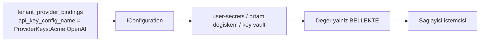

# Faz 65 — Kiracı Sağlayıcı Anahtarları (BYOK)

> **Durum:** 📋 Planlandı (2026-08-18)
> **Kaynak:** [ADAYLAR.md](ADAYLAR.md) · **F-40**
> **Önkoşul:** [Faz 41](41-KIRACI-YALITIMININ-ZORLANMASI.md) — kiracı yalıtımının zemini · [Faz 53](53-KIRACI-API-ANAHTARLARI.md) — kiracı yönetim yüzeyi ve kapsam modeli · [Faz 8](08-SAGLAYICI-GENISLEMESI.md) — sağlayıcı katmanı
> **Paketler:** `AgentPrism.Abstractions`, `AgentPrism.Core`, `AgentPrism.OpenAI`, `AgentPrism.Anthropic`, `AgentPrism.Google`, `AgentPrism.Azure`, `AgentPrism.Sql.Shared`, `AgentPrism.PostgreSql`, `AgentPrism.SqlServer`, `AgentPrism.Sqlite`, `AgentPrism.AspNetCore`, `AgentPrism.UI`
> **Yeni paket:** Yok · **Migration:** **gerekli — üç set** (yeni `tenant_provider_bindings` tablosu). Numara uygulama anında alınır (K-178)
> **Public API:** **büyüyor ve bir arayüz imzası genişliyor** — `IModelProvider.CreateChatClient`. 🚨 Arayüze metot/parametre eklemek yayından **sonra** en pahalı değişikliktir; `PublicAPI.Shipped.txt` bugün **boş** olduğu için **şimdi bedava**
> **Site etkisi:** `guides/model-providers.md`, `concepts/governance.md`, `reference/configuration.md`
> **Manuel test alanı:** [`docs/manuel-test/13-KIRACI-VE-GUVENLIK.md`](manuel-test/13-KIRACI-VE-GUVENLIK.md)

---

## Bu Faza Başlarken

> `faz-baslangic` skill'ini uygula. Aşağıdaki liste o skill'in 2. adımıdır —
> **tamamını değil, yalnız işaret edilen bölümleri oku.**

1. Bu doküman
2. Kararlar — dosyanın tamamını **okuma**, yalnız bu kalemleri grep'le:
   ```bash
   grep -n "K-059\|K-178\|K-208\|K-280\|K-380\|K-382" docs/KARARLAR.md
   ```
   **K-059** (`secret` veritabanına yazılmaz — bu fazın **çekirdek kuralı**),
   **K-178** (migration numaraları sağlayıcı başına bağımsız),
   **K-208** (`ProviderSettings` deseni),
   **K-280** (çalıştırmanın alt yazmalarında açık kiracı sorunu),
   **K-380** (`CompiledAgentCache` anahtarı kiracıyı **zaten** içeriyor),
   **K-382** (`AllowedTenants` dışındaki kiracı sessizce varsayılana düşmez)
3. [`53-KIRACI-API-ANAHTARLARI.md`](53-KIRACI-API-ANAHTARLARI.md) — yalnız devir notu:
   ```bash
   awk '/## Sonraki Faza Devir Notu/,0' docs/53-KIRACI-API-ANAHTARLARI.md
   ```
   Kiracı yönetim yüzeyi ve kapsam modeli oradan devralınır.
4. Alan hafızası (bu faz üç alana dokunuyor):
   [`hafiza/openai-saglayici.md`](hafiza/openai-saglayici.md) (sağlayıcı istemci
   kurulumu), [`hafiza/sql-saglayicilari.md`](hafiza/sql-saglayicilari.md) (yeni
   tablo üç sağlayıcıda), [`hafiza/aspnetcore-di.md`](hafiza/aspnetcore-di.md)
   (`IConfiguration` çözümlemesi ve DI ömrü)
5. Gerektiğinde, tamamı değil ilgili bölümü:
   [`MIMARI.md`](MIMARI.md) — güvenlik ve çok kiracılılık bölümleri

---

## Amaç

Sağlayıcı anahtarı bugün **globaldir**. Bütün kiracılar aynı anahtarı, aynı
kotayı ve aynı **faturayı** paylaşır. Çok kiracılı bir SaaS için bu kabul
edilemez: bir kiracının aşırı kullanımı diğerinin hizmetini durdurur ve maliyet
kiracıya yansıtılamaz.

- **F-40** — Kiracı başına sağlayıcı anahtarı. Kayıtta yalnız **yapılandırma
  anahtarının adı** durur; değer çalışma anında `IConfiguration`'dan çözülür.

Karar (kullanıcı, 2026-08-18): **yeni `tenant_provider_bindings` tablosu.**
Kiracı × sağlayıcı başına bir satır; sağlayıcıya özgü ek alanlara (uç adresi,
dağıtım adı) yer verir.

### Bugün ne çalışmıyor — doğrulanmış kanıt

| Kanıt | Gözlem |
|---|---|
| [`IModelProvider.cs:49`](../src/AgentPrism.Abstractions/Models/IModelProvider.cs) | `CreateChatClient(ModelBinding binding)` — kiracı **almaz** |
| [`IModelProviderRegistry.cs:18`](../src/AgentPrism.Abstractions/Models/IModelProviderRegistry.cs) | Kayıt defteri de kiracı almaz |
| [`OpenAIProviderExtensions.cs:20-23`](../src/AgentPrism.OpenAI/OpenAIProviderExtensions.cs) | `UseOpenAI(apiKey, configure)` — anahtar **kurulum anında** sabitlenir. Aynı desen dört sağlayıcıda |
| [`ModelProviderRegistry.cs:32`](../src/AgentPrism.Core/Models/ModelProviderRegistry.cs) | 🚨 `ITenantContext? _tenantContext` **zaten enjekte ediliyor** — bugün yalnız ek çözümlemesi için kullanılıyor. Kiracı bilgisi kayıt defterinde **hazırdır** |
| `grep -n "ConcurrentDictionary" ModelProviderRegistry.cs` | Kayıt defteri `IChatClient` **önbelleklemiyor**; istemci her çağrıda kuruluyor. Kiracılar arası istemci sızıntısı için **önbellek riski yok** |
| [`CompiledAgentCache.cs:109`](../src/AgentPrism.Core/Compilation/CompiledAgentCache.cs) | 🚨 Anahtar `CacheKey(TenantId, Name, Version, DependencyFingerprint)`. **Aday listesinin en büyük riski (K-380 ile) zaten kapanmış** — plan bunu tekrar açmaz |
| [`0001_initial.sql:21-25`](../src/AgentPrism.PostgreSql/Migrations/0001_initial.sql) | `tenants` tablosu vardır: `id`, `slug`, `display_name`, `created_at` |
| [`0025_api_keys.sql`](../src/AgentPrism.PostgreSql/Migrations/0025_api_keys.sql) | `api_keys` **gelen** erişim içindir. Bu faz **giden** çağrının kimliğidir; iki kavram karıştırılmaz |
| `PublicAPI.Shipped.txt` (1 satır) | Arayüz imzası genişletmek bugün bedava |

> Kanıtlar 2026-08-18 tarihinde doğrulandı.

---

## 65.1 — `secret` nerede durur, nerede durmaz

🚨 **K-059 bu fazın çekirdeğidir ve gevşemez.**



Veritabanında duran şey bir **addır**, bir değer değil. Değeri tüketici
`dotnet user-secrets`, ortam değişkeni veya kendi yapılandırma sağlayıcısıyla
verir. Kayıt hiçbir zaman `secret` taşımaz ve `faz-tamamlama`'nın `secret`
taraması bu fazda özellikle önemlidir.

## 65.2 — 🚨 Ad serbest değildir: önek kısıtı

Kiracı yöneticisi bir **ad** yazabiliyorsa, o adı `ConnectionStrings:Default`
veya başka bir kiracının anahtar adı yapabilir. Değeri okuyamaz ama **onunla
çağrı yapabilir** — yani başkasının faturasını harcar.

Bu yüzden çözümleme **kısıtlıdır**:

- Yalnız yapılandırılmış bir **önekin** altındaki adlar çözülür
  (varsayılan: `AgentPrism:ProviderKeys:`).
- Önek dışındaki bir ad kayıt anında **`400`** ile reddedilir.
- Çözümleme sırasında ad tekrar denetlenir; kayıt ile çözümleme arasındaki
  boşluk kapatılır (savunma iki katmanlıdır).

Bu kural bir DoD satırıdır ve testle kapatılır.

## 65.3 — Sağlayıcı arayüzü nasıl genişler

Sağlayıcı istemcisi bugün kurulum anındaki anahtarla kurulur. Kiracı anahtarı
çalışma anında bilinir; bu yüzden imza bir **kimlik bilgisi** parametresi alır.

```csharp
IChatClient CreateChatClient(ModelBinding binding, ModelProviderCredential? credential);
```

`credential` `null` ise bugünkü davranış birebir korunur: kurulum anındaki
anahtar kullanılır. Kiracının bağlaması yoksa `null` geçilir — **varsayılan
kapalı** (K1).

🚨 **Dört sağlayıcı paketi de değişir.** Bu, dört pakette aynı deseni
uygulamak demektir; sapma olursa bir sağlayıcı sessizce global anahtarı
kullanmaya devam eder. Sözleşme testi dört sağlayıcıyı da koşar.

🚨 **Ölçülmedi:** sağlayıcı paketlerinin içinde istemci nesnesinin
önbelleklenip önbelleklenmediği. Önbellek varsa anahtar değişimi
etkisiz kalır **veya** kiracılar arası sızar. Uygulamanın **ilk işi** bunu
`grep` ile ölçmektir.

## 65.4 — Çözümleme sırası

| Sıra | Kaynak |
|---|---|
| 1 | Kiracının `tenant_provider_bindings` kaydı |
| 2 | Kurulum anındaki global anahtar |
| 3 | Yoksa bugünkü hata: sağlayıcı kayıtlı değil |

Kiracının kaydı **varsa ve çözülemiyorsa** (ad var, değer yok) çağrı global
anahtara **düşmez**; anlaşılır bir hata verir. Sessiz düşüş yanlış faturaya yol
açar ve teşhis edilemez.

## 65.5 — Yönetim yüzeyi

| Metot | Yol | Rol · kapsam |
|---|---|---|
| `GET` | `/api/tenants/{tenantId}/providers` | Admin · `SecurityAdmin` |
| `PUT` | `/api/tenants/{tenantId}/providers/{provider}` | Admin · `SecurityAdmin` |
| `DELETE` | `/api/tenants/{tenantId}/providers/{provider}` | Admin · `SecurityAdmin` |

Yanıt hiçbir zaman bir değer taşımaz; yalnız adı, sağlayıcıyı ve çözümlemenin
**başarılı olup olmadığını** (`resolved: true/false`) döner. Bu, "anahtarı
yazdım ama çalışmıyor" sorusunun teşhis yoludur.

Her yazma bir denetim olayıdır (K-089: mutasyondan **önce**).

---

## Planlanan Public API

> Taslak imzalardır. Gerçekleşen imzalar kapanışta ayrı bir bölüme yazılır.

```csharp
// AgentPrism.Abstractions — giden cagrinin kimligi. DEGER tasir, ama asla saklanmaz.
public sealed record ModelProviderCredential
{
    /// <summary>The resolved API key. Never persisted; lives only in memory.</summary>
    public required string ApiKey { get; init; }

    /// <summary>Optional provider endpoint override.</summary>
    public string? Endpoint { get; init; }
}

// AgentPrism.Abstractions — kayit: yalnizca AD saklanir (K-059)
public sealed record TenantProviderBinding
{
    public required string TenantId { get; init; }
    public required string ProviderName { get; init; }

    /// <summary>The configuration KEY NAME the value is read from. Never the value itself.</summary>
    public required string ApiKeyConfigurationName { get; init; }

    public string? Endpoint { get; init; }
    public required DateTimeOffset UpdatedAt { get; init; }
}

public interface ITenantProviderBindingStore
{
    ValueTask<TenantProviderBinding?> GetAsync(string tenantId, string providerName, CancellationToken cancellationToken = default);
    ValueTask<IReadOnlyList<TenantProviderBinding>> ListAsync(string tenantId, CancellationToken cancellationToken = default);
    ValueTask UpsertAsync(TenantProviderBinding binding, CancellationToken cancellationToken = default);
    ValueTask<bool> DeleteAsync(string tenantId, string providerName, CancellationToken cancellationToken = default);
}

// AgentPrism.Abstractions — imza genisliyor
public interface IModelProvider
{
    // Credential null ise bugunku davranis birebir korunur.
    IChatClient CreateChatClient(ModelBinding binding, ModelProviderCredential? credential);
}

// AgentPrism.Abstractions — onek kisiti
public sealed class AgentPrismTenantProviderOptions
{
    /// <summary>Only configuration keys under this prefix can be referenced. Default "AgentPrism:ProviderKeys:".</summary>
    public string AllowedConfigurationPrefix { get; set; } = "AgentPrism:ProviderKeys:";
}
```

### Arayüz payı

Kiracı ekranına sağlayıcı bağlama listesi eklenir: sağlayıcı, yapılandırma adı,
çözümleme durumu. **Değer alanı yoktur** — arayüzden `secret` girilemez.
Bugünkü kullanım **165,4 KB gzip / 250 KB**; artış uygulama anında ölçülüp
yazılır. Yeni sözlük anahtarları `en.ts` **ve** `tr.ts` (K-228).

---

## Planlanan Dosya Listesi

```
src/AgentPrism.Abstractions/
├── Models/IModelProvider.cs               (imza genisler)
├── Models/ModelProviderCredential.cs      (yeni)
├── Tenancy/TenantProviderBinding.cs       (yeni)
├── Tenancy/ITenantProviderBindingStore.cs (yeni)
└── Options/AgentPrismTenantProviderOptions.cs (yeni)

src/AgentPrism.Core/
├── Models/ModelProviderRegistry.cs        (kiraci cozumlemesi + credential)
├── Tenancy/TenantProviderCredentialResolver.cs (yeni - onek kisiti burada)
└── Storage/InMemoryTenantProviderBindingStore.cs (yeni)

src/AgentPrism.{OpenAI,Anthropic,Google,Azure}/
└── *ProviderExtensions.cs                 (credential destegi - AYNI desen)

src/AgentPrism.Sql.Shared/Stores/
└── SqlTenantProviderBindingStore.cs       (yeni)

src/AgentPrism.{PostgreSql,SqlServer,Sqlite}/Migrations/
└── NNNN_tenant_provider_bindings.sql      (uc set - numara uygulama aninda)

src/AgentPrism.AspNetCore/Endpoints/
└── TenantProviderEndpoints.cs             (yeni)

src/AgentPrism.UI/frontend/src/
├── screens/                               (kiraci saglayici listesi)
└── locales/{en,tr}.ts                     (yeni anahtarlar - K-228)
```

---

## Hata Modları ve Testler

> Mutlu yoldan değil, **ne bozulabilir**den türetilir. Seviyeyi plan seçer.

| Ne bozulabilir | Seviye | Test sınıfı |
|---|---|---|
| 🚨 Bir kiracının anahtarı diğerinin çağrısında kullanılır | Sözleşme (`TenantIsolationContract`) | dört koşumda birden |
| 🚨 Önek dışında bir ad kaydedilebilir | Fonksiyonel | `TenantProviderEndpointTests` → `400` |
| 🚨 Kayıt anında geçen ad çözümlemede denetlenmez | Birim | `TenantProviderCredentialResolverTests` |
| Anahtar **değeri** veritabanına yazılır | Fonksiyonel + tarama | `TenantProviderBindingTests` + `secret` taraması |
| Anahtar değeri API yanıtında görünür | Fonksiyonel | `TenantProviderEndpointTests` |
| Anahtar değeri loga veya `span`'e yazılır | Fonksiyonel | `TenantProviderTelemetryTests` |
| Bağlama yokken davranış değişir | Birim | `ModelProviderRegistryTests` — `credential` `null` yolu |
| Bağlama var, değer yok → sessizce global anahtara düşer | Fonksiyonel | `TenantProviderResolutionTests` → anlaşılır hata |
| Sağlayıcı paketi istemciyi önbellekler, anahtar değişimi etkisiz kalır | Fonksiyonel | dört sağlayıcı için `ProviderCredentialTests` |
| Dört sağlayıcıdan biri credential'ı yok sayar | Fonksiyonel | `ProviderCredentialTests` — dördü de koşar |
| Maliyet raporu kiracıyı ayırmaz | Fonksiyonel | `TenantCostTests` |
| Eş zamanlı iki `PUT` aynı bağlamayı bozar | Fonksiyonel | `TenantProviderConcurrencyTests` |
| Bağlama silinince çalışan bir `run` çöker | Fonksiyonel | `TenantProviderResolutionTests` |
| Kapsamsız anahtarla bağlama yazılır | Fonksiyonel | `TenantProviderEndpointTests` → `403` |
| Bağlama yazımı denetim izine yazılmaz | Fonksiyonel | `TenantProviderAuditTests` (K-089) |
| Üç sağlayıcıda tablo davranışı ayrışır | Sözleşme | `TenantProviderBindingContract` |
| Sözlük anahtarı eksik | Derleme | `tsc --noEmit` (K-228) |

Sözleşme testi `tests/Shared/Contracts/` altına — hem bellek içi hem üç SQL
sağlayıcısı üzerinde koşar.

---

## Manuel Kabul Case'leri

> Kapanışta [`docs/manuel-test/13-KIRACI-VE-GUVENLIK.md`](manuel-test/13-KIRACI-VE-GUVENLIK.md)
> içine eklenecek case'lerin taslağı.

| # | Ön koşul | Adımlar | Beklenen sonuç |
|---|---|---|---|
| 1 | Bağlama yok | Çalıştır | Bugünkü davranış: global anahtar kullanılır |
| 2 | `user-secrets`'e `AgentPrism:ProviderKeys:Acme:OpenAI` yazıldı | Bağlamayı kaydet, çalıştır | Çağrı kiracının anahtarıyla gider |
| 3 | 2'nin ardından | `GET /api/tenants/acme/providers` | Ad görünür, **değer görünmez**, `resolved: true` |
| 4 | Ad var, değer yok | Çalıştır | Anlaşılır hata; global anahtara **düşmez** |
| 5 | — | `ConnectionStrings:Default` adıyla bağlama yaz | `400` — önek dışında |
| 6 | İki kiracı, iki farklı anahtar | Sırayla çalıştır | Her çağrı kendi anahtarını kullanır |
| 7 | 6'nın ardından | Veritabanını `secret` için tara | Hiçbir anahtar değeri yok |
| 8 | 6'nın ardından | Denetim izini aç | Bağlama yazımları kayıtlı |
| 9 | — | Arayüzden bağlama ekranını aç | Değer girme alanı **yoktur** |

---

## Açık Sorular

> Planı bloklamayan, faz uygulanırken karara bağlanacak sorular.

| # | Soru | Seçenekler | Öneri |
|---|---|---|---|
| 1 | `IModelProvider` imzası nasıl genişler? | A: Var olan metoda parametre eklenir · B: Yeni bir aşırı yükleme · C: Yeni bir arayüz (`ITenantAwareModelProvider`) | **A.** Yayınlanmış yüzey boş; bugün en temiz yol tek imzadır. B iki kod yolu üretir ve biri unutulur. C paralel hiyerarşi kurar |
| 2 | `ModelProviderCredential` değeri `string` mi olmalı? | A: `string` · B: `Func<string>` veya `IDisposable` sarmalayıcı | **A** ilk sürüm için. B bellekte tutma süresini kısaltır ama sağlayıcı SDK'ları zaten `string` istiyor; kazanç ölçülmeden karmaşıklık alınmaz |
| 3 | Çözümleme önbelleklenmeli mi? | A: Hayır, her çağrıda `IConfiguration`'dan oku · B: Kısa ömürlü önbellek | **A.** `IConfiguration` okuması ucuzdur ve `reload` desteklenir; önbellek anahtar döndürmeyi geciktirir. Ölçüm gerekirse B ayrı bir kalemdir |
| 4 | Bağlama kiracı yöneticisi tarafından mı, yalnız platform yöneticisi tarafından mı yazılır? | A: `SecurityAdmin` kapsamı yeterli · B: Yalnız `PlatformAdmin` | **A**, ama önek kısıtıyla birlikte. B çok kiracılı SaaS'ta self-servis'i öldürür |
| 5 | Uç adresi (`Endpoint`) bu fazda desteklensin mi? | A: Evet, sütun ve alan hazır gelsin · B: Yalnız anahtar | **A.** Azure ve uyumlu uçlar için uç adresi anahtar kadar kiracıya özgüdür; sonradan eklemek ikinci bir migration ister |

---

## Bitiş Ölçütleri (DoD)

- [ ] Bağlama yokken bugünkü davranış **birebir** korunur
- [ ] Kiracının bağlaması varken çağrı **onun** anahtarıyla gider; iki kiracı iki farklı anahtar kullanır (sözleşme testi, dört koşum)
- [ ] Anahtar **değeri** hiçbir yerde saklanmaz: veritabanı, log, `span`, API yanıtı — dördü de testle kapatıldı
- [ ] Önek dışındaki bir yapılandırma adı hem kayıtta hem çözümlemede reddedilir
- [ ] Ad var ama değer yoksa çağrı global anahtara **düşmez**; hata anlaşılırdır
- [ ] Dört sağlayıcı paketi de credential'ı uygular; dördü de test edilir
- [ ] Bağlama yazımı denetim izine mutasyondan **önce** yazılır
- [ ] Arayüzde değer girme alanı **yoktur**
- [ ] Dört doğrulama kapısı sıfır uyarı verir
- [ ] `samples/AgentPrism.Api` ile gerçek `run` yapıldı, çıktı belgeye yazıldı
- [ ] `secret` taraması boş döndü
- [ ] Manuel kabul case'leri `docs/manuel-test/13-KIRACI-VE-GUVENLIK.md` içine eklendi; otomatikleştirilebilenler koşuldu
- [ ] `faz-denetim` koşuldu; 🔴 bulgu kalmadı
- [ ] `docs-site/` güncellendi (`guides/model-providers.md`, `concepts/governance.md`, `reference/configuration.md`); `npm run build` + `check-links.mjs` temiz
- [ ] `en.ts` ve `tr.ts` eksiksiz; bundle payı ölçüldü ve yazıldı

### Doğrulama komutları

```bash
# Deger yalniz user-secrets'ta yasar
dotnet user-secrets set "AgentPrism:ProviderKeys:Acme:OpenAI" "sk-..." \
  --project samples/AgentPrism.Api

# Baglama yaz - yalniz AD
curl -s -X PUT http://localhost:5081/agentprism/api/tenants/acme/providers/openai \
  -H 'Content-Type: application/json' \
  -d '{"apiKeyConfigurationName":"AgentPrism:ProviderKeys:Acme:OpenAI"}'

# Deger DONMEZ, yalniz cozumleme durumu doner
curl -s http://localhost:5081/agentprism/api/tenants/acme/providers

# Onek disindaki ad reddedilir
curl -s -o /dev/null -w '%{http_code}\n' -X PUT \
  http://localhost:5081/agentprism/api/tenants/acme/providers/openai \
  -H 'Content-Type: application/json' \
  -d '{"apiKeyConfigurationName":"ConnectionStrings:Default"}'
```

---

## Riskler

| Risk | Önlem |
|------|-------|
| 🚨 Kiracı yöneticisi başka bir yapılandırma anahtarını gösterir | Önek kısıtı; kayıt **ve** çözümleme anında iki kez denetlenir |
| 🚨 Bir kiracının anahtarı diğerine sızar | Kayıt defteri istemci önbelleklemiyor (ölçüldü); `CompiledAgentCache` anahtarı kiracıyı içeriyor (K-380); sözleşme testi dört koşumda |
| 🚨 Sağlayıcı paketi istemciyi önbellekler | Uygulamanın **ilk işi** bunu ölçmektir; dört sağlayıcı için ayrı test |
| Anahtar değeri loga düşer | `secret` filtresi; log ve `span` testleri; `faz-tamamlama` taraması |
| Sessiz global anahtara düşüş yanlış fatura üretir | Düşüş **yasak**; anlaşılır hata ve test |
| Dört sağlayıcıda desen sapar | Ortak yardımcı ve dördünü birden koşan test |
| Yayından sonra arayüz imzası değişemez | Bu faz Faz 7'den **önce** kalmalıdır; plan bunu başlıkta yazıyor |

---

<!-- ============================================================
     AŞAĞISI KAPANIŞTA DOLDURULUR — `faz-tamamlama` skill'i.
     Plan anında boş kalır. Başlıkları SİLME.
     ============================================================ -->

## Plandan Sapmalar

> Kapanışta doldurulur. Plan ile gerçek arasındaki fark **gizlenmez** — sonraki
> oturumun en değerli bilgisidir.

## Bu Fazda Verilen Kararlar

> Kapanışta doldurulur. K-NNN numaraları burada alınır; plan numara rezerve etmez.

## Gerçekleşen Public API

> Kapanışta doldurulur. Koddaki **gerçek** imzalar.

## Dosya Listesi (gerçekleşen)

> Kapanışta doldurulur.

## Denetim Bulguları

> Kapanışta doldurulur — `faz-denetim` çıktısı. Her satır: bulgu · seviye
> (🔴/🟡/🟢) · sonuç (düzeltildi / gerekçelendi / F-NN olarak devredildi).
> Bulgu yoksa "🔴 ve 🟡 yok" yazılır; boş bırakılmaz.

## Sonraki Faza Devir Notu

> Kapanışta doldurulur: devralınan sözleşmeler, bilinen tuzaklar (🚨), yarım
> kalan işler, sıradaki faz.
