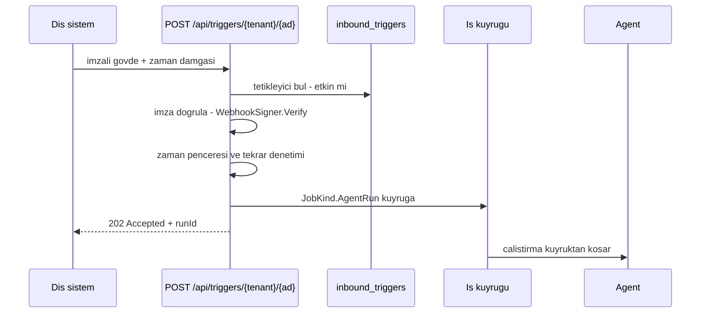

# Faz 66 — Gelen Tetikleyiciler

> **Durum:** 📋 Planlandı (2026-08-18)
> **Kaynak:** [ADAYLAR.md](ADAYLAR.md) · **F-65**
> **Önkoşul:** [Faz 17](17-TOPLU-VE-ZAMANLANMIS-CALISTIRMA.md) — iş kuyruğu · [Faz 21](21-KOTA-VE-OLAY-YAYINI.md) — `WebhookSigner` ters yönde kullanılır · [Faz 43](43-IDEMPOTENCY-KEY.md) — tekrar koruması oradan gelir · [Faz 46](46-DAYANIKLI-CALISTIRMA.md) — `JobKind.AgentRun` tetikleyicinin hedefidir · [Faz 53](53-KIRACI-API-ANAHTARLARI.md) — kapsam modeli
> **Paketler:** `AgentPrism.Abstractions`, `AgentPrism.Core`, `AgentPrism.Sql.Shared`, `AgentPrism.PostgreSql`, `AgentPrism.SqlServer`, `AgentPrism.Sqlite`, `AgentPrism.AspNetCore`, `AgentPrism.UI`
> **Yeni paket:** Yok · **Migration:** **gerekli — üç set** (yeni `inbound_triggers` tablosu). Numara uygulama anında alınır (K-178)
> **Public API:** **büyüyor** — bir kayıt tipi, bir depo arayüzü, uç ailesi. `PublicAPI.Shipped.txt` bugün **boş**; ekleme **bugün bedava**
> **Site etkisi:** `guides/background-work.md`, `concepts/runs.md`, yeni `guides/inbound-triggers.md`
> **Manuel test alanı:** [`docs/manuel-test/16-IS-KUYRUGU-VE-ZAMANLAMA.md`](manuel-test/16-IS-KUYRUGU-VE-ZAMANLAMA.md)

---

## Bu Faza Başlarken

> `faz-baslangic` skill'ini uygula. Aşağıdaki liste o skill'in 2. adımıdır —
> **tamamını değil, yalnız işaret edilen bölümleri oku.**

1. Bu doküman
2. Kararlar — dosyanın tamamını **okuma**, yalnız bu kalemleri grep'le:
   ```bash
   grep -n "K-059\|K-138\|K-178\|K-382\|K-394\|K-395" docs/KARARLAR.md
   ```
   **K-059** (imza `secret`'ı veritabanına yazılmaz — yalnız **adı**),
   **K-138** (zamanlamada çift tetikleme benzersiz kısıtla kapatıldı — aynı
   ders burada tekrarlanır), **K-178** (migration numaraları bağımsız),
   **K-382** (kiracı listede yoksa sessizce varsayılana **düşmez**),
   **K-394** (workflow çalıştırmaları kota kapısından geçer — tetikleyici de
   geçmelidir), **K-395** (kimlik doğrulaması olmayan gruplarda başlık nötr
   davranışı)
3. [`21-KOTA-VE-OLAY-YAYINI.md`](21-KOTA-VE-OLAY-YAYINI.md) — yalnız devir notu:
   ```bash
   awk '/## Sonraki Faza Devir Notu/,0' docs/21-KOTA-VE-OLAY-YAYINI.md
   ```
   Giden webhook'un imza sözleşmesi devralınır; bu faz onu **ters yönde**
   kullanır.
4. Alan hafızası (bu faz üç alana dokunuyor):
   [`hafiza/aspnetcore-di.md`](hafiza/aspnetcore-di.md) (kimlik doğrulamasız uç
   grubu ve filtre sırası), [`hafiza/postgresql.md`](hafiza/postgresql.md)
   (benzersizlik indeksi), [`hafiza/frontend.md`](hafiza/frontend.md)
   (tetikleyici ekranı)
5. Gerektiğinde, tamamı değil ilgili bölümü:
   [`MIMARI.md`](MIMARI.md) — güvenlik ve çalıştırma yolu bölümleri

---

## Amaç

Faz 21 **giden** webhook'u verdi: AgentPrism dış dünyaya olay yollar. Tersi
yoktur. Bir Slack mesajı, bir e-posta, bir kuyruk olayı bir çalıştırma
başlatamaz. Agent yalnız **sorulunca** konuşur; olaya tepki veremez.

- **F-65** — İmzalı gelen uç, olay → agent eşlemesi ve Faz 17'nin kuyruğuna
  düşürme.

Karar (kullanıcı, 2026-08-18): **yeni `inbound_triggers` tablosu.**
Tetikleyici çalışma anında tanımlanır ve arayüzden yönetilir; `job_schedules`
emsalini izler.

### Bugün ne çalışmıyor — doğrulanmış kanıt

| Kanıt | Gözlem |
|---|---|
| `grep -rln "Trigger" src/AgentPrism.AspNetCore/` | Yalnız zamanlama sözleşmelerinde geçiyor. **Gelen tetikleyici ucu yok** |
| [`WebhookSigner.cs:68`](../src/AgentPrism.Core/Webhooks/WebhookSigner.cs) | `Verify(body, timestamp, secret, signature)` **hazır** ve sabit zamanlı karşılaştırma kullanıyor. Ters yön için yeni kriptografi yazılmaz |
| [`JobKind.cs:49`](../src/AgentPrism.Abstractions/Scheduling/JobKind.cs) | `AgentRun = 5` vardır (Faz 46). Tetikleyicinin hedefi budur; yeni bir iş tipi gerekmez |
| [`JobKind.cs:18`](../src/AgentPrism.Abstractions/Scheduling/JobKind.cs) | `Workflow = 1` — tetikleyici workflow'u da hedefleyebilir |
| [`IIdempotencyStore.cs:22`](../src/AgentPrism.Abstractions/Idempotency/IIdempotencyStore.cs) | Tekrar koruması için depo **hazır** (Faz 43) |
| [`0008_scheduling.sql:31-46`](../src/AgentPrism.PostgreSql/Migrations/0008_scheduling.sql) | `job_schedules` şeması bu tablonun emsalidir: kiracı, ad, hedef, `enabled`, benzersiz `(tenant_id, name)` |
| K-138 | Çift tetikleme zamanlamada **benzersiz kısıtla** kapatıldı; aynı ders bu fazda tekrar edilir |

> Kanıtlar 2026-08-18 tarihinde doğrulandı.

---

## 66.1 — Akış



Uç **her zaman kuyruğa** düşürür ve `202` döner. Senkron çalıştırma
**yoktur**: dış sistem yanıtı beklemez ve uzun bir model çağrısı bir webhook
zaman aşımına takılır. Faz 46'nın `202 Accepted` + `Location` sözleşmesi birebir
kullanılır.

## 66.2 — Kimlik: imza, bearer token değil

Gelen uç **kimlik doğrulaması olmadan açılamaz**. Ama dış sistem bir yönetim
token'ı taşıyamaz; taşırsa o token dış sistemde durur.

Kimlik **imzadır**:

- Her tetikleyicinin kendi imza `secret`'ı vardır.
- 🚨 **K-059:** kayıtta yalnız `secret`'ın **yapılandırma anahtarı adı** durur.
  Değer `IConfiguration`'dan çözülür. Faz 65'in önek kısıtı burada da
  uygulanır.
- İmza `WebhookSigner.Verify` ile doğrulanır — sabit zamanlı karşılaştırma
  hazırdır.
- Zaman damgası bir **pencere** içinde olmalıdır (varsayılan beş dakika);
  pencere dışındaki istek reddedilir. Bu tekrar saldırısına karşı ilk
  savunmadır.
- İkinci savunma `IIdempotencyStore`'dur: aynı imza ikinci kez kabul edilmez.

🚨 **Kiracı yoldan gelir ama doğrulanır.** K-382 dersi birebir geçerlidir:
bilinmeyen bir kiracı sessizce varsayılana **düşmez**, `404` alır. Yanıt
"tetikleyici yok" ile "imza yanlış" arasında **fark göstermez** — ayrım bir
numaralandırma yüzeyidir.

## 66.3 — Olay gövdesi agent'a nasıl geçer

🚨 **K2 gevşemez: şablon dili yoktur.** Gelen JSON'dan mesaj üretmek için
yalnız iki seçenek vardır:

| Mod | Davranış |
|---|---|
| `WholeBody` (varsayılan) | Gövdenin tamamı JSON metni olarak mesaj olur |
| `Path` | Noktalı bir yol (`event.text`) ile tek bir alan seçilir |

Yol biçimi Faz 63'ün koşul yolu ile **aynıdır**; iki yerde iki farklı yol dili
olmaz. Yol çözülemezse çalıştırma başlatılmaz ve `400` döner.

Dönüşüm kodu yazmak isteyen tüketici bunu kendi tarafında yapar ve gövdeyi
hazır gönderir. Sunucu tarafında ifade çalıştırmak K2'nin ihlalidir.

## 66.4 — Kota, kiracı ve denetim

- Tetikleyici çalıştırması **kota kapısından geçer** (K-394 emsali). Dış bir
  olay kotayı bypass edemez; aksi hâlde kota anlamsızdır.
- Kuyruğa düşen iş kiracı kapsamında koşar (`AmbientTenantScope`, Faz 17
  deseni).
- Tetikleyici tanımının her yazımı denetim izine girer (K-089: mutasyondan
  **önce**).
- Kabul edilen her olay bir `run` kaydı üretir; kaynağı (`trigger:<ad>`)
  görünür olmalıdır.

## 66.5 — Hız sınırı

Gelen uç internete açıktır. Tetikleyici başına bir hız sınırı **zorunludur**;
sınırsız bir uç kuyruğu doldurur ve kotayı tüketir.

🚨 Sınır **bellekte** yaşar (K-158). Dağıtık sınır bu repoda bilerek alınmadı
ve bu faz o kararı yeniden açmaz. Çok örnekli dağıtımda sınır örnek başına
uygulanır; belge bunu açıkça yazar.

---

## Planlanan Public API

> Taslak imzalardır. Gerçekleşen imzalar kapanışta ayrı bir bölüme yazılır.

```csharp
// AgentPrism.Abstractions
public enum InboundTriggerTargetKind
{
    Agent = 0,
    Workflow = 1,
}

public enum InboundTriggerPayloadMode
{
    WholeBody = 0,
    Path = 1,
}

public sealed record InboundTrigger
{
    public required Guid Id { get; init; }
    public required string TenantId { get; init; }
    public required string Name { get; init; }
    public required InboundTriggerTargetKind TargetKind { get; init; }
    public required string TargetName { get; init; }

    /// <summary>The configuration KEY NAME of the signing secret. Never the value itself.</summary>
    public required string SigningSecretConfigurationName { get; init; }

    public InboundTriggerPayloadMode PayloadMode { get; init; } = InboundTriggerPayloadMode.WholeBody;

    /// <summary>Dotted path used when PayloadMode is Path.</summary>
    public string? PayloadPath { get; init; }

    public bool Enabled { get; init; } = true;
    public required DateTimeOffset CreatedAt { get; init; }
    public required DateTimeOffset UpdatedAt { get; init; }
}

public interface IInboundTriggerStore
{
    ValueTask<InboundTrigger?> GetAsync(string tenantId, string name, CancellationToken cancellationToken = default);
    ValueTask<IReadOnlyList<InboundTrigger>> ListAsync(string tenantId, CancellationToken cancellationToken = default);
    ValueTask UpsertAsync(InboundTrigger trigger, CancellationToken cancellationToken = default);
    ValueTask<bool> DeleteAsync(string tenantId, string name, CancellationToken cancellationToken = default);
}

public sealed class AgentPrismInboundTriggerOptions
{
    /// <summary>How far the request timestamp may drift. Default five minutes.</summary>
    public TimeSpan TimestampTolerance { get; set; } = TimeSpan.FromMinutes(5);

    /// <summary>Maximum accepted body size in bytes. Default 256 KB.</summary>
    public int MaxBodyBytes { get; set; } = 256 * 1024;

    /// <summary>Maximum accepted requests per trigger per minute. Default 60.</summary>
    public int MaxRequestsPerMinute { get; set; } = 60;

    /// <summary>Only configuration keys under this prefix can hold a signing secret.</summary>
    public string AllowedConfigurationPrefix { get; set; } = "AgentPrism:TriggerSecrets:";
}
```

### HTTP `endpoint`'leri

| Metot | Yol | Rol · kapsam | Ne yapar |
|---|---|---|---|
| `POST` | `/api/triggers/{tenantId}/{name}` | **imza** — bearer token yok | Olayı kabul eder, kuyruğa düşürür, `202` + `Location` döner |
| `GET` | `/api/triggers` | Admin · `PlatformRead` | Kiracının tetikleyicilerini listeler |
| `PUT` | `/api/triggers/{name}` | Admin · `PlatformAdmin` | Tetikleyici tanımlar veya günceller |
| `DELETE` | `/api/triggers/{name}` | Admin · `PlatformAdmin` | Siler |

🚨 Kabul ucu kimlik doğrulamasız gruptadır; K-395 dersine göre filtre sırası
uygulama anında **ölçülmelidir**.

### Arayüz payı

Tetikleyici listesi ve düzenleme ekranı eklenir; `secret` **değeri** girilmez,
yalnız yapılandırma adı. Bugünkü kullanım **165,4 KB gzip / 250 KB**; artış
uygulama anında ölçülüp yazılır. Yeni sözlük anahtarları `en.ts` **ve** `tr.ts`
(K-228).

---

## Planlanan Dosya Listesi

```
src/AgentPrism.Abstractions/Triggers/
├── InboundTrigger.cs                  (yeni)
├── IInboundTriggerStore.cs            (yeni)
├── InboundTriggerTargetKind.cs        (yeni)
└── InboundTriggerPayloadMode.cs       (yeni)

src/AgentPrism.Core/Triggers/
├── InboundTriggerDispatcher.cs        (yeni - imza, pencere, tekrar, kuyruk)
├── InboundTriggerRateLimiter.cs       (yeni - bellekte, K-158)
└── InboundTriggerPayloadReader.cs     (yeni - WholeBody ve Path)

src/AgentPrism.Core/Storage/
└── InMemoryInboundTriggerStore.cs     (yeni)

src/AgentPrism.Sql.Shared/Stores/
└── SqlInboundTriggerStore.cs          (yeni)

src/AgentPrism.{PostgreSql,SqlServer,Sqlite}/Migrations/
└── NNNN_inbound_triggers.sql          (uc set - numara uygulama aninda)

src/AgentPrism.AspNetCore/Endpoints/
└── TriggerEndpoints.cs                (yeni - kabul + yonetim)

src/AgentPrism.UI/frontend/src/
├── screens/                           (tetikleyici listesi ve duzenleme)
└── locales/{en,tr}.ts                 (yeni anahtarlar - K-228)
```

---

## Hata Modları ve Testler

> Mutlu yoldan değil, **ne bozulabilir**den türetilir. Seviyeyi plan seçer.

| Ne bozulabilir | Seviye | Test sınıfı |
|---|---|---|
| 🚨 İmzasız istek kabul edilir | Fonksiyonel | `TriggerEndpointTests` → `401` |
| 🚨 Yanlış imza kabul edilir | Fonksiyonel | `TriggerEndpointTests` → `401` |
| 🚨 Eski bir istek tekrar oynatılır | Fonksiyonel | `TriggerReplayTests` — pencere dışı `401`, pencere içi tekrar `409` |
| Bilinmeyen kiracı varsayılana düşer | Fonksiyonel | `TriggerEndpointTests` → `404` (K-382) |
| Yanıt "tetikleyici yok" ile "imza yanlış"ı ayırır | Fonksiyonel | `TriggerEndpointTests` — aynı gövde ve kod |
| Devre dışı tetikleyici çalışır | Fonksiyonel | `TriggerEndpointTests` |
| Tetikleyici kotayı bypass eder | Fonksiyonel | `TriggerQuotaTests` (K-394 emsali) |
| Aşırı büyük gövde kabul edilir | Fonksiyonel | `TriggerEndpointTests` → `413` |
| Hız sınırı yok, kuyruk dolar | Fonksiyonel | `TriggerRateLimitTests` → `429` |
| `Path` modunda yol çözülemez | Fonksiyonel | `TriggerPayloadTests` → `400`, çalıştırma **başlamaz** |
| Bozuk JSON gövdesi | Fonksiyonel | `TriggerPayloadTests` → `400` |
| Boş gövde | Fonksiyonel | `TriggerPayloadTests` |
| İmza `secret`'ının **değeri** veritabanına yazılır | Fonksiyonel + tarama | `TriggerStoreTests` + `secret` taraması |
| Önek dışındaki bir yapılandırma adı kabul edilir | Fonksiyonel | `TriggerEndpointTests` → `400` |
| Başka kiracının tetikleyicisi görünür veya çalışır | Sözleşme (`TenantIsolationContract`) | dört koşumda birden |
| Aynı ada iki tetikleyici yazılır | Sözleşme | benzersiz kısıt → `409` (K-138 dersi) |
| Eş zamanlı iki özdeş olay iki çalıştırma açar | Fonksiyonel | `TriggerReplayTests` |
| Kuyruk yazımı başarısız olur ama `202` döner | Fonksiyonel | `TriggerDispatchFailureTests` |
| Kuyruktaki iş iptal edilir | Fonksiyonel | `TriggerDispatchTests` |
| Tetikleyici yazımı denetim izine yazılmaz | Fonksiyonel | `TriggerAuditTests` (K-089) |
| Üç sağlayıcıda tablo davranışı ayrışır | Sözleşme | `InboundTriggerContract` |
| Sözlük anahtarı eksik | Derleme | `tsc --noEmit` (K-228) |
| Tetikleyici arayüzden tanımlanıp listelenir | E2E (Playwright) | `UiTests` |

Sözleşme testi `tests/Shared/Contracts/` altına — hem bellek içi hem üç SQL
sağlayıcısı üzerinde koşar.

---

## Manuel Kabul Case'leri

> Kapanışta [`docs/manuel-test/16-IS-KUYRUGU-VE-ZAMANLAMA.md`](manuel-test/16-IS-KUYRUGU-VE-ZAMANLAMA.md)
> içine eklenecek case'lerin taslağı.

| # | Ön koşul | Adımlar | Beklenen sonuç |
|---|---|---|---|
| 1 | Tetikleyici tanımlı, `secret` `user-secrets`'ta | Doğru imzayla `POST` | `202` + `Location`; çalıştırma kuyruktan koşar |
| 2 | 1'in ardından | `Location` adresini oku | Çalıştırma tamamlanır, kaynağı tetikleyicidir |
| 3 | — | İmzasız `POST` | `401` |
| 4 | — | Gövdeyi bir bayt değiştirip aynı imzayla gönder | `401` |
| 5 | — | On dakika eski zaman damgasıyla gönder | `401` |
| 6 | 1'in ardından | Aynı isteği tekrar gönder | `409`; ikinci çalıştırma **açılmaz** |
| 7 | Bilinmeyen kiracı | `POST` | `404`; varsayılan kiracıya düşmez |
| 8 | Tetikleyici devre dışı | `POST` | Reddedilir; çalıştırma açılmaz |
| 9 | Kota dolu | `POST` | `429`; kota bypass edilmez |
| 10 | `Path` modu, yol yok | `POST` | `400`; çalıştırma başlamaz |
| 11 | — | Veritabanını `secret` için tara | İmza `secret`'ı **yok**, yalnız ad var |
| 12 | — | 100 istek arka arkaya gönder | Hız sınırı `429` üretir |

---

## Açık Sorular

> Planı bloklamayan, faz uygulanırken karara bağlanacak sorular.

| # | Soru | Seçenekler | Öneri |
|---|---|---|---|
| 1 | Kiracı yolda mı görünsün, imzadan mı türetilsin? | A: Yolda (`/api/triggers/{tenantId}/{name}`) · B: Opak bir tetikleyici anahtarı (`/api/triggers/{key}`) | **B ölçülmeli.** A basittir ama kiracı slug'ını dışarı verir; B numaralandırmayı zorlaştırır. Karar uygulama anında verilir ve gerekçesi yazılır |
| 2 | İmza başlıkları hangi adları taşır? | A: Faz 21'in giden başlıklarıyla **aynı** adlar · B: Yeni adlar | **A.** Aynı ürün iki farklı imza sözleşmesi taşımamalıdır; giden ile gelen simetrik olur |
| 3 | Tetikleyici workflow'u da hedefleyebilmeli mi? | A: Evet, `TargetKind` ilk sürümde iki değer · B: Yalnız agent | **A.** `JobKind.Workflow` zaten var; sonradan eklemek `record` ve tabloyu ikinci kez değiştirir |
| 4 | Reddedilen istekler kaydedilsin mi? | A: Yalnız metrik ve log · B: Ayrı bir tabloya | **A.** B saldırı yüzeyini veriye çevirir ve saklama politikası ister; metrik teşhis için yeterlidir |
| 5 | Tekrar koruması neyi anahtar alır? | A: İmza · B: Gövdedeki bir olay kimliği | **A** varsayılan; B tetikleyici başına seçenek olabilir. Dış sistemler olay kimliğini her zaman vermez |

---

## Bitiş Ölçütleri (DoD)

- [ ] Doğru imzalı istek `202` + `Location` döner ve çalıştırma kuyruktan koşar
- [ ] İmzasız, yanlış imzalı ve pencere dışı istek `401` döner
- [ ] Aynı istek ikinci kez `409` döner; ikinci çalıştırma açılmaz
- [ ] Bilinmeyen kiracı `404` alır; varsayılana **düşmez**
- [ ] Yanıt "tetikleyici yok" ile "imza yanlış" arasında fark **göstermez**
- [ ] Tetikleyici çalıştırması kota kapısından geçer
- [ ] Hız sınırı ve gövde boyutu sınırı çalışır (`429` / `413`)
- [ ] İmza `secret`'ının değeri hiçbir yerde saklanmaz; yalnız yapılandırma adı durur
- [ ] Önek dışındaki bir yapılandırma adı `400` ile reddedilir
- [ ] Başka kiracının tetikleyicisi ne görünür ne çalışır (sözleşme testi, dört koşum)
- [ ] Tetikleyici yazımı denetim izine mutasyondan **önce** yazılır
- [ ] Dört doğrulama kapısı sıfır uyarı verir
- [ ] `samples/AgentPrism.Api` ile gerçek `run` yapıldı, çıktı belgeye yazıldı
- [ ] `secret` taraması boş döndü
- [ ] Manuel kabul case'leri `docs/manuel-test/16-IS-KUYRUGU-VE-ZAMANLAMA.md` içine eklendi; otomatikleştirilebilenler koşuldu
- [ ] `faz-denetim` koşuldu; 🔴 bulgu kalmadı
- [ ] `docs-site/` güncellendi (`guides/background-work.md`, `guides/inbound-triggers.md`, `concepts/runs.md`); `npm run build` + `check-links.mjs` temiz
- [ ] `en.ts` ve `tr.ts` eksiksiz; bundle payı ölçüldü ve yazıldı

### Doğrulama komutları

```bash
# Imza secret'i yalniz user-secrets'ta
dotnet user-secrets set "AgentPrism:TriggerSecrets:Slack" "whsec_..." \
  --project samples/AgentPrism.Api

# Tetikleyici tanimla - yalniz AD
curl -s -X PUT http://localhost:5081/agentprism/api/triggers/slack \
  -H 'Content-Type: application/json' \
  -d '{"targetKind":"agent","targetName":"demo","signingSecretConfigurationName":"AgentPrism:TriggerSecrets:Slack","payloadMode":"path","payloadPath":"event.text"}'

# Olay gonder - imzali
curl -s -i -X POST http://localhost:5081/agentprism/api/triggers/default/slack \
  -H 'Content-Type: application/json' \
  -H 'X-AgentPrism-Timestamp: <zaman>' \
  -H 'X-AgentPrism-Signature: <imza>' \
  -d '{"event":{"text":"merhaba"}}'

# Imzasiz reddedilir
curl -s -o /dev/null -w '%{http_code}\n' -X POST \
  http://localhost:5081/agentprism/api/triggers/default/slack -d '{}'
```

---

## Riskler

| Risk | Önlem |
|------|-------|
| 🚨 Gelen uç internete açıktır | İmza zorunlu; zaman penceresi; tekrar koruması; hız sınırı; gövde boyutu sınırı |
| 🚨 Tekrar saldırısı çalıştırma çoğaltır | `IIdempotencyStore` (Faz 43) ve zaman penceresi; test iki katmanı da koşar |
| 🚨 `secret` veritabanına yazılır | K-059: yalnız ad; önek kısıtı; `secret` taraması |
| Kiracı numaralandırılır | Aynı yanıt gövdesi ve kodu; kiracı yolu için Açık Soru 1 |
| Kota bypass edilir | Tetikleyici çalıştırması aynı `QuotaGate`'ten geçer (K-394) |
| Çift tetikleme | Benzersiz kısıt (K-138 dersi) ve tekrar koruması |
| Şablon dili sızar | Yalnız `WholeBody` ve `Path`; yol dili Faz 63 ile **aynı** |
| Hız sınırı çok örnekte örnek başına uygulanır | K-158 kararı korunur; belge sınırın kapsamını açıkça yazar |

---

<!-- ============================================================
     AŞAĞISI KAPANIŞTA DOLDURULUR — `faz-tamamlama` skill'i.
     Plan anında boş kalır. Başlıkları SİLME.
     ============================================================ -->

## Plandan Sapmalar

> Kapanışta doldurulur. Plan ile gerçek arasındaki fark **gizlenmez** — sonraki
> oturumun en değerli bilgisidir.

## Bu Fazda Verilen Kararlar

> Kapanışta doldurulur. K-NNN numaraları burada alınır; plan numara rezerve etmez.

## Gerçekleşen Public API

> Kapanışta doldurulur. Koddaki **gerçek** imzalar.

## Dosya Listesi (gerçekleşen)

> Kapanışta doldurulur.

## Denetim Bulguları

> Kapanışta doldurulur — `faz-denetim` çıktısı. Her satır: bulgu · seviye
> (🔴/🟡/🟢) · sonuç (düzeltildi / gerekçelendi / F-NN olarak devredildi).
> Bulgu yoksa "🔴 ve 🟡 yok" yazılır; boş bırakılmaz.

## Sonraki Faza Devir Notu

> Kapanışta doldurulur: devralınan sözleşmeler, bilinen tuzaklar (🚨), yarım
> kalan işler, sıradaki faz.
