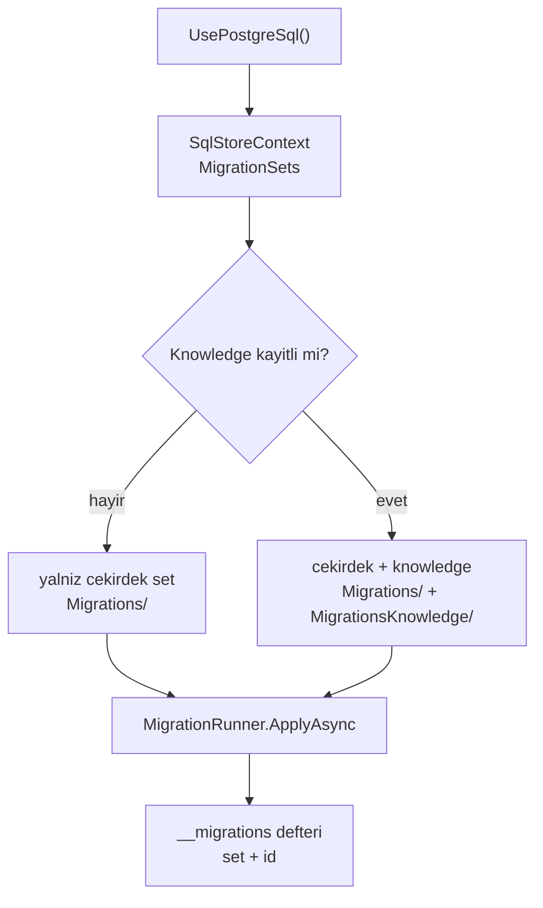

# Faz 67 — İsteğe Bağlı Migration Seti (`pgvector` opt-in)

> **Durum:** 📋 Planlandı (2026-08-18)
> **Kaynak:** [ADAYLAR.md](ADAYLAR.md) · **F-110**
> **Önkoşul:** [Faz 51](51-VEKTOR-BELLEK-VE-RAG.md) — `0024_vector.sql` ve `AgentPrismKnowledgeOptions` oradan gelir
> **Paketler:** `AgentPrism.Sql.Shared`, `AgentPrism.PostgreSql`
> **Yeni paket:** Yok · **Migration:** **yeni migration yok** — var olan bir dosya ayrı bir sete taşınır. 🚨 Tuzak bu fazın tamamıdır, aşağıya bak
> **Public API:** büyüyor (küçük) — `MigrationRunner` ve `SqlStoreContext` set kavramı öğrenir. `PublicAPI.Shipped.txt` bugün **boş** (ölçüldü: 16 pakette toplam 16 satır, her biri yalnız `#nullable enable`) — şimdi bedava
> **Site etkisi:** `getting-started/persistence.md`, `guides/knowledge.md`, `guides/production.md`, `packages.md`, `troubleshooting.md`
> **Manuel test alanı:** [`docs/manuel-test/03-KALICILIK-POSTGRESQL.md`](manuel-test/03-KALICILIK-POSTGRESQL.md)

---

## Bu Faza Başlarken

> `faz-baslangic` skill'ini uygula. Aşağıdaki liste o skill'in 2. adımıdır —
> **tamamını değil, yalnız işaret edilen bölümleri oku.**

1. Bu doküman
2. Kararlar — dosyanın tamamını **okuma**, yalnız bu kalemleri grep'le:
   ```bash
   grep -n "K-391\|K-389\|K-178\|K-183" docs/KARARLAR.md
   ```
   **K-391** (`CREATE EXTENSION vector` veritabanı geneline aittir, eş zamanlı
   ilk migrasyonda `23505` verir — jitter'lı yeniden deneme ile karşılanır),
   **K-389** (migration kilidi şemaya kapsandı), **K-178** (migration numaraları
   sağlayıcı başına bağımsızdır), **K-183** (birden çok SQL sağlayıcısı kaydı).
3. Alan hafızası (bu faz iki alana dokunuyor):
   [`hafiza/postgresql.md`](hafiza/postgresql.md) (extension ve indeks tuzakları) ·
   [`hafiza/sql-saglayicilari.md`](hafiza/sql-saglayicilari.md) (paylaşılan SQL katmanı, `SqlDialect`)
4. Gerektiğinde: [`MIMARI.md`](MIMARI.md) — kalıcılık bölümü

---

## Amaç

Bugün `UsePostgreSql()` çağıran herkes `pgvector` kurmak zorundadır — Knowledge
hiç kullanılmasa bile. Bu faz migration setini ikiye ayırır: **çekirdek** her
zaman koşar, **knowledge** yalnız istendiğinde. Kazanan, uzantı kurma izni
olmayan yönetilen bir PostgreSQL üzerinde çalışan tüketicidir.

- **F-110** — `0024_vector.sql` isteğe bağlı bir sete taşınır; çekirdek set
  `vector` uzantısı olmadan tamamlanır.

### Bugün ne çalışmıyor — doğrulanmış kanıt

| Kanıt | Gözlem |
|---|---|
| [`0024_vector.sql:16`](../src/AgentPrism.PostgreSql/Migrations/0024_vector.sql) | `CREATE EXTENSION IF NOT EXISTS vector;` — koşulsuz |
| [`MigrationDescriptor.cs:37-39`](../src/AgentPrism.Sql.Shared/Migrations/MigrationDescriptor.cs) | `GetManifestResourceNames()` üzerinde tek ölçüt `resourcePrefix`; koşullu set kavramı **yok** |
| `ls src/AgentPrism.PostgreSql/Migrations/*.sql \| wc -l` → **29** | Yirmi dokuzunun hepsi her başlangıçta sıraya girer |
| `grep -ln "document_embeddings\|vector" src/AgentPrism.PostgreSql/Migrations/*.sql` → **yalnız 0024** | Başka hiçbir migration bu tabloya dayanmıyor — taşıma güvenli |
| `ls src/AgentPrism.SqlServer/Migrations/*.sql \| wc -l` → **16**, `grep -l vector` → **boş** | SQL Server ve SQLite'ta vektör migration'ı **yok**. Bu faz **yalnız PostgreSQL** işidir |

> Kanıtlar 2026-08-18 tarihinde doğrulandı.

**İkincil kanıt (K-391):** `CREATE EXTENSION` şemaya değil **veritabanı
geneline** ait bir katalog nesnesidir. Bu, 2026-08-12'de eş zamanlı ilk
migrasyonlarda `pg_extension_name_index` benzersizlik ihlaline yol açtı ve
`ApplyOneAsync`'e jitter'lı yeniden deneme eklenmesiyle karşılandı. Uzantıyı
isteğe bağlı yapmak o yüzeyi de daraltır.

---

## 67.1 — Neden şimdi: pencere kapanıyor

🚨 **Bu fazın aciliyeti teknik değil, zamansaldır.**

Uygulanmış bir migration'ın metni **dokunulmazdır**: `MigrationDescriptor`
SHA-256 sağlamasını ham metnin tamamı üzerinden hesaplar ve uyuşmazlık
başlangıçta sert hata verir. Sıra da öyledir — `__migrations` defterine yazılmış
bir kimlik geri alınamaz.

Bugün **hiçbir tüketici yoktur**: [Faz 7](07-SAGLAMLASTIRMA-VE-YAYIN.md)
beklemededir, `PublicAPI.Shipped.txt` dosyalarının hepsi boştur. Yani hiçbir
üretim veritabanında `0024` uygulanmamıştır ve seti bugün ayırmak **bedavadır**.

İlk yayından sonra aynı iş yapılamaz. Bu, aday listesindeki tek "sonradan
imkânsız" kalemdir.

---

## 67.2 — Tasarım: ayrı set, ayrı defter kaydı



**Üç parça:**

1. **Kaynak ayrımı.** `0024_vector.sql`, `MigrationsKnowledge/0001_vector.sql`
   olarak taşınır ve kendi gömülü kaynak ön ekini alır. Çekirdek sette
   `0024` numarası **boş kalır** — geri dönüştürülmez (K-178'in numara
   disiplininin aynısı).
2. **Defter ayrımı.** `__migrations` tablosuna bir **set** sütunu eklenir;
   varsayılanı `core`. Böylece iki setin numaraları birbirinden bağımsız artar
   ve knowledge seti `0001`'den başlayabilir.
3. **Seçim.** `SqlStoreContext` hangi setlerin etkin olduğunu taşır.
   `MigrationRunner.Discover` tek bir ön ek yerine **etkin setlerin** ön
   eklerini okur.

### Set nasıl etkinleşir

Knowledge seti, `AgentPrismKnowledgeOptions`'ın gerçekten kullanıldığı bir kayıt
varsa etkinleşir. 🚨 **Bugünkü kod bunu ayırt edemez:**
[`AgentPrismServiceCollectionExtensions.cs:128`](../src/AgentPrism.Core/AgentPrismServiceCollectionExtensions.cs)
seçenekleri **her zaman** kaydeder (`AddOptions<AgentPrismKnowledgeOptions>()`),
yani "seçenek var mı" sorusu yanlış sorudur. Ayrı ve açık bir işaret gerekir —
örneğin `UsePostgreSql(o => o.EnableKnowledge = true)` veya Knowledge'ı kayda
sokan çağrının bıraktığı bir işaretçi.

**K1 gereği varsayılan kapalıdır.** Knowledge isteyen tüketici bunu bir satırla
söyler; söylemeyen `vector` uzantısını hiç görmez.

### Reddedilen alternatif — dosya adı ile atlama

`0024_vector.optional.sql` gibi bir ad kuralıyla dosyayı yerinde bırakıp
yürütmeyi atlamak daha ucuzdur. **Önerilmez:** atlanan migration
`GetSnapshotAsync`'in "pending" listesinde sonsuza kadar kalır
([`MigrationRunner.cs:85-89`](../src/AgentPrism.Sql.Shared/Migrations/MigrationRunner.cs)),
[Faz 33](33-SAGLIK-DENETIMI-VE-TESHIS.md) teşhisi kalıcı olarak `Degraded`
görünür ve operatör her başlangıçta yanlış bir uyarı okur. Set kavramı bunu
yapısal olarak çözer.

---

## 67.3 — Geriye dönük uyum

Bu fazın tek uyum sorusu şudur: `0024`'ü **zaten uygulamış** bir veritabanı ne
olur?

Bugün böyle bir veritabanı yalnız geliştirme ve test ortamlarındadır (yayın
yok). Yine de davranış tanımlanmalıdır: knowledge seti etkinken çalışan yeni
kod, eski deftere yazılmış `0024` kaydını görmez ve `MigrationsKnowledge/0001`'i
uygulamaya çalışır. `CREATE EXTENSION IF NOT EXISTS` ve
`CREATE TABLE IF NOT EXISTS` korumaları sayesinde bu **zararsızdır** — ama
sessiz de olmamalıdır.

**Karar plana yazılıyor:** geçiş kodu yazılmaz. Bunun yerine
`MigrationHostedService` eski defterde `0024` görüp knowledge setini boş
bulursa **bir kez bilgi düzeyinde loglar**. Gerekçe: yayın öncesi bir durum için
kalıcı geçiş kodu taşımak, hiç oluşmayacak bir borçtur.

---

## Planlanan Public API

> Taslak imzalardır. Gerçekleşen imzalar kapanışta ayrı bir bölüme yazılır.

```csharp
// AgentPrism.Sql.Shared — SqlDialect
public abstract class SqlDialect
{
    public abstract string MigrationResourcePrefix { get; }

    /// <summary>Optional migration sets keyed by set name. Empty by default.</summary>
    public virtual IReadOnlyDictionary<string, string> OptionalMigrationResourcePrefixes
        => System.Collections.Immutable.ImmutableDictionary<string, string>.Empty;
}

// AgentPrism.Sql.Shared — SqlStoreContext
public sealed class SqlStoreContext
{
    /// <summary>Names of the optional migration sets to apply. Empty by default (K1).</summary>
    public IReadOnlySet<string> EnabledMigrationSets { get; init; }
        = System.Collections.Immutable.ImmutableHashSet<string>.Empty;
}

// AgentPrism.PostgreSql — AgentPrismPostgreSqlOptions
public sealed class AgentPrismPostgreSqlOptions
{
    /// <summary>Applies the knowledge migration set, which requires the pgvector extension. Default false.</summary>
    public bool EnableKnowledge { get; set; }
}
```

### HTTP `endpoint`'leri

Yeni uç yok. `/api/diagnostics` çıktısı **bekleyen migration** listesini
set adıyla birlikte raporlar — alan adı kapanışta belirlenir.

### Arayüz payı

Yok. Arayüze dokunulmuyor.

---

## Planlanan Dosya Listesi

```
src/AgentPrism.Sql.Shared/
├── Internal/
│   └── SqlDialect.cs                      (değişir — opsiyonel set ön ekleri)
├── Migrations/
│   ├── MigrationDescriptor.cs             (değişir — çok ön ekli Discover)
│   ├── MigrationRunner.cs                 (değişir — set seçimi, defter set sütunu)
│   └── MigrationHostedService.cs          (değişir — eski 0024 bilgi logu)
└── SqlStoreContext.cs                     (değişir — EnabledMigrationSets)

src/AgentPrism.PostgreSql/
├── AgentPrismPostgreSqlOptions.cs         (değişir — EnableKnowledge)
├── AgentPrismPostgreSqlBuilderExtensions.cs (değişir — set kaydı)
├── Internal/PostgresDialect.cs            (değişir — knowledge ön eki)
├── Migrations/
│   └── 0024_vector.sql                    (SİLİNİR — taşınır)
└── MigrationsKnowledge/
    └── 0001_vector.sql                    (YENİ — 0024'ün birebir metni)
```

🚨 **`0024_vector.sql`'in metni taşınırken değiştirilmez.** Sağlama ham metnin
tamamını (yorumlar dahil) kapsar; başlık yorumundaki faz atfını düzeltmek bile
sağlamayı değiştirir. Yeni sette bu zararsızdır çünkü set yenidir — ama alışkanlık
tehlikelidir, kural yazılı kalsın.

---

## Hata Modları ve Testler

| Ne bozulabilir | Seviye | Test sınıfı |
|---|---|---|
| Knowledge kapalıyken `vector` uzantısı yine de yaratılır | Fonksiyonel (Testcontainers) | `OptionalMigrationSetTests` |
| Knowledge açıkken `document_embeddings` oluşmaz | Fonksiyonel | `OptionalMigrationSetTests` |
| Uzantı **kurulamayan** rolde çekirdek set yine de tamamlanır | Fonksiyonel (kısıtlı rolle) | `RestrictedRoleMigrationTests` |
| İki set aynı `id`'yi kullanınca defter çakışır | Birim | `MigrationDescriptorTests` |
| Eş zamanlı ilk migrasyonda K-391 yarışı geri gelir | Fonksiyonel (paralel fixture) | mevcut migration fixture'ı ile |
| `GetSnapshotAsync` kapalı setin dosyalarını "pending" sayar | Birim | `MigrationSnapshotTests` |
| Knowledge kapalıyken `search_knowledge` tool'u kaydedilirse ne olur | Fonksiyonel | `KnowledgeDisabledTests` — **açık ve anlaşılır hata**, `DbException` değil |
| SQL Server / SQLite yolu etkilenir | Sözleşme | mevcut `tests/Shared/Contracts/` koşumu değişmeden geçmeli |

**Beş soru:** iptal — migration yolu iptal edilebilir olmalı (mevcut davranış
korunur) · eşzamanlılık — K-391 yarışı, paralel fixture ile · boş/aşırı girdi —
tanımsız set adı **başlangıç hatası** olmalı · başka kiracı — bu faz kiracıya
dokunmaz · alt sistem hatası — uzantı yoksa çekirdek set **yine de** tamamlanır.

---

## Manuel Kabul Case'leri

| # | Ön koşul | Adımlar | Beklenen sonuç |
|---|---|---|---|
| 1 | `pgvector` **kurulu olmayan** PostgreSQL | `UsePostgreSql(...)`, `EnableKnowledge` verilmez → uygulamayı başlat | Uygulama açılır; `/api/diagnostics` `Healthy`; `\dx` çıktısında `vector` **yok** |
| 2 | Aynı ortam | `EnableKnowledge = true` ile başlat | Başlangıçta **açık ve okunur** bir hata: uzantı yok. `DbException` yığın izi kullanıcıya gitmez |
| 3 | `pgvector` kurulu PostgreSQL | `EnableKnowledge = true` → başlat → `search_knowledge` ile bir sorgu | `document_embeddings` oluşur, arama sonuç döner |
| 4 | Case 1'in veritabanı | Sonradan `EnableKnowledge = true` ile yeniden başlat | Knowledge seti o anda uygulanır; çekirdek set yeniden koşmaz |
| 5 | SQL Server ve SQLite | Değişiklik sonrası tam sözleşme koşumu | 👤 Fark yok — iki sağlayıcıda vektör migration'ı zaten yoktu |

---

## Açık Sorular

| # | Soru | Seçenekler | Öneri |
|---|---|---|---|
| 1 | Set nasıl etkinleşir? | A: `AgentPrismPostgreSqlOptions.EnableKnowledge` · B: Knowledge kaydı yapan çağrının bıraktığı işaretçi | **A** — açık, okunabilir ve K1 ile uyumlu. B "sihirli" davranır ve `AddOptions` her zaman kayıtlı olduğu için bugün ayırt edilemez |
| 2 | Defter set sütunu nasıl gelir? | A: `__migrations`'a sütun ekleyen bir çekirdek migration · B: set adını `id`'ye önek yapmak | **A** — B, `id`'yi tamsayı olmaktan çıkarır ve `Discover`'ın ayrıştırıcısını bozar |
| 3 | Çekirdek sette `0024` boşluğu kalsın mı? | A: boş kalsın · B: sonraki dosyalar kaydırılsın | **A** — B uygulanmış defterleri geçersiz kılar ve K-178'in numara disiplinini bozar |
| 4 | Knowledge kapalıyken vektör tool'u ve `IVectorSearchStore` nasıl davranır? | A: kayıt olmaz · B: kayıt olur, çağrıda hata verir | **A** — K1: sürpriz yok. Ama `UseUI()` kataloğunda tool'un neden görünmediği anlaşılır olmalı |

---

## Bitiş Ölçütleri (DoD)

- [ ] `pgvector` **olmayan** bir PostgreSQL üzerinde `UsePostgreSql()` ile
      uygulama açılır ve `/api/diagnostics` `Healthy` döner
- [ ] `EnableKnowledge = true` ve uzantı yokken **okunur** bir başlangıç hatası
      verilir (mesaj belgeye yazılır)
- [ ] `\dx` çıktısı knowledge kapalıyken `vector` içermez
- [ ] SQL Server ve SQLite sözleşme koşumları değişmeden geçer
- [ ] Dört doğrulama kapısı sıfır uyarı verir
- [ ] `samples/AgentPrism.Api` ile gerçek `run` yapıldı, çıktı belgeye yazıldı
- [ ] `secret` taraması boş döndü
- [ ] Manuel kabul case'leri
      [`docs/manuel-test/03-KALICILIK-POSTGRESQL.md`](manuel-test/03-KALICILIK-POSTGRESQL.md)
      içine eklendi; otomatikleştirilebilenler koşuldu
- [ ] `faz-denetim` koşuldu; 🔴 bulgu kalmadı
- [ ] `docs-site/` güncellendi (beş sayfa); `npm run build` + `check-links.mjs` temiz

### Doğrulama komutları

```bash
# Uzantı gerçekten yaratılmamış mı
psql "$CONN" -c '\dx' | grep -c vector      # beklenen: 0

# Bekleyen migration listesi kapalı setin dosyalarını içermemeli
curl -s http://localhost:5081/agentprism/api/diagnostics | jq '.persistence'
```

---

## Riskler

| Risk | Önlem |
|------|-------|
| Taşınan dosyanın metni kazara değişir → sağlama kayar | Taşıma `git mv` ile; `sha256sum` taşımadan önce ve sonra karşılaştırılır ve çıktı kapanış notuna yazılır |
| Defter sütunu eklemek var olan geliştirme veritabanlarını bozar | Sütun `NOT NULL DEFAULT 'core'` gelir; var olan satırlar çekirdek sayılır |
| K-391 yarışı yeni sette tekrar eder | `ApplyOneAsync`'in jitter'lı yeniden denemesi korunur; test fixture'ının uzantıyı önceden kurma davranışı **silinmez** |
| Knowledge kapalıyken RAG sessizce çalışmaz görünür | Açık Soru 4'ün kararı DoD'ye bağlanır; katalogda tool'un yokluğu açıklanır |
| Bu faz Faz 7'den sonraya kalır | 🚨 Kalırsa kalem **iptal edilir**, ertelenmez. Uygulanmış migration geri alınamaz — plan bunu peşinen söyler |

---

<!-- ============================================================
     AŞAĞISI KAPANIŞTA DOLDURULUR — `faz-tamamlama` skill'i.
     Plan anında boş kalır. Başlıkları SİLME.
     ============================================================ -->

## Plandan Sapmalar

> Kapanışta doldurulur.

## Bu Fazda Verilen Kararlar

> Kapanışta doldurulur. K-NNN numaraları burada alınır; plan numara rezerve etmez.

## Gerçekleşen Public API

> Kapanışta doldurulur.

## Dosya Listesi (gerçekleşen)

> Kapanışta doldurulur.

## Denetim Bulguları

> Kapanışta doldurulur.

## Sonraki Faza Devir Notu

> Kapanışta doldurulur.
