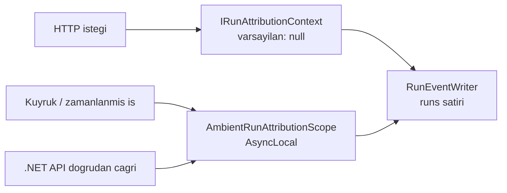

# Faz 68 — Çalıştırma Kimliği ve Token Kırılımı

> **Durum:** ✅ Tamamlandı (2026-08-19)
> **Kaynak:** [ADAYLAR.md](ADAYLAR.md) · **F-111**, **F-112**
> **Önkoşul:** [Faz 20](20-MALIYET-VE-GOSTERGE-PANELI.md) — maliyet hesabı ve gösterge paneli · [Faz 41](41-KIRACI-YALITIMININ-ZORLANMASI.md) — kiracı yalıtımı sözleşmesi
> **Paketler:** `AgentPrism.Abstractions`, `AgentPrism.Core`, `AgentPrism.Sql.Shared`, `AgentPrism.PostgreSql`, `AgentPrism.SqlServer`, `AgentPrism.Sqlite`, `AgentPrism.AspNetCore`, `AgentPrism.UI`
> **Yeni paket:** Yok · **Migration:** **gerekli — üç set** (`runs` tablosuna sütunlar). Numara uygulama anında alınır (K-178)
> **Public API:** **büyüyor — dört `sealed record` birden.** `RunRecord`, `RunStartInfo`, `RunUsage`, `RunCost` ve iki istatistik tipi. `PublicAPI.Shipped.txt` bugün **boş** (ölçüldü: 16 satır, hepsi `#nullable enable`) — şimdi bedava, Faz 7'den sonra F-50 dışında en pahalı değişiklik
> **Site etkisi:** `concepts/runs.md`, `guides/observability.md`, `reference/configuration.md`, `concepts/governance.md`
> **Manuel test alanı:** [`docs/manuel-test/12-GOZLEMLENEBILIRLIK-MALIYET.md`](manuel-test/12-GOZLEMLENEBILIRLIK-MALIYET.md)

---

## Bu Faza Başlarken

> `faz-baslangic` skill'ini uygula. Aşağıdaki liste o skill'in 2. adımıdır —
> **tamamını değil, yalnız işaret edilen bölümleri oku.**

1. Bu doküman
2. Kararlar — dosyanın tamamını **okuma**, yalnız bu kalemleri grep'le:
   ```bash
   grep -n "K-032\|K-027\|K-055\|K-178\|K-398\|K-394" docs/KARARLAR.md
   ```
   **K-032** (yerleşik model listesi yok; fiyat yapılandırmadan gelir),
   **K-027** (`jsonb` ile `json` ayrımı), **K-055** (OTel toplama `ActivityListener` ile),
   **K-178** (migration numaraları sağlayıcı başına), **K-398** (erken `DisposeAsync`'te
   kısmi `usage` yazılır), **K-394** (workflow'un tamamı tek `run` olarak kotaya yazılır).
3. Alan hafızası (bu faz üç alana dokunuyor):
   [`hafiza/cekirdek-calistirma.md`](hafiza/cekirdek-calistirma.md) (`RunRecording` zinciri, metrik) ·
   [`hafiza/sql-saglayicilari.md`](hafiza/sql-saglayicilari.md) (üç sağlayıcı, paylaşılan katman) ·
   [`hafiza/frontend.md`](hafiza/frontend.md) (sözlük, bundle bütçesi)
4. Gerektiğinde: [`MIMARI.md`](MIMARI.md) — veri modeli ve gözlemlenebilirlik bölümleri

---

## Amaç

AgentPrism bugün "hangi kiracı ne harcadı" sorusunu cevaplıyor. "Hangi
**kullanıcı**" ve "hangi **iş**" sorularını cevaplayamıyor. Aynı şekilde token
sayacı üç alandır; prompt caching'in kazancı ve reasoning token'ının payı
görünmüyor. Bu faz ikisini birlikte kapatır — ikisi de aynı `runs` satırına
yazılır ve ayrı planlanırsa aynı tabloya iki migration gider.

- **F-111** — çalıştırmaya kullanıcı kimliği ve etiket; kırılımın bu boyutlara açılması.
- **F-112** — cache ve reasoning token'larının ayrı kaydı ve ayrı fiyatlanması.

### Bugün ne çalışmıyor — doğrulanmış kanıt

| Kanıt | Gözlem |
|---|---|
| `grep -rn "UserId" src --include="*.cs" \| wc -l` → **0** | Kod tabanında kullanıcı kimliği kavramı **yok** |
| [`RunRecord.cs:14,35,38`](../src/AgentPrism.Abstractions/Runs/RunRecord.cs) | Yalnız `AgentName`, `TenantId`, `SessionId` |
| [`RunStatistics.cs:10-25`](../src/AgentPrism.Abstractions/Runs/RunStatistics.cs) | `RunStatisticsQuery` yalnız `AgentName` + `TenantId` + `StartedAfter` ile filtreler |
| [`0001_initial.sql:133-148`](../src/AgentPrism.PostgreSql/Migrations/0001_initial.sql) | `runs` tablosunda kullanıcı ve etiket sütunu yok |
| [`RunSupportTypes.cs:9,12,15`](../src/AgentPrism.Abstractions/Runs/RunSupportTypes.cs) | `RunUsage` üç alan: input · output · total |
| [`RunRecordingAgent.cs:1056-1063`](../src/AgentPrism.Core/Recording/RunRecordingAgent.cs) | `ToRunUsage` `UsageDetails`'ten yalnız üç sayacı alır; gerisi **atılır** |
| `Microsoft.Extensions.AI.Abstractions` **10.8.3** (repo'nun sabitlediği sürüm) | `UsageDetails` on üye taşır: `CachedInputTokenCount`, `ReasoningTokenCount`, `InputAudioTokenCount`, `InputTextTokenCount`, `OutputAudioTokenCount`, `OutputTextTokenCount`, `AdditionalCounts` |

> Kanıtlar 2026-08-18 tarihinde doğrulandı.

🚨 **Fiyatlandırma bugün yanlış yönde sapıyor.** `UsageDetails` sözleşme
dokümanı şunu yazar: *"Cached input tokens should be counted as part of
`InputTokenCount`."* `IRunPricingResolver` tüm girdiyi tam fiyattan hesapladığı
için, prompt caching açık bir agent'ın maliyeti **olduğundan yüksek**
raporlanır. Sapmanın büyüklüğü sağlayıcı fiyatına bağlıdır ve **ölçülmedi**.

---

## 68.1 — Kullanıcı kimliği güvenilir bir kaynaktan gelir

🚨 **Kullanıcı kimliği istek gövdesinden alınmaz.** `AgentRunRequest`'e bir
`UserId` alanı eklemek, herhangi bir istemcinin başka bir kullanıcı adına
harcama yazdırabilmesi demektir — maliyet kaydını doğrudan sahteleştirir.

Çözüm, kiracıda zaten kullanılan desendir:



- **`IRunAttributionContext`** — `ITenantContext`'in kardeşi. `TryAdd` ile
  kaydedilir, varsayılan uygulama **`null` döner** (K1: sürpriz yok, K4:
  tüketicinin kaydı kazanır). Tüketici bunu kendi kimlik hattına bağlar.
- **`AmbientRunAttributionScope`** — `AmbientTenantScope`'un birebir eşleniği;
  HTTP dışı yollar (kuyruk, zamanlanmış iş, alt `run`) için.

🚨 **`AsyncLocal` tuzağı bu fazda geçerlidir.** MEMORY'de dört kez kayıtlıdır:
`AsyncLocal` yazımı **çağırana geri akmaz**. Kapsam, kaydı yazan metodun
**kendi gövdesinde** açılır; akışlı yolda **her `MoveNextAsync` öncesi**
tekrarlanır. `AmbientTenantScope`'un bugünkü kullanım noktaları örnek alınmalıdır.

### Etiketler

Etiket, kullanıcı kimliğinden farklı bir sorudur: "bu `run` hangi **iş** için
yapıldı". Sözleşme küçük bir `string`→`string` sözlüğüdür ve `jsonb` bir sütuna
yazılır (K-027: düz sözlük için `jsonb` doğrudur, kazanç indekslenebilirliktir).

**Sınırlar plana yazılıyor:**

| Sınır | Değer | Neden |
|---|---|---|
| En çok etiket | 8 | Kardinalite kontrolü |
| Anahtar uzunluğu | 64 | Sorgu boyutu olarak kullanılabilir kalsın |
| Değer uzunluğu | 256 | Serbest metin deposu değildir |
| Aşımda davranış | İstek **reddedilir** | Sessiz kırpma veriyi bozar |

🚨 **Etiketler metrik etiketi DEĞİLDİR.** `agentprism.tokens` ve
`agentprism.run.cost` metriklerine eklenmezler. Serbest bir etiket kümesini
metrik boyutuna çevirmek zaman serisi kardinalitesini patlatır. Etiketler
yalnız **sorgu boyutudur** — `runs` tablosunda yaşar, `Meter`'da değil.
Aynı kural kullanıcı kimliği için de geçerlidir.

### Kişisel veri duruşu

**AgentPrism kişisel kimlik saklamaz.** `UserId` alanı **opak bir dizedir** ve
anlamını tüketici verir; AgentPrism onu ne çözer ne doğrular. Bu duruş
[Faz 64](64-DENETIM-ZINCIRI-VE-VERI-KONUSU-HAKLARI.md)'ün `IDataSubjectResolver`
kararıyla birebir aynıdır ve o fazın veri konusu silme akışı bu sütunu da
kapsamalıdır — iki faz aynı sırayla planlanmışsa 68 önce gelmelidir.

---

## 68.2 — Token kırılımı ve fiyat

`RunUsage` üç yeni alan alır. Sözleşme kuralı MEAI'den birebir devralınır:

| Alan | Nerede sayılır | Fiyat |
|---|---|---|
| `CachedInputTokens` | `InputTokens`'ın **içinde** | Cache okuma birim fiyatı |
| `ReasoningTokens` | `OutputTokens`'ın **içinde** | Bugün çıkış fiyatı; ayrı fiyat tanımlanabilir |
| `AudioInputTokens` / `AudioOutputTokens` | İlgili toplamın içinde | Ayrı birim fiyat |

Fiyat hesabı bu yüzden **çıkarmalı** olur:

```
tam_fiyatli_girdi = InputTokens - (CachedInputTokens ?? 0)
maliyet           = tam_fiyatli_girdi × girdi_fiyati
                  + (CachedInputTokens ?? 0) × cache_okuma_fiyati
                  + OutputTokens × cikti_fiyati
```

🚨 **İki kural bozulmaz:**

1. **Eksik bilgi `null` kalır, sıfır olmaz.** Bir sağlayıcı
   `CachedInputTokenCount` doldurmuyorsa alan `null`'dır ve fiyat bugünkü gibi
   tüm girdiyi tam fiyattan hesaplar. Sıfır yazmak "cache hiç kullanılmadı"
   demektir ve bu bir **iddiadır** — ölçüm değil.
2. **Cache fiyatı tanımsızsa maliyet `Unknown`'a düşmez.** Cache fiyatı yoksa
   cache token'ı normal girdi fiyatından hesaplanır ve sonuç bugünküyle aynı
   kalır. `PricingSource.Unknown` yalnız **model fiyatı** yokken kullanılır —
   var olan davranış korunur.

### Toplama noktaları

`RunUsage` üç yerde toplanıyor ve üçü de yeni alanları taşımalıdır:
`MergeUsage` ([`RunRecordingAgent.cs:1050`](../src/AgentPrism.Core/Recording/RunRecordingAgent.cs)),
`CompactionUsageAccumulator` ve `TreeUsage` (alt `run` ağacı).

🚨 **İmza değiştirmek ile gövdeyi kullanmak iki ayrı adımdır.** Faz 20'de
`RunEventWriter.CompleteAsync`'e `cost` parametresi eklendi ama nesne
başlatıcıya yazılmadı ve **1068 test yakalamadı**. Bu fazda dört yeni alan ×
üç toplama noktası vardır; `faz-uygulama` Adım 4'ün imza-gövde kontrol listesi
zorunludur.

---

## 68.3 — Kırılımın açılması

Yeni boyutlar üç yüzeyde görünür:

| Yüzey | Ne değişir |
|---|---|
| `RunStatisticsQuery` | `UserId` ve etiket filtreleri |
| `RunStatistics` | Kullanıcı kırılımı ve etiket kırılımı; `MaxAgents`'in eşleniği sınırlar |
| `GET /api/runs` | `userId` ve `label` sorgu parametreleri |
| Arayüz | Run listesinde filtre; gösterge panelinde token kırılım çubuğu |

**Arayüz payı:** Yeni bir grafik kütüphanesi **girmez**. Kırılım çubuğu var olan
bileşenlerle çizilir. Bugünkü bundle ölçüldü — `index-*.js.br` **140.614 B**,
`index-*.css.br` **5.490 B**; bütçe 250 KB gzip. Fazın payı kapanışta ölçülüp
yazılır.

**Yeni ekran metni** `locales/en.ts` **ve** `tr.ts` içine girer; eksik anahtar
derleme hatasıdır (K-228).

---

## Planlanan Public API

> Taslak imzalardır. Gerçekleşen imzalar kapanışta ayrı bir bölüme yazılır.

```csharp
// AgentPrism.Abstractions
/// <summary>Resolves who a run belongs to. Returns null by default.</summary>
public interface IRunAttributionContext
{
    string? UserId { get; }
    IReadOnlyDictionary<string, string>? Labels { get; }
}

public static class AmbientRunAttributionScope
{
    public static string? CurrentUserId { get; }
    public static IReadOnlyDictionary<string, string>? CurrentLabels { get; }
    public static IDisposable Begin(string? userId, IReadOnlyDictionary<string, string>? labels);
}

public sealed record RunUsage
{
    public long? InputTokens { get; init; }
    public long? OutputTokens { get; init; }
    public long? TotalTokens { get; init; }

    /// <summary>Cached input tokens. Counted INSIDE InputTokens. Null when the provider does not report it.</summary>
    public long? CachedInputTokens { get; init; }

    /// <summary>Reasoning tokens. Counted INSIDE OutputTokens.</summary>
    public long? ReasoningTokens { get; init; }

    public long? AudioInputTokens { get; init; }
    public long? AudioOutputTokens { get; init; }
}

public sealed record RunCost
{
    public decimal? InputCost { get; init; }
    public decimal? OutputCost { get; init; }
    public decimal? CachedInputCost { get; init; }
    public string? Currency { get; init; }
    public required PricingSource Source { get; init; }
}

public sealed record RunRecord
{
    public string? UserId { get; init; }
    public IReadOnlyDictionary<string, string>? Labels { get; init; }
}
```

### HTTP `endpoint`'leri

| Metot | Yol | Rol | Ne yapar |
|---|---|---|---|
| `GET` | `/api/runs?userId=&label=k:v` | Reader | Yeni boyutlarla filtreler |
| `GET` | `/api/stats?userId=&label=k:v` | Reader | Süzer; `byUser`/`byLabel` **her zaman** döner (K-485 — `groupBy` eklenmedi) |

🚨 `POST /api/agents/{name}/run` gövdesi **değişmez**. Kullanıcı kimliği
istemciden alınmaz.

### Arayüz payı

Ölçülecek. Yeni bağımlılık yok; bugünkü toplam 146.104 B brotli
(140.614 + 5.490), bütçe 250 KB gzip.

---

## Planlanan Dosya Listesi

```
src/AgentPrism.Abstractions/Runs/
├── RunSupportTypes.cs                  (değişir — RunUsage, RunCost)
├── RunRecord.cs                        (değişir — UserId, Labels)
├── RunStatistics.cs                    (değişir — sorgu ve kırılım)
├── IRunAttributionContext.cs           (YENİ)
└── AmbientRunAttributionScope.cs       (YENİ)

src/AgentPrism.Core/
├── Recording/RunRecordingAgent.cs      (değişir — ToRunUsage, MergeUsage, kayıt)
├── Recording/RunEventWriter.cs         (değişir — yeni sütunlar)
├── Recording/CompactionUsageAccumulator.cs (değişir)
├── Models/RunPricingResolver.cs        (değişir — çıkarmalı hesap)
└── Runs/DefaultRunAttributionContext.cs (YENİ — null döner)

src/AgentPrism.Sql.Shared/Stores/SqlRunStore.cs   (değişir)
src/AgentPrism.{PostgreSql,SqlServer,Sqlite}/Migrations/NNNN_run_attribution.sql (YENİ ×3)
src/AgentPrism.AspNetCore/                        (filtreler, sözleşme)
src/AgentPrism.UI/                                (filtre + kırılım çubuğu + locales)
```

---

## Hata Modları ve Testler

| Ne bozulabilir | Seviye | Test sınıfı |
|---|---|---|
| `UserId` istek gövdesinden set edilebilir | Fonksiyonel (HTTP) | `RunAttributionSpoofingTests` |
| Başka kiracının kullanıcı kırılımı görünür | Sözleşme (`TenantIsolationContract`) | dört koşumda birden |
| Yeni alan `MergeUsage`'da düşer (alt `run` ağacı) | Fonksiyonel | `RunTreeUsageTests` |
| Yeni alan `CompactionUsageAccumulator`'da düşer | Birim | `CompactionUsageTests` |
| Akışlı yolda `AsyncLocal` kapsamı kaybolur | Fonksiyonel (SSE) | `AmbientAttributionStreamingTests` |
| Sağlayıcı cache token'ı bildirmiyor → alan `0` yazılır | Birim | `RunUsageMappingTests` |
| Cache fiyatı tanımsızken maliyet `Unknown`'a düşer | Birim | `PricingResolverCacheTests` |
| Etiket sayısı/uzunluğu sınırı aşılınca sessiz kırpılır | Fonksiyonel (HTTP) | `RunLabelValidationTests` |
| Etiket metrik boyutuna sızar → kardinalite patlar | Birim | `TelemetryTagTests` — metrik etiket kümesi **sabitlenir** |
| Erken `DisposeAsync`'te kısmi kırılım yazılmaz (K-398) | Fonksiyonel | mevcut K-398 testi genişletilir |
| Üç sağlayıcıda sütun tipi ayrışır | Sözleşme | `tests/Shared/Contracts/` |
| `jsonb` etiket sorgusu SQLite'ta çalışmaz | Sözleşme | üç sağlayıcı + bellek |

**Beş soru:** iptal — iptal edilen `run` kısmi kırılımı yazar (K-398) ·
eşzamanlılık — aynı kullanıcının paralel `run`'ları · boş/aşırı girdi — etiket
sınırları · başka kiracı — sözleşme testi · alt sistem hatası — kayıt yazımı
düşerse `run` **devam eder** (var olan kural).

---

## Manuel Kabul Case'leri

| # | Ön koşul | Adımlar | Beklenen sonuç |
|---|---|---|---|
| 1 | `IRunAttributionContext` kayıtlı değil | Bir `run` çalıştır | `run` başarılı; `user_id` ve etiket `NULL`. Hiçbir davranış değişmez |
| 2 | Kimlik hattına bağlı bir uygulama | İki farklı kullanıcıyla birer `run` | `GET /api/stats`'ın `byUser` alanı iki satır döner, toplamları doğru |
| 3 | Aynı ortam | `POST .../run` gövdesine `userId` alanı eklenerek istek | Alan **yok sayılır**; kayıt kimlik hattındaki kullanıcıyı gösterir |
| 4 | Prompt caching açık Anthropic agent'ı | Aynı uzun ön ekle iki `run` | İkinci `run`'da `CachedInputTokens > 0`; maliyet birinciden **düşük** |
| 5 | Cache fiyatı tanımsız | Aynı senaryo | Maliyet bugünküyle aynı; `PricingSource` `Unknown` **değil** |
| 6 | Dokuz etiketli istek | `run` gönder | `400`; mesaj sınırı söyler |
| 7 | Alt agent çağıran bir agent | Bir `run` | `TreeUsage` kırılımı alt `run`'ların cache token'ını da toplar |
| 8 | Arayüz | Run listesinde kullanıcıya göre filtrele | 👤 Liste daralır; gösterge panelinde kırılım çubuğu görünür |

---

## Açık Sorular

| # | Soru | Seçenekler | Öneri |
|---|---|---|---|
| 1 | Etiketler ayrı tabloya mı `jsonb` sütuna mı? | A: `jsonb` sütun · B: `run_labels` tablosu | **A** — K-027 düz sözlük için `jsonb` diyor; sekiz etiket sınırıyla ayrı tablo aşırıdır. B'nin tek üstünlüğü indeksleme ve `jsonb` GIN indeksi bunu zaten verir |
| 2 | Reasoning token'ı ayrı fiyatlansın mı? | A: bugün çıkış fiyatı, alan ileriye açık · B: hemen ayrı fiyat alanı | **A** — sağlayıcıların çoğu bugün ayrı fiyatlamıyor; ölçülmemiş bir ayrım için fiyat şeması büyütülmez (K-032 çizgisi) |
| 3 | Ses token'ları bu fazda mı? | A: alanlar eklensin, fiyat sonra · B: tamamen kapsam dışı | **A** — aynı `record`'a ikinci kez dokunmak Faz 7'den sonra kırıcıdır; alanı şimdi açmak bedava |
| 4 | Kullanıcı kırılımında kaç satır dönsün? | A: `MaxAgents` gibi sabit tavan · B: sayfalama | **A** — istatistik ucu özet döner; sayfalama `GET /api/runs`'un işidir |

---

## Bitiş Ölçütleri (DoD)

Hepsi gerçek ölçümle karşılandı; kanıtlar örnek uygulamada **gerçek OpenAI
çağrılarıyla** ve gerçek PostgreSQL'e karşı alındı.

- [x] `IRunAttributionContext` kayıtlı değilken hiçbir davranış değişmez;
      `user_id` ve etiket `NULL` yazılır — `Nothing_changes_when_no_attribution_context_is_registered`
      + sözleşme testi `A_run_without_attribution_reads_back_as_null_not_as_an_empty_map`
- [x] İstek gövdesine konan `userId` **yok sayılır** — gerçek çağrı:
      `{"message":"...","userId":"ATTACKER"}` → kayıt `userId: "ada"`.
      Test: `A_userId_in_the_request_body_is_ignored` (+ tersi yönü de)
- [x] `GET /api/stats` `byUser`/`byLabel` kırılımını doğru toplamlarla döner
      (`groupBy` eklenmedi — K-485). Gerçek çıktı:
      `byUser: [('ada',2,108), ('grace',1,47)]`,
      `byLabel: [('team','payments',2), ('team','billing',1), ('ticket','OPS-1',1)]`
- [x] Cache token'ı bildiren bir sağlayıcıda maliyet, cache oranı uygulanarak
      hesaplanır — **gerçek OpenAI prompt cache isabeti** (aşağıdaki komut ve çıktı)
- [x] Cache token'ı bildirmeyen sağlayıcıda alan `null` kalır — **sıfır değil**.
      Gerçek çıktı aynı satırda ikisini birden gösteriyor:
      `cachedInputTokens: 0` (bildirildi) yanında `audioInputTokens: null` (bildirilmedi)
- [x] Etiket sınırı aşımı `400` verir — gerçek çıktı:
      `"The run carries 9 labels; at most 8 are allowed."`, `totalRuns` **değişmedi**
- [x] Metrik etiket kümesi değişmedi — `TelemetryTagTests` üç testle sabitliyor
- [x] Üç SQL sağlayıcısı + bellek içi sözleşme koşumları geçer —
      SQLite 570 · PostgreSQL 1114 (bellek içi dâhil) · SQL Server 556, hepsi yeşil
- [x] Dört doğrulama kapısı sıfır uyarı verir — build ✅ (0 uyarı, 0 hata) · test **4248/0** ✅ ·
      pack ✅ (0 hata, 0 uyarı) · format ✅
- [x] `samples/AgentPrism.Api` ile gerçek `run` yapıldı, çıktı belgeye yazıldı
- [x] `secret` taraması boş döndü (eşleşmeler faz öncesinden gelen yer tutucu
      yorum satırları; gerçek değer yok)
- [x] Manuel kabul case'leri `docs/manuel-test/12-GOZLEMLENEBILIRLIK-MALIYET.md`
      içine eklendi (**MT-OBS-037…045**); 👤 işaretli olan biri dışında hepsi koşuldu
- [x] `faz-denetim` koşuldu; **dört 🔴 bulgu üretildi ve dördü de kapatıldı**
- [x] `docs-site/` güncellendi (`concepts/runs.md`, `concepts/governance.md`,
      `guides/observability.md`, `reference/configuration.md`)
- [x] `en.ts` ve `tr.ts` eksiksiz; bundle payı ölçüldü ve yazıldı

### Ölçülen bundle payı

| | Faz öncesi | Faz sonrası | Fark |
|---|---:|---:|---:|
| `index-*.js.br` | 140.614 B | 145.822 B | +5.208 B |
| `index-*.css.br` | 5.490 B | 5.497 B | +7 B |
| **Toplam brotli** | **146.104 B** | **151.319 B** | **+5.215 B** |

Bütçe 250 KB gzip; derleme `172,2 KB gzipped (budget 250 KB)` raporladı. Yeni
bağımlılık **alınmadı** — kırılım çubuğu var olan bileşenlerle çizildi.

### Doğrulama komutları ve gerçek çıktılar

```bash
# Kullanıcı ve etiket kırılımı
curl -s "http://localhost:5080/agentprism/api/stats" | jq '.byUser, .byLabel'
# byUser  : ada 2 run / 108 token · grace 1 run / 47 token
# byLabel : team=payments 2 · team=billing 1 · ticket=OPS-1 1
#           (toplam 4 > 3 atıflı run — etiket kümesi run'ları BÖLÜMLEMEZ)

# Süzgeçler
?userId=ada -> 2 · ?userId=grace -> 1
?label=team:payments -> 2 · ?label=team:billing -> 1 · ?label=team -> 3

# Cache token'ı gerçekten ayrı yazılmış mı
curl -s "http://localhost:5080/agentprism/api/runs?take=1" | jq '.[0].usage'
# { inputTokens: 39, outputTokens: 20, totalTokens: 59,
#   cachedInputTokens: 0, reasoningTokens: 0,        <- sağlayıcı BİLDİRDİ (0 bir ölçümdür)
#   audioInputTokens: null, audioOutputTokens: null } <- sağlayıcı HİÇ bildirmedi
```

**Gerçek prompt cache isabeti** — aynı ~2560 token'lık ön ek iki kez, fiyatlar
`Input=0.25 / Output=2 / CachedInput=0.025`:

```
1. run (soğuk): input=2560 cached=0     -> inputCost=0.00064   cachedCost=0
2. run (sıcak): input=2560 cached=2304  -> inputCost=6.4e-05   cachedCost=5.76e-05
```

`(2560−2304) × 0.25/1e6 = 6,4e-05` ve `2304 × 0.025/1e6 = 5,76e-05` — çıkarmalı
hesap birebir tutuyor; ikinci `run` yaklaşık **3,9 kat ucuz**.

**Aynı senaryo, `CachedInput` ayarı KALDIRILARAK** (DoD "cache fiyatı tanımsız"):

```
input=2560 cached=2304 -> inputCost=0.00064  (girdinin TAMAMI tam fiyattan)
                          cachedInputCost=null
                          source=Configuration   <- `Unknown` DEĞİL
```

Faz öncesiyle birebir aynı değer; eksik cache oranı ile eksik model fiyatı iki
ayrı arıza olarak ayrık kaldı.

## Riskler

| Risk | Önlem |
|------|-------|
| Dört yeni alan üç toplama noktasının birinde düşer | `faz-uygulama` Adım 4 imza-gövde listesi; `RunTreeUsageTests` ve `CompactionUsageTests` zorunlu |
| Etiketler metrik boyutuna sızar | Metrik etiket kümesini **sabitleyen** bir birim testi DoD'de |
| `AsyncLocal` kapsamı akışlı yolda kaybolur | MEMORY'deki dört vaka okunur; `AmbientTenantScope` kullanım noktaları örnek alınır |
| `UserId` kişisel veri sorumluluğu doğurur | Alan opaktır; Faz 64 silme akışı bu sütunu kapsayacak şekilde planlanır |
| Cache hesabı çıkarmalı olduğu için negatife düşebilir | `InputTokens < CachedInputTokens` durumu **veri hatasıdır**: kırpma yapılmaz, uyarı loglanır ve tam fiyat uygulanır |
| Faz 7'den sonraya kalır | Dört `record` birden kırıcı olur; F-50 dışında en pahalı kalem — sıralamada öne alınmalı |

---

<!-- ============================================================
     AŞAĞISI KAPANIŞTA DOLDURULUR — `faz-tamamlama` skill'i.
     Plan anında boş kalır. Başlıkları SİLME.
     ============================================================ -->

## Plandan Sapmalar

| # | Plan ne diyordu | Ne yapıldı | Gerekçe |
|---|---|---|---|
| 1 | `GET /api/stats?groupBy=user\|label` | `groupBy` **eklenmedi**; `byUser`/`byLabel` her zaman döner, `userId`/`label` ise **özetin tamamını** daraltır | K-485. `ByAgent`/`ByModel`/`ByVersion`/`ByErrorClass`'ın hiçbiri koşullu değil ve `SqlRunStore.GetStatisticsAsync` sonuç kümelerini **konuma göre** okuyor; kümeleri koşullu yapmak o okuyucuyu kırılgan hâle getirirdi |
| 2 | Plan `RunStartInfo` üretim noktalarını saymamıştı | **Beş** üretim noktası bulundu (`RunRecordingAgent`, `AgentEndpoints`, `ApprovalEndpoints`, `WorkflowRunner`, `InboundTriggerDispatcher`) ve her biri elle izlendi | `faz-uygulama` Adım 4. Kuyruğa alınan `run` yolu attribution'ı **kaybediyordu** → UPSERT'te `COALESCE` koruması (K-486) |
| 3 | Ses alanları "bedava" sayılıyordu | `InputAudioTokenCount`/`OutputAudioTokenCount` MEAI 10.8.3'te **`[Experimental]`** çıktı (`MEAI001` → hata) | K-484. Bastırma iki `return` deyimine daraltıldı ve `UsageBreakdown` içinde toplandı |
| 4 | Plan yalnız `RunUsage`/`RunCost`/`RunRecord`/istatistik tiplerini listeliyordu | `RunCost.Total()`/`RunTreeCost.Total()` ve `RunAttributionReader` **plan dışı** eklendi | Denetim 🔴#1/#2/#4'ün kök nedeni: elle yazılmış iki terimli maliyet toplamları ve iki ayrı attribution okuması. Tek bir doğruluk kaynağı sınıfın tamamını kapatır |
| 5 | Plan `RunStatistics`'e yalnız kırılım ekliyordu | `CachedInputTokens`/`ReasoningTokens`/`AudioInputTokens`/`AudioOutputTokens` toplamları da eklendi | Gösterge panelindeki kırılım çubuğu bu dört sayaç olmadan çizilemez; aynı `record`'a ikinci kez dokunmak Faz 7 sonrası kırıcı olurdu |
| 6 | Plan `CachedInputCost`'u yalnız `RunCost`'a koyuyordu | `RunTreeCost`'a da eklendi ve **her** maliyet toplamı tarandı (üç dialektte 24 nokta + bellek içi + çalışma anı) | Cache ücreti üçüncü bir terimdir: `runs.input_cost` cache'i zaten dışarıda bırakır, iki terim toplayan her sorgu **eksik** raporlar |

> **Kapsam dışı bırakıldı, gerekçesiyle:** Faz 64'ün veri konusu silme akışı
> `runs.user_id` üzerinden **eşleşmez**. `IDataSubjectResolver`'ın kendi
> dokümanı "subject id'yi AgentPrism'in satırlarında saklamak" alternatifini
> açıkça reddediyor; hangi `user_id`'nin hangi veri konusuna ait olduğunu yalnız
> tüketici bilir. Çözüm yolu `docs-site/concepts/governance.md`'ye yazıldı:
> resolver `GET /api/runs?userId={id}&includeChildren=true` ile `run` kimliklerini
> bulup `RunIds`'e koyar; `runs` satırı silindiğinde `user_id` de gider.
> `DataSubjectScope`'a `UserIds` alanı eklemek ayrı bir aday kalemidir.

## Bu Fazda Verilen Kararlar

| K | Konu |
|---|---|
| **K-478** | Çalıştırma kimliği `IRunAttributionContext`'ten gelir; istek **gövdesinden asla alınmaz** |
| **K-479** | Etiketler ayrı tabloya değil `runs.labels` JSON sütununa yazılır (açık soru 1) |
| **K-480** | Sınır aşımı **kırpılmaz, reddedilir**; gürültülü sınır HTTP'de (`400`), sessiz düşürme kayıt yolunda |
| **K-481** | Kullanıcı ve etiket **metrik etiketi olmaz**; kapı `TelemetryTagTests` |
| **K-482** | Kırılım toplamların **içinde** sayılır; bildirilmeyen sayaç `null` kalır, `0` olmaz |
| **K-483** | Fiyat **çıkarmalı**; tanımsız cache oranı `Unknown`'a düşürmez (açık soru 2/3) |
| **K-484** | `MEAI001` bastırması tek dosyada (`UsageBreakdown`) toplandı |
| **K-485** | `groupBy` eklenmedi; kırılımlar her zaman döner |
| **K-486** | Attribution UPSERT'te `COALESCE` ile **korunur**, üzerine yazılmaz |

## Gerçekleşen Public API

```csharp
// AgentPrism.Abstractions
public interface IRunAttributionContext
{
    string? UserId { get; }
    IReadOnlyDictionary<string, string>? Labels { get; }
}

// Plan dışı — denetim 🔴#4'ün kapanışı. İki kayıt yolu (agent + workflow) ayrı
// ayrı okuyordu; garantiler (istisna yutma, bütün-hâlinde düşürme, dondurma)
// tek uygulamada toplandı.
public static class RunAttributionReader
{
    public static (string? UserId, IReadOnlyDictionary<string, string>? Labels) Read(
        IRunAttributionContext? context,
        Action<string, Exception?>? onFault = null);
}

public static class AmbientRunAttributionScope
{
    public static string? CurrentUserId { get; }
    public static IReadOnlyDictionary<string, string>? CurrentLabels { get; }
    public static bool IsActive { get; }                       // plan dışı, teşhis için
    public static IDisposable Begin(string? userId, IReadOnlyDictionary<string, string>? labels);
}

public static class RunLabels                                   // plan dışı — sınırlar tek yerde
{
    public const int MaxCount = 8;
    public const int MaxKeyLength = 64;
    public const int MaxValueLength = 256;
    public const int MaxUserIdLength = 200;                     // SQL Server nvarchar(200) indeks sınırı
    public static string? Validate(string? userId, IReadOnlyDictionary<string, string>? labels);
    public static string? ValidateUserId(string? userId);
    public static string? ValidateLabels(IReadOnlyDictionary<string, string>? labels);
    public static IReadOnlyDictionary<string, string> Freeze(IReadOnlyDictionary<string, string> labels);
}

public sealed record RunUsage        // + CachedInputTokens, ReasoningTokens, AudioInputTokens, AudioOutputTokens
public sealed record RunCost         // + CachedInputCost, + decimal? Total()
public sealed record RunTreeCost     // + CachedInputCost, + decimal? Total()
public sealed record RunRecord       // + UserId, Labels
public sealed record RunStartInfo    // + UserId, Labels
public sealed record RunQuery        // + UserId, LabelKey, LabelValue
public sealed record RunStatisticsQuery  // + UserId, LabelKey, LabelValue
public sealed record RunStatistics   // + CachedInputTokens, ReasoningTokens, AudioInputTokens,
                                     //   AudioOutputTokens, ByUser, ByLabel
public sealed record RunUserStatistics  { string UserId; long TotalRuns, FailedRuns, TotalTokens; decimal? TotalCost; }
public sealed record RunLabelStatistics { string Key, Value; long TotalRuns, FailedRuns, TotalTokens; decimal? TotalCost; }
public sealed record ModelDescriptor    // + CachedInputCostPerMillionTokens
public sealed class  ModelPriceOverride // + CachedInputCostPerMillionTokens

// AgentPrism.Core
public sealed class DefaultRunAttributionContext : IRunAttributionContext
public sealed class RunPricingResolver   // ctor + ILogger<RunPricingResolver>? (kırıcı: eski ctor kaldırıldı)
public sealed class RunRecordingAgent    // ctor + IRunAttributionContext? attributionContext = null
public sealed class RunRecordingAgentDecorator // ctor + IRunAttributionContext? attributionContext = null
```

> `PublicAPI.Shipped.txt` faz başında **boştu** (16 satır, hepsi
> `#nullable enable`) — bu yüzden `RunPricingResolver`/`RunRecordingAgent`
> kurucularının imza değişimi **kırıcı değildir**. `Unshipped.txt`'e 115 satır
> eklendi, 3 bayat satır kaldırıldı.

## Dosya Listesi (gerçekleşen)

```
YENİ
src/AgentPrism.Abstractions/Runs/IRunAttributionContext.cs      (+ RunAttributionReader)
src/AgentPrism.Abstractions/Runs/AmbientRunAttributionScope.cs
src/AgentPrism.Abstractions/Runs/RunLabels.cs
src/AgentPrism.Core/Runs/DefaultRunAttributionContext.cs
src/AgentPrism.Core/Recording/UsageBreakdown.cs                 (MEAI001 tek nokta)
src/AgentPrism.AspNetCore/RateLimiting/RunAttributionGate.cs
src/AgentPrism.PostgreSql/Migrations/0034_run_attribution.sql
src/AgentPrism.SqlServer/Migrations/0021_run_attribution.sql
src/AgentPrism.Sqlite/Migrations/0021_run_attribution.sql
samples/AgentPrism.Api/DemoRunAttributionContext.cs             (plan dışı — DoD gerçek run gerektiriyordu)

DEĞİŞTİ (öne çıkanlar)
src/AgentPrism.Abstractions/Runs/{RunSupportTypes,RunRecord,RunStatistics}.cs
src/AgentPrism.Abstractions/Models/ModelDescriptor.cs
src/AgentPrism.Core/Recording/{RunRecordingAgent,RunRecordingAgentDecorator,CompactionUsageAccumulator}.cs
src/AgentPrism.Core/Models/RunPricingResolver.cs                (çıkarmalı hesap + logger)
src/AgentPrism.Core/Storage/InMemoryRunStore.cs
src/AgentPrism.Core/Evaluation/{ModelRunJudge,OnlineEvalSummaryService}.cs   (denetim 🔴#1 sınıf taraması)
src/AgentPrism.Core/{AgentPrismOptions,AgentPrismOptionsValidator,AgentPrismServiceCollectionExtensions}.cs
src/AgentPrism.{OpenAI,Anthropic,Google,Azure}/*ProviderExtensions.cs        (denetim 🔴#3)
src/AgentPrism.Sql.Shared/Stores/SqlRunStore.cs
src/AgentPrism.{PostgreSql,SqlServer,Sqlite}/Internal/*Queries.cs
src/AgentPrism.AspNetCore/Endpoints/{AgentEndpoints,ApprovalEndpoints,RunEndpoints,CatalogEndpoints}.cs
src/AgentPrism.Workflows/Internal/WorkflowRunner.cs
src/AgentPrism.UI/frontend/src/{lib/types.ts,lib/api.ts,lib/chart.ts,components/charts.tsx,
                                components/run-comparison.tsx,screens/runs.tsx,screens/dashboard.tsx,
                                screens/run-detail.tsx,locales/en.ts,locales/tr.ts}
docs/openapi/agentprism.json                                    (üretildi)
```

## Testler

| Sınıf | Seviye | Ne kanıtlar | Adet |
|---|---|---|---|
| `PricingResolverCacheTests` | Birim | Çıkarmalı hesap · cache isabeti daha ucuz · tanımsız oran davranışı değiştirmez ve `Unknown`'a düşürmez · `0` oranı ≠ tanımsız · bildirilmeyen sayaç ücret üretmez · veri hatasında negatife düşmez · `Total()` üç terimi toplar | 11 |
| `RunUsageMappingTests` | Birim | `UsageDetails` → `RunUsage` eşlemesi; bildirilmeyen alan `null`, bildirilen `0` korunur; kırılım toplamların içinde kalır | 4 |
| `CompactionUsageAccumulatorTests` | Birim | Özetleme yan kanalında sayaç başına "bildirildi mi" bayrağı; tek başına `0` bile kayıt üretir | 6 |
| `TelemetryTagTests` | Birim (uçtan uca metrik) | Dört enstrümanın etiket kümesi **sabitlenir**; attribution metrik boyutuna sızmaz; `direction` yalnız `input`/`output` | 3 |
| `AmbientAttributionStreamingTests` | Fonksiyonel (akış) | Ambient kapsam akışlı yolda korunur; **kapsam akış ortasında kapansa bile** kayıt doğru; iç içe kapsam; sınır aşımında `ArgumentException`; sözlük dondurulur | 7 |
| `RunAttributionEndpointTests` | Fonksiyonel (HTTP) | 🚨 Gövdedeki `userId` **yok sayılır** (iki yönlü); kayıt yokken davranış değişmez; sınır aşımı `400` ve `run` **hiç açılmaz**; liste ve istatistik süzgeçleri | 8 |
| `RunStoreContract` (yeni case'ler) | **Sözleşme** — bellek + PostgreSQL + SQL Server + SQLite | Attribution gidiş-dönüş · `null` ≠ `{}` · UPSERT koruması · kullanıcı/etiket süzgeci · çıplak anahtar · kırılım toplamları · etiket satırları `totalRuns`'a toplanmaz · ağaç kırılımı ve ağaç cache ücreti · **her maliyet toplamı (özet + zaman serisi + deney + ağaç) cache ücretini içerir** | 14 × 4 koşum |
| `chart.test.ts` (`tokenBreakdown`) | Birim (Vitest) | Dilimler çıkarmayla üretilir, toplamı aşmaz, boş dilim düşer, negatif üretmez | 5 |

**Toplam:** `dotnet test AgentPrism.slnx` → **4248 test, 0 başarısız** (denetim bulgularının kapanışıyla birlikte).

## Denetim Bulguları

`faz-denetim` taze bağlamlı bağımsız bir denetçiyle koşuldu. **Dört 🔴 bulgu
üretildi ve dördü de kapatıldı.**

| # | Seviye | Bulgu | Sonuç |
|---|---|---|---|
| 1 | 🔴 | `cached_input_cost` **çalışma anındaki** toplamların hiçbirinde yoktu: kota muhasebesi, `agentprism.run.cost` metriği, webhook özeti, workflow kotası. Maliyet tavanı olan bir kiracı tavanı **aşabilirdi** | **Düzeltildi.** `RunCost.Total()`/`RunTreeCost.Total()` eklendi ve elle yazılmış iki terimli her toplam ona bağlandı. Sınıf taraması `ModelRunJudge`, `OnlineEvalSummaryService` ve arayüzdeki `run-comparison.tsx`'i de yakaladı (denetçinin 🟢#10'u) |
| 2 | 🔴 | Aynı eksiklik **bellek içi** store'un zaman serisi ve deney sonuçlarındaydı; üç SQL dialektinde ise düzeltilmişti → **aynı sorgu store'a göre farklı yanıt** veriyordu | **Düzeltildi.** İkisi de `RunCost.Total()` kullanıyor. Kapı: `Every_cost_total_includes_the_cache_charge` — özet, zaman serisi, deney sonucu ve ağaç toplamını **tek testte** ve dört koşumda birden iddia eder |
| 3 | 🔴 | Katalogla fiyatlanan bir modele cache oranı **hiçbir yoldan verilemiyordu**: dört sağlayıcı uzantısı anahtarı okumuyordu ve katalog fiyatı `AgentPrism:Pricing`'i eziyor. `docs-site` bu anahtarın çalıştığını söylüyordu | **Düzeltildi.** `OpenAI`/`Anthropic`/`Google`/`Azure` uzantıları `CachedInputCostPerMillionTokens`'ı okuyor |
| 4 | 🔴 | Workflow yolu attribution'ı **doğrulamadan, dondurmadan, korumasız** okuyordu: tüketicinin implementasyonu fırlatırsa workflow `run`'ı ölürdü; 200 karakterden uzun `userId` SQL Server insert'ini patlatıp **workflow'un tüm kaydını sessizce kaybettirirdi** | **Düzeltildi.** Garantiler `RunAttributionReader`'a çıkarıldı; agent ve workflow yolu aynı uygulamayı paylaşıyor |
| 5 | 🟡 | Faz dokümanı hâlâ `?groupBy=user` diyordu | **Düzeltildi** — DoD, `endpoint` tablosu, manuel case ve doğrulama komutu gerçeğe hizalandı (K-485) |
| 6 | 🟡 | Cache oranı tanımlıyken sağlayıcı bildirmezse `CachedInputCost` `0` yazılıyordu — fazın kendi "sıfır bir iddiadır" kuralına aykırı | **Düzeltildi** + iki test (`A_defined_rate_produces_no_cache_charge_when_the_provider_reported_nothing`, `A_reported_zero_cache_count_does_produce_a_zero_charge`) |
| 7 | 🟡 | `ModelRunJudge` kendi `RunUsage`'ını dört alan olmadan kuruyordu | **Düzeltildi** — `UsageBreakdown` kullanıyor |
| 8 | 🟡 | Sözleşme testi cache ücretini zaman serisi ve deney sonucu için hiç sormuyordu (1–2'nin testten kaçma sebebi) | **Düzeltildi** — bulgu 2'nin kapısı |
| 9 | 🟢 | SQL Server'ın CI collation'ı `user_id` karşılaştırmasını harf duyarsız yapar | **Devredildi** — var olan desen (`agent_name`, `session_id` aynı durumda), bu fazın sapması değil |
| 10 | 🟢 | `run-comparison.tsx` maliyet toplamı | Bulgu 1'in sınıf taramasıyla birlikte **kapatıldı** |
| 11 | 🟢 | Yeni süzgeçlerde debounce yok | **Devredildi** — ölçülmedi, kapsam dışı iyileştirme |

**Denetçinin temiz bulduğu başlıklar:** test tiyatrosu · test seviyesi ·
imza-gövde kayması (dört token alanı beş toplama noktasında da eksiksiz) ·
public API kaydı · repo kuralları (dil sınırı, XML doküman, `TryAdd`, `secret`,
MAF sarmalama) · ürün yüzeyi. Ayrıca ölçtü: üç dialektin `runColumns` sırası
birebir aynı (0–51) ve `SqlRunStore.ReadRun`'ın sabit ordinal'leriyle eşleşiyor.

## Sonraki Faza Devir Notu

**Devralınan sözleşmeler**

- `IRunAttributionContext` — `TryAdd` ile kayıtlı, varsayılan
  `DefaultRunAttributionContext` yalnız `AmbientRunAttributionScope`'u okur.
  🚨 Bir kayıt yolunda **doğrudan okuma**; `RunAttributionReader.Read(...)`
  kullan — istisna yutma, bütün-hâlinde düşürme ve dondurma orada.
- `RunCost.Total()` / `RunTreeCost.Total()` — 🚨 "bu `run` ne tuttu" sorusunun
  **tek** cevabı. `InputCost + OutputCost` elle toplanmaz; cache ücreti üçüncü
  terimdir ve unutulursa toplam sessizce eksik çıkar (denetimin birinci bulgusu
  tam olarak buydu).
- `RunLabels` — sınırların tek kaynağı. Yeni bir giriş noktası eklersen
  gürültülü reddi (`400` / `ArgumentException`) orada kur.
- `UsageBreakdown` — `UsageDetails`'in dört kırılım sayacına **tek** erişim
  noktası; `MEAI001` bastırması burada yaşar.

**Bilinen tuzaklar**

- 🚨 `runs` tablosuna sütun eklerken `runColumns` sırası üç dialektte de
  **sona** eklenir; `SqlRunStore.ReadRun` sabit ordinal okur. Bugünkü son
  ordinal **51**'dir.
- 🚨 `SelectRunStatistics` sonuç kümeleri **konuma göre** okunur. Bugün
  **sekiz** küme var (özet · agent · model · sürüm · hata sınıfı · küme ·
  kullanıcı · etiket). Yeni küme **sona** eklenir.
- 🚨 Bir maliyet toplamı eklediğinde `cached_input_cost`'u unutma — üç dialekt,
  bellek içi store, çalışma anı (kota/metrik/webhook) ve arayüz. Kapı:
  `Every_cost_total_includes_the_cache_charge`.
- 🚨 Tek `$` işaretli raw interpolated string'de `{{` kaçış **değildir**; SQL'e
  literal süslü parantez yazmak yerine `IS NOT NULL` guard'ı kullan.
- 🚨 Gösterge panelinde boş grafik metni artık **iki** panelde görünür;
  Playwright'ta `GetByText(...).First` zorunlu.

**Açık uçlar**

- `DataSubjectScope`'a `UserIds` alanı (yukarıdaki kapsam-dışı notu).
- SQL Server collation duyarsızlığı (denetim 🟢#9) — var olan desen, ayrı kalem.
- Süzgeç debounce'u (denetim 🟢#11).
