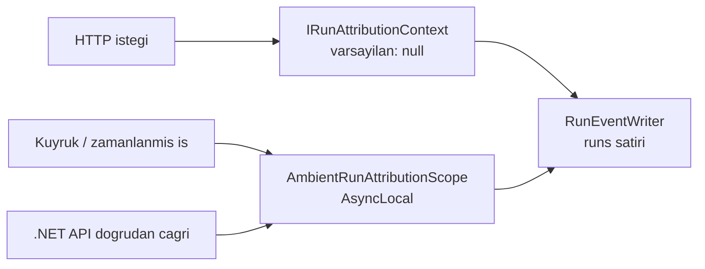

# Faz 68 — Çalıştırma Kimliği ve Token Kırılımı

> **Durum:** 📋 Planlandı (2026-08-18)
> **Kaynak:** [ADAYLAR.md](ADAYLAR.md) · **F-111**, **F-112**
> **Önkoşul:** [Faz 20](20-MALIYET-VE-GOSTERGE-PANELI.md) — maliyet hesabı ve gösterge paneli · [Faz 41](41-KIRACI-YALITIMININ-ZORLANMASI.md) — kiracı yalıtımı sözleşmesi
> **Paketler:** `AgentPrism.Abstractions`, `AgentPrism.Core`, `AgentPrism.Sql.Shared`, `AgentPrism.PostgreSql`, `AgentPrism.SqlServer`, `AgentPrism.Sqlite`, `AgentPrism.AspNetCore`, `AgentPrism.UI`
> **Yeni paket:** Yok · **Migration:** **gerekli — üç set** (`runs` tablosuna sütunlar). Numara uygulama anında alınır (K-178)
> **Public API:** **büyüyor — dört `sealed record` birden.** `RunRecord`, `RunStartInfo`, `RunUsage`, `RunCost` ve iki istatistik tipi. `PublicAPI.Shipped.txt` bugün **boş** (ölçüldü: 16 satır, hepsi `#nullable enable`) — şimdi bedava, Faz 7'den sonra F-50 dışında en pahalı değişiklik
> **Site etkisi:** `concepts/runs.md`, `guides/observability.md`, `reference/configuration.md`, `concepts/governance.md`
> **Manuel test alanı:** [`docs/manuel-test/12-GOZLEMLENEBILIRLIK-MALIYET.md`](manuel-test/12-GOZLEMLENEBILIRLIK-MALIYET.md)

---

## Bu Faza Başlarken

> `faz-baslangic` skill'ini uygula. Aşağıdaki liste o skill'in 2. adımıdır —
> **tamamını değil, yalnız işaret edilen bölümleri oku.**

1. Bu doküman
2. Kararlar — dosyanın tamamını **okuma**, yalnız bu kalemleri grep'le:
   ```bash
   grep -n "K-032\|K-027\|K-055\|K-178\|K-398\|K-394" docs/KARARLAR.md
   ```
   **K-032** (yerleşik model listesi yok; fiyat yapılandırmadan gelir),
   **K-027** (`jsonb` ile `json` ayrımı), **K-055** (OTel toplama `ActivityListener` ile),
   **K-178** (migration numaraları sağlayıcı başına), **K-398** (erken `DisposeAsync`'te
   kısmi `usage` yazılır), **K-394** (workflow'un tamamı tek `run` olarak kotaya yazılır).
3. Alan hafızası (bu faz üç alana dokunuyor):
   [`hafiza/cekirdek-calistirma.md`](hafiza/cekirdek-calistirma.md) (`RunRecording` zinciri, metrik) ·
   [`hafiza/sql-saglayicilari.md`](hafiza/sql-saglayicilari.md) (üç sağlayıcı, paylaşılan katman) ·
   [`hafiza/frontend.md`](hafiza/frontend.md) (sözlük, bundle bütçesi)
4. Gerektiğinde: [`MIMARI.md`](MIMARI.md) — veri modeli ve gözlemlenebilirlik bölümleri

---

## Amaç

AgentPrism bugün "hangi kiracı ne harcadı" sorusunu cevaplıyor. "Hangi
**kullanıcı**" ve "hangi **iş**" sorularını cevaplayamıyor. Aynı şekilde token
sayacı üç alandır; prompt caching'in kazancı ve reasoning token'ının payı
görünmüyor. Bu faz ikisini birlikte kapatır — ikisi de aynı `runs` satırına
yazılır ve ayrı planlanırsa aynı tabloya iki migration gider.

- **F-111** — çalıştırmaya kullanıcı kimliği ve etiket; kırılımın bu boyutlara açılması.
- **F-112** — cache ve reasoning token'larının ayrı kaydı ve ayrı fiyatlanması.

### Bugün ne çalışmıyor — doğrulanmış kanıt

| Kanıt | Gözlem |
|---|---|
| `grep -rn "UserId" src --include="*.cs" \| wc -l` → **0** | Kod tabanında kullanıcı kimliği kavramı **yok** |
| [`RunRecord.cs:14,35,38`](../src/AgentPrism.Abstractions/Runs/RunRecord.cs) | Yalnız `AgentName`, `TenantId`, `SessionId` |
| [`RunStatistics.cs:10-25`](../src/AgentPrism.Abstractions/Runs/RunStatistics.cs) | `RunStatisticsQuery` yalnız `AgentName` + `TenantId` + `StartedAfter` ile filtreler |
| [`0001_initial.sql:133-148`](../src/AgentPrism.PostgreSql/Migrations/0001_initial.sql) | `runs` tablosunda kullanıcı ve etiket sütunu yok |
| [`RunSupportTypes.cs:9,12,15`](../src/AgentPrism.Abstractions/Runs/RunSupportTypes.cs) | `RunUsage` üç alan: input · output · total |
| [`RunRecordingAgent.cs:1056-1063`](../src/AgentPrism.Core/Recording/RunRecordingAgent.cs) | `ToRunUsage` `UsageDetails`'ten yalnız üç sayacı alır; gerisi **atılır** |
| `Microsoft.Extensions.AI.Abstractions` **10.8.3** (repo'nun sabitlediği sürüm) | `UsageDetails` on üye taşır: `CachedInputTokenCount`, `ReasoningTokenCount`, `InputAudioTokenCount`, `InputTextTokenCount`, `OutputAudioTokenCount`, `OutputTextTokenCount`, `AdditionalCounts` |

> Kanıtlar 2026-08-18 tarihinde doğrulandı.

🚨 **Fiyatlandırma bugün yanlış yönde sapıyor.** `UsageDetails` sözleşme
dokümanı şunu yazar: *"Cached input tokens should be counted as part of
`InputTokenCount`."* `IRunPricingResolver` tüm girdiyi tam fiyattan hesapladığı
için, prompt caching açık bir agent'ın maliyeti **olduğundan yüksek**
raporlanır. Sapmanın büyüklüğü sağlayıcı fiyatına bağlıdır ve **ölçülmedi**.

---

## 68.1 — Kullanıcı kimliği güvenilir bir kaynaktan gelir

🚨 **Kullanıcı kimliği istek gövdesinden alınmaz.** `AgentRunRequest`'e bir
`UserId` alanı eklemek, herhangi bir istemcinin başka bir kullanıcı adına
harcama yazdırabilmesi demektir — maliyet kaydını doğrudan sahteleştirir.

Çözüm, kiracıda zaten kullanılan desendir:



- **`IRunAttributionContext`** — `ITenantContext`'in kardeşi. `TryAdd` ile
  kaydedilir, varsayılan uygulama **`null` döner** (K1: sürpriz yok, K4:
  tüketicinin kaydı kazanır). Tüketici bunu kendi kimlik hattına bağlar.
- **`AmbientRunAttributionScope`** — `AmbientTenantScope`'un birebir eşleniği;
  HTTP dışı yollar (kuyruk, zamanlanmış iş, alt `run`) için.

🚨 **`AsyncLocal` tuzağı bu fazda geçerlidir.** MEMORY'de dört kez kayıtlıdır:
`AsyncLocal` yazımı **çağırana geri akmaz**. Kapsam, kaydı yazan metodun
**kendi gövdesinde** açılır; akışlı yolda **her `MoveNextAsync` öncesi**
tekrarlanır. `AmbientTenantScope`'un bugünkü kullanım noktaları örnek alınmalıdır.

### Etiketler

Etiket, kullanıcı kimliğinden farklı bir sorudur: "bu `run` hangi **iş** için
yapıldı". Sözleşme küçük bir `string`→`string` sözlüğüdür ve `jsonb` bir sütuna
yazılır (K-027: düz sözlük için `jsonb` doğrudur, kazanç indekslenebilirliktir).

**Sınırlar plana yazılıyor:**

| Sınır | Değer | Neden |
|---|---|---|
| En çok etiket | 8 | Kardinalite kontrolü |
| Anahtar uzunluğu | 64 | Sorgu boyutu olarak kullanılabilir kalsın |
| Değer uzunluğu | 256 | Serbest metin deposu değildir |
| Aşımda davranış | İstek **reddedilir** | Sessiz kırpma veriyi bozar |

🚨 **Etiketler metrik etiketi DEĞİLDİR.** `agentprism.tokens` ve
`agentprism.run.cost` metriklerine eklenmezler. Serbest bir etiket kümesini
metrik boyutuna çevirmek zaman serisi kardinalitesini patlatır. Etiketler
yalnız **sorgu boyutudur** — `runs` tablosunda yaşar, `Meter`'da değil.
Aynı kural kullanıcı kimliği için de geçerlidir.

### Kişisel veri duruşu

**AgentPrism kişisel kimlik saklamaz.** `UserId` alanı **opak bir dizedir** ve
anlamını tüketici verir; AgentPrism onu ne çözer ne doğrular. Bu duruş
[Faz 64](64-DENETIM-ZINCIRI-VE-VERI-KONUSU-HAKLARI.md)'ün `IDataSubjectResolver`
kararıyla birebir aynıdır ve o fazın veri konusu silme akışı bu sütunu da
kapsamalıdır — iki faz aynı sırayla planlanmışsa 68 önce gelmelidir.

---

## 68.2 — Token kırılımı ve fiyat

`RunUsage` üç yeni alan alır. Sözleşme kuralı MEAI'den birebir devralınır:

| Alan | Nerede sayılır | Fiyat |
|---|---|---|
| `CachedInputTokens` | `InputTokens`'ın **içinde** | Cache okuma birim fiyatı |
| `ReasoningTokens` | `OutputTokens`'ın **içinde** | Bugün çıkış fiyatı; ayrı fiyat tanımlanabilir |
| `AudioInputTokens` / `AudioOutputTokens` | İlgili toplamın içinde | Ayrı birim fiyat |

Fiyat hesabı bu yüzden **çıkarmalı** olur:

```
tam_fiyatli_girdi = InputTokens - (CachedInputTokens ?? 0)
maliyet           = tam_fiyatli_girdi × girdi_fiyati
                  + (CachedInputTokens ?? 0) × cache_okuma_fiyati
                  + OutputTokens × cikti_fiyati
```

🚨 **İki kural bozulmaz:**

1. **Eksik bilgi `null` kalır, sıfır olmaz.** Bir sağlayıcı
   `CachedInputTokenCount` doldurmuyorsa alan `null`'dır ve fiyat bugünkü gibi
   tüm girdiyi tam fiyattan hesaplar. Sıfır yazmak "cache hiç kullanılmadı"
   demektir ve bu bir **iddiadır** — ölçüm değil.
2. **Cache fiyatı tanımsızsa maliyet `Unknown`'a düşmez.** Cache fiyatı yoksa
   cache token'ı normal girdi fiyatından hesaplanır ve sonuç bugünküyle aynı
   kalır. `PricingSource.Unknown` yalnız **model fiyatı** yokken kullanılır —
   var olan davranış korunur.

### Toplama noktaları

`RunUsage` üç yerde toplanıyor ve üçü de yeni alanları taşımalıdır:
`MergeUsage` ([`RunRecordingAgent.cs:1050`](../src/AgentPrism.Core/Recording/RunRecordingAgent.cs)),
`CompactionUsageAccumulator` ve `TreeUsage` (alt `run` ağacı).

🚨 **İmza değiştirmek ile gövdeyi kullanmak iki ayrı adımdır.** Faz 20'de
`RunEventWriter.CompleteAsync`'e `cost` parametresi eklendi ama nesne
başlatıcıya yazılmadı ve **1068 test yakalamadı**. Bu fazda dört yeni alan ×
üç toplama noktası vardır; `faz-uygulama` Adım 4'ün imza-gövde kontrol listesi
zorunludur.

---

## 68.3 — Kırılımın açılması

Yeni boyutlar üç yüzeyde görünür:

| Yüzey | Ne değişir |
|---|---|
| `RunStatisticsQuery` | `UserId` ve etiket filtreleri |
| `RunStatistics` | Kullanıcı kırılımı ve etiket kırılımı; `MaxAgents`'in eşleniği sınırlar |
| `GET /api/runs` | `userId` ve `label` sorgu parametreleri |
| Arayüz | Run listesinde filtre; gösterge panelinde token kırılım çubuğu |

**Arayüz payı:** Yeni bir grafik kütüphanesi **girmez**. Kırılım çubuğu var olan
bileşenlerle çizilir. Bugünkü bundle ölçüldü — `index-*.js.br` **140.614 B**,
`index-*.css.br` **5.490 B**; bütçe 250 KB gzip. Fazın payı kapanışta ölçülüp
yazılır.

**Yeni ekran metni** `locales/en.ts` **ve** `tr.ts` içine girer; eksik anahtar
derleme hatasıdır (K-228).

---

## Planlanan Public API

> Taslak imzalardır. Gerçekleşen imzalar kapanışta ayrı bir bölüme yazılır.

```csharp
// AgentPrism.Abstractions
/// <summary>Resolves who a run belongs to. Returns null by default.</summary>
public interface IRunAttributionContext
{
    string? UserId { get; }
    IReadOnlyDictionary<string, string>? Labels { get; }
}

public static class AmbientRunAttributionScope
{
    public static string? CurrentUserId { get; }
    public static IReadOnlyDictionary<string, string>? CurrentLabels { get; }
    public static IDisposable Begin(string? userId, IReadOnlyDictionary<string, string>? labels);
}

public sealed record RunUsage
{
    public long? InputTokens { get; init; }
    public long? OutputTokens { get; init; }
    public long? TotalTokens { get; init; }

    /// <summary>Cached input tokens. Counted INSIDE InputTokens. Null when the provider does not report it.</summary>
    public long? CachedInputTokens { get; init; }

    /// <summary>Reasoning tokens. Counted INSIDE OutputTokens.</summary>
    public long? ReasoningTokens { get; init; }

    public long? AudioInputTokens { get; init; }
    public long? AudioOutputTokens { get; init; }
}

public sealed record RunCost
{
    public decimal? InputCost { get; init; }
    public decimal? OutputCost { get; init; }
    public decimal? CachedInputCost { get; init; }
    public string? Currency { get; init; }
    public required PricingSource Source { get; init; }
}

public sealed record RunRecord
{
    public string? UserId { get; init; }
    public IReadOnlyDictionary<string, string>? Labels { get; init; }
}
```

### HTTP `endpoint`'leri

| Metot | Yol | Rol | Ne yapar |
|---|---|---|---|
| `GET` | `/api/runs?userId=&label=k:v` | Reader | Yeni boyutlarla filtreler |
| `GET` | `/api/stats?groupBy=user\|label` | Reader | Yeni kırılımı döner |

🚨 `POST /api/agents/{name}/run` gövdesi **değişmez**. Kullanıcı kimliği
istemciden alınmaz.

### Arayüz payı

Ölçülecek. Yeni bağımlılık yok; bugünkü toplam 146.104 B brotli
(140.614 + 5.490), bütçe 250 KB gzip.

---

## Planlanan Dosya Listesi

```
src/AgentPrism.Abstractions/Runs/
├── RunSupportTypes.cs                  (değişir — RunUsage, RunCost)
├── RunRecord.cs                        (değişir — UserId, Labels)
├── RunStatistics.cs                    (değişir — sorgu ve kırılım)
├── IRunAttributionContext.cs           (YENİ)
└── AmbientRunAttributionScope.cs       (YENİ)

src/AgentPrism.Core/
├── Recording/RunRecordingAgent.cs      (değişir — ToRunUsage, MergeUsage, kayıt)
├── Recording/RunEventWriter.cs         (değişir — yeni sütunlar)
├── Recording/CompactionUsageAccumulator.cs (değişir)
├── Models/RunPricingResolver.cs        (değişir — çıkarmalı hesap)
└── Runs/DefaultRunAttributionContext.cs (YENİ — null döner)

src/AgentPrism.Sql.Shared/Stores/SqlRunStore.cs   (değişir)
src/AgentPrism.{PostgreSql,SqlServer,Sqlite}/Migrations/NNNN_run_attribution.sql (YENİ ×3)
src/AgentPrism.AspNetCore/                        (filtreler, sözleşme)
src/AgentPrism.UI/                                (filtre + kırılım çubuğu + locales)
```

---

## Hata Modları ve Testler

| Ne bozulabilir | Seviye | Test sınıfı |
|---|---|---|
| `UserId` istek gövdesinden set edilebilir | Fonksiyonel (HTTP) | `RunAttributionSpoofingTests` |
| Başka kiracının kullanıcı kırılımı görünür | Sözleşme (`TenantIsolationContract`) | dört koşumda birden |
| Yeni alan `MergeUsage`'da düşer (alt `run` ağacı) | Fonksiyonel | `RunTreeUsageTests` |
| Yeni alan `CompactionUsageAccumulator`'da düşer | Birim | `CompactionUsageTests` |
| Akışlı yolda `AsyncLocal` kapsamı kaybolur | Fonksiyonel (SSE) | `AmbientAttributionStreamingTests` |
| Sağlayıcı cache token'ı bildirmiyor → alan `0` yazılır | Birim | `RunUsageMappingTests` |
| Cache fiyatı tanımsızken maliyet `Unknown`'a düşer | Birim | `PricingResolverCacheTests` |
| Etiket sayısı/uzunluğu sınırı aşılınca sessiz kırpılır | Fonksiyonel (HTTP) | `RunLabelValidationTests` |
| Etiket metrik boyutuna sızar → kardinalite patlar | Birim | `TelemetryTagTests` — metrik etiket kümesi **sabitlenir** |
| Erken `DisposeAsync`'te kısmi kırılım yazılmaz (K-398) | Fonksiyonel | mevcut K-398 testi genişletilir |
| Üç sağlayıcıda sütun tipi ayrışır | Sözleşme | `tests/Shared/Contracts/` |
| `jsonb` etiket sorgusu SQLite'ta çalışmaz | Sözleşme | üç sağlayıcı + bellek |

**Beş soru:** iptal — iptal edilen `run` kısmi kırılımı yazar (K-398) ·
eşzamanlılık — aynı kullanıcının paralel `run`'ları · boş/aşırı girdi — etiket
sınırları · başka kiracı — sözleşme testi · alt sistem hatası — kayıt yazımı
düşerse `run` **devam eder** (var olan kural).

---

## Manuel Kabul Case'leri

| # | Ön koşul | Adımlar | Beklenen sonuç |
|---|---|---|---|
| 1 | `IRunAttributionContext` kayıtlı değil | Bir `run` çalıştır | `run` başarılı; `user_id` ve etiket `NULL`. Hiçbir davranış değişmez |
| 2 | Kimlik hattına bağlı bir uygulama | İki farklı kullanıcıyla birer `run` | `GET /api/stats?groupBy=user` iki satır döner, toplamları doğru |
| 3 | Aynı ortam | `POST .../run` gövdesine `userId` alanı eklenerek istek | Alan **yok sayılır**; kayıt kimlik hattındaki kullanıcıyı gösterir |
| 4 | Prompt caching açık Anthropic agent'ı | Aynı uzun ön ekle iki `run` | İkinci `run`'da `CachedInputTokens > 0`; maliyet birinciden **düşük** |
| 5 | Cache fiyatı tanımsız | Aynı senaryo | Maliyet bugünküyle aynı; `PricingSource` `Unknown` **değil** |
| 6 | Dokuz etiketli istek | `run` gönder | `400`; mesaj sınırı söyler |
| 7 | Alt agent çağıran bir agent | Bir `run` | `TreeUsage` kırılımı alt `run`'ların cache token'ını da toplar |
| 8 | Arayüz | Run listesinde kullanıcıya göre filtrele | 👤 Liste daralır; gösterge panelinde kırılım çubuğu görünür |

---

## Açık Sorular

| # | Soru | Seçenekler | Öneri |
|---|---|---|---|
| 1 | Etiketler ayrı tabloya mı `jsonb` sütuna mı? | A: `jsonb` sütun · B: `run_labels` tablosu | **A** — K-027 düz sözlük için `jsonb` diyor; sekiz etiket sınırıyla ayrı tablo aşırıdır. B'nin tek üstünlüğü indeksleme ve `jsonb` GIN indeksi bunu zaten verir |
| 2 | Reasoning token'ı ayrı fiyatlansın mı? | A: bugün çıkış fiyatı, alan ileriye açık · B: hemen ayrı fiyat alanı | **A** — sağlayıcıların çoğu bugün ayrı fiyatlamıyor; ölçülmemiş bir ayrım için fiyat şeması büyütülmez (K-032 çizgisi) |
| 3 | Ses token'ları bu fazda mı? | A: alanlar eklensin, fiyat sonra · B: tamamen kapsam dışı | **A** — aynı `record`'a ikinci kez dokunmak Faz 7'den sonra kırıcıdır; alanı şimdi açmak bedava |
| 4 | Kullanıcı kırılımında kaç satır dönsün? | A: `MaxAgents` gibi sabit tavan · B: sayfalama | **A** — istatistik ucu özet döner; sayfalama `GET /api/runs`'un işidir |

---

## Bitiş Ölçütleri (DoD)

- [ ] `IRunAttributionContext` kayıtlı değilken hiçbir davranış değişmez;
      `user_id` ve etiket `NULL` yazılır
- [ ] İstek gövdesine konan `userId` **yok sayılır** (test kanıtıyla)
- [ ] `GET /api/stats?groupBy=user` doğru toplamlar döner
- [ ] Cache token'ı bildiren bir sağlayıcıda maliyet, cache oranı uygulanarak
      hesaplanır; komut ve çıktı belgeye yazıldı
- [ ] Cache token'ı bildirmeyen sağlayıcıda alan `null` kalır — **sıfır değil**
- [ ] Etiket sınırı aşımı `400` verir
- [ ] Metrik etiket kümesi değişmedi (kardinalite testi yeşil)
- [ ] Üç SQL sağlayıcısı + bellek içi sözleşme koşumları geçer
- [ ] Dört doğrulama kapısı sıfır uyarı verir
- [ ] `samples/AgentPrism.Api` ile gerçek `run` yapıldı, çıktı belgeye yazıldı
- [ ] `secret` taraması boş döndü
- [ ] Manuel kabul case'leri
      [`docs/manuel-test/12-GOZLEMLENEBILIRLIK-MALIYET.md`](manuel-test/12-GOZLEMLENEBILIRLIK-MALIYET.md)
      içine eklendi; otomatikleştirilebilenler koşuldu
- [ ] `faz-denetim` koşuldu; 🔴 bulgu kalmadı
- [ ] `docs-site/` güncellendi; `npm run build` + `check-links.mjs` temiz
- [ ] `en.ts` ve `tr.ts` eksiksiz; bundle payı ölçüldü ve yazıldı

### Doğrulama komutları

```bash
# Kullanıcı kırılımı
curl -s "http://localhost:5081/agentprism/api/stats?groupBy=user" | jq

# Cache token'ı gerçekten ayrı yazılmış mı
curl -s "http://localhost:5081/agentprism/api/runs?take=1" | jq '.items[0].usage'
```

---

## Riskler

| Risk | Önlem |
|------|-------|
| Dört yeni alan üç toplama noktasının birinde düşer | `faz-uygulama` Adım 4 imza-gövde listesi; `RunTreeUsageTests` ve `CompactionUsageTests` zorunlu |
| Etiketler metrik boyutuna sızar | Metrik etiket kümesini **sabitleyen** bir birim testi DoD'de |
| `AsyncLocal` kapsamı akışlı yolda kaybolur | MEMORY'deki dört vaka okunur; `AmbientTenantScope` kullanım noktaları örnek alınır |
| `UserId` kişisel veri sorumluluğu doğurur | Alan opaktır; Faz 64 silme akışı bu sütunu kapsayacak şekilde planlanır |
| Cache hesabı çıkarmalı olduğu için negatife düşebilir | `InputTokens < CachedInputTokens` durumu **veri hatasıdır**: kırpma yapılmaz, uyarı loglanır ve tam fiyat uygulanır |
| Faz 7'den sonraya kalır | Dört `record` birden kırıcı olur; F-50 dışında en pahalı kalem — sıralamada öne alınmalı |

---

<!-- ============================================================
     AŞAĞISI KAPANIŞTA DOLDURULUR — `faz-tamamlama` skill'i.
     Plan anında boş kalır. Başlıkları SİLME.
     ============================================================ -->

## Plandan Sapmalar

> Kapanışta doldurulur.

## Bu Fazda Verilen Kararlar

> Kapanışta doldurulur. K-NNN numaraları burada alınır; plan numara rezerve etmez.

## Gerçekleşen Public API

> Kapanışta doldurulur.

## Dosya Listesi (gerçekleşen)

> Kapanışta doldurulur.

## Denetim Bulguları

> Kapanışta doldurulur.

## Sonraki Faza Devir Notu

> Kapanışta doldurulur.
