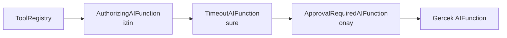

# Faz 69 — Tool Yetkilendirmesi ve Yürütme Timeout'u

> **Durum:** 📋 Planlandı (2026-08-18)
> **Kaynak:** [ADAYLAR.md](ADAYLAR.md) · **F-113**, **F-114**
> **Önkoşul:** [Faz 6](06-GOZLEMLENEBILIRLIK.md) — tool onayı ve `ApprovalRequiredAIFunction` sarmalaması · [Faz 9](09-YONETISIM-VE-DENETIM-IZI.md) — rol politikaları ve denetim izi
> **Paketler:** `AgentPrism.Abstractions`, `AgentPrism.Core`, `AgentPrism.Generators`, `AgentPrism.AspNetCore`, `AgentPrism.UI`
> **Yeni paket:** Yok · **Migration:** **gerekli — üç set** (`tool_invocations` tablosuna yetki kararı ve timeout alanı). Numara uygulama anında alınır (K-178)
> **Public API:** **büyüyor** — `ToolDescriptor` ve tool attribute'u alan alır, iki yeni arayüz gelir. `PublicAPI.Shipped.txt` bugün **boş** — şimdi bedava
> **Site etkisi:** `concepts/tools.md`, `concepts/governance.md`, `getting-started/tools.md`, `getting-started/security.md`
> **Manuel test alanı:** [`docs/manuel-test/13-KIRACI-VE-GUVENLIK.md`](manuel-test/13-KIRACI-VE-GUVENLIK.md)

---

## Bu Faza Başlarken

> `faz-baslangic` skill'ini uygula. Aşağıdaki liste o skill'in 2. adımıdır —
> **tamamını değil, yalnız işaret edilen bölümleri oku.**

1. Bu doküman
2. Kararlar — dosyanın tamamını **okuma**, yalnız bu kalemleri grep'le:
   ```bash
   grep -n "K-218\|K-368\|K-367\|K-178" docs/KARARLAR.md
   ```
   **K-218** (🚨 tool'un gördüğü servis sağlayıcı **boştur**), **K-368**
   (onay kararından sonra **yeni** bir `run` açılır), **K-367** (onay yüzeyi
   denetimi istek bazlı filtreye taşındı), **K-178** (migration numaraları).
3. [`06-GOZLEMLENEBILIRLIK.md`](06-GOZLEMLENEBILIRLIK.md) — yalnız devir notu:
   ```bash
   awk '/## Sonraki Faza Devir Notu/,0' docs/06-GOZLEMLENEBILIRLIK.md
   ```
   Onay sarmalamasının hangi katmanda durduğunu devralıyorsun.
4. Alan hafızası (bu faz iki alana dokunuyor):
   [`hafiza/maf-api.md`](hafiza/maf-api.md) (`AIFunction`, `DelegatingAIFunction`) ·
   [`hafiza/cekirdek-calistirma.md`](hafiza/cekirdek-calistirma.md) (tool çağrı turu, K-218)

---

## Amaç

AgentPrism bugün bir tool'un çağrılmasına **insan** kapısı koyabiliyor (onay),
ama **izin** kapısı koyamıyor. "Bu kullanıcı bu tool'u hiç çağırabilir mi"
sorusu sözleşmede yoktur. Aynı şekilde bir tool'un yürütmesi süresizdir. Bu faz
ikisini birlikte kapatır: ikisi de aynı `ToolDescriptor` kaydına yazılır ve aynı
sarmalama noktasında uygulanır.

- **F-113** — tool başına gerekli izin adı, etki sınıfı ve değiştirilebilir bir
  yetkilendirme kancası.
- **F-114** — tool başına yürütme timeout'u.

🚨 **Onay ile izin farklı şeylerdir.** Onay "bu sefer olur mu" der ve insana
sorar. İzin "bu kullanıcı bunu hiç yapabilir mi" der ve politikaya sorar. İkisi
birbirinin yerine geçmez; bu faz ikincisini ekler, birincisini korur.

### Bugün ne çalışmıyor — doğrulanmış kanıt

| Kanıt | Gözlem |
|---|---|
| [`ToolDescriptor.cs:7-50`](../src/AgentPrism.Abstractions/Tools/ToolDescriptor.cs) | Altı alan: `Name`, `Description`, `JsonSchema`, `RequiresApproval`, `Source`, `RunsOnClient`. İzin, etki ve timeout **yok** |
| `grep -rn "IToolAuthoriz\|ToolAuthorization" src --include="*.cs" \| wc -l` → **0** | Yetkilendirme kavramı kod tabanında yok |
| [`AgentPrismToolRegistration.cs:45-51`](../src/AgentPrism.Abstractions/Tools/AgentPrismToolRegistration.cs) | Kayıt üç şey taşır: `Function`, `RequiresApproval`, `Source` |
| [`AgentPrismOptions.cs:71`](../src/AgentPrism.Core/AgentPrismOptions.cs) | `McpTimeout` — yalnız MCP bağlantısı |
| [`AgentPrismOptions.cs:210`](../src/AgentPrism.Core/AgentPrismOptions.cs) | Skill script timeout'u — yalnız script yolu |
| [`ToolRegistry.cs:35-52`](../src/AgentPrism.Core/Tools/ToolRegistry.cs) | Sarmalama **registry'de** yapılır ve kod yorumu bunu açıkça gerekçelendirir: *"the only place that enforces the rule"* |

> Kanıtlar 2026-08-18 tarihinde doğrulandı.

**Ekosistem (2026-08-18):** LiteLLM tool başına izin/ret kuralı (*tool
permission guardrail*) ve MCP tool'ları için anahtar/takım/organizasyon bazlı
izin yönetimi sunuyor; Portkey MCP Gateway takım seviyesinde tool izni veriyor.
.NET tarafında karşılığı yok.

---

## 69.1 — Sarmalama noktası zaten doğru yerde

`ToolRegistry` onay sarmalamasını neden kendi içinde yaptığını kodda
gerekçelendirmiş: *"an agent can only refer to a registered tool" kuralını
zorlayan tek yer burasıdır; onayı burada uygulamak başka bir kod yolunun bunu
atlamasını engeller.*

Aynı gerekçe izin ve timeout için de geçerlidir. Üç sarmalayıcı zincir olur:



**Sıra rastgele değildir ve plan bunu sabitler:**

| Sıra | Katman | Neden burada |
|---|---|---|
| 1 | **İzin** | En dışta. İzin yoksa onay istemenin anlamı yok — kullanıcıya yapamayacağı bir işi onaylatmak yanlış |
| 2 | **Timeout** | Onayın **dışında**. İnsanın onay bekleme süresi tool'un yürütme süresi değildir |
| 3 | **Onay** | Var olan davranış korunur |

🚨 Timeout'un onayın dışında durması bu fazın en kolay kaçırılacak kararıdır.
Ters sırada, bir gece bekleyen onay isteği timeout'a düşer.

### 🚨 K-218 — kanca bağımlılığını kurulum anında al

MAF, `AIFunctionArguments.Services` olarak **`EmptyServiceProvider`** geçirir.
Yani sarmalayıcı, yetkilendirme kancasını çağrı anında DI'dan **çözemez**.
Bağımlılık `ToolRegistry` kurulurken kurucuya verilir. Bu tuzak bu repoda
K-218 olarak kayıtlıdır ve izole bir konsol probunda **çalışıyor görünmüştü** —
entegre davranışı yalnız gerçek bir `run` kanıtlar.

---

## 69.2 — Etki sınıfı ve izin adı

```csharp
public enum ToolEffect { Read, Write, Destructive, External }
```

| Değer | Anlamı | Arayüzde |
|---|---|---|
| `Read` | Yan etkisi yok | Nötr |
| `Write` | Kalıcı veri değiştirir | Sarı |
| `Destructive` | Geri alınamaz | 🔴 Kırmızı |
| `External` | Veri süreç dışına çıkar | Turuncu |

Etki sınıfı **bilgidir, kapı değildir** — kapıyı izin ve onay kurar. Değeri
üçtür: arayüzde okunur, denetim kaydına yazılır, ve
[Faz 63](63-ARGUMAN-DUZEYINDE-ONAY-POLITIKASI.md)'ün kalıcı onay kuralları için
doğal bir kapsam anahtarı olur.

`RequiredPermission` **opak bir dizedir**. AgentPrism onu çözmez, yorumlamaz,
saklamaz — yalnız kancaya verir.

### Kanca sözleşmesi

```csharp
public interface IToolAuthorizationHandler
{
    ValueTask<ToolAuthorizationResult> AuthorizeAsync(
        ToolAuthorizationRequest request,
        CancellationToken cancellationToken = default);
}
```

**K1 gereği varsayılan uygulama her şeye izin verir.** `AddAgentPrism()` tek
başına bugünkü gibi çalışır. **K4 gereği `TryAdd` ile kaydedilir**; tüketici
kendi uygulamasını önce kaydederse onunki kazanır.

### Ret modele nasıl bildirilir

🚨 Bu, fazın ikinci kritik kararıdır. Bir tool reddedildiğinde `run` **düşmez**.
Model tool sonucu olarak **açık bir ret metni** alır ve turuna devam eder.

Gerekçe: yetkisiz bir çağrı bir hata değil, bir **sınırdır**. `run`'ı
düşürmek, modelin izinli bir alternatifi denemesini engeller ve kullanıcıya
altyapı hatası gibi görünür. Ret metni İngilizcedir ve modele veri olarak gider;
K-232 kapsamındadır.

### İzin, tool'un modele gösterilmesini de etkiler mi?

**Hayır — bu fazda değil.** Şema derleme anında oluşur, izin ise çalışma anında
kullanıcıya bağlıdır; ikisini birleştirmek derlenmiş agent önbelleğini
(`CompiledAgentCache`) kullanıcı başına ayırmayı gerektirir. Bu ölçülmemiş bir
maliyettir ve **kapsam dışıdır**. Açık Soru 3'e yazıldı.

---

## 69.3 — Timeout

Her tool kaydı bir timeout taşır. Varsayılan `AgentPrismOptions` üzerinden
gelir; tool kaydı kendi değerini verebilir.

**Üç kural:**

1. **Timeout iptalden ayrı bir hata sınıfıdır.** `RunErrorClass`'a ayrı bir
   değer girer, yoksa `DefaultRunErrorClassifier` kullanıcı iptaliyle karıştırır.
2. **Timeout circuit breaker sayacına girmez.** İptal ve guard blokları gibi
   davranır — sağlayıcı sağlığının göstergesi değildir.
3. **Timeout `run`'ı düşürmez.** İzin reddi gibi, modele bir tool hatası olarak
   döner ve tur devam eder.

Süre aşımı `ToolFailed` olayı üretir ve `tool_invocations` kaydına yazılır.

🚨 **İptal etmek ile durdurmak aynı şey değildir.** `CancellationToken`
işbirlikçidir; token'ı hiç okumayan bir tool gövdesi çalışmaya devam eder.
Timeout o gövdeyi **öldüremez**. Plan bunu vaat etmez: timeout `run`'ın
beklemesini keser, tool sürecini değil. Doküman bunu açıkça yazmalıdır, yoksa
tüketici yanlış bir güvence varsayar.

---

## Planlanan Public API

> Taslak imzalardır. Gerçekleşen imzalar kapanışta ayrı bir bölüme yazılır.

```csharp
// AgentPrism.Abstractions
public enum ToolEffect { Read = 0, Write = 1, Destructive = 2, External = 3 }

public sealed record ToolDescriptor
{
    public ToolEffect Effect { get; init; }          // varsayılan Read
    public string? RequiredPermission { get; init; }
    public TimeSpan? Timeout { get; init; }
}

public sealed record ToolAuthorizationRequest
{
    public required string ToolName { get; init; }
    public required ToolEffect Effect { get; init; }
    public string? RequiredPermission { get; init; }
    public required string TenantId { get; init; }
    public string? UserId { get; init; }             // Faz 68 varsa dolar
    public required Guid RunId { get; init; }
    public required string AgentName { get; init; }
}

public sealed record ToolAuthorizationResult
{
    public required bool IsAllowed { get; init; }
    /// <summary>Shown to the model as the tool result. English (K-232).</summary>
    public string? Reason { get; init; }

    public static ToolAuthorizationResult Allow();
    public static ToolAuthorizationResult Deny(string reason);
}

public interface IToolAuthorizationHandler
{
    ValueTask<ToolAuthorizationResult> AuthorizeAsync(
        ToolAuthorizationRequest request,
        CancellationToken cancellationToken = default);
}
```

Tool attribute'u (`AgentPrismToolAttribute`) aynı üç alanı alır ve
`AgentPrism.Generators` üretilen kayda taşır.

### HTTP `endpoint`'leri

| Metot | Yol | Rol | Ne yapar |
|---|---|---|---|
| `GET` | `/api/tools` | Reader | Yanıta `effect`, `requiredPermission`, `timeout` eklenir |

Yeni uç yok.

### Arayüz payı

Tool kataloğuna etki rozeti ve izin sütunu. Yeni bağımlılık yok. Bugünkü bundle
146.104 B brotli; fazın payı kapanışta ölçülür. Yeni metin `en.ts` **ve**
`tr.ts` içine girer (K-228).

---

## Planlanan Dosya Listesi

```
src/AgentPrism.Abstractions/Tools/
├── ToolDescriptor.cs                   (değişir)
├── AgentPrismToolAttribute.cs          (değişir)
├── AgentPrismToolRegistration.cs       (değişir)
├── ToolEffect.cs                       (YENİ)
├── IToolAuthorizationHandler.cs        (YENİ)
└── ToolAuthorizationTypes.cs           (YENİ)

src/AgentPrism.Core/Tools/
├── ToolRegistry.cs                     (değişir — üç katmanlı sarmalama)
├── AuthorizingAIFunction.cs            (YENİ — DelegatingAIFunction)
├── TimeoutAIFunction.cs                (YENİ — DelegatingAIFunction)
├── AllowAllToolAuthorizationHandler.cs (YENİ — varsayılan)
└── ToolMethodScanner.cs                (değişir)

src/AgentPrism.Generators/             (değişir — üç yeni alan)
src/AgentPrism.Abstractions/Runs/RunErrorClass.cs (değişir — ToolTimeout)
src/AgentPrism.{PostgreSql,SqlServer,Sqlite}/Migrations/NNNN_tool_governance.sql (YENİ ×3)
src/AgentPrism.AspNetCore/             (sözleşme alanları)
src/AgentPrism.UI/                     (etki rozeti + locales)
```

---

## Hata Modları ve Testler

| Ne bozulabilir | Seviye | Test sınıfı |
|---|---|---|
| Kanca `EmptyServiceProvider`'dan çözülmeye çalışılır (K-218) | Fonksiyonel (gerçek `run`) | `ToolAuthorizationWiringTests` |
| Sarmalama sırası bozulur → onay beklerken timeout | Fonksiyonel | `ToolWrapperOrderTests` |
| Reddedilen tool `run`'ı düşürür | Fonksiyonel | `ToolDenialContinuesRunTests` |
| Ret metni modele hiç ulaşmaz | Fonksiyonel | aynı sınıf |
| Timeout iptalle aynı hata sınıfına düşer | Birim | `RunErrorClassifierTests` |
| Timeout circuit breaker'ı açar | Birim | `CircuitBreakerCountingTests` |
| Token okumayan tool timeout'ta asılı kalır | Fonksiyonel | `ToolTimeoutNonCooperativeTests` — **belgelenmiş sınır** |
| İstemci tarafı tool onay/izin sarmalamasını kırar | Fonksiyonel | `ClientToolGovernanceTests` |
| MCP kaynaklı tool'da etki sınıfı tanımsız kalır | Birim | `McpToolDescriptorTests` — varsayılan `External` |
| Kaynak üreteci yeni alanları taşımaz | Birim (üreteç anlık görüntüsü) | `GeneratorSnapshotTests` |
| Başka kiracının izin kararı sızar | Sözleşme | `TenantIsolationContract` |
| Kanca hata fırlatırsa `run` düşer | Fonksiyonel | `ToolAuthorizationFailureTests` — **ret sayılır**, açık davranış |

**Beş soru:** iptal — timeout ile kullanıcı iptali ayrı sınıflar · eşzamanlılık —
aynı tool'un paralel çağrıları · boş/aşırı girdi — `RequiredPermission` boş
dizeyse **kayıt hatası** · başka kiracı — sözleşme testi · alt sistem hatası —
kanca patlarsa ret sayılır ve loglanır.

---

## Manuel Kabul Case'leri

| # | Ön koşul | Adımlar | Beklenen sonuç |
|---|---|---|---|
| 1 | Kanca kayıtlı değil | Herhangi bir tool'u çağıran `run` | Bugünkü davranış birebir; hiçbir şey değişmez |
| 2 | Her şeyi reddeden bir kanca | Aynı `run` | Model ret metnini alır, tura devam eder, `run` **başarılı** biter |
| 3 | Aynı ortam | `GET /api/runs/{id}` olay akışı | `ToolFailed` yerine yetki reddi ayırt edilebilir |
| 4 | 1 sn timeout'lu, 5 sn uyuyan tool | `run` | ~1 sn'de tool hatası; `run` devam eder; hata sınıfı `ToolTimeout` |
| 5 | Aynı tool, arka arkaya 6 kez | `run`'lar | Circuit breaker **açılmaz** |
| 6 | `Destructive` + `RequiresApproval` tool | `run` → onay iste → 2 dk bekle → onayla | Onay süresi timeout'a **düşmez**; onaydan sonra tool çalışır |
| 7 | Arayüz | Tool kataloğunu aç | 👤 `Destructive` kırmızı, `External` turuncu; izin adı görünür |
| 8 | Token okumayan tool + 1 sn timeout | `run` | `run` 1 sn'de devam eder; tool gövdesinin arkada bittiği loglanır. **Belgelenmiş sınır** |

---

## Açık Sorular

| # | Soru | Seçenekler | Öneri |
|---|---|---|---|
| 1 | [Faz 63](63-ARGUMAN-DUZEYINDE-ONAY-POLITIKASI.md) önce mi gelmeli? | A: 63 önce · B: 69 önce | **B** — 69 `ToolDescriptor`'a alan ekler, 63 `ToolApprovalRule`'a. 69 önce giderse 63 etki sınıfını kapsam anahtarı olarak kullanabilir; tersi durumda 63 bunu sonradan eklemek zorunda kalır |
| 2 | Kanca hata fırlatırsa? | A: ret sayılır · B: `run` düşer | **A** — açık kapı (fail-open) bir güvenlik kapısında kabul edilemez. Kapalı kapı (fail-closed) doğrudur ve loglanır |
| 3 | İzin, tool'un modele gösterilmesini de kısıtlasın mı? | A: hayır, yalnız yürütme · B: evet, şemadan da düşsün | **A** bu fazda — B, `CompiledAgentCache`'i kullanıcı başına ayırmayı gerektirir; maliyeti ölçülmedi. Ayrı bir aday kalemi olabilir |
| 4 | MCP kaynaklı tool'un varsayılan etkisi? | A: `External` · B: `Unknown` | **A** — tanım uzak bir sunucudadır ve değişebilir; en temkinli sınıf doğrudur |
| 5 | Timeout varsayılanı kaç? | A: 30 sn (skill script ile aynı) · B: sınırsız | **A** — B bugünkü davranıştır ve fazın amacını boşa çıkarır. Değer **ölçülmedi**; ilk koşumdan sonra gözden geçirilmeli |

---

## Bitiş Ölçütleri (DoD)

- [ ] Kanca kayıtlı değilken hiçbir davranış değişmez (test kanıtıyla)
- [ ] Reddedilen tool çağrısı `run`'ı düşürmez; ret metni modele ulaşır
- [ ] Kanca `EmptyServiceProvider` üzerinden çözülmeye **çalışılmaz** —
      gerçek bir `run` ile kanıtlandı (K-218)
- [ ] 1 sn timeout'lu bir tool ~1 sn'de kesilir; hata sınıfı `ToolTimeout`
- [ ] Timeout circuit breaker sayacını **artırmaz**
- [ ] Onay bekleme süresi timeout'a düşmez (Case 6)
- [ ] `GET /api/tools` yeni üç alanı döner
- [ ] Kaynak üreteci üç yeni alanı taşır
- [ ] Dört doğrulama kapısı sıfır uyarı verir
- [ ] `samples/AgentPrism.Api` ile gerçek `run` yapıldı, çıktı belgeye yazıldı
- [ ] `secret` taraması boş döndü
- [ ] Manuel kabul case'leri
      [`docs/manuel-test/13-KIRACI-VE-GUVENLIK.md`](manuel-test/13-KIRACI-VE-GUVENLIK.md)
      içine eklendi; otomatikleştirilebilenler koşuldu
- [ ] `faz-denetim` koşuldu; 🔴 bulgu kalmadı
- [ ] `docs-site/` güncellendi; `npm run build` + `check-links.mjs` temiz
- [ ] `en.ts` ve `tr.ts` eksiksiz; bundle payı ölçüldü ve yazıldı

### Doğrulama komutları

```bash
# Yeni alanlar sözleşmede mi
curl -s http://localhost:5081/agentprism/api/tools | jq '.[0]'

# Timeout gerçekten kesiyor mu — sure olculur
time curl -s -X POST http://localhost:5081/agentprism/api/agents/slow/run \
  -H 'content-type: application/json' -d '{"message":"call the slow tool"}'
```

---

## Riskler

| Risk | Önlem |
|------|-------|
| 🚨 K-218 tuzağı tekrar eder — izole prob çalışır, gerçek `run` çalışmaz | Kanca kurulum anında kurucuya verilir; DoD gerçek `run` kanıtı ister |
| Sarmalama sırası ters kurulur → onay timeout'a düşer | `ToolWrapperOrderTests` ve Manuel Case 6 |
| Timeout "tool'u durdurur" sanılır | Doküman ve XML yorumu işbirlikçi iptali açıkça yazar; Case 8 sınırı belgeler |
| Faz 63 ile aynı yere iki kez dokunulur | Açık Soru 1 karara bağlanır; 69 önce gitmelidir |
| Ret metni kullanıcıya İngilizce görünür | Metin **modele** gider, kullanıcıya değil. Arayüz kendi metnini gösterir (K-232) |
| `ToolDescriptor` Faz 7'den sonra elden geçer | İki kalem tek fazda; ikinci bir alan ekleme turu olmaz |

---

<!-- ============================================================
     AŞAĞISI KAPANIŞTA DOLDURULUR — `faz-tamamlama` skill'i.
     Plan anında boş kalır. Başlıkları SİLME.
     ============================================================ -->

## Plandan Sapmalar

> Kapanışta doldurulur.

## Bu Fazda Verilen Kararlar

> Kapanışta doldurulur. K-NNN numaraları burada alınır; plan numara rezerve etmez.

## Gerçekleşen Public API

> Kapanışta doldurulur.

## Dosya Listesi (gerçekleşen)

> Kapanışta doldurulur.

## Denetim Bulguları

> Kapanışta doldurulur.

## Sonraki Faza Devir Notu

> Kapanışta doldurulur.
